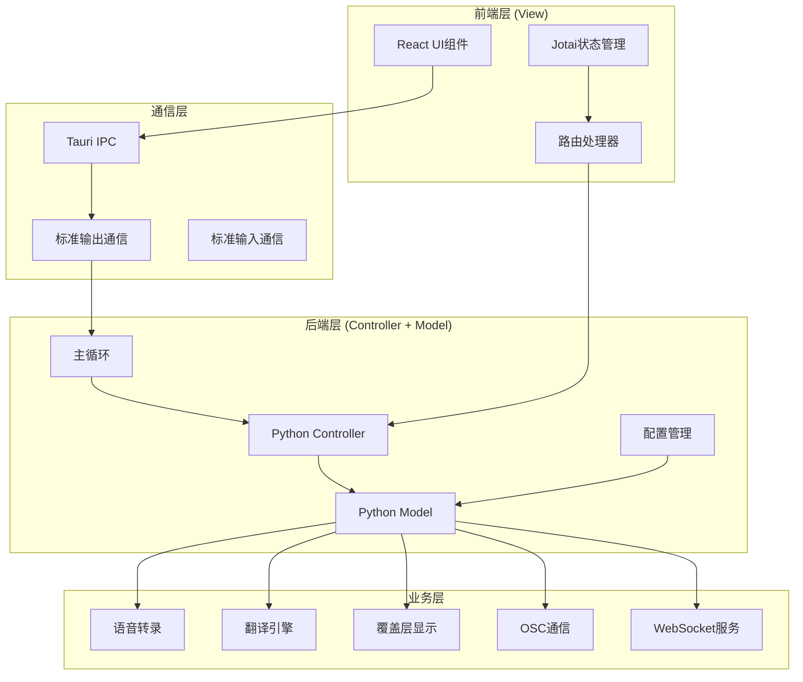
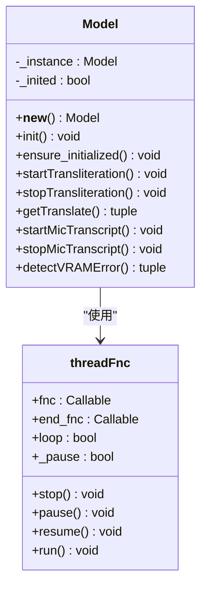
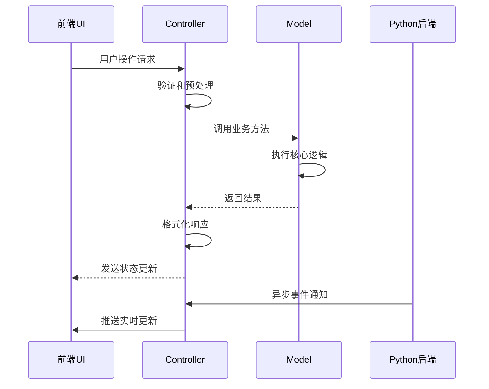
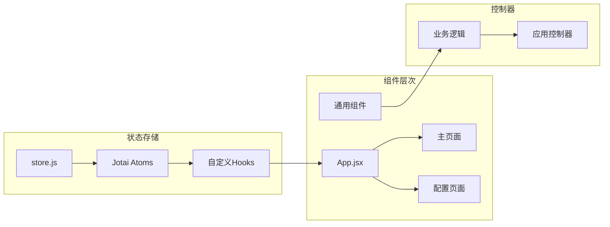
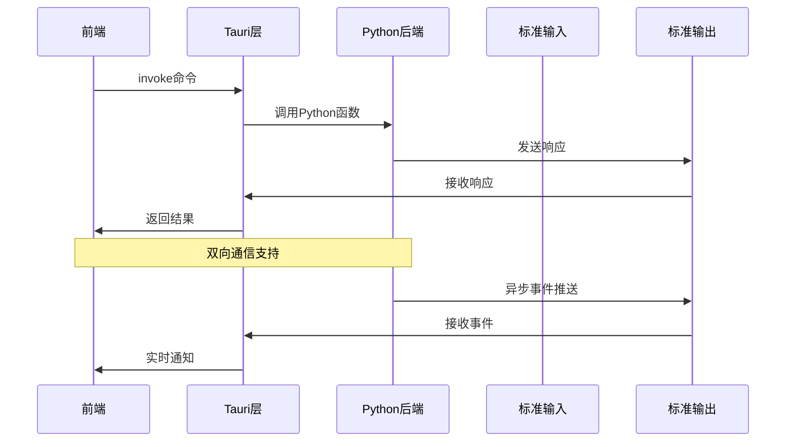
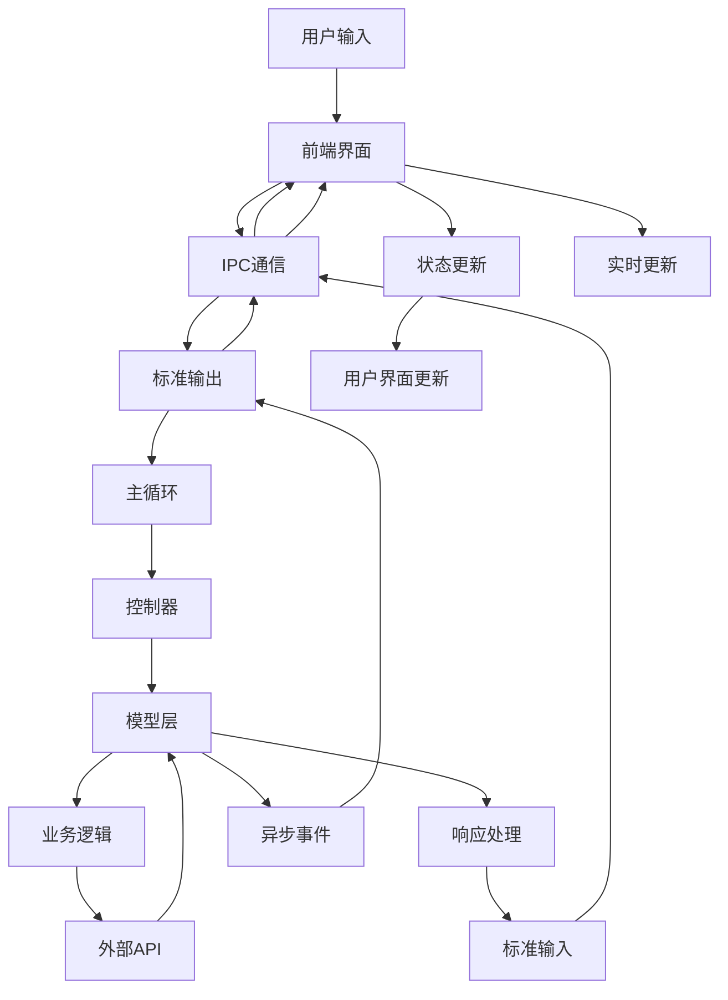

# VRCT项目MVC架构解析

<cite>
**本文档引用的文件**
- [model.py](file://src-python/model.py)
- [controller.py](file://src-python/controller.py)
- [mainloop.py](file://src-python/mainloop.py)
- [config.py](file://src-python/config.py)
- [lib.rs](file://src-tauri/src/lib.rs)
- [main.rs](file://src-tauri/src/main.rs)
- [App.jsx](file://src-ui/views/app/App.jsx)
- [store.js](file://src-ui/logics/store.js)
- [useStdoutToPython.js](file://src-ui/logics/common/useStdoutToPython.js)
- [useReceiveRoutes.js](file://src-ui/logics/useReceiveRoutes.js)
</cite>

## 目录
1. [项目概述](#项目概述)
2. [MVC架构总览](#mvc架构总览)
3. [Model层详解](#model层详解)
4. [Controller层详解](#controller层详解)
5. [View层详解](#view层详解)
6. [前后端通信机制](#前后端通信机制)
7. [数据流分析](#数据流分析)
8. [依赖注入与架构模式](#依赖注入与架构模式)
9. [性能优化策略](#性能优化策略)
10. [总结](#总结)

## 项目概述

VRCT是一个基于MVC架构的跨平台语音翻译应用，采用Python后端配合Rust Tauri前端的混合架构设计。该应用支持实时语音识别、多语言翻译、VR内容展示等功能，通过精心设计的分层架构实现了高度模块化和可维护性。

## MVC架构总览

VRCT项目采用了经典的MVC（Model-View-Controller）架构模式，结合现代前端状态管理和异步通信技术，形成了一个完整的三层架构体系。



**图表来源**
- [App.jsx](file://src-ui/views/app/App.jsx#L1-L82)
- [lib.rs](file://src-tauri/src/lib.rs#L1-L65)
- [mainloop.py](file://src-python/mainloop.py#L1-L588)

## Model层详解

Model层是VRCT的核心业务逻辑层，采用单例模式设计，负责封装所有的业务逻辑和数据处理功能。

### 核心特性

**单例模式实现：**


**图表来源**
- [model.py](file://src-python/model.py#L81-L141)
- [model.py](file://src-python/model.py#L37-L79)

### 核心业务功能

**语音转录功能：**
- 支持麦克风和扬声器音频捕获
- 多种转录引擎（Whisper等）
- 实时音频处理和噪声过滤

**翻译引擎管理：**
- 多个翻译服务集成（DeepL、OpenAI、Gemini等）
- 动态模型加载和卸载
- 翻译质量监控和故障转移

**设备控制系统：**
- 音频设备自动检测和切换
- 设备状态监控和错误处理
- 实时音量检测和阈值调整

**架构职责划分：**

| 组件 | 职责 | 关键方法 |
|------|------|----------|
| Model类 | 业务逻辑封装 | `init()`, `ensure_initialized()`, `getTranslate()` |
| threadFnc | 异步任务管理 | `start()`, `stop()`, `pause()`, `resume()` |
| 子系统 | 具体功能实现 | `AudioTranscriber`, `Translator`, `Overlay` |

**章节来源**
- [model.py](file://src-python/model.py#L81-L800)

## Controller层详解

Controller层作为业务逻辑的协调中心，负责处理用户指令、状态管理和前后端通信协调。

### 架构设计



**图表来源**
- [controller.py](file://src-python/controller.py#L11-L28)
- [mainloop.py](file://src-python/mainloop.py#L408-L588)

### 核心功能模块

**设备管理控制器：**
- 麦克风和扬声器设备选择和配置
- 实时设备状态监控
- 自动设备切换逻辑

**翻译控制器：**
- 翻译引擎状态管理
- 翻译质量监控
- 错误处理和重试机制

**消息处理控制器：**
- 实时消息接收和转发
- 消息格式化和过滤
- 状态同步和持久化

**章节来源**
- [controller.py](file://src-python/controller.py#L11-L800)

## View层详解

View层采用React框架构建，结合Jotai状态管理系统，实现了响应式的用户界面设计。

### 状态管理架构



**图表来源**
- [store.js](file://src-ui/logics/store.js#L1-L248)
- [App.jsx](file://src-ui/views/app/App.jsx#L1-L82)

### 核心组件结构

**动态状态注册系统：**
- 基于模板的状态管理
- 自动化的状态同步机制
- 类型安全的状态访问

**智能路由系统：**
- 基于端点的自动路由映射
- 状态变更的自动响应
- 错误处理和降级策略

**章节来源**
- [store.js](file://src-ui/logics/store.js#L1-L248)
- [useReceiveRoutes.js](file://src-ui/logics/useReceiveRoutes.js#L1-L372)

## 前后端通信机制

VRCT项目采用了多种通信机制来实现前后端的高效协作。

### IPC通信架构



**图表来源**
- [lib.rs](file://src-tauri/src/lib.rs#L19-L20)
- [useStdoutToPython.js](file://src-ui/logics/common/useStdoutToPython.js#L1-L21)

### 通信协议设计

**JSON-RPC风格的消息格式：**
```javascript
{
    "endpoint": "/set/enable/translation",
    "data": "base64编码的数据"
}
```

**响应格式：**
```javascript
{
    "status": 200,
    "endpoint": "/run/enable_translation",
    "result": {...}
}
```

**章节来源**
- [useStdoutToPython.js](file://src-ui/logics/common/useStdoutToPython.js#L1-L21)
- [useReceiveRoutes.js](file://src-ui/logics/useReceiveRoutes.js#L1-L372)

## 数据流分析

VRCT的数据流从用户输入到后端处理再到界面更新，形成了一个完整的闭环系统。

### 完整数据流程



**图表来源**
- [mainloop.py](file://src-python/mainloop.py#L408-L588)
- [useReceiveRoutes.js](file://src-ui/logics/useReceiveRoutes.js#L108-L194)

### 状态同步机制

**实时状态同步：**
- 基于事件驱动的状态更新
- 自动化的状态冲突解决
- 完整的状态历史追踪

**错误处理和恢复：**
- 分层的错误处理机制
- 自动重试和降级策略
- 用户友好的错误提示

## 依赖注入与架构模式

VRCT项目采用了多种设计模式来实现松耦合和高内聚的架构设计。

### 设计模式应用

**工厂模式：**
```python
# Model实例创建
class Model:
    _instance = None
    def __new__(cls):
        if cls._instance is None:
            cls._instance = super(Model, cls).__new__(cls)
        return cls._instance
```

**观察者模式：**
```javascript
// Jotai状态监听
const useStore_TranslationStatus = createAtomWithHook(false, "TranslationStatus");
```

**策略模式：**
```python
# 多种翻译引擎支持
translation_engines = {
    "DeepL": DeepLTranslator(),
    "OpenAI": OpenAITranslator(),
    "Gemini": GeminiTranslator(),
    "CTranslate2": CTranslate2Translator()
}
```

**章节来源**
- [model.py](file://src-python/model.py#L81-L91)
- [store.js](file://src-ui/logics/store.js#L36-L120)

### 架构优势

**模块化设计：**
- 清晰的职责分离
- 独立的功能模块
- 可插拔的组件架构

**可扩展性：**
- 新功能的轻松集成
- 配置驱动的扩展机制
- 插件化的第三方服务支持

**可维护性：**
- 单一职责原则的应用
- 最小化依赖的设计
- 完善的错误处理机制

## 性能优化策略

VRCT项目在多个层面实施了性能优化策略，确保应用的高效运行。

### 并发处理优化

**多线程架构：**
- 异步任务处理
- 非阻塞的I/O操作
- 智能的任务调度

**内存管理：**
- 对象池化技术
- 及时的垃圾回收
- 内存泄漏防护

### 网络通信优化

**连接复用：**
- WebSocket长连接
- HTTP连接池
- 缓存策略优化

**数据传输优化：**
- 压缩算法应用
- 批量数据处理
- 增量更新机制

## 总结

VRCT项目通过精心设计的MVC架构，成功实现了以下目标：

**架构优势：**
- 清晰的分层设计，便于维护和扩展
- 松耦合的组件架构，提高系统的灵活性
- 完善的错误处理机制，提升用户体验

**技术特色：**
- 前后端分离的现代化架构
- 多语言混合开发的技术创新
- 实时通信和状态同步的高效实现

**应用价值：**
- 高性能的语音翻译服务
- 用户友好的交互界面
- 可靠稳定的系统运行

这种MVC架构设计不仅满足了当前的功能需求，也为未来的功能扩展和技术升级奠定了坚实的基础。通过合理的架构设计和先进的技术应用，VRCT项目展现了一个优秀软件产品的架构典范。