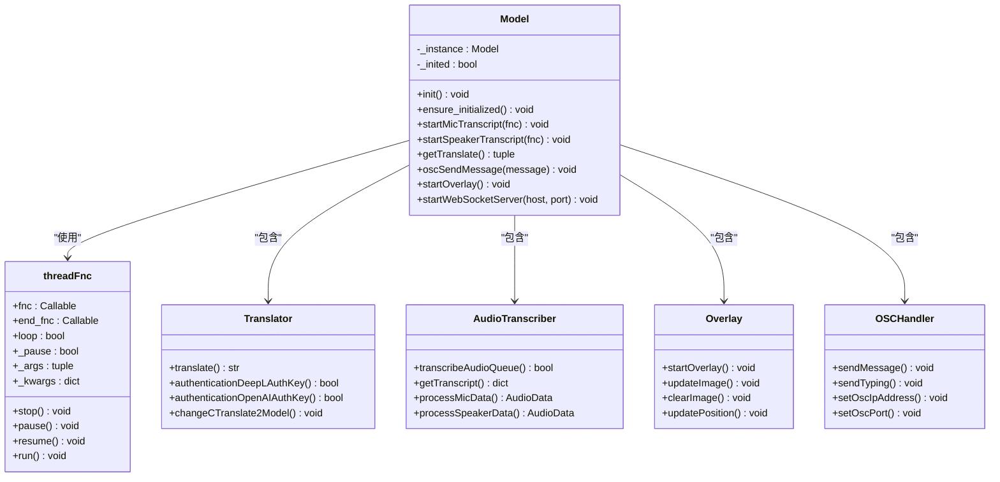
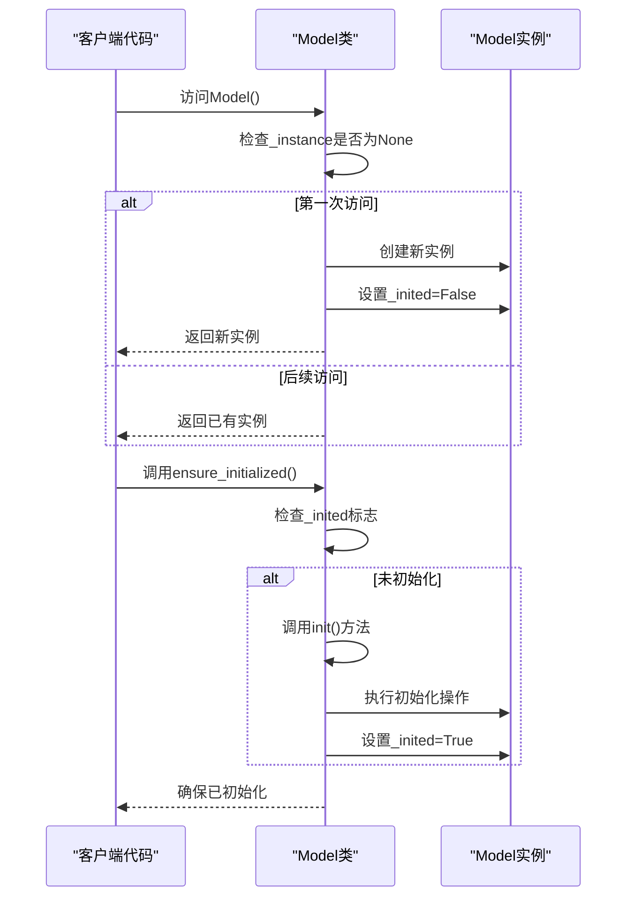
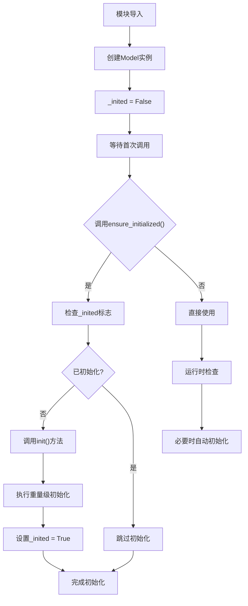
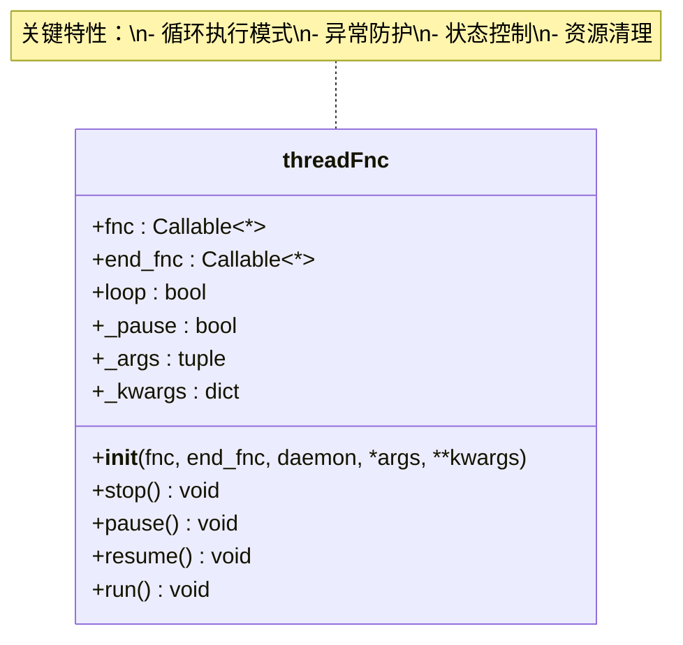
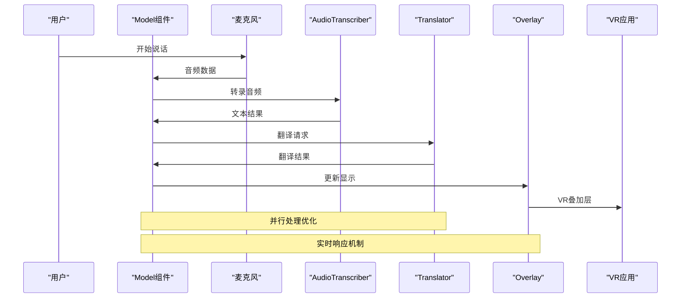
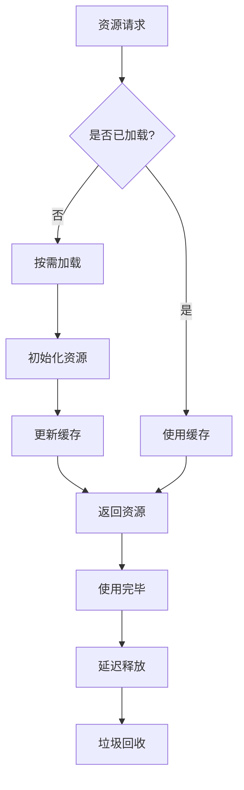

# VRCT项目Model组件详细文档

<cite>
**本文档引用的文件**
- [model.py](file://src-python/model.py)
- [config.py](file://src-python/config.py)
- [translation_translator.py](file://src-python/models/translation/translation_translator.py)
- [transcription_transcriber.py](file://src-python/models/transcription/transcription_transcriber.py)
- [overlay.py](file://src-python/models/overlay/overlay.py)
- [__init__.py](file://src-python/models/__init__.py)
</cite>

## 目录
1. [概述](#概述)
2. [架构设计](#架构设计)
3. [单例模式实现](#单例模式实现)
4. [延迟初始化机制](#延迟初始化机制)
5. [核心子系统](#核心子系统)
6. [threadFnc类详解](#threadfnc类详解)
7. [数据流协调](#数据流协调)
8. [性能优化策略](#性能优化策略)
9. [错误处理机制](#错误处理机制)
10. [总结](#总结)

## 概述

VRCT项目的Model组件是整个应用程序的核心业务逻辑门面，采用单例模式设计，负责协调语音识别、翻译、VR叠加层显示等核心功能。Model组件通过延迟初始化策略优化启动性能，同时提供了安全的后台任务执行机制。

### 主要职责

- **业务逻辑门面**：为上层应用提供统一的接口访问所有子系统
- **全局状态管理**：维护应用程序的全局状态和配置
- **资源协调器**：协调各个子系统之间的数据流和生命周期
- **后台任务管理**：通过threadFnc类实现安全的异步任务执行

## 架构设计

Model组件采用了分层架构设计，将复杂的业务逻辑封装在一个统一的接口后面：

**图表来源**
- [model.py](file://src-python/model.py#L37-L80)
- [translation_translator.py](file://src-python/models/translation/translation_translator.py#L39-L60)
- [transcription_transcriber.py](file://src-python/models/transcription/transcription_transcriber.py#L31-L80)
- [overlay.py](file://src-python/models/overlay/overlay.py#L85-L120)

## 单例模式实现

Model组件采用经典的单例模式实现，确保在整个应用程序生命周期中只有一个实例存在：

**图表来源**
- [model.py](file://src-python/model.py#L81-L91)

### 单例实现的关键特性

1. **延迟实例化**：通过`__new__`方法控制实例创建时机
2. **状态跟踪**：使用`_inited`标志跟踪初始化状态
3. **线程安全**：Python的类实例化本身是线程安全的

**章节来源**
- [model.py](file://src-python/model.py#L81-L91)

## 延迟初始化机制

Model组件实现了智能的延迟初始化机制，避免在导入时进行重量级的初始化操作：

**图表来源**
- [model.py](file://src-python/model.py#L143-L153)

### 初始化流程详解

1. **导入阶段**：只创建实例，不执行初始化
2. **首次调用**：通过`ensure_initialized()`触发初始化
3. **资源加载**：按需加载翻译模型、音频设备等资源
4. **状态维护**：确保初始化只执行一次

**章节来源**
- [model.py](file://src-python/model.py#L93-L153)

## 核心子系统

Model组件内部聚合了多个专业化的子系统，每个子系统都有明确的职责分工：

### Translator（翻译器）

负责文本翻译功能，支持多种翻译引擎：

| 功能模块 | 支持的引擎 | 特点 |
|---------|-----------|------|
| DeepL API | DeepL | 高质量翻译，需要认证密钥 |
| OpenAI API | OpenAI/GPT | 多语言支持，灵活配置 |
| 本地翻译 | CTranslate2 | 离线使用，隐私保护 |
| Plamo | Plamo | 日本本地化服务 |
| Gemini | Gemini | Google AI服务 |

### AudioTranscriber（音频转录器）

处理语音到文本的转换：

| 转录引擎 | 性能特点 | 使用场景 |
|---------|---------|---------|
| Google Speech | 在线服务，高准确率 | 实时转录，网络稳定 |
| Whisper | 本地模型，离线可用 | 隐私要求高的场景 |

### Overlay（VR叠加层）

管理VR环境中的视觉显示：

| 显示类型 | 特性 | 应用场景 |
|---------|------|---------|
| Small Log | 简洁日志显示 | 实时消息展示 |
| Large Log | 详细信息面板 | 完整对话记录 |

### OSCHandler（OSC处理器）

处理Open Sound Control协议通信：

| 功能 | 描述 | 用途 |
|-----|------|------|
| 消息发送 | 发送文本消息到VR应用 | 实现虚拟世界中的聊天 |
| 打字状态 | 通知打字动作 | 增强交互体验 |
| 参数同步 | 同步用户设置 | 维护一致性 |

**章节来源**
- [model.py](file://src-python/model.py#L118-L132)
- [translation_translator.py](file://src-python/models/translation/translation_translator.py#L39-L60)
- [transcription_transcriber.py](file://src-python/models/transcription/transcription_transcriber.py#L31-L80)
- [overlay.py](file://src-python/models/overlay/overlay.py#L85-L120)

## threadFnc类详解

threadFnc类是Model组件中实现安全后台任务执行的核心工具：

**图表来源**
- [model.py](file://src-python/model.py#L37-L80)

### 安全执行机制

1. **异常隔离**：捕获并记录用户代码异常，防止线程崩溃
2. **状态控制**：提供暂停、恢复、停止等状态管理功能
3. **资源清理**：通过end_fnc确保资源正确释放
4. **守护进程**：支持daemon模式，主线程退出时自动清理

### 使用场景

- **音频转录监控**：持续监听麦克风输入
- **能量检测**：实时监控音频能量水平
- **WebSocket服务器**：后台运行的网络服务
- **定时任务**：周期性执行的任务调度

**章节来源**
- [model.py](file://src-python/model.py#L37-L80)

## 数据流协调

Model组件作为数据流的协调者，处理从音频输入到VR显示的完整管道：

**图表来源**
- [model.py](file://src-python/model.py#L616-L702)
- [model.py](file://src-python/model.py#L339-L367)

### 关键数据流节点

1. **音频采集**：从麦克风或扬声器获取原始音频
2. **实时转录**：将音频转换为文本
3. **多语言翻译**：支持多种目标语言的翻译
4. **格式化输出**：构建适合VR显示的内容
5. **视觉呈现**：在VR环境中显示翻译结果

**章节来源**
- [model.py](file://src-python/model.py#L339-L367)
- [model.py](file://src-python/model.py#L616-L702)

## 性能优化策略

Model组件采用了多层次的性能优化策略：

### 启动性能优化

1. **延迟初始化**：避免导入时的重量级操作
2. **按需加载**：只有在需要时才创建子系统实例
3. **资源池化**：复用昂贵的计算资源

### 运行时优化

1. **异步处理**：使用threadFnc实现非阻塞操作
2. **内存管理**：及时释放不需要的资源
3. **缓存机制**：缓存频繁访问的数据和配置

### 资源管理策略

**图表来源**
- [model.py](file://src-python/model.py#L143-L153)

**章节来源**
- [model.py](file://src-python/model.py#L143-L153)

## 错误处理机制

Model组件实现了完善的错误处理和恢复机制：

### 分层错误处理

1. **子系统级别**：各子系统独立处理自身错误
2. **Model级别**：统一收集和处理跨子系统的错误
3. **应用级别**：向用户报告最终的错误状态

### 恢复策略

1. **优雅降级**：当高级功能不可用时启用基础功能
2. **自动重试**：对临时性错误实施重试机制
3. **状态重置**：在必要时重置子系统状态

### 监控和诊断

- **日志记录**：详细的错误日志用于问题诊断
- **健康检查**：定期检查各子系统的运行状态
- **性能监控**：跟踪关键指标以识别性能问题

**章节来源**
- [model.py](file://src-python/model.py#L67-L78)
- [model.py](file://src-python/model.py#L74-L80)

## 总结

VRCT项目的Model组件是一个精心设计的业务逻辑门面，具有以下核心优势：

### 设计优势

1. **单一职责**：专注于业务逻辑协调而非具体实现
2. **松耦合**：通过抽象接口与子系统解耦
3. **高内聚**：紧密协作的核心功能组合
4. **可扩展性**：易于添加新的子系统和功能

### 技术特色

1. **智能初始化**：延迟加载优化启动性能
2. **安全保障**：threadFnc提供安全的异步执行
3. **资源管理**：高效的资源分配和回收
4. **错误恢复**：健壮的错误处理和恢复机制

### 应用价值

Model组件成功地将复杂的VR翻译应用场景抽象为简洁的接口，为开发者提供了强大而易用的开发框架。其设计理念和实现方式对于构建类似的大型应用系统具有重要的参考价值。

通过合理的架构设计、完善的错误处理和高效的性能优化，Model组件展现了现代Python应用程序的最佳实践，为VRCT项目的成功奠定了坚实的技术基础。