# VRCT项目架构文档

<cite>
**本文档引用的文件**
- [README.md](file://README.md)
- [config.py](file://src-python/config.py)
- [model.py](file://src-python/model.py)
- [controller.py](file://src-python/controller.py)
- [mainloop.py](file://src-python/mainloop.py)
- [device_manager.py](file://src-python/device_manager.py)
- [lib.rs](file://src-tauri/src/lib.rs)
- [main.rs](file://src-tauri/src/main.rs)
- [translation_translator.py](file://src-python/models/translation/translation_translator.py)
- [websocket_server.py](file://src-python/models/websocket/websocket_server.py)
- [ui_configs.js](file://src-ui/logics/ui_configs.js)
- [useWindow.js](file://src-ui/logics/common/useWindow.js)
</cite>

## 目录
1. [项目概述](#项目概述)
2. [整体架构](#整体架构)
3. [核心组件详解](#核心组件详解)
4. [设计模式应用](#设计模式应用)
5. [组件间交互机制](#组件间交互机制)
6. [数据流分析](#数据流分析)
7. [性能考虑](#性能考虑)
8. [总结](#总结)

## 项目概述

VRCT是一个基于MVC架构的跨平台实时语音翻译应用程序，采用Python作为后端服务，React+Tauri作为前端界面，实现了复杂的多语言语音识别、翻译和VR内容显示功能。

### 技术栈概览
- **后端**: Python (MVC架构)
- **前端**: React + Tauri (桌面应用框架)
- **通信**: WebSocket + 命令行管道
- **数据库**: JSON配置文件
- **设备管理**: Windows音频API (PyAudio + WASAPI)

## 整体架构

VRCT采用分层的MVC架构模式，结合现代软件设计原则，实现了高度模块化和可扩展的系统结构。

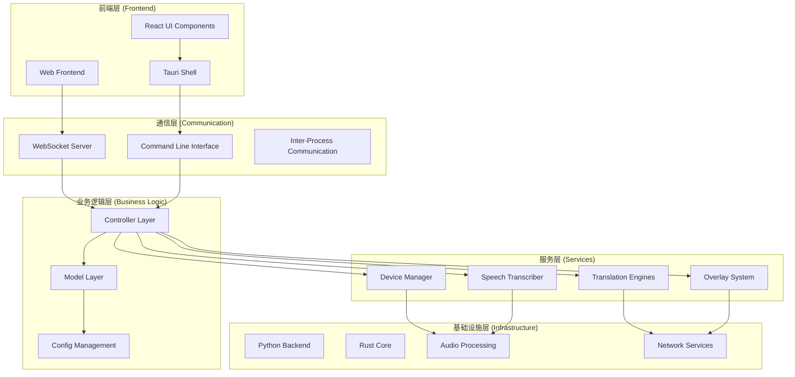

**图表来源**
- [lib.rs](file://src-tauri/src/lib.rs#L1-L65)
- [main.rs](file://src-tauri/src/main.rs#L1-L7)
- [controller.py](file://src-python/controller.py#L1-L50)
- [model.py](file://src-python/model.py#L1-L100)

## 核心组件详解

### 1. Config类 - 单例模式实现

Config类是整个系统的核心配置管理器，采用单例模式确保全局配置的一致性。

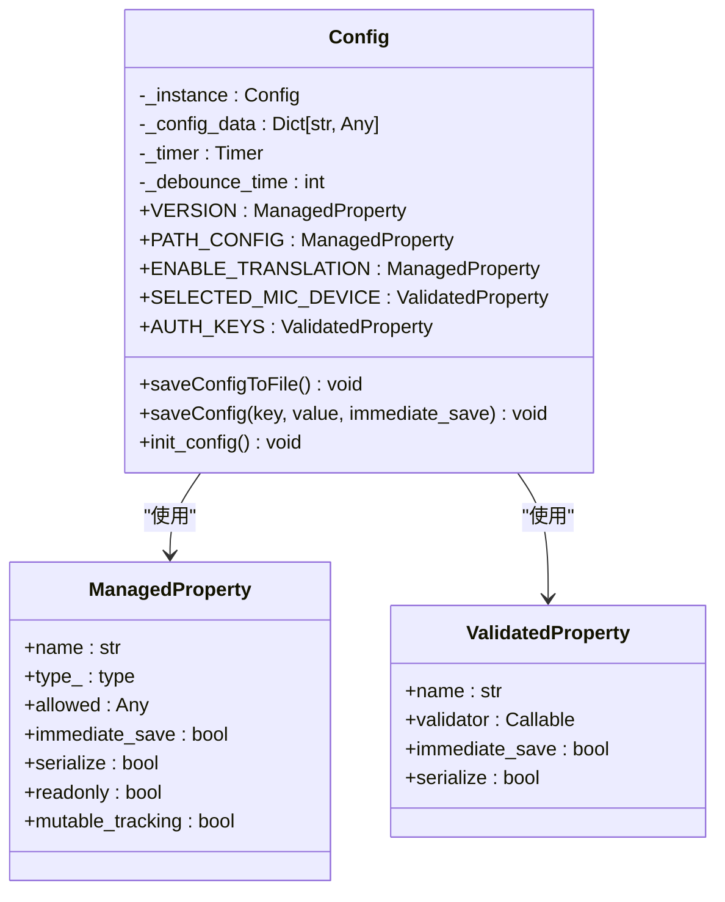

**图表来源**
- [config.py](file://src-python/config.py#L531-L600)
- [config.py](file://src-python/config.py#L230-L335)

**章节来源**
- [config.py](file://src-python/config.py#L531-L1027)

#### 单例模式特点
- **延迟初始化**: 实例仅在首次访问时创建
- **线程安全**: 使用类变量确保单例唯一性
- **配置持久化**: 自动保存到JSON文件，支持防抖机制
- **类型验证**: 通过ManagedProperty和ValidatedProperty确保数据完整性

### 2. Model类 - MVC模型层

Model类负责业务逻辑处理和数据管理，采用单例模式管理全局状态。

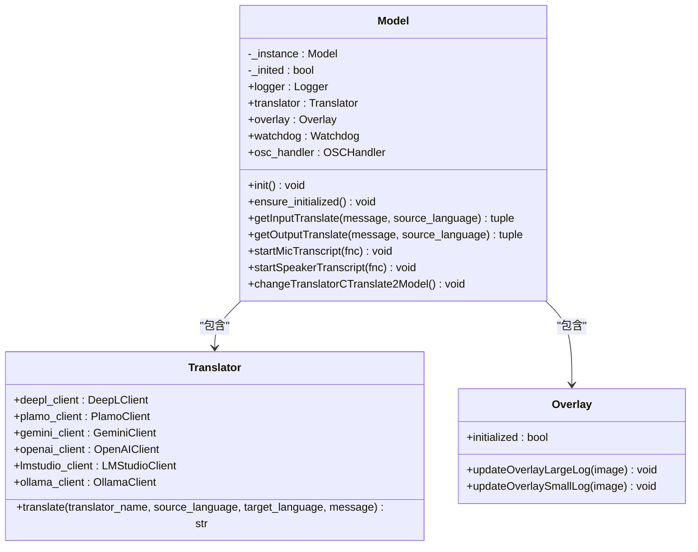

**图表来源**
- [model.py](file://src-python/model.py#L81-L150)
- [translation_translator.py](file://src-python/models/translation/translation_translator.py#L39-L60)

**章节来源**
- [model.py](file://src-python/model.py#L81-L1204)

#### Model类职责
- **业务逻辑处理**: 翻译、语音识别、消息格式化
- **资源管理**: 初始化和清理各种子系统
- **状态同步**: 维护全局状态和回调函数
- **错误处理**: 提供故障恢复和降级机制

### 3. Controller类 - MVC控制器层

Controller类作为MVC架构中的控制器，协调Model和View之间的交互。

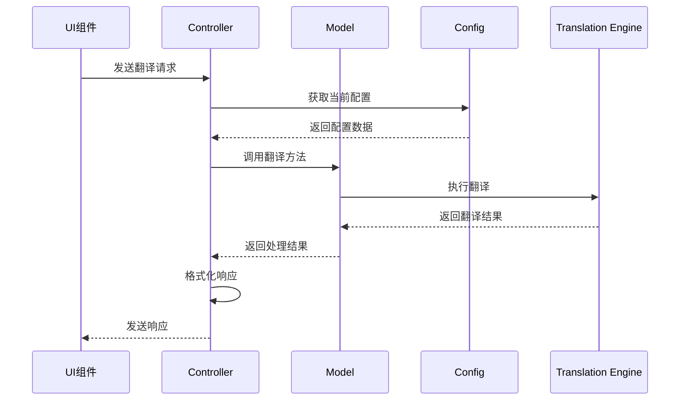

**图表来源**
- [controller.py](file://src-python/controller.py#L11-L50)
- [controller.py](file://src-python/controller.py#L254-L320)

**章节来源**
- [controller.py](file://src-python/controller.py#L11-L3133)

#### 控制器功能
- **请求路由**: 将用户请求分发到相应的处理函数
- **参数验证**: 验证输入参数的有效性
- **错误处理**: 统一的错误处理和响应格式化
- **状态管理**: 维护UI状态和用户会话

### 4. DeviceManager类 - 设备抽象层

DeviceManager类负责音频设备的管理和监控，采用观察者模式处理设备变更事件。

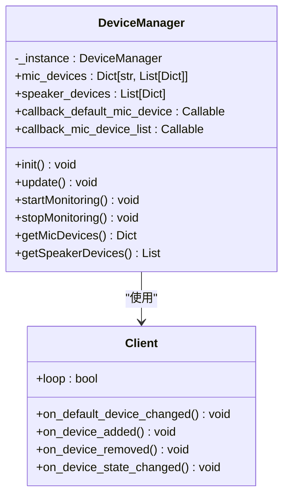

**图表来源**
- [device_manager.py](file://src-python/device_manager.py#L57-L120)
- [device_manager.py](file://src-python/device_manager.py#L26-L52)

**章节来源**
- [device_manager.py](file://src-python/device_manager.py#L57-L529)

#### 设备管理特性
- **热插拔支持**: 实时检测音频设备变更
- **多API兼容**: 支持多种音频API（WASAPI、DirectSound等）
- **回调机制**: 通知UI组件设备状态变更
- **错误恢复**: 在设备不可用时提供默认值

### 5. Mainloop类 - 应用主循环

Mainloop类管理整个应用的生命周期，处理异步任务和并发控制。

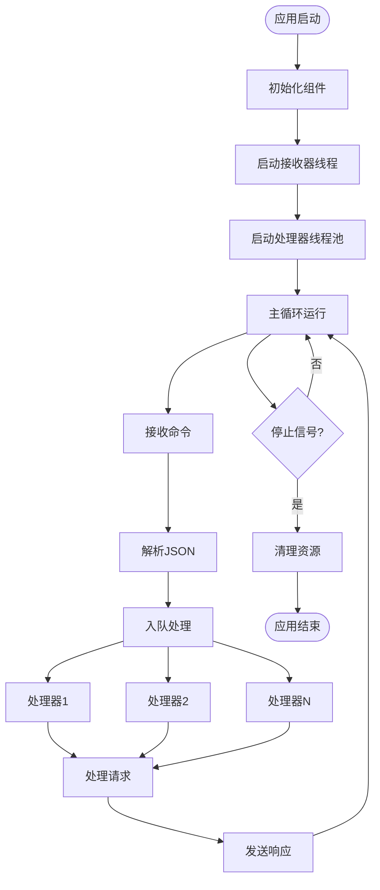

**图表来源**
- [mainloop.py](file://src-python/mainloop.py#L408-L588)

**章节来源**
- [mainloop.py](file://src-python/mainloop.py#L408-L588)

## 设计模式应用

### 1. 单例模式 (Singleton Pattern)

#### Config类单例实现
```python
class Config:
    _instance = None
    
    def __new__(cls):
        if cls._instance is None:
            cls._instance = super(Config, cls).__new__(cls)
            # 初始化逻辑...
        return cls._instance
```

**应用场景**:
- 全局配置管理
- 避免重复初始化开销
- 确保配置一致性

#### Model类单例实现
```python
class Model:
    _instance = None
    
    def __new__(cls):
        if cls._instance is None:
            cls._instance = super(Model, cls).__new__(cls)
            # 延迟初始化...
        return cls._instance
```

**优势**:
- 资源高效利用
- 状态一致性保证
- 避免重复创建昂贵对象

### 2. 观察者模式 (Observer Pattern)

#### UI配置变更监听
前端通过React Hooks实现观察者模式：

```javascript
// UI语言变更监听
const UiLanguageController = () => {
    const { currentUiLanguage } = useAppearance();
    const { i18n } = useI18n();
    
    useEffect(() => {
        i18n.changeLanguage(currentUiLanguage.data);
    }, [currentUiLanguage.data]);
    
    return null;
};
```

**监听机制**:
- **配置变更**: 当配置发生变化时自动通知相关组件
- **状态同步**: 确保UI状态与配置数据保持一致
- **响应式更新**: 实现无刷新的状态更新

#### 设备变更通知
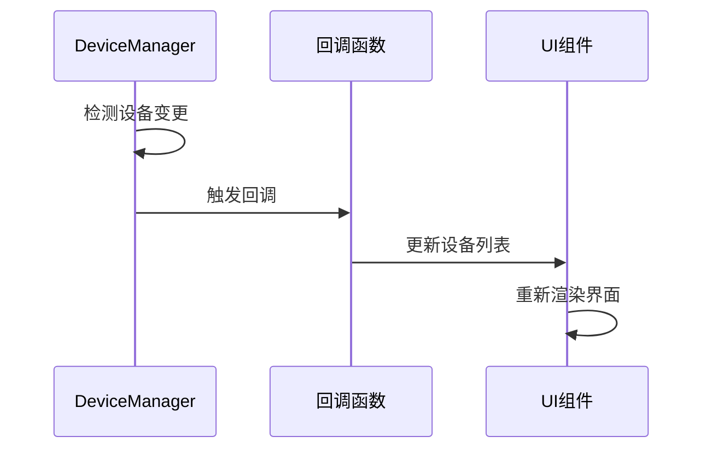

**图表来源**
- [device_manager.py](file://src-python/device_manager.py#L406-L458)

### 3. 工厂模式 (Factory Pattern)

#### 翻译引擎工厂
```python
class Translator:
    def __init__(self):
        self.engines = {
            "DeepL": DeepLClient,
            "Plamo": PlamoClient,
            "Gemini": GeminiClient,
            "OpenAI": OpenAIClient,
            "LMStudio": LMStudioClient,
            "Ollama": OllamaClient,
            "CTranslate2": CTranslate2Translator
        }
    
    def create_engine(self, engine_name, **kwargs):
        if engine_name in self.engines:
            return self.engines[engine_name](**kwargs)
        return None
```

**工厂特点**:
- **动态创建**: 根据配置动态选择翻译引擎
- **接口统一**: 所有引擎实现相同的接口
- **可扩展性**: 易于添加新的翻译服务提供商

#### 引擎选择策略
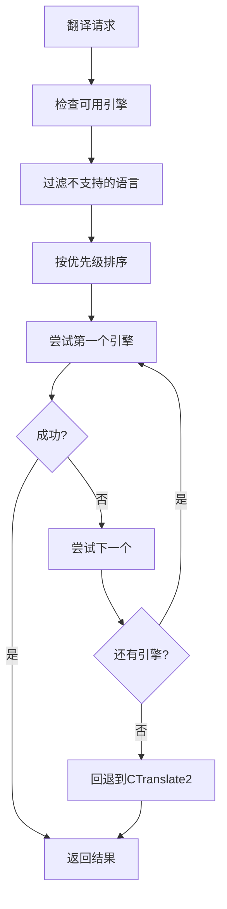

**图表来源**
- [translation_translator.py](file://src-python/models/translation/translation_translator.py#L392-L420)

### 4. 适配器模式 (Adapter Pattern)

#### 翻译API适配器
```python
class TranslationAdapter:
    def __init__(self, client):
        self.client = client
    
    def translate(self, text, source_lang, target_lang):
        return self.client.translate(text, source_lang, target_lang)
    
    def get_supported_languages(self):
        return self.client.supported_languages
```

**适配器实现**:
- **接口标准化**: 统一不同API的调用方式
- **错误处理**: 统一异常处理机制
- **参数转换**: 自动转换语言代码格式

#### WebSocket通信适配器
```python
class WebSocketAdapter:
    def __init__(self, host, port):
        self.host = host
        self.port = port
        self.connection = None
    
    async def connect(self):
        self.connection = await websockets.connect(f"ws://{self.host}:{self.port}")
    
    async def send(self, data):
        await self.connection.send(json.dumps(data))
    
    async def receive(self):
        return await self.connection.recv()
```

**章节来源**
- [translation_translator.py](file://src-python/models/translation/translation_translator.py#L1-L200)
- [websocket_server.py](file://src-python/models/websocket/websocket_server.py#L1-L100)

## 组件间交互机制

### 1. 前端与后端通信

VRCT采用多种通信机制实现前后端交互：

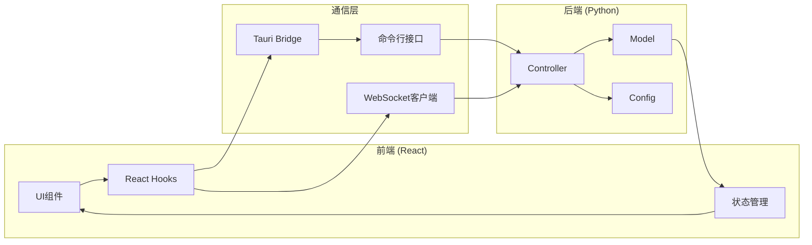

**图表来源**
- [lib.rs](file://src-tauri/src/lib.rs#L1-L65)
- [mainloop.py](file://src-python/mainloop.py#L408-L500)

### 2. 数据传输协议

#### WebSocket消息格式
```json
{
    "type": "translation_request",
    "message": "Hello world",
    "source_language": "en",
    "target_language": "ja",
    "timestamp": 1234567890
}
```

#### 命令行接口协议
```bash
# 请求格式
echo '{"endpoint": "/set/enable/translation", "data": true}' | python mainloop.py

# 响应格式
{"status": 200, "result": true}
```

### 3. 错误处理机制

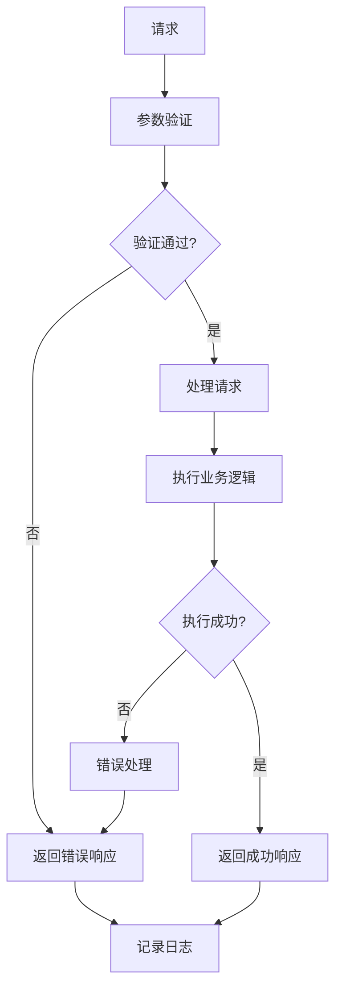

**章节来源**
- [mainloop.py](file://src-python/mainloop.py#L471-L545)
- [controller.py](file://src-python/controller.py#L254-L320)

## 数据流分析

### 1. 语音翻译流程

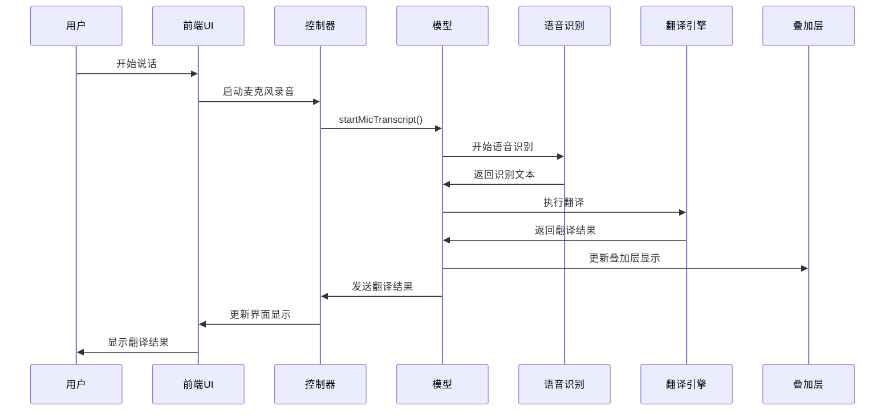

**图表来源**
- [model.py](file://src-python/model.py#L616-L768)
- [controller.py](file://src-python/controller.py#L254-L320)

### 2. 配置变更流程

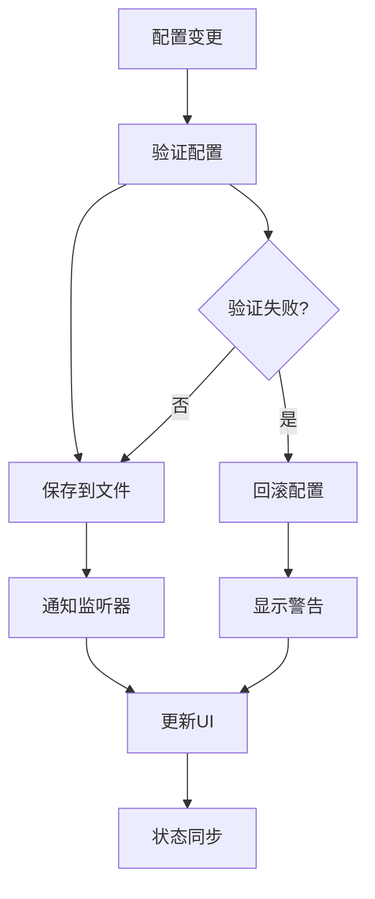

**图表来源**
- [config.py](file://src-python/config.py#L564-L576)
- [ui_configs.js](file://src-ui/logics/ui_configs.js#L1-L41)

### 3. 设备管理流程

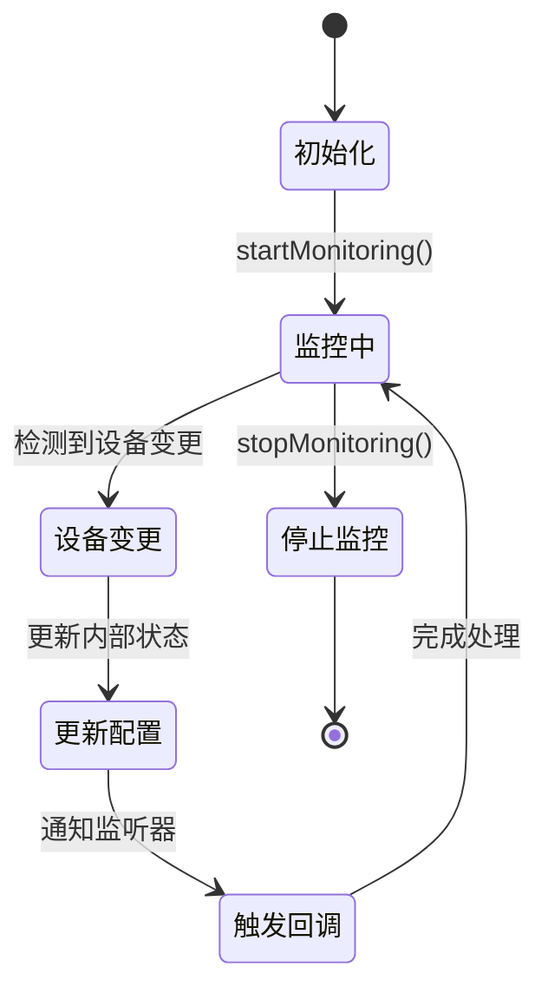

**图表来源**
- [device_manager.py](file://src-python/device_manager.py#L266-L306)

**章节来源**
- [model.py](file://src-python/model.py#L616-L800)
- [controller.py](file://src-python/controller.py#L254-L400)

## 性能考虑

### 1. 并发处理

VRCT采用多线程架构处理并发任务：

- **主线程**: 处理UI事件和用户交互
- **工作线程**: 执行CPU密集型任务（翻译、语音识别）
- **IO线程**: 处理网络通信和文件操作
- **监控线程**: 监控设备状态和系统资源

### 2. 内存管理

- **对象池**: 复用频繁创建的对象
- **垃圾回收**: 及时释放不需要的资源
- **内存监控**: 监控VRAM使用情况，防止溢出

### 3. 网络优化

- **连接复用**: 复用HTTP连接减少握手开销
- **请求合并**: 合并多个小请求为批量请求
- **缓存策略**: 缓存常用翻译结果和模型数据

### 4. 响应性优化

- **异步处理**: 非阻塞的网络和IO操作
- **优先级调度**: 关键任务优先处理
- **进度反馈**: 实时显示处理进度

## 总结

VRCT项目展现了现代软件架构的最佳实践，通过以下设计原则实现了高质量的系统：

### 架构优势

1. **模块化设计**: 清晰的职责分离和接口定义
2. **可扩展性**: 易于添加新功能和第三方服务
3. **可靠性**: 完善的错误处理和恢复机制
4. **性能**: 优化的并发处理和资源管理

### 设计模式价值

- **单例模式**: 确保全局状态一致性
- **观察者模式**: 实现响应式的用户界面
- **工厂模式**: 支持灵活的服务提供商切换
- **适配器模式**: 统一不同API的接口

### 技术创新

- **混合架构**: 结合Python的丰富生态和Rust的安全性
- **实时通信**: WebSocket实现实时双向数据交换
- **设备抽象**: 统一不同平台的音频设备管理
- **配置驱动**: 基于配置的灵活功能控制

VRCT项目不仅是一个功能强大的语音翻译工具，更是现代软件架构设计的优秀范例，展示了如何在复杂的技术挑战下构建稳定、高效的系统。