# 单例模式实现

<cite>
**本文档中引用的文件**
- [config.py](file://src-python/config.py)
- [utils.py](file://src-python/utils.py)
- [config.md](file://src-python/docs/config.md)
</cite>

## 目录
1. [简介](#简介)
2. [项目结构概览](#项目结构概览)
3. [核心组件分析](#核心组件分析)
4. [架构概览](#架构概览)
5. [详细组件分析](#详细组件分析)
6. [依赖关系分析](#依赖关系分析)
7. [性能考虑](#性能考虑)
8. [故障排除指南](#故障排除指南)
9. [结论](#结论)

## 简介

Config类是VRCT项目中的核心配置管理系统，采用经典的单例模式实现，确保整个应用程序中只有一个配置实例存在。该类负责管理应用程序的所有配置设置，包括读取、保存、验证和提供统一的配置访问接口。

单例模式在这里的应用不仅保证了配置数据的一致性和完整性，还提供了高效的内存使用和简化了配置管理逻辑。通过精心设计的初始化和加载机制，Config类能够在各种运行环境中稳定工作，同时具备强大的错误处理能力。

## 项目结构概览

VRCT项目采用模块化的架构设计，Config类位于核心层，为整个应用程序提供配置服务：

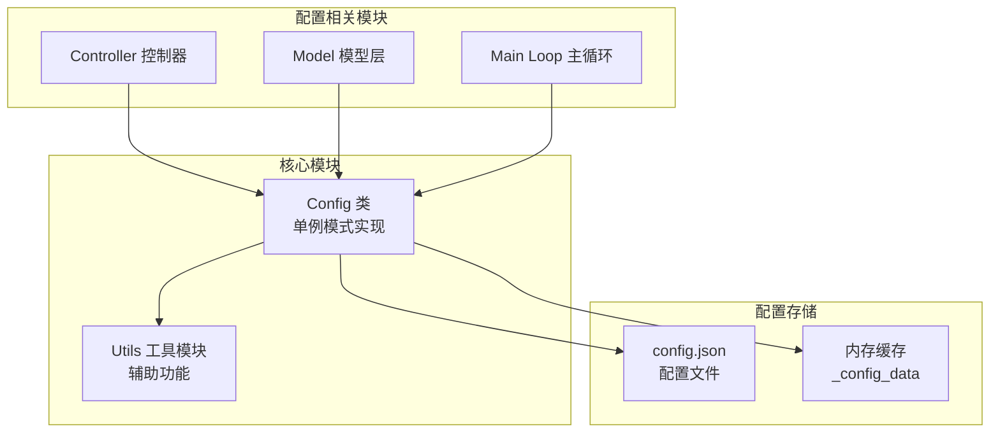

**图表来源**
- [config.py](file://src-python/config.py#L531-L1027)
- [utils.py](file://src-python/utils.py#L1-L50)

**章节来源**
- [config.py](file://src-python/config.py#L1-L100)
- [config.md](file://src-python/docs/config.md#L1-L50)

## 核心组件分析

Config类的核心实现基于Python的单例模式，通过`__new__`方法和类级别的静态变量确保全局唯一性：

### 单例模式实现机制

Config类的单例模式实现包含以下关键要素：

1. **静态实例变量**：`_instance`类变量用于存储唯一的Config实例
2. **构造控制**：`__new__`方法控制实例的创建过程
3. **初始化分离**：`init_config`和`load_config`方法分别处理默认值设置和持久化数据加载

### 初始化流程

配置系统的初始化遵循严格的顺序：

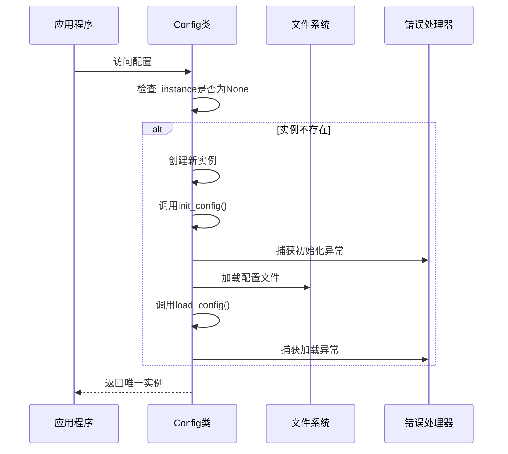

**图表来源**
- [config.py](file://src-python/config.py#L547-L558)
- [config.py](file://src-python/config.py#L1001-L1017)

**章节来源**
- [config.py](file://src-python/config.py#L531-L580)

## 架构概览

Config类采用了多层次的设计架构，结合了单例模式、描述符模式和装饰器模式：

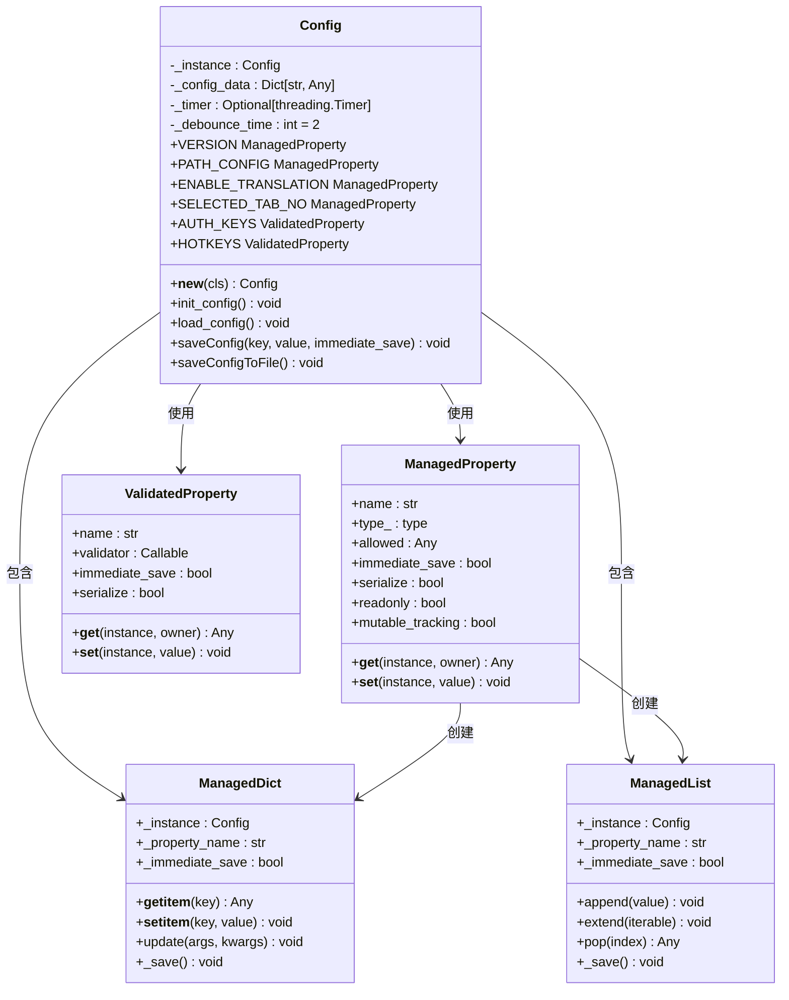

**图表来源**
- [config.py](file://src-python/config.py#L531-L700)
- [config.py](file://src-python/config.py#L232-L335)
- [config.py](file://src-python/config.py#L66-L269)

## 详细组件分析

### 单例模式实现详解

Config类的单例模式实现是通过`__new__`方法和类级别的静态变量`_instance`来确保全局唯一性的：

#### __new__方法实现

`__new__`方法是Python对象创建过程中的第一个调用方法，Config类通过重写这个方法实现了单例模式：

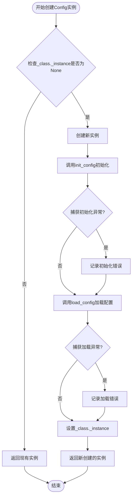

**图表来源**
- [config.py](file://src-python/config.py#L547-L558)

#### 静态变量管理

Config类使用多个静态变量来管理单例状态和配置数据：

| 变量名 | 类型 | 用途 | 默认值 |
|--------|------|------|--------|
| `_instance` | `Config \| None` | 存储单例实例 | `None` |
| `_config_data` | `Dict[str, Any]` | JSON序列化数据 | `{}` |
| `_timer` | `Optional[threading.Timer]` | 保存定时器 | `None` |
| `_debounce_time` | `int` | 延迟保存时间（秒） | `2` |

**章节来源**
- [config.py](file://src-python/config.py#L542-L546)
- [config.py](file://src-python/config.py#L547-L558)

### 初始化过程分析

#### init_config方法

`init_config`方法负责设置所有配置项的默认值，包括只读属性和可读写属性：

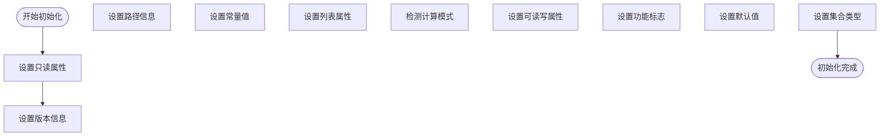

**图表来源**
- [config.py](file://src-python/config.py#L737-L800)

#### load_config方法

`load_config`方法从JSON文件中加载持久化配置，并将其应用到Config实例：

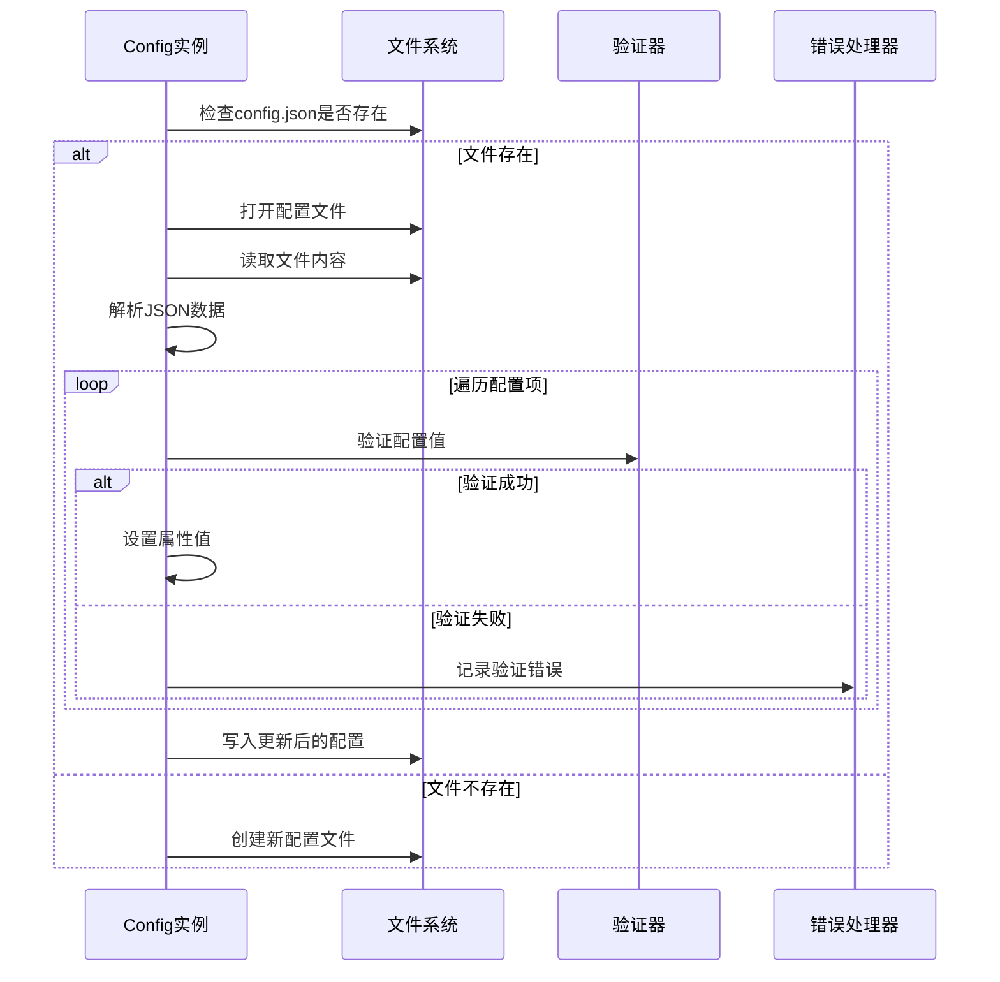

**图表来源**
- [config.py](file://src-python/config.py#L1001-L1017)

**章节来源**
- [config.py](file://src-python/config.py#L737-L1017)

### 属性管理系统

Config类使用两种类型的属性描述符来管理配置项：

#### ManagedProperty描述符

`ManagedProperty`描述符提供了类型检查、值验证和自动保存功能：

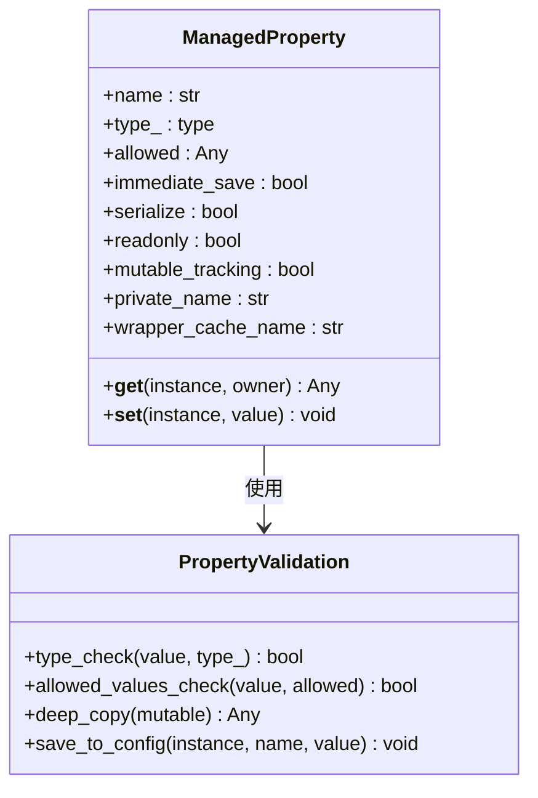

**图表来源**
- [config.py](file://src-python/config.py#L232-L335)

#### ValidatedProperty描述符

`ValidatedProperty`描述符使用自定义验证器进行复杂的数据验证：

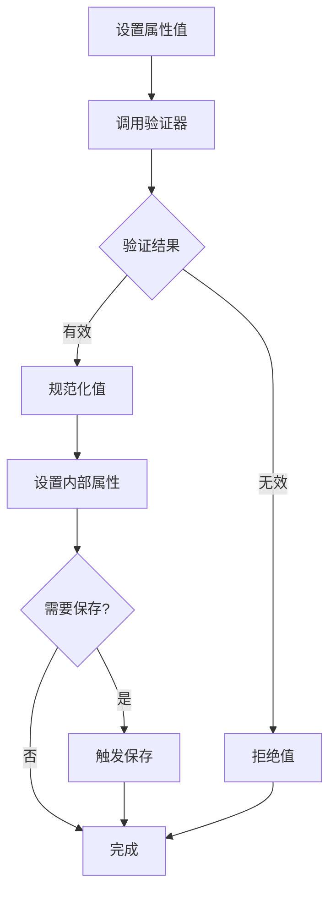

**图表来源**
- [config.py](file://src-python/config.py#L305-L335)

**章节来源**
- [config.py](file://src-python/config.py#L232-L335)

### 异常处理机制

Config类实现了多层次的异常处理机制，确保在各种错误情况下都能保持稳定运行：

#### 初始化异常处理

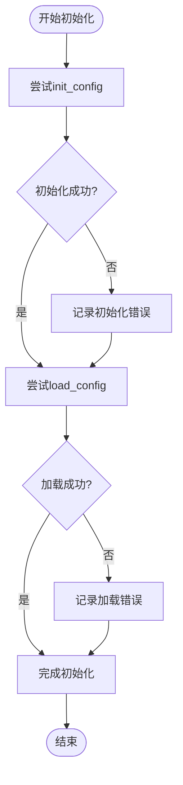

**图表来源**
- [config.py](file://src-python/config.py#L547-L558)

#### 运行时异常处理

在运行时，Config类通过`errorLogging`函数记录和处理各种异常：

| 异常类型 | 处理策略 | 影响范围 |
|----------|----------|----------|
| 导入异常 | 使用None作为默认值 | 功能降级 |
| 配置加载异常 | 跳过损坏的配置项 | 继续使用默认值 |
| 验证异常 | 拒绝非法值 | 保持当前有效值 |
| I/O异常 | 记录错误并继续 | 临时影响保存 |

**章节来源**
- [config.py](file://src-python/config.py#L547-L558)
- [utils.py](file://src-python/utils.py#L280-L291)

### 多线程安全性分析

Config类在多线程环境下的安全性主要体现在以下几个方面：

#### 保存操作的线程安全性

Config类使用`threading.Timer`来实现延迟保存功能，确保保存操作不会阻塞主线程：

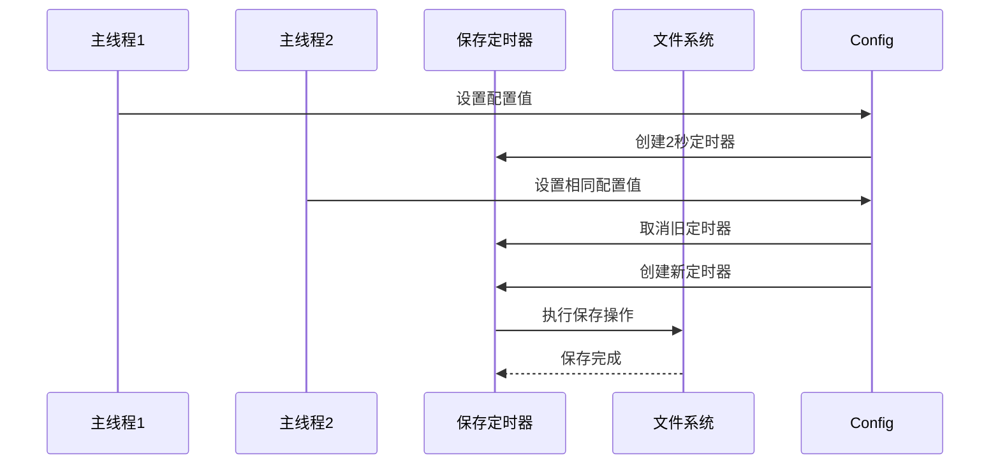

**图表来源**
- [config.py](file://src-python/config.py#L564-L575)

#### 属性访问的安全性

虽然Config类本身不是完全线程安全的，但其设计考虑了常见的并发访问模式：

| 访问类型 | 安全级别 | 注意事项 |
|----------|----------|----------|
| 只读属性读取 | 完全安全 | 多线程并发读取无问题 |
| 写入属性 | 部分安全 | 需要外部同步机制 |
| 配置保存 | 安全 | 使用定时器避免阻塞 |

**章节来源**
- [config.py](file://src-python/config.py#L564-L575)

## 依赖关系分析

Config类与系统其他组件之间存在复杂的依赖关系：

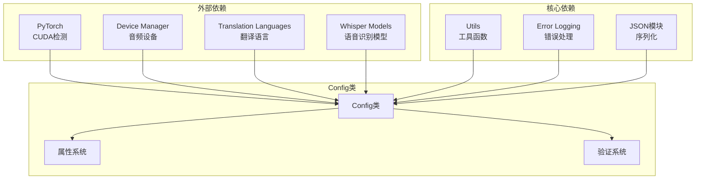

**图表来源**
- [config.py](file://src-python/config.py#L10-L38)
- [config.py](file://src-python/config.py#L531-L540)

**章节来源**
- [config.py](file://src-python/config.py#L10-L38)
- [config.py](file://src-python/config.py#L531-L540)

## 性能考虑

Config类在设计时充分考虑了性能优化：

### 延迟加载机制

Config类使用延迟加载策略来减少启动时间和内存占用：

- **可选模块导入**：使用try-except块安全地导入可选模块
- **动态属性生成**：根据可用的外部资源动态生成配置选项
- **按需初始化**：只有在实际访问时才初始化某些配置项

### 缓存策略

Config类实现了多层缓存机制：

| 缓存层级 | 缓存内容 | 生命周期 | 更新策略 |
|----------|----------|----------|----------|
| 内存缓存 | _config_data | 应用程序生命周期 | 自动更新 |
| 属性缓存 | ManagedDict/ManagedList | 属性生命周期 | 延迟更新 |
| 描述符缓存 | 属性包装器 | 实例生命周期 | 按需创建 |

### 性能优化技术

1. **批量保存**：使用定时器合并多次保存请求
2. **增量更新**：只保存发生变化的配置项
3. **异步处理**：保存操作在后台线程执行
4. **内存管理**：及时清理不再使用的资源

## 故障排除指南

### 常见问题及解决方案

#### 配置文件损坏

当`config.json`文件损坏或格式不正确时，Config类会：
1. 跳过损坏的配置项
2. 使用默认值替代
3. 在下次保存时修复配置文件

#### 权限问题

如果Config类无法写入配置文件：
1. 检查目录写入权限
2. 尝试使用备用配置路径
3. 记录错误信息但不影响应用程序运行

#### 内存不足

当系统内存不足时：
1. 减少缓存大小
2. 延迟加载非关键配置
3. 清理不再使用的配置项

**章节来源**
- [config.py](file://src-python/config.py#L1001-L1017)
- [utils.py](file://src-python/utils.py#L280-L291)

## 结论

Config类的单例模式实现展现了Python中经典设计模式的实际应用。通过精心设计的初始化流程、异常处理机制和性能优化策略，该实现不仅确保了配置数据的一致性和完整性，还提供了良好的用户体验和系统稳定性。

### 主要优势

1. **全局唯一性**：确保整个应用程序使用同一份配置
2. **错误容错性**：即使在各种异常情况下也能保持稳定运行
3. **性能优化**：通过延迟加载和批量保存提高效率
4. **扩展性**：支持动态添加新的配置项而无需修改核心代码
5. **线程安全性**：在多线程环境下提供可靠的配置访问

### 最佳实践建议

1. **合理使用单例模式**：仅在需要全局唯一配置的场景下使用
2. **谨慎处理异常**：始终为可能失败的操作提供适当的错误处理
3. **优化性能**：根据实际需求调整延迟保存的时间间隔
4. **维护兼容性**：在升级配置系统时保持向后兼容性
5. **监控资源使用**：定期检查配置系统的内存和I/O使用情况

Config类的实现为VRCT项目提供了一个强大而灵活的配置管理基础，其设计理念和实现技巧对于类似的系统开发具有重要的参考价值。