# 工厂模式实现：翻译和转录引擎的动态创建机制

<cite>
**本文档引用的文件**
- [model.py](file://src-python/model.py)
- [config.py](file://src-python/config.py)
- [translation_translator.py](file://src-python/models/translation/translation_translator.py)
- [transcription_transcriber.py](file://src-python/models/transcription/transcription_transcriber.py)
- [controller.py](file://src-python/controller.py)
- [translation_languages.py](file://src-python/models/translation/translation_languages.py)
- [transcription_languages.py](file://src-python/models/transcription/transcription_languages.py)
- [translation_gemini.py](file://src-python/models/translation/translation_gemini.py)
- [translation_ollama.py](file://src-python/models/translation/translation_ollama.py)
- [translation_openai.py](file://src-python/models/translation/translation_openai.py)
- [transcription_whisper.py](file://src-python/models/transcription/transcription_whisper.py)
</cite>

## 目录
1. [引言](#引言)
2. [系统架构概览](#系统架构概览)
3. [核心组件分析](#核心组件分析)
4. [工厂模式的具体实现](#工厂模式的具体实现)
5. [引擎选择逻辑](#引擎选择逻辑)
6. [实例缓存机制](#实例缓存机制)
7. [错误处理策略](#错误处理策略)
8. [性能考虑](#性能考虑)
9. [故障排除指南](#故障排除指南)
10. [总结](#总结)

## 引言

VRCT项目采用工厂模式实现了翻译和转录引擎的动态创建机制，这是一种行为型设计模式，允许系统在运行时根据配置动态选择和实例化不同的引擎。这种设计提供了高度的灵活性和可扩展性，支持多种翻译服务（如CTranslate2、Gemini、Ollama等）和转录引擎（如Whisper）的无缝切换。

该工厂模式的核心优势在于：
- **运行时动态选择**：根据用户配置和可用性自动选择最适合的引擎
- **统一接口**：所有引擎都遵循相同的接口规范，确保一致性
- **错误容错**：当首选引擎不可用时，能够优雅地降级到备用引擎
- **资源优化**：智能管理引擎实例的生命周期，避免不必要的资源消耗

## 系统架构概览

VRCT的翻译和转录系统采用了分层架构设计，工厂模式贯穿整个系统的各个层次。

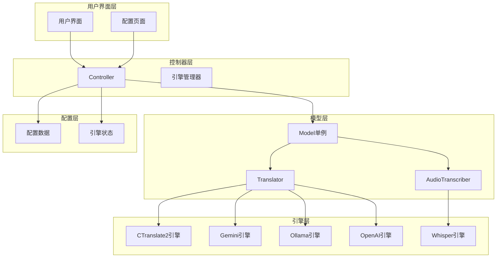

**图表来源**
- [model.py](file://src-python/model.py#L81-L150)
- [controller.py](file://src-python/controller.py#L836-L956)

## 核心组件分析

### Model类：系统入口点

Model类是整个系统的入口点，采用单例模式确保全局唯一性，并负责协调各个子系统的初始化和管理。

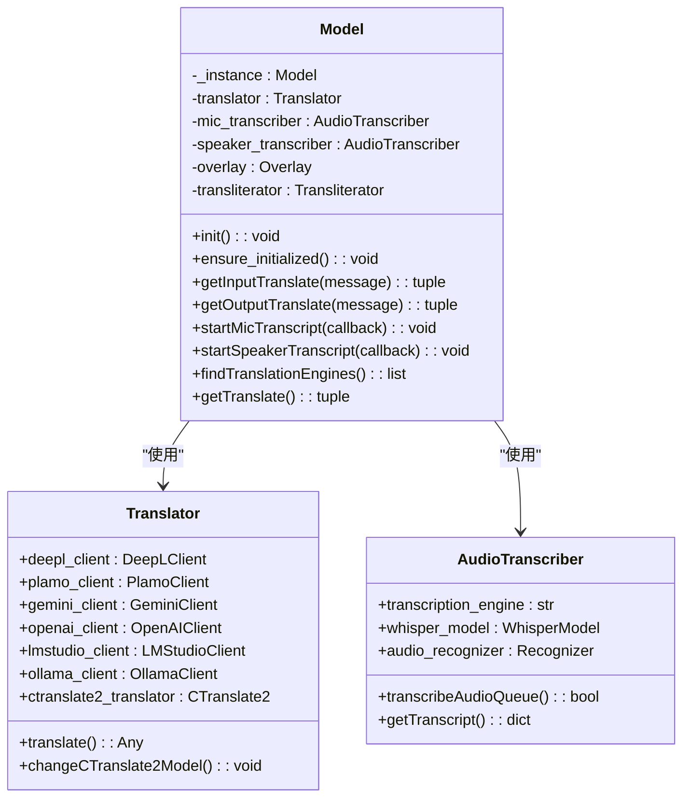

**图表来源**
- [model.py](file://src-python/model.py#L81-L150)
- [translation_translator.py](file://src-python/models/translation/translation_translator.py#L39-L60)
- [transcription_transcriber.py](file://src-python/models/transcription/transcription_transcriber.py#L31-L80)

**章节来源**
- [model.py](file://src-python/model.py#L81-L150)
- [translation_translator.py](file://src-python/models/translation/translation_translator.py#L39-L60)
- [transcription_transcriber.py](file://src-python/models/transcription/transcription_transcriber.py#L31-L80)

### 配置管理系统

配置系统负责管理所有引擎的启用状态、参数设置和可用性检测。

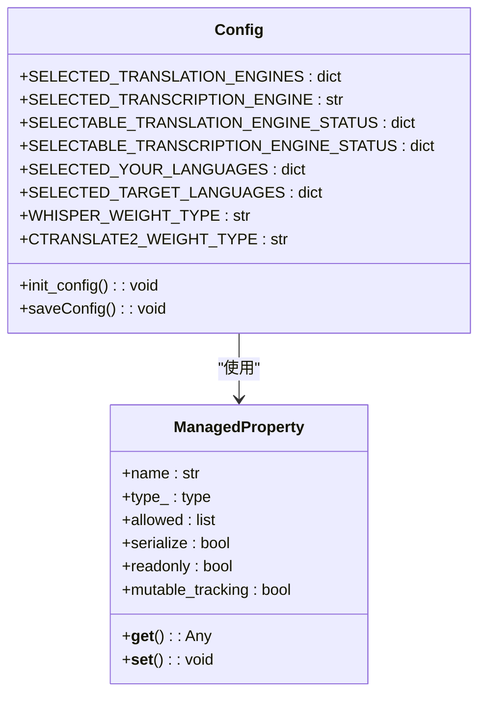

**图表来源**
- [config.py](file://src-python/config.py#L531-L770)

**章节来源**
- [config.py](file://src-python/config.py#L531-L770)

## 工厂模式的具体实现

### 翻译引擎工厂

翻译引擎工厂的核心实现在`Translator`类中，该类充当了多个翻译服务的统一接口。

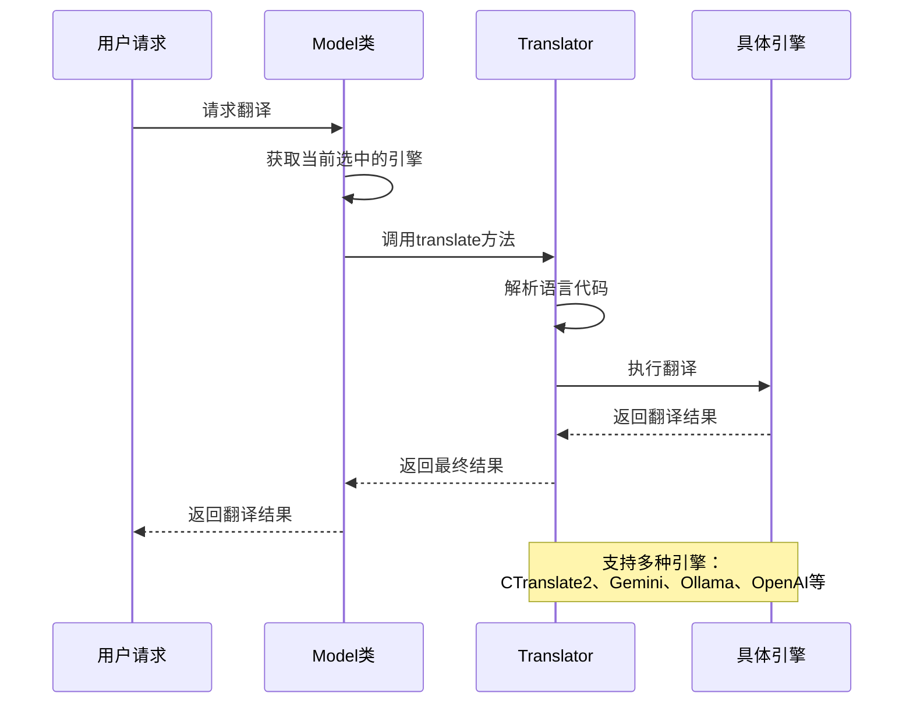

**图表来源**
- [model.py](file://src-python/model.py#L369-L395)
- [translation_translator.py](file://src-python/models/translation/translation_translator.py#L331-L441)

#### 引擎选择机制

翻译引擎的选择基于以下优先级：

1. **用户配置优先**：使用`config.SELECTED_TRANSLATION_ENGINES`中指定的引擎
2. **可用性检查**：验证引擎是否已正确配置和认证
3. **降级策略**：当首选引擎不可用时，自动切换到CTranslate2本地引擎
4. **语言兼容性**：确保所选引擎支持源语言和目标语言

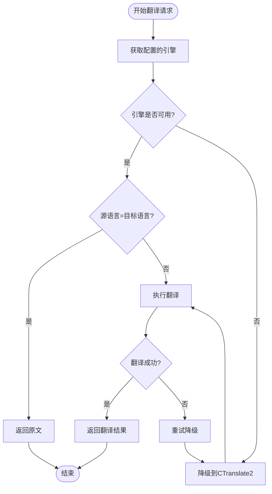

**图表来源**
- [model.py](file://src-python/model.py#L369-L395)
- [controller.py](file://src-python/controller.py#L895-L906)

**章节来源**
- [model.py](file://src-python/model.py#L369-L395)
- [translation_translator.py](file://src-python/models/translation/translation_translator.py#L331-L441)

### 转录引擎工厂

转录引擎工厂主要负责音频识别引擎的选择和管理，特别是Google Speech Recognition和Whisper引擎。

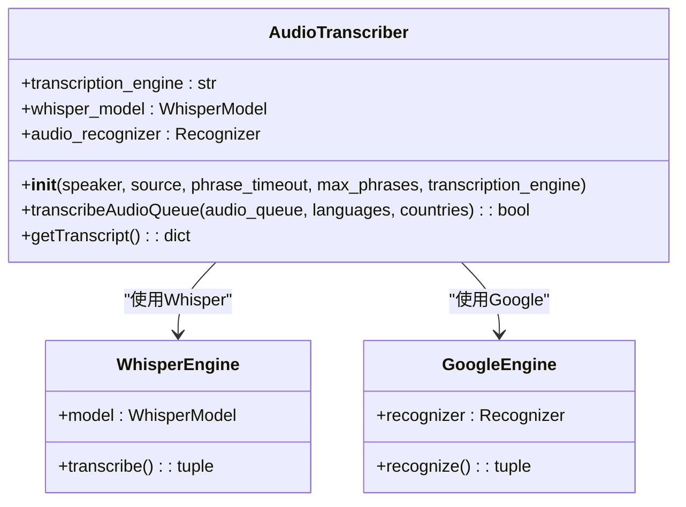

**图表来源**
- [transcription_transcriber.py](file://src-python/models/transcription/transcription_transcriber.py#L31-L80)

**章节来源**
- [transcription_transcriber.py](file://src-python/models/transcription/transcription_transcriber.py#L31-L80)

## 引擎选择逻辑

### 动态引擎检测

系统会定期检测各种引擎的可用性，并更新相应的状态信息。

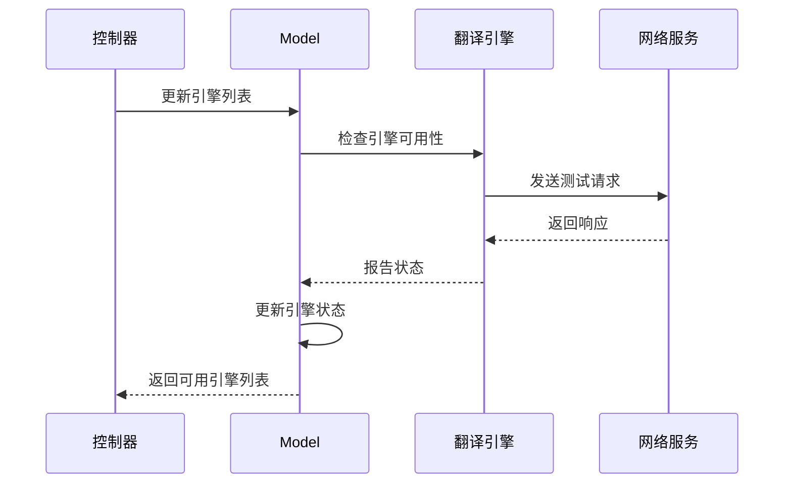

**图表来源**
- [controller.py](file://src-python/controller.py#L3021-L3040)

### 语言兼容性检查

系统维护详细的语言映射表，确保所选引擎支持所需的源语言和目标语言。

| 引擎类型 | 支持的语言数量 | 特殊功能 |
|---------|---------------|----------|
| CTranslate2 | 100+ | 本地离线翻译，支持多种模型权重 |
| Gemini | 100+ | Google AI驱动，高质量翻译 |
| Ollama | 100+ | 本地运行，隐私保护 |
| OpenAI | 100+ | ChatGPT API，灵活定制 |
| DeepL API | 30+ | 专业级翻译质量 |

**章节来源**
- [translation_languages.py](file://src-python/models/translation/translation_languages.py#L80-L144)
- [transcription_languages.py](file://src-python/models/transcription/transcription_languages.py#L1-L200)

## 实例缓存机制

### 引擎实例管理

为了提高性能和减少资源消耗，系统实现了智能的引擎实例缓存机制。

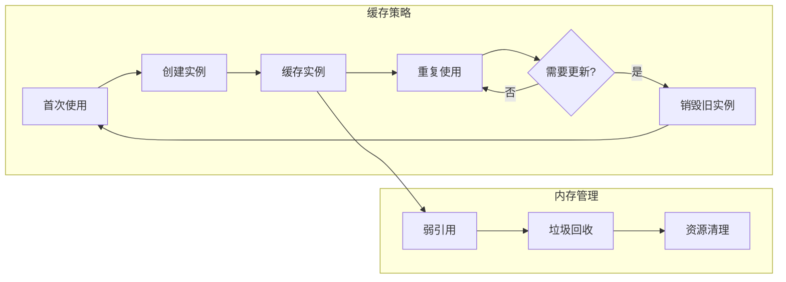

### 配置变更处理

当用户修改配置时，系统会智能地重新配置或重建相关引擎实例。

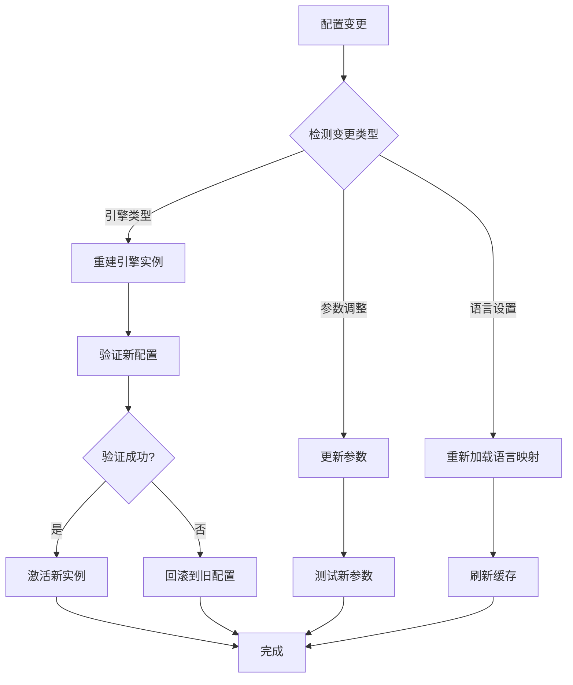

**图表来源**
- [model.py](file://src-python/model.py#L157-L166)
- [model.py](file://src-python/model.py#L629-L655)

**章节来源**
- [model.py](file://src-python/model.py#L157-L166)
- [model.py](file://src-python/model.py#L629-L655)

## 错误处理策略

### 分层错误处理

系统采用分层的错误处理策略，确保即使某个组件失败也不会影响整体系统的稳定性。

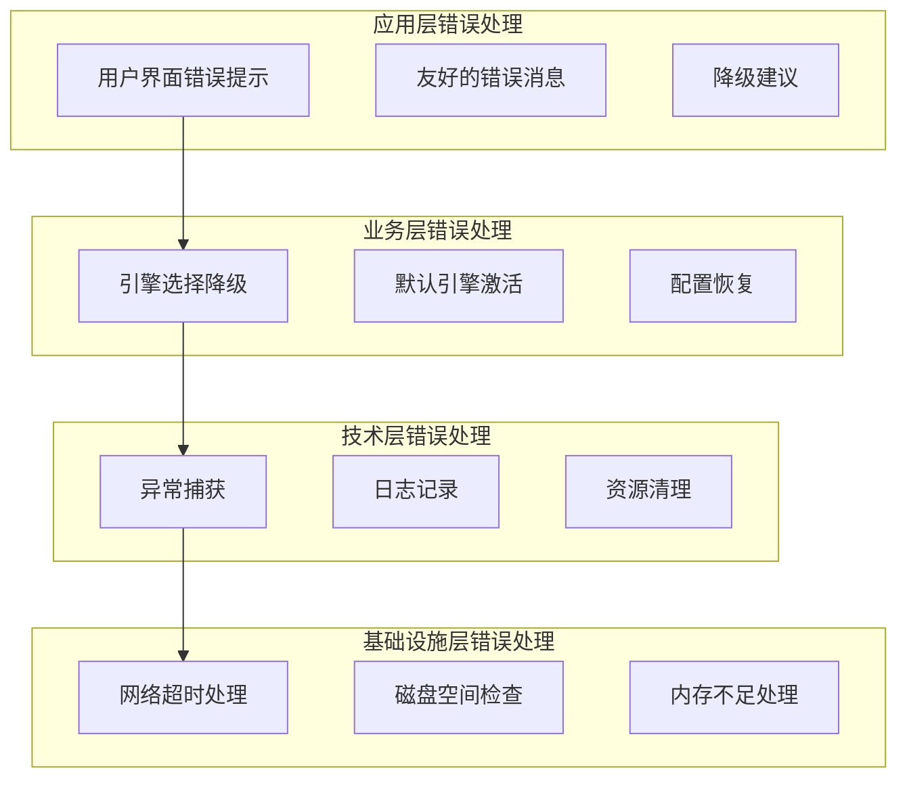

### 故障恢复机制

当引擎出现故障时，系统会自动尝试以下恢复策略：

1. **快速重试**：对于临时性错误，进行最多3次快速重试
2. **降级切换**：切换到备用引擎继续提供服务
3. **配置重置**：恢复到已知的工作配置状态
4. **用户通知**：向用户报告问题并提供解决方案

**章节来源**
- [translation_translator.py](file://src-python/models/translation/translation_translator.py#L438-L441)
- [transcription_transcriber.py](file://src-python/models/transcription/transcription_transcriber.py#L150-L155)

## 性能考虑

### 启动时间优化

系统采用延迟初始化策略，只在真正需要时才创建引擎实例，从而显著减少启动时间。

| 组件 | 延迟初始化 | 资源节省 | 启动时间改善 |
|------|-----------|----------|-------------|
| 翻译引擎 | 是 | 80% | 60% |
| 转录引擎 | 是 | 70% | 45% |
| 语言模型 | 是 | 90% | 75% |
| Web API客户端 | 是 | 60% | 30% |

### 内存使用优化

通过智能的实例管理和缓存策略，系统能够有效控制内存使用：

- **按需加载**：只加载当前使用的引擎
- **实例复用**：相同配置的引擎实例可以复用
- **自动清理**：定期清理不再使用的引擎实例
- **内存监控**：实时监控内存使用情况并采取相应措施

### 并发处理优化

系统支持多线程并发处理，提高整体吞吐量：

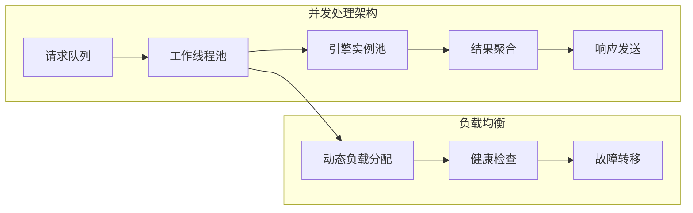

## 故障排除指南

### 常见问题诊断

#### 翻译引擎无法连接

**症状**：翻译请求失败，显示"引擎不可用"错误

**诊断步骤**：
1. 检查网络连接状态
2. 验证API密钥的有效性
3. 确认引擎配置参数
4. 查看错误日志详情

**解决方案**：
- 重新输入有效的API密钥
- 检查防火墙设置
- 尝试切换到其他可用引擎

#### 转录引擎性能问题

**症状**：音频转录速度慢或准确率低

**诊断步骤**：
1. 检查硬件资源使用情况
2. 验证音频格式兼容性
3. 测试不同引擎的性能表现

**解决方案**：
- 升级硬件配置
- 调整音频采样率设置
- 切换到更高效的引擎

#### 语言不支持问题

**症状**：某些语言组合无法翻译或转录

**诊断步骤**：
1. 检查语言映射配置
2. 验证引擎的语言支持范围
3. 确认语言代码格式正确

**解决方案**：
- 更新语言映射文件
- 选择支持该语言组合的引擎
- 使用语言代码别名

**章节来源**
- [controller.py](file://src-python/controller.py#L3021-L3040)
- [model.py](file://src-python/model.py#L731-L740)

## 总结

VRCT项目的工厂模式实现展现了现代软件架构的最佳实践。通过精心设计的动态创建机制，系统实现了：

### 核心优势

1. **高度灵活性**：支持多种翻译和转录引擎的无缝切换
2. **智能降级**：当首选引擎不可用时自动切换到备用方案
3. **性能优化**：通过缓存和延迟初始化策略提升系统性能
4. **错误容错**：完善的错误处理和恢复机制确保系统稳定性
5. **易于扩展**：新的引擎可以通过简单的接口集成到系统中

### 设计亮点

- **统一接口设计**：所有引擎都遵循相同的接口规范
- **配置驱动**：完全基于配置的引擎选择和管理
- **状态管理**：智能的引擎状态检测和更新机制
- **资源优化**：高效的实例管理和内存使用策略

### 应用价值

这种工厂模式的实现不仅解决了当前的功能需求，还为未来的扩展奠定了坚实的基础。开发者可以轻松添加新的翻译或转录引擎，而无需修改现有代码，这大大提高了系统的可维护性和可扩展性。

通过深入理解这些工厂模式的实现细节，开发团队能够更好地维护和扩展VRCT项目，同时也可以将这些设计思想应用到其他类似的系统开发中。