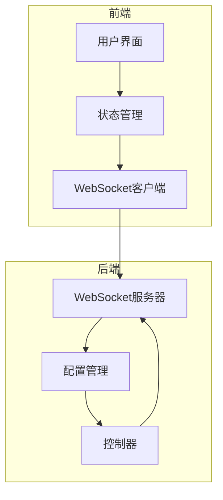
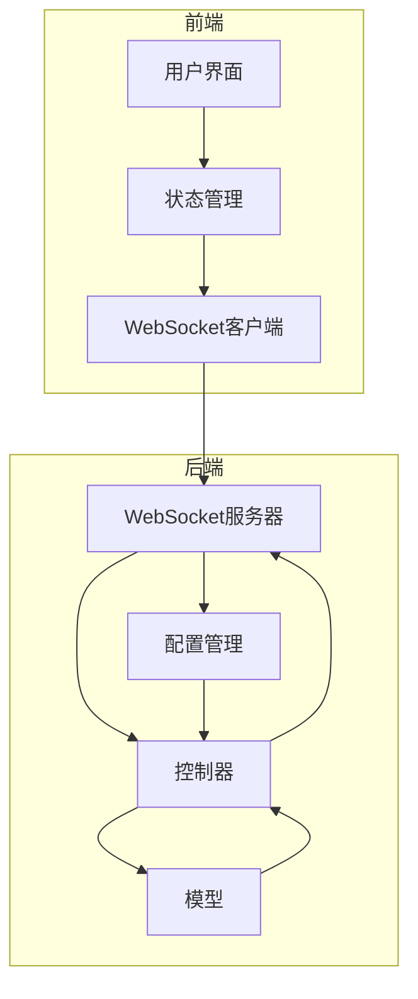
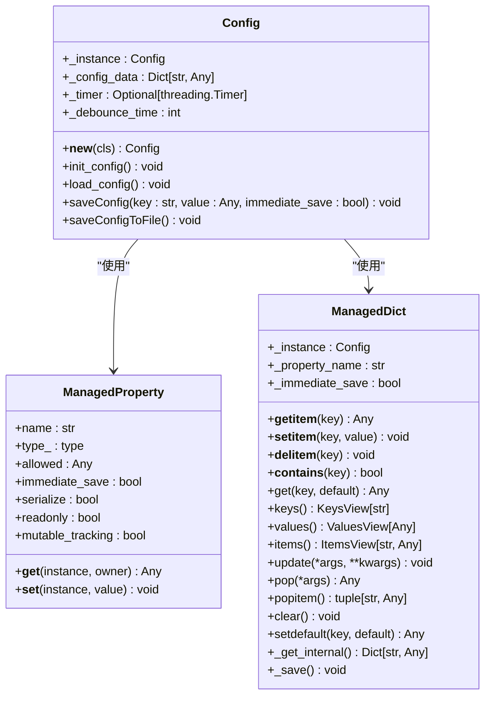
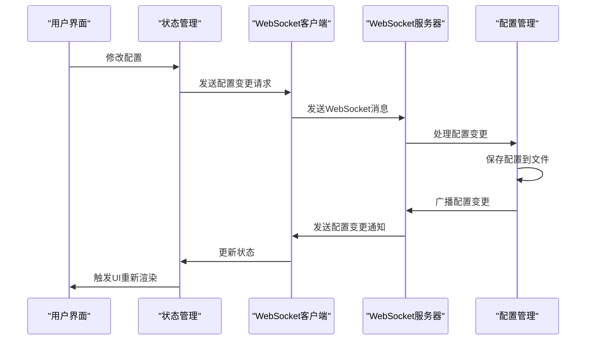
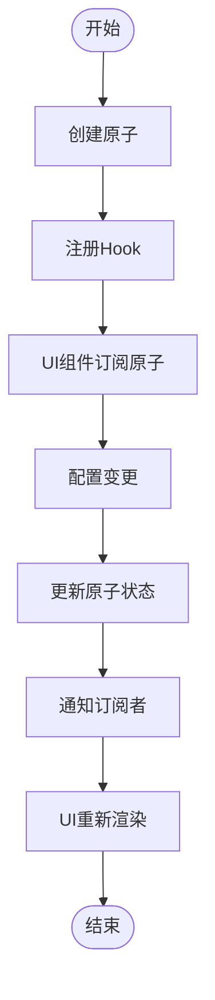
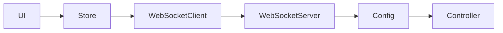

# 观察者模式应用

<cite>
**本文档中引用的文件**  
- [config.py](file://src-python/config.py)
- [useSettingsLogics.js](file://src-ui/logics/configs/config_page_setter/useSettingsLogics.js)
- [store.js](file://src-ui/logics/store.js)
- [ui_config_setter.js](file://src-ui/logics/configs/config_page_setter/ui_config_setter.js)
- [AdvancedSettings.jsx](file://src-ui/views/app/config_page/setting_section/setting_box/advanced_settings/AdvancedSettings.jsx)
- [ConfigPageCloseTriggerController.jsx](file://src-ui/views/app/_app_controllers/ConfigPageCloseTriggerController.jsx)
- [websocket_server.md](file://src-python/docs/details/websocket_server.md)
- [config_zh.md](file://src-python/docs/config_zh.md)
</cite>

## 目录
1. [引言](#引言)
2. [项目结构与配置管理](#项目结构与配置管理)
3. [核心组件分析](#核心组件分析)
4. [架构概览](#架构概览)
5. [详细组件分析](#详细组件分析)
6. [依赖关系分析](#依赖关系分析)
7. [性能考虑](#性能考虑)
8. [故障排除指南](#故障排除指南)
9. [结论](#结论)

## 引言
本项目是一个复杂的跨语言实时通信系统，集成了语音识别、翻译、转录和虚拟现实集成等多种功能。系统采用前后端分离架构，前端使用React构建用户界面，后端使用Python处理核心逻辑。观察者模式在系统中扮演着关键角色，特别是在配置变更的监听与响应机制中。通过精心设计的状态管理和事件发布-订阅机制，系统实现了高效的UI更新和配置同步，确保了用户体验的流畅性和一致性。

## 项目结构与配置管理
项目采用模块化设计，前端和后端代码分离，便于维护和扩展。前端UI位于`src-ui`目录，使用React和TypeScript构建，通过Tauri框架与Python后端进行通信。后端逻辑位于`src-python`目录，负责处理语音识别、翻译、配置管理等核心功能。配置管理是系统的核心，通过`config.py`文件实现，采用单例模式确保配置的一致性。配置数据以JSON格式存储，支持热更新和持久化。前端通过WebSocket与后端通信，实时获取配置变更并更新UI。

**图表来源**  
- [config.py](file://src-python/config.py#L531-L569)
- [store.js](file://src-ui/logics/store.js#L124-L156)
- [websocket_server.md](file://src-python/docs/details/websocket_server.md#L534-L728)

**章节来源**  
- [config.py](file://src-python/config.py#L531-L569)
- [store.js](file://src-ui/logics/store.js#L124-L156)

## 核心组件
系统的核心组件包括配置管理、状态管理、WebSocket通信和UI组件。配置管理组件负责加载、保存和验证配置数据，确保系统状态的一致性。状态管理组件使用Jotai库实现，通过原子化状态管理确保UI的高效更新。WebSocket通信组件负责前后端的实时通信，支持配置变更的推送和命令的执行。UI组件采用React函数式组件和Hooks，实现响应式界面。

**章节来源**  
- [config.py](file://src-python/config.py#L531-L569)
- [store.js](file://src-ui/logics/store.js#L124-L156)
- [useSettingsLogics.js](file://src-ui/logics/configs/config_page_setter/useSettingsLogics.js#L19-L214)

## 架构概览
系统采用分层架构，前端负责用户交互和界面展示，后端负责业务逻辑和数据处理。前后端通过WebSocket进行实时通信，确保配置变更的即时同步。前端使用React Hooks和Jotai实现状态管理，通过自定义Hooks封装业务逻辑，提高代码的可复用性和可维护性。后端使用Python实现核心功能，包括语音识别、翻译和配置管理。配置数据以JSON格式存储，支持热更新和持久化。

**图表来源**  
- [config.py](file://src-python/config.py#L531-L569)
- [store.js](file://src-ui/logics/store.js#L124-L156)
- [websocket_server.md](file://src-python/docs/details/websocket_server.md#L534-L728)

## 详细组件分析
### 配置管理组件分析
配置管理组件是系统的核心，负责加载、保存和验证配置数据。通过单例模式确保配置的一致性，使用JSON格式存储配置数据，支持热更新和持久化。配置数据的变更通过WebSocket推送到前端，触发UI的重新渲染。

#### 配置管理类图

**图表来源**  
- [config.py](file://src-python/config.py#L232-L253)
- [config.py](file://src-python/config.py#L146-L227)

#### 配置变更处理序列图

**图表来源**  
- [useSettingsLogics.js](file://src-ui/logics/configs/config_page_setter/useSettingsLogics.js#L75-L79)
- [config.py](file://src-python/config.py#L564-L569)
- [websocket_server.md](file://src-python/docs/details/websocket_server.md#L650-L665)

### 状态管理组件分析
状态管理组件使用Jotai库实现，通过原子化状态管理确保UI的高效更新。每个配置项对应一个原子，UI组件通过Hooks订阅这些原子，当配置变更时自动触发重新渲染。这种设计避免了不必要的重新渲染，提高了性能。

#### 状态管理流程图

**图表来源**  
- [store.js](file://src-ui/logics/store.js#L124-L156)
- [useSettingsLogics.js](file://src-ui/logics/configs/config_page_setter/useSettingsLogics.js#L19-L214)

**章节来源**  
- [store.js](file://src-ui/logics/store.js#L124-L156)
- [useSettingsLogics.js](file://src-ui/logics/configs/config_page_setter/useSettingsLogics.js#L19-L214)

## 依赖关系分析
系统各组件之间存在紧密的依赖关系。前端UI依赖状态管理组件，状态管理组件依赖WebSocket客户端，WebSocket客户端依赖后端WebSocket服务器，后端WebSocket服务器依赖配置管理组件。这种依赖关系确保了配置变更的链式传播，从UI到后端再到所有订阅者。

**图表来源**  
- [config.py](file://src-python/config.py#L531-L569)
- [store.js](file://src-ui/logics/store.js#L124-L156)
- [websocket_server.md](file://src-python/docs/details/websocket_server.md#L534-L728)

**章节来源**  
- [config.py](file://src-python/config.py#L531-L569)
- [store.js](file://src-ui/logics/store.js#L124-L156)

## 性能考虑
系统在性能方面做了多项优化。首先，配置保存采用防抖机制，避免频繁的I/O操作。其次，状态管理使用原子化设计，确保只有受影响的UI组件重新渲染。此外，WebSocket通信采用二进制协议，减少网络传输开销。最后，后端使用多线程处理耗时操作，避免阻塞主线程。

**章节来源**  
- [config_zh.md](file://src-python/docs/config_zh.md#L360-L364)

## 故障排除指南
当配置变更未生效时，首先检查WebSocket连接是否正常。其次，确认配置文件是否正确保存。如果问题仍然存在，检查后端日志，查看是否有异常信息。对于UI未更新的问题，检查状态管理原子是否正确更新，以及UI组件是否正确订阅了原子。

**章节来源**  
- [config.py](file://src-python/config.py#L531-L569)
- [store.js](file://src-ui/logics/store.js#L124-L156)

## 结论
本项目通过观察者模式实现了高效的配置变更监听与响应机制。前端使用React Hooks和Jotai实现状态管理，后端使用Python和WebSocket实现配置管理和实时通信。系统设计合理，性能优化到位，能够满足复杂应用场景的需求。未来可以进一步优化配置同步机制，减少网络延迟，提高用户体验。