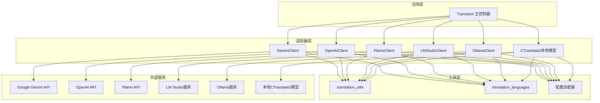
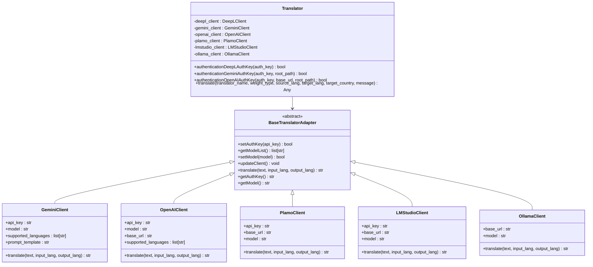
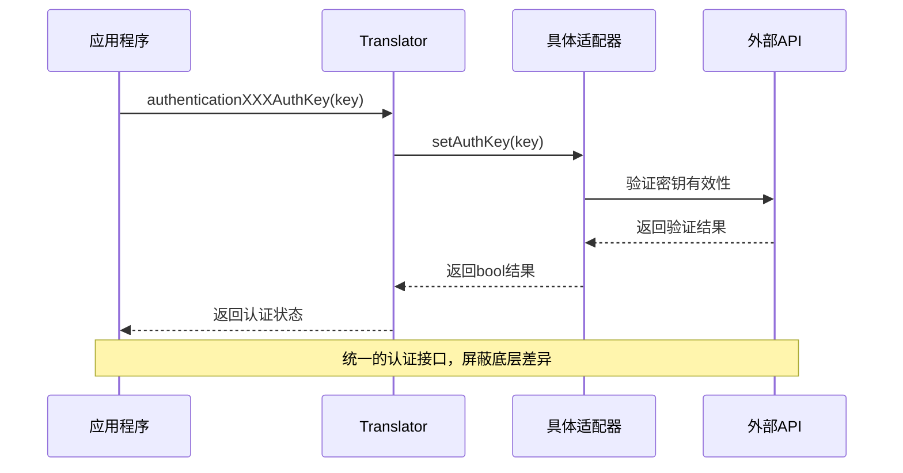
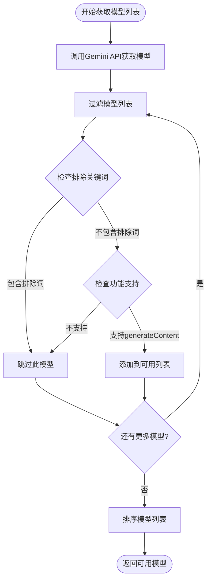
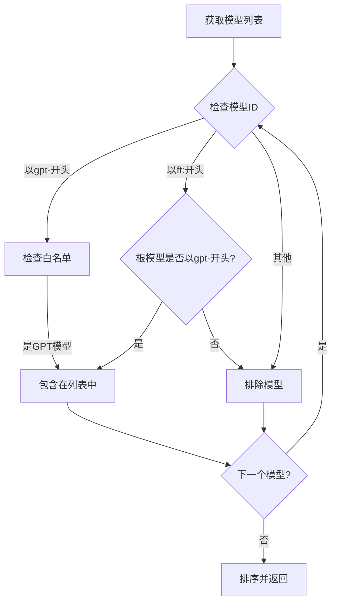
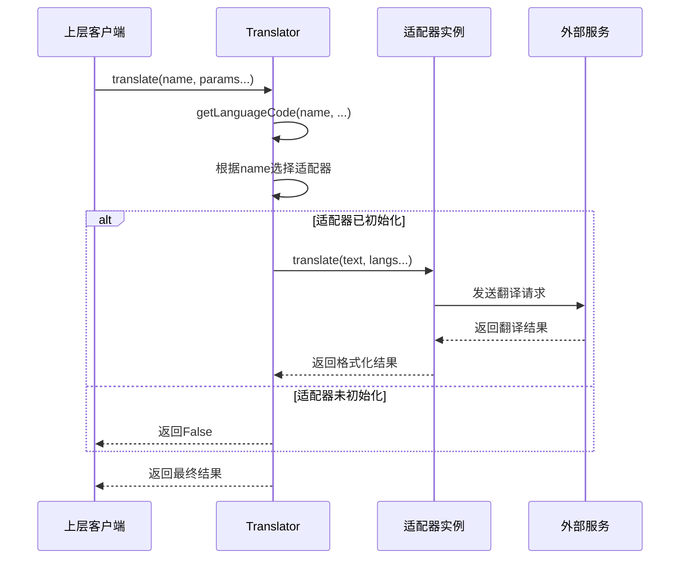
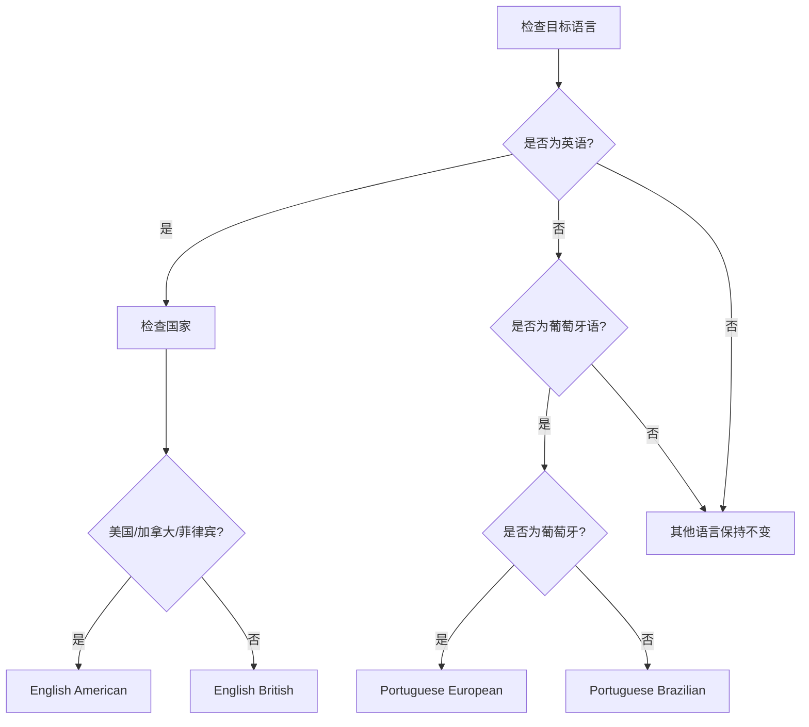
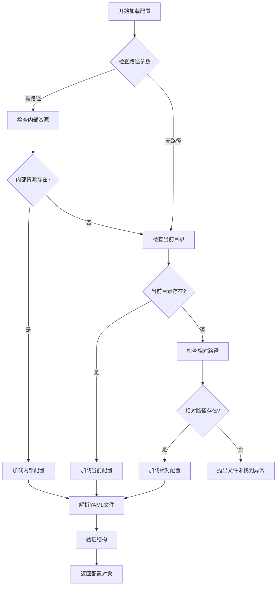
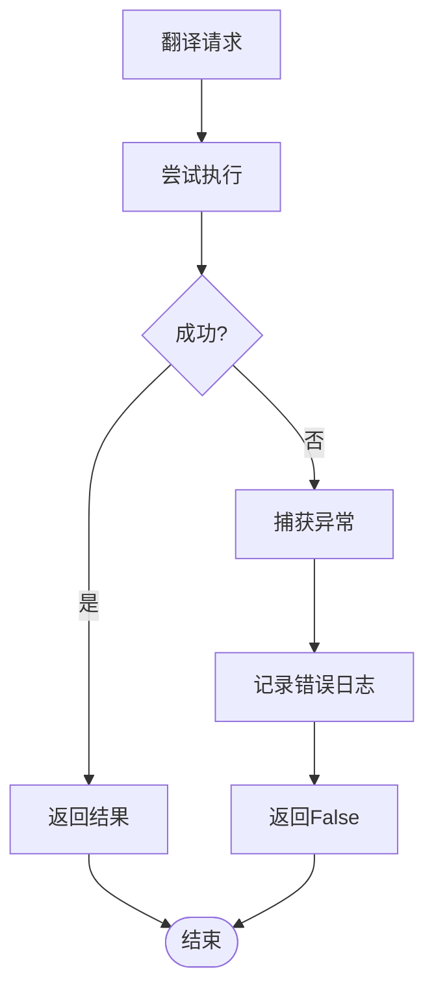

# 适配器模式应用：统一翻译API接口的设计与实现

<cite>
**本文档中引用的文件**
- [translation_translator.py](file://src-python/models/translation/translation_translator.py)
- [translation_gemini.py](file://src-python/models/translation/translation_gemini.py)
- [translation_openai.py](file://src-python/models/translation/translation_openai.py)
- [translation_plamo.py](file://src-python/models/translation/translation_plamo.py)
- [translation_lmstudio.py](file://src-python/models/translation/translation_lmstudio.py)
- [translation_ollama.py](file://src-python/models/translation/translation_ollama.py)
- [translation_utils.py](file://src-python/models/translation/translation_utils.py)
- [translation_languages.py](file://src-python/models/translation/translation_languages.py)
</cite>

## 目录
1. [引言](#引言)
2. [项目结构概览](#项目结构概览)
3. [适配器模式核心概念](#适配器模式核心概念)
4. [抽象基类设计](#抽象基类设计)
5. [具体适配器实现](#具体适配器实现)
6. [统一接口的实现机制](#统一接口的实现机制)
7. [语言映射与配置管理](#语言映射与配置管理)
8. [性能优化与错误处理](#性能优化与错误处理)
9. [架构优势分析](#架构优势分析)
10. [总结](#总结)

## 引言

在现代软件开发中，面对多样化的外部服务和API接口，适配器模式是一种优雅的解决方案。本文档深入分析VRCT项目中的翻译模块如何运用适配器模式，统一不同翻译服务提供商的API接口，为上层业务逻辑提供一致的调用方式。

该系统支持多种翻译服务：Google Gemini、OpenAI、Plamo、LM Studio、Ollama等，每种服务都有其独特的认证方式、模型列表获取机制和翻译接口。通过适配器模式，这些差异被有效屏蔽，实现了高度的可扩展性和维护性。

## 项目结构概览

VRCT项目的翻译模块采用清晰的分层架构，体现了适配器模式的核心思想：



**图表来源**
- [translation_translator.py](file://src-python/models/translation/translation_translator.py#L39-L455)
- [translation_gemini.py](file://src-python/models/translation/translation_gemini.py#L54-L128)
- [translation_openai.py](file://src-python/models/translation/translation_openai.py#L62-L140)

## 适配器模式核心概念

### 什么是适配器模式

适配器模式（Adapter Pattern）是一种结构型设计模式，它允许不兼容的接口协同工作。在VRCT翻译模块中，适配器模式解决了以下关键问题：

1. **接口统一**：不同翻译服务的API接口存在差异
2. **认证标准化**：各服务的认证机制不同
3. **模型管理**：各服务的模型列表获取方式各异
4. **错误处理**：异常处理策略需要统一

### 核心设计原则



**图表来源**
- [translation_translator.py](file://src-python/models/translation/translation_translator.py#L39-L455)
- [translation_gemini.py](file://src-python/models/translation/translation_gemini.py#L54-L128)
- [translation_openai.py](file://src-python/models/translation/translation_openai.py#L62-L140)

**章节来源**
- [translation_translator.py](file://src-python/models/translation/translation_translator.py#L39-L455)
- [translation_gemini.py](file://src-python/models/translation/translation_gemini.py#L54-L128)
- [translation_openai.py](file://src-python/models/translation/translation_openai.py#L62-L140)

## 抽象基类设计

### Translator类的核心职责

`Translator`类作为适配器模式的上下文，负责协调各种翻译服务的使用。它定义了统一的接口，隐藏了底层服务的具体实现细节。

#### 主要功能特性

1. **统一认证接口**：所有翻译服务都通过相同的认证方法
2. **模型管理统一**：获取和设置模型的方式一致
3. **翻译调用标准化**：translate方法对所有服务都适用
4. **错误处理一致性**：失败时返回False或空字符串

#### 认证流程设计



**图表来源**
- [translation_translator.py](file://src-python/models/translation/translation_translator.py#L61-L75)
- [translation_gemini.py](file://src-python/models/translation/translation_gemini.py#L72-L76)

### 适配器接口规范

每个具体的翻译服务适配器都遵循统一的接口规范：

| 方法名称 | 参数 | 返回值 | 功能描述 |
|---------|------|--------|----------|
| `setAuthKey` | api_key: str | bool | 设置并验证API密钥 |
| `getModelList` | 无 | list[str] | 获取可用模型列表 |
| `setModel` | model: str | bool | 设置当前使用的模型 |
| `updateClient` | 无 | void | 更新客户端配置 |
| `translate` | text, input_lang, output_lang | str | 执行翻译操作 |

**章节来源**
- [translation_translator.py](file://src-python/models/translation/translation_translator.py#L39-L455)

## 具体适配器实现

### GeminiClient适配器

GeminiClient专门处理Google Gemini API的集成，展示了适配器模式在处理复杂API时的应用。

#### 关键实现特点

1. **模型过滤机制**：只选择适合翻译任务的模型
2. **提示模板系统**：支持动态生成系统提示
3. **语言支持检测**：自动识别支持的语言对

#### 模型选择算法



**图表来源**
- [translation_gemini.py](file://src-python/models/translation/translation_gemini.py#L29-L52)

### OpenAIClient适配器

OpenAIClient展示了如何适配OpenAI兼容的API服务，包括Azure OpenAI和其他代理服务。

#### 代理URL支持

该适配器的关键创新在于支持自定义base_url，使得它可以适配：
- 官方OpenAI API
- Azure OpenAI服务
- 本地代理服务器
- 第三方兼容服务

#### 模型白名单机制



**图表来源**
- [translation_openai.py](file://src-python/models/translation/translation_openai.py#L25-L60)

### PlamoClient适配器

PlamoClient展示了如何适配第三方API服务，特别是那些使用OpenAI兼容接口的服务。

#### 特殊配置处理

1. **固定基础URL**：使用预定义的API端点
2. **OpenAI兼容性**：复用OpenAI客户端库
3. **简洁实现**：最小化特定逻辑

### LMStudioClient适配器

LMStudioClient专门处理本地运行的大语言模型服务。

#### 本地服务特性

1. **无需API密钥**：使用固定的"lmstudio"密钥
2. **灵活URL配置**：支持任意本地或远程地址
3. **流式处理禁用**：确保稳定性

### OllamaClient适配器

OllamaClient展示了如何适配基于HTTP的本地模型服务。

#### HTTP API适配

1. **简单认证检查**：通过GET请求验证连接
2. **JSON响应解析**：解析模型列表API
3. **默认端口处理**：使用标准的11434端口

**章节来源**
- [translation_gemini.py](file://src-python/models/translation/translation_gemini.py#L54-L128)
- [translation_openai.py](file://src-python/models/translation/translation_openai.py#L62-L140)
- [translation_plamo.py](file://src-python/models/translation/translation_plamo.py#L40-L115)
- [translation_lmstudio.py](file://src-python/models/translation/translation_lmstudio.py#L42-L118)
- [translation_ollama.py](file://src-python/models/translation/translation_ollama.py#L42-L112)

## 统一接口的实现机制

### 翻译调用流程

Translator类通过统一的translate方法，将上层请求路由到相应的适配器实例：



**图表来源**
- [translation_translator.py](file://src-python/models/translation/translation_translator.py#L331-L441)

### 语言代码转换机制

为了处理不同服务之间的语言代码差异，系统实现了智能的语言映射机制：

#### 映射表结构

| 服务类型 | 源语言映射 | 目标语言映射 | 特殊处理 |
|---------|-----------|-------------|----------|
| DeepL_API | 标准代码 | DeepL专用代码 | 国家区分处理 |
| CTranslate2 | 权重类型相关 | 内部代码 | 模型特定映射 |
| 其他服务 | 标准ISO代码 | 服务特定代码 | 通用映射 |

#### 国家区分逻辑



**图表来源**
- [translation_translator.py](file://src-python/models/translation/translation_translator.py#L303-L329)

### 错误处理与降级策略

系统实现了多层次的错误处理机制：

1. **适配器级别**：每个适配器独立处理自身错误
2. **Translator级别**：统一错误收集和日志记录
3. **客户端级别**：提供友好的错误反馈

**章节来源**
- [translation_translator.py](file://src-python/models/translation/translation_translator.py#L331-L441)
- [translation_translator.py](file://src-python/models/translation/translation_translator.py#L303-L329)

## 语言映射与配置管理

### translation_languages模块

该模块负责管理不同翻译服务的语言代码映射关系，是适配器模式中重要的配置层。

#### 配置文件结构

语言映射配置采用YAML格式，支持以下结构：

```yaml
DeepL_API:
  source:
    English: "EN"
    Japanese: "JA"
  target:
    English: "EN"
    Japanese: "JA"
CTranslate2:
  m2m100_418M-ct2-int8:
    source:
      English: "en_XX"
      Japanese: "ja_XX"
    target:
      English: "en_XX"
      Japanese: "ja_XX"
```

#### 验证机制

系统实现了严格的配置验证，确保：

1. **结构完整性**：必须包含source和target字段
2. **数据类型正确性**：所有值必须是字符串
3. **模型特定映射**：CTranslate2支持按模型区分映射

### 提示模板系统

每个适配器都支持动态提示模板，通过YAML配置文件管理：

#### 模板变量系统

| 变量名 | 类型 | 描述 | 示例 |
|-------|------|------|------|
| `supported_languages` | list[str] | 支持的语言列表 | `["English", "Japanese"]` |
| `input_lang` | str | 输入语言名称 | `"English"` |
| `output_lang` | str | 输出语言名称 | `"Japanese"` |

#### 加载机制



**图表来源**
- [translation_utils.py](file://src-python/models/translation/translation_utils.py#L104-L118)

**章节来源**
- [translation_languages.py](file://src-python/models/translation/translation_languages.py#L1-L144)
- [translation_utils.py](file://src-python/models/translation/translation_utils.py#L104-L118)

## 性能优化与错误处理

### 连接池与缓存策略

虽然当前实现没有显式的连接池，但通过以下机制优化性能：

1. **延迟初始化**：适配器只在首次使用时创建
2. **客户端复用**：每次翻译都重新创建客户端，但保持连接状态
3. **模型列表缓存**：避免频繁查询可用模型

### 错误恢复机制

系统实现了多层次的错误恢复：



**图表来源**
- [translation_translator.py](file://src-python/models/translation/translation_translator.py#L438-L441)

### 资源清理与状态管理

每个适配器都实现了良好的资源管理：

1. **API密钥安全**：使用SecretStr保护敏感信息
2. **连接状态跟踪**：明确标识认证状态
3. **模型切换通知**：及时更新客户端配置

**章节来源**
- [translation_translator.py](file://src-python/models/translation/translation_translator.py#L438-L441)

## 架构优势分析

### 可扩展性

适配器模式的最大优势在于其可扩展性：

1. **新服务添加**：只需实现新的适配器类
2. **配置驱动**：通过YAML配置文件管理服务参数
3. **向后兼容**：新增服务不影响现有功能

### 维护性

模块化设计提高了系统的维护性：

1. **职责分离**：每个适配器专注于单一服务
2. **测试友好**：可以独立测试每个适配器
3. **配置集中**：语言映射和提示模板集中管理

### 稳定性

通过适配器模式实现的稳定性保障：

1. **错误隔离**：单个服务故障不影响整体功能
2. **降级处理**：服务不可用时返回默认值
3. **优雅降级**：支持多种认证方式和配置选项

### 开发效率

该架构显著提升了开发效率：

1. **统一接口**：减少重复代码编写
2. **快速原型**：新服务可以快速集成
3. **文档化**：清晰的接口定义便于团队协作

## 总结

VRCT项目中的翻译模块完美诠释了适配器模式的设计精髓。通过`Translator`抽象基类和各个具体适配器的协作，系统成功地：

1. **统一了不同翻译服务的API接口**，为上层业务逻辑提供了完全一致的调用方式
2. **屏蔽了底层服务的技术差异**，包括认证机制、模型管理、错误处理等方面
3. **实现了高度的可扩展性**，支持轻松添加新的翻译服务提供商
4. **保证了系统的稳定性和可靠性**，通过完善的错误处理和降级策略

这种设计不仅满足了当前的功能需求，更为未来的扩展奠定了坚实的基础。对于希望在类似场景中应用适配器模式的开发者来说，VRCT的翻译模块提供了一个优秀的参考实现。

通过深入分析这个案例，我们可以看到适配器模式不仅仅是一个设计模式，更是一种解决实际工程问题的有效方法论。它在保持代码整洁的同时，极大地提升了系统的灵活性和可维护性。