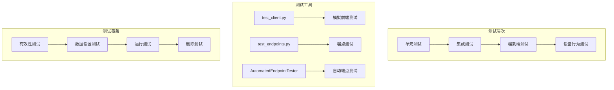
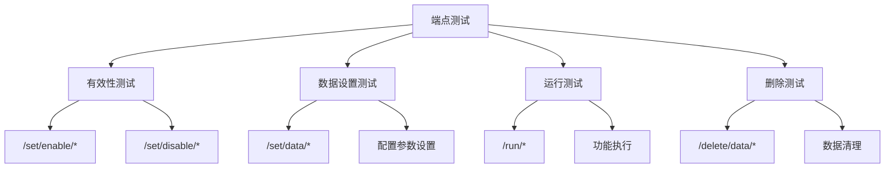

# VRCT项目代码风格与测试策略文档

<cite>
**本文档中引用的文件**
- [编码规范_zh.md](file://src-python/docs/编码规范_zh.md)
- [test_client.py](file://src-python/test_client.py)
- [test_endpoints.py](file://src-python/test_endpoints.py)
- [utils.py](file://src-python/utils.py)
- [controller.py](file://src-python/controller.py)
- [config.py](file://src-python/config.py)
- [device_manager.py](file://src-python/device_manager.py)
- [model.md](file://src-python/docs/details/model.md)
- [controller.md](file://src-python/docs/details/controller.md)
</cite>

## 目录
1. [项目概述](#项目概述)
2. [代码风格规范](#代码风格规范)
3. [测试策略](#测试策略)
4. [错误处理与日志记录](#错误处理与日志记录)
5. [线程与队列处理](#线程与队列处理)
6. [PR提交检查清单](#pr提交检查清单)
7. [最佳实践指南](#最佳实践指南)

## 项目概述

VRCT是一个基于Python的VR翻译和语音识别应用程序，采用模块化架构设计。项目包含前端界面、后端服务和多个功能模块，支持多种翻译引擎、语音识别和VR集成。

### 项目架构特点
- **模块化设计**：功能按领域分离到不同模块
- **类型注解**：采用渐进式类型化策略
- **异步处理**：支持多线程和异步操作
- **插件架构**：支持扩展和插件系统

## 代码风格规范

### 命名规则

VRCT项目遵循严格的命名约定，确保代码的一致性和可读性：

#### 模块与包命名
- **模块名**：使用小写字母，单词间用下划线分隔（如：`overlay_utils.py`）
- **包名**：使用小写字母（如：`models`、`websocket`）

#### 类命名
- **类名**：采用PascalCase（首字母大写的驼峰命名法）
- 示例：`Controller`、`Model`、`Overlay`、`DeviceManager`

#### 函数与方法命名
- **函数名**：使用snake_case（小写字母，单词间用下划线分隔）
- **方法名**：同样使用snake_case
- 示例：`send_request()`、`update_config_settings()`

#### 变量命名
- **变量名**：使用snake_case
- **临时变量**：可使用传统缩写（如：`i`、`j`、`buf`），但优先使用有意义的名称
- **常量**：使用UPPER_SNAKE_CASE
- 示例：`selected_tab_no`、`MAX_CONNECTIONS`、`BUFFER_SIZE`

#### run_mapping键值
- 保持现有惯例，使用短键（如：`transcription_mic`）
- 在`run_mapping`中使用`/run/...`路径格式

**章节来源**
- [编码规范_zh.md](file://src-python/docs/编码规范_zh.md#L23-L30)

### 模块与包结构

#### 包组织原则
- **子领域分离**：各功能领域（ocr、overlay、transcription、translation、websocket等）在`models/`下整理
- **包完整性**：每个包必须包含`__init__.py`文件，便于静态分析和mypy检查
- **空`__init__.py`**：可以使用空的`__init__.py`文件

#### 导入顺序
```python
# 标准库
import os
import json
import threading

# 第三方库
import numpy as np
from typing import Any, Dict, Optional

# 本地模块
from . import overlay_utils
from ..config import config
```

### 类型注解方针

VRCT采用渐进式类型化策略，逐步引入类型注解：

#### 渐进式策略
- **新代码**：尽可能添加类型注解（函数签名、返回值）
- **现有代码**：逐步添加注解，优先为模块边界（public API）的签名添加注解
- **内部细节**：可延迟添加，优先保证模块边界的完整性

#### mypy配置策略
- **初始阶段**：使用宽松配置（如`--ignore-missing-imports --allow-untyped-defs --allow-redefinition`）
- **逐步严格**：逐步启用`--check-untyped-defs`
- **类型注解质量**：避免过度使用`Any`类型，必要时添加`# type: ignore[assignment]`注释说明原因

#### 类型注解示例
```python
from typing import Any, Dict, Optional, List

def example_handler(endpoint: str, data: Any) -> Dict[str, Any]:
    """处理示例端点的函数
    
    Args:
        endpoint: 来源端点字符串（如'/get/data/version'）
        data: 请求负载（GET请求通常为None）
        
    Returns:
        适合printResponse(status, endpoint, result)的字典
    """
    result = {"status": 200, "endpoint": endpoint, "result": data}
    return result
```

**章节来源**
- [编码规范_zh.md](file://src-python/docs/编码规范_zh.md#L49-L58)

### 文档字符串规范

#### docstring格式
- **公共函数/方法**：添加简短的docstring（目的、参数、返回值摘要）
- **一致性要求**：项目内保持一致，避免混乱
- **Google风格示例**：
```python
def set_selected_tab_no(tab_no: int) -> Dict[str, Any]:
    """设置当前标签页
    
    Args:
        tab_no: 要选择的标签页索引
        
    Returns:
        包含状态和新标签页号的响应字典
    """
```

#### 注释规范
- **技术要点**：在实现技巧性地方添加`# NOTE:`或`# FIXME:`注释
- **问题关联**：必要时关联issue编号
- **同步提醒**：如`# NOTE: keep in sync with mainloop.run_mapping`

**章节来源**
- [编码规范_zh.md](file://src-python/docs/编码规范_zh.md#L56-L59)

## 测试策略

VRCT项目提供了全面的测试框架，支持多种测试场景：

### 测试架构概览



**图表来源**
- [test_client.py](file://src-python/test_client.py#L30-L350)
- [test_endpoints.py](file://src-python/test_endpoints.py#L34-L100)

### test_client.py - 端到端测试

#### 核心功能
test_client.py提供了完整的端到端测试能力，模拟前端与后端的交互：

##### TestClient类
- **进程管理**：启动和管理后端进程
- **通信接口**：通过stdin/stdout与后端通信
- **超时处理**：智能超时检测和软超时机制
- **监控功能**：后台watchdog线程持续发送心跳

##### 自动化测试流程
```python
class AutomatedEndpointTester:
    """自动端点测试类"""
    
    def __init__(self, client: TestClient, silent: bool = False):
        # 初始化测试环境
        self.client = client
        self.silent = silent
        
    def run_all(self):
        """运行所有测试"""
        print("=== 有效/无效端点测试 ===")
        for ep in self.validity_endpoints:
            self.test_validity_single(ep)
            
        print("=== 数据设置端点测试 ===")
        for ep in self.set_data_endpoints:
            self.test_set_data_single(ep)
            
        print("=== 执行端点测试 ===")
        for ep in self.run_endpoints:
            self.test_run_single(ep)
```

##### 测试用例生成
测试器能够自动生成测试数据，涵盖各种边界情况：

- **随机数据生成**：为每个端点生成合适的测试数据
- **边界值测试**：测试最小值、最大值和无效值
- **状态验证**：验证设置后的状态变化

**章节来源**
- [test_client.py](file://src-python/test_client.py#L350-L800)

### test_endpoints.py - 端点测试

#### 测试分类体系



**图表来源**
- [test_endpoints.py](file://src-python/test_endpoints.py#L59-L80)

#### 测试方法详解

##### TestMainloop类
```python
class TestMainloop():
    def __init__(self):
        self.main = main_instance
        self.main.start()
        # 初始化映射关系
        self.validity_endpoints = []
        self.set_data_endpoints = []
        self.run_endpoints = []
        self.delete_data_endpoints = []
```

##### 测试执行流程
1. **初始化测试环境**：启动主循环和相关组件
2. **端点分类**：根据功能类型对端点进行分类
3. **批量测试**：执行单个端点的测试
4. **结果记录**：记录测试结果和状态

##### 随机测试模式
```python
def test_endpoints_all_random(self):
    """执行随机访问测试"""
    endpoint_types = ["validity", "set_data", "run", "delete"]
    for i in range(10000):
        endpoints_type = random.choice(endpoint_types)
        # 根据类型选择端点进行测试
```

**章节来源**
- [test_endpoints.py](file://src-python/test_endpoints.py#L34-L150)

### 设备行为测试

#### 设备管理测试
设备管理模块提供了专门的测试功能：

##### DeviceManager测试特性
- **设备发现**：测试音频设备的自动发现
- **设备切换**：验证设备切换功能
- **状态监控**：测试设备状态变化检测
- **错误处理**：验证设备访问失败时的处理

##### 测试用例示例
```python
# 设备可用性测试
def test_device_availability(self):
    """测试设备可用性"""
    devices = self.device_manager.get_available_devices()
    assert len(devices) > 0, "应发现可用设备"
    
# 设备切换测试
def test_device_switching(self):
    """测试设备切换功能"""
    original_device = self.device_manager.get_current_device()
    new_device = self.device_manager.get_alternative_device(original_device)
    self.device_manager.switch_device(new_device)
    assert self.device_manager.get_current_device() == new_device
```

**章节来源**
- [device_manager.py](file://src-python/device_manager.py#L57-L200)

### 模型下载测试

#### 下载进度监控
模型下载测试涵盖了从模型选择到下载完成的完整流程：

##### DownloadCTranslate2类
```python
class DownloadCTranslate2:
    def progressBar(self, progress):
        """下载进度回调"""
        printLog("CTranslate2 Weight Download Progress", progress)
        self.run(200, self.run_mapping["download_progress_ctranslate2_weight"], 
                {"weight_type": self.weight_type, "progress": progress})
    
    def downloaded(self):
        """下载完成回调"""
        if model.checkTranslatorCTranslate2ModelWeight(self.weight_type):
            config.SELECTABLE_CTRANSLATE2_WEIGHT_TYPE_DICT[self.weight_type] = True
            self.run(200, self.run_mapping["downloaded_ctranslate2_weight"], self.weight_type)
```

##### 测试验证点
- **下载开始**：验证下载任务正确启动
- **进度更新**：确认进度回调正常工作
- **完成验证**：检查模型文件是否正确下载
- **错误处理**：测试网络中断等异常情况

**章节来源**
- [controller.py](file://src-python/controller.py#L188-L220)

## 错误处理与日志记录

### 错误处理策略

VRCT项目实现了完善的错误处理机制：

#### 异常捕获原则
- **有用上下文**：捕获异常时记录有用的上下文信息
- **日志记录**：使用`errorLogging()`等工具记录错误
- **传播机制**：在必要时重新抛出异常

#### 错误分类处理
```python
try:
    # 可能出错的操作
    result = risky_operation()
except SpecificException as e:
    # 特定异常处理
    handle_specific_error(e)
except Exception as e:
    # 通用异常处理
    errorLogging()
    raise
```

### 日志记录系统

#### 日志级别定义
```python
class Color:
    GREEN = '\033[32m'
    RED = '\033[31m'
    YELLOW = '\033[33m'
    CYAN = '\033[36m'
    RESET = '\033[0m'
```

#### 日志记录函数
```python
def printLog(log: str, data: Any = None) -> None:
    """记录结构化的进程日志消息"""
    global process_logger
    if process_logger is None:
        process_logger = setupLogger("process", "process.log", logging.INFO)
    
    response = {
        "status": 348,
        "log": log,
        "data": str(data),
    }
    process_logger.info(response)
    serialized = json.dumps(response)
    print(serialized, flush=True)
```

#### 错误日志记录
```python
def errorLogging() -> None:
    """将当前异常回溯记录到错误日志"""
    global error_logger
    if error_logger is None:
        error_logger = setupLogger("error", "error.log", logging.ERROR)
    
    try:
        error_logger.error(traceback.format_exc())
    except Exception:
        # 最后的手段，打印到stdout
        print(traceback.format_exc(), flush=True)
```

**章节来源**
- [utils.py](file://src-python/utils.py#L227-L292)

### 日志配置

#### 旋转文件处理器
```python
def setupLogger(name: str, log_file: str, level: int = logging.INFO) -> logging.Logger:
    """设置具有特定名称和日志文件的logger"""
    logger = logging.getLogger(name)
    logger.setLevel(level)
    logger.propagate = False
    
    max_log_size = 10 * 1024 * 1024  # 10MB
    
    file_handler = RotatingFileHandler(
        log_file,
        maxBytes=max_log_size,
        backupCount=1,
        encoding="utf-8",
        delay=True
    )
    file_handler.setLevel(level)
    
    formatter = logging.Formatter('%(asctime)s - %(name)s - %(levelname)s - %(message)s')
    file_handler.setFormatter(formatter)
    
    if not any(isinstance(h, RotatingFileHandler) and getattr(h, 'baseFilename', None) == getattr(file_handler, 'baseFilename', None) 
              for h in logger.handlers):
        logger.addHandler(file_handler)
    
    return logger
```

**章节来源**
- [utils.py](file://src-python/utils.py#L192-L222)

## 线程与队列处理

### 线程管理策略

VRCT项目采用多线程架构处理并发任务：

#### 线程命名规范
- **前缀约定**：生成线程的函数使用`start_`前缀（如：`start_transcription_thread`）
- **清晰标识**：线程名称应清楚表明其用途

#### 线程生命周期管理
```python
class threadFnc(Thread):
    def __init__(self, fnc, end_fnc=None, daemon: bool = True, *args, **kwargs):
        super().__init__(daemon=daemon)
        self.fnc = fnc
        self.end_fnc = end_fnc
        self.running = threading.Event()
        self.running.set()
        self.daemon = daemon
```

### 队列通信机制

#### 线程间通信
- **Queue基础**：使用`queue.Queue`实现线程间通信
- **安全传递**：确保线程安全的数据传递
- **阻塞控制**：合理使用阻塞和非阻塞模式

#### 监控线程
```python
def _start_watchdog(self):
    """启动watchdog线程（每30秒间隔发送/run/feed_watchdog）"""
    def _watchdog_loop():
        print(f"{Color.CYAN}[Watchdog]{Color.RESET} 开始 (30秒间隔)")
        while not self._watchdog_stop_event.is_set():
            if self._watchdog_stop_event.wait(timeout=30):
                break
            if self.process.poll() is None:
                try:
                    request = {"endpoint": "/run/feed_watchdog"}
                    request_json = json.dumps(request, ensure_ascii=False)
                    self.process.stdin.write(request_json + '\n')
                    self.process.stdin.flush()
                except Exception as e:
                    print(f"{Color.YELLOW}[Watchdog]{Color.RESET} 发送错误: {e}")
                    break
        print(f"{Color.CYAN}[Watchdog]{Color.RESET} 结束")
    
    self._watchdog_thread = threading.Thread(target=_watchdog_loop, daemon=True)
    self._watchdog_thread.start()
```

**章节来源**
- [controller.py](file://src-python/controller.py#L188-L220)
- [test_client.py](file://src-python/test_client.py#L283-L304)

### 设备管理线程

#### DeviceManager线程架构
```python
class DeviceManager:
    def __init__(self):
        self.monitoring_flag: bool = False
        self.th_monitoring: Optional[Thread] = None
        
    def startMonitoring(self):
        """启动设备监控线程"""
        if not self.monitoring_flag:
            self.monitoring_flag = True
            self.th_monitoring = Thread(target=self._monitoring_loop, daemon=True)
            self.th_monitoring.start()
```

**章节来源**
- [device_manager.py](file://src-python/device_manager.py#L57-L122)

## PR提交检查清单

### 代码质量检查

#### 基础检查项
- [ ] **命名规范**：遵循snake_case/PascalCase/UPPER_SNAKE_CASE规则
- [ ] **类型注解**：为函数签名添加类型注解（尽可能）
- [ ] **docstring**：为新的public方法添加docstring
- [ ] **导入顺序**：按照标准库、第三方、本地的顺序整理导入

#### 代码审查要点
- [ ] **错误处理**：检查异常捕获和错误处理逻辑
- [ ] **日志记录**：确认适当的日志记录使用
- [ ] **线程安全**：验证多线程环境下的安全性
- [ ] **资源管理**：检查资源的正确释放

### 测试验证清单

#### 功能测试
- [ ] **单元测试**：为新功能编写单元测试
- [ ] **集成测试**：验证模块间的交互
- [ ] **端到端测试**：使用test_client.py验证完整流程
- [ ] **设备测试**：测试设备相关的功能

#### 性能测试
- [ ] **内存使用**：检查内存泄漏和优化
- [ ] **响应时间**：验证关键操作的响应时间
- [ ] **并发处理**：测试多线程并发性能

### 文档更新检查

#### 文档完整性
- [ ] **API文档**：更新相关API文档
- [ ] **用户指南**：更新用户使用指南
- [ ] **开发文档**：更新开发者文档
- [ ] **变更日志**：记录重要变更

**章节来源**
- [编码规范_zh.md](file://src-python/docs/编码规范_zh.md#L78-L83)

## 最佳实践指南

### 开发建议

#### 代码组织
1. **模块分离**：保持功能模块的独立性
2. **依赖管理**：合理管理模块间的依赖关系
3. **接口设计**：设计清晰的公共接口

#### 性能优化
1. **延迟初始化**：使用延迟初始化减少启动时间
2. **缓存策略**：合理使用缓存提高性能
3. **资源池化**：对频繁使用的资源进行池化管理

#### 可维护性
1. **代码复用**：避免重复代码，提取公共逻辑
2. **配置外化**：将配置参数从代码中分离
3. **错误恢复**：实现优雅的错误恢复机制

### 调试技巧

#### 日志调试
- 使用不同级别的日志记录关键信息
- 在关键节点添加详细的日志输出
- 使用结构化日志便于分析

#### 测试调试
- 使用单元测试快速定位问题
- 利用端到端测试验证完整流程
- 通过模拟测试隔离复杂场景

### 部署注意事项

#### 环境配置
- 确保依赖库版本兼容
- 配置适当的日志目录权限
- 设置合理的超时和重试机制

#### 监控指标
- 监控系统资源使用情况
- 跟踪关键业务指标
- 建立告警机制

**章节来源**
- [model.md](file://src-python/docs/details/model.md#L55-L90)
- [controller.md](file://src-python/docs/details/controller.md#L66-L100)