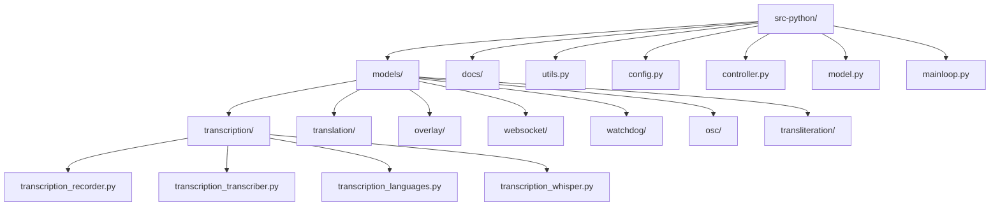

# VRCT项目Python代码风格规范

<cite>
**本文档引用的文件**
- [编码规范_zh.md](file://src-python/docs/编码规范_zh.md)
- [コーディングルール.md](file://src-python/docs/コーディングルール.md)
- [config.py](file://src-python/config.py)
- [controller.py](file://src-python/controller.py)
- [utils.py](file://src-python/utils.py)
- [model.py](file://src-python/model.py)
- [mainloop.py](file://src-python/mainloop.py)
- [device_manager.py](file://src-python/device_manager.py)
</cite>

## 目录
1. [概述](#概述)
2. [命名规则](#命名规则)
3. [模块结构](#模块结构)
4. [类型注解方针](#类型注解方针)
5. [文档字符串规范](#文档字符串规范)
6. [错误处理和日志记录](#错误处理和日志记录)
7. [异步/线程/队列处理](#异步线程队列处理)
8. [代码质量检查清单](#代码质量检查清单)
9. [最佳实践指南](#最佳实践指南)
10. [工具配置建议](#工具配置建议)

## 概述

VRCT项目采用渐进式类型化策略，注重代码的可读性、可维护性和稳定性。本规范在尊重现有风格的基础上，逐步引入现代化的开发工具和最佳实践。

### 核心原则

- **兼容性优先**：保持现有命名和结构不变
- **渐进式改进**：逐步引入类型注解和静态分析
- **实用性导向**：平衡代码质量与开发效率
- **团队协作**：建立统一的编码标准

## 命名规则

### 模块和包命名

- **模块名**：使用小写字母，单词间用下划线分隔（如：`overlay_utils.py`）
- **包名**：使用小写字母（如：`models`、`websocket`）
- **保留现有命名**：对于已存在的文件和模块，保持原有命名风格

### 类命名

- **类名**：采用PascalCase（帕斯卡命名法）
- **示例**：`Controller`、`Model`、`Overlay`、`DeviceManager`

### 函数和方法命名

- **函数名**：使用snake_case（蛇形命名法）
- **方法名**：使用snake_case
- **私有方法**：以单下划线开头（如：`_private_method`）

### 变量命名

- **变量名**：使用snake_case
- **短临时变量**：可使用传统缩写（如：`i`、`j`、`buf`），但优先使用有意义的名称
- **常量**：使用UPPER_SNAKE_CASE（如：`MAX_VALUE`、`DEFAULT_TIMEOUT`）

### 特殊标识符

- **run_mapping键**：保持现有短键命名（如：`transcription_mic`）
- **内部属性**：以双下划线开头（如：`__init__`）

**章节来源**
- [编码规范_zh.md](file://src-python/docs/编码规范_zh.md#L23-L30)
- [コーディングルール.md](file://src-python/docs/コーディングルール.md#L23-L30)

## 模块结构

### 包组织原则



**图表来源**
- [config.py](file://src-python/config.py#L1-L50)
- [controller.py](file://src-python/controller.py#L1-L50)

### 导入规范

1. **标准库导入**：按字母顺序排列
2. **第三方库导入**：按字母顺序排列
3. **本地模块导入**：按字母顺序排列
4. **相对导入**：支持相对导入，但确保项目可放入PYTHONPATH进行测试

```python
# 示例导入顺序
import os
import json
import threading
from typing import Any, Dict, List, Optional

import numpy as np
import torch

from . import overlay_utils
from ..models import transcription, translation
```

### 包初始化

- **必需**：每个包必须包含`__init__.py`文件
- **用途**：支持静态分析和mypy检查
- **内容**：空的`__init__.py`文件即可

**章节来源**
- [编码规范_zh.md](file://src-python/docs/编码规范_zh.md#L32-L47)
- [コーディングルール.md](file://src-python/docs/コーディングルール.md#L32-L47)

## 类型注解方针

### 渐进式类型化策略

VRCT项目采用渐进式类型注解策略，在保证兼容性的前提下逐步完善类型标注。

#### 新代码要求

- **函数签名**：尽可能添加类型注解
- **返回值**：明确标注返回类型
- **变量类型**：复杂变量应添加类型注解

#### 现有代码改进

- **优先级**：模块边界（public API）的签名优先
- **内部细节**：可逐步添加注解
- **过渡期**：使用宽松的mypy配置

#### Mypy配置策略

```toml
# 推荐的pyproject.toml配置
[tool.mypy]
strict_optional = true
warn_unused_configs = true
disallow_untyped_defs = false
disallow_incomplete_defs = false
check_untyped_defs = false
warn_return_any = true
no_implicit_optional = true
```

#### 类型注解示例

```python
from typing import Any, Dict, List, Optional, Union

class ExampleClass:
    def __init__(self, name: str, value: Optional[int] = None) -> None:
        self.name: str = name
        self.value: Optional[int] = value
        self.data: List[Dict[str, Any]] = []
    
    def process_data(self, data: Union[List[str], str]) -> Dict[str, Any]:
        """处理数据并返回结果"""
        if isinstance(data, str):
            return {"result": data.upper()}
        return {"result": [item.upper() for item in data]}
```

**章节来源**
- [编码规范_zh.md](file://src-python/docs/编码规范_zh.md#L49-L58)
- [コーディングルール.md](file://src-python/docs/コーディングルール.md#L49-L58)

## 文档字符串规范

### Docstring风格

VRCT项目采用简洁实用的docstring风格，重点描述函数的功能、参数和返回值。

#### Google风格示例

```python
def set_selected_tab_no(tab_no: int) -> Dict[str, Any]:
    """设置当前标签页。
    
    Args:
        tab_no: 要选择的标签页索引
        
    Returns:
        包含状态和新标签页号的响应字典
    """
    ...
```

#### Numpy风格示例

```python
def process_message(message: str, language: str) -> Dict[str, Any]:
    """处理输入消息并返回翻译结果。
    
    Parameters
    ----------
    message : str
        要处理的消息文本
    language : str
        消息的语言代码
        
    Returns
    -------
    dict
        包含处理结果的字典，格式：
        {
            'status': int,
            'result': dict
        }
    """
    ...
```

### 文档字符串要求

1. **公共API**：为重要的公共函数和方法添加docstring
2. **简洁明了**：描述目的、参数和返回值
3. **一致性**：项目内保持统一风格
4. **实用性**：避免过度复杂的文档格式

### 注释规范

- **NOTE**：重要说明或注意事项
- **FIXME**：需要修复的问题
- **TODO**：待完成的任务

```python
# NOTE: 保持与mainloop.run_mapping同步
# FIXME: 需要优化性能
# TODO: 添加单元测试覆盖
```

**章节来源**
- [编码规范_zh.md](file://src-python/docs/编码规范_zh.md#L56-L58)
- [コーディングルール.md](file://src-python/docs/コーディングルール.md#L56-L58)

## 错误处理和日志记录

### 错误处理原则

VRCT项目采用防御性编程和优雅降级策略。

#### 异常捕获模式

```python
def example_function():
    try:
        # 可能抛出异常的操作
        result = risky_operation()
        return result
    except SpecificException as e:
        # 记录详细错误信息
        errorLogging()
        # 返回默认值或执行备用方案
        return default_value
    except Exception:
        # 记录未知异常
        errorLogging()
        # 重新抛出以便上层处理
        raise
```

#### 防御性编程

```python
def safe_function():
    try:
        # 网络请求的安全处理
        response = requests.get(url, timeout=3)
        return response.status_code == 200
    except requests.RequestException:
        return False  # 返回安全的默认值
```

### 日志记录系统

VRCT项目使用统一的日志记录系统，包含三个主要组件：

#### 日志工具函数

1. **printLog()**：结构化进程日志
2. **printResponse()**：结构化响应日志
3. **errorLogging()**：异常跟踪记录

#### 日志配置

```python
# 日志文件轮转配置
max_log_size = 10 * 1024 * 1024  # 10MB
backup_count = 1

# 日志格式
formatter = logging.Formatter('%(asctime)s - %(name)s - %(levelname)s - %(message)s')
```

#### 日志使用示例

```python
# 进程日志
printLog("设备初始化完成", {"devices": device_list})

# 响应日志
printResponse(200, "/run/initialize", {"status": "success"})

# 错误日志
try:
    dangerous_operation()
except Exception:
    errorLogging()  # 记录完整异常堆栈
```

### 错误恢复机制

1. **自动降级**：功能失败时使用备用方案
2. **状态监控**：定期检查系统健康状态
3. **优雅关闭**：确保资源正确释放

**章节来源**
- [utils.py](file://src-python/utils.py#L224-L293)
- [device_manager.py](file://src-python/device_manager.py#L124-L140)

## 异步/线程/队列处理

### 线程管理原则

VRCT项目广泛使用线程处理并发任务，采用队列进行线程间通信。

#### 线程命名约定

- **启动函数**：使用`start_`前缀（如：`start_transcription_thread`）
- **线程类**：继承`Thread`基类
- **守护线程**：设置`daemon=True`

#### 线程安全队列

```python
from queue import Queue
from threading import Thread

class WorkerThread(Thread):
    def __init__(self, queue: Queue):
        super().__init__(daemon=True)
        self.queue = queue
        self.running = True
    
    def run(self):
        while self.running:
            try:
                item = self.queue.get(timeout=0.5)
                self.process_item(item)
            except Empty:
                continue
    
    def process_item(self, item):
        # 处理逻辑
        pass
```

#### 线程池管理

```python
class ThreadPool:
    def __init__(self, worker_count: int = 3):
        self.queue = Queue()
        self.threads: List[Thread] = []
        self.worker_count = worker_count
    
    def start_workers(self):
        for i in range(self.worker_count):
            worker = WorkerThread(self.queue)
            worker.start()
            self.threads.append(worker)
    
    def stop(self):
        self.running = False
        for thread in self.threads:
            thread.join(timeout=2.0)
```

### 并发控制

#### 锁机制

```python
from threading import Lock, Event

class ConcurrentHandler:
    def __init__(self):
        self.lock = Lock()
        self.stop_event = Event()
    
    def process_concurrent_request(self, data):
        with self.lock:
            # 临界区代码
            result = self.process_data(data)
        return result
```

#### 条件变量

```python
from threading import Condition

class ProducerConsumer:
    def __init__(self):
        self.condition = Condition()
        self.buffer = []
    
    def produce(self, item):
        with self.condition:
            self.buffer.append(item)
            self.condition.notify()  # 通知消费者
    
    def consume(self):
        with self.condition:
            while not self.buffer:
                self.condition.wait()  # 等待生产者
            return self.buffer.pop(0)
```

**章节来源**
- [mainloop.py](file://src-python/mainloop.py#L408-L588)
- [model.py](file://src-python/model.py#L37-L80)

## 代码质量检查清单

### PR提交检查清单

#### 基础检查项

- [ ] **命名规范**：遵循snake_case、PascalCase、UPPER_SNAKE_CASE规则
- [ ] **类型注解**：函数签名添加类型注解（尽可能）
- [ ] **文档字符串**：新的公共方法添加docstring
- [ ] **日志记录**：使用`printResponse`等工具输出JSON到stdout
- [ ] **错误处理**：适当的异常捕获和日志记录
- [ ] **导入顺序**：标准库、第三方、本地模块的正确排序

#### 高级检查项

- [ ] **mypy检查**：通过mypy（relaxed）检查
- [ ] **ruff检查**：通过ruff代码检查
- [ ] **文档更新**：如有API变更，更新相关文档
- [ ] **测试覆盖**：添加必要的单元测试

### 自动化工具配置

#### Ruff配置

```toml
# pyproject.toml
[tool.ruff]
line-length = 88
extend-ignore = ["E203"]
select = ["E", "F", "W", "C90"]

[tool.ruff.format]
quote-style = "double"
indent-style = "space"
skip-magic-trailing-comma = false
line-ending = "auto"
```

#### Pre-commit配置

```yaml
# .pre-commit-config.yaml
repos:
  - repo: https://github.com/charliermarsh/ruff-pre-commit
    rev: v0.14.0
    hooks:
      - id: ruff
        args: ["--fix"]
  - repo: https://github.com/PyCQA/isort
    rev: 5.12.0
    hooks:
      - id: isort
  - repo: https://github.com/pre-commit/mirrors-mypy
    rev: v1.18.2
    hooks:
      - id: mypy
        args: ["--ignore-missing-imports", "--allow-untyped-defs", "--allow-redefinition"]
```

**章节来源**
- [编码规范_zh.md](file://src-python/docs/编码规范_zh.md#L78-L92)
- [コーディングルール.md](file://src-python/docs/コーディングルール.md#L78-L92)

## 最佳实践指南

### 架构设计原则

#### 单一职责原则

```python
# 好的设计：单一职责的类
class ConfigManager:
    """负责配置管理的核心类"""
    
    def load_config(self):
        """加载配置文件"""
        pass
    
    def save_config(self):
        """保存配置到文件"""
        pass

class TranslationEngine:
    """负责翻译功能的引擎类"""
    
    def translate(self, text: str, source: str, target: str):
        """执行翻译操作"""
        pass
```

#### 开闭原则

```python
# 使用抽象基类实现开闭原则
from abc import ABC, abstractmethod

class BaseTranslator(ABC):
    @abstractmethod
    def translate(self, text: str) -> str:
        pass

class OpenAITranslator(BaseTranslator):
    def translate(self, text: str) -> str:
        # OpenAI特定实现
        pass

class GeminiTranslator(BaseTranslator):
    def translate(self, text: str) -> str:
        # Gemini特定实现
        pass
```

### 性能优化建议

#### 资源管理

```python
# 使用上下文管理器确保资源正确释放
with open('config.json', 'r') as f:
    config_data = json.load(f)

# 数据库连接管理
class DatabaseManager:
    def __enter__(self):
        self.connection = create_connection()
        return self.connection
    
    def __exit__(self, exc_type, exc_val, exc_tb):
        if self.connection:
            self.connection.close()
```

#### 缓存策略

```python
from functools import lru_cache

@lru_cache(maxsize=128)
def expensive_calculation(input_data: str) -> str:
    """缓存昂贵计算的结果"""
    # 复杂的计算逻辑
    return processed_data
```

### 测试友好设计

#### 可测试性原则

```python
# 依赖注入提高可测试性
class Service:
    def __init__(self, config: Config, logger: Logger):
        self.config = config
        self.logger = logger
    
    def process(self, data):
        # 使用注入的依赖
        return self.config.validate(data)
```

#### 模块化设计

```python
# 分离关注点，便于测试
class ValidationService:
    def validate_input(self, data):
        # 输入验证逻辑
        pass

class ProcessingService:
    def process_data(self, data):
        # 数据处理逻辑
        pass

class IntegrationService:
    def __init__(self, validation: ValidationService, processing: ProcessingService):
        self.validation = validation
        self.processing = processing
    
    def execute(self, data):
        # 组合多个服务
        validated = self.validation.validate_input(data)
        return self.processing.process_data(validated)
```

**章节来源**
- [config.py](file://src-python/config.py#L531-L700)
- [controller.py](file://src-python/controller.py#L11-L50)

## 工具配置建议

### 开发环境配置

#### VS Code配置

```json
{
    "python.formatting.provider": "ruff",
    "python.linting.enabled": true,
    "python.linting.ruffEnabled": true,
    "python.analysis.typeCheckingMode": "basic",
    "python.analysis.autoImportCompletions": true,
    "editor.codeActionsOnSave": {
        "source.fixAll.ruff": true
    }
}
```

#### IDE集成

1. **Ruff**：代码格式化和检查
2. **mypy**：类型检查
3. **isort**：导入排序
4. **pytest**：单元测试

### 持续集成配置

#### GitHub Actions工作流

```yaml
name: Python CI

on:
  push:
    branches: [ main ]
  pull_request:
    branches: [ main ]

jobs:
  test:
    runs-on: ubuntu-latest
    steps:
    - uses: actions/checkout@v2
    
    - name: Set up Python
      uses: actions/setup-python@v2
      with:
        python-version: '3.9'
    
    - name: Install dependencies
      run: |
        pip install -r requirements.txt
        pip install ruff mypy pytest
    
    - name: Run ruff check
      run: ruff check src-python/
    
    - name: Run mypy
      run: mypy src-python/
    
    - name: Run tests
      run: pytest tests/
```

### 团队协作规范

#### 代码审查要点

1. **命名一致性**：检查命名是否符合规范
2. **类型注解完整性**：确保新增代码有适当类型注解
3. **错误处理合理性**：评估异常处理是否恰当
4. **文档完整性**：确认公共API有充分的文档
5. **性能影响**：评估新代码对性能的影响

#### 版本控制最佳实践

```bash
# 提交信息格式
git commit -m "feat: 添加新的翻译引擎支持

- 新增OpenAI翻译引擎
- 更新配置系统
- 添加相应的单元测试

Fixes #123"
```

**章节来源**
- [编码规范_zh.md](file://src-python/docs/编码规范_zh.md#L132-L170)
- [コーディングルール.md](file://src-python/docs/コーディングルール.md#L132-L170)