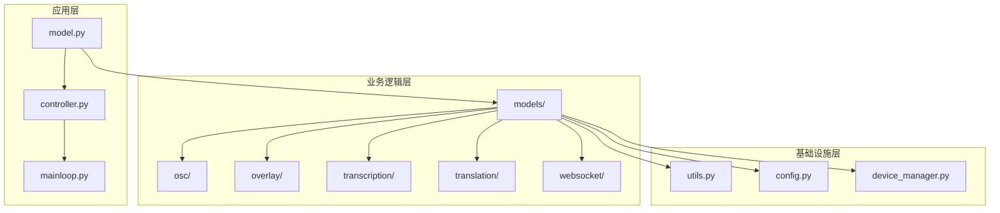
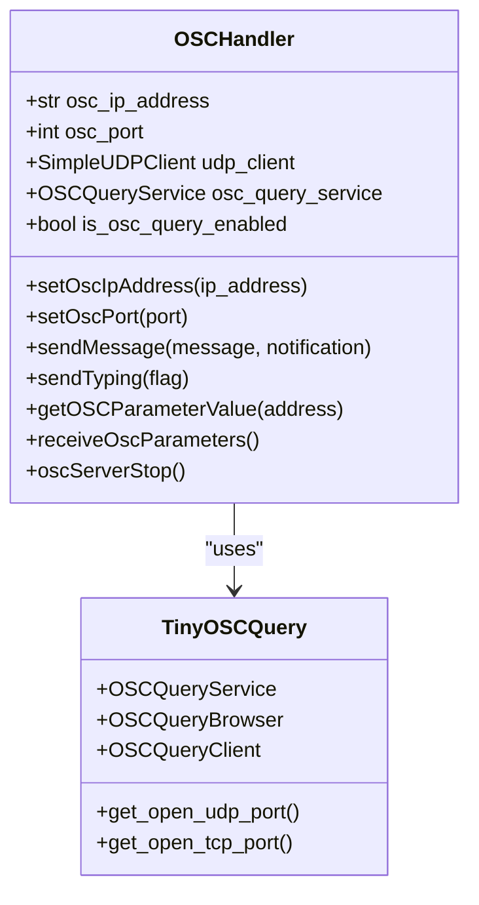
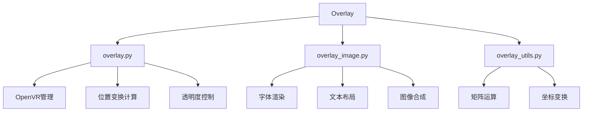
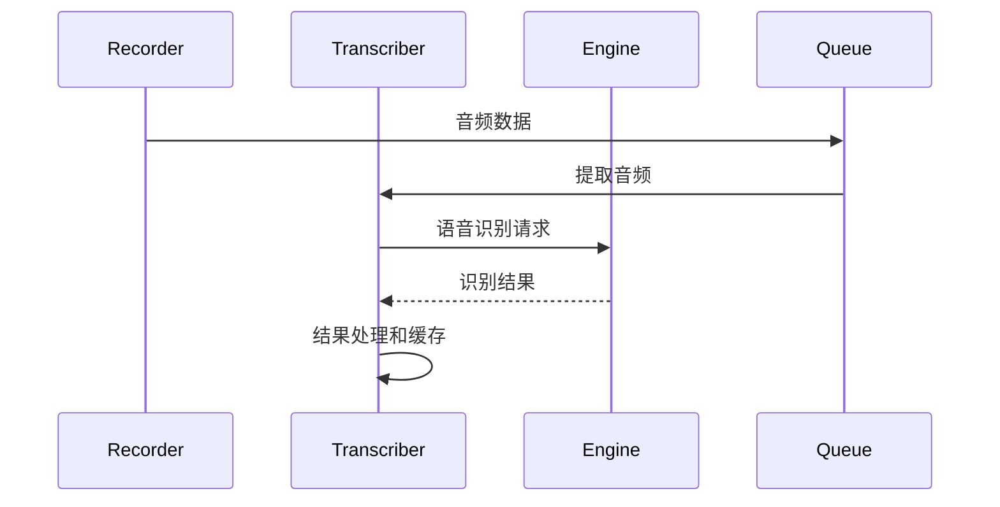
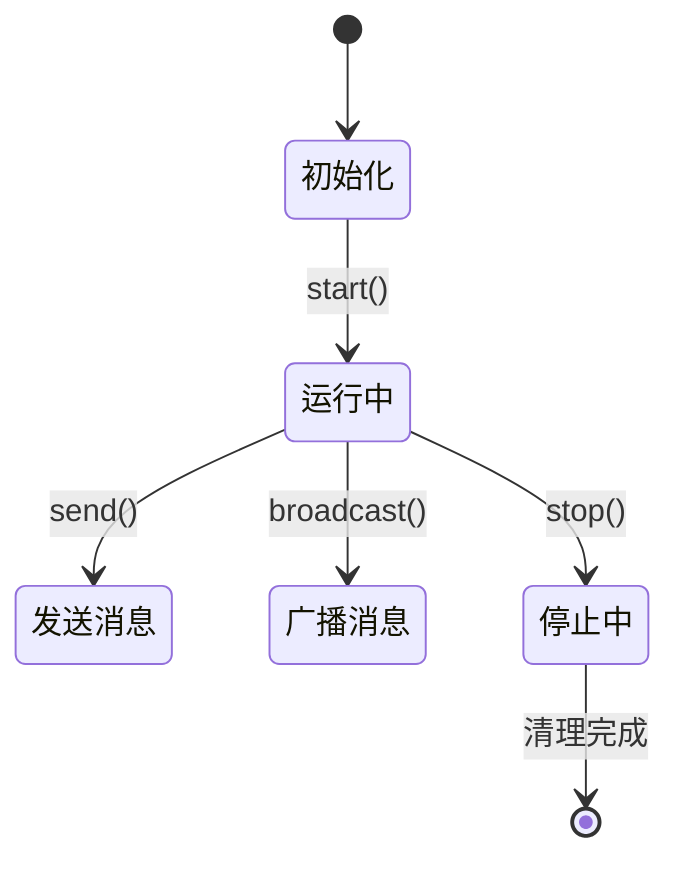
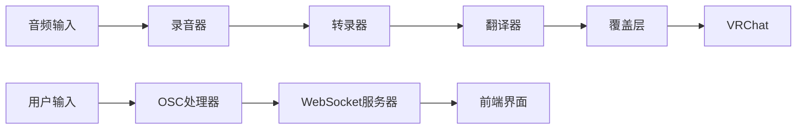
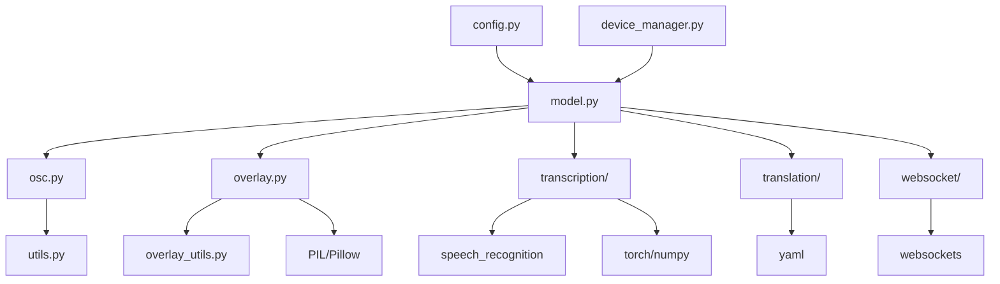

# VRCT项目Python模块结构规范

<cite>
**本文档引用的文件**
- [src-python/models/__init__.py](file://src-python/models/__init__.py)
- [src-python/models/osc/osc.py](file://src-python/models/osc/osc.py)
- [src-python/models/overlay/__init__.py](file://src-python/models/overlay/__init__.py)
- [src-python/models/overlay/overlay.py](file://src-python/models/overlay/overlay.py)
- [src-python/models/overlay/overlay_image.py](file://src-python/models/overlay/overlay_image.py)
- [src-python/models/overlay/overlay_utils.py](file://src-python/models/overlay/overlay_utils.py)
- [src-python/models/transcription/transcription_recorder.py](file://src-python/models/transcription/transcription_recorder.py)
- [src-python/models/transcription/transcription_transcriber.py](file://src-python/models/transcription/transcription_transcriber.py)
- [src-python/models/transcription/transcription_languages.py](file://src-python/models/transcription/transcription_languages.py)
- [src-python/models/websocket/__init__.py](file://src-python/models/websocket/__init__.py)
- [src-python/models/websocket/websocket_server.py](file://src-python/models/websocket/websocket_server.py)
- [src-python/model.py](file://src-python/model.py)
</cite>

## 目录
1. [项目概述](#项目概述)
2. [包结构设计原则](#包结构设计原则)
3. [__init__.py使用规范](#__init__py使用规范)
4. [核心模块职责划分](#核心模块职责划分)
5. [功能模块化设计思路](#功能模块化设计思路)
6. [避免循环导入的最佳实践](#避免循环导入的最佳实践)
7. [模块间依赖关系](#模块间依赖关系)
8. [总结与建议](#总结与建议)

## 项目概述

VRCT项目采用分层模块化架构，将Python后端代码组织在`src-python`目录下，通过清晰的包结构实现功能分离和代码复用。项目的核心设计理念是将不同功能领域划分为独立的子模块，每个模块负责特定的功能域，同时保持模块间的松耦合关系。

## 包结构设计原则

### 分层架构模式

VRCT项目采用三层架构设计：



**图表来源**
- [src-python/model.py](file://src-python/model.py#L1-L50)
- [src-python/models/__init__.py](file://src-python/models/__init__.py#L1-L6)

### 功能域隔离原则

项目按照功能域将模块组织为以下主要类别：

1. **通信模块**：OSC消息处理和WebSocket服务器
2. **显示模块**：VR聊天室覆盖层和图像渲染
3. **语音处理模块**：录音、转录和语言识别
4. **翻译模块**：多引擎翻译服务
5. **工具模块**：通用工具函数和配置管理

**章节来源**
- [src-python/models/osc/osc.py](file://src-python/models/osc/osc.py#L1-L30)
- [src-python/models/overlay/overlay.py](file://src-python/models/overlay/overlay.py#L1-L50)
- [src-python/models/transcription/transcription_recorder.py](file://src-python/models/transcription/transcription_recorder.py#L1-L30)

## __init__.py使用规范

### models包级初始化

项目在`src-python/models`目录下提供了简洁的包级初始化文件，遵循静态分析和打包的最佳实践：

```python
"""models package init for static analysis and packaging."""

__all__ = [
    # subpackages are discovered implicitly
]
```

这种设计遵循以下原则：
- 明确声明包级接口
- 支持静态分析工具
- 避免不必要的导入开销
- 符合Python包标准

**章节来源**
- [src-python/models/__init__.py](file://src-python/models/__init__.py#L1-L6)

### 子包级初始化

#### overlay包初始化

overlay包展示了良好的模块导出实践：

```python
"""models.overlay package init for static analysis."""

from . import overlay_utils  # re-export helper for ease-of-use in tooling

__all__ = ["overlay_utils"]
```

特点：
- 导入必要的辅助模块
- 明确导出公共接口
- 支持工具链集成

**章节来源**
- [src-python/models/overlay/__init__.py](file://src-python/models/overlay/__init__.py#L1-L6)

#### websocket包初始化

websocket包采用简洁的导出策略：

```python
# WebSocketサーバーモジュール
from .websocket_server import WebSocketServer

__all__ = ["WebSocketServer"]
```

**章节来源**
- [src-python/models/websocket/__init__.py](file://src-python/models/websocket/__init__.py#L1-L5)

## 核心模块职责划分

### OSC模块（src-python/models/osc）

OSC模块负责VRChat客户端与外部应用之间的OSC协议通信：



**图表来源**
- [src-python/models/osc/osc.py](file://src-python/models/osc/osc.py#L40-L80)

主要职责：
- OSC消息发送和接收
- OSCQuery协议支持
- 本地地址检测和功能适配
- 异常处理和资源清理

**章节来源**
- [src-python/models/osc/osc.py](file://src-python/models/osc/osc.py#L40-L241)

### Overlay模块（src-python/models/overlay）

Overlay模块实现VR聊天室覆盖层功能，包含多个子模块：



**图表来源**
- [src-python/models/overlay/overlay.py](file://src-python/models/overlay/overlay.py#L1-L50)
- [src-python/models/overlay/overlay_image.py](file://src-python/models/overlay/overlay_image.py#L1-L50)
- [src-python/models/overlay/overlay_utils.py](file://src-python/models/overlay/overlay_utils.py#L1-L50)

#### overlay.py - 核心覆盖层管理

负责OpenVR系统集成和覆盖层生命周期管理：

- OpenVR初始化和清理
- 多尺寸覆盖层管理
- 实时位置和透明度更新
- 线程安全的消息循环

#### overlay_image.py - 图像渲染引擎

提供复杂的文本渲染和图像合成功能：

- 多语言字体支持
- Ruby标记渲染（日语文本）
- 文本换行和布局算法
- 圆角背景和阴影效果

#### overlay_utils.py - 数学工具库

实现3D变换数学运算：

- 3x4矩阵到4x4齐次矩阵转换
- 旋转变换矩阵计算
- 欧拉角到旋转矩阵转换
- 坐标系变换组合

**章节来源**
- [src-python/models/overlay/overlay.py](file://src-python/models/overlay/overlay.py#L85-L388)
- [src-python/models/overlay/overlay_image.py](file://src-python/models/overlay/overlay_image.py#L12-L733)
- [src-python/models/overlay/overlay_utils.py](file://src-python/models/overlay/overlay_utils.py#L1-L126)

### Transcription模块（src-python/models/transcription）

转录模块处理语音识别和音频处理：



**图表来源**
- [src-python/models/transcription/transcription_recorder.py](file://src-python/models/transcription/transcription_recorder.py#L14-L100)
- [src-python/models/transcription/transcription_transcriber.py](file://src-python/models/transcription/transcription_transcriber.py#L31-L100)

#### 录音器模块

提供多种录音设备支持：

- 微调阈值的录音器
- 能量检测录音器  
- 音频和能量同步录音器
- 设备兼容性处理

#### 转录器模块

实现智能语音识别：

- Google SpeechRecognition集成
- Whisper模型本地识别
- 多语言支持配置
- 结果置信度评估

**章节来源**
- [src-python/models/transcription/transcription_recorder.py](file://src-python/models/transcription/transcription_recorder.py#L14-L264)
- [src-python/models/transcription/transcription_transcriber.py](file://src-python/models/transcription/transcription_transcriber.py#L31-L220)

### WebSocket模块（src-python/models/websocket）

WebSocket模块提供异步通信服务器：



**图表来源**
- [src-python/models/websocket/websocket_server.py](file://src-python/models/websocket/websocket_server.py#L7-L50)

主要特性：
- 异步事件循环管理
- 多客户端连接支持
- 线程安全的消息队列
- 自动重连和错误恢复

**章节来源**
- [src-python/models/websocket/websocket_server.py](file://src-python/models/websocket/websocket_server.py#L7-L222)

## 功能模块化设计思路

### 模块边界定义

VRCT项目通过以下原则定义模块边界：

1. **单一职责原则**：每个模块专注于特定功能领域
2. **高内聚低耦合**：模块内部功能紧密相关，模块间依赖最小化
3. **接口隔离**：通过明确的接口定义模块交互
4. **依赖倒置**：高层模块不依赖低层模块的具体实现

### 数据流设计



**图表来源**
- [src-python/model.py](file://src-python/model.py#L1-L100)

### 配置管理策略

项目采用集中式配置管理模式：

- 全局配置对象统一管理
- 模块级配置继承和覆盖
- 动态配置更新支持
- 类型安全的配置访问

**章节来源**
- [src-python/model.py](file://src-python/model.py#L81-L150)

## 避免循环导入的最佳实践

### 导入顺序规范

项目遵循严格的导入顺序：

1. **标准库导入**：优先导入Python标准库模块
2. **第三方库导入**：导入外部依赖库
3. **内部模块导入**：最后导入项目内部模块
4. **相对导入**：仅在必要时使用相对导入

### 循环依赖解决方案

#### 延迟导入模式

```python
# 在函数内部导入，避免全局导入循环
def some_function():
    from models.some_module import SomeClass
    # 使用导入的类
```

#### 接口抽象

通过接口定义解耦具体实现：

```python
# 抽象接口定义
class TranscriptionEngine:
    def transcribe(self, audio_data):
        pass

# 具体实现
class GoogleTranscriptionEngine(TranscriptionEngine):
    def transcribe(self, audio_data):
        # 实现细节
        pass
```

#### 模块重组

将共享功能提取到独立模块：

- 工具函数集中到utils模块
- 配置常量集中到config模块
- 类型定义集中到types模块

### 依赖注入模式

项目广泛使用依赖注入减少模块耦合：

```python
class Model:
    def __init__(self, osc_handler=None, overlay=None):
        self.osc_handler = osc_handler or OSCHandler()
        self.overlay = overlay or Overlay()
```

**章节来源**
- [src-python/model.py](file://src-python/model.py#L81-L120)

## 模块间依赖关系

### 依赖图谱



**图表来源**
- [src-python/model.py](file://src-python/model.py#L1-L50)

### 依赖管理策略

1. **向心依赖**：所有模块都依赖于核心model模块
2. **分层依赖**：基础设施层不依赖业务层
3. **接口依赖**：高层模块依赖于抽象接口
4. **版本兼容**：严格控制依赖版本范围

### 性能优化考虑

- 模块懒加载：按需初始化重型模块
- 缓存机制：对重复计算结果进行缓存
- 异步处理：使用线程池处理耗时操作
- 内存管理：及时释放不再使用的资源

**章节来源**
- [src-python/model.py](file://src-python/model.py#L1-L200)

## 总结与建议

### 设计优势

1. **清晰的模块边界**：每个模块职责明确，便于维护和扩展
2. **良好的封装性**：内部实现细节对外部隐藏
3. **灵活的配置管理**：支持运行时配置修改
4. **强大的错误处理**：完善的异常捕获和恢复机制

### 最佳实践总结

1. **遵循Python包规范**：正确使用`__init__.py`文件
2. **避免循环导入**：通过延迟导入和接口抽象解决
3. **模块化设计**：按功能域划分模块，保持低耦合
4. **性能优化**：合理使用异步编程和资源管理

### 扩展建议

1. **添加单元测试**：为关键模块编写自动化测试
2. **文档完善**：补充详细的API文档和使用示例
3. **类型注解**：全面使用类型提示提高代码质量
4. **监控指标**：添加性能监控和错误追踪

VRCT项目的Python模块组织体现了现代软件工程的最佳实践，通过合理的架构设计和模块划分，实现了高度可维护和可扩展的代码结构。这种设计模式可以作为其他大型Python项目的参考范例。