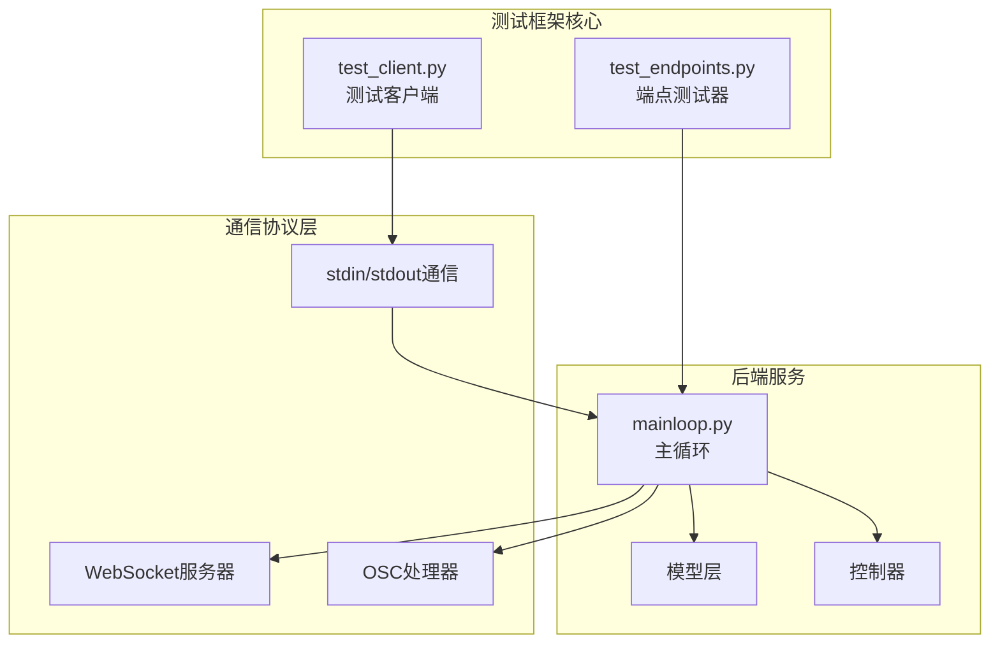
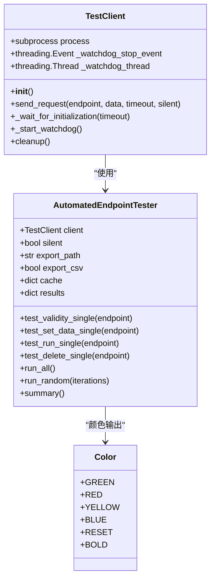
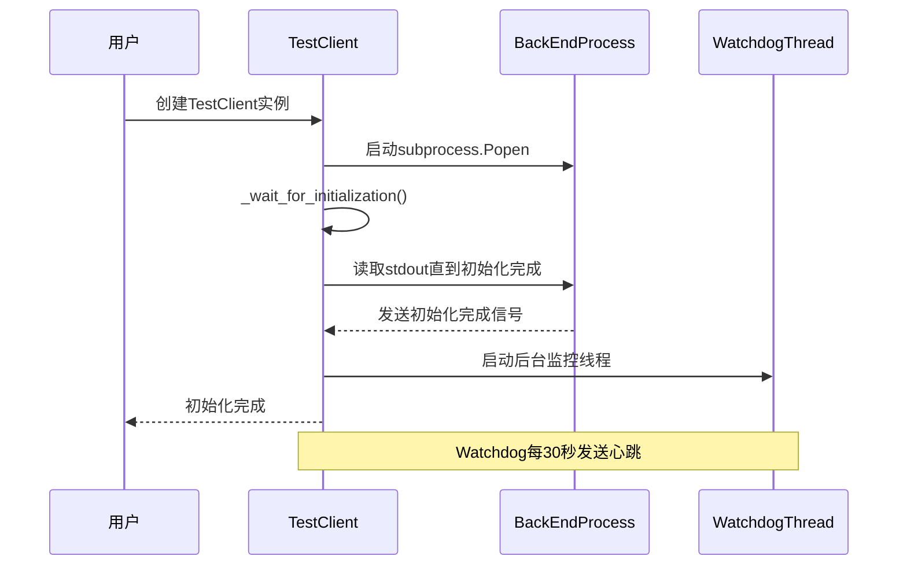
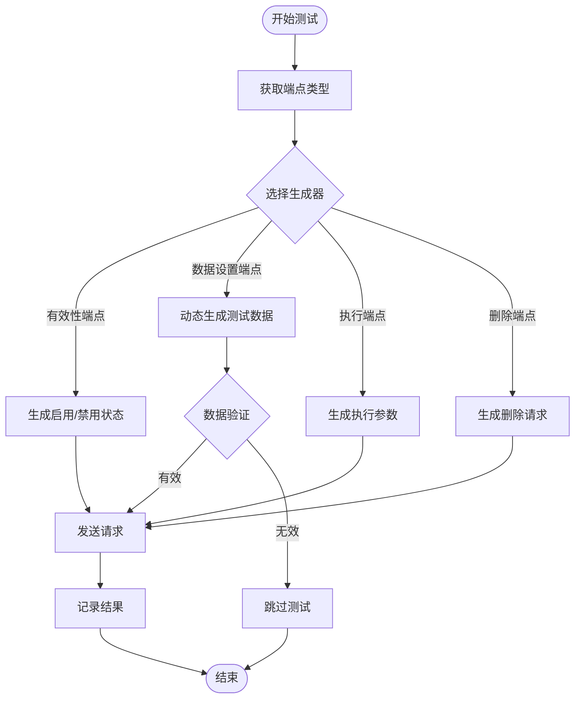
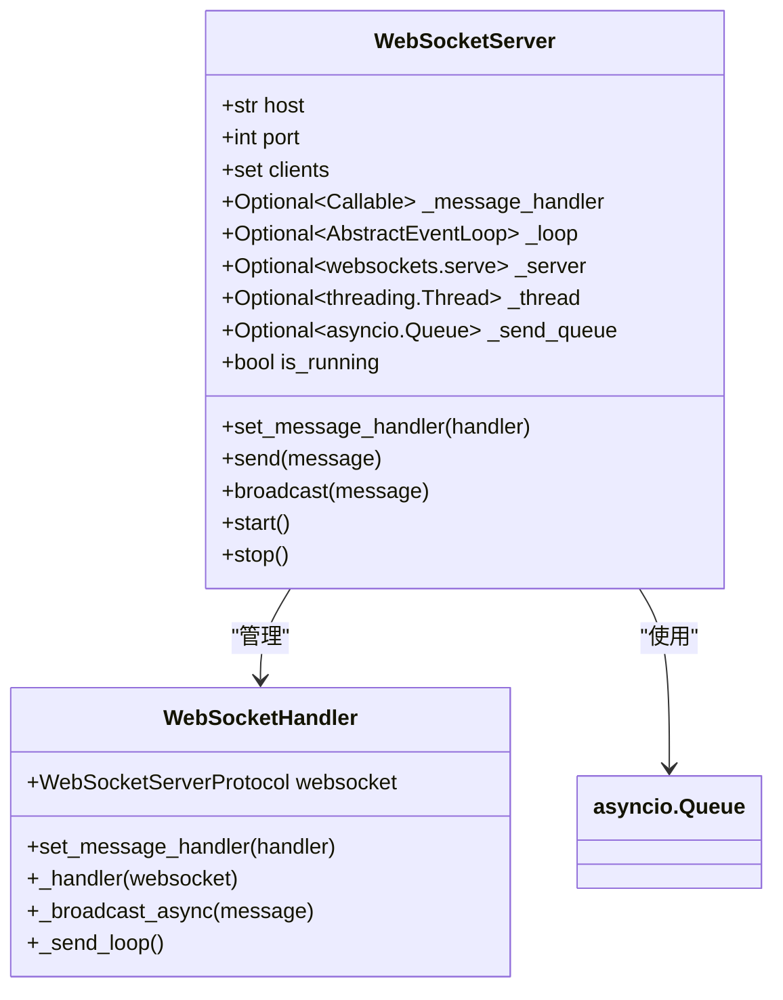
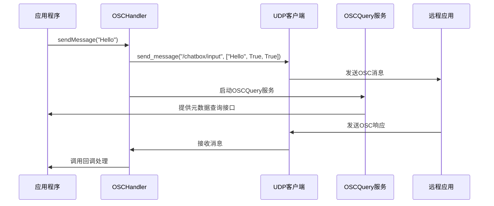
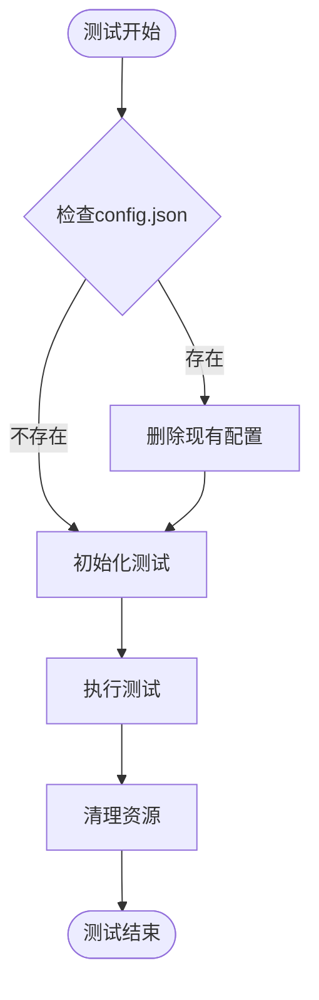
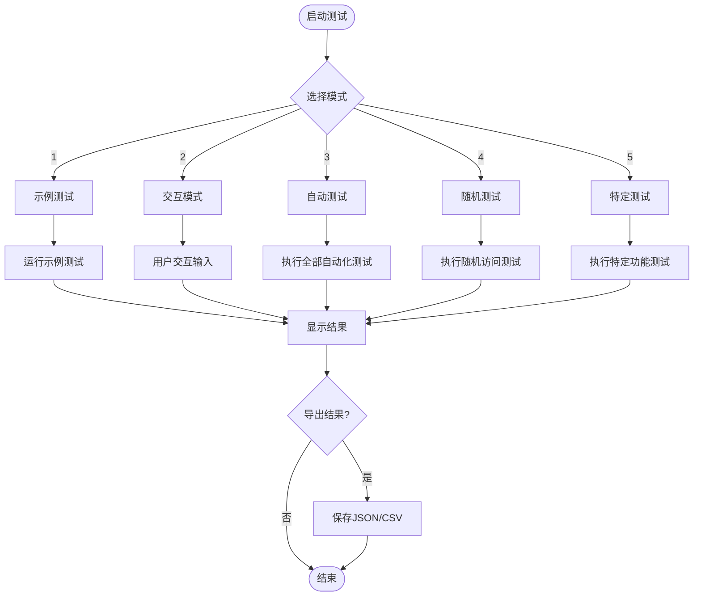
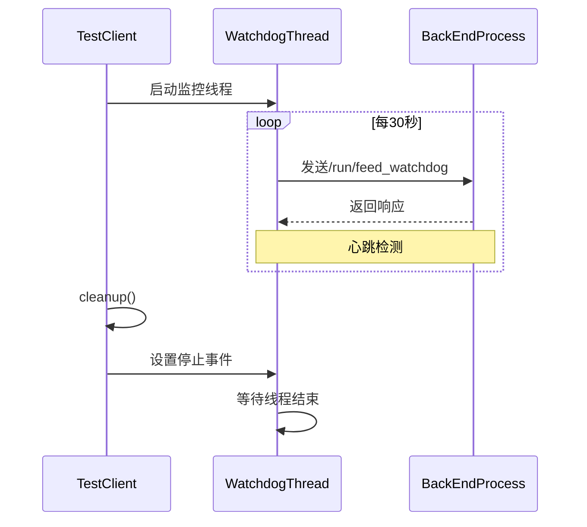

# 测试框架使用指南

<cite>
**本文档中引用的文件**
- [test_client.py](file://src-python/test_client.py)
- [test_endpoints.py](file://src-python/test_endpoints.py)
- [websocket_server.py](file://src-python/models/websocket/websocket_server.py)
- [osc.py](file://src-python/models/osc/osc.py)
- [test_client.md](file://src-python/docs/test_client.md)
- [test_endpoints.md](file://src-python/docs/test_endpoints.md)
</cite>

## 目录
1. [简介](#简介)
2. [项目结构概览](#项目结构概览)
3. [测试客户端架构](#测试客户端架构)
4. [自动端点测试器](#自动端点测试器)
5. [WebSocket通信测试](#websocket通信测试)
6. [OSC消息测试](#osc消息测试)
7. [测试环境搭建](#测试环境搭建)
8. [使用方法详解](#使用方法详解)
9. [高级功能特性](#高级功能特性)
10. [故障排除指南](#故障排除指南)
11. [最佳实践建议](#最佳实践建议)
12. [总结](#总结)

## 简介

VRCT项目提供了两个强大的测试框架，用于验证后端Python服务的功能性和稳定性。`test_client.py`作为前端模拟器，通过stdin/stdout与后端通信进行测试；`test_endpoints.py`则直接与主循环集成，提供全面的API端点测试能力。

这两个测试工具共同构成了VRCT系统的质量保证体系，支持从基础功能验证到复杂场景测试的全方位覆盖。

## 项目结构概览



**图表来源**
- [test_client.py](file://src-python/test_client.py#L1-L50)
- [test_endpoints.py](file://src-python/test_endpoints.py#L1-L50)
- [websocket_server.py](file://src-python/models/websocket/websocket_server.py#L1-L30)

**章节来源**
- [test_client.py](file://src-python/test_client.py#L1-L100)
- [test_endpoints.py](file://src-python/test_endpoints.py#L1-L100)

## 测试客户端架构

### 核心组件设计

测试客户端采用模块化设计，主要包含以下核心组件：



**图表来源**
- [test_client.py](file://src-python/test_client.py#L31-L100)
- [test_client.py](file://src-python/test_client.py#L350-L450)

### 初始化流程

测试客户端的初始化过程经过精心设计，确保与后端服务的稳定连接：



**图表来源**
- [test_client.py](file://src-python/test_client.py#L32-L80)
- [test_client.py](file://src-python/test_client.py#L283-L303)

**章节来源**
- [test_client.py](file://src-python/test_client.py#L32-L120)

## 自动端点测试器

### 测试分类体系

AutomatedEndpointTester实现了完整的测试分类体系，涵盖所有类型的API端点：

| 测试类别 | 端点前缀 | 功能描述 | 示例 |
|---------|----------|----------|------|
| 有效/无效化 | `/set/enable/`, `/set/disable/` | 功能开关控制 | `/set/enable/translation` |
| 数据设置 | `/set/data/` | 配置参数更新 | `/set/data/transparency` |
| 执行操作 | `/run/` | 功能执行触发 | `/run/send_message_box` |
| 数据删除 | `/delete/data/` | 配置数据清除 | `/delete/data/deepl_auth_key` |

### 数据生成策略

测试器采用智能的数据生成策略，确保测试的有效性和多样性：



**图表来源**
- [test_client.py](file://src-python/test_client.py#L477-L500)
- [test_client.py](file://src-python/test_client.py#L712-L730)

**章节来源**
- [test_client.py](file://src-python/test_client.py#L350-L450)

## WebSocket通信测试

### WebSocket服务器架构

VRCT的WebSocket服务器采用异步架构，支持高并发连接和实时消息传输：



**图表来源**
- [websocket_server.py](file://src-python/models/websocket/websocket_server.py#L7-L30)
- [websocket_server.py](file://src-python/models/websocket/websocket_server.py#L38-L60)

### 测试场景设计

WebSocket测试涵盖了多种实际应用场景：

| 测试场景 | 描述 | 验证要点 |
|---------|------|----------|
| 连接建立 | 客户端连接到服务器 | 连接成功率、握手验证 |
| 消息广播 | 服务器向所有客户端发送消息 | 消息送达率、延迟测量 |
| 消息过滤 | 基于地址的消息路由 | 路由准确性、性能影响 |
| 断线重连 | 客户端异常断开后的重连 | 连接恢复、状态同步 |
| 并发压力 | 大量客户端同时连接 | 系统稳定性、资源使用 |

**章节来源**
- [websocket_server.py](file://src-python/models/websocket/websocket_server.py#L1-L100)

## OSC消息测试

### OSC处理器功能

OSCHandler提供了完整的OSC协议支持，包括消息发送、接收和OSCQuery服务：



**图表来源**
- [osc.py](file://src-python/models/osc/osc.py#L40-L90)
- [osc.py](file://src-python/models/osc/osc.py#L154-L200)

### 测试配置选项

OSC测试支持多种配置场景的验证：

| 配置项 | 测试值 | 验证目标 |
|-------|--------|----------|
| IP地址 | 127.0.0.1, localhost | 本地通信验证 |
| IP地址 | 无效地址 | 错误处理验证 |
| 端口号 | 9000, 10000+ | 端口可用性检查 |
| 消息类型 | /chatbox/input, /chatbox/typing | 消息格式验证 |

**章节来源**
- [osc.py](file://src-python/models/osc/osc.py#L1-L100)

## 测试环境搭建

### 环境要求

测试框架需要以下环境和依赖：

| 组件 | 要求 | 说明 |
|------|------|------|
| Python版本 | 3.8+ | 支持asyncio和type hints |
| 依赖包 | requirements.txt | 包含websockets、python-osc等 |
| 网络配置 | 本地回环地址 | WebSocket和OSC测试必需 |
| 权限设置 | 脚本执行权限 | 测试脚本运行权限 |

### 配置文件管理

测试过程中会自动管理配置文件：



**图表来源**
- [test_client.py](file://src-python/test_client.py#L18-L21)
- [test_endpoints.py](file://src-python/test_endpoints.py#L1-L10)

**章节来源**
- [test_client.py](file://src-python/test_client.py#L18-L25)
- [test_endpoints.py](file://src-python/test_endpoints.py#L1-L15)

## 使用方法详解

### 基本测试模式

测试框架提供五种不同的测试模式，满足不同场景的需求：



**图表来源**
- [test_client.py](file://src-python/test_client.py#L924-L991)

### 交互式测试

交互模式允许用户手动输入测试参数，适合探索性测试：

```bash
# 启动交互模式
python test_client.py

# 输入示例：
# Endpoint: /get/data/version
# Data: (空，按Enter)
# 结果：显示版本信息
```

### 自动化测试配置

自动化测试支持详细的配置选项：

| 选项 | 默认值 | 说明 |
|------|--------|------|
| 详细日志 | false | 是否显示详细执行信息 |
| 结果导出 | false | 是否导出测试结果 |
| CSV格式 | false | 是否同时导出CSV格式 |
| 测试数量 | 500 | 随机测试的迭代次数 |

**章节来源**
- [test_client.py](file://src-python/test_client.py#L886-L950)

## 高级功能特性

### Watchdog监控机制

测试客户端内置Watchdog机制，确保长时间运行的稳定性：



**图表来源**
- [test_client.py](file://src-python/test_client.py#L283-L303)

### 日志和调试功能

测试框架提供了丰富的日志输出和调试信息：

| 日志级别 | 颜色标识 | 内容描述 |
|---------|----------|----------|
| 初始化日志 | 青色 | 后端启动和初始化过程 |
| 请求日志 | 蓝色 | 发送的测试请求 |
| 响应日志 | 绿色/红色 | 成功/失败的响应 |
| 错误日志 | 红色 | 异常和错误信息 |
| 警告日志 | 黄色 | 潜在问题提示 |

### 结果导出功能

测试结果可以导出为JSON和CSV格式：

```json
{
  "generated_at": "2024-01-15T10:30:00",
  "total": 100,
  "results": {
    "/set/data/transparency": {
      "status": 200,
      "result": 75,
      "expected_status": [200],
      "success": true
    }
  }
}
```

**章节来源**
- [test_client.py](file://src-python/test_client.py#L838-L885)

## 故障排除指南

### 常见问题及解决方案

| 问题类型 | 症状 | 解决方案 |
|---------|------|----------|
| 后端启动失败 | 初始化超时 | 检查Python环境和依赖安装 |
| 连接被拒绝 | WebSocket连接失败 | 验证防火墙设置和端口占用 |
| 数据验证错误 | 状态码400 | 检查测试数据格式和范围 |
| 内存不足 | 测试中断 | 减少并发测试数量或增加内存 |
| 网络超时 | 请求无响应 | 检查网络连接和代理设置 |

### 调试技巧

1. **启用详细日志**：设置`silent=False`查看完整执行过程
2. **检查环境变量**：设置`VRCT_INIT_TIMEOUT`调整初始化超时时间
3. **使用交互模式**：手动测试特定端点验证功能
4. **分析导出结果**：通过JSON/CSV文件深入分析测试结果

### 性能优化建议

- 合理设置测试并发度，避免系统资源耗尽
- 使用适当的超时时间，平衡测试完整性和效率
- 定期清理测试产生的临时文件和缓存
- 在测试环境中隔离生产数据访问

**章节来源**
- [test_client.py](file://src-python/test_client.py#L55-L120)
- [test_endpoints.py](file://src-python/test_endpoints.py#L800-L830)

## 最佳实践建议

### 测试策略规划

1. **分层测试**：从单元测试到集成测试逐步推进
2. **边界测试**：重点测试数据边界和异常情况
3. **回归测试**：每次代码变更后执行完整的回归测试套件
4. **性能测试**：定期进行负载测试和压力测试

### 测试数据管理

- 使用随机生成的测试数据确保测试的多样性
- 维护测试数据的版本控制和备份
- 清理测试过程中产生的临时数据
- 避免在测试中使用真实用户的敏感数据

### 持续集成集成

- 将测试框架集成到CI/CD流水线
- 设置自动化测试报告和通知
- 实现测试覆盖率监控
- 建立测试结果的趋势分析

## 总结

VRCT的测试框架提供了全面而灵活的测试解决方案，通过`test_client.py`和`test_endpoints.py`两个核心组件，实现了从前端模拟到后端集成的完整测试覆盖。

### 主要优势

- **模块化设计**：清晰的组件分离和职责划分
- **多样化测试**：支持手动、自动、随机等多种测试模式
- **实时监控**：内置Watchdog机制确保测试稳定性
- **丰富输出**：提供详细的日志和结果导出功能
- **易于扩展**：良好的架构设计便于功能扩展

### 应用价值

该测试框架不仅适用于开发阶段的质量保证，也可用于生产环境的健康检查和性能监控。通过持续的测试执行，能够及时发现和解决潜在问题，确保VRCT系统的稳定可靠运行。

随着项目的不断发展，测试框架也在持续演进，未来将进一步增强自动化程度、优化性能表现，并扩展更多测试场景的支持。