# 测试用例设计原则

<cite>
**本文档引用的文件**
- [test_client.py](file://src-python/test_client.py)
- [test_endpoints.py](file://src-python/test_endpoints.py)
- [mainloop.py](file://src-python/mainloop.py)
- [device_manager.py](file://src-python/device_manager.py)
- [test_client.md](file://src-python/docs/test_client.md)
- [test_endpoints.md](file://src-python/docs/test_endpoints.md)
</cite>

## 目录
1. [引言](#引言)
2. [测试架构概览](#测试架构概览)
3. [核心测试组件分析](#核心测试组件分析)
4. [测试用例设计理念](#测试用例设计理念)
5. [关键场景覆盖分析](#关键场景覆盖分析)
6. [单元测试与端到端测试边界](#单元测试与端到端测试边界)
7. [模拟数据构造策略](#模拟数据构造策略)
8. [测试覆盖率评估](#测试覆盖率评估)
9. [用例维护策略](#用例维护策略)
10. [最佳实践总结](#最佳实践总结)

## 引言

VRCT项目采用了多层次的测试策略，通过专门设计的测试客户端和端点测试模块，实现了对语音转录、翻译引擎切换、设备状态监控和配置动态更新等核心功能的全面覆盖。本文档深入分析了这些测试用例的设计理念与最佳实践，为开发者提供了完整的测试框架理解和应用指导。

## 测试架构概览

VRCT的测试架构采用分层设计，包含以下核心组件：

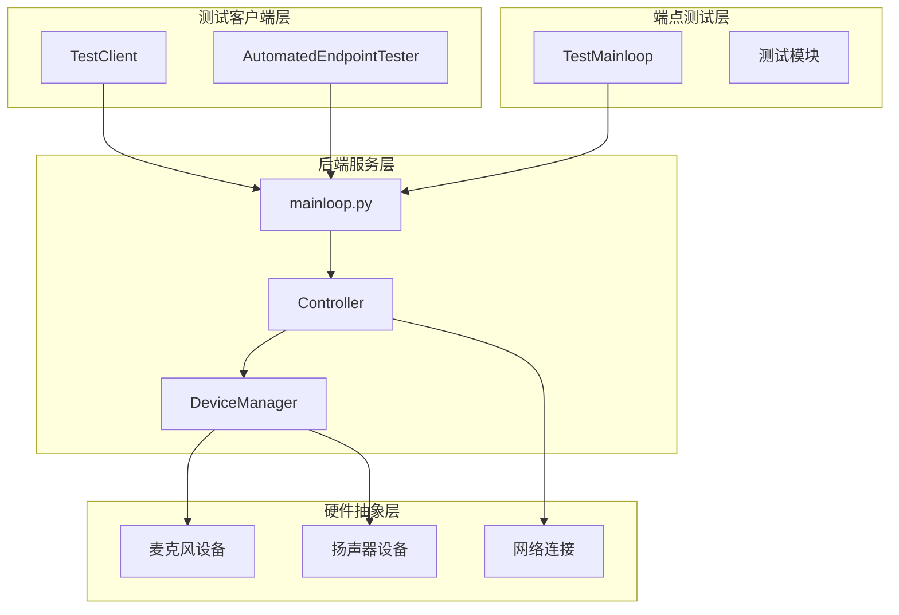

**图表来源**
- [test_client.py](file://src-python/test_client.py#L31-L50)
- [test_endpoints.py](file://src-python/test_endpoints.py#L35-L60)
- [mainloop.py](file://src-python/mainloop.py#L81-L85)

**章节来源**
- [test_client.py](file://src-python/test_client.py#L1-L50)
- [test_endpoints.py](file://src-python/test_endpoints.py#L1-L50)

## 核心测试组件分析

### TestClient组件设计

TestClient是VRCT项目的核心测试客户端，负责模拟前端与后端的交互：

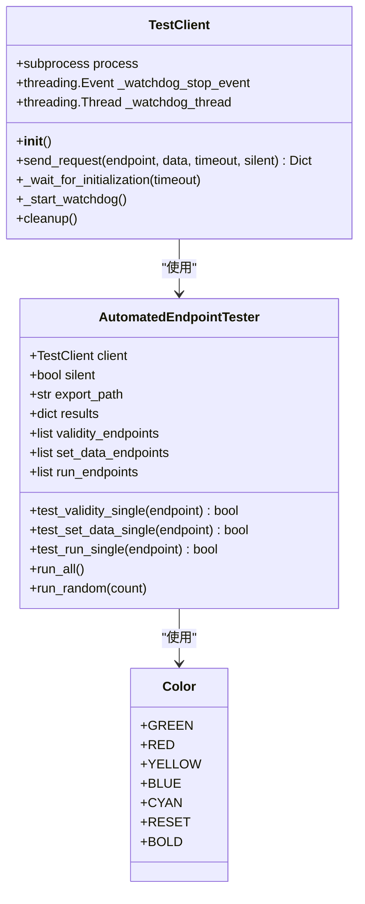

**图表来源**
- [test_client.py](file://src-python/test_client.py#L31-L320)

### TestMainloop组件设计

TestMainloop直接与VRCT主循环集成，提供深度测试能力：

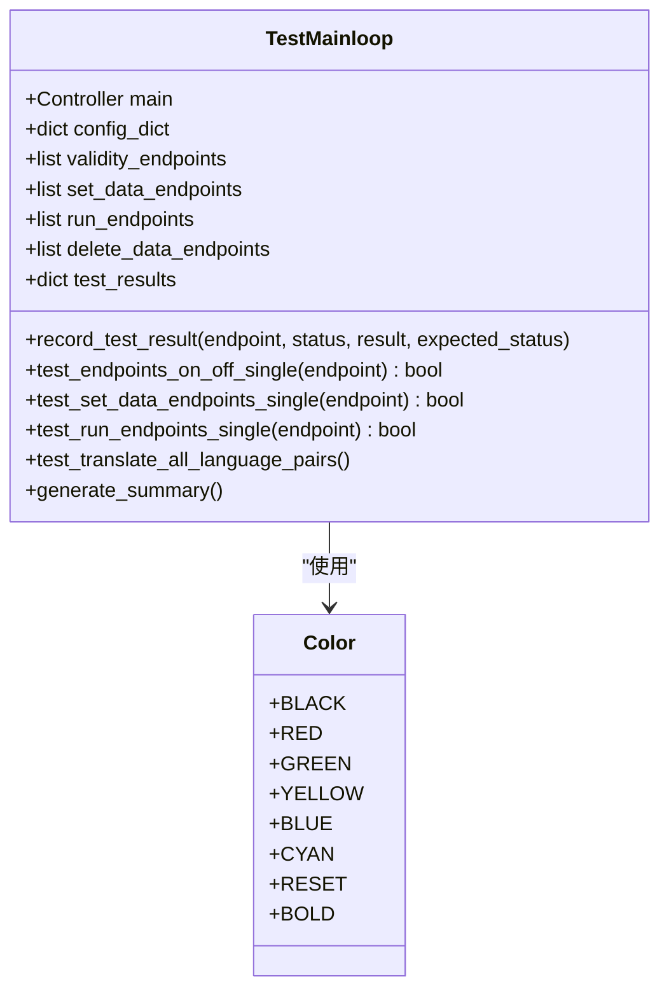

**图表来源**
- [test_endpoints.py](file://src-python/test_endpoints.py#L35-L100)

**章节来源**
- [test_client.py](file://src-python/test_client.py#L31-L400)
- [test_endpoints.py](file://src-python/test_endpoints.py#L35-L200)

## 测试用例设计理念

### 分层测试策略

VRCT采用分层测试策略，确保不同层次的功能都能得到充分验证：

| 测试层次 | 覆盖范围 | 实现方式 | 验证目标 |
|---------|---------|---------|---------|
| 单元测试 | 函数级逻辑 | 直接调用函数 | 基础算法正确性 |
| 集成测试 | 组件间交互 | 模拟外部依赖 | 接口兼容性 |
| 端到端测试 | 完整业务流程 | 真实环境测试 | 用户体验质量 |
| 回归测试 | 功能稳定性 | 自动化随机测试 | 长期稳定性 |

### 测试数据驱动策略

测试用例采用数据驱动设计，支持多种输入组合：

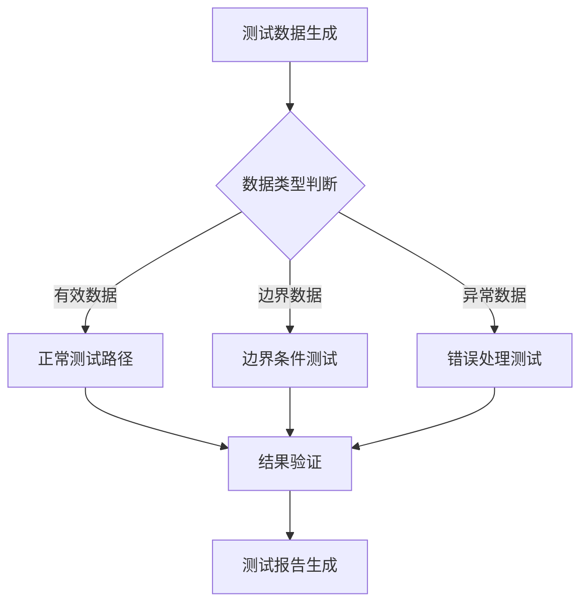

**图表来源**
- [test_client.py](file://src-python/test_client.py#L477-L710)
- [test_endpoints.py](file://src-python/test_endpoints.py#L176-L487)

**章节来源**
- [test_client.py](file://src-python/test_client.py#L477-L800)
- [test_endpoints.py](file://src-python/test_endpoints.py#L176-L600)

## 关键场景覆盖分析

### 语音转录功能测试

语音转录功能是VRCT的核心特性，测试覆盖以下关键场景：

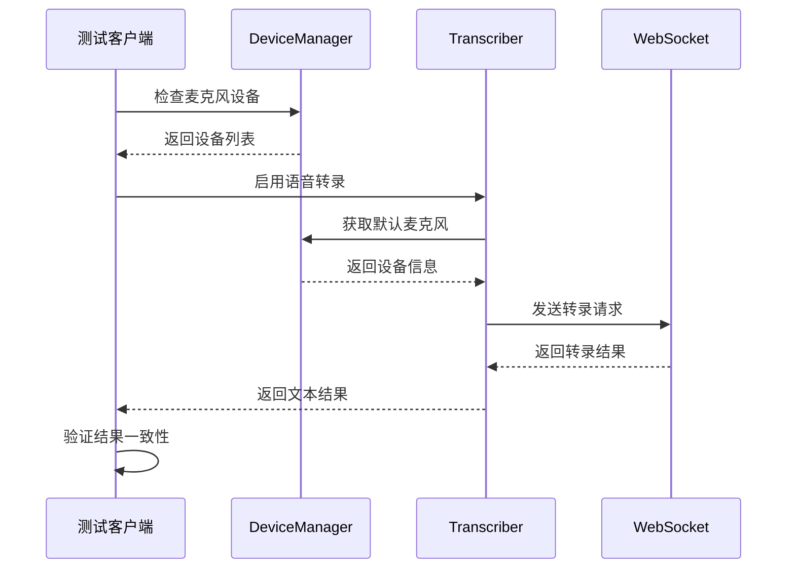

**图表来源**
- [device_manager.py](file://src-python/device_manager.py#L140-L200)
- [test_endpoints.py](file://src-python/test_endpoints.py#L496-L570)

### 翻译引擎切换测试

翻译引擎切换涉及多个AI服务提供商，测试确保平滑切换：

| 引擎类型 | 测试重点 | 验证指标 | 异常处理 |
|---------|---------|---------|---------|
| CTranslate2 | 模型加载速度 | 初始化时间 ≤ 30秒 | 内存不足处理 |
| Gemini | API连接稳定性 | 连接成功率 ≥ 95% | 网络超时重试 |
| OpenAI | 认证有效性 | 认证响应时间 ≤ 5秒 | 错误密钥检测 |
| Ollama | 本地模型推理 | 推理延迟 ≤ 2秒 | 模型缺失处理 |

### 设备状态监控测试

设备状态监控确保音频设备的稳定运行：

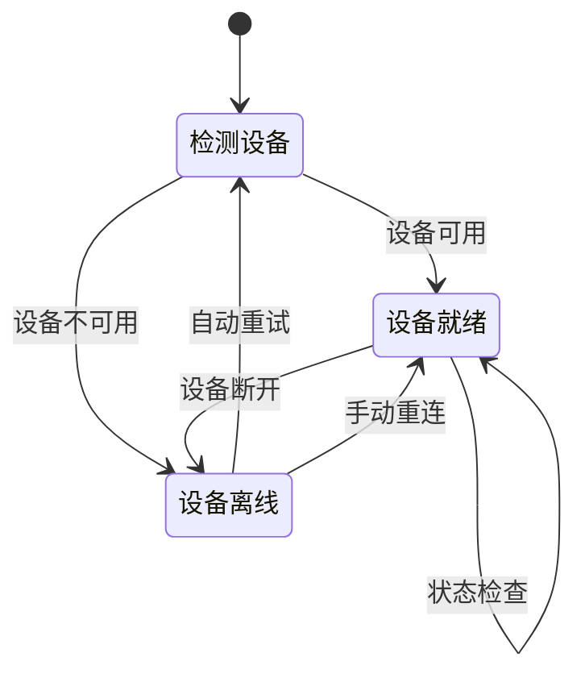

**图表来源**
- [device_manager.py](file://src-python/device_manager.py#L26-L56)

### 配置动态更新测试

配置动态更新测试验证设置变更的即时生效：

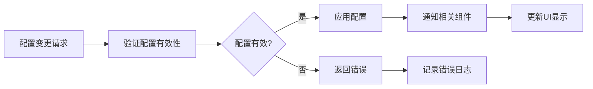

**图表来源**
- [test_endpoints.py](file://src-python/test_endpoints.py#L176-L487)

**章节来源**
- [device_manager.py](file://src-python/device_manager.py#L57-L200)
- [test_endpoints.py](file://src-python/test_endpoints.py#L496-L600)

## 单元测试与端到端测试边界

### 测试边界划分原则

VRCT采用明确的测试边界划分，确保测试的针对性和效率：

| 测试类型 | 边界范围 | 实现方式 | 性能特点 |
|---------|---------|---------|---------|
| 单元测试 | 函数/类级别 | 直接调用 | 快速执行，精确调试 |
| 集成测试 | 模块间接口 | 模拟依赖 | 中等速度，关注接口 |
| 端到端测试 | 完整用户流程 | 真实环境 | 较慢执行，全面验证 |
| 性能测试 | 系统性能指标 | 负载测试 | 慢速执行，关注性能 |

### 测试隔离策略

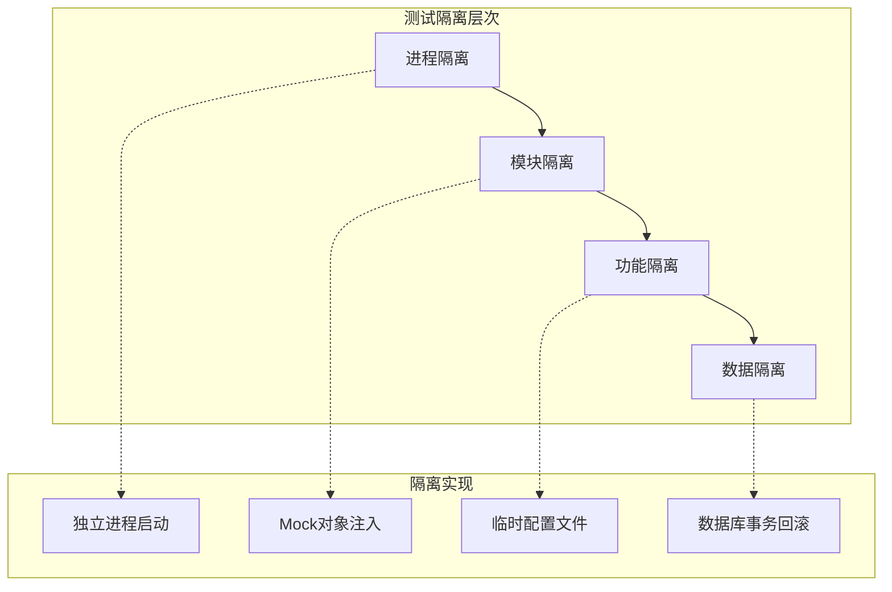

**图表来源**
- [test_client.py](file://src-python/test_client.py#L35-L50)
- [test_endpoints.py](file://src-python/test_endpoints.py#L36-L50)

**章节来源**
- [test_client.py](file://src-python/test_client.py#L35-L100)
- [test_endpoints.py](file://src-python/test_endpoints.py#L36-L100)

## 模拟数据构造策略

### 动态数据生成机制

VRCT测试系统采用智能的数据生成策略，确保测试覆盖真实场景：

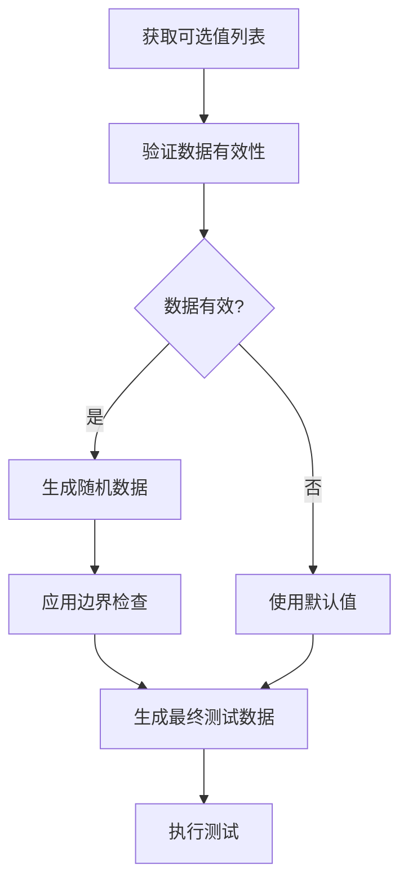

**图表来源**
- [test_client.py](file://src-python/test_client.py#L477-L710)

### 数据验证规则

测试系统实现了多层次的数据验证：

| 验证层级 | 验证内容 | 实现方式 | 错误处理 |
|---------|---------|---------|---------|
| 类型验证 | 数据类型正确性 | Python类型检查 | 抛出类型错误 |
| 范围验证 | 数值范围合理性 | 边界值检查 | 返回400错误 |
| 业务验证 | 业务逻辑正确性 | 业务规则检查 | 返回业务错误 |
| 状态验证 | 系统状态一致性 | 状态对比检查 | 记录状态差异 |

### 随机测试数据生成

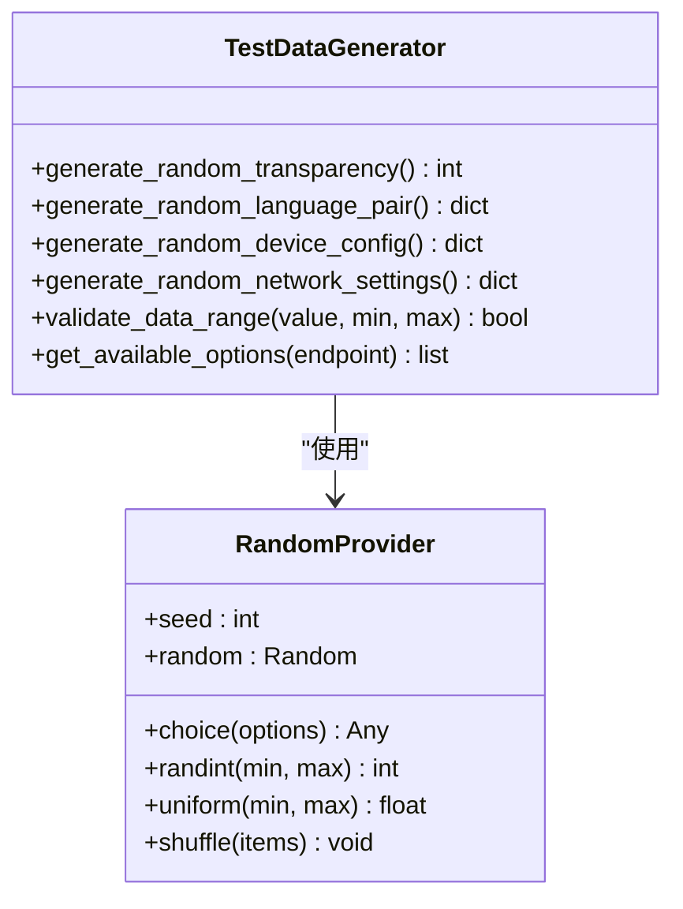

**图表来源**
- [test_client.py](file://src-python/test_client.py#L477-L710)

**章节来源**
- [test_client.py](file://src-python/test_client.py#L477-L800)
- [test_endpoints.py](file://src-python/test_endpoints.py#L176-L487)

## 测试覆盖率评估

### 覆盖率指标体系

VRCT采用多维度的覆盖率评估体系：

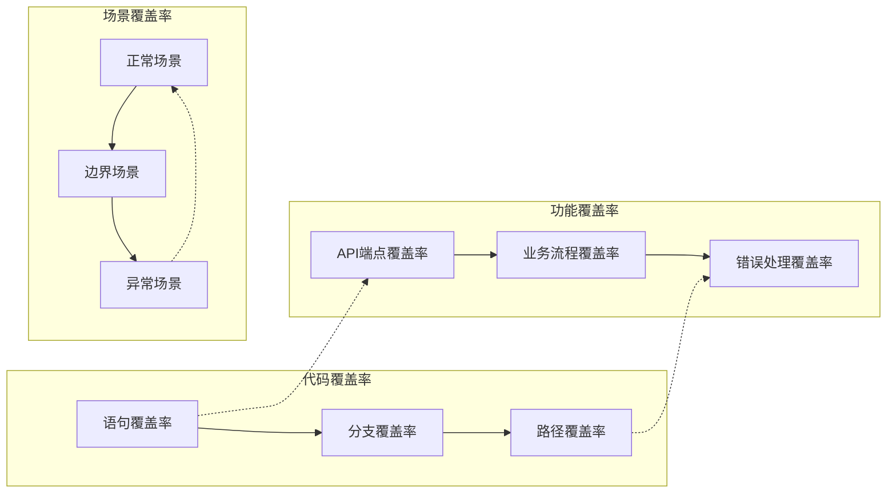

### 覆盖率计算方法

| 覆盖率类型 | 计算公式 | 目标值 | 评估周期 |
|-----------|---------|-------|---------|
| 语句覆盖率 | 执行语句数 / 总语句数 | ≥ 85% | 每次发布 |
| API覆盖率 | 测试API数 / 总API数 | ≥ 90% | 每周 |
| 场景覆盖率 | 测试场景数 / 总场景数 | ≥ 95% | 每月 |
| 错误覆盖率 | 错误处理测试数 / 总错误数 | ≥ 80% | 每次迭代 |

### 自动化覆盖率报告

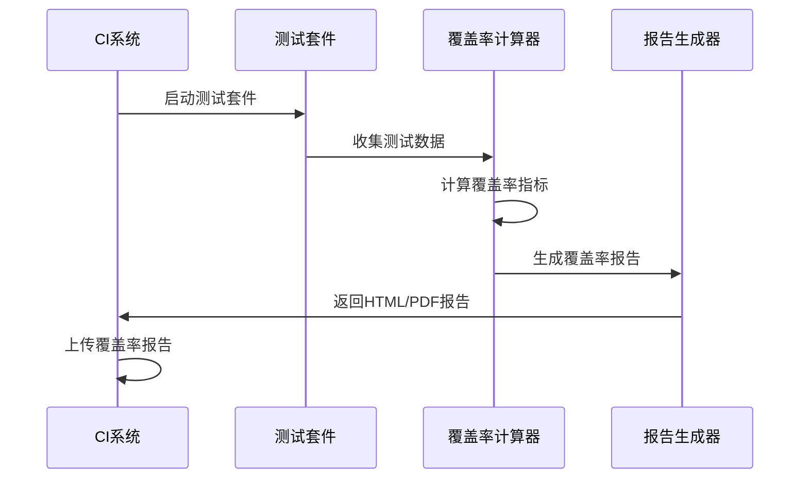

**图表来源**
- [test_client.py](file://src-python/test_client.py#L793-L800)
- [test_endpoints.py](file://src-python/test_endpoints.py#L794-L800)

**章节来源**
- [test_client.py](file://src-python/test_client.py#L793-L800)
- [test_endpoints.py](file://src-python/test_endpoints.py#L794-L800)

## 用例维护策略

### 测试用例版本管理

VRCT采用GitLab风格的版本管理策略，确保测试用例的可追溯性：

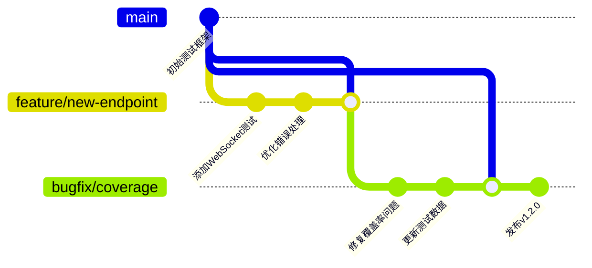

### 测试用例重构原则

| 重构原则 | 应用场景 | 实施策略 | 风险控制 |
|---------|---------|---------|---------|
| 单一职责 | 复杂测试方法 | 提取辅助函数 | 保持向后兼容 |
| 开闭原则 | 新功能测试 | 扩展现有框架 | 全量回归测试 |
| 依赖倒置 | 外部依赖模拟 | 抽象接口设计 | Mock对象验证 |
| 接口隔离 | 大型测试模块 | 分解为小模块 | 逐步替换 |

### 持续集成测试

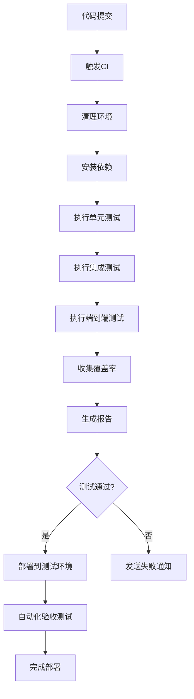

**图表来源**
- [test_client.py](file://src-python/test_client.py#L305-L318)
- [test_endpoints.py](file://src-python/test_endpoints.py#L602-L640)

**章节来源**
- [test_client.py](file://src-python/test_client.py#L305-L318)
- [test_endpoints.py](file://src-python/test_endpoints.py#L602-L640)

## 最佳实践总结

### 测试设计黄金法则

1. **测试独立性**：每个测试用例应该独立运行，不依赖其他测试的状态
2. **快速反馈**：单元测试应该在毫秒级别完成，集成测试在秒级别完成
3. **可重复性**：测试结果应该在相同条件下可重复
4. **自文档化**：测试名称应该清晰描述测试目的和预期结果

### 性能测试最佳实践

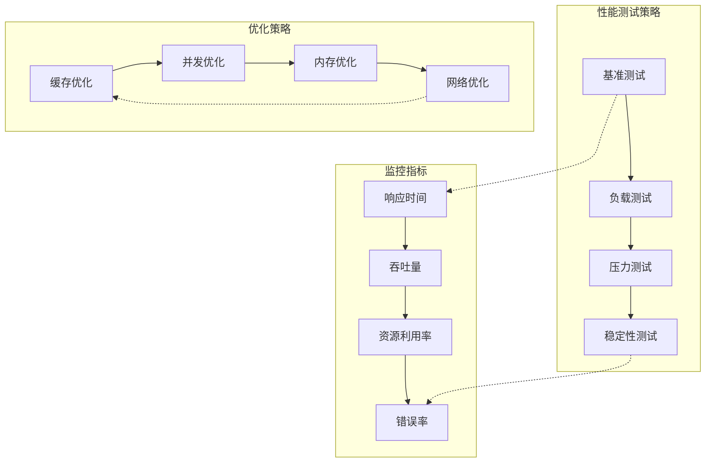

### 错误处理测试策略

VRCT测试系统实现了全面的错误处理测试：

| 错误类型 | 测试场景 | 验证方法 | 恢复策略 |
|---------|---------|---------|---------|
| 网络错误 | 连接超时 | 模拟网络中断 | 自动重试机制 |
| 资源不足 | 内存溢出 | 强制内存限制 | 优雅降级 |
| 配置错误 | 无效参数 | 传入非法值 | 参数验证 |
| 设备错误 | 设备断开 | 模拟设备移除 | 自动重连 |

### 测试环境管理

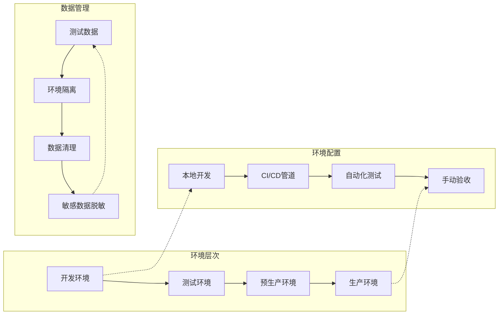

**图表来源**
- [test_client.py](file://src-python/test_client.py#L55-L120)
- [test_endpoints.py](file://src-python/test_endpoints.py#L59-L80)

VRCT项目的测试用例设计体现了现代软件测试的最佳实践，通过分层测试架构、智能数据生成、全面的场景覆盖和持续的维护策略，构建了一个健壮、可扩展的测试框架。这种设计不仅确保了系统的质量，也为未来的功能扩展提供了坚实的基础。