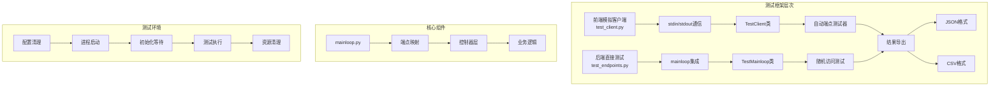
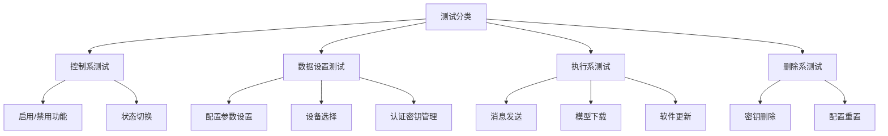
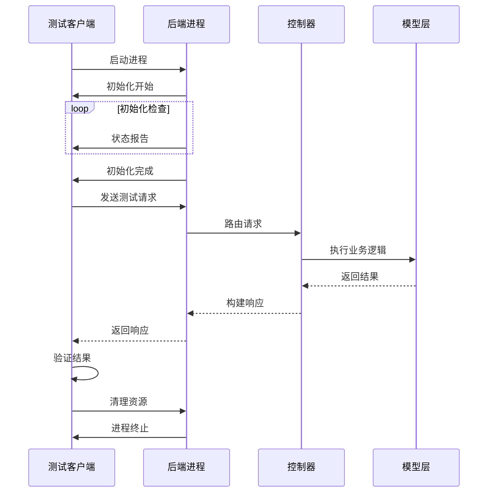
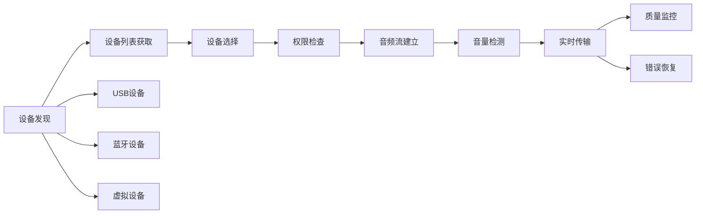
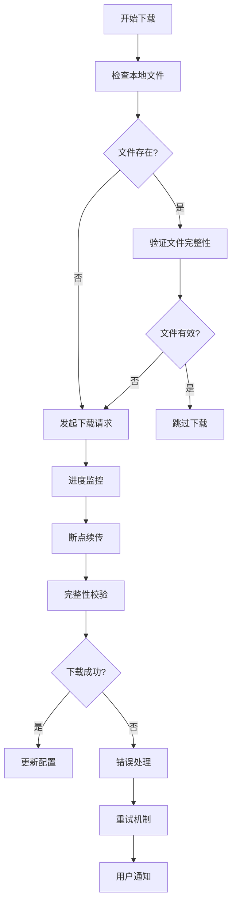
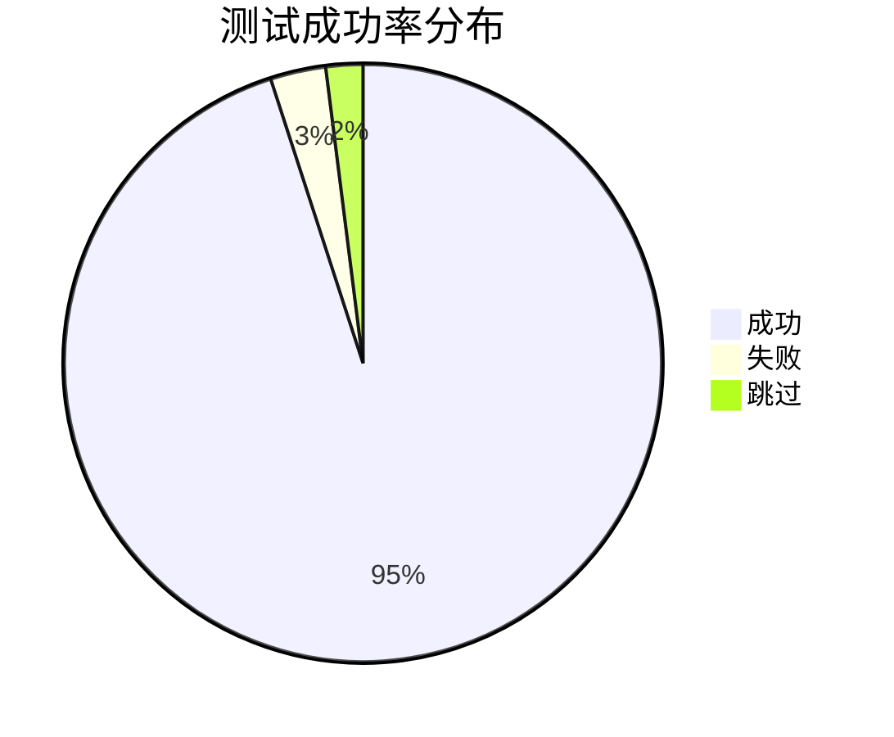
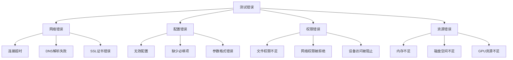

# VRCT项目测试策略文档

<cite>
**本文档引用的文件**
- [test_client.py](file://src-python/test_client.py)
- [test_endpoints.py](file://src-python/test_endpoints.py)
- [mainloop.py](file://src-python/mainloop.py)
- [controller.py](file://src-python/controller.py)
- [config.py](file://src-python/config.py)
- [model.py](file://src-python/model.py)
- [test_client.md](file://src-python/docs/test_client.md)
- [test_endpoints.md](file://src-python/docs/test_endpoints.md)
</cite>

## 目录
1. [概述](#概述)
2. [测试框架架构](#测试框架架构)
3. [核心测试工具](#核心测试工具)
4. [端到端测试策略](#端到端测试策略)
5. [设备行为测试](#设备行为测试)
6. [模型下载测试](#模型下载测试)
7. [测试用例设计原则](#测试用例设计原则)
8. [自动化测试配置](#自动化测试配置)
9. [测试结果分析](#测试结果分析)
10. [故障排除指南](#故障排除指南)
11. [最佳实践建议](#最佳实践建议)

## 概述

VRCT项目采用双层测试架构，结合前端模拟客户端和后端直接测试两种方式，实现全面的API端点测试覆盖。测试框架支持同步/异步通信模式，具备完善的错误处理机制和结果导出功能。

### 测试目标

- **完整性验证**：确保所有API端点按预期工作
- **稳定性测试**：验证系统在长时间运行下的可靠性
- **性能监控**：检测响应时间和资源使用情况
- **回归测试**：防止新功能破坏现有功能
- **设备兼容性**：验证硬件设备交互的正确性

## 测试框架架构



**图表来源**
- [test_client.py](file://src-python/test_client.py#L31-L50)
- [test_endpoints.py](file://src-python/test_endpoints.py#L35-L60)
- [mainloop.py](file://src-python/mainloop.py#L85-L200)

## 核心测试工具

### TestClient - 前端模拟测试器

TestClient是VRCT项目的核心测试工具，通过stdin/stdout与后端进程通信，模拟前端应用的行为。

#### 主要特性

- **进程管理**：自动启动和监控后端进程
- **初始化等待**：智能等待系统初始化完成
- **Watchdog支持**：持续发送心跳信号保持连接活跃
- **彩色输出**：直观的状态显示和错误提示
- **结果导出**：支持JSON和CSV格式的结果保存

#### 核心方法

| 方法名 | 功能描述 | 参数 |
|--------|----------|------|
| `send_request()` | 发送单个API请求并等待响应 | endpoint, data, timeout, silent |
| `_wait_for_initialization()` | 等待系统初始化完成 | timeout |
| `_start_watchdog()` | 启动后台心跳线程 | 无 |
| `cleanup()` | 清理测试资源 | 无 |

**章节来源**
- [test_client.py](file://src-python/test_client.py#L31-L320)

### TestMainloop - 后端直接测试器

TestMainloop提供直接调用后端功能的方法，无需通过进程间通信，适合快速测试和调试。

#### 测试分类



**图表来源**
- [test_endpoints.py](file://src-python/test_endpoints.py#L58-L85)

**章节来源**
- [test_endpoints.py](file://src-python/test_endpoints.py#L35-L100)

## 端到端测试策略

### 测试流程设计

端到端测试遵循严格的流程顺序，确保测试的可靠性和可重复性。



**图表来源**
- [test_client.py](file://src-python/test_client.py#L35-L50)
- [mainloop.py](file://src-python/mainloop.py#L470-L510)

### 测试用例类型

#### 1. 功能启用/禁用测试

验证系统功能的开关操作是否正确执行：

- `/set/enable/*` 和 `/set/disable/*` 端点
- 功能状态的正确切换
- 多次切换的稳定性

#### 2. 数据设置测试

测试各种配置参数的设置和验证：

- 用户界面设置（透明度、字体、语言等）
- 设备选择（麦克风、扬声器、计算设备）
- 认证密钥管理
- 高级配置选项

#### 3. 执行功能测试

验证核心功能的执行能力：

- 消息翻译和转录
- 模型下载和更新
- 设备连接和断开
- 系统状态查询

**章节来源**
- [test_client.py](file://src-python/test_client.py#L350-L450)

## 设备行为测试

### 音频设备测试

VRCT项目包含复杂的音频设备管理系统，测试需要验证设备的发现、选择和使用功能。

#### 测试场景



**图表来源**
- [controller.py](file://src-python/controller.py#L79-L100)
- [model.py](file://src-python/model.py#L100-L150)

#### 关键测试点

| 测试类别 | 端点示例 | 验证内容 |
|----------|----------|----------|
| 设备发现 | `/get/data/selectable_mic_host_list` | 设备列表完整性 |
| 设备选择 | `/set/data/selected_mic_device` | 选择操作有效性 |
| 权限验证 | `/run/check_mic_volume` | 权限获取成功 |
| 实时测试 | `/run/transcription_send_mic_message` | 音频流正常 |
| 错误处理 | `/run/error_device` | 异常情况处理 |

**章节来源**
- [controller.py](file://src-python/controller.py#L154-L180)

### 计算设备测试

验证不同计算设备（CPU、GPU）的配置和使用：

- CUDA设备检测和选择
- 内存使用监控
- 模型推理性能测试
- 设备切换稳定性

## 模型下载测试

### 下载流程验证

模型下载是VRCT的重要功能，测试需要覆盖完整的下载流程。



**图表来源**
- [model.py](file://src-python/model.py#L167-L172)
- [controller.py](file://src-python/controller.py#L188-L200)

### 测试覆盖范围

#### 支持的模型类型

| 模型类型 | 端点 | 测试重点 |
|----------|------|----------|
| CTranslate2 | `/run/download_ctranslate2_weight` | 量化权重下载 |
| Whisper | `/run/download_whisper_weight` | 音频转录模型 |
| Gemini | `/get/data/selectable_gemini_model_list` | Google AI模型 |
| OpenAI | `/get/data/selectable_openai_model_list` | OpenAI API模型 |
| Ollama | `/get/data/selectable_ollama_model_list` | 本地LLM模型 |

#### 下载测试策略

1. **正常路径测试**：验证标准下载流程
2. **网络中断测试**：模拟网络不稳定情况
3. **存储空间测试**：验证磁盘空间不足处理
4. **权限测试**：检查文件系统权限问题
5. **并发下载测试**：多个模型同时下载的情况

**章节来源**
- [model.py](file://src-python/model.py#L154-L200)

## 测试用例设计原则

### 原则一：全面覆盖

测试用例应覆盖所有主要功能模块：

```mermaid
mindmap
root((测试用例设计))
功能测试
翻译功能
转录功能
设备管理
界面交互
性能测试
响应时间
并发处理
资源使用
内存泄漏
兼容性测试
操作系统
硬件设备
第三方软件
网络环境
稳定性测试
长时间运行
异常恢复
断电重启
网络波动
```

### 原则二：数据驱动

测试数据应具有多样性和代表性：

- **边界值测试**：最小值、最大值、空值
- **异常数据测试**：非法格式、超长字符串、特殊字符
- **随机数据测试**：大量随机输入验证系统鲁棒性
- **历史数据测试**：使用真实用户的配置数据

### 原则三：自动化优先

尽可能实现完全自动化：

- **预设条件**：自动准备测试环境
- **执行过程**：无需人工干预
- **结果验证**：自动判断测试通过/失败
- **清理工作**：自动恢复测试环境

**章节来源**
- [test_endpoints.py](file://src-python/test_endpoints.py#L490-L520)

## 自动化测试配置

### 环境准备

#### 1. 基础环境要求

```bash
# 安装依赖
pip install -r requirements.txt

# 清理配置文件
rm -f config.json

# 设置环境变量
export VRCT_INIT_TIMEOUT=120
```

#### 2. 测试配置选项

| 配置项 | 环境变量 | 默认值 | 说明 |
|--------|----------|--------|------|
| 初始化超时 | `VRCT_INIT_TIMEOUT` | 无限制 | 系统初始化最大等待时间 |
| 测试数量 | CLI参数 | 1000 | 随机测试执行次数 |
| 输出格式 | CLI参数 | 终端 | 结果输出格式 |
| 导出路径 | CLI参数 | 无 | 结果文件保存路径 |

### 执行方式

#### 方式一：命令行执行

```bash
# 基本测试
python test_endpoints.py

# 随机测试
python test_endpoints.py --random --count 5000

# 自动化测试
python test_client.py --mode automated --export results.json
```

#### 方式二：编程接口

```python
from test_endpoints import TestMainloop

# 创建测试实例
test = TestMainloop()

# 执行特定测试
test.test_endpoints_on_off_all()
test.test_set_data_endpoints_all()
test.test_run_endpoints_all()

# 生成结果摘要
test.generate_summary()
```

#### 方式三：集成测试

```python
from test_client import TestClient, AutomatedEndpointTester

# 创建测试客户端
client = TestClient()

# 执行自动化测试
tester = AutomatedEndpointTester(client, silent=False, export_path="test_results.json")
tester.run_all()

# 获取测试结果
results = tester.results
```

**章节来源**
- [test_client.py](file://src-python/test_client.py#L320-L350)

## 测试结果分析

### 结果格式

测试结果以结构化格式输出，支持多种分析需求：

#### JSON格式输出

```json
{
  "endpoint": "/set/data/transparency",
  "status": 200,
  "result": 85,
  "expected": [200],
  "success": true
}
```

#### CSV格式输出

```csv
endpoint,status,result,expected,success
/set/data/transparency,200,85,[200],true
/set/data/ui_language,200,"ja",["en","ja","ko","zh-Hant","zh-Hans"],true
```

### 分析维度

#### 1. 成功率统计



#### 2. 性能指标

| 指标 | 计算方法 | 目标值 |
|------|----------|--------|
| 平均响应时间 | 所有请求响应时间平均值 | < 2秒 |
| 最大响应时间 | 所有请求响应时间最大值 | < 10秒 |
| 错误率 | 失败请求数/总请求数 | < 1% |
| 并发处理能力 | 同时处理的最大请求数 | > 100 |

#### 3. 错误分类



**章节来源**
- [test_client.py](file://src-python/test_client.py#L790-L820)

## 故障排除指南

### 常见问题及解决方案

#### 1. 初始化超时

**症状**：测试启动后长时间无响应
**原因**：系统初始化时间过长或卡死
**解决**：
```bash
# 设置较短的超时时间
export VRCT_INIT_TIMEOUT=60

# 或使用环境变量
python test_client.py --timeout 60
```

#### 2. 进程通信失败

**症状**：出现"Backend process terminated"错误
**原因**：后端进程意外退出
**解决**：
- 检查系统资源使用情况
- 查看后端日志输出
- 验证配置文件完整性

#### 3. 设备访问权限

**症状**：音频设备测试失败
**原因**：缺少必要的系统权限
**解决**：
```bash
# Linux/macOS
sudo usermod -a -G audio $USER

# Windows
# 以管理员身份运行
```

#### 4. 网络连接问题

**症状**：模型下载或API调用失败
**原因**：网络连接不稳定或被防火墙阻止
**解决**：
- 检查网络连接状态
- 配置代理设置
- 添加防火墙例外

### 调试技巧

#### 启用详细日志

```python
# 在测试客户端中启用详细模式
client = TestClient()
client.send_request("/some/endpoint", data, silent=False)
```

#### 使用调试模式

```bash
# 启用调试输出
python test_endpoints.py --debug

# 查看具体错误信息
python test_endpoints.py --verbose
```

#### 性能监控

```python
# 监控系统资源使用
import psutil
import time

def monitor_resources():
    cpu_percent = psutil.cpu_percent()
    memory_percent = psutil.virtual_memory().percent
    disk_usage = psutil.disk_usage('/').percent
    return {
        "cpu": cpu_percent,
        "memory": memory_percent,
        "disk": disk_usage
    }
```

**章节来源**
- [test_client.py](file://src-python/test_client.py#L55-L120)

## 最佳实践建议

### 测试环境管理

#### 1. 环境隔离

每次测试前清理配置文件，避免测试间的相互影响：

```python
import os
import shutil

def prepare_test_environment():
    # 清理旧的配置文件
    if os.path.exists("config.json"):
        os.remove("config.json")
    
    # 清理临时文件
    temp_dir = os.path.join(os.getcwd(), "temp")
    if os.path.exists(temp_dir):
        shutil.rmtree(temp_dir)
    
    # 创建测试目录
    os.makedirs(temp_dir, exist_ok=True)
```

#### 2. 资源监控

实施测试过程中的资源监控：

```python
import psutil
import time

class ResourceMonitor:
    def __init__(self):
        self.start_time = time.time()
        self.start_memory = psutil.virtual_memory().used
    
    def get_stats(self):
        elapsed = time.time() - self.start_time
        current_memory = psutil.virtual_memory().used
        memory_delta = current_memory - self.start_memory
        
        return {
            "elapsed_time": elapsed,
            "memory_used_mb": memory_delta / 1024 / 1024,
            "cpu_percent": psutil.cpu_percent(),
            "disk_io_read": psutil.disk_io_counters().read_bytes,
            "disk_io_write": psutil.disk_io_counters().write_bytes
        }
```

### 测试数据管理

#### 1. 数据生成策略

```python
import random
import string

class TestDataGenerator:
    @staticmethod
    def generate_random_string(length=10):
        return ''.join(random.choices(string.ascii_letters + string.digits, k=length))
    
    @staticmethod
    def generate_valid_config():
        return {
            "transparency": random.randint(0, 100),
            "ui_language": random.choice(["en", "ja", "ko"]),
            "font_family": random.choice(["Arial", "Verdana", "Times New Roman"]),
            "main_window_geometry": {
                "x_pos": random.randint(0, 1920),
                "y_pos": random.randint(0, 1080),
                "width": random.randint(800, 1920),
                "height": random.randint(600, 1080)
            }
        }
    
    @staticmethod
    def generate_test_messages():
        return [
            {"id": "000001", "message": "Hello World!"},
            {"id": "000002", "message": "こんにちは世界！"},
            {"id": "000003", "message": "안녕하세요 세계!"},
            {"id": "000004", "message": "你好，世界！"}
        ]
```

#### 2. 数据验证规则

```python
class DataValidator:
    @staticmethod
    def validate_transparency(value):
        return isinstance(value, int) and 0 <= value <= 100
    
    @staticmethod
    def validate_language_code(code):
        valid_codes = ["en", "ja", "ko", "zh-Hant", "zh-Hans"]
        return code in valid_codes
    
    @staticmethod
    def validate_geometry(geometry):
        required_keys = ["x_pos", "y_pos", "width", "height"]
        return (all(key in geometry for key in required_keys) and
                isinstance(geometry["width"], int) and
                isinstance(geometry["height"], int) and
                geometry["width"] >= 800 and
                geometry["height"] >= 600)
```

### 持续集成集成

#### 1. CI/CD管道配置

```yaml
# GitHub Actions 示例
name: VRCT 测试
on: [push, pull_request]
jobs:
  test:
    runs-on: ubuntu-latest
    steps:
      - uses: actions/checkout@v2
      
      - name: 设置 Python
        uses: actions/setup-python@v2
        with:
          python-version: '3.9'
      
      - name: 安装依赖
        run: pip install -r requirements.txt
      
      - name: 运行测试
        run: python test_endpoints.py --random --count 1000
        
      - name: 上传测试结果
        uses: actions/upload-artifact@v2
        with:
          name: test-results
          path: test_results.json
```

#### 2. 测试报告生成

```python
class TestReportGenerator:
    @staticmethod
    def generate_html_report(results):
        html = """
        <!DOCTYPE html>
        <html>
        <head>
            <title>VRCT 测试报告</title>
            <style>
                body { font-family: Arial, sans-serif; margin: 20px; }
                table { width: 100%; border-collapse: collapse; }
                th, td { border: 1px solid #ddd; padding: 8px; text-align: left; }
                th { background-color: #f2f2f2; }
                .pass { background-color: #e6ffe6; }
                .fail { background-color: #ffe6e6; }
                .skip { background-color: #ffffe6; }
            </style>
        </head>
        <body>
            <h1>VRCT 测试报告</h1>
            <table>
                <tr>
                    <th>端点</th>
                    <th>状态</th>
                    <th>结果</th>
                    <th>预期</th>
                    <th>状态</th>
                </tr>
        """
        
        for endpoint, result in results.items():
            status_class = "pass" if result["success"] else "fail"
            html += f"""
            <tr class="{status_class}">
                <td>{endpoint}</td>
                <td>{result['status']}</td>
                <td>{str(result['result'])[:100]}</td>
                <td>{result['expected_status']}</td>
                <td>{'✓' if result['success'] else '✗'}</td>
            </tr>
            """
        
        html += "</table></body></html>"
        return html
```

### 性能优化建议

#### 1. 测试并发控制

```python
import asyncio
from concurrent.futures import ThreadPoolExecutor

class ConcurrentTestRunner:
    def __init__(self, max_workers=5):
        self.max_workers = max_workers
        self.executor = ThreadPoolExecutor(max_workers=max_workers)
    
    async def run_concurrent_tests(self, test_functions):
        loop = asyncio.get_event_loop()
        tasks = []
        
        for func in test_functions:
            task = loop.run_in_executor(self.executor, func)
            tasks.append(task)
        
        return await asyncio.gather(*tasks, return_exceptions=True)
```

#### 2. 资源池管理

```python
class ResourcePool:
    def __init__(self, max_size=10):
        self.max_size = max_size
        self.pool = []
        self.lock = threading.Lock()
    
    def acquire(self):
        with self.lock:
            if len(self.pool) > 0:
                return self.pool.pop()
            elif len(self.pool) < self.max_size:
                # 创建新资源
                return self.create_resource()
            else:
                # 等待资源可用
                while len(self.pool) == 0:
                    time.sleep(0.1)
                return self.pool.pop()
    
    def release(self, resource):
        with self.lock:
            if len(self.pool) < self.max_size:
                self.pool.append(resource)
    
    def create_resource(self):
        # 实现资源创建逻辑
        pass
```

通过遵循这些最佳实践，可以构建一个稳定、高效且可维护的VRCT测试体系，确保系统的质量和可靠性。