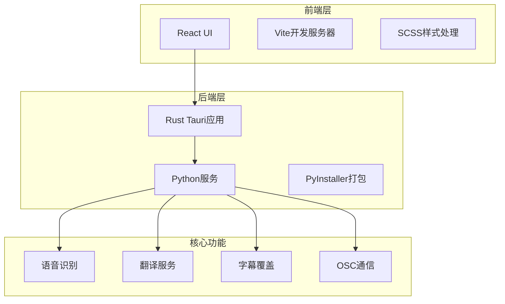
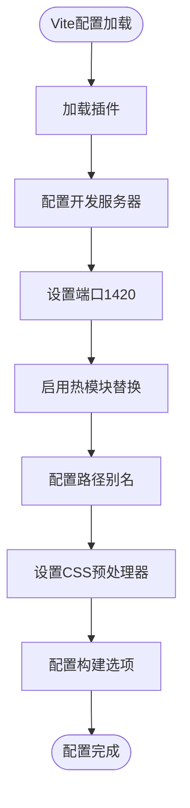
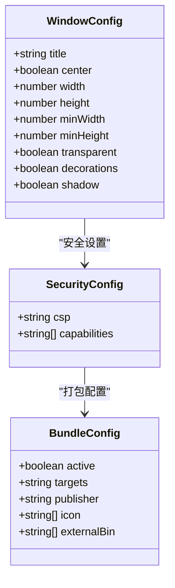
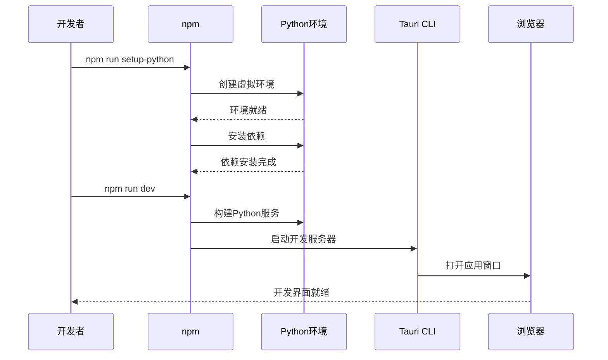
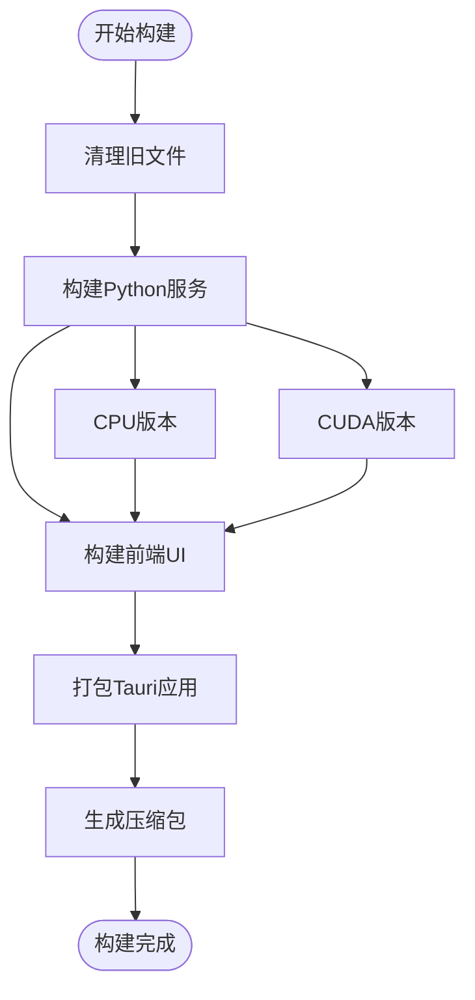

# VRCT项目开发环境搭建指南

<cite>
**本文档引用的文件**
- [package.json](file://package.json)
- [vite.config.js](file://vite.config.js)
- [src-tauri/tauri.conf.json](file://src-tauri/tauri.conf.json)
- [src-tauri/Cargo.toml](file://src-tauri/Cargo.toml)
- [src-tauri/src/main.rs](file://src-tauri/src/main.rs)
- [src-tauri/src/lib.rs](file://src-tauri/src/lib.rs)
- [src-tauri/capabilities/vrct_capability.json](file://src-tauri/capabilities/vrct_capability.json)
- [requirements.txt](file://requirements.txt)
- [requirements_cuda.txt](file://requirements_cuda.txt)
- [install.bat](file://install.bat)
- [build.bat](file://build.bat)
- [build_cuda.bat](file://build_cuda.bat)
- [backend.spec](file://backend.spec)
- [backend_cuda.spec](file://backend_cuda.spec)
</cite>

## 目录
1. [项目概述](#项目概述)
2. [系统要求](#系统要求)
3. [前置依赖安装](#前置依赖安装)
4. [前端开发环境配置](#前端开发环境配置)
5. [后端开发环境配置](#后端开发环境配置)
6. [完整开发环境启动](#完整开发环境启动)
7. [构建与打包](#构建与打包)
8. [常见问题排查](#常见问题排查)
9. [环境变量配置](#环境变量配置)
10. [性能优化建议](#性能优化建议)

## 项目概述

VRCT是一个基于Tauri框架的跨平台应用程序，结合了React前端和Rust后端，用于实时语音转文字和翻译功能。项目采用现代化的开发技术栈，支持Windows、macOS和Linux平台。

### 技术架构概览



**图表来源**
- [package.json](file://package.json#L1-L63)
- [src-tauri/tauri.conf.json](file://src-tauri/tauri.conf.json#L1-L60)
- [src-tauri/Cargo.toml](file://src-tauri/Cargo.toml#L1-L34)

## 系统要求

### 最低系统要求
- **操作系统**: Windows 10/11, macOS 10.15+, Linux (Ubuntu 18.04+)
- **内存**: 至少 8GB RAM
- **存储空间**: 至少 20GB 可用磁盘空间
- **网络**: 稳定的互联网连接（用于下载模型和依赖）

### 推荐系统配置
- **处理器**: Intel i5 或 AMD Ryzen 5 及以上
- **内存**: 16GB 或更多 RAM
- **显卡**: 支持CUDA的NVIDIA GPU（可选，用于加速）
- **存储**: SSD固态硬盘

## 前置依赖安装

### Node.js 和 npm 安装

1. **下载并安装Node.js**
   - 访问 [Node.js官网](https://nodejs.org/)
   - 下载LTS版本（推荐18.x或20.x）
   - 运行安装程序并完成安装

2. **验证安装**
   ```bash
   node --version
   npm --version
   ```

### Rust工具链安装

1. **安装Rust**
   ```bash
   curl --proto '=https' --tlsv1.2 -sSf https://sh.rustup.rs | sh
   ```

2. **添加必要的组件**
   ```bash
   rustup component add rustfmt clippy
   ```

3. **安装Tauri CLI**
   ```bash
   npm install @tauri-apps/cli -g
   ```

### Python环境准备

1. **安装Python**
   - 访问 [Python官网](https://www.python.org/)
   - 下载并安装最新稳定版本（建议3.10+）
   - 确保勾选"Add Python to PATH"选项

2. **验证Python安装**
   ```bash
   python --version
   pip --version
   ```

## 前端开发环境配置

### Vite开发服务器配置

Vite是项目的主要前端开发工具，提供了快速的热重载和构建功能。

#### vite.config.js配置详解



**图表来源**
- [vite.config.js](file://vite.config.js#L14-L135)

#### 关键配置项说明

1. **开发服务器配置**
   - **端口**: 1420（固定端口，避免冲突）
   - **严格端口模式**: 启用以防止端口被占用时自动切换
   - **主机地址**: 支持自定义主机地址（通过TAURI_DEV_HOST环境变量）
   - **热重载**: 针对不同协议和主机进行优化

2. **路径别名配置**
   - `@root`: 项目根目录
   - `@ui_configs`: UI配置文件
   - `@store`: 全局状态管理
   - `@plugins_*`: 插件相关路径别名

3. **插件系统**
   - **React支持**: 自动检测和编译React组件
   - **SVG处理**: 支持SVGR插件处理SVG文件
   - **YAML支持**: 处理YAML配置文件

**章节来源**
- [vite.config.js](file://vite.config.js#L14-L135)

### npm脚本配置

项目定义了丰富的npm脚本来简化开发流程：

| 脚本名称 | 功能描述 | 使用场景 |
|---------|---------|---------|
| `setup-python` | 初始化Python环境 | 第一次克隆项目后执行 |
| `build-python` | 构建CPU版本 | 标准功能开发 |
| `build-python-cuda` | 构建GPU加速版本 | 需要CUDA支持时 |
| `vite` | 启动Vite开发服务器 | 前端开发 |
| `tauri-dev` | 启动Tauri开发模式 | 整体应用开发 |
| `dev` | 完整开发环境启动 | 日常开发工作 |
| `dev-cuda` | CUDA版本开发环境 | GPU加速开发 |
| `build` | 生产环境构建 | 发布前构建 |

**章节来源**
- [package.json](file://package.json#L6-L24)

## 后端开发环境配置

### Tauri应用配置

Tauri.conf.json定义了应用的核心配置，包括窗口属性、安全设置和API权限。

#### 窗口配置



**图表来源**
- [src-tauri/tauri.conf.json](file://src-tauri/tauri.conf.json#L14-L59)

#### 核心配置项

1. **窗口属性**
   - **标题**: "VRCT"
   - **尺寸**: 默认450x220，最小400x200
   - **透明背景**: 启用以实现无边框效果
   - **装饰**: 移除系统窗口装饰

2. **安全配置**
   - **能力配置**: 包含默认能力和VRCT专用能力
   - **内容安全策略**: 禁用CSP以支持动态内容

3. **打包配置**
   - **目标格式**: NSIS安装包
   - **图标资源**: 多分辨率图标文件
   - **外部二进制**: VRCT-sidecar可执行文件

**章节来源**
- [src-tauri/tauri.conf.json](file://src-tauri/tauri.conf.json#L1-L60)

### Rust依赖管理

Cargo.toml管理Rust后端的所有依赖，采用固定版本策略确保稳定性。

#### 依赖分类

```mermaid
graph LR
subgraph "核心依赖"
Tauri[tauri = "2.5.1"]
Serde[serde = "1.0.219"]
Reqwest[reqwest = "0.12.15"]
end
subgraph "插件依赖"
FS[tauri-plugin-fs]
HTTP[tauri-plugin-http]
Shell[tauri-plugin-shell]
GlobalShortcut[tauri-plugin-global-shortcut]
end
subgraph "工具依赖"
FontKit[font-kit = "0.14.2"]
Base64[base64 = "0.22.1"]
end
Tauri --> FS
Tauri --> HTTP
Tauri --> Shell
Tauri --> GlobalShortcut
```

**图表来源**
- [src-tauri/Cargo.toml](file://src-tauri/Cargo.toml#L18-L34)

#### 主要依赖说明

1. **Tauri框架**: 提供跨平台桌面应用基础
2. **Serde序列化**: 数据序列化和反序列化
3. **Reqwest HTTP客户端**: 网络请求处理
4. **字体工具**: 系统字体列表获取
5. **Base64编码**: 资源数据编码

**章节来源**
- [src-tauri/Cargo.toml](file://src-tauri/Cargo.toml#L1-L34)

### Python依赖配置

项目提供两套Python依赖配置，分别针对CPU和GPU加速版本。

#### CPU版本依赖（requirements.txt）

| 依赖包 | 版本 | 用途 |
|-------|------|------|
| torch | 2.7.0 | 深度学习框架 |
| faster-whisper | 1.1.1 | 语音识别引擎 |
| transformers | 4.40.2 | NLP模型支持 |
| numpy | 1.26.4 | 数值计算 |
| openvr | 1.26.701 | VR设备支持 |

#### GPU加速版本（requirements_cuda.txt）

主要区别在于PyTorch的CUDA版本：
- `--extra-index-url https://download.pytorch.org/whl/cu128`
- 支持NVIDIA CUDA 12.8

**章节来源**
- [requirements.txt](file://requirements.txt#L1-L32)
- [requirements_cuda.txt](file://requirements_cuda.txt#L1-L33)

## 完整开发环境启动

### 环境初始化步骤



**图表来源**
- [package.json](file://package.json#L17-L20)
- [install.bat](file://install.bat#L1-L25)

### 启动命令详解

1. **首次设置**
   ```bash
   npm run setup-python
   ```
   - 创建`.venv`和`.venv_cuda`虚拟环境
   - 安装对应版本的Python依赖

2. **日常开发**
   ```bash
   npm run dev
   ```
   - 杀死现有进程（`task-kill`）
   - 构建Python服务
   - 并行启动Vite和Tauri开发服务器

3. **GPU加速开发**
   ```bash
   npm run dev-cuda
   ```
   - 使用CUDA版本的Python依赖
   - 适用于需要GPU加速的功能开发

### 开发服务器特性

- **热重载**: 修改代码后自动刷新
- **错误提示**: 显示详细的编译和运行错误
- **调试支持**: 开发模式下自动打开开发者工具
- **跨平台**: 支持Windows、macOS和Linux

**章节来源**
- [package.json](file://package.json#L17-L20)

## 构建与打包

### 构建流程概览



**图表来源**
- [package.json](file://package.json#L20-L24)

### 构建命令

1. **标准构建**
   ```bash
   npm run build
   ```
   - 清理旧构建文件
   - 构建CPU版本Python服务
   - 构建前端UI
   - 打包Tauri应用

2. **CUDA版本构建**
   ```bash
   npm run build-cuda
   ```
   - 使用CUDA版本Python依赖
   - 生成GPU加速版本

3. **发布构建**
   ```bash
   npm run release
   ```
   - 执行标准构建
   - 生成VRCT.zip压缩包

4. **完整发布**
   ```bash
   npm run release-all
   ```
   - 构建CPU和CUDA版本
   - 生成两个压缩包

### PyInstaller配置

构建过程使用PyInstaller将Python服务打包为独立可执行文件：

#### CPU版本配置（backend.spec）
- 包含所有必要的Python库和资源文件
- 排除大型科学计算库以减小体积
- 配置UPX压缩优化

#### CUDA版本配置（backend_cuda.spec）
- 使用CUDA版本的PyTorch
- 保持相同的资源文件结构

**章节来源**
- [package.json](file://package.json#L20-L24)
- [backend.spec](file://backend.spec#L1-L54)
- [backend_cuda.spec](file://backend_cuda.spec#L1-L54)

## 常见问题排查

### 依赖安装问题

#### Python虚拟环境问题

**问题**: 虚拟环境创建失败
```bash
Error: The system cannot find the path specified
```

**解决方案**:
1. 检查Python是否正确安装
2. 确认系统PATH变量包含Python路径
3. 尝试手动创建虚拟环境：
   ```bash
   python -m venv test_env
   ```

#### Node.js版本兼容性

**问题**: Tauri CLI安装失败
```bash
Error: Unsupported Node.js version
```

**解决方案**:
1. 升级到Node.js 18.x或更高版本
2. 清理npm缓存：
   ```bash
   npm cache clean --force
   ```
3. 重新安装依赖：
   ```bash
   npm install
   ```

### 构建失败问题

#### Rust编译错误

**问题**: Rust编译失败
```bash
error[E0432]: unresolved imports
```

**解决方案**:
1. 更新Rust工具链：
   ```bash
   rustup update
   ```
2. 清理Cargo缓存：
   ```bash
   cargo clean
   ```
3. 重新构建：
   ```bash
   cargo build
   ```

#### PyInstaller打包问题

**问题**: PyInstaller无法找到模块
```bash
ModuleNotFoundError: No module named 'xxx'
```

**解决方案**:
1. 检查requirements.txt中的依赖是否完整
2. 在spec文件中添加hiddenimports
3. 使用`--debug`参数获取详细错误信息

### 运行时问题

#### 端口冲突

**问题**: 开发服务器端口被占用
```bash
Error: Port 1420 is already in use
```

**解决方案**:
1. 查找占用端口的进程：
   ```bash
   netstat -ano | findstr :1420
   ```
2. 终止相关进程或修改vite.config.js中的端口配置

#### 权限问题

**问题**: 应用无法访问某些系统资源
```bash
Permission denied
```

**解决方案**:
1. 检查防火墙设置
2. 以管理员权限运行
3. 验证Tauri能力配置

### 性能优化问题

#### 内存使用过高

**问题**: 开发过程中内存占用过大

**解决方案**:
1. 关闭不必要的浏览器标签页
2. 减少同时运行的开发工具
3. 增加系统虚拟内存

#### 构建速度慢

**问题**: 构建时间过长

**解决方案**:
1. 使用SSD硬盘
2. 增加系统内存
3. 使用增量构建（仅修改部分代码时）

## 环境变量配置

### 开发环境变量

#### TAURI_DEV_HOST

用于指定开发服务器的主机地址，支持远程开发：

```bash
# 设置为特定IP地址
set TAURI_DEV_HOST=192.168.1.100

# 或设置为空禁用远程访问
set TAURI_DEV_HOST=
```

#### 环境变量优先级

1. 系统环境变量
2. `.env`文件（如果存在）
3. 默认值

### 生产环境配置

生产环境通常不需要特殊配置，但可以考虑以下优化：

#### Python环境优化

```bash
# 设置Python缓存目录
set PYTHONPYCACHEPREFIX=./cache

# 启用Python优化模式
set PYTHONOPTIMIZE=1
```

#### Rust编译优化

```bash
# 设置Rust编译目标
export CARGO_TARGET_DIR=./target

# 启用Rust编译优化
export CARGO_BUILD_OPT_LEVEL=3
```

## 性能优化建议

### 开发阶段优化

#### Vite开发服务器优化

1. **启用HMR缓存**
   - 确保`hmr`配置正确
   - 避免频繁的全量刷新

2. **优化插件加载**
   - 按需加载非核心插件
   - 使用动态导入减少初始包大小

#### Rust编译优化

1. **使用Release模式**
   ```bash
   cargo build --release
   ```

2. **启用LLVM优化**
   ```bash
   export RUSTFLAGS="-C opt-level=3"
   ```

### 构建阶段优化

#### PyInstaller优化

1. **UPX压缩**
   - 自动启用UPX压缩
   - 可通过`--noupx`禁用

2. **排除大型库**
   - 排除未使用的科学计算库
   - 使用条件导入

#### 前端资源优化

1. **代码分割**
   - 使用动态导入分割大模块
   - 实现按需加载

2. **资源压缩**
   - 启用CSS/JS压缩
   - 图片资源优化

### 运行时优化

#### 内存管理

1. **及时释放资源**
   - 正确关闭文件句柄
   - 清理临时对象

2. **内存监控**
   - 使用性能分析工具
   - 监控内存泄漏

#### 网络优化

1. **请求合并**
   - 减少HTTP请求数量
   - 使用批量API

2. **缓存策略**
   - 实现智能缓存
   - 使用CDN加速

通过遵循本指南，开发者应该能够成功搭建VRCT项目的完整开发环境，并具备解决常见问题的能力。如果遇到本指南未涵盖的问题，请参考项目官方文档或寻求社区帮助。