# VRCT开发者指南

<cite>
**本文档中引用的文件**
- [README.md](file://README.md)
- [package.json](file://package.json)
- [vite.config.js](file://vite.config.js)
- [src-tauri/tauri.conf.json](file://src-tauri/tauri.conf.json)
- [src-tauri/Cargo.toml](file://src-tauri/Cargo.toml)
- [src-python/config.py](file://src-python/config.py)
- [src-python/controller.py](file://src-python/controller.py)
- [src-python/model.py](file://src-python/model.py)
- [src-python/docs/详细设计文档_zh.md](file://src-python/docs/详细设计文档_zh.md)
- [src-python/docs/编码规范_zh.md](file://src-python/docs/编码规范_zh.md)
- [src-python/test_client.py](file://src-python/test_client.py)
- [src-python/test_endpoints.py](file://src-python/test_endpoints.py)
- [src-ui/logics/store.js](file://src-ui/logics/store.js)
- [src-ui/logics/main/useMainFunction.js](file://src-ui/logics/main/useMainFunction.js)
- [build.bat](file://build.bat)
- [requirements.txt](file://requirements.txt)
- [src-ui/plugins/plugins_index.js](file://src-ui/plugins/plugins_index.js)
</cite>

## 目录
1. [项目概述](#项目概述)
2. [项目结构](#项目结构)
3. [开发环境配置](#开发环境配置)
4. [核心架构设计](#核心架构设计)
5. [前后端开发指南](#前后端开发指南)
6. [代码风格与规范](#代码风格与规范)
7. [测试策略](#测试策略)
8. [构建与部署](#构建与部署)
9. [贡献流程](#贡献流程)
10. [故障排除](#故障排除)

## 项目概述

VRCT是一个基于Tauri框架的跨平台应用程序，结合了Python后端和React前端，提供实时语音翻译和转录功能。项目采用MVC架构模式，支持多种翻译引擎和语音识别技术。

### 主要特性
- 实时语音转录和翻译
- 支持多种翻译引擎（DeepL、OpenAI、Google Gemini等）
- VR聊天室集成
- 插件系统
- 多语言界面支持

## 项目结构

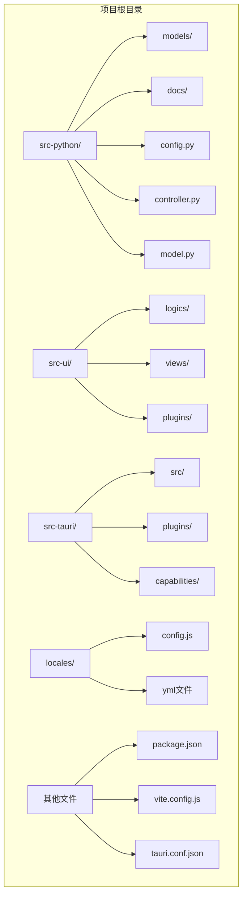

**图表来源**
- [package.json](file://package.json#L1-L63)
- [vite.config.js](file://vite.config.js#L1-L135)
- [src-tauri/tauri.conf.json](file://src-tauri/tauri.conf.json#L1-L60)

### 目录结构说明

- **src-python/**: Python后端代码，包含业务逻辑和数据处理
- **src-ui/**: React前端代码，包含用户界面和状态管理
- **src-tauri/**: Rust原生代码，负责系统集成和性能优化
- **locales/**: 国际化资源文件
- **构建脚本**: 包含构建和部署相关的批处理文件

**章节来源**
- [package.json](file://package.json#L1-L63)
- [vite.config.js](file://vite.config.js#L1-L135)
- [src-tauri/tauri.conf.json](file://src-tauri/tauri.conf.json#L1-L60)

## 开发环境配置

### 前端开发环境配置

#### Vite配置详解

Vite配置文件提供了完整的开发环境设置，包括热重载、代理和别名配置。

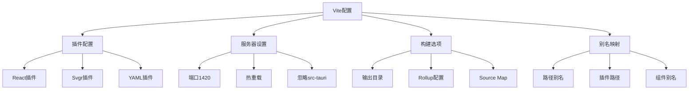

**图表来源**
- [vite.config.js](file://vite.config.js#L14-L93)

#### 关键配置项

1. **开发服务器配置** (`server`):
   - 端口: 1420
   - 严格端口模式
   - 热重载支持
   - 忽略src-tauri目录监控

2. **路径别名** (`resolve.alias`):
   - `@root`: 项目根目录
   - `@store`: 状态管理模块
   - `@ui_configs`: UI配置
   - `@plugins_path`: 插件路径

3. **插件配置**:
   - React支持
   - SVG组件转换
   - YAML文件处理

**章节来源**
- [vite.config.js](file://vite.config.js#L14-L93)

### 后端开发环境配置

#### Tauri配置详解

Tauri配置定义了应用的基本设置、窗口属性和安全策略。

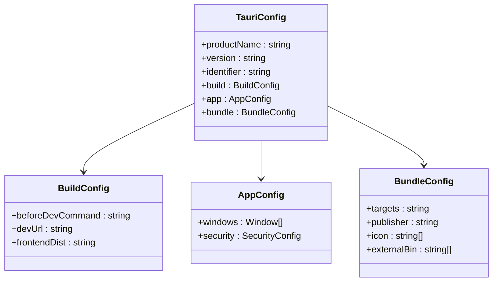

**图表来源**
- [src-tauri/tauri.conf.json](file://src-tauri/tauri.conf.json#L1-L60)

#### 核心配置项

1. **应用基本信息**:
   - 产品名称: VRCT
   - 版本号: 3.3.1
   - 标识符: com.vrct.app

2. **窗口配置**:
   - 默认大小: 450x220
   - 最小尺寸: 400x200
   - 透明背景
   - 无装饰边框

3. **安全配置**:
   - CSP策略: null（允许所有）
   - 功能权限: 默认权限 + VRCT专用权限

**章节来源**
- [src-tauri/tauri.conf.json](file://src-tauri/tauri.conf.json#L1-L60)

### Rust依赖管理

#### Cargo.toml配置

Rust项目使用Cargo进行依赖管理，包含核心功能和可选功能的依赖。

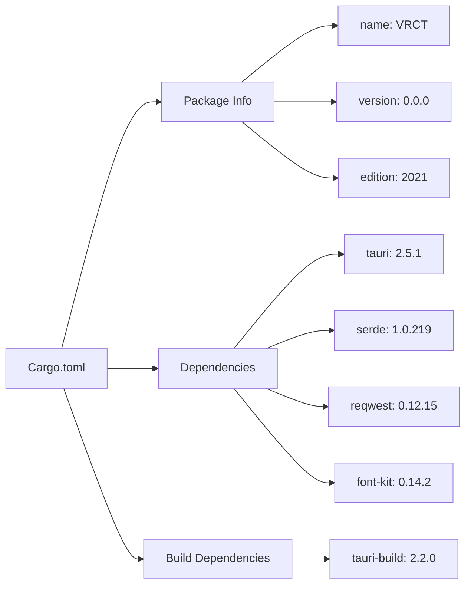

**图表来源**
- [src-tauri/Cargo.toml](file://src-tauri/Cargo.toml#L1-L34)

#### 关键依赖说明

1. **核心依赖**:
   - `tauri`: 应用框架
   - `serde`: 序列化/反序列化
   - `reqwest`: HTTP客户端
   - `font-kit`: 字体管理

2. **平台特定依赖**:
   - `tauri-plugin-global-shortcut`: 全局快捷键（非移动端）

**章节来源**
- [src-tauri/Cargo.toml](file://src-tauri/Cargo.toml#L1-L34)

### Python依赖管理

#### requirements.txt配置

Python项目依赖通过requirements.txt管理，包含机器学习、音频处理和网络通信相关的库。

| 组件类别 | 主要依赖 | 版本要求 |
|---------|---------|---------|
| 机器学习 | torch, ctranslate2, faster-whisper | 具体版本见文件 |
| 音频处理 | SpeechRecognition, PyAudioWPatch | 兼容版本 |
| 翻译服务 | translators, deepl | 最新稳定版 |
| 网络通信 | websockets, python-osc | 稳定版本 |
| 工具库 | numpy, pillow, psutil | 性能优化 |

**章节来源**
- [requirements.txt](file://requirements.txt#L1-L32)

## 核心架构设计

### MVC架构模式

VRCT采用经典的MVC（Model-View-Controller）架构模式，实现了清晰的职责分离。

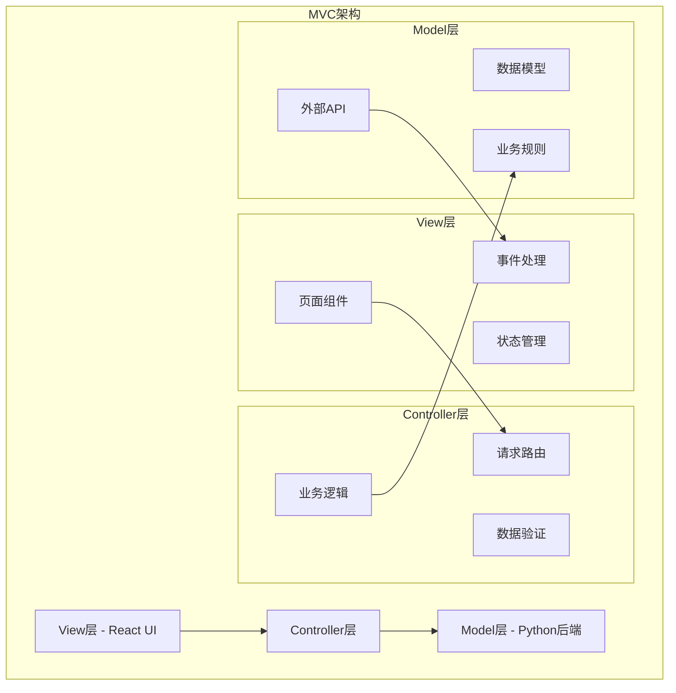

**图表来源**
- [src-python/controller.py](file://src-python/controller.py#L1-L800)
- [src-python/model.py](file://src-python/model.py#L1-L800)

### 单例模式实现

#### Config类的单例设计

Config类采用单例模式确保全局配置的一致性。

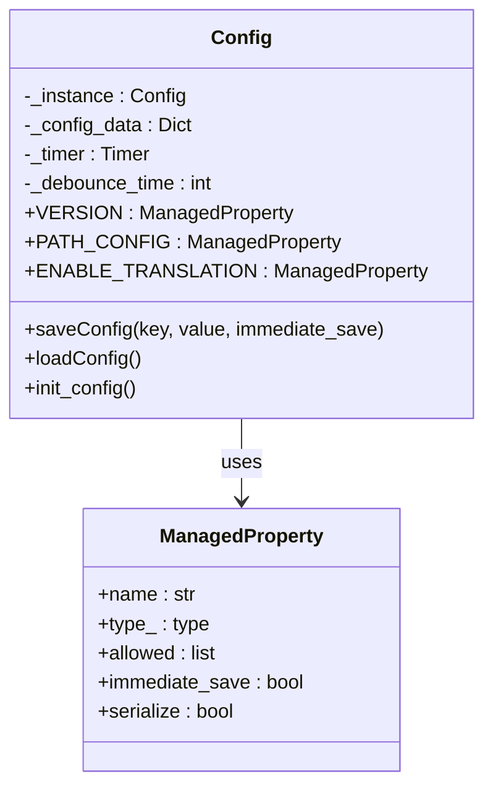

**图表来源**
- [src-python/config.py](file://src-python/config.py#L531-L800)

#### 单例模式特点

1. **延迟初始化**: 配置在首次访问时才加载
2. **线程安全**: 使用类变量确保单例唯一性
3. **自动保存**: 修改后自动保存到文件
4. **防抖机制**: 避免频繁写入磁盘

**章节来源**
- [src-python/config.py](file://src-python/config.py#L531-L800)

### 观察者模式实现

#### UI状态监听机制

应用使用Jotai状态管理库实现观察者模式，实现响应式的UI更新。

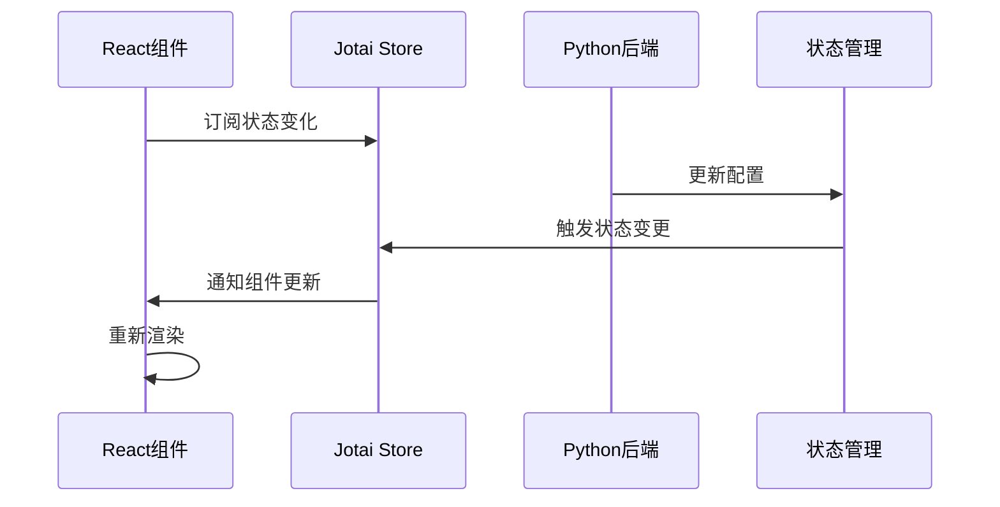

**图表来源**
- [src-ui/logics/store.js](file://src-ui/logics/store.js#L1-L248)

#### 状态管理特性

1. **原子化状态**: 每个状态都是独立的原子
2. **响应式更新**: 状态变化自动触发UI更新
3. **类型安全**: TypeScript支持类型检查
4. **动态注册**: 支持运行时状态注册

**章节来源**
- [src-ui/logics/store.js](file://src-ui/logics/store.js#L1-L248)

### 设计模式总结

| 模式 | 实现位置 | 作用 |
|------|---------|------|
| 单例模式 | Config类 | 全局配置管理 |
| 观察者模式 | Jotai状态管理 | UI状态同步 |
| MVC模式 | 整体架构 | 职责分离 |
| 工厂模式 | 插件系统 | 动态组件创建 |
| 策略模式 | 翻译引擎 | 多引擎支持 |

**章节来源**
- [src-python/docs/详细设计文档_zh.md](file://src-python/docs/详细设计文档_zh.md#L1-L67)

## 前后端开发指南

### 前端开发指南

#### 状态管理系统

前端使用Jotai进行状态管理，提供了强大的响应式状态管理能力。

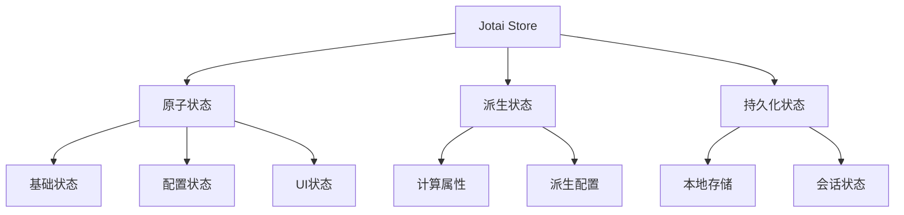

**图表来源**
- [src-ui/logics/store.js](file://src-ui/logics/store.js#L36-L120)

#### 主要状态类型

1. **基础状态**:
   - `Atom_IsBackendReady`: 后端就绪状态
   - `Atom_TranslationStatus`: 翻译功能状态
   - `Atom_MessageLogs`: 消息历史

2. **配置状态**:
   - `Atom_SelectedYourLanguages`: 用户语言选择
   - `Atom_SelectedTargetLanguages`: 目标语言选择
   - `Atom_TranslationEngines`: 翻译引擎配置

3. **UI状态**:
   - `Atom_IsMainPageCompactMode`: 紧凑模式
   - `Atom_MessageInputValue`: 输入框内容

**章节来源**
- [src-ui/logics/store.js](file://src-ui/logics/store.js#L146-L248)

#### 组件通信模式

前端组件通过状态管理进行通信，避免了复杂的props传递。

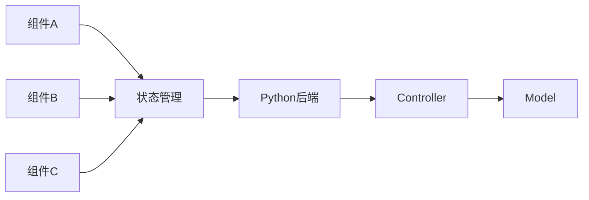

**图表来源**
- [src-ui/logics/main/useMainFunction.js](file://src-ui/logics/main/useMainFunction.js#L1-L109)

**章节来源**
- [src-ui/logics/main/useMainFunction.js](file://src-ui/logics/main/useMainFunction.js#L1-L109)

### 后端开发指南

#### 控制器层设计

控制器负责处理前端请求，协调模型层操作，并返回响应。

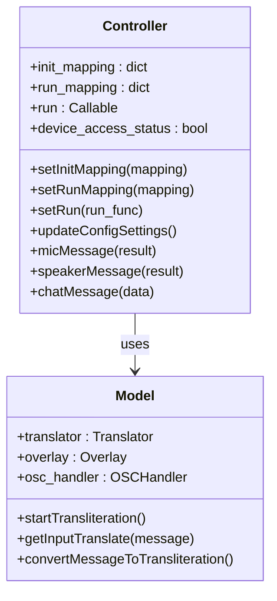

**图表来源**
- [src-python/controller.py](file://src-python/controller.py#L11-L800)
- [src-python/model.py](file://src-python/model.py#L81-L800)

#### 核心功能实现

1. **消息处理**:
   - 麦克风输入处理
   - 扬声器输入处理
   - 聊天消息处理

2. **翻译功能**:
   - 多引擎支持
   - 语言检测
   - 翻译缓存

3. **设备管理**:
   - 音频设备枚举
   - 设备状态监控
   - 权限管理

**章节来源**
- [src-python/controller.py](file://src-python/controller.py#L1-L800)
- [src-python/model.py](file://src-python/model.py#L1-L800)

### 数据流设计

#### 前后端数据交互

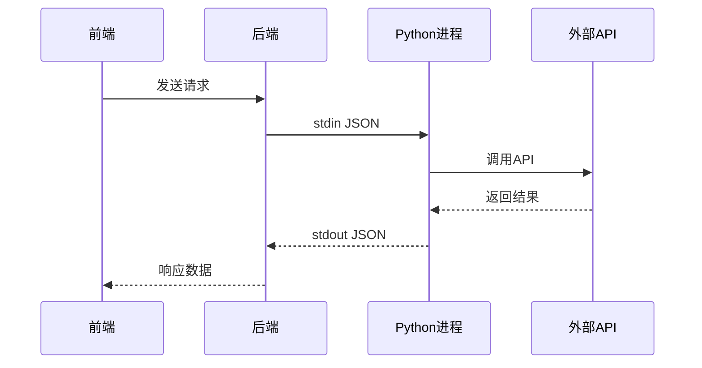

**图表来源**
- [src-python/test_client.py](file://src-python/test_client.py#L1-L800)

#### 数据格式规范

1. **请求格式**:
   ```json
   {
     "endpoint": "/set/data/transparency",
     "data": "eyJ0cmFuc3BhcmVuY3kiOjc1fQ=="
   }
   ```

2. **响应格式**:
   ```json
   {
     "status": 200,
     "endpoint": "/set/data/transparency",
     "result": 75
   }
   ```

**章节来源**
- [src-python/test_client.py](file://src-python/test_client.py#L1-L800)

## 代码风格与规范

### Python编码规范

#### 命名约定

1. **模块名**: 小写，使用下划线分隔（如`overlay_utils.py`）
2. **类名**: CapWords（PascalCase）
3. **函数/方法名**: snake_case
4. **变量名**: snake_case
5. **常量**: UPPER_SNAKE_CASE

#### 类型注解策略

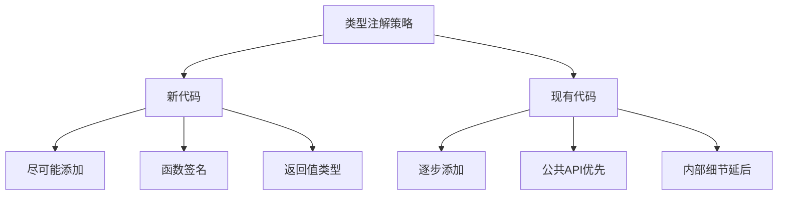

**图表来源**
- [src-python/docs/编码规范_zh.md](file://src-python/docs/编码规范_zh.md#L50-L65)

#### 导入顺序

1. 标准库
2. 第三方库  
3. 本地模块

```python
import os
import json
import threading

import numpy as np
from PIL import Image

from . import overlay_utils
```

**章节来源**
- [src-python/docs/编码规范_zh.md](file://src-python/docs/编码规范_zh.md#L36-L48)

### 前端代码规范

#### React组件规范

1. **状态管理**: 使用Jotai原子
2. **类型安全**: TypeScript支持
3. **命名规范**: 组件使用PascalCase，钩子使用camelCase

#### CSS模块化

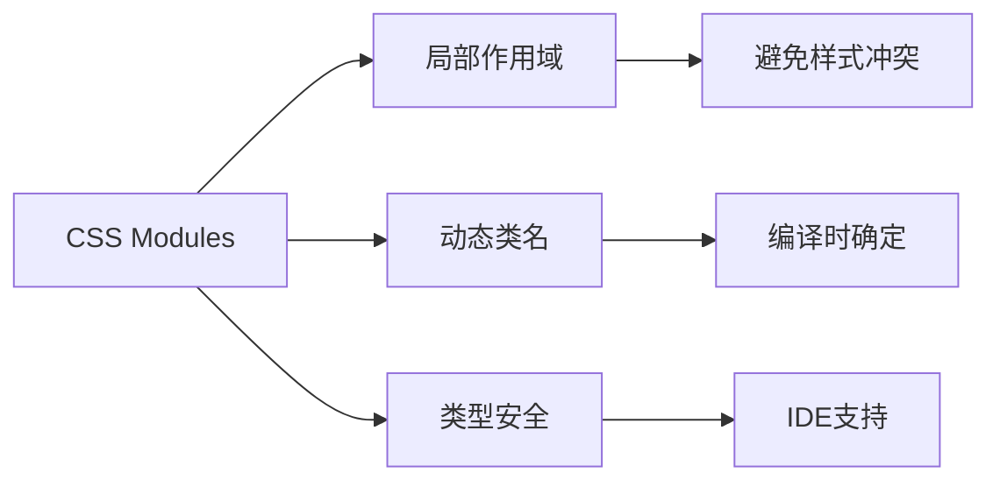

**图表来源**
- [vite.config.js](file://vite.config.js#L85-L91)

### 代码质量工具

#### Ruff配置

```toml
[tool.ruff]
line-length = 88
extend-ignore = ["E203"]
select = ["E", "F", "W", "C90"]
```

#### MyPy配置

```bash
# 松散模式运行
mypy --ignore-missing-imports --allow-untyped-defs --allow-redefinition
```

**章节来源**
- [src-python/docs/编码规范_zh.md](file://src-python/docs/编码规范_zh.md#L140-L170)

## 测试策略

### 测试架构概览

VRCT采用多层次测试策略，包括单元测试、集成测试和端到端测试。

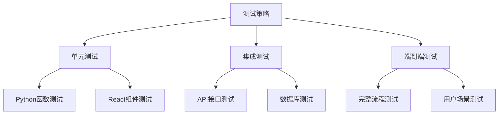

**图表来源**
- [src-python/test_endpoints.py](file://src-python/test_endpoints.py#L1-L800)
- [src-python/test_client.py](file://src-python/test_client.py#L1-L800)

### 端点测试

#### 自动化端点测试

测试框架提供了完整的端点测试能力，支持随机测试和特定场景测试。

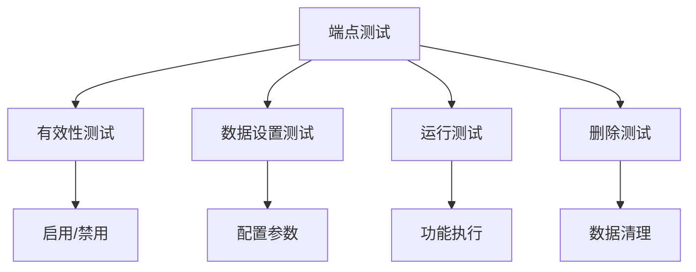

**图表来源**
- [src-python/test_endpoints.py](file://src-python/test_endpoints.py#L35-L800)

#### 测试用例生成

测试框架能够自动生成测试数据，支持各种边界条件和异常情况。

| 测试类型 | 用例数量 | 验证内容 |
|---------|---------|---------|
| 有效性测试 | 100+ | 启用/禁用功能 |
| 数据设置测试 | 200+ | 配置参数验证 |
| 运行测试 | 50+ | 功能执行验证 |
| 删除测试 | 10+ | 数据清理验证 |

**章节来源**
- [src-python/test_endpoints.py](file://src-python/test_endpoints.py#L35-L800)

### 前端测试

#### 组件测试

使用Jest和React Testing Library进行组件测试。

```javascript
// 示例测试用例
test('renders translation status correctly', () => {
  const { getByText } = render(<TranslationStatus />);
  expect(getByText('Translation Enabled')).toBeInTheDocument();
});
```

#### 状态管理测试

测试Jotai状态管理的正确性。

```javascript
test('updates translation status', async () => {
  const { result } = renderHook(() => useStore_TranslationStatus());
  act(() => result.current.updateTranslationStatus(true));
  expect(result.current.currentTranslationStatus.data).toBe(true);
});
```

**章节来源**
- [src-ui/logics/store.js](file://src-ui/logics/store.js#L36-L120)

### 性能测试

#### 后端性能测试

测试Python后端的性能表现，包括内存使用、CPU占用和响应时间。

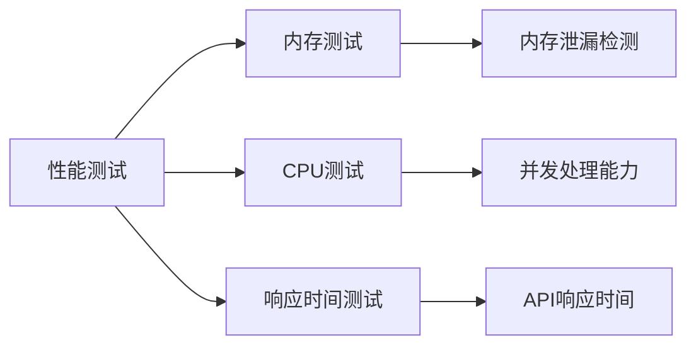

#### 前端性能测试

测试React应用的性能，包括渲染时间和内存使用。

**章节来源**
- [src-python/test_client.py](file://src-python/test_client.py#L1-L800)

## 构建与部署

### 构建流程

#### 前端构建

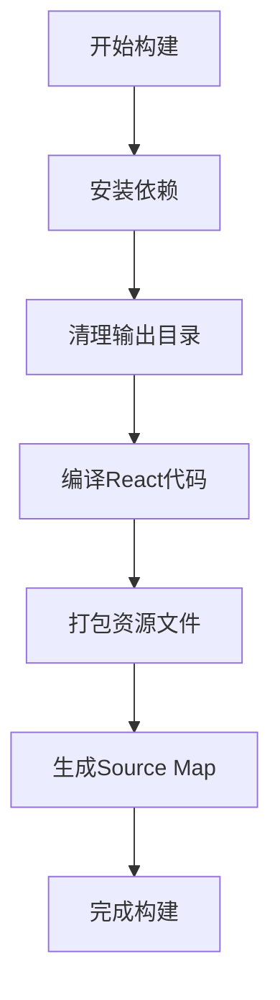

**图表来源**
- [package.json](file://package.json#L7-L24)

#### 构建脚本说明

1. **开发构建**:
   ```bash
   npm run dev
   ```
   - 清理旧文件
   - 构建Python后端
   - 启动Vite开发服务器
   - 启动Tauri开发模式

2. **生产构建**:
   ```bash
   npm run build
   ```
   - 清理输出目录
   - 构建Python后端
   - 构建React应用
   - 打包Tauri应用

**章节来源**
- [package.json](file://package.json#L7-L24)

### Rust构建

#### Tauri构建过程

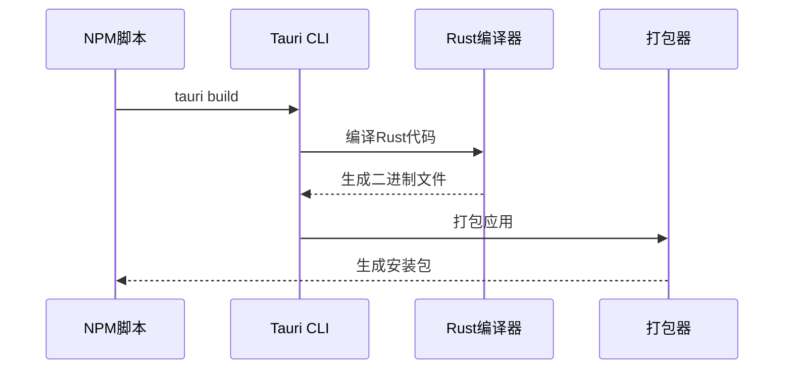

**图表来源**
- [src-tauri/Cargo.toml](file://src-tauri/Cargo.toml#L1-L34)

#### 构建配置

1. **目标平台**: Windows (NSIS安装器)
2. **图标资源**: 多分辨率图标
3. **外部二进制**: VRCT-sidecar
4. **插件支持**: 动态插件加载

**章节来源**
- [src-tauri/tauri.conf.json](file://src-tauri/tauri.conf.json#L30-L58)

### 部署流程

#### 自动化部署

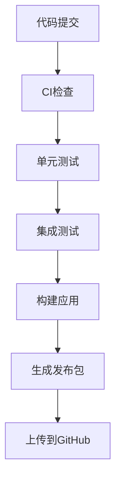

#### 发布包生成

1. **标准版本**: `VRCT.zip`
2. **CUDA版本**: `VRCT_cuda.zip`
3. **全部版本**: 自动化生成两个版本

**章节来源**
- [package.json](file://package.json#L22-L24)

### 插件系统

#### 插件开发指南

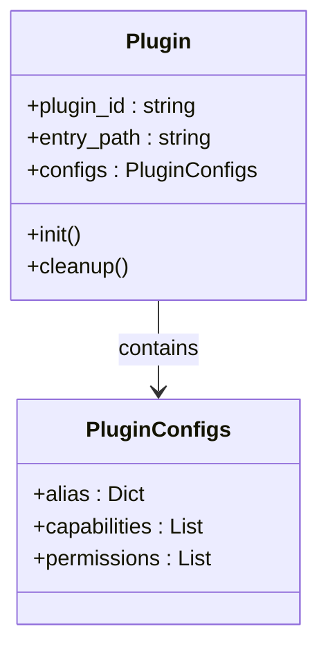

**图表来源**
- [src-ui/plugins/plugins_index.js](file://src-ui/plugins/plugins_index.js#L1-L3)

#### 插件配置

插件通过配置文件定义别名和权限。

```javascript
export const dev_plugins = [
    {
        entry_path: "dev_plugin_subtitles",
        configs: {
            alias: {
                "@subtitles": "src-ui/plugins/dev_plugin_subtitles"
            }
        }
    }
];
```

**章节来源**
- [src-ui/plugins/plugins_index.js](file://src-ui/plugins/plugins_index.js#L1-L3)

## 贡献流程

### Pull Request流程

#### 1. Fork项目

```bash
git clone https://github.com/YOUR_USERNAME/VRCT.git
cd VRCT
git remote add upstream https://github.com/misyaguziya/VRCT.git
```

#### 2. 创建分支

```bash
git checkout -b feature/your-feature-name
```

#### 3. 开发规范

```mermaid
flowchart TD
A[开始开发] --> B[编写代码]
B --> C[添加测试]
C --> D[运行测试]
D --> E[代码检查]
E --> F[提交代码]
F --> G[创建PR]
```

#### 4. 提交规范

- **标题**: 使用清晰的描述性标题
- **描述**: 详细说明修改内容和原因
- **测试**: 确保所有测试通过
- **文档**: 更新相关文档

#### 5. 代码审查

- **自动化检查**: Ruff、MyPy、TypeScript检查
- **人工审查**: 代码质量和架构合理性
- **测试验证**: 功能测试和回归测试

### 开发环境设置

#### 必需工具

1. **Node.js**: 18+
2. **Python**: 3.8+
3. **Rust**: 1.70+
4. **Git**: 2.28+

#### 环境配置

```bash
# 克隆项目
git clone https://github.com/misyaguziya/VRCT.git
cd VRCT

# 安装前端依赖
npm install

# 创建Python虚拟环境
python -m venv .venv
source .venv/bin/activate  # Linux/Mac
# .venv\Scripts\activate  # Windows

# 安装Python依赖
pip install -r requirements.txt

# 启动开发环境
npm run dev
```

### 调试指南

#### 前端调试

1. **浏览器开发工具**: 调试React组件
2. **VS Code调试**: 断点调试
3. **Redux DevTools**: 状态管理调试

#### 后端调试

1. **Python调试**: 使用pdb或IDE调试器
2. **日志查看**: 查看Python进程输出
3. **性能分析**: 使用profiling工具

**章节来源**
- [src-python/docs/编码规范_zh.md](file://src-python/docs/编码规范_zh.md#L79-L90)

## 故障排除

### 常见问题

#### 构建问题

1. **Node.js版本不兼容**
   - 解决方案：升级到Node.js 18+
   - 检查命令：`node --version`

2. **Python依赖缺失**
   - 解决方案：重新安装依赖
   - 命令：`pip install -r requirements.txt`

3. **Rust编译失败**
   - 解决方案：安装Rust工具链
   - 命令：`rustup update`

#### 运行时问题

1. **后端进程无法启动**
   - 检查：Python虚拟环境激活
   - 解决：重新激活虚拟环境

2. **前端热重载失效**
   - 检查：Vite服务器端口1420可用
   - 解决：关闭占用端口的程序

3. **翻译功能异常**
   - 检查：API密钥配置
   - 检查：网络连接状态

### 性能优化

#### 内存管理

```mermaid
graph LR
A[内存优化] --> B[及时释放]
A --> C[缓存管理]
A --> D[垃圾回收]
B --> B1[断开事件监听]
B --> B2[清理定时器]
C --> C1[智能缓存]
C --> C2[过期清理]
D --> D1[手动GC]
D --> D2[内存监控]
```

#### 性能监控

1. **CPU使用率**: 监控翻译和转录过程
2. **内存占用**: 跟踪长期运行稳定性
3. **网络请求**: 监控API调用频率

### 日志分析

#### 日志级别

1. **INFO**: 正常操作记录
2. **WARNING**: 警告信息
3. **ERROR**: 错误信息
4. **DEBUG**: 调试信息

#### 日志位置

- **Python日志**: `logs/`目录下的日期文件
- **前端日志**: 浏览器控制台
- **系统日志**: 操作系统事件日志

**章节来源**
- [src-python/model.py](file://src-python/model.py#L284-L295)

## 结论

VRCT项目采用了现代化的技术栈和架构设计，为开发者提供了完整的开发指南。通过遵循本文档的规范和最佳实践，开发者可以高效地参与项目开发，贡献高质量的代码。

### 关键要点

1. **架构清晰**: MVC模式确保代码组织良好
2. **类型安全**: TypeScript和MyPy提供类型检查
3. **测试完善**: 多层次测试保证代码质量
4. **文档齐全**: 详细的开发指南和API文档
5. **社区友好**: 清晰的贡献流程和规范

### 未来发展方向

1. **性能优化**: 持续改进应用性能
2. **功能扩展**: 添加新翻译引擎和功能
3. **用户体验**: 改进界面设计和交互体验
4. **国际化**: 扩展多语言支持

通过持续的改进和社区贡献，VRCT将继续为用户提供优秀的语音翻译和转录服务。