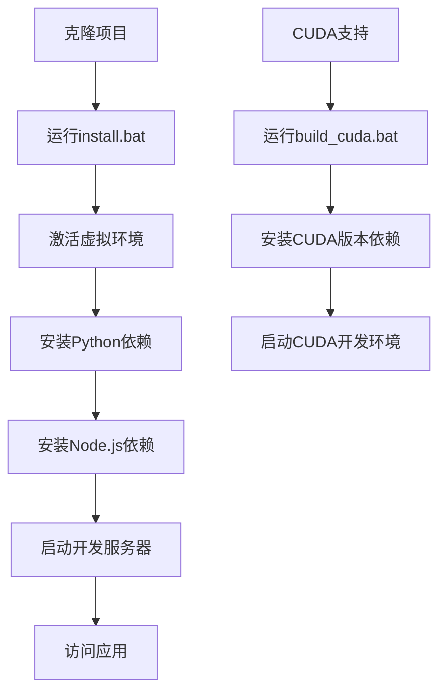
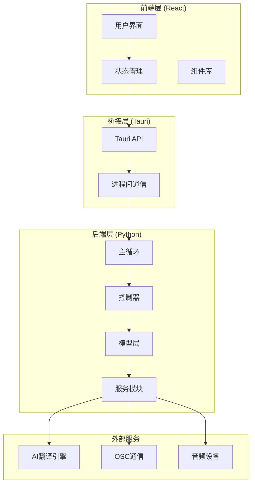
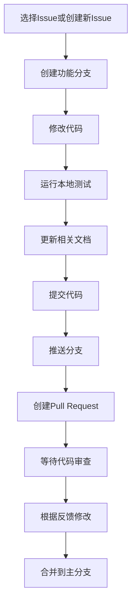
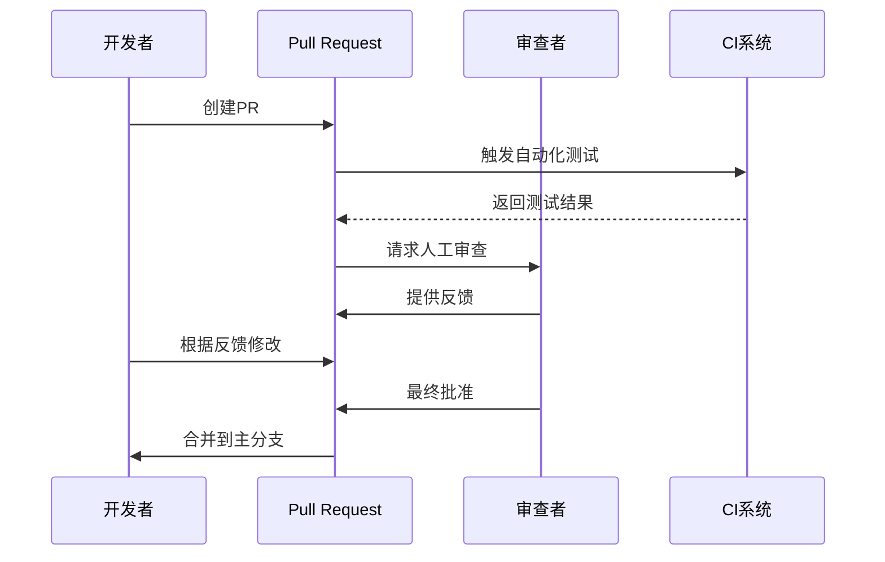

# VRCT项目贡献者流程指南

<cite>
**本文档中引用的文件**
- [README.md](file://README.md)
- [package.json](file://package.json)
- [requirements.txt](file://requirements.txt)
- [install.bat](file://install.bat)
- [build.bat](file://build.bat)
- [build_cuda.bat](file://build_cuda.bat)
- [src-python/docs/编码规范_zh.md](file://src-python/docs/编码规范_zh.md)
- [src-python/docs/详细设计文档_zh.md](file://src-python/docs/详细设计文档_zh.md)
- [src-python/model.py](file://src-python/model.py)
- [src-python/controller.py](file://src-python/controller.py)
- [src-python/mainloop.py](file://src-python/mainloop.py)
- [src-ui/views/App.jsx](file://src-ui/views/App.jsx)
- [src-ui/logics/store.js](file://src-ui/logics/store.js)
</cite>

## 目录
1. [项目简介](#项目简介)
2. [开发环境搭建](#开发环境搭建)
3. [项目架构概览](#项目架构概览)
4. [贡献流程详解](#贡献流程详解)
5. [代码规范与质量保证](#代码规范与质量保证)
6. [测试与验证](#测试与验证)
7. [提交与审查](#提交与审查)
8. [问题报告与功能请求](#问题报告与功能请求)
9. [社区协作指南](#社区协作指南)

## 项目简介

VRCT是一个基于Python和React技术栈的跨平台应用程序，主要用于实时语音转录和翻译。项目采用前后端分离架构，后端使用Python处理音频处理、AI模型推理和OSC通信，前端使用React构建用户界面。

### 技术栈概览
- **后端**: Python 3.x, Tauri框架
- **前端**: React 18, TypeScript, SCSS
- **构建工具**: Vite, PyInstaller
- **依赖管理**: npm, pip

**章节来源**
- [package.json](file://package.json#L1-L63)
- [requirements.txt](file://requirements.txt#L1-L32)

## 开发环境搭建

### 系统要求
- Windows 10/11 (推荐)
- Python 3.8+
- Node.js 16+
- Git

### 环境准备步骤

#### 1. 克隆项目
```bash
git clone https://github.com/your-repository-url.git
cd VRCT
```

#### 2. 安装Python依赖
项目提供了自动化的安装脚本：
```bash
# 标准版本安装
install.bat

# CUDA版本安装（需要NVIDIA GPU）
build_cuda.bat
```

#### 3. 安装Node.js依赖
```bash
npm install
```

#### 4. 开发环境启动
```bash
# 启动开发服务器
npm run dev

# CUDA版本开发
npm run dev-cuda
```

### 环境配置说明



**图表来源**
- [install.bat](file://install.bat#L1-L25)
- [build_cuda.bat](file://build_cuda.bat)

**章节来源**
- [install.bat](file://install.bat#L1-L25)
- [package.json](file://package.json#L7-L24)

## 项目架构概览

VRCT采用模块化架构设计，分为三个主要部分：Python后端、React前端和Tauri桥接层。

### 整体架构图



**图表来源**
- [src-python/mainloop.py](file://src-python/mainloop.py#L1-L588)
- [src-python/controller.py](file://src-python/controller.py#L1-L800)
- [src-python/model.py](file://src-python/model.py#L1-L800)

### 核心模块说明

#### 1. Python后端核心模块
- **Model**: 单例模式，负责AI模型管理和资源初始化
- **Controller**: 处理GUI请求，协调Model操作
- **Main**: 主循环，处理stdin/stdout通信

#### 2. React前端架构
- **状态管理**: 使用Jotai进行全局状态管理
- **组件系统**: 模块化组件设计
- **国际化**: 支持多语言界面

**章节来源**
- [src-python/docs/详细设计文档_zh.md](file://src-python/docs/详细设计文档_zh.md#L1-L67)
- [src-ui/views/App.jsx](file://src-ui/views/App.jsx#L1-L82)

## 贡献流程详解

### 修改前准备工作

#### 1. 阅读设计文档
在开始任何代码修改之前，请务必阅读详细设计文档以理解系统架构：
- **详细设计文档**: [详细设计文档_zh.md](file://src-python/docs/详细设计文档_zh.md)
- **编码规范**: [编码规范_zh.md](file://src-python/docs/编码规范_zh.md)

#### 2. 环境验证
确保开发环境正确配置：
```bash
# 验证Python环境
python --version
python -m venv test_env
call test_env\Scripts\activate
pip install -r requirements.txt

# 验证Node.js环境
node --version
npm --version
```

### 代码修改流程

#### 1. 分支管理策略
```bash
# 创建功能分支
git checkout -b feature/your-feature-name

# 创建修复分支
git checkout -b fix/issue-description

# 创建热修复分支
git checkout -b hotfix/critical-issue
```

#### 2. 修改步骤



#### 3. 代码修改示例

##### Python后端修改
```python
# 修改前：缺乏类型注解
def process_message(message):
    return message.upper()

# 修改后：添加类型注解和docstring
def process_message(message: str) -> str:
    """将消息转换为大写格式。
    
    Args:
        message: 输入的字符串消息
        
    Returns:
        转换后的消息字符串
    """
    return message.upper()
```

##### React前端修改
```javascript
// 修改前：缺少状态管理
const [messages, setMessages] = useState([]);

// 修改后：使用Jotai状态管理
const { atomInstance: Atom_Messages, useHook: useStore_Messages } = createAtomWithHook([], "Messages");
const useMessages = useStore_Messages();
```

**章节来源**
- [src-python/docs/编码规范_zh.md](file://src-python/docs/编码规范_zh.md#L1-L170)

## 代码规范与质量保证

### Python编码规范

#### 1. 命名约定
- **模块名**: 小写，使用下划线分隔（如：`overlay_utils.py`）
- **类名**: CapWords（PascalCase）
- **函数/方法名**: snake_case
- **变量名**: snake_case
- **常量**: UPPER_SNAKE_CASE

#### 2. 类型注解要求
```python
from typing import Any, Dict, Optional, List

def example_function(
    param1: str, 
    param2: Optional[int] = None
) -> Dict[str, Any]:
    """示例函数docstring"""
    pass
```

#### 3. 错误处理规范
```python
try:
    result = risky_operation()
except SpecificException as e:
    errorLogging(f"Operation failed: {e}")
    return {"status": 400, "error": str(e)}
```

### 前端代码规范

#### 1. 组件设计原则
- 单一职责原则
- 可复用性设计
- 类型安全

#### 2. 状态管理规范
```typescript
// 使用Jotai进行状态管理
export const createAtomWithHook = (
    initialValue: any, 
    baseName: string
) => {
    const atomInstance = atom({
        state: "ok",
        data: initialValue,
    });
    // ... 实现细节
};
```

### 质量保证工具

#### 1. 自动化检查
项目集成了多种质量保证工具：
- **Ruff**: 代码格式化和检查
- **MyPy**: 类型检查
- **ESLint**: JavaScript代码检查

#### 2. Pre-commit钩子
```yaml
# .pre-commit-config.yaml 示例
repos:
  - repo: https://github.com/charliermarsh/ruff-pre-commit
    rev: v0.14.0
    hooks:
      - id: ruff
        args: ["--fix"]
  - repo: https://github.com/PyCQA/isort
    rev: 5.12.0
    hooks:
      - id: isort
```

**章节来源**
- [src-python/docs/编码规范_zh.md](file://src-python/docs/编码规范_zh.md#L23-L170)

## 测试与验证

### 测试策略

#### 1. 后端测试
```python
# 测试示例：设备管理器测试
def test_device_manager():
    """测试设备管理器功能"""
    device_manager.init()
    devices = device_manager.getMicDevices()
    assert isinstance(devices, dict)
    assert len(devices) > 0
```

#### 2. 前端测试
```javascript
// 测试示例：状态管理测试
describe('MessageStore', () => {
    it('should add messages correctly', () => {
        const { result } = renderHook(() => useMessages());
        act(() => {
            result.current.updateAtom(['Hello']);
        });
        expect(result.current.current.data).toEqual(['Hello']);
    });
});
```

### 验证清单

#### 1. 功能验证
- [ ] 新功能正常工作
- [ ] 现有功能不受影响
- [ ] 错误处理正确
- [ ] 性能无明显下降

#### 2. 兼容性验证
- [ ] 支持的操作系统
- [ ] 不同的硬件配置
- [ ] 各种网络环境

#### 3. 用户体验验证
- [ ] 界面响应流畅
- [ ] 错误信息友好
- [ ] 操作流程直观

**章节来源**
- [src-python/docs/详细设计文档_zh.md](file://src-python/docs/详细设计文档_zh.md#L63-L67)

## 提交与审查

### 提交信息规范

#### 1. 提交信息格式
```
<类型>(<范围>): <简短描述>

<详细描述>

<相关Issue>
```

#### 2. 提交类型
- `feat`: 新功能
- `fix`: 错误修复
- `docs`: 文档更新
- `style`: 代码格式调整
- `refactor`: 代码重构
- `test`: 测试相关
- `chore`: 构建过程或辅助工具变动

#### 3. 示例提交信息
```
feat(transcription): 添加多语言转录支持

- 支持超过50种语言的实时转录
- 优化转录准确性算法
- 添加语言检测功能

Fixes #123
```

### Pull Request审查要点

#### 1. 代码质量
- [ ] 遵循编码规范
- [ ] 适当的错误处理
- [ ] 清晰的注释
- [ ] 合理的复杂度

#### 2. 功能完整性
- [ ] 实现了所有预期功能
- [ ] 处理了边界情况
- [ ] 性能表现良好

#### 3. 向后兼容性
- [ ] 不破坏现有API
- [ ] 保持配置文件兼容
- [ ] 数据迁移方案

#### 4. 文档更新
- [ ] 更新相关文档
- [ ] 添加必要的注释
- [ ] 更新CHANGELOG

### 审查流程



**章节来源**
- [src-python/docs/编码规范_zh.md](file://src-python/docs/编码规范_zh.md#L75-L80)

## 问题报告与功能请求

### 问题报告模板

#### 1. Bug报告模板
```markdown
## Bug描述
简要描述遇到的问题

## 重现步骤
1. 执行操作A
2. 点击按钮B
3. 观察到错误C

## 期望行为
描述期望的正确行为

## 实际行为
描述实际发生的错误行为

## 环境信息
- 操作系统: [Windows 11]
- VRCT版本: [0.1.0]
- Python版本: [3.11]
- 硬件配置: [CPU, GPU信息]

## 日志文件
[在此处粘贴相关日志]
```

#### 2. 环境信息收集
```bash
# 获取系统信息
python -c "import platform; print(platform.platform())"
python --version
pip list | findstr vrct

# 获取VRCT版本
python -c "from config import config; print(config.VERSION)"
```

### 功能请求模板

#### 1. 功能请求格式
```markdown
## 功能描述
详细描述希望添加的功能

## 使用场景
解释为什么需要这个功能以及使用场景

## 实现建议
如果有想法，可以提供实现建议

## 替代方案
描述其他可能的解决方案

## 附加信息
任何其他相关信息
```

### 讨论渠道

#### 1. GitHub Issues
- **Bug报告**: https://github.com/your-repository/issues
- **功能请求**: https://github.com/your-repository/issues
- **讨论**: https://github.com/your-repository/discussions

#### 2. 社区交流
- Discord服务器
- QQ群
- 微信群

**章节来源**
- [src-python/docs/详细设计文档_zh.md](file://src-python/docs/详细设计文档_zh.md#L57-L67)

## 社区协作指南

### 贡献者行为准则

#### 1. 基本原则
- **尊重**: 尊重所有贡献者和用户
- **包容**: 欢迎不同背景的贡献者
- **协作**: 积极参与社区讨论
- **专业**: 保持专业的沟通态度

#### 2. 沟通方式
- 使用清晰、简洁的语言
- 提供具体的反馈和建议
- 及时响应他人的询问
- 保持耐心和友善

### 贡献认可

#### 1. 贡献者名单
项目维护定期更新贡献者名单，感谢所有贡献者的努力。

#### 2. 贡献统计
- 代码贡献
- 文档改进
- 问题报告
- 社区支持

### 长期发展

#### 1. 项目路线图
关注项目GitHub页面的里程碑和路线图，了解未来发展方向。

#### 2. 技术演进
- AI模型支持扩展
- 硬件兼容性提升
- 用户体验优化
- 性能持续改进

### 学习资源

#### 1. 官方文档
- 详细设计文档
- API参考手册
- 配置指南

#### 2. 社区资源
- 教程和博客
- 示例项目
- 技术分享

**章节来源**
- [src-python/docs/详细设计文档_zh.md](file://src-python/docs/详细设计文档_zh.md#L1-L67)

## 结语

VRCT项目欢迎所有形式的贡献，无论是代码修改、文档改进、问题报告还是功能建议。我们致力于创建一个开放、包容的开源社区，让每个人都能参与到这个有趣的项目中来。

如果您有任何疑问或需要帮助，请随时通过GitHub Issues或社区渠道联系我们。让我们一起构建更好的VRCT！