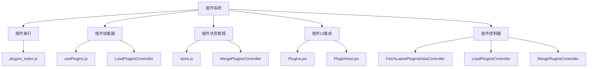
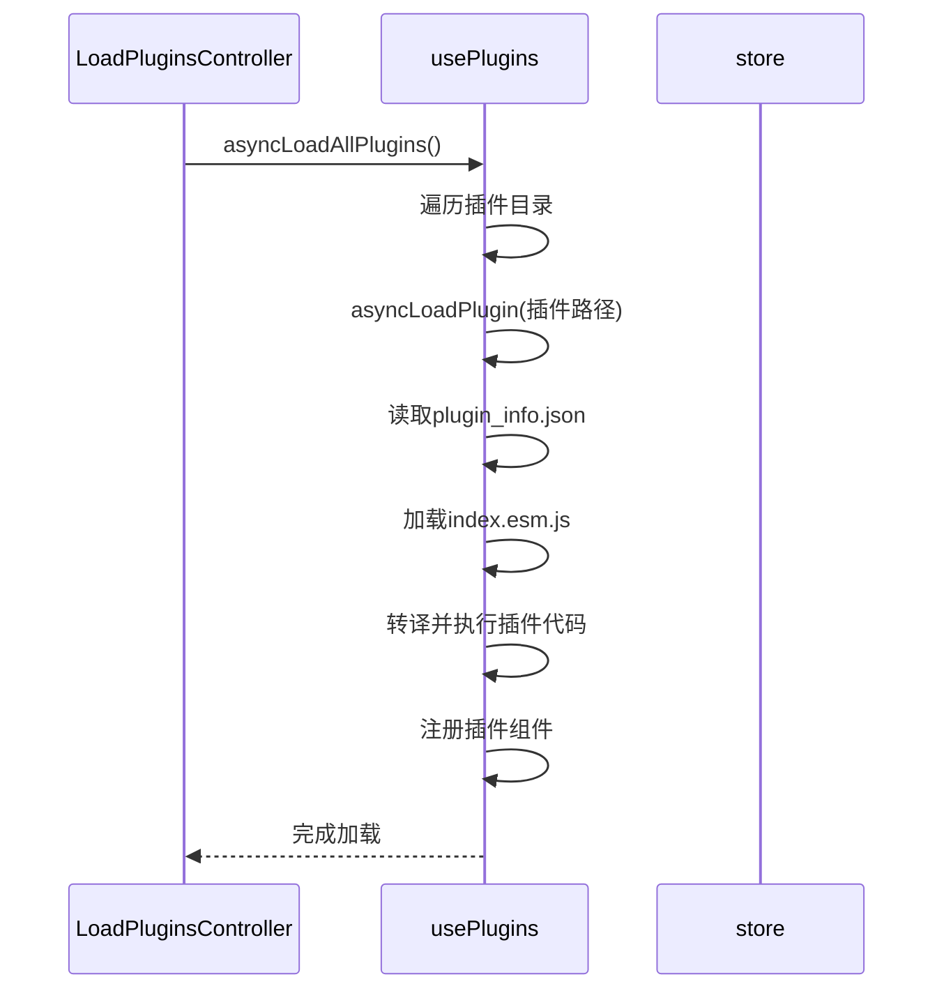
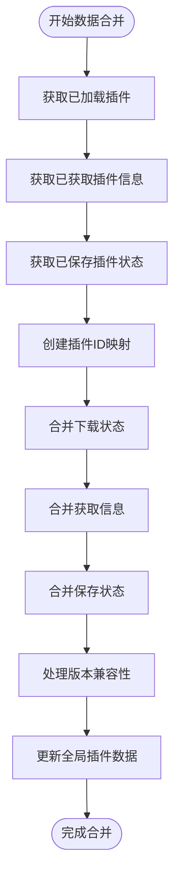
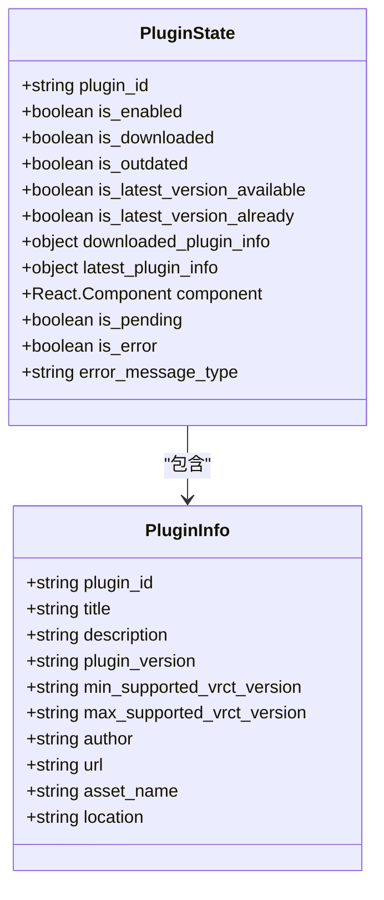
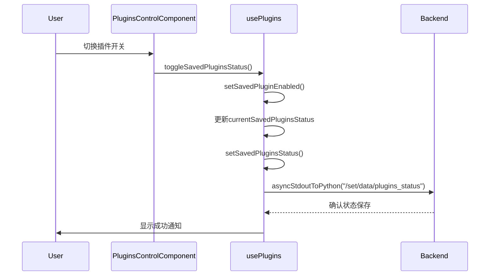
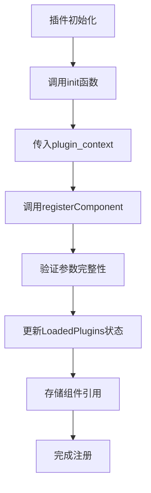
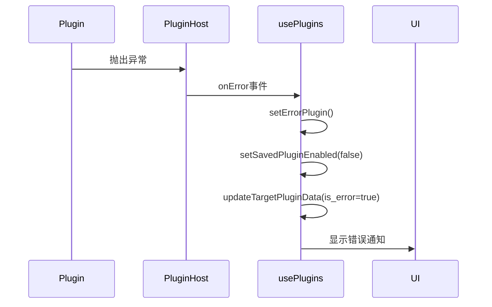
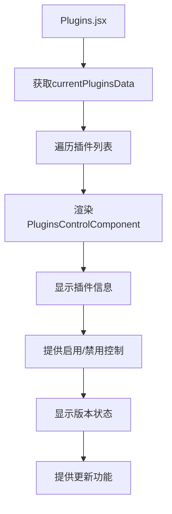
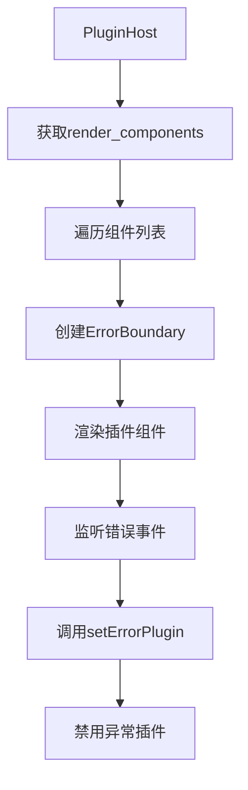

# 前端插件集成

<cite>
**本文档引用的文件**   
- [plugins_index.js](file://src-ui/plugins/plugins_index.js)
- [usePlugins.js](file://src-ui/logics/configs/config_page_setter/plugins/usePlugins.js)
- [LoadPluginsController.jsx](file://src-ui/views/app/_app_controllers/plugins_controllers/LoadPluginsController.jsx)
- [MergePluginsController.jsx](file://src-ui/views/app/_app_controllers/plugins_controllers/MergePluginsController.jsx)
- [FetchLatestPluginsDataController.jsx](file://src-ui/views/app/_app_controllers/plugins_controllers/FetchLatestPluginsDataController.jsx)
- [PluginsController.jsx](file://src-ui/views/app/_app_controllers/PluginsController.jsx)
- [Plugins.jsx](file://src-ui/views/app/config_page/setting_section/setting_box/plugins/Plugins.jsx)
- [PluginsControlComponent.jsx](file://src-ui/views/app/config_page/setting_section/setting_box/plugins/plugins_control_component/PluginsControlComponent.jsx)
- [PluginHost.jsx](file://src-ui/views/app/main_page/main_section/PluginHost.jsx)
- [store.js](file://src-ui/logics/store.js)
</cite>

## 目录
1. [引言](#引言)
2. [插件系统架构](#插件系统架构)
3. [核心组件分析](#核心组件分析)
4. [插件状态管理](#插件状态管理)
5. [插件配置UI注册机制](#插件配置ui注册机制)
6. [双向数据绑定实现](#双向数据绑定实现)
7. [插件扩展点设计原则](#插件扩展点设计原则)
8. [插件UI集成示例](#插件ui集成示例)
9. [结论](#结论)

## 引言
VRCT前端插件系统通过动态加载机制实现了灵活的插件集成与管理。该系统允许第三方开发者创建扩展功能，并将其无缝集成到主应用程序中。本文档详细说明了插件系统的实现原理，包括插件配置UI的注册机制、后端插件能力到前端组件的映射、双向数据绑定的实现方式，以及插件状态管理和配置持久化流程。

## 插件系统架构



**图示来源**
- [plugins_index.js](file://src-ui/plugins/plugins_index.js)
- [usePlugins.js](file://src-ui/logics/configs/config_page_setter/plugins/usePlugins.js)
- [LoadPluginsController.jsx](file://src-ui/views/app/_app_controllers/plugins_controllers/LoadPluginsController.jsx)
- [MergePluginsController.jsx](file://src-ui/views/app/_app_controllers/plugins_controllers/MergePluginsController.jsx)
- [FetchLatestPluginsDataController.jsx](file://src-ui/views/app/_app_controllers/plugins_controllers/FetchLatestPluginsDataController.jsx)

## 核心组件分析

### 插件索引机制
插件索引文件`plugins_index.js`定义了开发模式下的插件列表，为插件系统提供了入口点配置。该文件通过模块导出机制暴露开发插件数组，支持在开发环境中动态添加和管理插件。

**组件来源**
- [plugins_index.js](file://src-ui/plugins/plugins_index.js)

### 插件加载控制器
`LoadPluginsController`组件负责初始化插件加载流程。它通过`useEffect`钩子在应用启动时调用`asyncLoadAllPlugins`方法，确保插件系统在应用初始化阶段完成加载。该控制器利用全局状态`store.is_initialized_load_plugin`防止重复初始化。



**图示来源**
- [LoadPluginsController.jsx](file://src-ui/views/app/_app_controllers/plugins_controllers/LoadPluginsController.jsx)
- [usePlugins.js](file://src-ui/logics/configs/config_page_setter/plugins/usePlugins.js)

### 插件数据合并控制器
`MergePluginsController`组件负责整合插件的各种状态信息，包括已加载插件、已获取的插件信息和已保存的插件状态。该组件通过`useEffect`监听相关状态变化，自动执行数据合并操作，确保插件状态的一致性。



**图示来源**
- [MergePluginsController.jsx](file://src-ui/views/app/_app_controllers/plugins_controllers/MergePluginsController.jsx)
- [usePlugins.js](file://src-ui/logics/configs/config_page_setter/plugins/usePlugins.js)

## 插件状态管理

### 状态存储机制
插件状态管理基于Jotai状态管理库实现，通过`createAtomWithHook`工厂函数创建统一的状态管理接口。系统定义了四种核心插件状态原子：

- `Atom_FetchedPluginsInfo`: 存储从远程获取的插件信息
- `Atom_LoadedPlugins`: 存储已加载的插件及其组件引用
- `Atom_SavedPluginsStatus`: 存储用户保存的插件启用状态
- `Atom_PluginsData`: 存储合并后的最终插件数据



**图示来源**
- [store.js](file://src-ui/logics/store.js)
- [usePlugins.js](file://src-ui/logics/configs/config_page_setter/plugins/usePlugins.js)

### 状态持久化流程
插件启用/禁用状态通过`setSavedPluginsStatus`方法实现持久化。当用户更改插件状态时，系统会调用`asyncStdoutToPython`将状态变更发送到后端进行持久化存储。状态更新遵循以下流程：

1. 调用`setSavedPluginEnabled`设置目标插件状态
2. 更新`currentSavedPluginsStatus`状态
3. 调用`setSavedPluginsStatus`触发后端持久化
4. 显示状态变更通知



**图示来源**
- [usePlugins.js](file://src-ui/logics/configs/config_page_setter/plugins/usePlugins.js)
- [PluginsControlComponent.jsx](file://src-ui/views/app/config_page/setting_section/setting_box/plugins/plugins_control_component/PluginsControlComponent.jsx)

## 插件配置UI注册机制

### 插件上下文生成
插件系统通过`generatePluginContext`函数为每个插件创建独立的运行上下文。该上下文包含插件注册、状态管理、业务逻辑访问等关键功能：

```javascript
const generatePluginContext = (downloaded_plugin_info) => {
    return {
        registerComponent: (component) => { /* 注册插件UI组件 */ },
        createAtomWithHook: (...args) => createAtomWithHook(...args),
        logics: { /* 访问核心业务逻辑 */ },
        i18n: i18n, /* 国际化支持 */
    };
}
```

**组件来源**
- [usePlugins.js](file://src-ui/logics/configs/config_page_setter/plugins/usePlugins.js)

### 插件组件注册
插件通过`registerComponent`方法将其UI组件注册到系统中。注册过程将插件ID、位置信息和组件引用存储在`LoadedPlugins`状态中，供后续UI集成使用。



**图示来源**
- [usePlugins.js](file://src-ui/logics/configs/config_page_setter/plugins/usePlugins.js)

## 双向数据绑定实现

### 插件数据更新机制
系统通过`updateTargetPluginData`方法实现插件数据的双向绑定。该方法允许在运行时动态更新插件的任意属性值，确保UI与状态的同步。

```javascript
const updateTargetPluginData = (target_plugin_id, attribute, value) => {
    updatePluginsData(prev => {
        prev.data.forEach(plugin => {
            if (plugin.plugin_id === target_plugin_id) {
                plugin[attribute] = value;
            }
        });
        return prev.data;
    });
}
```

**组件来源**
- [usePlugins.js](file://src-ui/logics/configs/config_page_setter/plugins/usePlugins.js)

### 错误处理与反馈
系统实现了完善的错误处理机制，当插件出现异常时会自动禁用并通知用户。`setErrorPlugin`方法负责处理插件错误，更新插件状态并显示错误通知。



**图示来源**
- [usePlugins.js](file://src-ui/logics/configs/config_page_setter/plugins/usePlugins.js)
- [PluginHost.jsx](file://src-ui/views/app/main_page/main_section/PluginHost.jsx)

## 插件扩展点设计原则

### 新配置项添加
添加新的插件配置项需要遵循以下原则：
1. 在插件的`plugin_info.json`中定义配置元数据
2. 通过`registerComponent`注册对应的UI组件
3. 使用`createAtomWithHook`创建独立的状态管理
4. 通过`logics`访问核心业务逻辑

### 验证规则实现
插件应实现自身的输入验证规则，可以通过以下方式：
1. 在UI组件中实现表单验证
2. 使用自定义hook进行数据验证
3. 通过`useNotificationStatus`显示验证结果

### 交互反馈设计
插件应提供清晰的用户交互反馈：
1. 使用`showNotification_Success`和`showNotification_Error`显示操作结果
2. 通过`handlePendingPlugin`管理操作中的加载状态
3. 实现错误边界防止插件异常影响主应用

## 插件UI集成示例

### 主配置页面集成
`Plugins.jsx`组件负责在主配置页面中展示插件管理界面。该组件从`currentPluginsData`状态中获取插件列表，并为每个插件渲染对应的控制组件。



**图示来源**
- [Plugins.jsx](file://src-ui/views/app/config_page/setting_section/setting_box/plugins/Plugins.jsx)
- [PluginsControlComponent.jsx](file://src-ui/views/app/config_page/setting_section/setting_box/plugins/plugins_control_component/PluginsControlComponent.jsx)

### 运行时插件宿主
`PluginHost`组件作为运行时插件的宿主容器，负责渲染已启用插件的UI组件。该组件使用React Error Boundary确保插件异常不会影响主应用稳定性。



**图示来源**
- [PluginHost.jsx](file://src-ui/views/app/main_page/main_section/PluginHost.jsx)

## 结论
VRCT前端插件系统通过模块化的架构设计实现了灵活的插件集成与管理。系统采用动态加载机制，将后端插件能力映射到前端组件，并通过Jotai状态管理库实现双向数据绑定。插件状态管理、启用/禁用控制和配置持久化流程设计完善，确保了插件系统的稳定性和可靠性。前端插件扩展点的设计原则清晰，支持开发者轻松添加新的配置项、验证规则和交互反馈，使插件UI能够无缝融入主配置页面。