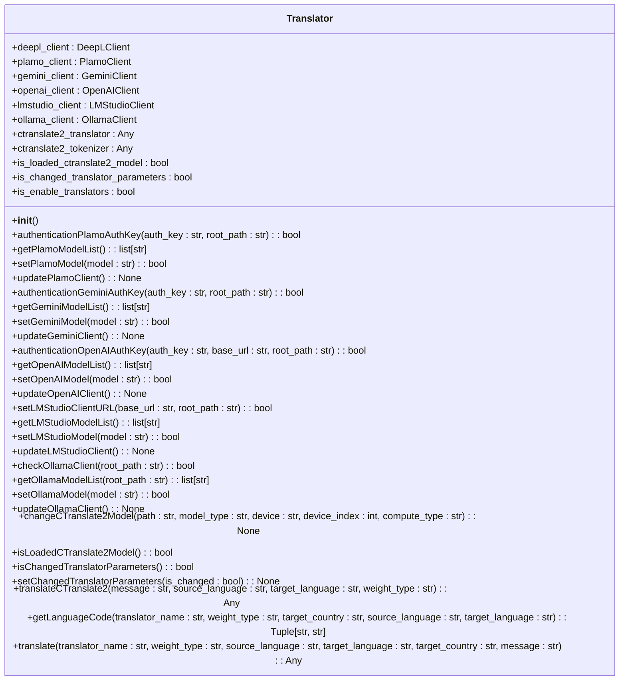
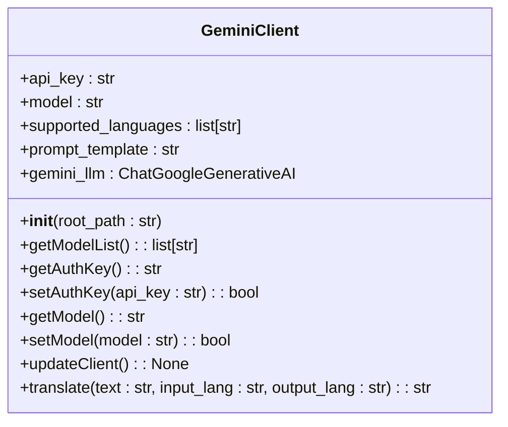
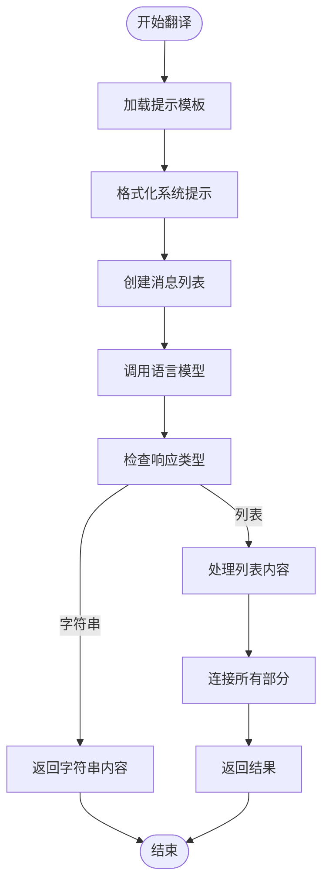
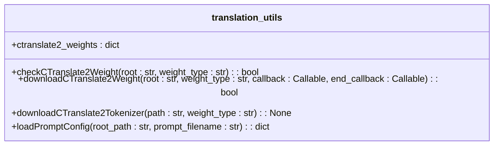
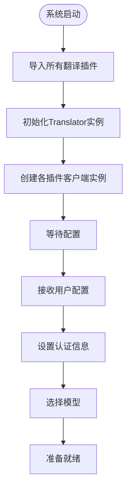
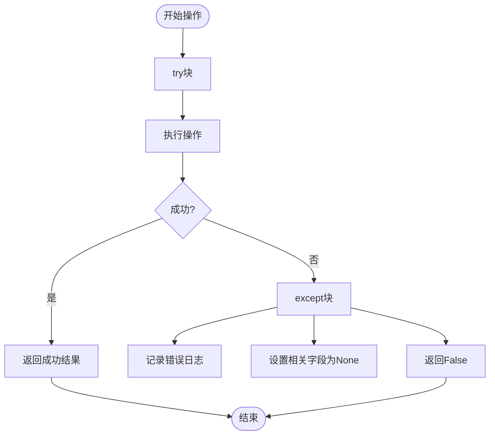
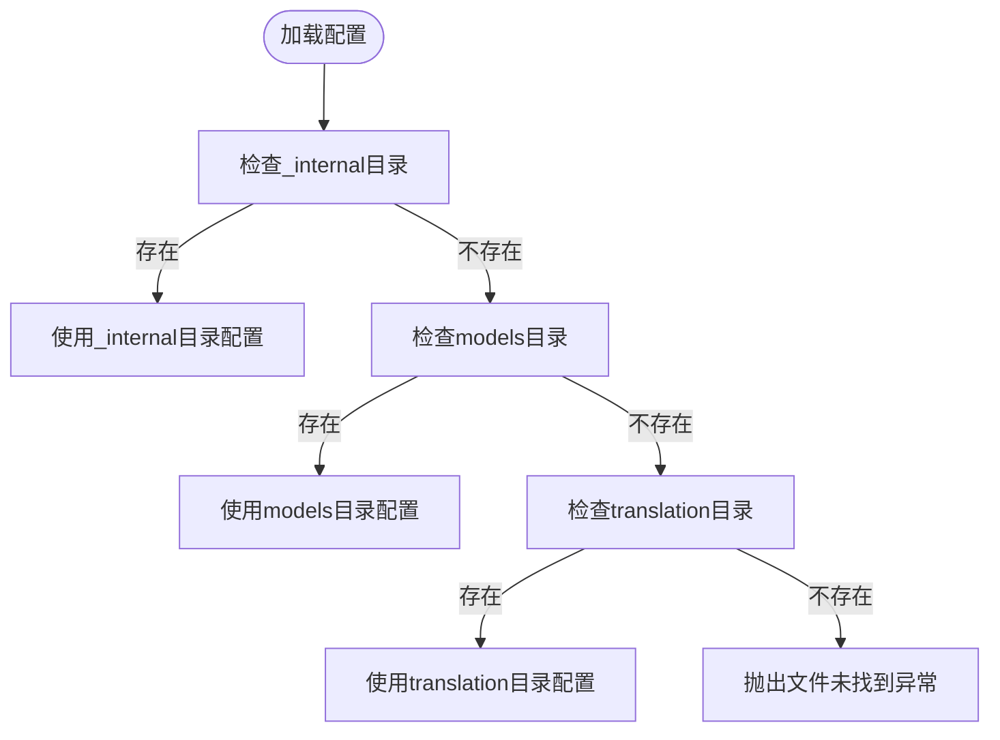

# 后端插件架构

<cite>
**本文档引用的文件**  
- [translation_translator.py](file://src-python/models/translation/translation_translator.py)
- [translation_utils.py](file://src-python/models/translation/translation_utils.py)
- [translation_gemini.py](file://src-python/models/translation/translation_gemini.py)
- [translation_openai.py](file://src-python/models/translation/translation_openai.py)
- [translation_ollama.py](file://src-python/models/translation/translation_ollama.py)
- [translation_plamo.py](file://src-python/models/translation/translation_plamo.py)
- [translation_lmstudio.py](file://src-python/models/translation/translation_lmstudio.py)
- [translation_languages.py](file://src-python/models/translation/translation_languages.py)
- [prompt/translation_gemini.yml](file://src-python/models/translation/prompt/translation_gemini.yml)
- [prompt/translation_openai.yml](file://src-python/models/translation/prompt/translation_openai.yml)
- [model.py](file://src-python/model.py)
- [controller.py](file://src-python/controller.py)
</cite>

## 目录
1. [引言](#引言)
2. [翻译引擎抽象层设计](#翻译引擎抽象层设计)
3. [具体翻译插件实现](#具体翻译插件实现)
4. [工具函数与共享逻辑](#工具函数与共享逻辑)
5. [插件注册与动态加载机制](#插件注册与动态加载机制)
6. [错误处理与重试机制](#错误处理与重试机制)
7. [配置加载与提示模板](#配置加载与提示模板)
8. [总结](#总结)

## 引言

VRCT后端插件架构采用模块化设计，通过抽象层统一管理多种翻译服务。该架构的核心是`translation_translator.py`中的`Translator`类，它作为外观模式（Facade）封装了多个后端翻译服务，包括DeepL、Gemini、Ollama、OpenAI等。这种设计实现了翻译服务的即插即用，使得系统可以灵活地支持不同的翻译API，同时保持接口的一致性。

**本文档引用的文件**  
- [translation_translator.py](file://src-python/models/translation/translation_translator.py)
- [translation_utils.py](file://src-python/models/translation/translation_utils.py)

## 翻译引擎抽象层设计

### Translator类结构

`Translator`类是整个翻译系统的中枢，它通过组合模式管理多个具体的翻译客户端实例。该类的设计遵循单一职责原则，每个实例负责管理特定翻译服务的生命周期和状态。



**Diagram sources**
- [translation_translator.py](file://src-python/models/translation/translation_translator.py#L39-L455)

**中文说明**：
- `Translator`类包含多个客户端字段，每个字段对应一种翻译服务
- 提供统一的认证、模型选择和翻译接口
- 通过`translate`方法实现多后端的统一调用

### 统一接口设计

`Translator`类为所有翻译服务提供了统一的接口，包括：
- 认证接口：`authentication*AuthKey`系列方法
- 模型管理接口：`get*ModelList`、`set*Model`、`update*Client`系列方法
- 翻译接口：`translate`方法

这种设计使得上层应用无需关心具体使用哪种翻译服务，只需调用统一的接口即可。

**Section sources**
- [translation_translator.py](file://src-python/models/translation/translation_translator.py#L39-L455)

## 具体翻译插件实现

### 插件基类设计

所有具体翻译插件都遵循相同的基类设计模式，以`GeminiClient`为例，其结构如下：



**Diagram sources**
- [translation_gemini.py](file://src-python/models/translation/translation_gemini.py#L54-L128)

### 插件实现模式

所有翻译插件都遵循相同的实现模式：

1. **初始化**：在`__init__`方法中加载配置和初始化状态
2. **认证**：通过`setAuthKey`方法验证API密钥
3. **模型管理**：提供模型列表获取和设置功能
4. **翻译执行**：实现`translate`方法完成实际翻译

以Gemini插件为例，其初始化过程如下：
- 从YAML文件加载提示模板
- 设置支持的语言列表
- 初始化客户端状态

**Section sources**
- [translation_gemini.py](file://src-python/models/translation/translation_gemini.py#L54-L128)
- [translation_openai.py](file://src-python/models/translation/translation_openai.py#L62-L140)
- [translation_ollama.py](file://src-python/models/translation/translation_ollama.py#L42-L112)

### 请求封装与响应解析

各插件在请求封装和响应解析方面保持一致的处理逻辑：



**Diagram sources**
- [translation_gemini.py](file://src-python/models/translation/translation_gemini.py#L94-L116)
- [translation_openai.py](file://src-python/models/translation/translation_openai.py#L107-L128)
- [translation_ollama.py](file://src-python/models/translation/translation_ollama.py#L81-L102)

**中文说明**：
- 所有插件都使用相同的响应处理逻辑
- 支持字符串和列表两种响应格式
- 自动连接多部分响应内容

## 工具函数与共享逻辑

### 共享工具函数

`translation_utils.py`文件提供了多个共享工具函数，这些函数被所有翻译插件复用：



**Diagram sources**
- [translation_utils.py](file://src-python/models/translation/translation_utils.py#L1-L139)

### 共享逻辑提取

通过分析代码，可以发现以下共享逻辑被提取为公共函数：

1. **权重管理**：`checkCTranslate2Weight`和`downloadCTranslate2Weight`用于管理CTranslate2模型权重
2. **分词器管理**：`downloadCTranslate2Tokenizer`用于下载和管理分词器
3. **配置加载**：`loadPromptConfig`用于加载YAML格式的提示配置

这些共享函数的提取避免了代码重复，提高了维护性。

**Section sources**
- [translation_utils.py](file://src-python/models/translation/translation_utils.py#L1-L139)

## 插件注册与动态加载机制

### 插件发现机制

系统通过`translation_translator.py`中的导入语句实现插件的自动发现和注册：

```python
from .translation_plamo import PlamoClient
from .translation_gemini import GeminiClient
from .translation_openai import OpenAIClient
from .translation_lmstudio import LMStudioClient
from .translation_ollama import OllamaClient
```

这种设计使得新插件只需在指定目录下创建相应的Python文件并导出客户端类，即可被系统自动发现和使用。

### 动态加载流程

插件的动态加载流程如下：



**Diagram sources**
- [translation_translator.py](file://src-python/models/translation/translation_translator.py#L11-L27)
- [translation_translator.py](file://src-python/models/translation/translation_translator.py#L48-L57)

### 独立性与可维护性

各插件通过以下方式保证独立性和可维护性：

1. **独立的配置文件**：每个插件有独立的YAML配置文件
2. **独立的客户端类**：每个插件实现独立的客户端类
3. **统一的接口规范**：所有插件遵循相同的接口规范
4. **共享的工具函数**：复用`translation_utils.py`中的工具函数

这种设计使得插件可以独立开发、测试和部署，互不影响。

**Section sources**
- [translation_translator.py](file://src-python/models/translation/translation_translator.py#L11-L27)
- [translation_utils.py](file://src-python/models/translation/translation_utils.py#L1-L139)

## 错误处理与重试机制

### 错误处理策略

系统采用防御性编程风格，对所有可能的异常进行捕获和处理：



**Diagram sources**
- [translation_translator.py](file://src-python/models/translation/translation_translator.py#L67-L75)
- [translation_gemini.py](file://src-python/models/translation/translation_gemini.py#L22-L27)

### 重试机制

系统在多个层面实现了重试机制：

1. **软件更新重试**：在`controller.py`中，更新操作最多尝试5次
2. **HTTP请求重试**：在`translation_utils.py`中，下载操作会自动重试
3. **翻译操作重试**：在`model.py`中，翻译操作会重试直到成功或超时

以软件更新为例，其重试机制如下：
```python
for _ in range(5):
    try:
        # 执行更新操作
        break
    except Exception:
        errorLogging()
```

**Section sources**
- [controller.py](file://src-python/controller.py#L539-L554)
- [translation_utils.py](file://src-python/models/translation/translation_utils.py#L69-L82)

## 配置加载与提示模板

### 配置加载机制

系统通过`loadPromptConfig`函数实现灵活的配置加载：



**Diagram sources**
- [translation_utils.py](file://src-python/models/translation/translation_utils.py#L104-L115)

### 提示模板设计

各插件使用YAML文件存储提示模板，以Gemini为例：

```yaml
system_prompt: |
  You are a helpful translation assistant.
  Supported languages:
  {supported_languages}

  Translate the user provided text from {input_lang} to {output_lang}.
  Return ONLY the translated text. Do not add quotes or extra commentary.
```

这种设计使得提示模板可以独立于代码进行修改和优化，提高了灵活性。

**Section sources**
- [translation_utils.py](file://src-python/models/translation/translation_utils.py#L104-L115)
- [prompt/translation_gemini.yml](file://src-python/models/translation/prompt/translation_gemini.yml)
- [prompt/translation_openai.yml](file://src-python/models/translation/prompt/translation_openai.yml)

## 总结

VRCT后端插件架构通过精心设计的抽象层和模块化结构，实现了翻译服务的灵活扩展和统一管理。核心设计要点包括：

1. **抽象层设计**：`Translator`类作为外观模式，统一管理多个翻译服务
2. **插件化架构**：各翻译服务作为独立插件实现，遵循统一接口规范
3. **共享逻辑提取**：通过`translation_utils.py`提取公共工具函数
4. **动态加载机制**：通过Python导入机制实现插件的自动发现和注册
5. **错误处理策略**：采用防御性编程，确保系统稳定性
6. **配置灵活性**：使用YAML文件存储提示模板，支持独立配置

这种架构设计使得系统具有良好的可扩展性、可维护性和稳定性，为支持更多翻译服务奠定了坚实的基础。

**Section sources**
- [translation_translator.py](file://src-python/models/translation/translation_translator.py#L39-L455)
- [translation_utils.py](file://src-python/models/translation/translation_utils.py#L1-L139)
- [translation_gemini.py](file://src-python/models/translation/translation_gemini.py#L54-L128)
- [translation_openai.py](file://src-python/models/translation/translation_openai.py#L62-L140)
- [translation_ollama.py](file://src-python/models/translation/translation_ollama.py#L42-L112)
- [translation_plamo.py](file://src-python/models/translation/translation_plamo.py#L40-L115)
- [translation_lmstudio.py](file://src-python/models/translation/translation_lmstudio.py#L42-L118)
- [translation_languages.py](file://src-python/models/translation/translation_languages.py#L1-L144)
- [model.py](file://src-python/model.py)
- [controller.py](file://src-python/controller.py)