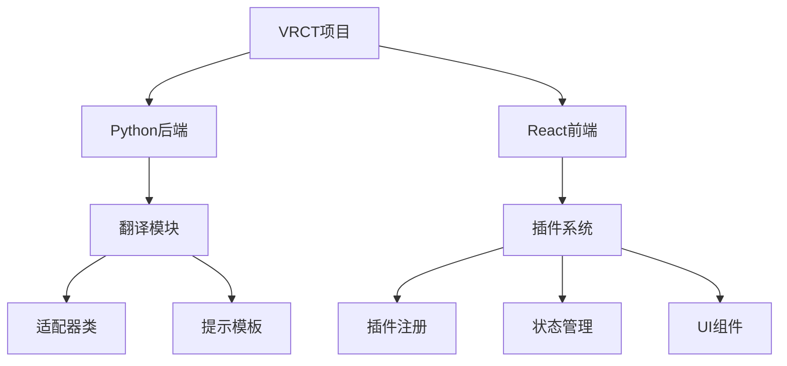
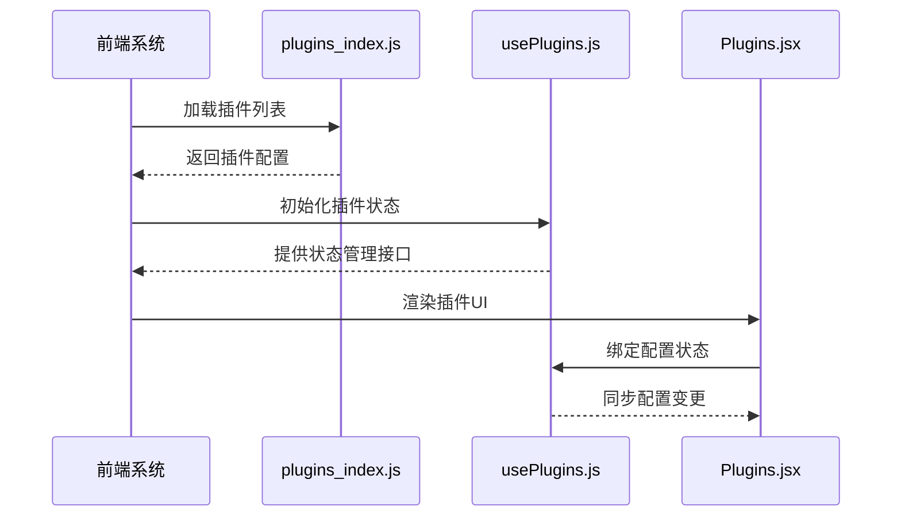
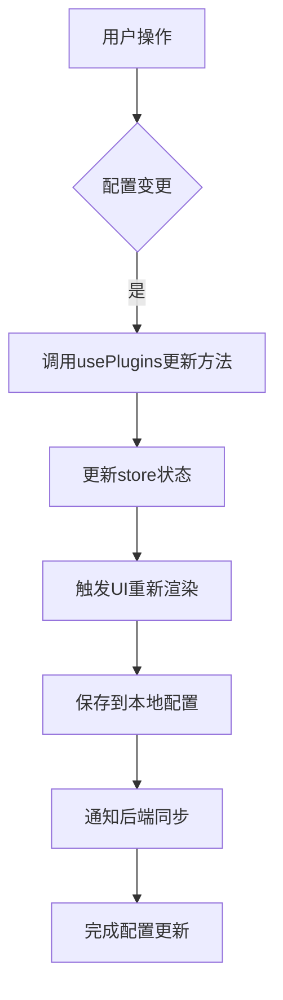
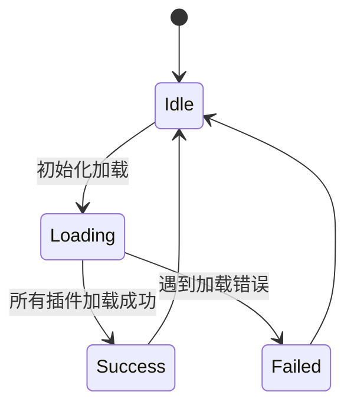

# 插件开发指南

<cite>
**本文档引用的文件**  
- [translation_gemini.py](file://src-python/models/translation/translation_gemini.py)
- [translation_gemini.yml](file://src-python/models/translation/prompt/translation_gemini.yml)
- [plugins_index.js](file://src-ui/plugins/plugins_index.js)
- [usePlugins.js](file://src-ui/logics/configs/config_page_setter/plugins/usePlugins.js)
- [Plugins.jsx](file://src-ui/views/app/config_page/setting_section/setting_box/plugins/Plugins.jsx)
- [LoadPluginsController.jsx](file://src-ui/views/app/_app_controllers/plugins_controllers/LoadPluginsController.jsx)
</cite>

## 目录

1. [简介](#简介)
2. [项目结构概览](#项目结构概览)
3. [后端插件开发](#后端插件开发)
4. [前端插件集成](#前端插件集成)
5. [配置管理与状态控制](#配置管理与状态控制)
6. [插件注册与加载机制](#插件注册与加载机制)
7. [测试与调试](#测试与调试)
8. [兼容性验证](#兼容性验证)
9. [总结](#总结)

## 简介

本指南旨在为VRCT（Virtual Reality Chat Translator）项目提供完整的插件开发实战教程，重点演示如何创建一个新的翻译引擎插件。通过以`translation_gemini.py`为模板的开发流程，逐步介绍从后端适配器类的创建、API接口定义、配置参数设置、错误处理机制，到前端UI组件注册、状态管理及可视化控件添加的全流程。同时涵盖本地测试、日志调试和兼容性验证等关键环节，确保新插件能够正确加载并与系统其他组件协同工作。

## 项目结构概览

VRCT项目采用前后端分离架构，主要分为Python后端逻辑和React前端界面两大部分。核心翻译功能位于`src-python/models/translation/`目录下，包含多个翻译服务适配器（如Gemini、OpenAI、Ollama等），每个适配器对应一个Python文件和一个YAML提示模板。前端插件系统位于`src-ui/`目录，通过插件控制器和配置管理逻辑实现动态加载与状态同步。

**Diagram sources**
- [translation_gemini.py](file://src-python/models/translation/translation_gemini.py)
- [plugins_index.js](file://src-ui/plugins/plugins_index.js)

## 后端插件开发

创建新的翻译引擎插件首先需要在`src-python/models/translation/`目录下基于现有适配器（如`translation_gemini.py`）创建新的Python类文件。该类需继承自基础翻译器类，并实现以下核心功能：

1. **API接口定义**：声明与目标翻译服务通信的HTTP端点、请求方法和数据格式
2. **配置参数**：定义必要的认证密钥、模型选择、区域设置等可配置项
3. **错误处理逻辑**：实现网络异常、认证失败、配额超限等常见错误的捕获与处理
4. **文本处理流程**：包括输入预处理、API调用、响应解析和输出后处理

同时，在`prompt/`子目录下创建对应的YAML提示模板文件（如`translation_newengine.yml`），用于定义翻译请求的系统提示词、上下文格式和输出要求。

**Section sources**
- [translation_gemini.py](file://src-python/models/translation/translation_gemini.py)
- [translation_gemini.yml](file://src-python/models/translation/prompt/translation_gemini.yml)

## 前端插件集成

前端插件集成涉及三个关键文件的修改与创建：

1. **插件注册**：在`src-ui/plugins/plugins_index.js`中添加新插件的入口路径声明
2. **状态管理**：利用`usePlugins.js`中的状态管理钩子来存储和访问插件配置
3. **UI组件**：在`Plugins.jsx`中添加可视化控件以供用户配置插件参数

插件注册采用数组形式声明，支持开发模式下的插件注入。UI组件通过React组件树渲染，并与全局状态系统连接以实现配置的持久化。

**Diagram sources**
- [plugins_index.js](file://src-ui/plugins/plugins_index.js)
- [usePlugins.js](file://src-ui/logics/configs/config_page_setter/plugins/usePlugins.js)
- [Plugins.jsx](file://src-ui/views/app/config_page/setting_section/setting_box/plugins/Plugins.jsx)

## 配置管理与状态控制

插件配置状态由`usePlugins.js`统一管理，该文件位于`src-ui/logics/configs/config_page_setter/plugins/`目录下。它提供了一系列异步方法用于加载、保存和更新插件配置，确保配置数据在前端界面与后端服务之间保持一致。

状态管理采用React Hooks模式，通过`useState`和`useEffect`实现响应式更新。配置数据存储于全局`store`对象中，支持跨组件共享和持久化存储。

**Section sources**
- [usePlugins.js](file://src-ui/logics/configs/config_page_setter/plugins/usePlugins.js)
- [store.js](file://src-ui/logics/store.js)

## 插件注册与加载机制

插件的加载由`LoadPluginsController.jsx`控制器管理，该组件位于`src-ui/views/app/_app_controllers/plugins_controllers/`目录下。它在应用初始化时自动执行`asyncLoadAllPlugins()`方法，遍历所有注册插件并加载其配置。

加载过程包括：
1. 检查插件是否已初始化
2. 异步加载所有插件配置
3. 将加载状态写入全局store
4. 处理可能的加载异常

这种设计确保了插件系统的可扩展性和容错能力。

**Section sources**
- [LoadPluginsController.jsx](file://src-ui/views/app/_app_controllers/plugins_controllers/LoadPluginsController.jsx)
- [usePlugins.js](file://src-ui/logics/configs/config_page_setter/plugins/usePlugins.js)

## 测试与调试

本地测试新插件时应遵循以下步骤：

1. **启用开发模式**：确保`plugins_index.js`中包含新插件的开发入口
2. **启动日志输出**：通过`useStdoutToPython.js`监控后端Python进程的日志
3. **验证API连接**：使用Postman或curl测试翻译API的基本连通性
4. **前端调试**：利用React DevTools检查组件状态和props传递
5. **错误注入测试**：模拟网络中断、无效密钥等异常场景验证错误处理逻辑

调试日志应包含详细的请求/响应信息、错误堆栈和时间戳，便于问题定位。

**Section sources**
- [plugins_index.js](file://src-ui/plugins/plugins_index.js)
- [useStdoutToPython.js](file://src-ui/logics/common/useStdoutToPython.js)

## 兼容性验证

为确保新插件与其他系统组件协同工作，需进行以下兼容性验证：

1. **配置系统兼容性**：验证插件配置能否正确保存和读取
2. **多插件共存测试**：与其他翻译插件同时启用，检查资源竞争
3. **版本兼容性**：确保插件能在当前和向前兼容的VRCT版本中正常运行
4. **性能影响评估**：测量插件对系统资源（CPU、内存、网络）的影响
5. **国际化支持**：验证插件界面在不同语言环境下的显示正确性

可通过`UpdateModal.jsx`中的插件兼容性列表功能进行自动化检测。

**Section sources**
- [Plugins.jsx](file://src-ui/views/app/config_page/setting_section/setting_box/plugins/Plugins.jsx)
- [UpdateModal.jsx](file://src-ui/views/app/others/modal_controller/update_modal/UpdateModal.jsx)

## 总结

本指南详细阐述了VRCT项目中创建新翻译引擎插件的完整流程，涵盖了从后端适配器开发、前端UI集成到测试验证的各个环节。通过遵循此流程，开发者可以高效地扩展VRCT的功能，同时保证代码质量和系统稳定性。关键要点包括：基于现有模板快速开发、合理设计API接口与错误处理、正确集成前端状态管理、以及全面的测试验证。随着插件生态的不断完善，VRCT将能够支持更多翻译服务，为用户提供更丰富的选择。