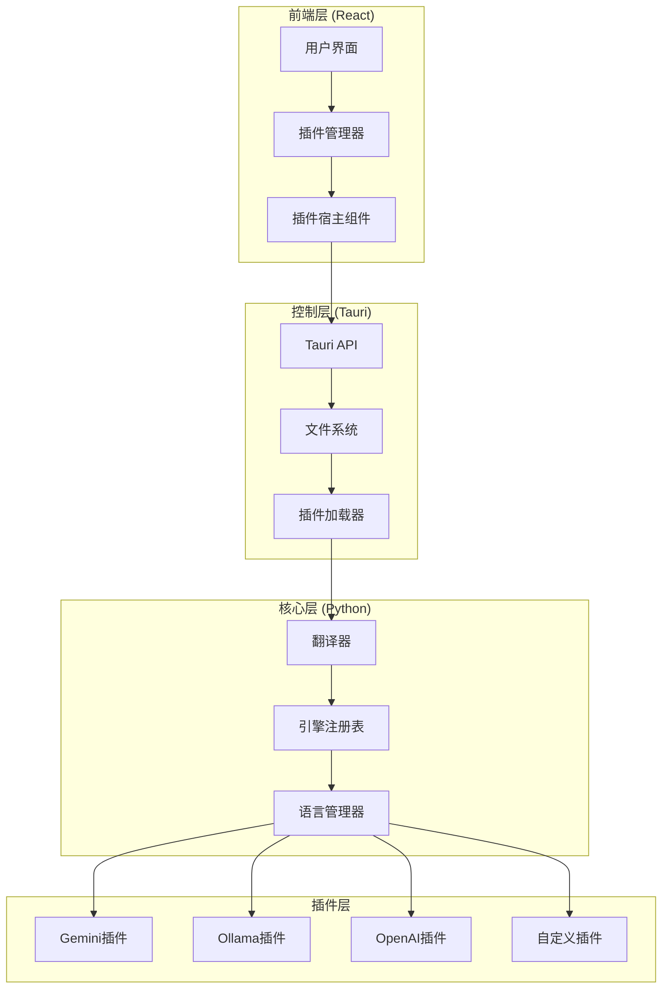
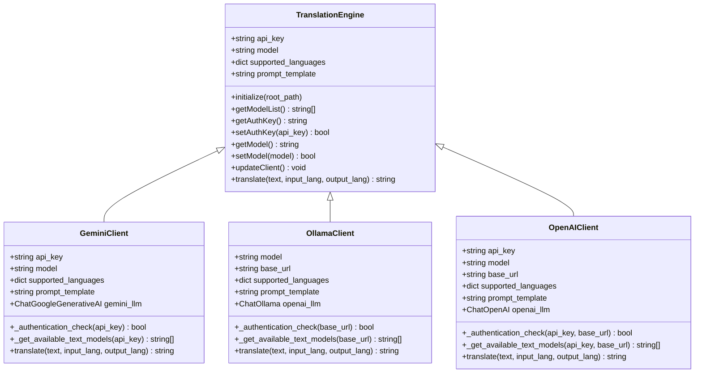
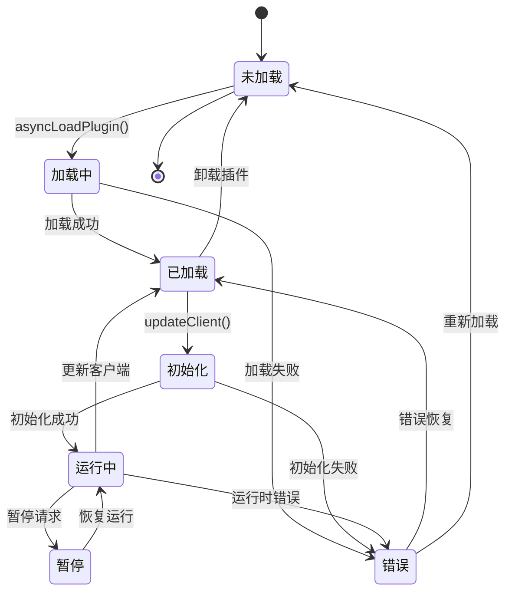
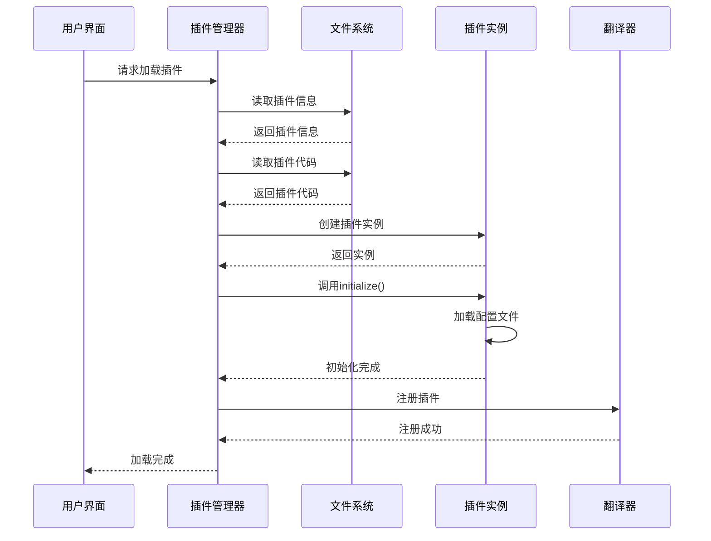
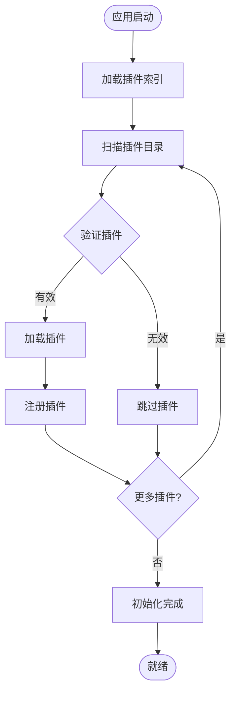
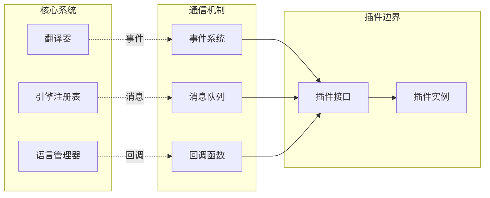
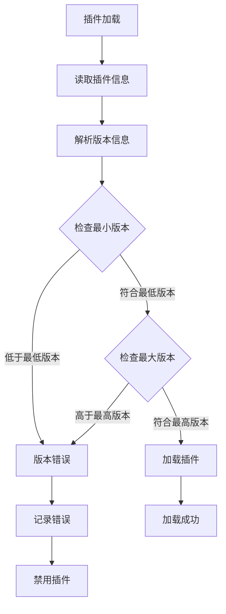

# VRCT插件系统开发指南

<cite>
**本文档中引用的文件**
- [translation_gemini.py](file://src-python/models/translation/translation_gemini.py)
- [translation_ollama.py](file://src-python/models/translation/translation_ollama.py)
- [translation_openai.py](file://src-python/models/translation/translation_openai.py)
- [translation_translator.py](file://src-python/models/translation/translation_translator.py)
- [translation_languages.py](file://src-python/models/translation/translation_languages.py)
- [translation_utils.py](file://src-python/models/translation/translation_utils.py)
- [plugins_index.js](file://src-ui/plugins/plugins_index.js)
- [model.py](file://src-python/model.py)
- [controller.py](file://src-python/controller.py)
- [usePlugins.js](file://src-ui/logics/configs/config_page_setter/plugins/usePlugins.js)
- [LoadPluginsController.jsx](file://src-ui/views/app/_app_controllers/plugins_controllers/LoadPluginsController.jsx)
- [PluginHost.jsx](file://src-ui/views/app/main_page/main_section/PluginHost.jsx)
- [vite.config.js](file://vite.config.js)
</cite>

## 目录
1. [简介](#简介)
2. [系统架构概览](#系统架构概览)
3. [翻译引擎插件接口规范](#翻译引擎插件接口规范)
4. [插件生命周期管理](#插件生命周期管理)
5. [前端插件管理系统](#前端插件管理系统)
6. [完整插件开发示例](#完整插件开发示例)
7. [设计原则与最佳实践](#设计原则与最佳实践)
8. [兼容性保证机制](#兼容性保证机制)
9. [故障排除指南](#故障排除指南)
10. [总结](#总结)

## 简介

VRCT插件系统是一个高度模块化的架构，专门设计用于支持多种翻译引擎的无缝集成。该系统采用松耦合设计，允许开发者轻松添加新的翻译服务，同时确保与现有功能的完全兼容性。

插件系统的核心价值在于：
- **可扩展性**：支持动态加载和卸载翻译引擎
- **标准化**：统一的接口规范确保一致性
- **兼容性**：向后兼容现有插件和配置
- **安全性**：完善的错误处理和隔离机制

## 系统架构概览

VRCT插件系统采用三层架构设计，实现了清晰的职责分离：



**图表来源**
- [model.py](file://src-python/model.py#L1-L200)
- [usePlugins.js](file://src-ui/logics/configs/config_page_setter/plugins/usePlugins.js#L1-L100)
- [PluginHost.jsx](file://src-ui/views/app/main_page/main_section/PluginHost.jsx#L1-L28)

**章节来源**
- [model.py](file://src-python/model.py#L1-L200)
- [translation_translator.py](file://src-python/models/translation/translation_translator.py#L1-L100)

## 翻译引擎插件接口规范

### 核心接口定义

所有翻译引擎插件必须遵循统一的接口规范，确保系统的一致性和可预测性。



**图表来源**
- [translation_gemini.py](file://src-python/models/translation/translation_gemini.py#L54-L118)
- [translation_ollama.py](file://src-python/models/translation/translation_ollama.py#L42-L112)
- [translation_openai.py](file://src-python/models/translation/translation_openai.py#L62-L140)

### 接口方法详解

#### 初始化方法
```python
def __init__(self, root_path: str = None):
    """
    插件初始化方法
    
    参数:
        root_path: 应用程序根路径，用于加载配置文件
    """
```

#### 认证管理方法
```python
def setAuthKey(self, api_key: str) -> bool:
    """
    设置认证密钥并验证有效性
    
    返回:
        bool: 认证是否成功
    """

def getAuthKey(self) -> str:
    """
    获取当前认证密钥
    
    返回:
        str: 当前认证密钥
    """
```

#### 模型管理方法
```python
def getModelList(self) -> list[str]:
    """
    获取可用模型列表
    
    返回:
        list[str]: 可用模型名称列表
    """

def setModel(self, model: str) -> bool:
    """
    设置使用的模型
    
    参数:
        model: 模型名称
        
    返回:
        bool: 设置是否成功
    """

def updateClient(self) -> None:
    """
    更新客户端实例
    """
```

#### 翻译执行方法
```python
def translate(self, text: str, input_lang: str, output_lang: str) -> str:
    """
    执行翻译任务
    
    参数:
        text: 待翻译文本
        input_lang: 输入语言
        output_lang: 输出语言
        
    返回:
        str: 翻译结果
    """
```

**章节来源**
- [translation_gemini.py](file://src-python/models/translation/translation_gemini.py#L54-L118)
- [translation_ollama.py](file://src-python/models/translation/translation_ollama.py#L42-L112)
- [translation_openai.py](file://src-python/models/translation/translation_openai.py#L62-L140)

## 插件生命周期管理

### 生命周期阶段

插件系统遵循严格的生命周期管理，确保资源的正确分配和释放。



### 生命周期管理实现

#### 插件加载流程


**图表来源**
- [usePlugins.js](file://src-ui/logics/configs/config_page_setter/plugins/usePlugins.js#L77-L120)
- [LoadPluginsController.jsx](file://src-ui/views/app/_app_controllers/plugins_controllers/LoadPluginsController.jsx#L1-L26)

**章节来源**
- [usePlugins.js](file://src-ui/logics/configs/config_page_setter/plugins/usePlugins.js#L77-L120)
- [LoadPluginsController.jsx](file://src-ui/views/app/_app_controllers/plugins_controllers/LoadPluginsController.jsx#L1-L26)

## 前端插件管理系统

### 插件索引系统

前端插件管理系统通过plugins_index.js实现插件的发现和加载。



**图表来源**
- [plugins_index.js](file://src-ui/plugins/plugins_index.js#L1-L3)
- [vite.config.js](file://vite.config.js#L98-L135)

### 插件配置管理

插件配置通过React Hooks系统实现响应式管理：

```javascript
// 插件状态管理
const usePlugins = () => {
    const [currentPluginsData, setCurrentPluginsData] = useState([]);
    const [currentSavedPluginsStatus, setCurrentSavedPluginsStatus] = useState([]);
    const [currentLoadedPlugins, setCurrentLoadedPlugins] = useState([]);
    
    // 插件操作函数
    const toggleSavedPluginsStatus = (plugin_id) => {
        // 切换插件启用状态
    };
    
    const downloadAndExtractPlugin = async (plugin_info) => {
        // 下载并提取插件
    };
    
    return {
        currentPluginsData,
        currentSavedPluginsStatus,
        currentLoadedPlugins,
        toggleSavedPluginsStatus,
        downloadAndExtractPlugin,
        // ... 其他插件管理函数
    };
};
```

**章节来源**
- [usePlugins.js](file://src-ui/logics/configs/config_page_setter/plugins/usePlugins.js#L58-L380)
- [plugins_index.js](file://src-ui/plugins/plugins_index.js#L1-L3)

## 完整插件开发示例

### 步骤1：创建插件基础结构

首先，创建插件的基本目录结构：

```
plugins/
├── my_custom_translator/
│   ├── plugin_info.json
│   ├── index.esm.js
│   ├── main.css
│   ├── plugin_configs.js
│   └── assets/
```

### 步骤2：编写插件信息文件

创建plugin_info.json文件定义插件基本信息：

```json
{
    "plugin_id": "my_custom_translator",
    "plugin_name": "自定义翻译器",
    "plugin_version": "1.0.0",
    "author": "开发者姓名",
    "description": "这是一个自定义翻译引擎插件示例",
    "min_supported_vrct_version": "2.0.0",
    "max_supported_vrct_version": "2.9.9",
    "dependencies": {
        "python": ["requests>=2.25.0"],
        "node": ["axios>=0.21.0"]
    }
}
```

### 步骤3：实现插件逻辑

创建index.esm.js文件实现插件核心逻辑：

```javascript
// 插件上下文
const pluginContext = {
    // 插件配置
    configs: {
        endpoint: "https://api.custom-translator.com/v1/translate",
        timeout: 30000,
        max_retries: 3
    },
    
    // 翻译函数
    translate: async (text, sourceLang, targetLang) => {
        try {
            const response = await axios.post(this.configs.endpoint, {
                text: text,
                source_language: sourceLang,
                target_language: targetLang,
                api_key: this.authKey
            }, {
                timeout: this.configs.timeout,
                headers: {
                    'Content-Type': 'application/json',
                    'Authorization': `Bearer ${this.authKey}`
                }
            });
            
            return response.data.translated_text;
        } catch (error) {
            console.error('翻译请求失败:', error);
            throw new Error('翻译服务不可用');
        }
    },
    
    // 认证函数
    authenticate: async (apiKey) => {
        try {
            const response = await axios.get(`${this.configs.endpoint}/verify`, {
                params: { api_key: apiKey },
                timeout: 10000
            });
            return response.data.valid;
        } catch (error) {
            return false;
        }
    }
};

export default pluginContext;
```

### 步骤4：添加UI配置组件

创建插件配置界面：

```javascript
// 插件配置组件
const MyCustomTranslatorConfig = ({ pluginId, onSave }) => {
    const [apiKey, setApiKey] = useState('');
    const [endpoint, setEndpoint] = useState('https://api.custom-translator.com/v1');
    
    const handleSave = () => {
        onSave({
            api_key: apiKey,
            endpoint: endpoint
        });
    };
    
    return (
        <div className="custom-translator-config">
            <h3>自定义翻译器设置</h3>
            <div className="form-group">
                <label>API密钥:</label>
                <input 
                    type="text" 
                    value={apiKey} 
                    onChange={(e) => setApiKey(e.target.value)}
                />
            </div>
            <div className="form-group">
                <label>API端点:</label>
                <input 
                    type="text" 
                    value={endpoint} 
                    onChange={(e) => setEndpoint(e.target.value)}
                />
            </div>
            <button onClick={handleSave}>保存设置</button>
        </div>
    );
};

export default MyCustomTranslatorConfig;
```

### 步骤5：语言支持配置

在languages.yml中添加插件支持的语言：

```yaml
MyCustomTranslator:
  source:
    English: "en"
    Japanese: "ja"
    Chinese: "zh"
    Korean: "ko"
  target:
    English: "en"
    Japanese: "ja"
    Chinese: "zh"
    Korean: "ko"
```

**章节来源**
- [usePlugins.js](file://src-ui/logics/configs/config_page_setter/plugins/usePlugins.js#L77-L120)
- [PluginHost.jsx](file://src-ui/views/app/main_page/main_section/PluginHost.jsx#L1-L28)

## 设计原则与最佳实践

### 松耦合设计原则

VRCT插件系统严格遵循松耦合设计原则：



**图表来源**
- [translation_translator.py](file://src-python/models/translation/translation_translator.py#L38-L60)
- [model.py](file://src-python/model.py#L118-L120)

### 可扩展性设计

#### 接口抽象层
系统通过抽象基类确保所有插件实现一致的接口：

```python
class TranslationEngine:
    """翻译引擎抽象基类"""
    
    def __init__(self, root_path: str = None):
        self.api_key = None
        self.model = None
        self.supported_languages = {}
        self.prompt_template = ""
    
    def initialize(self, root_path: str = None):
        """初始化插件配置"""
        pass
    
    def get_model_list(self) -> list[str]:
        """获取可用模型列表"""
        return []
    
    def authenticate(self, api_key: str) -> bool:
        """验证API密钥"""
        return False
    
    def translate(self, text: str, input_lang: str, output_lang: str) -> str:
        """执行翻译"""
        return ""
```

#### 动态加载机制
插件系统支持运行时动态加载和卸载：

```javascript
// 动态加载插件
const asyncLoadPlugin = async (pluginFolderRelativePath) => {
    try {
        // 读取插件信息
        const pluginInfoJson = await readTextFile(
            `${pluginFolderRelativePath}/plugin_info.json`,
            { baseDir: BaseDirectory.Resource }
        );
        
        const pluginInfo = JSON.parse(pluginInfoJson);
        
        // 验证版本兼容性
        if (!this.isVersionCompatible(pluginInfo)) {
            throw new Error('版本不兼容');
        }
        
        // 加载插件代码
        const pluginCode = await readTextFile(
            `${pluginFolderRelativePath}/index.esm.js`,
            { baseDir: BaseDirectory.Resource }
        );
        
        // 创建插件上下文
        const pluginContext = this.createPluginContext(pluginInfo, pluginCode);
        
        return pluginContext;
    } catch (error) {
        console.error('插件加载失败:', error);
        throw error;
    }
};
```

### 错误处理与隔离

#### 错误边界机制
前端使用React Error Boundary确保插件错误不会影响整个应用：

```javascript
const PluginHost = ({ renderComponents }) => {
    return (
        <ErrorBoundary
            fallbackRender={() => null}
            onError={(error, info) => {
                // 记录错误并禁用插件
                setErrorPlugin(pluginId, "disabled_due_to_error");
            }}
        >
            {renderComponents.map((plugin, index) => {
                const PluginComponent = plugin.component;
                return PluginComponent ? <PluginComponent /> : null;
            })}
        </ErrorBoundary>
    );
};
```

#### Python异常处理
后端使用装饰器模式处理插件异常：

```python
def safe_plugin_operation(func):
    """插件操作安全装饰器"""
    def wrapper(*args, **kwargs):
        try:
            return func(*args, **kwargs)
        except Exception as e:
            logger.error(f"插件操作失败: {e}")
            return None
    return wrapper

class Translator:
    @safe_plugin_operation
    def translate(self, translator_name, source_language, target_language, message):
        # 翻译逻辑
        pass
```

**章节来源**
- [translation_translator.py](file://src-python/models/translation/translation_translator.py#L38-L60)
- [PluginHost.jsx](file://src-ui/views/app/main_page/main_section/PluginHost.jsx#L1-L28)

## 兼容性保证机制

### 版本兼容性检查

插件系统实现了严格的版本兼容性检查机制：



**图表来源**
- [usePlugins.js](file://src-ui/logics/configs/config_page_setter/plugins/usePlugins.js#L77-L120)

### 向后兼容性策略

#### API演进策略
- **渐进式弃用**: 旧API标记为废弃但继续工作
- **自动迁移**: 提供配置迁移工具
- **双重支持**: 新旧API并存一段时间

#### 配置文件兼容性
```yaml
# 支持向后兼容的配置格式
version: 2.0
plugins:
  - id: "custom_translator"
    version: "1.0.0"
    # 旧格式支持
    api_key: "old_format_key"
    # 新格式推荐
    credentials:
      api_key: "new_format_key"
      endpoint: "https://api.example.com"
```

**章节来源**
- [usePlugins.js](file://src-ui/logics/configs/config_page_setter/plugins/usePlugins.js#L77-L120)

## 故障排除指南

### 常见问题诊断

#### 插件加载失败
**症状**: 插件无法正常加载或显示错误信息

**诊断步骤**:
1. 检查插件目录结构是否正确
2. 验证plugin_info.json格式是否正确
3. 确认插件版本与VRCT版本兼容
4. 检查网络连接和API访问权限

**解决方案**:
```javascript
// 检查插件状态
const checkPluginStatus = (pluginId) => {
    const plugin = currentPluginsData.find(p => p.plugin_id === pluginId);
    if (plugin.is_error) {
        console.error(`插件错误: ${plugin.error_message_type}`);
        console.log(`版本信息 - 插件: ${plugin.downloaded_plugin_info.plugin_version}, VRCT: ${vrctVersion}`);
    }
};
```

#### 翻译质量不佳
**症状**: 翻译结果不准确或格式异常

**诊断步骤**:
1. 检查源语言和目标语言配置
2. 验证模型选择是否合适
3. 确认API密钥有效性
4. 检查网络延迟和超时设置

**解决方案**:
```python
# 实现翻译质量监控
class TranslationQualityMonitor:
    def __init__(self):
        self.metrics = {}
    
    def track_translation(self, text, result, engine_name):
        quality_score = self.calculate_quality_score(text, result)
        self.metrics[engine_name] = {
            'quality_score': quality_score,
            'translation_time': time.time(),
            'error_rate': 0.0
        }
    
    def calculate_quality_score(self, original, translated):
        # 实现质量评估算法
        return 0.85  # 示例分数
```

#### 性能问题
**症状**: 翻译响应时间过长或系统卡顿

**诊断步骤**:
1. 检查系统资源使用情况
2. 监控网络带宽和延迟
3. 分析插件内存占用
4. 检查并发请求数限制

**解决方案**:
```javascript
// 实现性能监控
const performanceMonitor = {
    metrics: {},
    
    recordTranslationTime: (engine, duration) => {
        if (!this.metrics[engine]) {
            this.metrics[engine] = [];
        }
        this.metrics[engine].push(duration);
        
        // 维护最近100次记录
        if (this.metrics[engine].length > 100) {
            this.metrics[engine].shift();
        }
    },
    
    getAverageResponseTime: (engine) => {
        const times = this.metrics[engine];
        return times.reduce((sum, time) => sum + time, 0) / times.length;
    }
};
```

**章节来源**
- [usePlugins.js](file://src-ui/logics/configs/config_page_setter/plugins/usePlugins.js#L77-L120)
- [translation_translator.py](file://src-python/models/translation/translation_translator.py#L331-L441)

## 总结

VRCT插件系统通过精心设计的架构和严格的规范，为开发者提供了一个强大而灵活的扩展平台。系统的核心优势包括：

### 技术优势
- **模块化设计**: 清晰的职责分离和接口抽象
- **类型安全**: 强类型的Python实现和TypeScript前端
- **错误隔离**: 完善的错误处理和恢复机制
- **性能优化**: 异步加载和缓存机制

### 开发体验
- **标准化接口**: 统一的插件开发模板
- **调试友好**: 详细的日志记录和错误报告
- **热重载**: 开发过程中的实时更新支持
- **文档完善**: 丰富的API文档和示例代码

### 生态系统
- **社区支持**: 活跃的开发者社区
- **持续更新**: 定期的功能增强和bug修复
- **兼容性保证**: 向后兼容的版本策略

通过遵循本指南中的最佳实践和设计原则，开发者可以创建高质量、高性能的翻译引擎插件，为VRCT用户带来更好的使用体验。插件系统的开放性和可扩展性确保了VRCT能够适应不断变化的需求和技术发展。