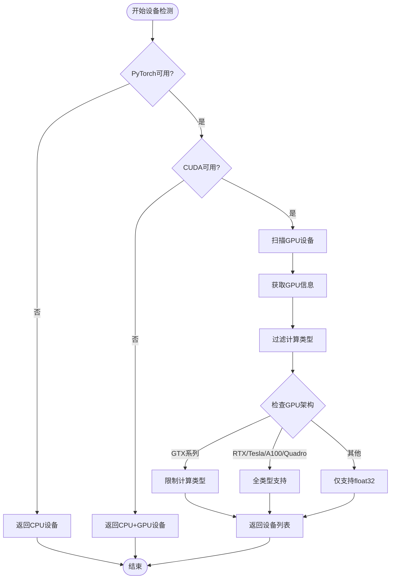
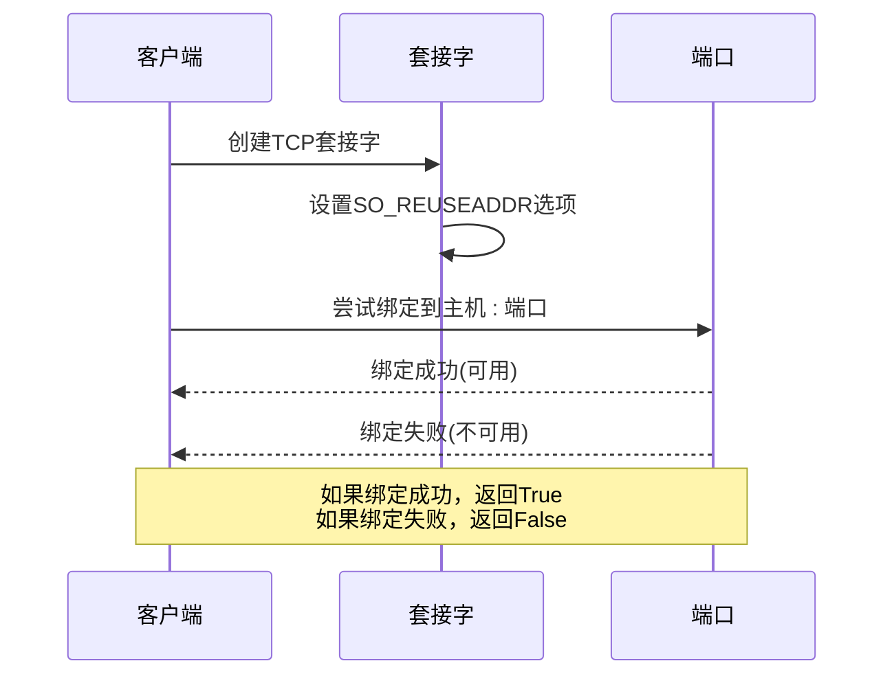
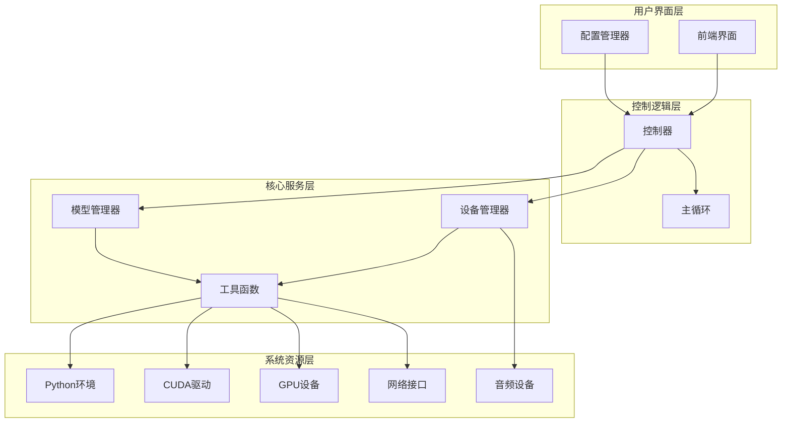
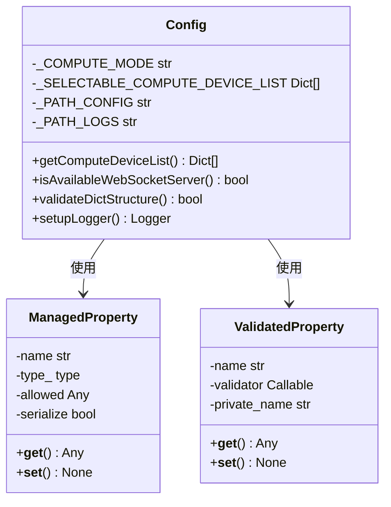
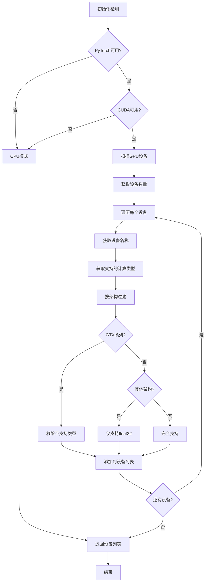
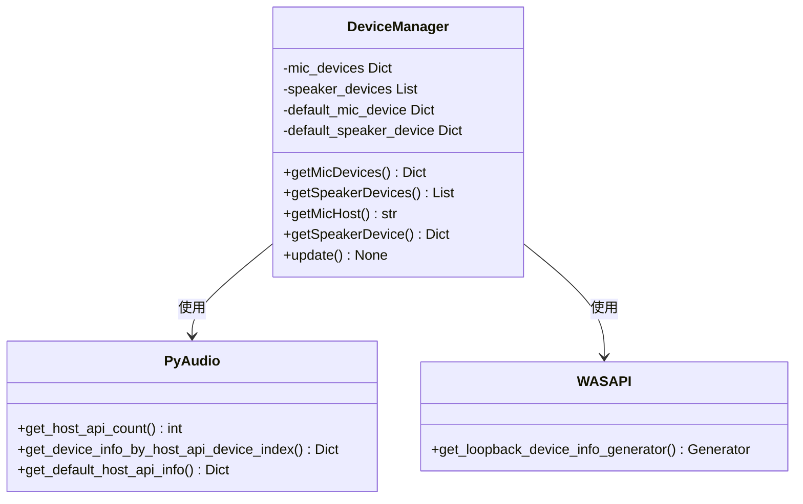
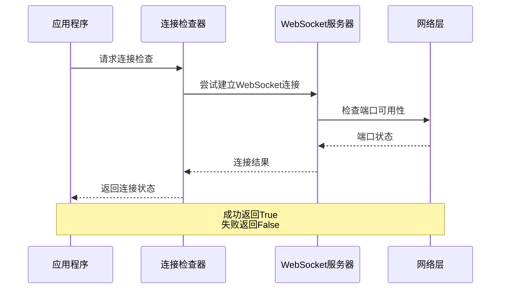
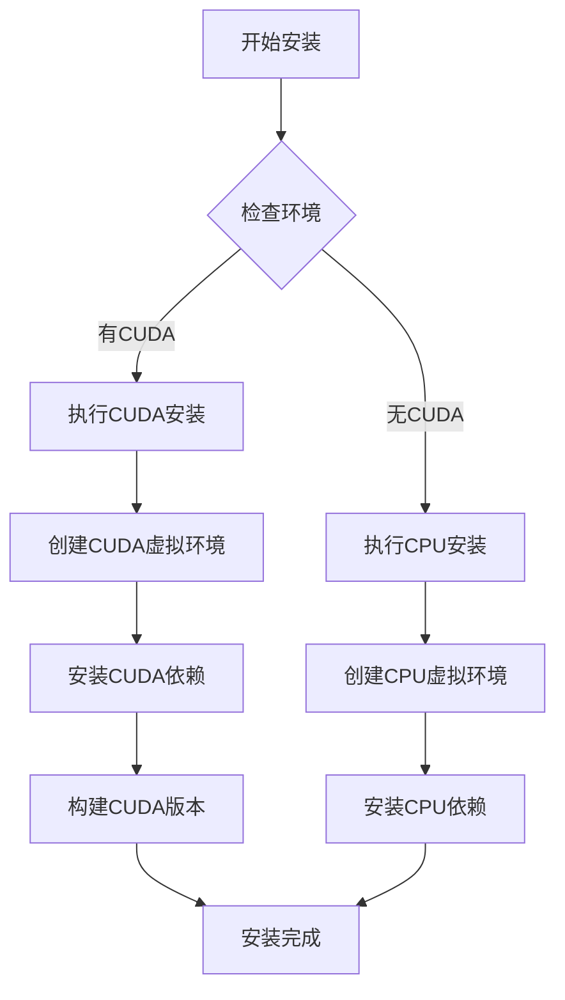
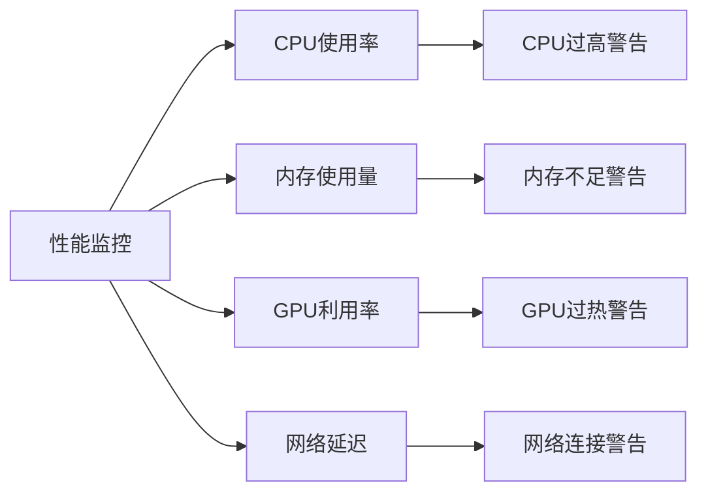

# 依赖与环境检查

<cite>
**本文档中引用的文件**
- [utils.py](file://src-python/utils.py)
- [requirements.txt](file://requirements.txt)
- [requirements_cuda.txt](file://requirements_cuda.txt)
- [install.bat](file://install.bat)
- [build_cuda.bat](file://build_cuda.bat)
- [config.py](file://src-python/config.py)
- [controller.py](file://src-python/controller.py)
- [mainloop.py](file://src-python/mainloop.py)
- [device_manager.py](file://src-python/device_manager.py)
- [model.py](file://src-python/model.py)
</cite>

## 目录
1. [简介](#简介)
2. [核心检查函数](#核心检查函数)
3. [环境检测架构](#环境检测架构)
4. [依赖库检查](#依赖库检查)
5. [硬件设备检测](#硬件设备检测)
6. [网络连接检查](#网络连接检查)
7. [安装脚本指南](#安装脚本指南)
8. [常见问题解决](#常见问题解决)
9. [故障排除指南](#故障排除指南)
10. [最佳实践建议](#最佳实践建议)

## 简介

VRCT是一个基于Python开发的实时语音翻译应用程序，需要复杂的依赖环境支持。本文档提供了全面的系统依赖和运行环境检查指南，帮助用户验证Python依赖库、CUDA驱动、GPU设备和网络端口的可用性，并指导如何根据环境条件选择合适的安装脚本。

该系统的核心功能依赖于多个关键组件：
- **Python环境**：支持Python 3.8+的完整运行时环境
- **深度学习框架**：PyTorch 2.7.0作为主要计算后端
- **硬件加速**：CUDA驱动和GPU设备支持
- **音频处理**：音频设备和麦克风支持
- **网络通信**：WebSocket服务器和OSC协议支持

## 核心检查函数

### 设备列表获取函数

系统通过`getComputeDeviceList()`函数提供全面的计算设备检测能力：



**图表来源**
- [utils.py](file://src-python/utils.py#L92-L132)

### WebSocket服务器可用性检查

`isAvailableWebSocketServer()`函数用于验证网络端口的可用性：



**图表来源**
- [utils.py](file://src-python/utils.py#L70-L82)

**节来源**
- [utils.py](file://src-python/utils.py#L70-L132)

## 环境检测架构

### 系统架构概览



**图表来源**
- [controller.py](file://src-python/controller.py#L1-L50)
- [device_manager.py](file://src-python/device_manager.py#L1-L100)
- [model.py](file://src-python/model.py#L1-L100)

### 配置管理系统

配置系统通过`Config`类实现环境检测和状态管理：



**图表来源**
- [config.py](file://src-python/config.py#L531-L770)

**节来源**
- [config.py](file://src-python/config.py#L531-L770)

## 依赖库检查

### Python依赖包清单

系统需要以下核心Python依赖包：

| 包名称 | 版本要求 | 功能描述 | 必需性 |
|--------|----------|----------|--------|
| torch | 2.7.0 | 深度学习框架，计算后端 | 必需 |
| ctranslate2 | 4.6.0 | 机器翻译引擎 | 必需 |
| transformers | 4.40.2 | Hugging Face模型支持 | 必需 |
| faster-whisper | 1.1.1 | 语音识别引擎 | 必需 |
| websockets | 15.0.1 | WebSocket通信 | 必需 |
| numpy | 1.26.4 | 数值计算基础 | 必需 |
| pillow | 10.0.0 | 图像处理 | 必需 |
| pyaudio | 0.2.12.6 | 音频输入输出 | 必需 |
| python-osc | 1.9.0 | OSC协议支持 | 必需 |

### CUDA版本特定依赖

对于CUDA支持的安装，额外需要：

| 包名称 | 版本要求 | 功能描述 | 必需性 |
|--------|----------|----------|--------|
| torch-cuda | 2.7.0+cu128 | CUDA版本的PyTorch | 可选 |

**节来源**
- [requirements.txt](file://requirements.txt#L1-L32)
- [requirements_cuda.txt](file://requirements_cuda.txt#L1-L33)

## 硬件设备检测

### GPU设备检测流程



**图表来源**
- [utils.py](file://src-python/utils.py#L107-L127)

### 设备架构支持矩阵

| GPU架构 | 支持的计算类型 | 性能等级 | 推荐用途 |
|---------|----------------|----------|----------|
| RTX系列 | int8_bfloat16, int8_float16, int8, bfloat16, float16, int8_float32, float32 | 高性能 | 实时翻译 |
| Tesla/A100 | int8_bfloat16, int8_float16, int8, bfloat16, float16, int8_float32, float32 | 高性能 | 大规模推理 |
| Quadro系列 | int8_bfloat16, int8_float16, int8, bfloat16, float16, int8_float32, float32 | 中高性能 | 专业应用 |
| GTX系列 | float32 | 标准性能 | 基础功能 |
| 其他 | float32 | 标准性能 | 基础功能 |

### 音频设备检测

系统通过`DeviceManager`类检测音频设备：



**图表来源**
- [device_manager.py](file://src-python/device_manager.py#L56-L200)

**节来源**
- [utils.py](file://src-python/utils.py#L92-L132)
- [device_manager.py](file://src-python/device_manager.py#L140-L200)

## 网络连接检查

### WebSocket连接验证

系统提供多层网络连接检查机制：



**图表来源**
- [controller.py](file://src-python/controller.py#L2796-L2846)

### 网络连通性测试

系统通过HTTP请求测试网络连通性：

| 测试目标 | URL | 超时时间 | 返回状态码 |
|----------|-----|----------|------------|
| Google连接 | http://www.google.com | 3秒 | 200 |
| 自定义地址 | 用户配置 | 可配置 | 200 |

**节来源**
- [utils.py](file://src-python/utils.py#L59-L68)
- [controller.py](file://src-python/controller.py#L2796-L2846)

## 安装脚本指南

### 安装脚本选择策略

系统提供两个主要安装脚本，根据环境需求自动选择：



**图表来源**
- [install.bat](file://install.bat#L1-L25)
- [build_cuda.bat](file://build_cuda.bat#L1-L2)

### 安装脚本详解

#### install.bat脚本功能

1. **清理旧环境**：删除现有的`.venv`和`.venv_cuda`目录
2. **创建虚拟环境**：分别创建CPU和CUDA专用虚拟环境
3. **安装依赖包**：分别安装CPU和CUDA版本的依赖包
4. **环境隔离**：确保不同环境间的依赖不会冲突

#### build_cuda.bat脚本功能

1. **激活CUDA环境**：激活`.venv_cuda`虚拟环境
2. **构建可执行文件**：使用PyInstaller构建CUDA优化版本
3. **路径配置**：指定输出路径为`src-tauri/bin`

### 依赖冲突解决方案

当遇到依赖冲突时，系统采用以下策略：

| 冲突类型 | 解决方案 | 实施方法 |
|----------|----------|----------|
| 版本冲突 | 使用虚拟环境隔离 | 分别创建CPU/CUDA环境 |
| 平台不兼容 | 条件导入 | 在代码中添加异常处理 |
| 资源竞争 | 设备优先级排序 | 根据GPU性能自动选择 |

**节来源**
- [install.bat](file://install.bat#L1-L25)
- [build_cuda.bat](file://build_cuda.bat#L1-L2)

## 常见问题解决

### CUDA相关问题

#### 问题1：CUDA驱动未正确安装

**症状**：`torch.cuda.is_available()`返回False

**解决方案**：
1. 检查NVIDIA驱动版本是否兼容
2. 验证CUDA Toolkit版本匹配
3. 确认GPU设备正常工作

#### 问题2：GPU内存不足

**症状**：出现"CUDA out of memory"错误

**解决方案**：
1. 降低批处理大小
2. 使用混合精度训练
3. 清理GPU缓存

### Python环境问题

#### 问题3：依赖包版本冲突

**症状**：导入模块时出现版本不兼容错误

**解决方案**：
1. 使用虚拟环境隔离
2. 升级pip到最新版本
3. 强制重新安装依赖

#### 问题4：权限问题

**症状**：无法写入配置文件或日志

**解决方案**：
1. 检查文件夹权限
2. 以管理员身份运行
3. 更改安装路径

### 网络连接问题

#### 问题5：WebSocket连接失败

**症状**：无法建立WebSocket连接

**解决方案**：
1. 检查防火墙设置
2. 验证端口是否被占用
3. 确认网络连接状态

## 故障排除指南

### 环境诊断命令

```bash
# 检查Python版本
python --version

# 检查PyTorch CUDA支持
python -c "import torch; print(torch.cuda.is_available())"

# 检查GPU信息
python -c "import torch; print(torch.cuda.get_device_name(0))"

# 检查依赖完整性
pip list | grep torch
pip list | grep ctranslate2
```

### 日志分析

系统提供详细的日志记录功能：

| 日志级别 | 文件位置 | 记录内容 |
|----------|----------|----------|
| 错误日志 | error.log | 异常堆栈跟踪 |
| 进程日志 | process.log | 系统运行状态 |
| 调试日志 | debug.log | 详细调试信息 |

### 性能监控

系统内置性能监控功能：



**节来源**
- [utils.py](file://src-python/utils.py#L224-L292)

## 最佳实践建议

### 环境配置建议

1. **推荐硬件配置**：
   - CPU：Intel i5或AMD Ryzen 5以上
   - 内存：8GB RAM或更多
   - GPU：NVIDIA GTX 1060或更新型号
   - 存储：SSD硬盘至少20GB可用空间

2. **软件环境要求**：
   - Windows 10/11 64位系统
   - Python 3.8或更高版本
   - NVIDIA驱动程序最新版本
   - Visual C++ Redistributable

3. **网络配置**：
   - 开放必要的端口范围
   - 配置防火墙规则
   - 确保稳定的网络连接

### 安装最佳实践

1. **分步安装**：
   - 首先安装CPU版本进行基本功能测试
   - 确认系统稳定后再安装CUDA版本
   - 验证GPU加速功能正常

2. **环境隔离**：
   - 为不同用途创建独立的虚拟环境
   - 定期更新依赖包版本
   - 备份重要的配置文件

3. **性能优化**：
   - 根据实际硬件选择最优的计算类型
   - 合理配置批处理大小
   - 监控系统资源使用情况

### 维护和更新

1. **定期维护**：
   - 检查系统日志文件
   - 清理临时文件和缓存
   - 更新驱动程序和固件

2. **版本升级**：
   - 关注官方发布的新版本
   - 测试新版本的功能兼容性
   - 备份当前配置以防回滚

3. **故障预防**：
   - 建立监控告警机制
   - 定期备份重要数据
   - 制定应急响应计划

通过遵循这些最佳实践，用户可以确保VRCT系统的稳定运行和最佳性能表现。系统提供的自动化检查功能将帮助用户及时发现和解决潜在的问题。