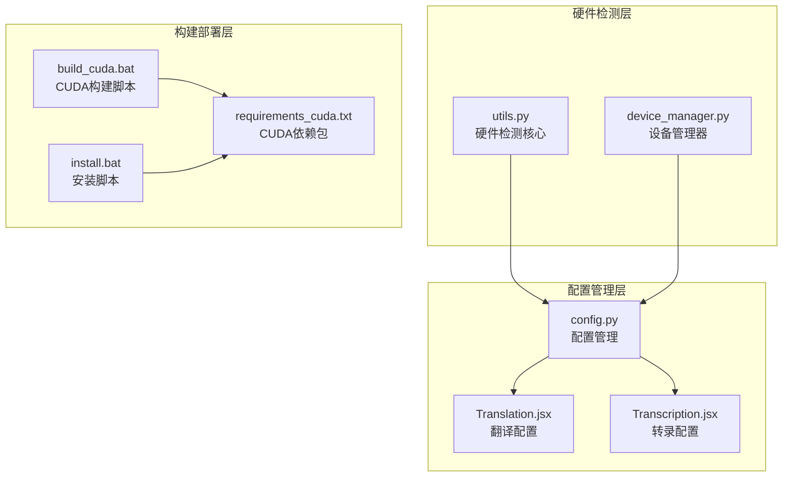
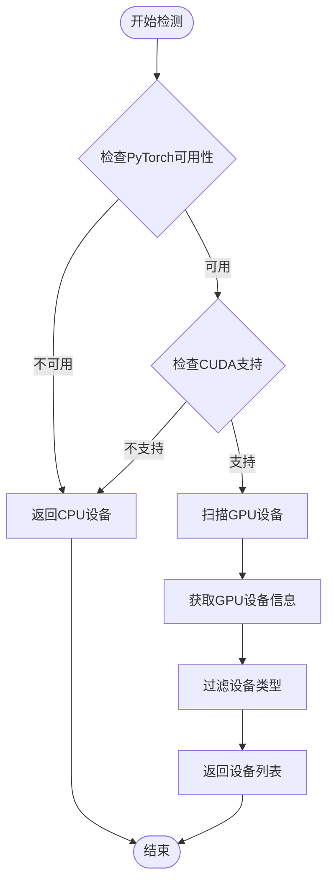
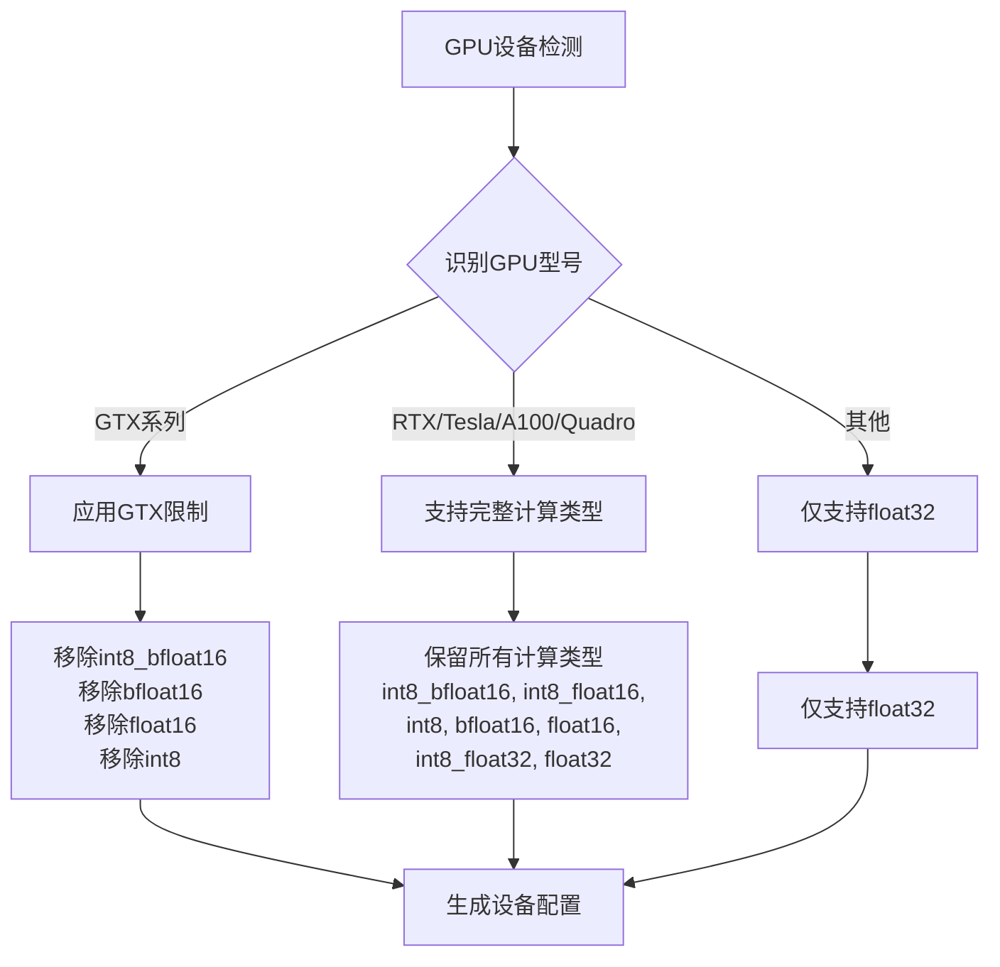
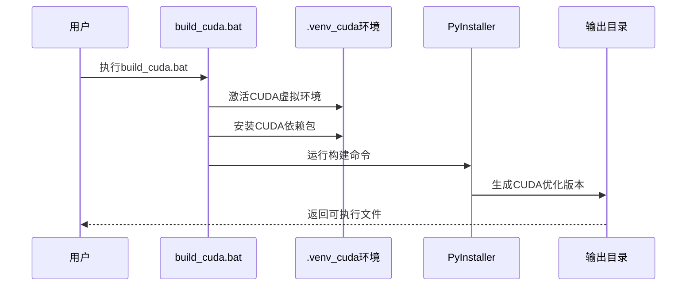
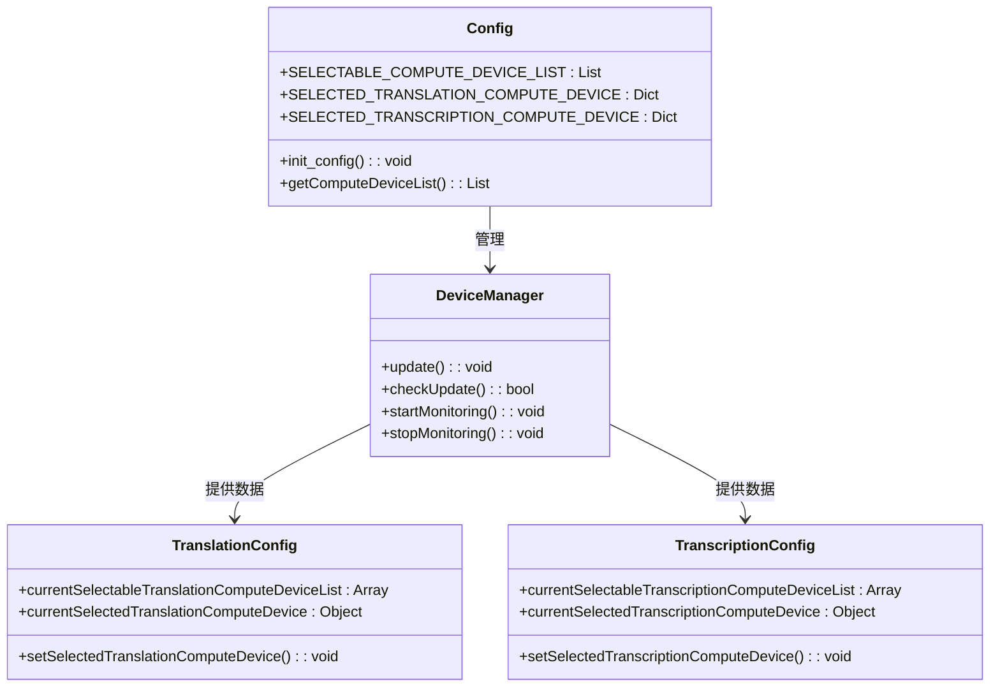

# 硬件依赖检查

<cite>
**本文档中引用的文件**
- [utils.py](file://src-python/utils.py)
- [device_manager.py](file://src-python/device_manager.py)
- [config.py](file://src-python/config.py)
- [build_cuda.bat](file://build_cuda.bat)
- [requirements_cuda.txt](file://requirements_cuda.txt)
- [install.bat](file://install.bat)
- [useUpdateSoftware.js](file://src-ui/logics/common/useUpdateSoftware.js)
- [Translation.jsx](file://src-ui/views/app/config_page/setting_section/setting_box/translation/Translation.jsx)
- [Transcription.jsx](file://src-ui/views/app/config_page/setting_section/setting_box/transcription/Transcription.jsx)
- [ComputeDevice.jsx](file://src-ui/views/app/config_page/setting_section/setting_box/_components/compute_device/ComputeDevice.jsx)
</cite>

## 目录
1. [简介](#简介)
2. [系统架构概览](#系统架构概览)
3. [GPU和CUDA检测机制](#gpu和cuda检测机制)
4. [设备兼容性筛选](#设备兼容性筛选)
5. [CUDA加速启用流程](#cuda加速启用流程)
6. [驱动程序验证](#驱动程序验证)
7. [配置管理](#配置管理)
8. [故障排除指南](#故障排除指南)
9. [总结](#总结)

## 简介

VRCT项目提供了完整的硬件依赖检查系统，专门用于检测和验证GPU计算设备的兼容性，特别是针对NVIDIA CUDA加速的支持。该系统通过多层次的检测机制确保应用程序能够在不同硬件配置下正常运行，并为用户提供最佳的性能优化建议。

## 系统架构概览

VRCT的硬件依赖检查系统采用模块化设计，主要包含以下核心组件：

**图表来源**
- [utils.py](file://src-python/utils.py#L92-L132)
- [device_manager.py](file://src-python/device_manager.py#L57-L122)
- [config.py](file://src-python/config.py#L531-L599)

## GPU和CUDA检测机制

### 核心检测函数

系统的核心检测功能由`getComputeDeviceList()`函数实现，该函数负责扫描所有可用的计算设备并返回详细的设备信息列表。

**图表来源**
- [utils.py](file://src-python/utils.py#L92-L132)

### 设备检测流程详解

1. **CPU设备检测**
   - 自动添加CPU作为默认计算设备
   - 获取CPU支持的计算类型
   - 支持"auto"模式自动选择最优类型

2. **GPU设备检测**
   - 检查PyTorch CUDA可用性
   - 扫描所有可用的GPU设备
   - 获取每个GPU的详细信息

3. **计算类型检测**
   - 使用`get_supported_compute_types()`获取支持的计算类型
   - 根据GPU架构自动筛选兼容的计算类型
   - 提供降级支持机制

**章节来源**
- [utils.py](file://src-python/utils.py#L92-L132)

## 设备兼容性筛选

### GPU架构识别与限制

系统根据不同的GPU架构实施精确的兼容性筛选策略：

**图表来源**
- [utils.py](file://src-python/utils.py#L114-L118)

### 计算类型优先级

系统为不同GPU架构定义了明确的计算类型优先级：

| GPU架构 | 优先计算类型 | 备注 |
|---------|-------------|------|
| GTX系列 | float32 | 由于架构限制，不支持高精度计算 |
| RTX系列 | int8_bfloat16, int8_float16, int8, bfloat16, float16, int8_float32, float32 | 支持所有计算类型 |
| Tesla/A100 | int8_bfloat16, int8_float16, int8, bfloat16, float16, int8_float32, float32 | 企业级GPU支持 |
| Quadro | int8_bfloat16, int8_float16, int8, bfloat16, float16, int8_float32, float32 | 专业图形卡支持 |

**章节来源**
- [utils.py](file://src-python/utils.py#L149-L167)

## CUDA加速启用流程

### 构建脚本配置

系统提供了专门的CUDA构建脚本来简化CUDA加速的启用过程：

**图表来源**
- [build_cuda.bat](file://build_cuda.bat#L1-L2)
- [install.bat](file://install.bat#L1-L25)

### 依赖包管理

CUDA版本的依赖包经过精心选择以确保最佳兼容性：

| 包名 | 版本 | 用途 |
|------|------|------|
| torch | 2.7.0 | PyTorch深度学习框架 |
| ctranslate2 | 4.6.0 | 高性能推理引擎 |
| transformers | 4.40.2 | 语言模型支持 |
| faster-whisper | 1.1.1 | 语音转录引擎 |

**章节来源**
- [requirements_cuda.txt](file://requirements_cuda.txt#L1-L33)

## 驱动程序验证

### NVIDIA驱动检测

系统通过多层验证确保NVIDIA驱动程序的正确安装：

1. **基础可用性检查**
   - 检查PyTorch CUDA模块
   - 验证`torch.cuda.is_available()`状态
   - 获取GPU设备数量

2. **详细设备信息**
   - 获取GPU名称和型号
   - 检测CUDA计算能力
   - 验证内存容量

3. **错误处理机制**
   - 异常捕获和日志记录
   - 降级到CPU模式
   - 用户友好的错误提示

**章节来源**
- [utils.py](file://src-python/utils.py#L108-L130)

## 配置管理

### 动态设备配置

系统实现了动态设备配置管理，允许用户在运行时切换计算设备：

**图表来源**
- [config.py](file://src-python/config.py#L599-L600)
- [Translation.jsx](file://src-ui/views/app/config_page/setting_section/setting_box/translation/Translation.jsx#L107-L206)
- [Transcription.jsx](file://src-ui/views/app/config_page/setting_section/setting_box/transcription/Transcription.jsx#L311-L358)

### 实时设备监控

设备管理器提供实时的设备变化监控功能：

- **COM事件监听**：Windows平台上的即时设备变化检测
- **轮询机制**：非Windows平台的设备状态轮询
- **回调通知**：设备变化时的通知机制

**章节来源**
- [device_manager.py](file://src-python/device_manager.py#L266-L306)

## 故障排除指南

### 常见问题及解决方案

1. **CUDA不可用**
   - 检查NVIDIA驱动程序版本
   - 验证CUDA Toolkit安装
   - 确认GPU支持CUDA

2. **设备检测失败**
   - 查看错误日志文件
   - 重启应用程序
   - 检查硬件连接

3. **性能问题**
   - 验证计算类型选择
   - 检查GPU内存使用
   - 调整批处理大小

### 日志分析

系统提供详细的日志记录功能，帮助诊断硬件相关问题：

- **进程日志** (`process.log`)：记录设备检测过程
- **错误日志** (`error.log`)：记录异常和错误信息
- **调试输出**：控制台实时反馈

**章节来源**
- [utils.py](file://src-python/utils.py#L227-L290)

## 总结

VRCT的硬件依赖检查系统提供了全面而精密的GPU和CUDA兼容性验证机制。通过多层次的检测、智能的设备筛选、动态的配置管理和完善的错误处理，系统确保了在各种硬件环境下的一致性和稳定性。

该系统的主要优势包括：

- **自动化检测**：无需手动配置即可识别可用的计算设备
- **智能筛选**：根据GPU架构自动选择最优的计算类型
- **降级支持**：在CUDA不可用时自动切换到CPU模式
- **实时监控**：动态响应设备变化
- **用户友好**：直观的配置界面和清晰的错误提示

通过这些特性，VRCT为用户提供了可靠且高性能的语音翻译和转录服务，无论是在高端工作站还是标准办公环境中都能发挥最佳性能。