# 软件依赖检查

<cite>
**本文档中引用的文件**
- [requirements.txt](file://requirements.txt)
- [requirements_cuda.txt](file://requirements_cuda.txt)
- [install.bat](file://install.bat)
- [src-python/utils.py](file://src-python/utils.py)
- [src-python/controller.py](file://src-python/controller.py)
- [src-python/device_manager.py](file://src-python/device_manager.py)
- [src-python/docs/details/watchdog.md](file://src-python/docs/details/watchdog.md)
- [src-python/docs/utils.md](file://src-python/docs/utils.md)
</cite>

## 目录
1. [简介](#简介)
2. [项目结构概览](#项目结构概览)
3. [核心依赖库](#核心依赖库)
4. [虚拟环境安装流程](#虚拟环境安装流程)
5. [网络连接性验证](#网络连接性验证)
6. [设备与计算类型检测](#设备与计算类型检测)
7. [错误处理与故障排除](#错误处理与故障排除)
8. [依赖管理最佳实践](#依赖管理最佳实践)
9. [故障排除指南](#故障排除指南)
10. [总结](#总结)

## 简介

VRCT项目是一个复杂的Python应用程序，需要多个AI和多媒体相关的依赖库才能正常运行。本指南详细说明了如何通过虚拟环境安装核心依赖库（如torch、faster-whisper、ctranslate2），并提供了完整的依赖验证流程，包括网络连接性检查、设备兼容性验证以及错误处理机制。

## 项目结构概览

VRCT项目采用模块化的架构设计，主要包含以下关键组件：

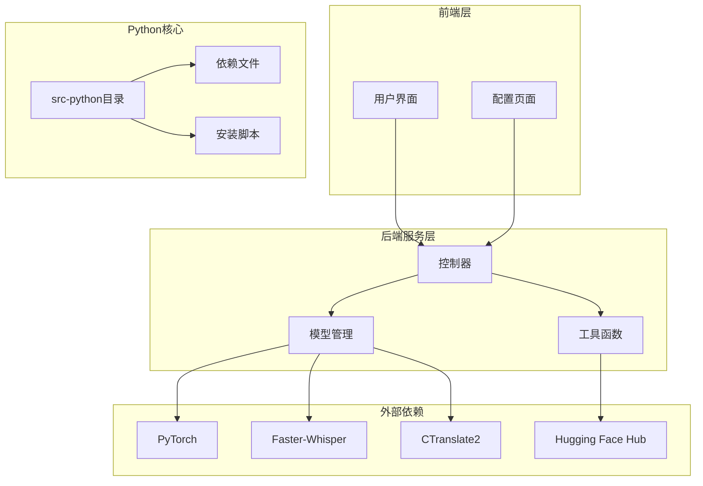

**图表来源**
- [src-python/controller.py](file://src-python/controller.py#L1-L50)
- [src-python/utils.py](file://src-python/utils.py#L1-L50)

**章节来源**
- [requirements.txt](file://requirements.txt#L1-L32)
- [requirements_cuda.txt](file://requirements_cuda.txt#L1-L33)

## 核心依赖库

### 主要依赖库列表

VRCT项目的核心依赖库分为两个主要版本：标准版本和CUDA版本。

#### 标准版本依赖（requirements.txt）

| 库名称 | 版本 | 用途 |
|--------|------|------|
| torch | 2.7.0 | 深度学习框架，支持CPU和GPU推理 |
| faster-whisper | 1.1.1 | 高速语音识别引擎 |
| ctranslate2 | 4.6.0 | 高效的神经机器翻译推理引擎 |
| transformers | 4.40.2 | 自然语言处理模型库 |
| pillow | 10.0.0 | 图像处理库 |
| PyAudioWPatch | 0.2.12.6 | 音频输入输出处理 |
| python-osc | 1.9.0 | 开放声音控制协议支持 |

#### CUDA版本依赖（requirements_cuda.txt）

CUDA版本额外包含了针对GPU优化的配置：

| 额外配置 | 说明 |
|----------|------|
| --extra-index-url | PyTorch官方CUDA仓库地址 |
| torch==2.7.0 | CUDA兼容的PyTorch版本 |

### 关键依赖库的功能说明

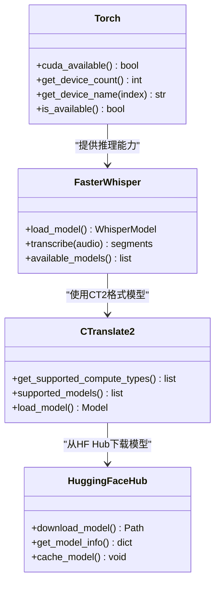

**图表来源**
- [src-python/utils.py](file://src-python/utils.py#L108-L132)
- [src-python/models/transcription/transcription_whisper.py](file://src-python/models/transcription/transcription_whisper.py#L23-L33)

**章节来源**
- [requirements.txt](file://requirements.txt#L1-L32)
- [requirements_cuda.txt](file://requirements_cuda.txt#L1-L33)

## 虚拟环境安装流程

### 安装脚本分析

项目提供了自动化的安装脚本，支持标准和CUDA两种环境的创建和配置。

#### 安装流程图

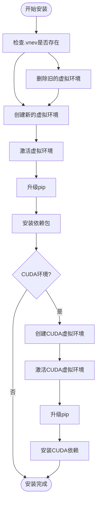

**图表来源**
- [install.bat](file://install.bat#L1-L25)

#### 安装步骤详解

1. **清理旧环境**
   - 删除现有的`.venv`目录
   - 删除现有的`.venv_cuda`目录（如果存在）

2. **创建标准环境**
   ```bash
   python -m venv .venv
   call .venv/Scripts/activate
   python.exe -m pip install --upgrade pip
   pip install --no-cache-dir --force-reinstall -r requirements.txt
   ```

3. **创建CUDA环境**（可选）
   ```bash
   python -m venv .venv_cuda
   call .venv_cuda/Scripts/activate
   python.exe -m pip install --upgrade pip
   pip install --no-cache-dir --force-reinstall -r requirements_cuda.txt
   ```

### 虚拟环境配置选项

| 配置项 | 标准环境 | CUDA环境 |
|--------|----------|----------|
| Python版本 | 任意兼容版本 | 任意兼容版本 |
| PyTorch配置 | CPU版本 | CUDA 12.8版本 |
| 缓存策略 | 启用缓存 | 禁用缓存 |
| 强制重装 | 是 | 是 |

**章节来源**
- [install.bat](file://install.bat#L1-L25)

## 网络连接性验证

### 网络检查机制

VRCT项目实现了多层次的网络连接性验证机制，确保能够从PyPI和GitHub成功下载必要的包和模型。

#### 网络检查函数

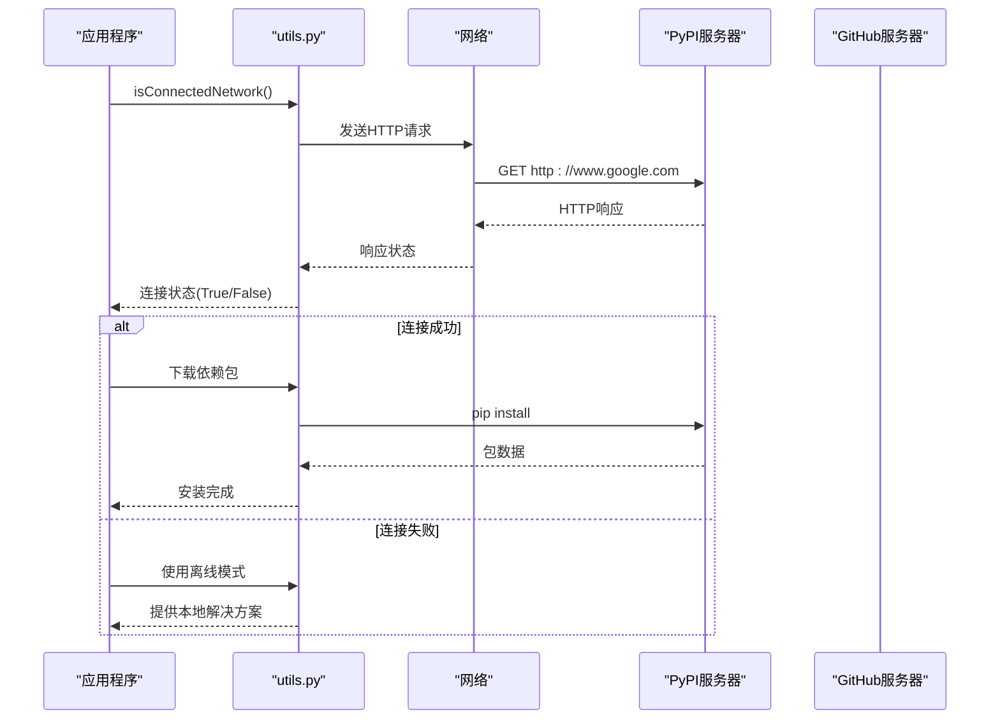

**图表来源**
- [src-python/utils.py](file://src-python/utils.py#L59-L68)

#### 网络检查功能特性

| 功能 | 描述 | 默认超时 |
|------|------|----------|
| 基础连接检查 | 验证互联网连接可用性 | 3秒 |
| 多目标测试 | 测试多个网络节点 | 可配置 |
| 超时控制 | 防止长时间等待 | 可配置 |
| 错误恢复 | 连接失败时的备用方案 | 自动切换 |

### 网络监控系统

项目还包含了持续的网络监控功能，用于检测网络连接的稳定性：

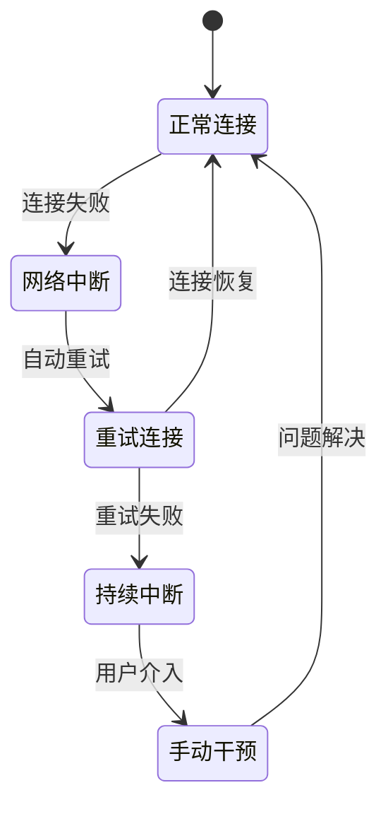

**图表来源**
- [src-python/docs/details/watchdog.md](file://src-python/docs/details/watchdog.md#L238-L320)

**章节来源**
- [src-python/utils.py](file://src-python/utils.py#L59-L68)
- [src-python/docs/details/watchdog.md](file://src-python/docs/details/watchdog.md#L238-L320)

## 设备与计算类型检测

### GPU设备检测

VRCT项目提供了全面的GPU设备检测和计算类型支持验证功能。

#### 设备检测流程

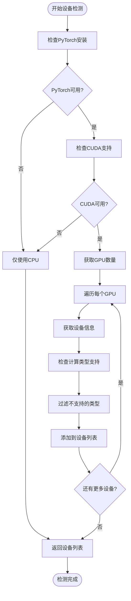

**图表来源**
- [src-python/utils.py](file://src-python/utils.py#L108-L132)

#### 计算类型支持矩阵

| GPU系列 | 支持的计算类型 | 优先级排序 |
|---------|----------------|------------|
| RTX系列 | int8_bfloat16, int8_float16, int8, bfloat16, float16, int8_float32, float32 | 最高 |
| Tesla/A100 | int8_bfloat16, int8_float16, int8, bfloat16, float16, int8_float32, float32 | 最高 |
| Quadro系列 | int8_bfloat16, int8_float16, int8, bfloat16, float16, int8_float32, float32 | 最高 |
| GTX系列 | float32 | 仅支持基础精度 |
| 其他GPU | float32 | 基础精度 |

### 设备兼容性验证

#### 计算类型选择算法

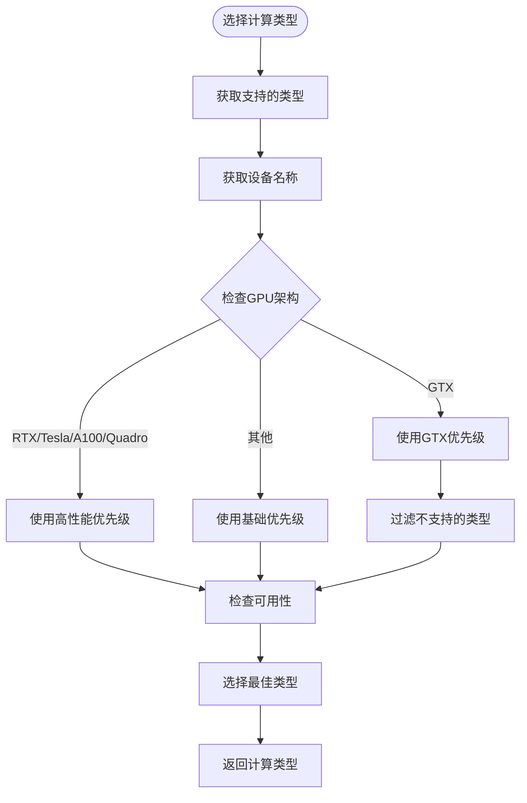

**图表来源**
- [src-python/utils.py](file://src-python/utils.py#L134-L170)

**章节来源**
- [src-python/utils.py](file://src-python/utils.py#L108-L170)
- [src-python/device_manager.py](file://src-python/device_manager.py#L1-L200)

## 错误处理与故障排除

### 日志系统架构

VRCT项目实现了完善的日志记录系统，用于跟踪和诊断各种类型的错误。

#### 日志系统设计

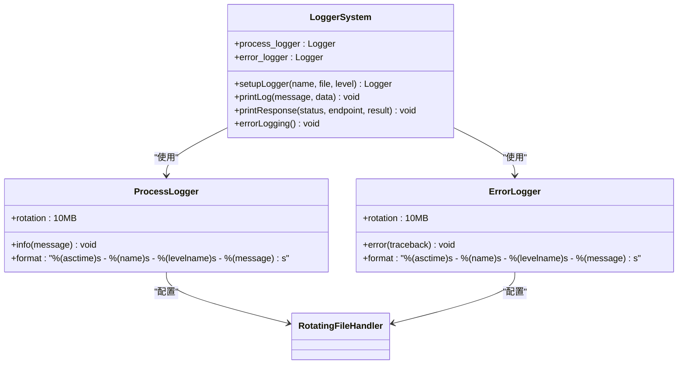

**图表来源**
- [src-python/utils.py](file://src-python/utils.py#L226-L293)

#### 错误处理层次

| 错误级别 | 文件 | 用途 | 处理方式 |
|----------|------|------|----------|
| INFO | process.log | 进程状态记录 | 保留历史信息 |
| ERROR | error.log | 错误详情记录 | 详细追踪 |
| DEBUG | debug.log | 调试信息 | 开发阶段使用 |

### 常见错误类型及解决方案

#### 依赖安装错误

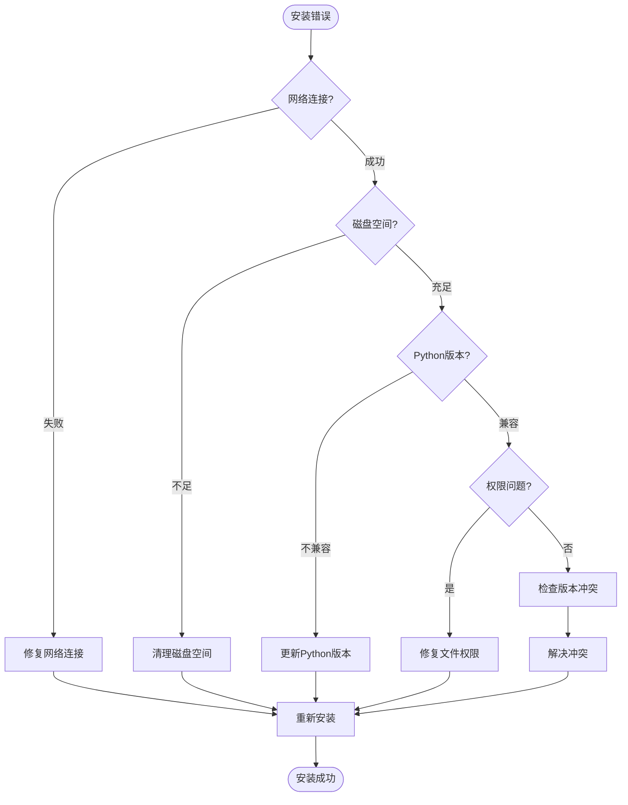

#### 设备兼容性错误

| 错误类型 | 症状 | 解决方案 |
|----------|------|----------|
| CUDA内存不足 | "CUDA out of memory" | 降低模型大小或使用CPU |
| GPU驱动问题 | "Driver not found" | 更新GPU驱动程序 |
| 计算类型不支持 | "Unsupported compute type" | 选择兼容的计算类型 |
| 设备访问被拒绝 | "Permission denied" | 以管理员身份运行 |

**章节来源**
- [src-python/utils.py](file://src-python/utils.py#L244-L293)
- [src-python/controller.py](file://src-python/controller.py#L23-L27)

## 依赖管理最佳实践

### 版本锁定策略

为了确保项目的稳定性和可重现性，VRCT采用了严格的版本锁定策略：

#### 版本管理原则

1. **精确版本控制**
   - 所有依赖库都指定了具体版本号
   - 避免使用范围版本（如>=2.0,<3.0）
   - 确保开发和生产环境的一致性

2. **定期更新策略**
   - 定期检查依赖库的安全更新
   - 在测试环境中验证新版本兼容性
   - 维护更新日志和迁移指南

3. **环境隔离**
   - 使用虚拟环境避免全局污染
   - 分离开发、测试和生产环境
   - 为不同GPU架构提供专门的环境

### 依赖验证清单

#### 安装前检查

- [ ] 网络连接正常
- [ ] Python版本兼容（推荐3.8+）
- [ ] 磁盘空间充足（至少2GB）
- [ ] 权限设置正确

#### 安装后验证

- [ ] PyTorch安装成功
- [ ] CUDA环境配置正确（如适用）
- [ ] 核心依赖库导入无误
- [ ] 网络连接性测试通过

#### 运行时检查

- [ ] GPU设备可用性
- [ ] 计算类型支持
- [ ] 模型下载功能
- [ ] 网络监控正常

**章节来源**
- [requirements.txt](file://requirements.txt#L1-L32)
- [requirements_cuda.txt](file://requirements_cuda.txt#L1-L33)

## 故障排除指南

### 常见问题诊断流程

#### 问题分类与解决步骤

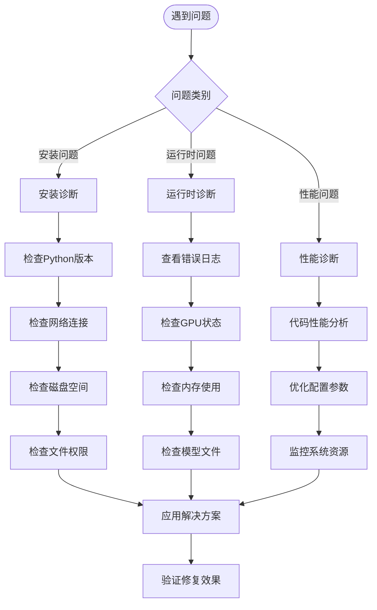

#### 详细故障排除步骤

##### 1. 安装失败问题

**症状**: pip install命令执行失败
**排查步骤**:
1. 检查网络连接状态
2. 验证Python环境完整性
3. 清理pip缓存
4. 检查防火墙设置
5. 尝试使用镜像源

**解决方案**:
```bash
# 清理pip缓存
pip cache purge

# 使用国内镜像源
pip install -r requirements.txt -i https://pypi.tuna.tsinghua.edu.cn/simple/

# 手动安装失败的包
pip install torch==2.7.0
```

##### 2. GPU设备问题

**症状**: CUDA设备无法识别或使用
**排查步骤**:
1. 检查CUDA驱动版本
2. 验证GPU硬件状态
3. 测试PyTorch CUDA支持
4. 检查环境变量设置

**解决方案**:
```python
# 检查CUDA支持
import torch
print(f"CUDA可用: {torch.cuda.is_available()}")
print(f"GPU数量: {torch.cuda.device_count()}")

# 获取GPU信息
for i in range(torch.cuda.device_count()):
    print(f"GPU {i}: {torch.cuda.get_device_name(i)}")
```

##### 3. 内存不足问题

**症状**: CUDA内存溢出或系统内存不足
**排查步骤**:
1. 监控GPU内存使用
2. 检查系统总内存
3. 分析模型大小
4. 评估批处理大小

**解决方案**:
- 降低模型精度（使用float32而非float16）
- 减少批处理大小
- 使用梯度累积
- 启用混合精度训练

### 性能优化建议

#### GPU利用率优化

| 优化策略 | 实现方法 | 预期效果 |
|----------|----------|----------|
| 批处理优化 | 调整batch_size | 提升吞吐量 |
| 内存管理 | 使用torch.cuda.empty_cache() | 减少内存碎片 |
| 数据预加载 | 使用多进程数据加载器 | 减少I/O等待 |
| 混合精度 | 启用autocast | 提升速度20-30% |

#### 网络性能优化

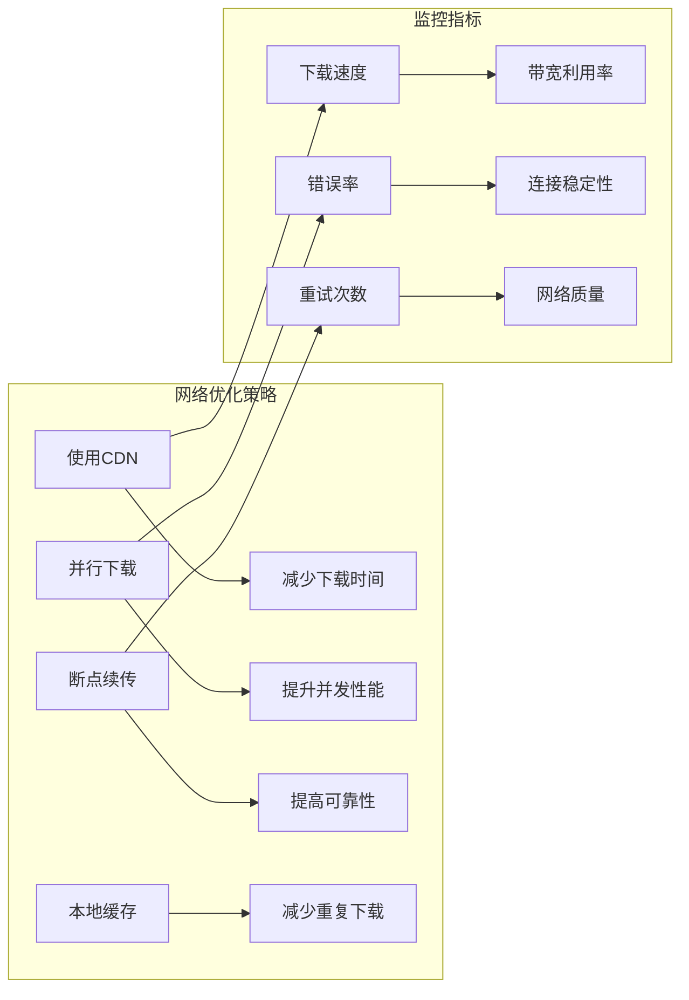

**章节来源**
- [src-python/utils.py](file://src-python/utils.py#L244-L293)
- [src-python/docs/utils.md](file://src-python/docs/utils.md#L404-L608)

## 总结

VRCT项目的依赖管理系统体现了现代Python应用程序的最佳实践。通过虚拟环境隔离、完善的网络检查机制、智能的设备兼容性验证以及全面的日志记录系统，确保了应用程序在各种环境下都能稳定运行。

### 关键要点回顾

1. **虚拟环境管理**: 使用独立的虚拟环境避免依赖冲突
2. **网络连接验证**: 多层次的网络检查确保包和模型下载成功
3. **设备兼容性**: 智能的GPU检测和计算类型选择
4. **错误处理**: 完善的日志系统和错误恢复机制
5. **性能优化**: 针对不同硬件配置的优化策略

### 最佳实践建议

- 定期更新依赖库版本
- 建立完善的测试环境
- 监控系统资源使用情况
- 维护详细的故障排除文档
- 实施自动化部署流程

通过遵循这些指导原则和最佳实践，可以确保VRCT项目在各种部署环境中都能稳定、高效地运行。