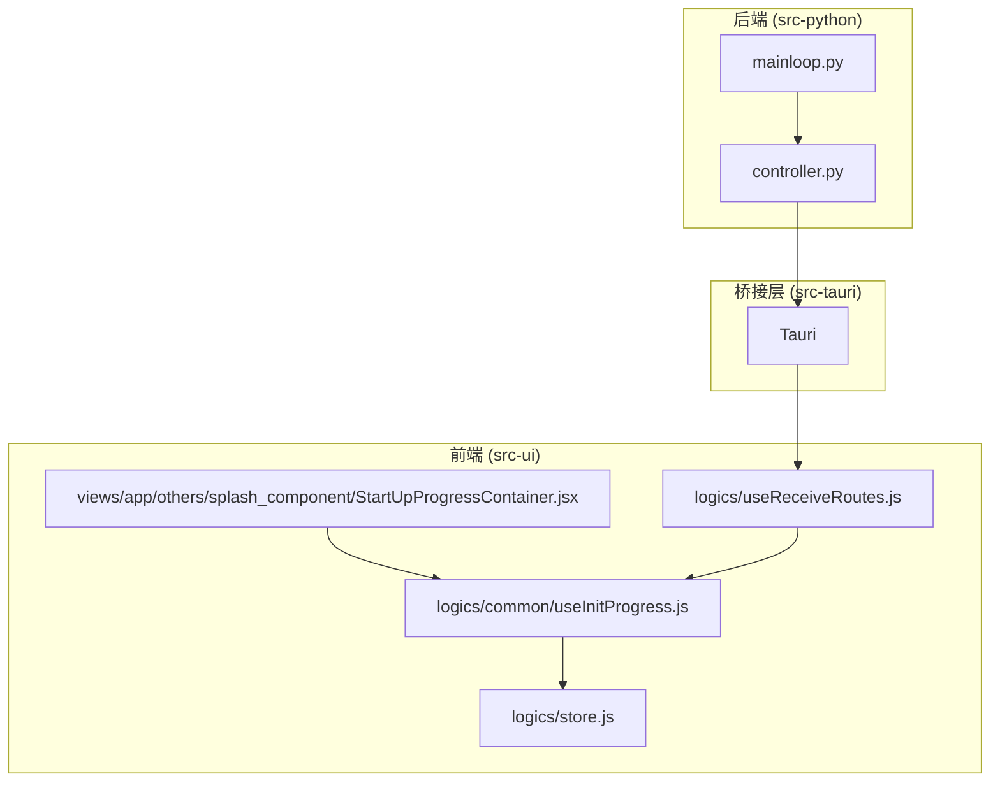
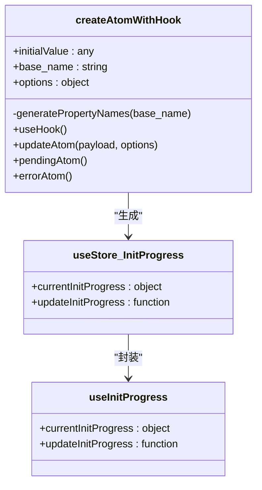
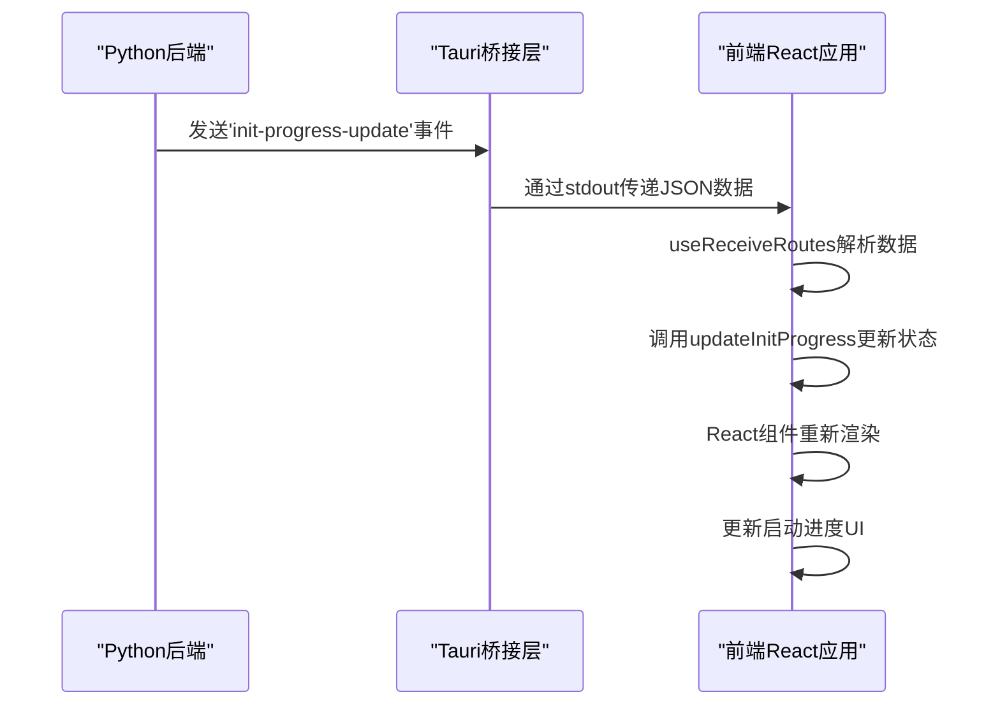
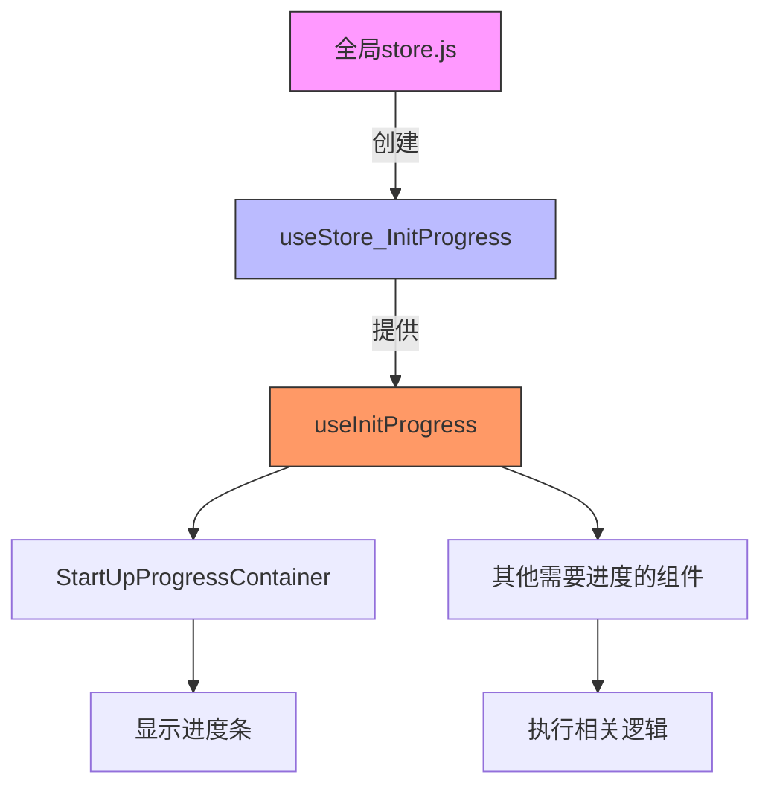
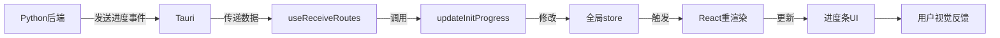
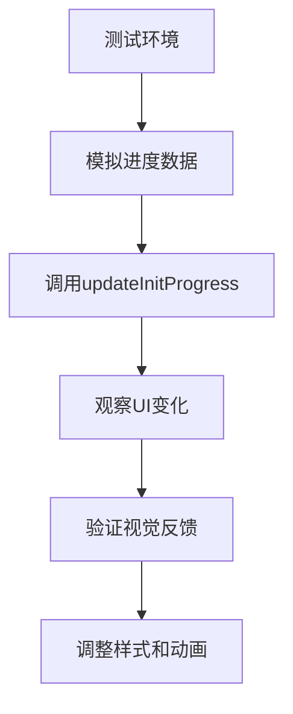

# UI状态管理机制

<cite>
**本文档引用的文件**   
- [useInitProgress.js](file://src-ui/logics/common/useInitProgress.js)
- [store.js](file://src-ui/logics/store.js)
- [StartUpProgressContainer.jsx](file://src-ui/views/app/others/splash_component/start_up_progress_container/StartUpProgressContainer.jsx)
- [useReceiveRoutes.js](file://src-ui/logics/useReceiveRoutes.js)
- [StartPythonController.jsx](file://src-ui/views/app/_app_controllers/StartPythonController.jsx)
</cite>

## 目录
1. [项目结构](#项目结构)
2. [核心状态管理机制](#核心状态管理机制)
3. [启动进度状态流分析](#启动进度状态流分析)
4. [跨组件状态共享实现](#跨组件状态共享实现)
5. [响应式更新流程](#响应式更新流程)
6. [调试与测试建议](#调试与测试建议)

## 项目结构

**图示来源**
- [useInitProgress.js](file://src-ui/logics/common/useInitProgress.js)
- [store.js](file://src-ui/logics/store.js)
- [StartUpProgressContainer.jsx](file://src-ui/views/app/others/splash_component/start_up_progress_container/StartUpProgressContainer.jsx)
- [useReceiveRoutes.js](file://src-ui/logics/useReceiveRoutes.js)
- [StartPythonController.jsx](file://src-ui/views/app/_app_controllers/StartPythonController.jsx)

## 核心状态管理机制

本项目采用Jotai作为状态管理库，通过`createAtomWithHook`工厂函数创建原子状态和对应的Hook。全局状态存储在`store.js`文件中，实现了集中式状态管理。

**图示来源**
- [store.js](file://src-ui/logics/store.js#L36-L121)
- [useInitProgress.js](file://src-ui/logics/common/useInitProgress.js)

## 启动进度状态流分析

系统启动过程中，前端状态管理与后端通信形成完整的状态流。Python后端通过Tauri事件系统发送初始化进度，前端接收并更新UI。

**图示来源**
- [StartPythonController.jsx](file://src-ui/views/app/_app_controllers/StartPythonController.jsx#L34-L58)
- [useReceiveRoutes.js](file://src-ui/logics/useReceiveRoutes.js#L108-L194)
- [useInitProgress.js](file://src-ui/logics/common/useInitProgress.js)

## 跨组件状态共享实现

通过自定义Hook `useInitProgress` 实现跨组件状态共享，该Hook封装了对全局Zustand store的访问。

**图示来源**
- [store.js](file://src-ui/logics/store.js#L161)
- [useInitProgress.js](file://src-ui/logics/common/useInitProgress.js)
- [StartUpProgressContainer.jsx](file://src-ui/views/app/others/splash_component/start_up_progress_container/StartUpProgressContainer.jsx)

**节来源**
- [useInitProgress.js](file://src-ui/logics/common/useInitProgress.js#L1-L10)
- [store.js](file://src-ui/logics/store.js#L161)

## 响应式更新流程

状态变更的响应式更新流程确保了UI与数据的一致性，从状态更新到视觉反馈的完整流程如下：

**图示来源**
- [useReceiveRoutes.js](file://src-ui/logics/useReceiveRoutes.js#L146-L191)
- [store.js](file://src-ui/logics/store.js#L57-L81)
- [StartUpProgressContainer.jsx](file://src-ui/views/app/others/splash_component/start_up_progress_container/StartUpProgressContainer.jsx#L10-L13)

## 调试与测试建议

为便于开发和测试，提供以下调试建议：

### 开发者工具监控
- 在浏览器开发者工具中监控store状态变化
- 使用React DevTools观察组件重渲染情况
- 查看控制台日志跟踪事件流

### 模拟进度测试
可通过注入模拟进度数据来测试UI表现：

### 常见问题排查
- 确保Tauri事件正确传递
- 验证`useReceiveRoutes`正确解析数据
- 检查`updateInitProgress`是否被正确调用
- 确认React组件正确订阅状态变化

**节来源**
- [useReceiveRoutes.js](file://src-ui/logics/useReceiveRoutes.js)
- [useInitProgress.js](file://src-ui/logics/common/useInitProgress.js)
- [StartUpProgressContainer.jsx](file://src-ui/views/app/others/splash_component/start_up_progress_container/StartUpProgressContainer.jsx)