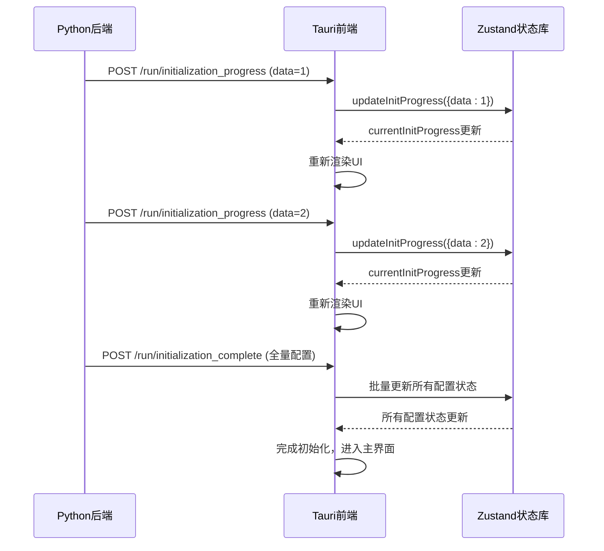
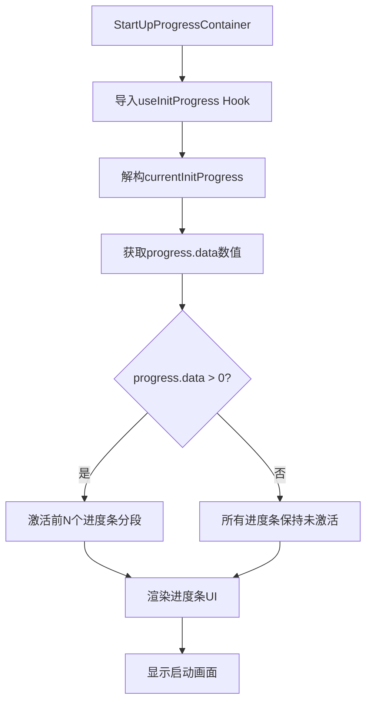

# 初始化阶段解析

<cite>
**本文档引用的文件**  
- [mainloop.py](file://src-python/mainloop.py)
- [controller.py](file://src-python/controller.py)
- [device_manager.py](file://src-python/device_manager.py)
- [config.py](file://src-python/config.py)
- [useInitProgress.js](file://src-ui/logics/common/useInitProgress.js)
- [StartUpProgressContainer.jsx](file://src-ui/views/app/others/splash_component/start_up_progress_container/StartUpProgressContainer.jsx)
- [useReceiveRoutes.js](file://src-ui/logics/useReceiveRoutes.js)
</cite>

## 目录
1. [初始化四阶段详解](#初始化四阶段详解)
2. [进度状态管理机制](#进度状态管理机制)
3. [前端可视化反馈](#前端可视化反馈)
4. [关键组件交互流程](#关键组件交互流程)
5. [故障排查指南](#故障排查指南)

## 初始化四阶段详解

VRCT应用的启动初始化过程分为四个明确的阶段，每个阶段通过后端Python进程与前端UI的协同工作来确保系统正确配置和就绪。

**第一阶段：配置加载与状态恢复**  
该阶段始于`controller.py`中的`init()`方法调用，首先执行`removeLog()`清理旧日志并输出"Start Initialization"标记。系统立即检查网络连接状态，并通过`connectedNetwork()`或`disconnectedNetwork()`向前端广播结果。此阶段主要从`config.json`文件中恢复用户设置，并初始化核心配置对象。

**第二阶段：音频设备枚举与默认设备检测**  
在`device_manager.py`中，`DeviceManager`类负责音频设备的管理。通过`pyaudiowpatch`和`pycaw`库，系统枚举所有可用的麦克风主机、输入设备和扬声器环回设备。`update()`方法收集设备信息，`checkUpdate()`方法检测设备变化，最终确定默认的麦克风和扬声器设备。这一过程为后续的语音转录功能奠定基础。

**第三阶段：Python后端进程启动与健康检查**  
`mainloop.py`中的`Main`类启动接收和处理线程。`startReceiver()`监听标准输入流以接收来自前端的JSON请求，`startHandler()`创建多个工作线程（默认3个）来处理请求队列。通过`init_mapping`，系统将所有初始配置数据发送到前端，完成状态同步。

**第四阶段：WebSocket/OSC服务就绪状态确认**  
初始化的最后阶段，系统检查并启动WebSocket服务器和OSC查询功能。当所有初始化任务完成后，`updateConfigSettings()`方法被调用，通过`/run/initialization_complete`端点发送一个包含所有配置设置的完整数据包，标志着后端已完全就绪。

**Section sources**
- [controller.py](file://src-python/controller.py#L2892-L3059)
- [device_manager.py](file://src-python/device_manager.py#L140-L239)
- [mainloop.py](file://src-python/mainloop.py#L577-L588)
- [config.py](file://src-python/config.py#L547-L774)

## 进度状态管理机制

系统的进度状态通过一个精巧的前后端通信机制进行管理。后端使用`initializationProgress(progress)`方法，通过`/run/initialization_progress`端点发送进度更新。



**Diagram sources**
- [controller.py](file://src-python/controller.py#L2870)
- [useInitProgress.js](file://src-ui/logics/common/useInitProgress.js#L3-L9)
- [useReceiveRoutes.js](file://src-ui/logics/useReceiveRoutes.js#L149-L158)

## 前端可视化反馈

`StartUpProgressContainer`组件通过`useInitProgress` Hook订阅进度状态，实现直观的可视化反馈。该组件使用一个包含4个分段的进度条来表示四个初始化阶段。



`progress.data`的数值变化与初始化步骤的映射关系如下：
- `progress.data = 0`：初始化尚未开始或处于第一阶段初期
- `progress.data = 1`：完成配置加载，进入设备枚举阶段
- `progress.data = 2`：完成设备检测，进入后端服务启动阶段
- `progress.data = 3` 或 `4`：后端服务启动中，等待就绪确认
- 收到`/run/initialization_complete`：初始化完成，UI跳转

**Diagram sources**
- [StartUpProgressContainer.jsx](file://src-ui/views/app/others/splash_component/start_up_progress_container/StartUpProgressContainer.jsx#L10-L11)
- [useInitProgress.js](file://src-ui/logics/common/useInitProgress.js#L3-L9)

**Section sources**
- [StartUpProgressContainer.jsx](file://src-ui/views/app/others/splash_component/start_up_progress_container/StartUpProgressContainer.jsx#L1-L40)
- [useInitProgress.js](file://src-ui/logics/common/useInitProgress.js#L1-L10)

## 关键组件交互流程

整个初始化流程涉及多个关键组件的紧密协作，形成一个清晰的控制流。

```mermaid
graph TD
A[StartPythonController] --> |启动| B[Python后端进程]
B --> C[mainloop.py]
C --> D[Main.startReceiver]
C --> E[Main.startHandler]
C --> F[controller.init]
F --> G[阶段1: 配置加载]
F --> H[阶段2: 设备枚举]
F --> I[阶段3: 服务启动]
F --> J[阶段4: 就绪确认]
F --> K[initializationProgress]
K --> L[/run/initialization_progress]
L --> M[useReceiveRoutes]
M --> N[updateInitProgress]
N --> O[Zustand Store]
O --> P[StartUpProgressContainer]
P --> Q[渲染进度条]
F --> R[initialization_complete]
R --> L
L --> M
M --> S[updateIsBackendReady]
S --> T[跳转主界面]
```

**Diagram sources**
- [StartPythonController.jsx](file://src-ui/views/app/_app_controllers/StartPythonController.jsx#L14-L32)
- [controller.py](file://src-python/controller.py#L2892-L3059)
- [mainloop.py](file://src-python/mainloop.py#L577-L588)
- [useReceiveRoutes.js](file://src-ui/logics/useReceiveRoutes.js#L149-L158)

## 故障排查指南

当初始化过程卡顿时，开发者可以根据`progress.data`的值定位问题发生的具体阶段：

- **卡在 progress.data = 0**：问题可能出在Python进程启动或`controller.init()`的早期阶段。检查`removeLog()`和网络连接检测是否正常执行。
- **卡在 progress.data = 1**：问题发生在设备枚举阶段。检查`device_manager.py`中的`update()`方法是否能正确访问音频API，特别是`pyaudiowpatch`和`pycaw`的兼容性。
- **卡在 progress.data = 2**：问题可能与AI模型下载或验证有关。检查`downloadCtranslate2Weight`或`downloadWhisperWeight`线程是否正常工作，以及网络连接状态。
- **无法收到 initialization_complete**：表明`updateConfigSettings()`未能成功执行。检查`init_mapping`中的所有端点是否都能正确返回数据，特别是那些依赖外部服务（如DeepL、Gemini API）的验证逻辑。

**Section sources**
- [controller.py](file://src-python/controller.py#L2892-L3059)
- [test_client.py](file://src-python/test_client.py#L55-L119)
- [mainloop.py](file://src-python/mainloop.py#L71-L72)