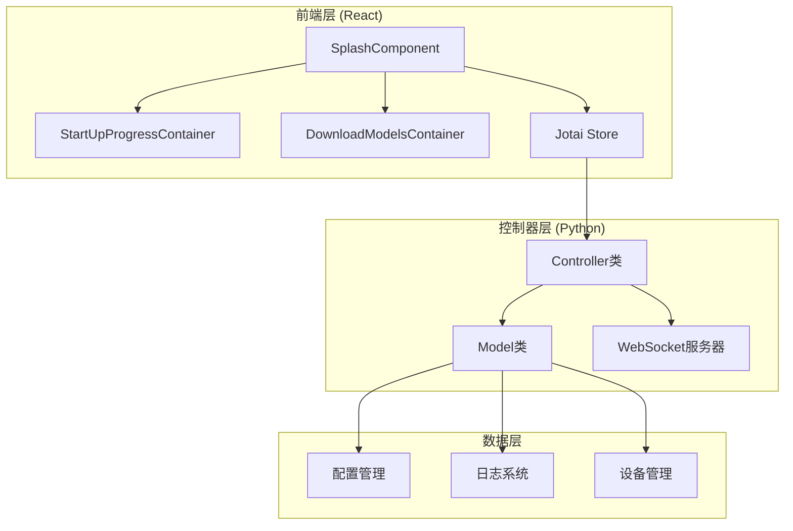
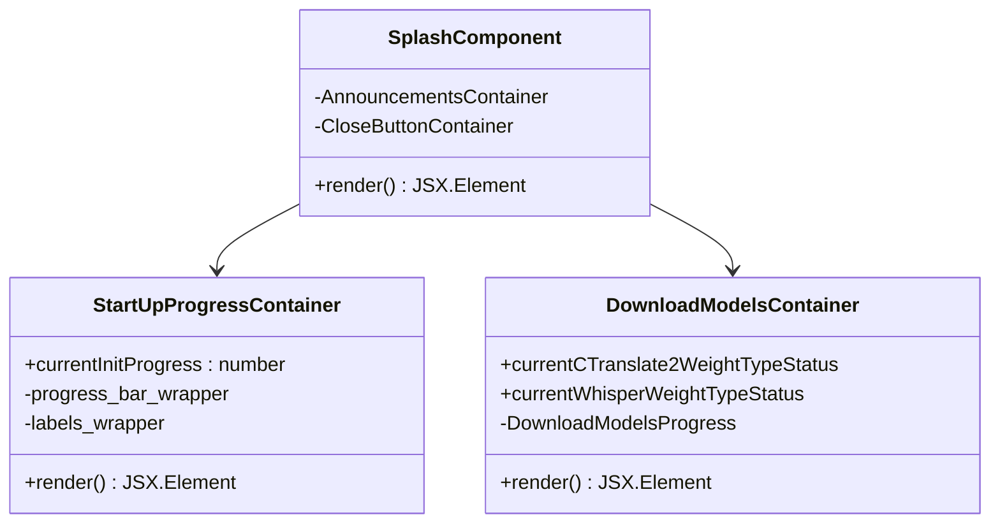
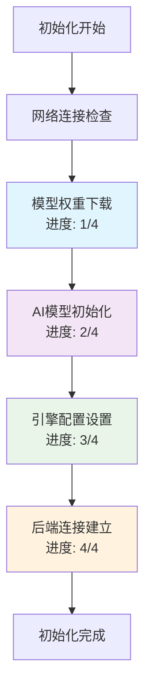
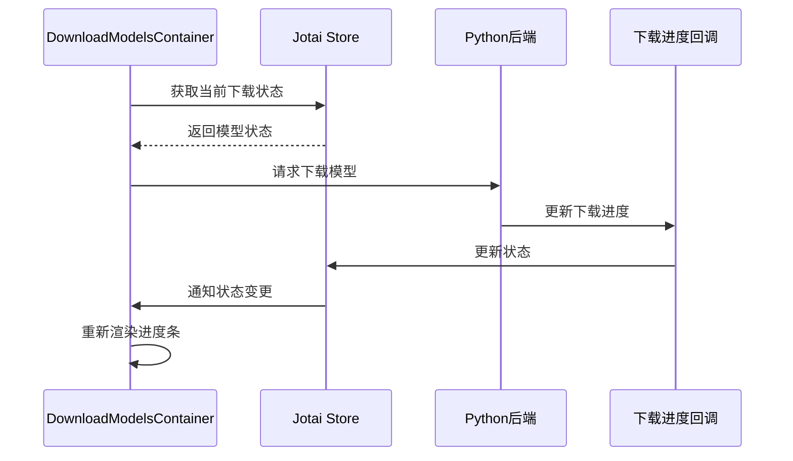
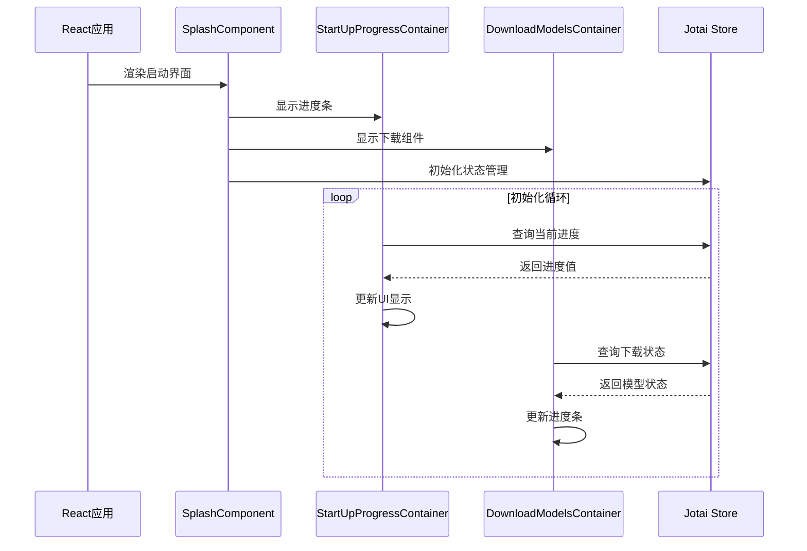
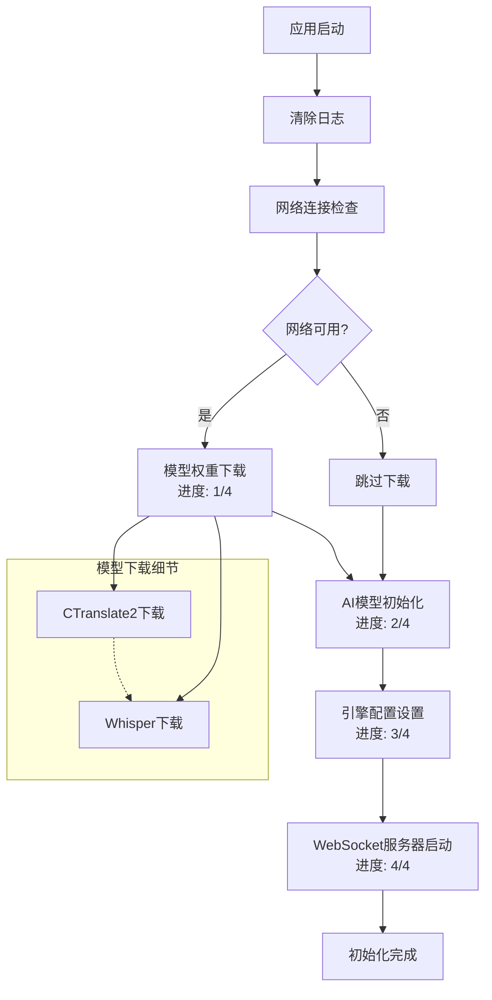
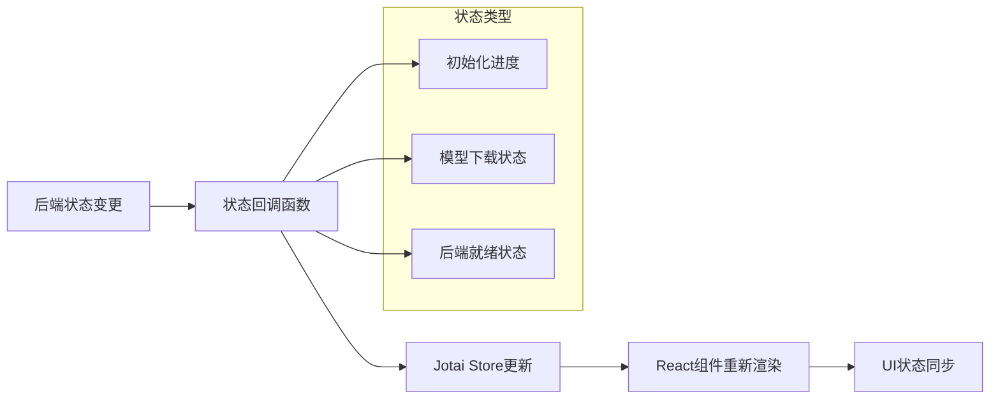
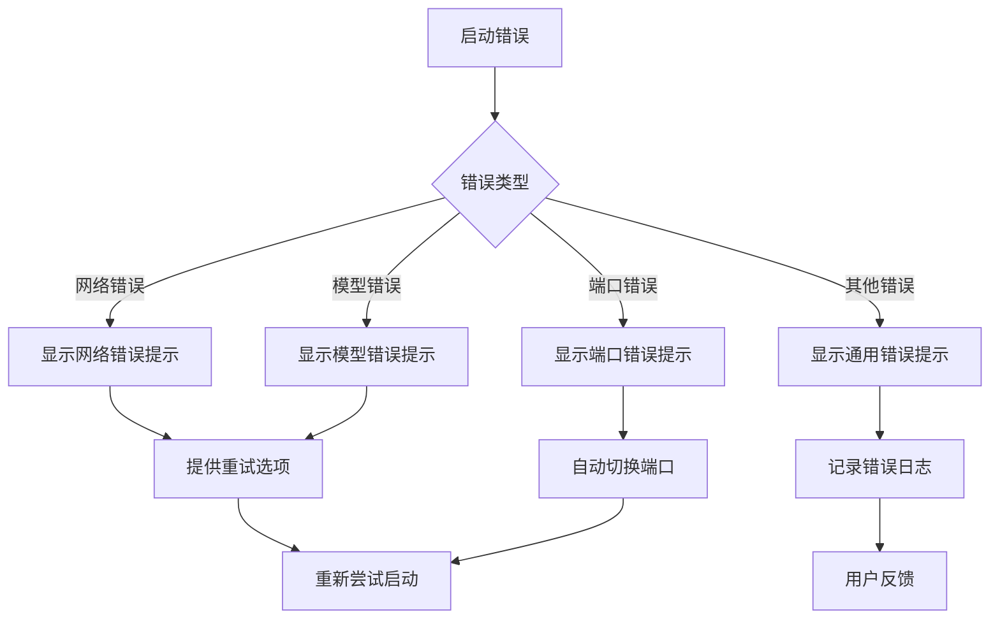
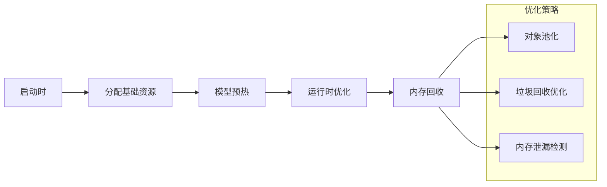

# 启动初始化流程

<cite>
**本文档引用的文件**
- [SplashComponent.jsx](file://src-ui/views/app/others/splash_component/SplashComponent.jsx)
- [StartUpProgressContainer.jsx](file://src-ui/views/app/others/splash_component/start_up_progress_container/StartUpProgressContainer.jsx)
- [DownloadModelsContainer.jsx](file://src-ui/views/app/others/splash_component/download_models_container/DownloadModelsContainer.jsx)
- [useInitProgress.js](file://src-ui/logics/common/useInitProgress.js)
- [useIsBackendReady.js](file://src-ui/logics/common/useIsBackendReady.js)
- [store.js](file://src-ui/store.js)
- [controller.py](file://src-python/controller.py)
- [model.py](file://src-python/model.py)
- [websocket_server.py](file://src-python/models/websocket/websocket_server.py)
</cite>

## 目录
1. [简介](#简介)
2. [项目架构概述](#项目架构概述)
3. [核心组件分析](#核心组件分析)
4. [启动流程详细分析](#启动流程详细分析)
5. [UI状态与后端初始化的对应关系](#ui状态与后端初始化的对应关系)
6. [故障定位方法](#故障定位方法)
7. [性能考虑](#性能考虑)
8. [总结](#总结)

## 简介

VRCT项目采用前后端分离的架构，前端负责用户界面展示和交互，后端负责业务逻辑处理。启动初始化流程是整个应用生命周期中最关键的部分，它协调着多个组件的初始化过程，确保应用能够正确启动并提供服务。

本文档重点分析前端启动界面的初始化流程，特别是SplashComponent.jsx如何协调启动进度指示器和模型下载组件，以及StartUpProgressContainer如何分阶段显示初始化进度，帮助用户判断启动卡顿发生在哪个阶段。

## 项目架构概述

VRCT项目采用三层架构设计：



**图表来源**
- [SplashComponent.jsx](file://src-ui/views/app/others/splash_component/SplashComponent.jsx#L1-L85)
- [controller.py](file://src-python/controller.py#L1-L50)
- [model.py](file://src-python/model.py#L81-L150)

## 核心组件分析

### SplashComponent - 启动界面主组件

SplashComponent是启动界面的根组件，负责协调各个子组件的工作：



**图表来源**
- [SplashComponent.jsx](file://src-ui/views/app/others/splash_component/SplashComponent.jsx#L10-L18)
- [StartUpProgressContainer.jsx](file://src-ui/views/app/others/splash_component/start_up_progress_container/StartUpProgressContainer.jsx#L9-L40)
- [DownloadModelsContainer.jsx](file://src-ui/views/app/others/splash_component/download_models_container/DownloadModelsContainer.jsx#L10-L30)

**章节来源**
- [SplashComponent.jsx](file://src-ui/views/app/others/splash_component/SplashComponent.jsx#L1-L85)
- [StartUpProgressContainer.jsx](file://src-ui/views/app/others/splash_component/start_up_progress_container/StartUpProgressContainer.jsx#L1-L40)
- [DownloadModelsContainer.jsx](file://src-ui/views/app/others/splash_component/download_models_container/DownloadModelsContainer.jsx#L1-L69)

### StartUpProgressContainer - 启动进度容器

StartUpProgressContainer负责显示四阶段的初始化进度：



**图表来源**
- [StartUpProgressContainer.jsx](file://src-ui/views/app/others/splash_component/start_up_progress_container/StartUpProgressContainer.jsx#L10-L32)
- [controller.py](file://src-python/controller.py#L2900-L2927)

**章节来源**
- [StartUpProgressContainer.jsx](file://src-ui/views/app/others/splash_component/start_up_progress_container/StartUpProgressContainer.jsx#L1-L40)

### DownloadModelsContainer - 模型下载容器

DownloadModelsContainer专门负责显示模型下载进度：



**图表来源**
- [DownloadModelsContainer.jsx](file://src-ui/views/app/others/splash_component/download_models_container/DownloadModelsContainer.jsx#L10-L30)
- [controller.py](file://src-python/controller.py#L2900-L2927)

**章节来源**
- [DownloadModelsContainer.jsx](file://src-ui/views/app/others/splash_component/download_models_container/DownloadModelsContainer.jsx#L1-L69)

## 启动流程详细分析

### 前端初始化流程

前端启动流程遵循以下步骤：



**图表来源**
- [SplashComponent.jsx](file://src-ui/views/app/others/splash_component/SplashComponent.jsx#L10-L18)
- [useInitProgress.js](file://src-ui/logics/common/useInitProgress.js#L3-L9)

### 后端初始化流程

后端初始化流程更加复杂，分为四个主要阶段：



**图表来源**
- [controller.py](file://src-python/controller.py#L2900-L2927)
- [model.py](file://src-python/model.py#L100-L200)

**章节来源**
- [controller.py](file://src-python/controller.py#L2900-L2927)
- [model.py](file://src-python/model.py#L100-L200)

### WebSocket服务器初始化

WebSocket服务器的初始化是启动流程中的关键环节：

```mermaid
sequenceDiagram
participant Model as Model类
participant WS as WebSocketServer
participant Loop as 异步事件循环
participant Clients as 客户端连接
Model->>WS : 创建WebSocketServer实例
Model->>WS : 设置消息处理器
WS->>Loop : 启动异步事件循环
Loop->>Loop : 监听指定端口
Loop->>Clients : 处理客户端连接
Clients->>Loop : 发送消息
Loop->>Model : 调用消息处理器
Model->>Loop : 返回响应
Loop->>Clients : 广播响应消息
```

**图表来源**
- [websocket_server.py](file://src-python/models/websocket/websocket_server.py#L110-L140)
- [model.py](file://src-python/model.py#L1122-L1146)

**章节来源**
- [websocket_server.py](file://src-python/models/websocket/websocket_server.py#L1-L200)
- [model.py](file://src-python/model.py#L1122-L1146)

## UI状态与后端初始化的对应关系

### 状态映射机制

前端通过Jotai状态管理系统与后端保持同步：

| UI状态 | 对应后端阶段 | 描述 |
|--------|-------------|------|
| 进度条第1阶段 | 网络连接检查 | 检查互联网连接状态 |
| 进度条第2阶段 | 模型权重下载 | 并行下载CTranslate2和Whisper模型 |
| 进度条第3阶段 | AI模型初始化 | 初始化翻译和转录引擎 |
| 进度条第4阶段 | 后端连接建立 | 建立WebSocket服务器连接 |

**章节来源**
- [store.js](file://src-ui/store.js#L161-L161)
- [useInitProgress.js](file://src-ui/logics/common/useInitProgress.js#L3-L9)

### 实时状态更新



**图表来源**
- [useInitProgress.js](file://src-ui/logics/common/useInitProgress.js#L3-L9)
- [useIsBackendReady.js](file://src-ui/logics/common/useIsBackendReady.js#L3-L14)

**章节来源**
- [useInitProgress.js](file://src-ui/logics/common/useInitProgress.js#L1-L10)
- [useIsBackendReady.js](file://src-ui/logics/common/useIsBackendReady.js#L1-L15)

## 故障定位方法

### 基于界面表现的故障诊断

根据启动界面的不同表现，可以判断问题发生的阶段：

#### 启动卡在第一阶段（网络检查）

**界面表现：**
- 进度条停留在第1个阶段
- 模型下载组件未显示

**可能原因：**
- 网络连接异常
- 防火墙阻止访问
- DNS解析失败

**诊断方法：**
1. 检查网络连接状态
2. 尝试手动访问模型下载地址
3. 检查防火墙设置

#### 启动卡在第二阶段（模型下载）

**界面表现：**
- 进度条停留在第2个阶段
- 显示模型下载进度条
- 下载进度长时间无变化

**可能原因：**
- 网络速度过慢
- 模型服务器负载过高
- 文件损坏或不完整

**诊断方法：**
1. 检查下载速度
2. 查看下载日志
3. 尝试重新下载

#### 启动卡在第三阶段（AI模型初始化）

**界面表现：**
- 进度条停留在第3个阶段
- 模型下载已完成但进度条未前进

**可能原因：**
- GPU/CPU资源不足
- 模型文件损坏
- 计算设备配置错误

**诊断方法：**
1. 检查硬件资源使用情况
2. 验证模型文件完整性
3. 检查计算设备设置

#### 启动卡在第四阶段（后端连接）

**界面表现：**
- 进度条停留在第4个阶段
- 显示"VRCT正在启动"提示

**可能原因：**
- WebSocket端口被占用
- 端口权限问题
- 后端进程异常

**诊断方法：**
1. 检查端口占用情况
2. 查看后端错误日志
3. 重启应用程序

### 错误处理机制



**图表来源**
- [useIsBackendReady.js](file://src-ui/logics/common/useIsBackendReady.js#L3-L14)

**章节来源**
- [useIsBackendReady.js](file://src-ui/logics/common/useIsBackendReady.js#L1-L15)

## 性能考虑

### 启动优化策略

1. **并行初始化**：模型下载采用多线程并行处理
2. **延迟加载**：非关键组件采用懒加载方式
3. **状态缓存**：使用Jotai进行状态缓存和更新优化
4. **资源预分配**：提前分配必要的内存和计算资源

### 内存管理



### 网络优化

- 使用HTTP/2协议提升传输效率
- 实现断点续传功能
- 添加请求重试机制
- 采用CDN加速模型下载

## 总结

VRCT项目的启动初始化流程是一个精心设计的多阶段协调系统，通过前端SplashComponent.jsx协调启动进度指示器和模型下载组件，实现了用户友好的启动体验。

### 关键特性

1. **分阶段显示**：通过StartUpProgressContainer清晰展示初始化进度
2. **实时反馈**：DownloadModelsContainer提供精确的模型下载进度
3. **故障定位**：基于界面表现的故障诊断方法
4. **状态同步**：前后端通过Jotai状态管理系统保持同步

### 最佳实践

- 用户界面应该提供明确的进度指示
- 后端初始化应该支持并行处理
- 错误处理应该提供具体的解决方案
- 状态管理应该保持简洁高效

这种设计不仅提升了用户体验，也为后续的功能扩展和维护奠定了良好的基础。通过合理的模块划分和状态管理，VRCT成功地构建了一个稳定可靠的启动初始化系统。