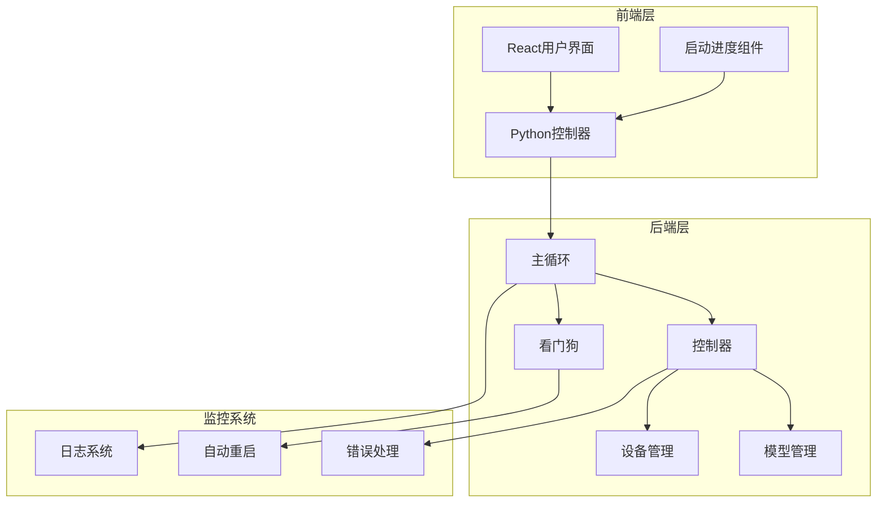
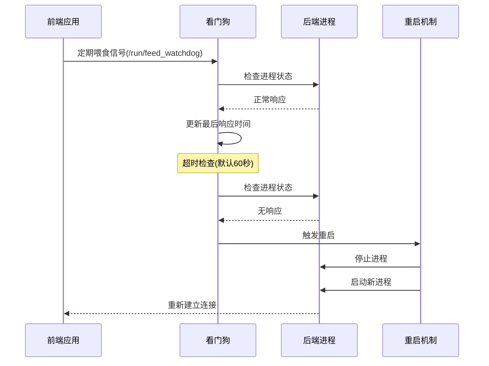
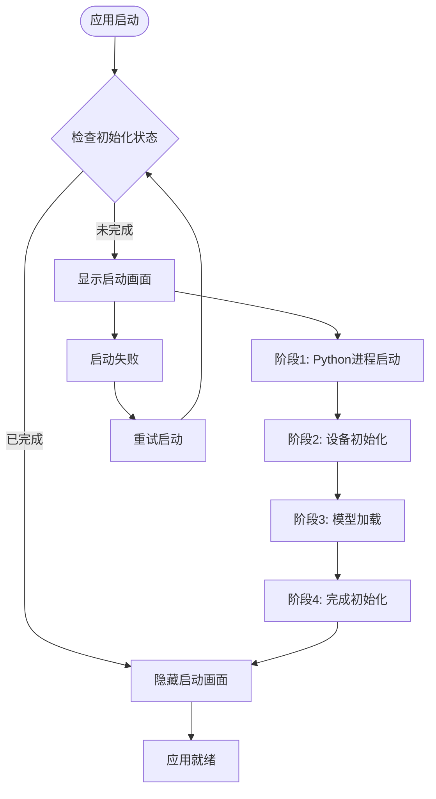
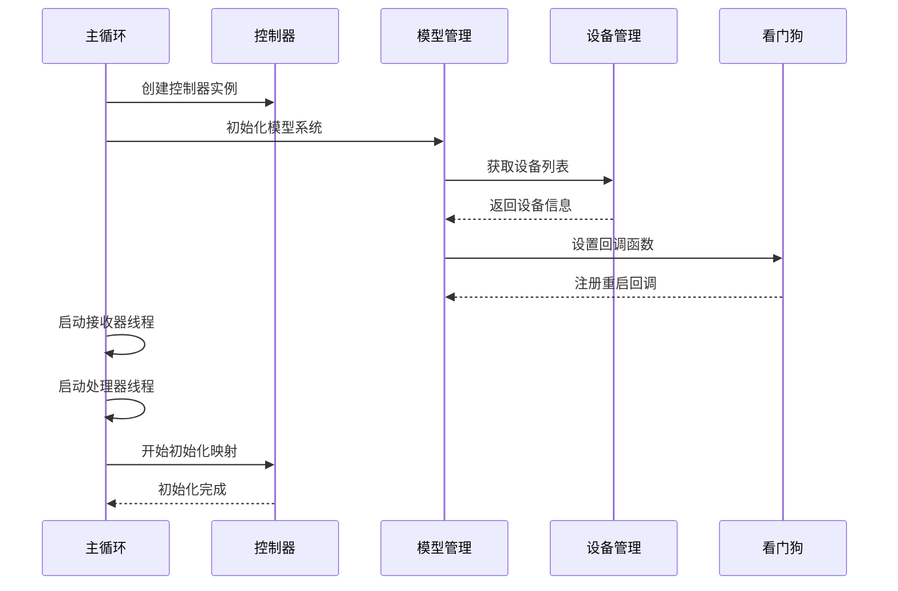
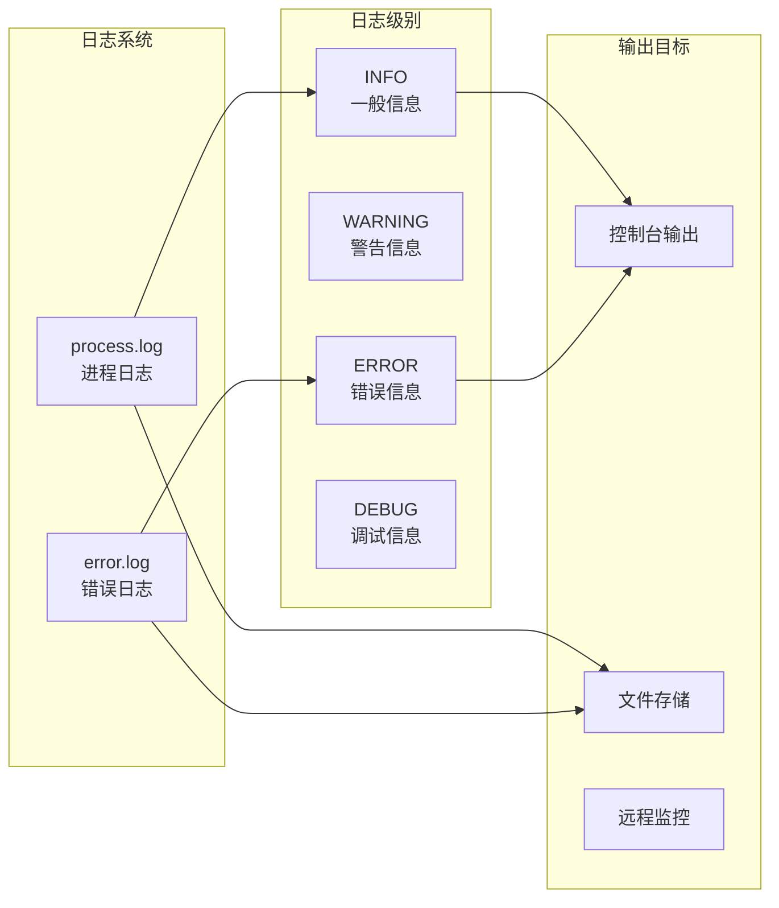
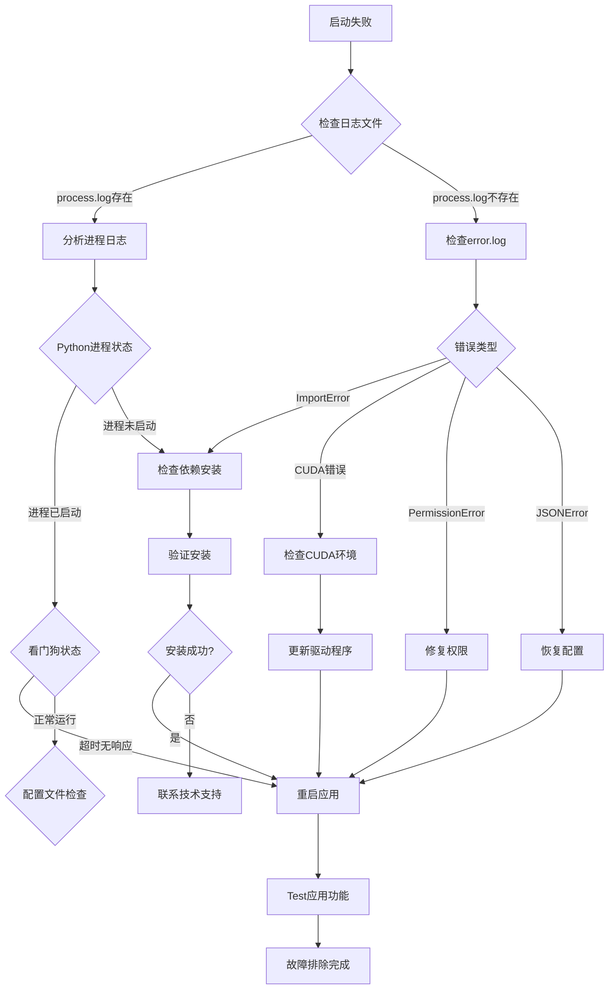

# 启动失败与崩溃恢复

<cite>
**本文档中引用的文件**
- [watchdog.py](file://src-python/models/watchdog/watchdog.py)
- [mainloop.py](file://src-python/mainloop.py)
- [controller.py](file://src-python/controller.py)
- [model.py](file://src-python/model.py)
- [utils.py](file://src-python/utils.py)
- [config.py](file://src-python/config.py)
- [device_manager.py](file://src-python/device_manager.py)
- [StartPythonController.jsx](file://src-ui/views/app/_app_controllers/StartPythonController.jsx)
- [SplashComponent.jsx](file://src-ui/views/others/splash_component/SplashComponent.jsx)
- [StartUpProgressContainer.jsx](file://src-ui/views/app/others/splash_component/start_up_progress_container/StartUpProgressContainer.jsx)
- [useInitProgress.js](file://src-ui/logics/common/useInitProgress.js)
- [test_client.py](file://src-python/test_client.py)
</cite>

## 目录
1. [概述](#概述)
2. [系统架构概览](#系统架构概览)
3. [Watchdog看门狗机制](#watchdog看门狗机制)
4. [前端启动流程](#前端启动流程)
5. [后端初始化过程](#后端初始化过程)
6. [错误日志系统](#错误日志系统)
7. [常见启动失败原因](#常见启动失败原因)
8. [故障排除指南](#故障排除指南)
9. [最佳实践建议](#最佳实践建议)

## 概述

VRCT应用程序采用双层架构设计，包含前端React界面和后端Python服务。当应用启动失败或出现崩溃时，系统通过多层次的监控和恢复机制确保稳定运行。本文档详细说明了启动失败的诊断方法、崩溃恢复机制以及故障排除步骤。

## 系统架构概览



**图表来源**
- [mainloop.py](file://src-python/mainloop.py#L408-L588)
- [controller.py](file://src-python/controller.py#L11-L30)
- [watchdog.py](file://src-python/models/watchdog/watchdog.py#L6-L104)

## Watchdog看门狗机制

### 工作原理

Watchdog看门狗是VRCT系统的核心监控组件，负责检测后端Python进程是否正常运行。当进程超过设定的超时时间未响应时，自动触发重启机制。



**图表来源**
- [watchdog.py](file://src-python/models/watchdog/watchdog.py#L47-L56)
- [StartPythonController.jsx](file://src-ui/views/app/_app_controllers/StartPythonController.jsx#L77-L81)

### 核心特性

| 特性 | 描述 | 默认值 |
|------|------|--------|
| 超时时间 | 进程无响应检测时间 | 60秒 |
| 检查间隔 | 看门狗检查频率 | 20秒 |
| 自动重启 | 异常时的重启次数限制 | 3次 |
| 线程安全 | 后台线程运行 | 是 |
| 错误隔离 | 回调异常不传播 | 是 |

**章节来源**
- [watchdog.py](file://src-python/models/watchdog/watchdog.py#L20-L28)
- [config.py](file://src-python/config.py#L755-L756)

## 前端启动流程

### SplashComponent启动进度

前端启动过程通过SplashComponent组件显示详细的初始化进度，帮助用户了解应用启动状态。



**图表来源**
- [StartUpProgressContainer.jsx](file://src-ui/views/app/others/splash_component/start_up_progress_container/StartUpProgressContainer.jsx#L10-L39)
- [useInitProgress.js](file://src-ui/logics/common/useInitProgress.js#L3-L10)

### 初始化阶段详解

| 阶段 | 进度条位置 | 含义 | 可能的错误 |
|------|------------|------|------------|
| 1 | 第1个进度条 | Python进程启动中 | 进程启动失败、依赖缺失 |
| 2 | 第2个进度条 | 设备初始化中 | 音频设备不可用、权限不足 |
| 3 | 第3个进度条 | AI模型加载中 | CUDA环境问题、模型文件损坏 |
| 4 | 第4个进度条 | 初始化完成 | 配置文件错误、网络连接失败 |

**章节来源**
- [StartUpProgressContainer.jsx](file://src-ui/views/app/others/splash_component/start_up_progress_container/StartUpProgressContainer.jsx#L16-L32)

## 后端初始化过程

### 主循环初始化

后端主循环负责协调所有子系统的初始化和运行。



**图表来源**
- [mainloop.py](file://src-python/mainloop.py#L577-L588)
- [controller.py](file://src-python/controller.py#L22-L28)

### 关键初始化步骤

1. **控制器初始化** (`controller.py`第22-28行)
   - 模型系统初始化
   - 错误日志设置
   - 网络连接检查

2. **模型系统初始化** (`model.py`第132行)
   - 看门狗实例创建
   - 翻译引擎初始化
   - 音频设备初始化

3. **设备管理初始化** (`device_manager.py`)
   - 音频设备扫描
   - 设备状态监控
   - 权限验证

**章节来源**
- [mainloop.py](file://src-python/mainloop.py#L81-L84)
- [model.py](file://src-python/model.py#L132-L141)
- [device_manager.py](file://src-python/device_manager.py#L57-L71)

## 错误日志系统

### 日志架构

VRCT使用双重日志系统来记录不同类型的错误信息：



**图表来源**
- [utils.py](file://src-python/utils.py#L224-L293)

### 日志配置参数

| 参数 | 值 | 说明 |
|------|-----|------|
| 最大日志大小 | 10MB | 单个日志文件最大容量 |
| 备份数量 | 1个 | 保留的旧日志文件数量 |
| 编码格式 | UTF-8 | 日志文件编码方式 |
| 延迟写入 | 是 | 首次写入时才打开文件 |
| 日志格式 | 时间戳 - 日志名 - 级别 - 消息 | 结构化日志格式 |

**章节来源**
- [utils.py](file://src-python/utils.py#L205-L221)

## 常见启动失败原因

### 1. 依赖库缺失

**症状表现:**
- 应用启动后立即崩溃
- 显示ImportError或ModuleNotFoundError
- 启动进度卡在特定阶段

**常见缺失库:**
- torch (PyTorch深度学习框架)
- ctranslate2 (翻译模型推理)
- sounddevice (音频设备访问)
- pyaudio (音频录制功能)

**解决方案:**
```bash
# 检查依赖安装
pip list | grep torch
pip list | grep ctranslate2

# 重新安装依赖
pip install -r requirements.txt
```

### 2. CUDA环境配置错误

**症状表现:**
- GPU设备初始化失败
- VRAM不足错误
- 模型加载缓慢或失败

**诊断命令:**
```bash
# 检查CUDA版本
nvidia-smi

# 检查PyTorch CUDA支持
python -c "import torch; print(torch.cuda.is_available())"

# 检查GPU内存
python -c "import torch; print(torch.cuda.get_device_properties(0).total_memory)"
```

### 3. 配置文件损坏

**症状表现:**
- 应用启动时报JSON解析错误
- 配置项丢失或无效
- 默认设置无法加载

**修复方法:**
1. 备份当前配置文件
2. 删除损坏的配置文件
3. 应用重启会自动生成新的默认配置

### 4. 音频设备问题

**症状表现:**
- 麦克风或扬声器设备不可用
- 音频权限被拒绝
- 设备初始化超时

**诊断步骤:**
1. 检查系统音频设备状态
2. 验证应用音频权限
3. 测试其他音频应用

**章节来源**
- [config.py](file://src-python/config.py#L737-L800)
- [utils.py](file://src-python/utils.py#L92-L132)

## 故障排除指南

### 诊断流程图



### 详细排查步骤

#### 第一步：检查日志文件

1. **process.log分析** (`utils.py`第227-241行)
   - 查找最近的错误信息
   - 关注启动时间点的日志
   - 寻找异常堆栈跟踪

2. **error.log分析** (`utils.py`第280-291行)
   - 检查异常类型和消息
   - 分析错误发生的上下文
   - 查找重复出现的错误模式

#### 第二步：验证系统环境

1. **Python环境检查**
   ```bash
   python --version
   pip --version
   ```

2. **硬件资源检查**
   ```bash
   # 检查内存使用情况
   free -h
   
   # 检查磁盘空间
   df -h
   ```

3. **网络连接测试**
   ```bash
   # 测试GitHub连接
   ping github.com
   
   # 测试API访问
   curl -I https://api.github.com
   ```

#### 第三步：重置配置文件

如果怀疑配置文件损坏，可以尝试以下操作：

1. **备份当前配置**
   ```bash
   cp config.json config_backup.json
   ```

2. **删除配置文件**
   ```bash
   rm config.json
   ```

3. **重启应用**
   应用启动时会自动生成新的默认配置文件。

**章节来源**
- [utils.py](file://src-python/utils.py#L227-L293)
- [test_client.py](file://src-python/test_client.py#L55-L69)

## 最佳实践建议

### 1. 系统要求检查

在启动VRCT之前，确保满足以下系统要求：

| 组件 | 最低要求 | 推荐配置 |
|------|----------|----------|
| 操作系统 | Windows 10/11, Linux, macOS | Windows 11 |
| Python版本 | 3.8+ | 3.11+ |
| 内存 | 4GB RAM | 8GB+ RAM |
| 存储空间 | 2GB可用空间 | 5GB+可用空间 |
| GPU | 无要求 | NVIDIA GTX 1060+ |
| CUDA版本 | 无要求 | CUDA 11.8+ |

### 2. 启动前准备

1. **关闭杀毒软件**
   - 暂时禁用实时保护
   - 将VRCT添加到白名单

2. **检查系统更新**
   - 更新Windows系统补丁
   - 更新显卡驱动程序
   - 更新音频驱动程序

3. **清理临时文件**
   ```bash
   # 清理系统临时文件
   del %TEMP%\*
   
   # 清理应用缓存
   rmdir /s /q cache
   ```

### 3. 监控和维护

1. **定期检查日志**
   - 每周检查一次error.log
   - 监控process.log的增长趋势
   - 设置日志轮转机制

2. **性能监控**
   - 监控CPU使用率
   - 检查内存泄漏
   - 跟踪GPU利用率

3. **备份配置**
   - 定期备份config.json
   - 记录自定义设置
   - 保存重要的翻译模型

### 4. 故障预防措施

1. **渐进式启动**
   - 从基本功能开始测试
   - 逐步启用高级功能
   - 监控每个阶段的稳定性

2. **资源管理**
   - 设置合理的超时时间
   - 监控内存使用情况
   - 避免同时运行多个AI模型

3. **网络连接**
   - 确保稳定的互联网连接
   - 配置代理服务器（如有需要）
   - 测试API访问权限

通过遵循这些最佳实践，可以显著降低VRCT应用启动失败和崩溃的风险，提高系统的整体稳定性和用户体验。