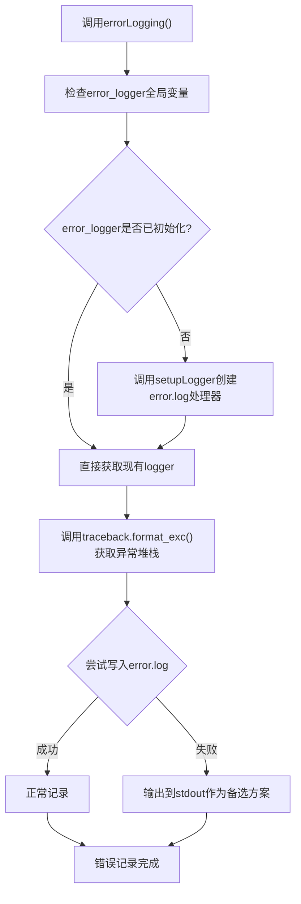
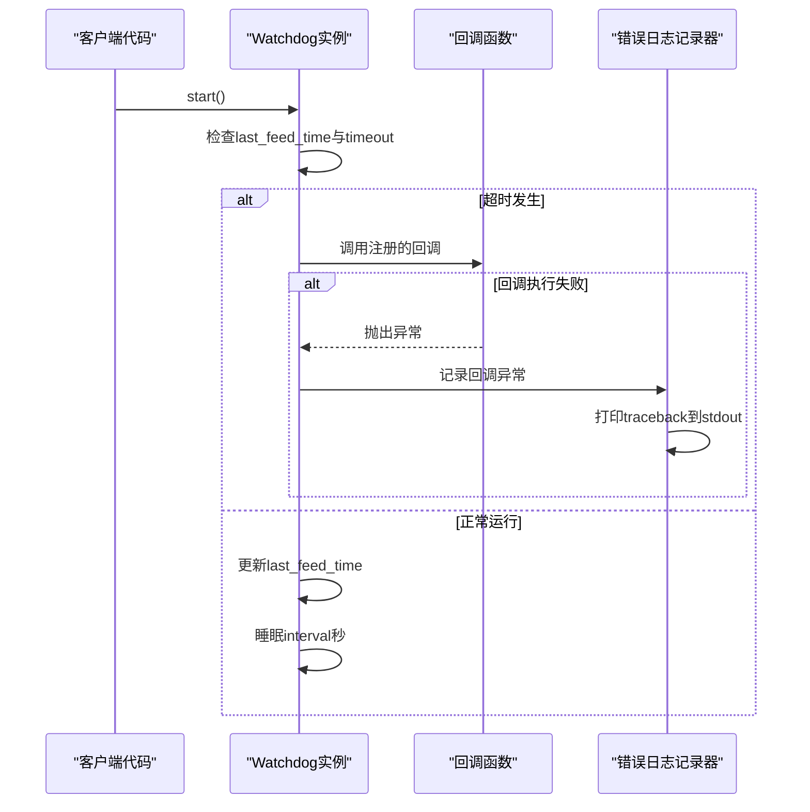
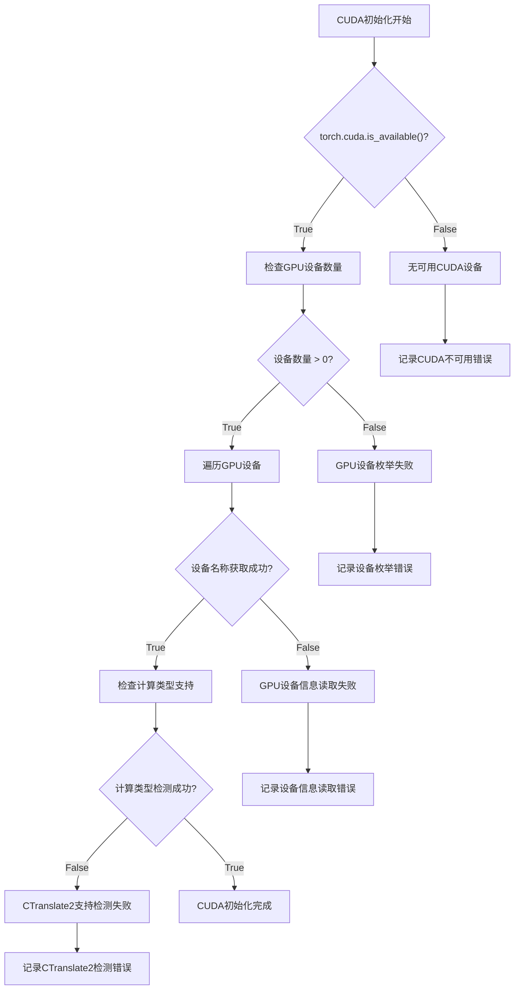
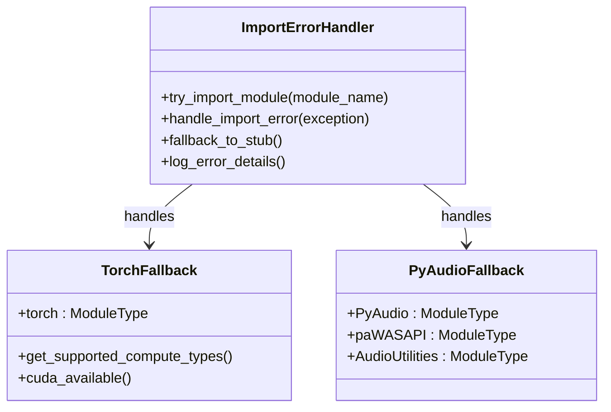
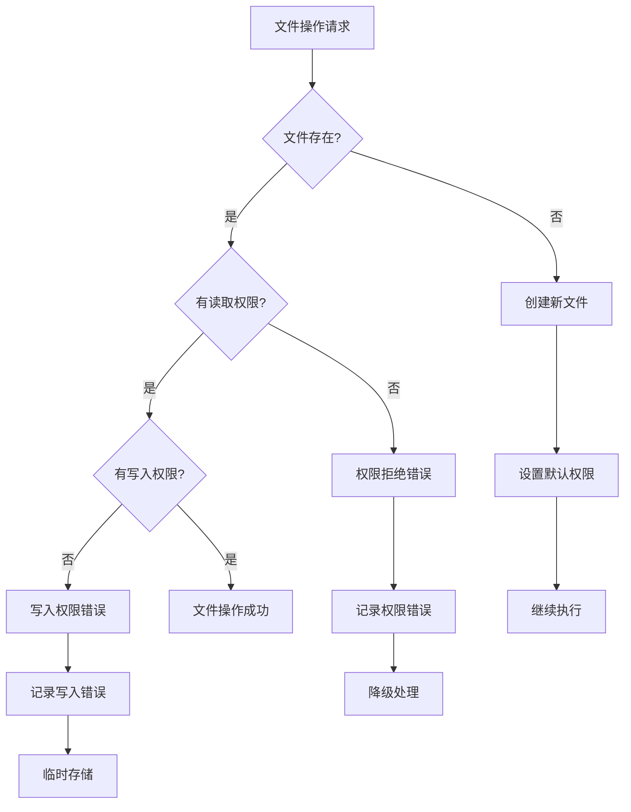
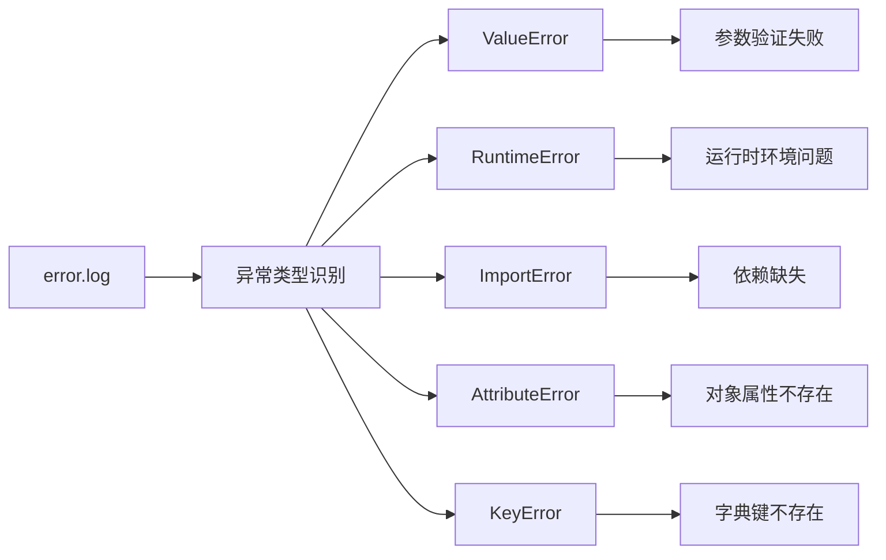
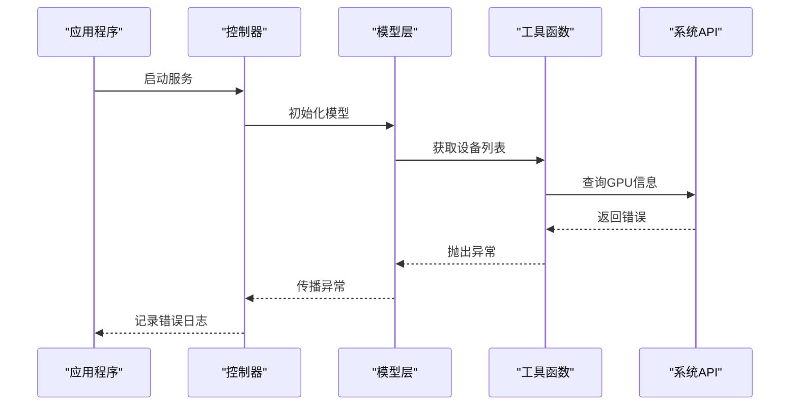
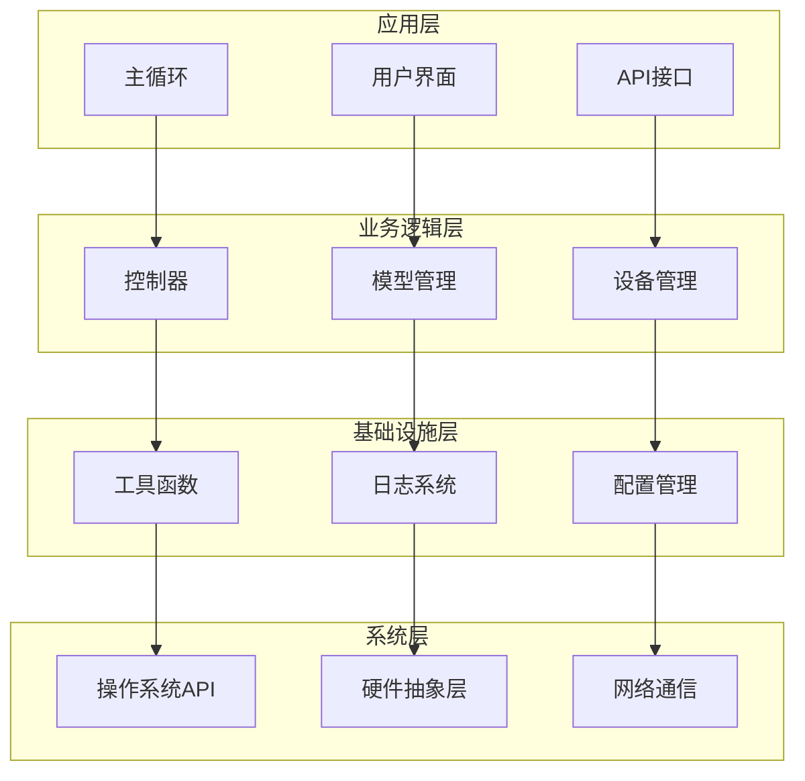
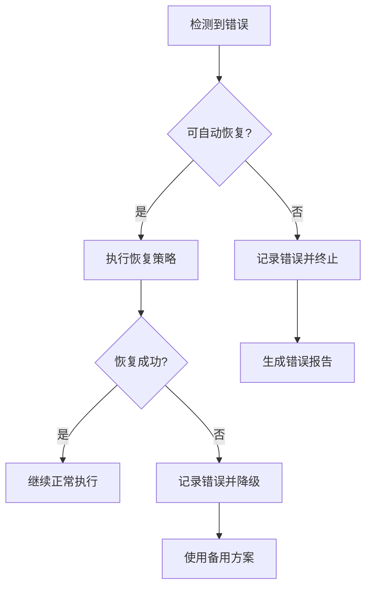
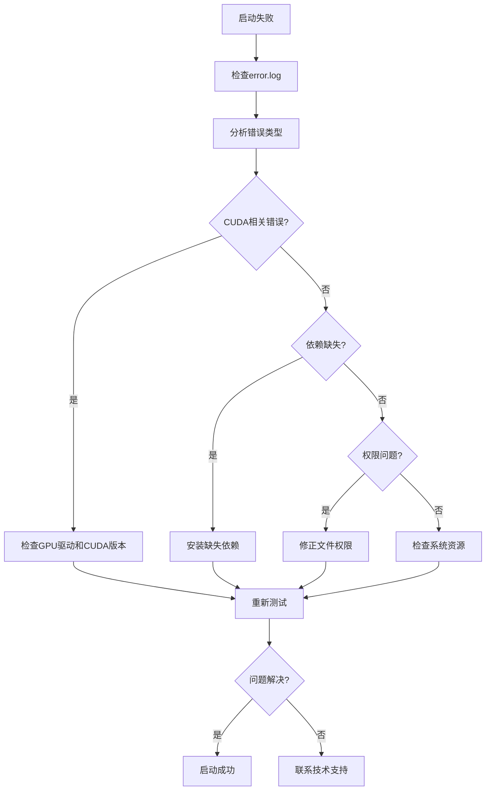

# error.log分析

<cite>
**本文档中引用的文件**
- [utils.py](file://src-python/utils.py)
- [watchdog.py](file://src-python/models/watchdog/watchdog.py)
- [config.py](file://src-python/config.py)
- [controller.py](file://src-python/controller.py)
- [device_manager.py](file://src-python/device_manager.py)
- [model.py](file://src-python/model.py)
- [transcription_whisper.py](file://src-python/models/transcription/transcription_whisper.py)
- [mainloop.py](file://src-python/mainloop.py)
</cite>

## 目录
1. [简介](#简介)
2. [errorLogging函数核心机制](#errorlogging函数核心机制)
3. [Watchdog类超时错误处理](#watchdog类超时错误处理)
4. [常见启动失败错误类型](#常见启动失败错误类型)
5. [错误堆栈追溯方法](#错误堆栈追溯方法)
6. [系统级错误处理架构](#系统级错误处理架构)
7. [故障排除指南](#故障排除指南)
8. [总结](#总结)

## 简介

VRCT项目采用了一套完整的错误记录和处理机制，通过`error.log`文件记录系统运行过程中遇到的各种异常情况。该系统的核心在于`utils.py`中的`errorLogging`函数，它负责捕获和记录程序运行时的异常堆栈跟踪信息，为开发者和用户提供详细的调试信息。

## errorLogging函数核心机制

### 函数实现原理

`errorLogging`函数是整个错误记录系统的核心组件，位于`utils.py`文件中第280行：



**图表来源**
- [utils.py](file://src-python/utils.py#L280-L290)

### 错误记录流程

1. **延迟初始化策略**：`errorLogging`函数采用延迟初始化模式，只有在首次调用时才创建`error_logger`实例
2. **异常堆栈捕获**：使用`traceback.format_exc()`获取当前异常的完整堆栈信息
3. **容错机制**：即使日志记录本身失败，也会将堆栈信息输出到标准输出
4. **UTF-8编码支持**：确保日志文件正确处理Unicode字符

**章节来源**
- [utils.py](file://src-python/utils.py#L280-L290)

## Watchdog类超时错误处理

### Watchdog监控机制

Watchdog类提供了轻量级的超时监控功能，当检测到长时间未收到信号时会触发回调函数：



**图表来源**
- [watchdog.py](file://src-python/models/watchdog/watchdog.py#L47-L56)

### 超时错误日志模式

Watchdog类在超时情况下触发回调时可能产生以下错误日志模式：

| 日志类型 | 触发条件 | 日志特征 | 解决方案 |
|---------|---------|---------|---------|
| 回调异常 | 用户定义的回调函数抛出异常 | `Traceback: ...` + 具体异常信息 | 检查回调函数实现 |
| 线程死锁 | 回调阻塞导致Watchdog无法继续 | `TimeoutError` + 线程状态信息 | 优化回调性能或增加超时 |
| 资源访问冲突 | 回调尝试访问已被释放的资源 | `AttributeError` + 对象状态信息 | 确保资源生命周期管理 |

**章节来源**
- [watchdog.py](file://src-python/models/watchdog/watchdog.py#L47-L56)

## 常见启动失败错误类型

### CUDA初始化失败

CUDA初始化失败是最常见的启动错误之一，主要表现为：



**图表来源**
- [utils.py](file://src-python/utils.py#L107-L130)

#### CUDA相关错误模式

| 错误类型 | 异常信息 | 可能原因 | 解决方法 |
|---------|---------|---------|---------|
| `RuntimeError: CUDA out of memory` | 显存不足 | 模型过大或显存被占用 | 减少模型大小或关闭其他GPU应用 |
| `ModuleNotFoundError: No module named 'torch'` | PyTorch未安装 | 依赖包缺失 | 安装PyTorch: `pip install torch` |
| `ImportError: DLL load failed` | CUDA DLL加载失败 | CUDA版本不匹配 | 安装对应CUDA版本的PyTorch |
| `AttributeError: 'NoneType' object has no attribute 'cuda'` | CUDA对象不存在 | GPU驱动问题 | 更新GPU驱动程序 |

### 依赖库导入错误

依赖库导入错误通常发生在模块初始化阶段：



**图表来源**
- [utils.py](file://src-python/utils.py#L8-L18)
- [device_manager.py](file://src-python/device_manager.py#L5-L23)

#### 导入错误分类

| 模块类型 | 常见错误 | 错误表现 | 修复步骤 |
|---------|---------|---------|---------|
| 核心依赖 | `ModuleNotFoundError` | 模块未找到 | 安装对应依赖包 |
| 可选依赖 | `ImportWarning` | 功能受限但程序可运行 | 忽略警告或安装完整包 |
| 版本冲突 | `ImportError` | 版本不兼容 | 升级或降级相关包 |
| 平台限制 | `PlatformError` | 平台不支持 | 使用平台兼容版本 |

**章节来源**
- [device_manager.py](file://src-python/device_manager.py#L5-L23)

### 文件权限问题

文件权限问题可能导致配置文件读取失败或日志写入受阻：



**图表来源**
- [config.py](file://src-python/config.py#L551-L557)

#### 权限错误模式

| 操作类型 | 错误代码 | 常见场景 | 解决方案 |
|---------|---------|---------|---------|
| 配置文件读取 | `PermissionError` | 配置目录只读 | 修改目录权限或移动配置文件 |
| 日志文件写入 | `IOError` | 日志目录无写权限 | 创建日志目录或更改权限 |
| 模型文件下载 | `FileExistsError` | 下载目录被锁定 | 关闭占用程序或选择其他目录 |
| 插件加载 | `OSError` | 插件文件权限不足 | 使用管理员权限或修改文件权限 |

**章节来源**
- [config.py](file://src-python/config.py#L551-L557)

## 错误堆栈追溯方法

### 分析异常类型

通过分析`error.log`中的异常类型，可以快速定位问题根源：



### 文件路径和行号分析

每个错误堆栈都包含详细的文件路径和行号信息：

| 信息类型 | 示例格式 | 用途 | 分析要点 |
|---------|---------|------|---------|
| 文件路径 | `src-python/utils.py` | 定位源代码位置 | 查看具体函数实现 |
| 行号 | `line 130` | 精确定位错误点 | 结合上下文理解问题 |
| 函数名 | `getComputeDeviceList()` | 识别出错函数 | 分析函数逻辑 |
| 异常类型 | `RuntimeError` | 判断错误性质 | 确定解决方案方向 |

### 堆栈层次分析

复杂的错误通常涉及多层调用：



**图表来源**
- [controller.py](file://src-python/controller.py#L2548-L2549)
- [model.py](file://src-python/model.py#L730-L738)

**章节来源**
- [utils.py](file://src-python/utils.py#L280-L290)
- [controller.py](file://src-python/controller.py#L2548-L2549)

## 系统级错误处理架构

### 多层级错误处理

VRCT采用了分层的错误处理架构：



**图表来源**
- [mainloop.py](file://src-python/mainloop.py#L81-L84)
- [controller.py](file://src-python/controller.py#L8-L10)

### 错误传播机制

错误在不同层级间的传播遵循特定规则：

| 层级 | 处理策略 | 错误类型 | 记录方式 |
|------|---------|---------|---------|
| 应用层 | 终止程序 | 致命错误 | 立即记录并退出 |
| 业务逻辑层 | 恢复或降级 | 可恢复错误 | 记录后继续执行 |
| 基础设施层 | 防御性编程 | 次要错误 | 静默处理或返回默认值 |
| 系统层 | 系统级异常 | 硬件或系统错误 | 记录并通知上层 |

### 自动恢复机制

某些错误可以通过自动恢复机制解决：



**章节来源**
- [controller.py](file://src-python/controller.py#L2548-L2549)
- [device_manager.py](file://src-python/device_manager.py#L130-L134)

## 故障排除指南

### 常见问题诊断流程

当遇到启动失败时，按照以下流程进行诊断：



### 具体问题解决方案

#### CUDA初始化失败

1. **检查GPU状态**
   - 运行`nvidia-smi`查看GPU使用情况
   - 确认GPU驱动程序版本兼容

2. **验证CUDA安装**
   ```bash
   python -c "import torch; print(torch.cuda.is_available())"
   ```

3. **调整内存设置**
   - 减少模型大小
   - 关闭其他GPU占用程序

#### 依赖库问题

1. **重建虚拟环境**
   ```bash
   # 删除现有环境
   rm -rf .venv
   
   # 创建新环境
   python -m venv .venv
   
   # 安装依赖
   source .venv/bin/activate
   pip install -r requirements.txt
   ```

2. **检查包版本兼容性**
   - 查看`requirements.txt`中的版本要求
   - 使用`pip list`验证实际安装版本

#### 文件权限问题

1. **检查目录权限**
   ```bash
   # 检查配置目录权限
   ls -la ~/.vrct/
   
   # 修正权限
   chmod 755 ~/.vrct/
   ```

2. **验证写入权限**
   ```bash
   # 测试日志写入
   echo "test" > ~/.vrct/test.log
   ```

### 性能优化建议

为了减少错误发生的可能性，建议采取以下措施：

| 优化方面 | 具体措施 | 预期效果 |
|---------|---------|---------|
| 内存管理 | 合理设置模型大小 | 减少显存溢出风险 |
| 网络连接 | 添加重试机制 | 提高网络错误容忍度 |
| 文件操作 | 使用原子操作 | 避免文件损坏 |
| 异常处理 | 增强防御性编程 | 提高系统稳定性 |

**章节来源**
- [utils.py](file://src-python/utils.py#L107-L130)
- [device_manager.py](file://src-python/device_manager.py#L130-L134)

## 总结

VRCT项目的error.log分析系统通过多层次的错误处理机制，为用户提供了全面的问题诊断能力。核心特点包括：

1. **统一的错误记录机制**：`errorLogging`函数提供了一致的异常捕获和记录方式
2. **智能的错误分类**：通过异常类型和堆栈信息快速定位问题根源
3. **完善的故障恢复**：多层次的错误处理确保系统的稳定运行
4. **详细的调试信息**：完整的堆栈跟踪帮助开发者快速解决问题

通过理解和掌握这些错误处理机制，用户可以更有效地诊断和解决VRCT运行过程中遇到的各种问题，提高系统的可靠性和用户体验。