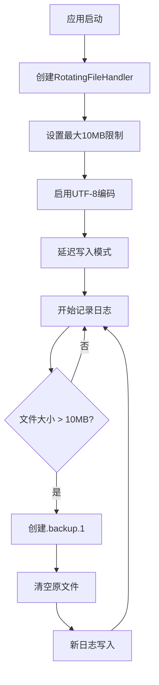
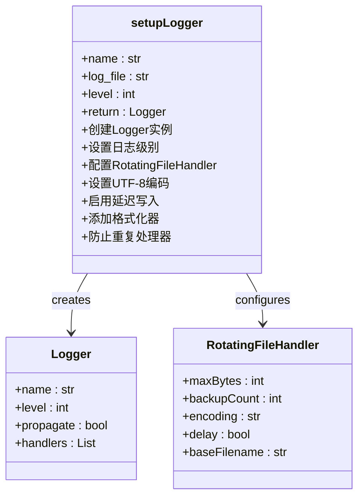
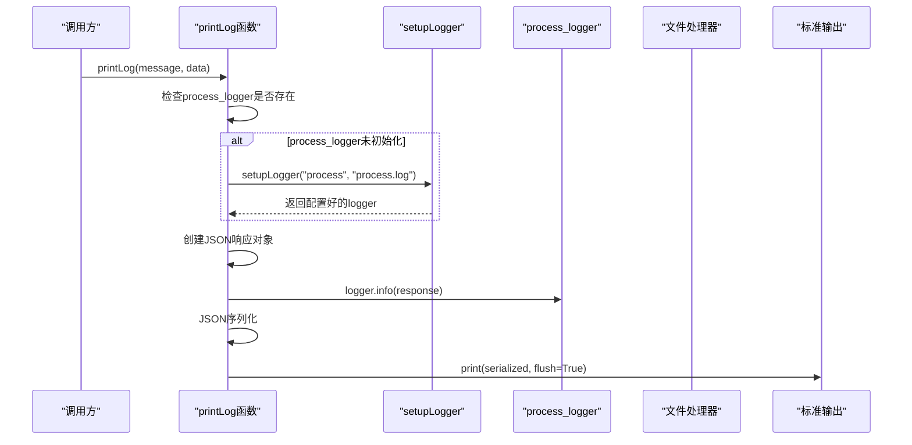
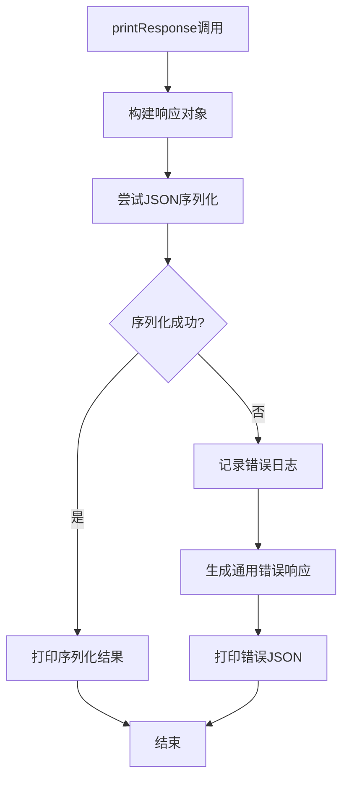
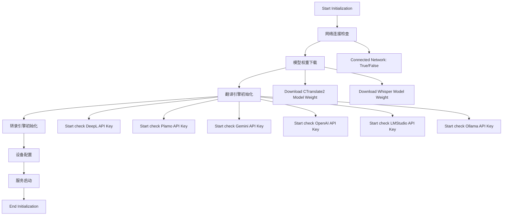
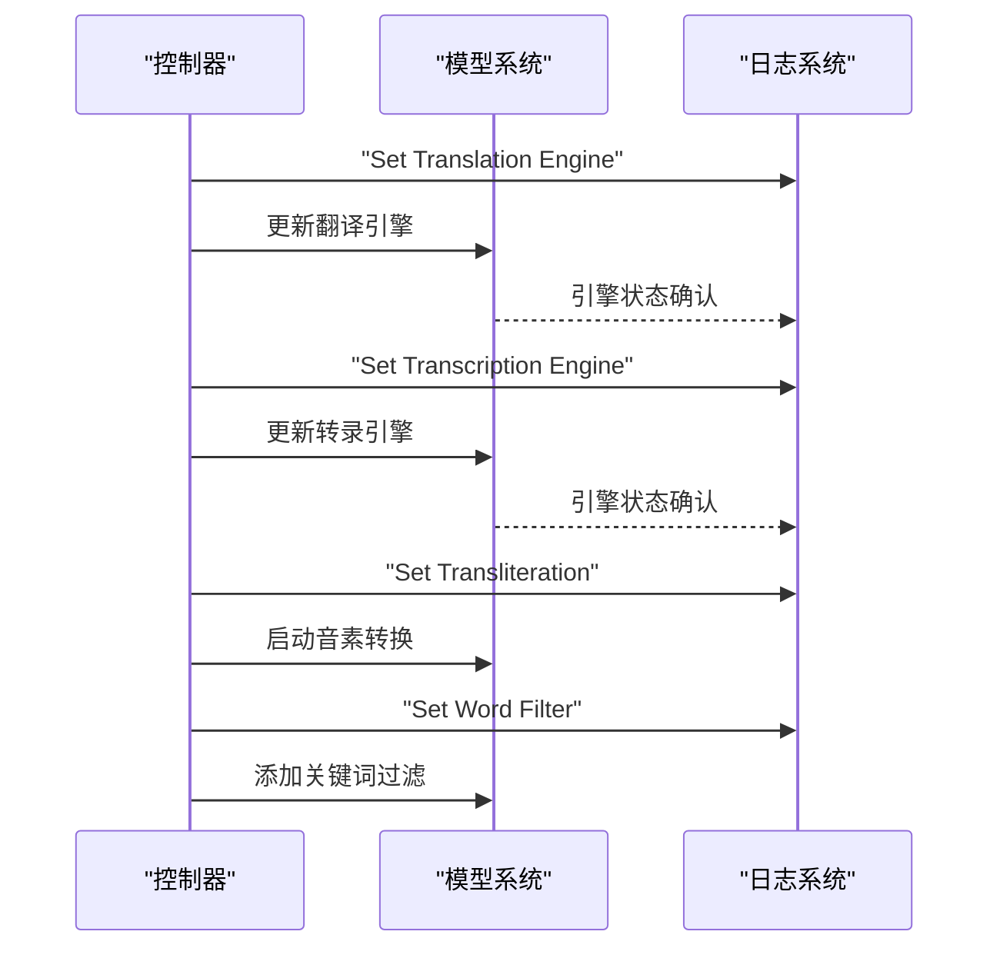
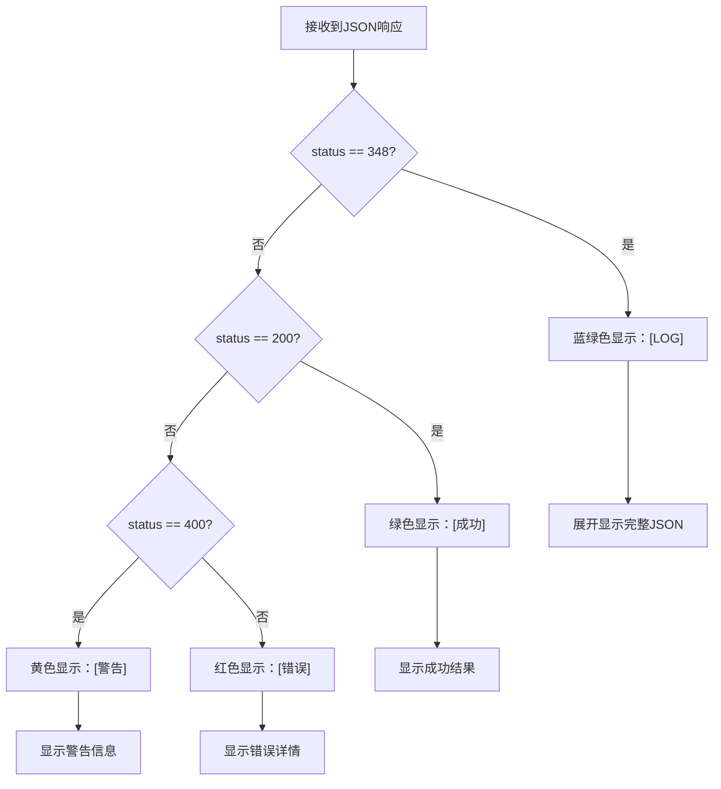
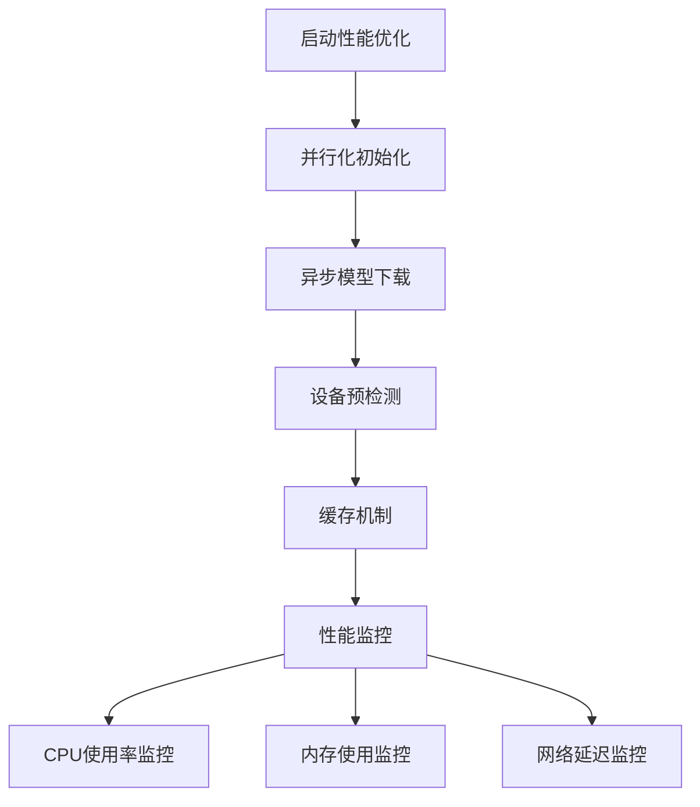
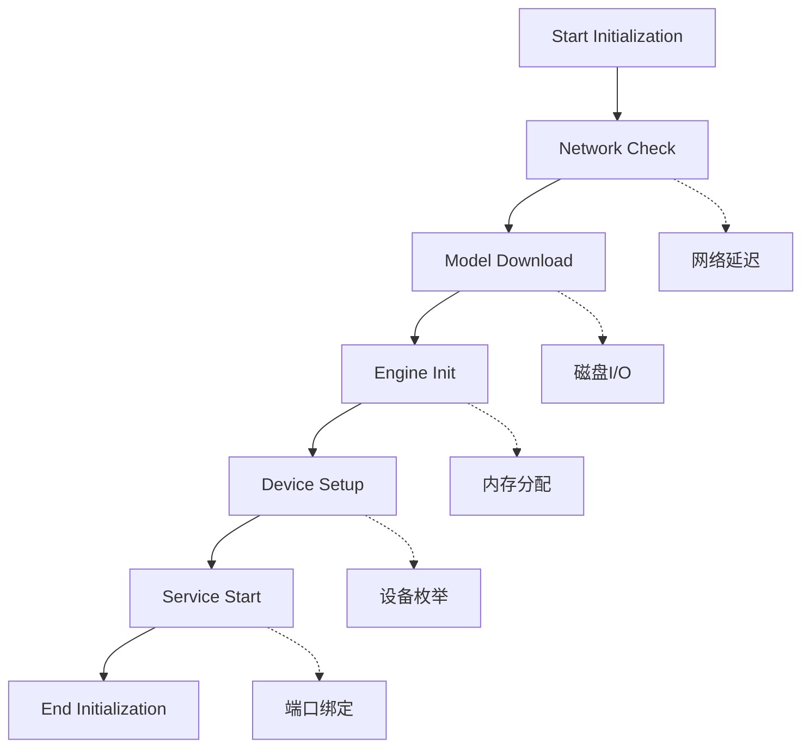

# process.log分析

<cite>
**本文档中引用的文件**
- [utils.py](file://src-python/utils.py)
- [controller.py](file://src-python/controller.py)
- [test_client.py](file://src-python/test_client.py)
- [utils.md](file://src-python/docs/utils.md)
- [test_client.md](file://src-python/docs/test_client.md)
</cite>

## 目录
1. [简介](#简介)
2. [process.log文件结构](#processlog文件结构)
3. [日志条目格式详解](#日志条目格式详解)
4. [核心日志函数分析](#核心日志函数分析)
5. [启动过程关键阶段日志](#启动过程关键阶段日志)
6. [状态码348的含义](#状态码348的含义)
7. [实际日志示例分析](#实际日志示例分析)
8. [故障排除指南](#故障排除指南)
9. [总结](#总结)

## 简介

process.log是VRCT项目的核心日志文件，记录了应用程序从启动到运行的完整生命周期。该日志文件采用结构化JSON格式，通过utils.py模块中的专用函数生成，为开发者和用户提供详细的系统运行状态跟踪。

本文档将深入分析process.log的结构、日志条目的格式规范，以及如何通过日志内容识别系统的关键运行阶段和潜在问题。

## process.log文件结构

### 文件位置和特性

process.log文件位于应用程序根目录，具有以下特性：

- **文件路径**: `process.log`
- **编码格式**: UTF-8
- **轮转机制**: 最大10MB，保留1个备份文件
- **写入方式**: 延迟写入（首次写入时打开文件）

### 日志轮转机制



**图表来源**
- [utils.py](file://src-python/utils.py#L205-L211)

**章节来源**
- [utils.py](file://src-python/utils.py#L184-L222)

## 日志条目格式详解

### 标准日志格式

process.log采用统一的结构化格式，包含时间戳、组件名称、日志级别和消息内容：

```
%(asctime)s - %(name)s - %(levelname)s - %(message)s
```

### 结构化日志消息

当使用`printLog`函数时，日志消息被封装为JSON对象：

```json
{
    "status": 348,
    "log": "日志消息描述",
    "data": "附加数据信息"
}
```

### 日志级别映射

| 日志级别 | 数值 | 用途 |
|---------|------|------|
| DEBUG | 10 | 详细调试信息 |
| INFO | 20 | 一般信息记录 |
| WARNING | 30 | 警告但非错误 |
| ERROR | 40 | 错误但可恢复 |
| CRITICAL | 50 | 严重错误 |

**章节来源**
- [utils.py](file://src-python/utils.py#L215-L216)
- [utils.py](file://src-python/utils.py#L233-L237)

## 核心日志函数分析

### setupLogger函数

`setupLogger`函数负责创建和配置日志记录器：



**图表来源**
- [utils.py](file://src-python/utils.py#L192-L222)

### printLog函数

`printLog`函数生成结构化的过程日志：



**图表来源**
- [utils.py](file://src-python/utils.py#L227-L240)

### printResponse函数

`printResponse`函数处理API响应日志：



**图表来源**
- [utils.py](file://src-python/utils.py#L242-L275)

**章节来源**
- [utils.py](file://src-python/utils.py#L192-L275)

## 启动过程关键阶段日志

### 初始化阶段日志模式

VRCT应用程序的启动过程分为四个主要阶段，每个阶段都有特定的日志模式：



**图表来源**
- [controller.py](file://src-python/controller.py#L2892-L3133)

### 配置加载阶段

配置加载阶段的关键日志条目：

| 日志消息 | 描述 | 正常行为 |
|---------|------|----------|
| `"Start Initialization"` | 开始初始化 | 必须出现 |
| `"Connected Network: True/False"` | 网络连接状态 | 根据网络环境 |
| `"Download CTranslate2 Model Weight"` | 下载翻译模型 | 网络可用时 |
| `"Download Whisper Model Weight"` | 下载转录模型 | 网络可用时 |

### 设备初始化阶段

设备初始化的关键日志：

| 日志消息 | 描述 | 潜在问题 |
|---------|------|----------|
| `"Init Device Manager"` | 设备管理器初始化 | 设备枚举失败 |
| `"Init Auto Device Selection"` | 自动设备选择 | 音频设备不可用 |
| `"Init OSC Receive"` | OSC接收初始化 | 端口冲突 |
| `"Init WebSocket Server"` | WebSocket服务器初始化 | 端口占用 |

### 模型加载阶段

模型加载的关键日志模式：



**图表来源**
- [controller.py](file://src-python/controller.py#L3056-L3076)

**章节来源**
- [controller.py](file://src-python/controller.py#L2892-L3133)

## 状态码348的含义

### 状态码348的特殊用途

状态码348是VRCT项目特有的标识符，专门用于标记过程日志消息：

- **标识类型**: 过程日志
- **颜色标识**: 蓝绿色（在测试客户端中）
- **处理方式**: 全文展开显示
- **用途**: 区分普通API响应和系统内部过程消息

### 测试客户端中的348状态码处理



**图表来源**
- [test_client.py](file://src-python/test_client.py#L111-L240)

### 348状态码的应用场景

| 应用场景 | 示例日志 | 目的 |
|---------|----------|------|
| 初始化进度 | `"Start Initialization"` | 跟踪启动进程 |
| 配置更新 | `"Set Translation Engine"` | 记录配置变更 |
| 状态检查 | `"Check Software Updated"` | 监控系统状态 |
| 错误诊断 | `"VRAM error detected"` | 问题定位 |

**章节来源**
- [test_client.py](file://src-python/test_client.py#L111-L240)
- [utils.py](file://src-python/utils.py#L233-L237)

## 实际日志示例分析

### 完整启动流程示例

以下是典型的VRCT启动过程日志序列：

```
2024-12-15 09:30:15,123 - process - INFO - Start Initialization
2024-12-15 09:30:15,125 - process - INFO - Connected Network: True
2024-12-15 09:30:15,127 - process - INFO - Download CTranslate2 Model Weight
2024-12-15 09:30:15,129 - process - INFO - Download Whisper Model Weight
2024-12-15 09:30:15,131 - process - INFO - Init Translation Engine Status
2024-12-15 09:30:15,133 - process - INFO - Start check DeepL API Key
2024-12-15 09:30:16,456 - process - INFO - DeepL API Key is valid
2024-12-15 09:30:16,458 - process - INFO - Set Translation Engine
2024-12-15 09:30:16,460 - process - INFO - Set Transcription Engine
2024-12-15 09:30:16,462 - process - INFO - Set Transliteration
2024-12-15 09:30:16,464 - process - INFO - Set Word Filter
2024-12-15 09:30:16,466 - process - INFO - Check Software Updated
2024-12-15 09:30:16,468 - process - INFO - Init Logger
2024-12-15 09:30:16,470 - process - INFO - Init OSC Receive
2024-12-15 09:30:16,472 - process - INFO - Init Device Manager
2024-12-15 09:30:16,474 - process - INFO - Init Auto Device Selection
2024-12-15 09:30:16,476 - process - INFO - Init Overlay
2024-12-15 09:30:16,478 - process - INFO - Init WebSocket Server
2024-12-15 09:30:16,480 - process - INFO - Update settings
2024-12-15 09:30:16,482 - process - INFO - End Initialization
```

### 关键节点时间分析

通过日志时间戳可以识别系统的性能瓶颈：

```mermaid
gantt
title VRCT启动时间线分析
dateFormat X
axisFormat %S
section 初始化阶段
Start Initialization :0, 1
Network Check :1, 2
Model Download :2, 15
Engine Init :15, 20
Device Setup :20, 25
Service Start :25, 30
Complete :30, 31
```



### 异常情况日志示例

#### 网络连接失败

```
2024-12-15 09:30:15,125 - process - INFO - Connected Network: False
2024-12-15 09:30:15,127 - process - INFO - Init Translation Engine Status
2024-12-15 09:30:15,129 - process - INFO - Start check DeepL API Key
2024-12-15 09:30:16,456 - process - INFO - DeepL API Key is invalid
```

#### 模型加载失败

```
2024-12-15 09:30:15,127 - process - INFO - Download CTranslate2 Model Weight
2024-12-15 09:30:45,123 - process - INFO - VRAM error detected, reverting device setting
```

**章节来源**
- [controller.py](file://src-python/controller.py#L2892-L3133)

## 故障排除指南

### 常见启动问题识别

#### 1. 启动卡顿问题

**症状**: process.log中某些阶段耗时异常

**排查步骤**:
1. 检查时间戳间隔
2. 查看是否有重复的日志条目
3. 分析网络连接状态

**解决方案**:
- 检查网络连接稳定性
- 清理磁盘空间
- 重启应用程序

#### 2. 模型加载失败

**症状**: 模型下载或初始化失败

**排查日志模式**:
```
Download CTranslate2 Model Weight
Download Whisper Model Weight
VRAM error detected
```

**解决方案**:
- 检查GPU内存使用情况
- 降低模型权重类型
- 更新显卡驱动程序

#### 3. 设备初始化失败

**症状**: 音频设备或OSC服务无法启动

**排查日志模式**:
```
Init Device Manager
Init OSC Receive
Init WebSocket Server
WebSocket server host or port is not available
```

**解决方案**:
- 检查端口占用情况
- 以管理员权限运行
- 检查防火墙设置

### 性能优化建议

#### 日志文件管理

| 优化项 | 建议 | 说明 |
|-------|------|------|
| 文件大小 | 保持在10MB以内 | 避免轮转导致的性能影响 |
| 存储位置 | SSD存储 | 提高写入速度 |
| 备份策略 | 定期清理旧日志 | 防止磁盘空间不足 |

#### 启动性能优化



### 调试技巧

#### 1. 时间戳分析

通过比较相邻日志条目的时间差，识别性能瓶颈：

```python
# 示例分析脚本结构
import json
from datetime import datetime

def analyze_startup_performance(log_file):
    timestamps = []
    messages = []
    
    with open(log_file, 'r', encoding='utf-8') as f:
        for line in f:
            if 'INFO -' in line:
                parts = line.strip().split(' - ')
                if len(parts) >= 4:
                    dt = datetime.strptime(parts[0], '%Y-%m-%d %H:%M:%S,%f')
                    message = parts[3]
                    timestamps.append(dt)
                    messages.append(message)
    
    # 计算时间间隔
    intervals = [(timestamps[i+1] - timestamps[i]).total_seconds() 
                for i in range(len(timestamps)-1)]
    
    return intervals, messages
```

#### 2. 关键路径追踪

识别启动过程中的关键依赖关系：



**章节来源**
- [controller.py](file://src-python/controller.py#L2892-L3133)
- [utils.py](file://src-python/utils.py#L184-L240)

## 总结

process.log文件是VRCT项目的重要监控工具，通过结构化的JSON格式提供了完整的系统运行状态跟踪。理解其结构和日志模式对于：

1. **系统监控**: 实时跟踪应用程序状态
2. **故障诊断**: 快速定位问题根源
3. **性能优化**: 识别性能瓶颈
4. **开发调试**: 理解系统行为

### 关键要点回顾

- **结构化格式**: JSON格式确保数据的一致性和可解析性
- **状态码348**: 专门标识过程日志，便于区分系统消息和API响应
- **时间戳精度**: 毫秒级时间戳支持精确的性能分析
- **轮转机制**: 10MB限制配合备份策略，平衡存储需求和历史记录

### 最佳实践建议

1. **定期检查**: 监控process.log文件大小和内容
2. **自动化分析**: 开发脚本自动分析启动时间和性能指标
3. **异常监控**: 设置告警机制识别异常日志模式
4. **版本对比**: 比较不同版本的启动日志，评估改进效果

通过深入理解process.log的结构和内容，开发者和运维人员能够更好地维护VRCT应用程序，确保其稳定可靠的运行。