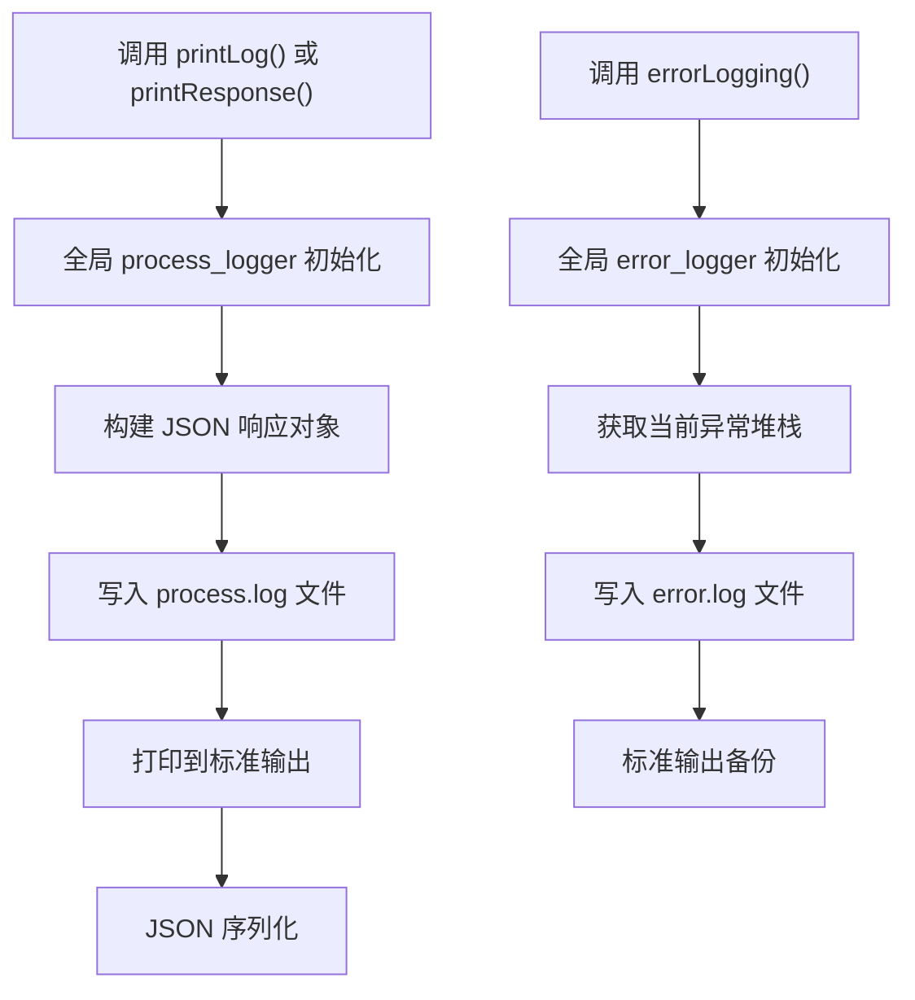
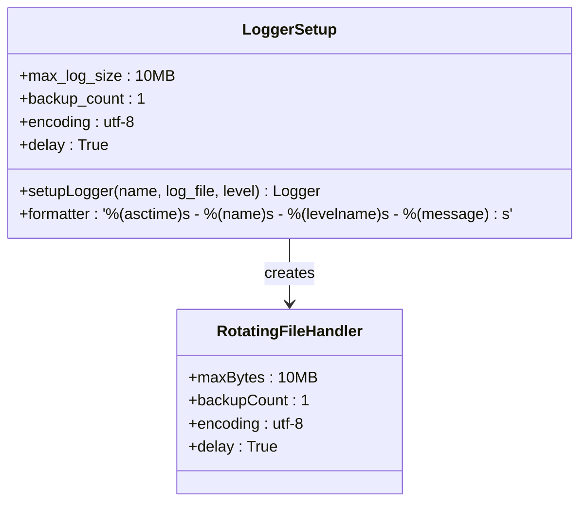
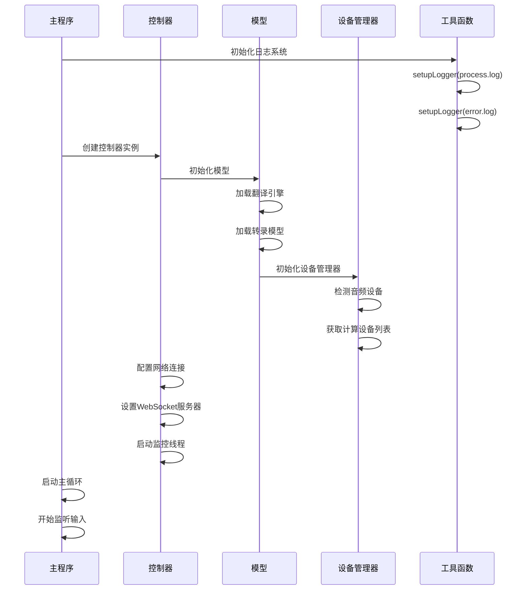
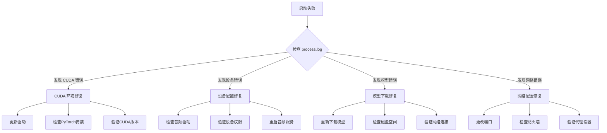

# 启动日志分析

<cite>
**本文档中引用的文件**
- [utils.py](file://src-python/utils.py)
- [mainloop.py](file://src-python/mainloop.py)
- [controller.py](file://src-python/controller.py)
- [model.py](file://src-python/model.py)
- [config.py](file://src-python/config.py)
- [device_manager.py](file://src-python/device_manager.py)
- [requirements.txt](file://requirements.txt)
- [requirements_cuda.txt](file://requirements_cuda.txt)
- [install.bat](file://install.bat)
- [build_cuda.bat](file://build_cuda.bat)
</cite>

## 目录
1. [简介](#简介)
2. [日志文件概述](#日志文件概述)
3. [日志生成机制](#日志生成机制)
4. [启动过程分析](#启动过程分析)
5. [关键日志条目](#关键日志条目)
6. [常见启动失败场景](#常见启动失败场景)
7. [故障排除指南](#故障排除指南)
8. [最佳实践](#最佳实践)

## 简介

VRCT是一个基于Python的实时语音翻译应用，其启动过程涉及多个组件的初始化，包括依赖库加载、设备检测、配置解析和模型准备。当启动失败时，process.log和error.log文件提供了详细的诊断信息。本指南将帮助您理解这些日志文件的结构，识别关键的日志条目，并根据错误信息快速定位和解决问题。

## 日志文件概述

### process.log 文件

process.log是主要的应用程序日志文件，记录了启动过程中的所有重要事件和状态变化。该文件采用JSON格式，包含以下核心字段：

| 字段 | 描述 | 示例值 |
|------|------|--------|
| status | 状态码（固定为348） | 348 |
| log | 日志消息描述 | "Application started" |
| data | 附加上下文信息 | "{'model_type': 'whisper', 'weight': 'medium'}" |

### error.log 文件

error.log专门记录异常和错误信息，包含完整的堆栈跟踪。该文件采用纯文本格式，便于调试和问题定位。

## 日志生成机制

### utils.py 中的日志函数

项目的核心日志功能由utils.py模块提供，包含三个关键函数：



**图表来源**
- [utils.py](file://src-python/utils.py#L227-L291)

#### setupLogger 函数

setupLogger函数负责创建和配置日志记录器：



**图表来源**
- [utils.py](file://src-python/utils.py#L192-L222)

**章节来源**
- [utils.py](file://src-python/utils.py#L192-L291)

### 日志级别和格式

| 函数 | 日志级别 | 输出目标 |
|------|----------|----------|
| printLog() | INFO | process.log + stdout |
| printResponse() | INFO | process.log + stdout |
| errorLogging() | ERROR | error.log + stdout |

## 启动过程分析

### 启动序列图



**图表来源**
- [mainloop.py](file://src-python/mainloop.py#L578-L588)
- [controller.py](file://src-python/controller.py#L11-L28)
- [model.py](file://src-python/model.py#L93-L142)

### 关键初始化阶段

启动过程分为以下主要阶段：

1. **基础环境准备**（第1-5分钟）
   - Python环境验证
   - 依赖库导入
   - 日志系统初始化

2. **核心组件初始化**（第5-15分钟）
   - 控制器实例创建
   - 模型系统初始化
   - 配置加载和验证

3. **设备检测与配置**（第15-30分钟）
   - 音频设备扫描
   - 计算设备检测（CPU/CUDA）
   - 网络连接测试

4. **服务启动**（第30-45分钟）
   - WebSocket服务器启动
   - OSC通信初始化
   - 实时监控线程启动

**章节来源**
- [controller.py](file://src-python/controller.py#L3069-L3133)
- [mainloop.py](file://src-python/mainloop.py#L578-L588)

## 关键日志条目

### 依赖库加载阶段

#### CUDA环境检测

```json
{
    "status": 348,
    "log": "CUDA Environment Check",
    "data": "torch_available: True, cuda_available: True, device_count: 2"
}
```

**正常情况：**
- torch可用性检查成功
- CUDA驱动检测正常
- 可用GPU数量显示

**异常情况：**
- torch不可用：可能是PyTorch安装不完整
- CUDA不可用：驱动版本过低或NVIDIA驱动未安装
- 设备数量为0：无可用GPU或驱动异常

#### 计算设备列表

```json
{
    "status": 348,
    "log": "Compute Device List",
    "data": "[{\"device\": \"cpu\", \"device_index\": 0, \"device_name\": \"cpu\", \"compute_types\": [\"auto\", \"float32\"]}, {\"device\": \"cuda\", \"device_index\": 0, \"device_name\": \"GeForce RTX 3080\", \"compute_types\": [\"int8_bfloat16\", \"float16\", \"float32\"]}]"
}
```

**正常情况：** 显示CPU和至少一个GPU设备

**异常情况：**
- 仅显示CPU：CUDA环境配置错误
- GPU设备名称异常：驱动或硬件问题
- 计算类型为空：CTranslate2库问题

**章节来源**
- [utils.py](file://src-python/utils.py#L92-L167)

### 设备初始化阶段

#### 音频设备检测

```json
{
    "status": 348,
    "log": "Audio Device Detection",
    "data": "{\"mic_devices\": [{\"index\": 0, \"name\": \"Microphone (Realtek High Definition Audio)\"}], \"speaker_devices\": [{\"index\": 1, \"name\": \"Speakers (Realtek High Definition Audio)\"}]}"
}
```

**正常情况：** 检测到至少一个麦克风和扬声器设备

**异常情况：**
- 设备列表为空：音频驱动问题或设备未连接
- 设备名称异常：驱动程序损坏
- 默认设备未找到：系统音频设置问题

#### WebSocket服务器状态

```json
{
    "status": 348,
    "log": "WebSocket Server Status",
    "data": "{\"host\": \"localhost\", \"port\": 8765, \"available\": true}"
}
```

**正常情况：** 服务器可访问且端口可用

**异常情况：**
- host或port无效：网络配置错误
- available: false：端口被占用或权限不足

**章节来源**
- [device_manager.py](file://src-python/device_manager.py#L140-L200)
- [controller.py](file://src-python/controller.py#L3121-L3127)

### 配置解析阶段

#### 配置文件加载

```json
{
    "status": 348,
    "log": "Configuration Loaded",
    "data": "{\"version\": \"1.2.3\", \"compute_mode\": \"auto\", \"translation_engine\": \"ctranslate2\"}"
}
```

**正常情况：** 配置文件成功加载，所有参数有效

**异常情况：**
- 配置文件不存在：首次运行或文件被删除
- 配置格式错误：JSON语法问题
- 参数值无效：超出允许范围

#### 模型权重检查

```json
{
    "status": 348,
    "log": "Model Weight Check",
    "data": "{\"whisper_medium\": true, \"ctranslate2_base\": false, \"whisper_large\": false}"
}
```

**正常情况：** 所需模型权重文件存在

**异常情况：**
- 权重文件缺失：需要重新下载
- 文件损坏：MD5校验失败
- 下载路径错误：磁盘空间不足

**章节来源**
- [config.py](file://src-python/config.py#L1-L200)

## 常见启动失败场景

### CUDA环境配置错误

#### 场景1：PyTorch安装问题

**日志特征：**
```
ERROR - error.log - ImportError: No module named 'torch'
```

**解决方案：**
1. 检查requirements_cuda.txt中的PyTorch版本
2. 运行 `pip install -r requirements_cuda.txt`
3. 验证CUDA工具包安装

#### 场景2：CUDA驱动版本不兼容

**日志特征：**
```
ERROR - error.log - RuntimeError: CUDA out of memory
```

**解决方案：**
1. 更新NVIDIA驱动到最新版本
2. 检查CUDA Toolkit版本兼容性
3. 减少模型内存使用

#### 场景3：GPU设备检测失败

**日志特征：**
```json
{
    "status": 348,
    "log": "Compute Device List",
    "data": "[{\"device\": \"cpu\", \"device_index\": 0, \"device_name\": \"cpu\", \"compute_types\": [\"auto\", \"float32\"]}]"
}
```

**解决方案：**
1. 检查GPU是否被BIOS禁用
2. 重启系统重新检测硬件
3. 更新GPU驱动程序

### 模型文件缺失

#### 场景1：转录模型权重丢失

**日志特征：**
```
ERROR - error.log - FileNotFoundError: whisper_medium.bin not found
```

**解决方案：**
1. 运行模型下载脚本
2. 检查下载路径权限
3. 验证网络连接

#### 场景2：翻译模型权重损坏

**日志特征：**
```json
{
    "status": 348,
    "log": "Model Weight Check",
    "data": "{\"ctranslate2_base\": false}"
}
```

**解决方案：**
1. 删除损坏的权重文件
2. 重新下载模型
3. 检查磁盘空间

### 设备初始化失败

#### 场景1：音频设备访问被拒绝

**日志特征：**
```
ERROR - error.log - PermissionError: Access denied to audio device
```

**解决方案：**
1. 以管理员权限运行
2. 检查防病毒软件设置
3. 重启音频服务

#### 场景2：WebSocket端口冲突

**日志特征：**
```json
{
    "status": 348,
    "log": "WebSocket server host or port is not available"
}
```

**解决方案：**
1. 更改WebSocket端口
2. 关闭占用端口的程序
3. 检查防火墙设置

**章节来源**
- [utils.py](file://src-python/utils.py#L280-L291)
- [controller.py](file://src-python/controller.py#L3069-L3133)

## 故障排除指南

### 诊断步骤

#### 第一步：检查基本系统要求

1. **操作系统兼容性**
   - Windows 10/11 64位
   - 最新系统更新

2. **Python环境**
   - Python 3.8+
   - pip包管理器

3. **硬件要求**
   - 至少8GB RAM
   - 支持CUDA的GPU（可选）

#### 第二步：分析process.log

使用以下命令过滤关键日志：
```bash
# 查看最近的启动日志
tail -n 100 process.log

# 搜索特定错误类型
grep -i "error\|fail\|exception" process.log
```

#### 第三步：检查error.log

```bash
# 查看完整的错误堆栈
cat error.log

# 按时间排序查看最新错误
sort -k1,1 -k2,2 error.log
```

#### 第四步：验证依赖项

```bash
# 检查Python包安装
pip list | grep -E "(torch|ctranslate2|numpy)"

# 验证CUDA安装
nvidia-smi
```

### 常见问题解决流程



### 自动化诊断脚本

创建诊断脚本收集关键信息：

```python
import json
import os
import sys
from utils import getComputeDeviceList, errorLogging

def diagnose_startup():
    """运行启动诊断"""
    print("VRCT 启动诊断报告")
    print("=" * 50)
    
    # 检查日志文件
    for log_file in ['process.log', 'error.log']:
        if os.path.exists(log_file):
            print(f"✓ {log_file} 存在")
        else:
            print(f"✗ {log_file} 不存在")
    
    # 检查CUDA环境
    try:
        devices = getComputeDeviceList()
        print(f"✓ 检测到 {len(devices)} 个计算设备")
        for device in devices:
            print(f"  - {device['device_name']} ({device['device']})")
    except Exception as e:
        print(f"✗ CUDA环境检测失败: {e}")
        errorLogging()
    
    # 检查关键配置
    config_path = os.path.join(os.getcwd(), 'config.json')
    if os.path.exists(config_path):
        try:
            with open(config_path, 'r', encoding='utf-8') as f:
                config = json.load(f)
            print("✓ 配置文件加载成功")
        except Exception as e:
            print(f"✗ 配置文件加载失败: {e}")
    else:
        print("✗ 配置文件不存在")

if __name__ == "__main__":
    diagnose_startup()
```

**章节来源**
- [utils.py](file://src-python/utils.py#L92-L167)

## 最佳实践

### 日志管理策略

#### 日志轮转配置

项目使用RotatingFileHandler实现日志轮转：

| 参数 | 值 | 说明 |
|------|-----|------|
| maxBytes | 10MB | 单个日志文件最大大小 |
| backupCount | 1 | 保留的备份文件数量 |
| encoding | utf-8 | 文件编码格式 |
| delay | True | 延迟打开文件 |

#### 日志清理建议

1. **定期清理**：每月清理一次旧日志文件
2. **压缩归档**：将超过30天的日志文件压缩存储
3. **监控空间**：确保日志目录有足够的磁盘空间

### 启动优化

#### 延迟初始化策略

```python
# 在需要时才初始化重型组件
def ensure_initialized(self):
    if not getattr(self, '_inited', False):
        try:
            self.init()
        except Exception:
            errorLogging()
```

#### 并行初始化

```python
# 使用多线程并行初始化
threads = []
for initializer in initializers:
    thread = Thread(target=initializer)
    threads.append(thread)
    thread.start()

for thread in threads:
    thread.join()
```

### 错误恢复机制

#### 自动重试策略

```python
def retry_operation(operation, max_attempts=3):
    for attempt in range(max_attempts):
        try:
            return operation()
        except Exception as e:
            if attempt == max_attempts - 1:
                raise
            time.sleep(2 ** attempt)  # 指数退避
```

#### 降级模式

当高级功能不可用时，自动启用基础功能：

```python
if not torch_available:
    config.TRANSLATION_ENGINE = 'whisper'
    config.COMPUTE_MODE = 'cpu'
```

### 监控和告警

#### 关键指标监控

| 指标 | 正常范围 | 异常阈值 |
|------|----------|----------|
| 启动时间 | < 60秒 | > 120秒 |
| 内存使用 | < 2GB | > 4GB |
| GPU利用率 | 20-80% | < 10% 或 > 90% |
| 错误率 | < 1% | > 5% |

#### 健康检查端点

```python
@app.route('/health')
def health_check():
    return {
        'status': 'healthy',
        'timestamp': datetime.now(),
        'gpu_available': torch.cuda.is_available(),
        'memory_usage': psutil.virtual_memory().percent,
        'disk_space': psutil.disk_usage('.').percent
    }
```

**章节来源**
- [utils.py](file://src-python/utils.py#L192-L222)
- [model.py](file://src-python/model.py#L143-L153)

## 结论

通过深入理解VRCT的日志系统和启动过程，您可以更有效地诊断和解决启动失败问题。关键要点包括：

1. **日志文件的重要性**：process.log提供详细的启动流程信息，error.log记录异常堆栈
2. **分阶段诊断**：按依赖加载、设备初始化、配置解析、服务启动的顺序排查
3. **常见问题模式**：CUDA环境、模型文件、设备权限是最常见的失败原因
4. **预防措施**：定期维护、监控系统健康状态、建立自动化诊断机制

掌握这些知识将帮助您快速定位问题根源，提高系统的稳定性和用户体验。