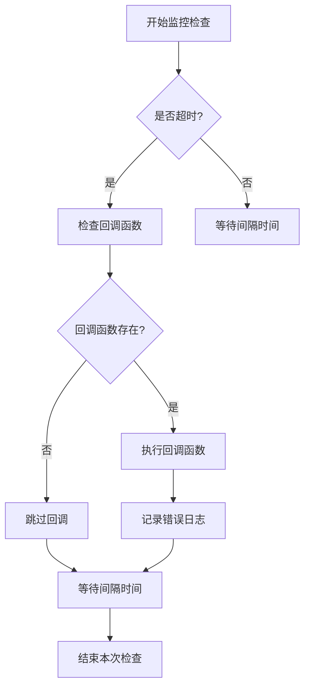
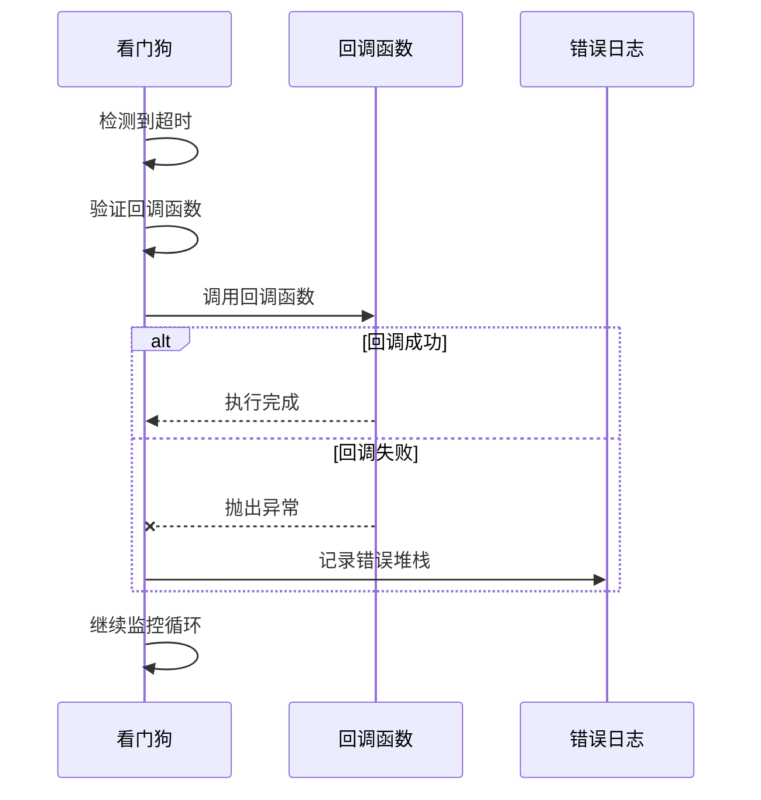
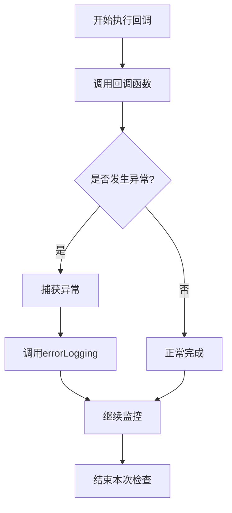

# 崩溃恢复机制

<cite>
**本文档中引用的文件**  
- [watchdog.py](file://src-python/models/watchdog/watchdog.py)
- [model.py](file://src-python/model.py)
- [utils.py](file://src-python/utils.py)
- [watchdog.md](file://src-python/docs/details/watchdog.md)
</cite>

## 目录
1. [看门狗监控机制概述](#看门狗监控机制概述)
2. [崩溃恢复流程分析](#崩溃恢复流程分析)
3. [回调函数设置与执行](#回调函数设置与执行)
4. [异常处理与错误日志](#异常处理与错误日志)
5. [安全执行策略](#安全执行策略)
6. [实际调用场景](#实际调用场景)
7. [系统集成与应用](#系统集成与应用)

## 看门狗监控机制概述

看门狗（Watchdog）是一种轻量级的监控系统，用于检测程序或进程的异常状态。当监控检测到超时未收到"喂食"信号时，会触发预设的恢复机制。该机制通过调用注册的回调函数来执行后端进程的重启或其他恢复操作。

看门狗的核心功能包括：
- 记录最后一次"喂食"的时间戳
- 检测超时情况并触发回调
- 支持后台线程运行模式
- 提供灵活的配置参数

**Section sources**
- [watchdog.py](file://src-python/models/watchdog/watchdog.py#L6-L104)

## 崩溃恢复流程分析

看门狗的崩溃恢复流程始于超时检测。当系统在设定的超时时间内未收到"喂食"信号时，看门狗会自动触发恢复流程。

恢复流程的关键步骤包括：
1. 检测到超时条件满足
2. 验证回调函数是否已注册
3. 安全地执行回调函数
4. 记录相关错误信息（如有）

在`watchdog.py`文件中，`start()`方法负责执行单次监控检查。该方法会计算自上次"喂食"以来的时间间隔，如果超过设定的超时阈值，则会调用注册的回调函数。



**Diagram sources**
- [watchdog.py](file://src-python/models/watchdog/watchdog.py#L37-L57)

**Section sources**
- [watchdog.py](file://src-python/models/watchdog/watchdog.py#L37-L57)

## 回调函数设置与执行

### setCallback方法

`setCallback()`方法用于注册在超时情况下要执行的回调函数。该方法接受一个无参数的可调用对象作为参数，并将其存储在实例变量中。

```python
def setCallback(self, callback: Callable[[], None]) -> None:
    """Register a zero-argument callback invoked on timeout."""
    self.callback = callback
```

此方法的设计确保了回调函数的简单性和一致性，要求回调函数不接受任何参数，从而简化了调用逻辑。

### 回调执行机制

当超时条件满足时，看门狗会通过以下方式执行回调：

1. 首先检查回调函数是否可调用
2. 在try-except块中执行回调，防止异常传播
3. 如果回调执行失败，记录错误堆栈信息

这种设计确保了即使回调函数内部出现错误，也不会导致监控线程终止。



**Diagram sources**
- [watchdog.py](file://src-python/models/watchdog/watchdog.py#L47-L56)

**Section sources**
- [watchdog.py](file://src-python/models/watchdog/watchdog.py#L33-L36)
- [watchdog.py](file://src-python/models/watchdog/watchdog.py#L47-L56)

## 异常处理与错误日志

### 错误日志记录机制

系统通过`errorLogging()`函数实现错误日志记录。该函数位于`utils.py`文件中，负责将异常的堆栈跟踪信息记录到专门的错误日志文件中。

```python
def errorLogging() -> None:
    """Log the current exception traceback to the error logger."""
    global error_logger
    if error_logger is None:
        error_logger = setupLogger("error", "error.log", logging.ERROR)
    
    try:
        error_logger.error(traceback.format_exc())
    except Exception:
        # As a last resort, print the traceback to stdout
        print(traceback.format_exc(), flush=True)
```

此函数的设计特点包括：
- 使用全局错误记录器实例，避免重复创建
- 设置专门的错误日志文件"error.log"
- 作为最后手段，将错误信息输出到标准输出

### 异常隔离策略

看门狗在执行回调函数时采用了异常隔离策略，确保回调函数中的错误不会影响监控线程的正常运行。



这种设计模式确保了系统的健壮性，即使恢复逻辑本身出现问题，也不会导致整个监控系统失效。

**Diagram sources**
- [utils.py](file://src-python/utils.py#L280-L290)
- [watchdog.py](file://src-python/models/watchdog/watchdog.py#L50-L56)

**Section sources**
- [utils.py](file://src-python/utils.py#L280-L290)
- [watchdog.py](file://src-python/models/watchdog/watchdog.py#L50-L56)

## 安全执行策略

### 回调执行的安全性

看门狗通过以下机制确保回调函数的安全执行：

1. **异常捕获**：使用try-except块包裹回调执行
2. **错误隔离**：将回调异常与监控线程隔离
3. **资源保护**：确保监控线程不会因回调失败而终止

```python
if now - self.last_feed_time > self.timeout:
    if callable(self.callback):
        try:
            self.callback()
        except Exception:
            # Do not let callback exceptions propagate out of watchdog
            import traceback
            traceback.print_exc()
```

这种设计模式体现了防御性编程的原则，确保系统在异常情况下的稳定性。

### 线程安全考虑

看门狗支持在后台线程中运行，通过`start_in_thread()`方法实现。该方法创建一个后台线程，该线程会反复调用`start()`方法，直到收到停止信号。

线程控制机制包括：
- 使用`Event`对象作为停止信号
- 提供`stop()`方法用于优雅地停止监控线程
- 支持设置线程超时时间

这些机制共同确保了线程操作的安全性和可控性。

**Section sources**
- [watchdog.py](file://src-python/models/watchdog/watchdog.py#L47-L56)
- [watchdog.py](file://src-python/models/watchdog/watchdog.py#L70-L84)

## 实际调用场景

### 模型层集成

在`model.py`文件中，看门狗被集成到`Model`类中，作为系统健康监控的一部分。

```python
class Model:
    def init(self):
        # ... 其他初始化代码
        self.watchdog = Watchdog(config.WATCHDOG_TIMEOUT, config.WATCHDOG_INTERVAL)
        # ... 其他初始化代码
```

模型类提供了以下方法来管理看门狗：
- `startWatchdog()`：启动看门狗监控
- `feedWatchdog()`：向看门狗发送"喂食"信号
- `setWatchdogCallback()`：设置超时回调函数
- `stopWatchdog()`：停止看门狗监控

### 控制器层调用

控制器通过`setWatchdogCallback()`方法设置具体的恢复逻辑。当系统检测到异常时，注册的回调函数会被调用，执行相应的恢复操作。

典型的恢复操作可能包括：
- 重启后端服务
- 重新初始化关键组件
- 发送系统警报
- 执行数据恢复

这种分层设计使得监控逻辑与业务逻辑分离，提高了系统的可维护性和可扩展性。

**Section sources**
- [model.py](file://src-python/model.py#L132-L133)
- [model.py](file://src-python/model.py#L1097-L1114)

## 系统集成与应用

### 配置参数

看门狗的配置参数在`config.py`中定义，主要包括：
- `WATCHDOG_TIMEOUT`：超时阈值（秒）
- `WATCHDOG_INTERVAL`：检查间隔（秒）

这些参数允许根据具体应用场景调整监控的灵敏度和频率。

### 应用场景

看门狗机制适用于多种应用场景，包括：
- **进程监控**：监控关键进程的运行状态
- **服务健康检查**：定期检查服务的可用性
- **资源监控**：监控系统资源使用情况
- **网络连接监控**：检测网络连接的稳定性

通过灵活配置和适当的回调函数，看门狗可以适应不同的监控需求，提供可靠的崩溃恢复能力。

**Section sources**
- [model.py](file://src-python/model.py#L132-L133)
- [watchdog.md](file://src-python/docs/details/watchdog.md#L1-L670)