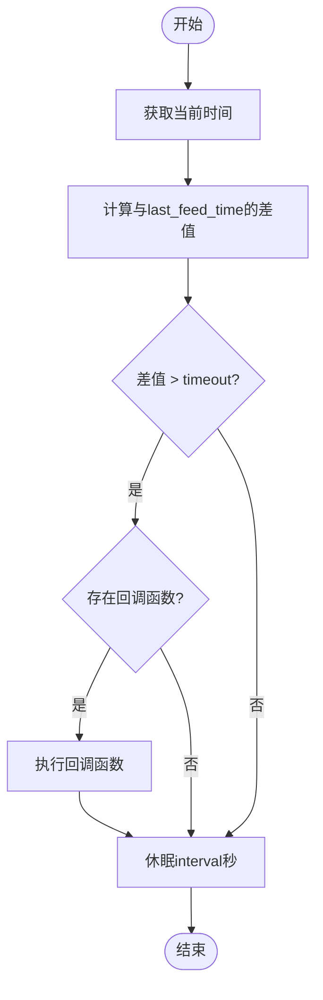

# 监控机制

<cite>
**本文档中引用的文件**  
- [watchdog.py](file://src-python/models/watchdog/watchdog.py)
- [model.py](file://src-python/model.py)
- [mainloop.py](file://src-python/mainloop.py)
- [controller.py](file://src-python/controller.py)
- [watchdog.md](file://src-python/docs/details/watchdog.md)
</cite>

## 目录
1. [Watchdog类概述](#watchdog类概述)
2. [核心监控机制](#核心监控机制)
3. [超时判断逻辑](#超时判断逻辑)
4. [start方法实现](#start方法实现)
5. [feed方法作用](#feed方法作用)
6. [参数详解](#参数详解)
7. [主循环中的使用](#主循环中的使用)
8. [实际应用示例](#实际应用示例)

## Watchdog类概述

Watchdog类是一个轻量级的监控工具，用于检测系统或进程的活跃状态。其核心机制是通过记录最后一次"喂狗"（feed）的时间戳，并在超过指定超时时间后触发用户定义的回调函数。该设计简洁高效，调用者可以选择在循环中定期调用`start()`方法，或将其运行在后台线程中以实现持续监控。

**Section sources**
- [watchdog.py](file://src-python/models/watchdog/watchdog.py#L6-L18)
- [watchdog.md](file://src-python/docs/details/watchdog.md#L1-L6)

## 核心监控机制

Watchdog类的核心监控机制基于时间差值的计算。它通过比较当前时间与最后一次喂狗时间（`last_feed_time`）之间的差值来判断是否发生超时。当这个差值超过预设的`timeout`值时，系统认为被监控的进程或服务已经失去响应，从而触发相应的处理逻辑。

该机制的关键在于维护一个准确的最后喂狗时间戳，并在每次系统正常运行时及时更新。这种基于时间间隔的监控方式简单可靠，能够有效检测系统挂起、死锁或长时间阻塞等问题。

**Section sources**
- [watchdog.py](file://src-python/models/watchdog/watchdog.py#L23-L24)
- [watchdog.md](file://src-python/docs/details/watchdog.md#L9-L12)

## 超时判断逻辑

超时判断逻辑在`start()`方法中实现。该方法首先获取当前时间戳，然后计算当前时间与`last_feed_time`之间的差值。如果这个差值大于`timeout`参数指定的秒数，且存在已注册的回调函数，则执行该回调函数。

**Diagram sources**
- [watchdog.py](file://src-python/models/watchdog/watchdog.py#L47-L56)

**Section sources**
- [watchdog.py](file://src-python/models/watchdog/watchdog.py#L47-L56)

## start方法实现

`start()`方法实现了单次监控检查和休眠间隔。该方法首先进行超时判断，如果发现超时且存在回调函数，则执行回调。无论是否发生超时，该方法最后都会调用`time.sleep(self.interval)`进行休眠，休眠时长由`interval`参数决定。

值得注意的是，`start()`方法本身并不在后台运行，它只是一个单次执行的方法。调用者需要在循环中反复调用此方法，或者使用`start_in_thread()`方法将其运行在独立线程中，才能实现持续的监控功能。

**Section sources**
- [watchdog.py](file://src-python/models/watchdog/watchdog.py#L37-L57)

## feed方法作用

`feed()`方法用于重置最后喂狗时间。当被监控的系统或进程正常运行时，应定期调用此方法，将`last_feed_time`更新为当前时间戳。这相当于向监控系统"报平安"，表明系统仍在正常工作。

通过定期调用`feed()`方法，可以防止监控系统误判为超时。如果系统由于某种原因停止调用`feed()`方法，`last_feed_time`将不再更新，随着时间推移，与当前时间的差值会逐渐增大，最终超过`timeout`阈值，触发超时处理。

**Section sources**
- [watchdog.py](file://src-python/models/watchdog/watchdog.py#L29-L32)

## 参数详解

### timeout参数

`timeout`参数定义了在没有收到喂狗信号的情况下，触发超时回调的等待时间（以秒为单位）。这是监控的敏感度设置，较短的timeout值能更快地检测到系统异常，但也可能增加误报的风险；较长的timeout值则提供了更大的容错空间，但故障检测会相对延迟。

### interval参数

`interval`参数指定了每次监控检查之间的休眠间隔（以秒为单位）。这个参数影响监控的频率，较短的interval值意味着更频繁的检查，能更快地响应超时事件，但会增加CPU的使用率；较长的interval值则降低了系统开销，但监控响应会有所延迟。

这两个参数需要根据具体应用场景进行权衡和配置，以达到最佳的监控效果和系统性能平衡。

**Section sources**
- [watchdog.py](file://src-python/models/watchdog/watchdog.py#L20-L22)
- [watchdog.md](file://src-python/docs/details/watchdog.md#L42-L43)

## 主循环中的使用

在主循环中，Watchdog通常与系统的主要工作流程结合使用。系统在执行完关键任务后调用`feed()`方法，以表明任务正常完成。同时，`start()`方法在后台线程中周期性地执行监控检查。

在VRCT项目中，Watchdog被集成到主循环架构中，通过controller和model层的协作实现。`main_instance.controller.setWatchdogCallback(main_instance.stop)`设置了超时回调，当监控检测到系统无响应时，会自动停止主程序，防止系统处于不可控状态。

**Section sources**
- [mainloop.py](file://src-python/mainloop.py#L580)
- [controller.py](file://src-python/controller.py#L2756-L2772)
- [model.py](file://src-python/model.py#L131-L132)

## 实际应用示例

在实际应用中，Watchdog的使用模式通常如下：首先初始化Watchdog实例，设置合适的timeout和interval参数；然后注册超时回调函数，定义超时发生时的处理逻辑；最后启动监控，可以在后台线程中运行，也可以在主循环中定期调用。

在系统的关键执行路径上，需要周期性地调用`feed()`方法。例如，在处理完一次用户请求、完成一轮数据处理或执行完一个重要的计算任务后，都应该调用`feed()`来重置监控计时器。这样可以确保只有在系统真正卡住或崩溃时才会触发超时，而正常的处理延迟不会导致误报。

**Section sources**
- [watchdog.md](file://src-python/docs/details/watchdog.md#L94-L123)
- [model.py](file://src-python/model.py#L1096-L1112)