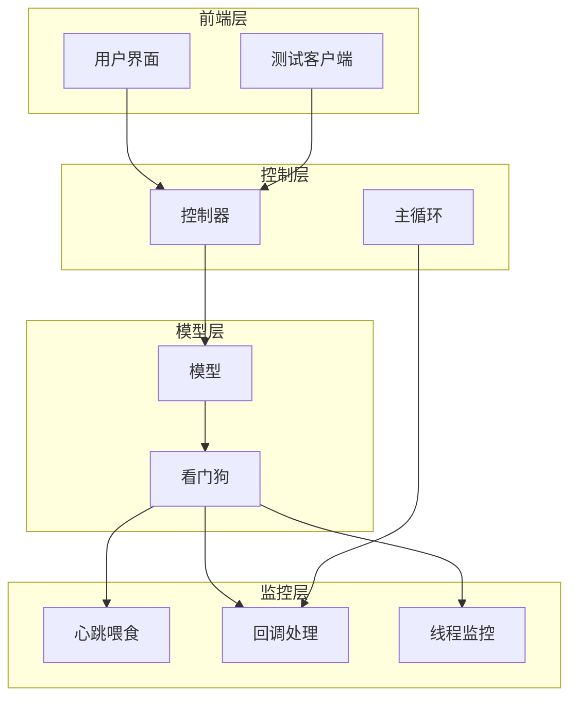
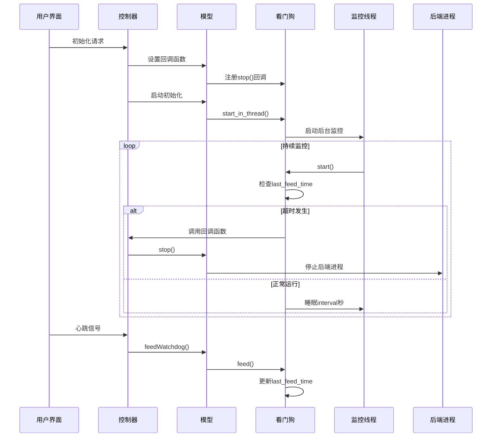
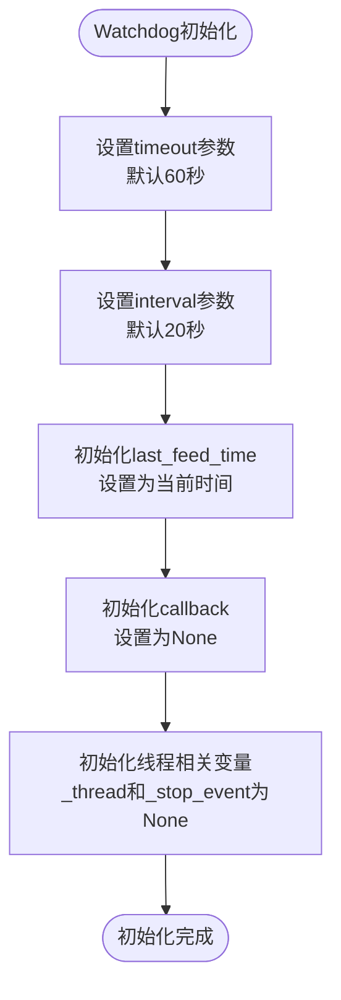
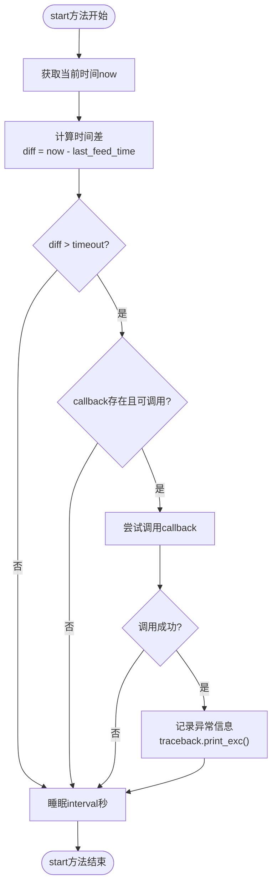
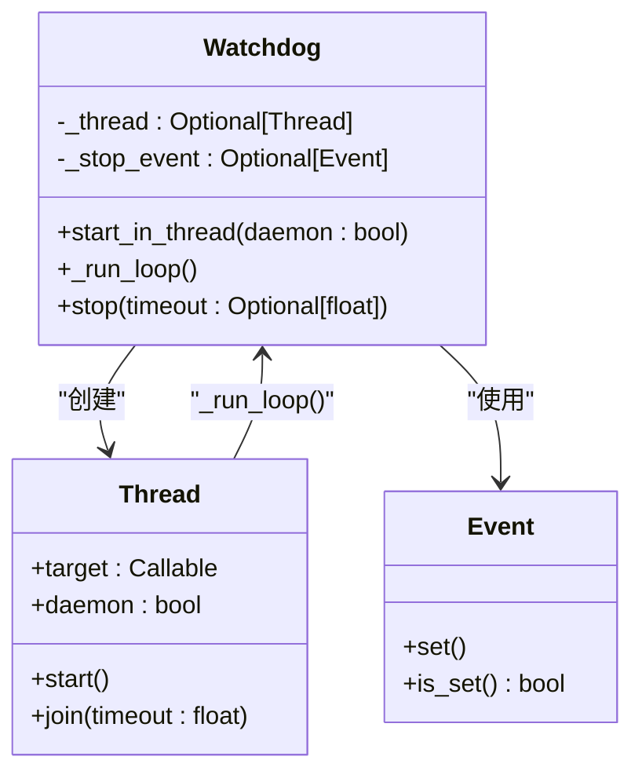
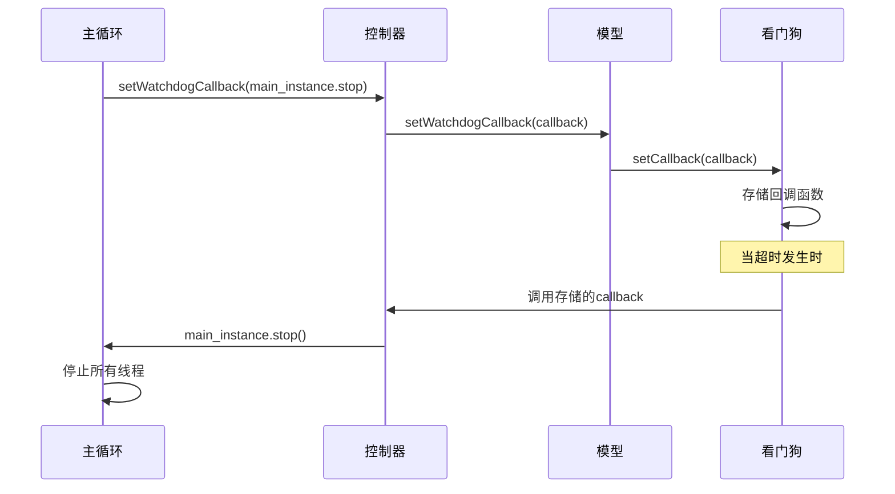
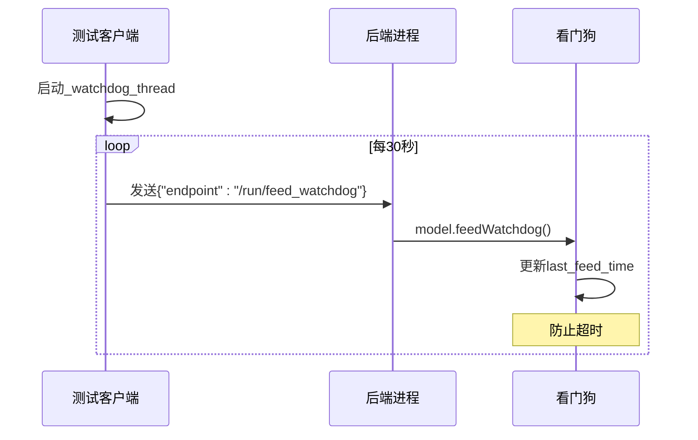
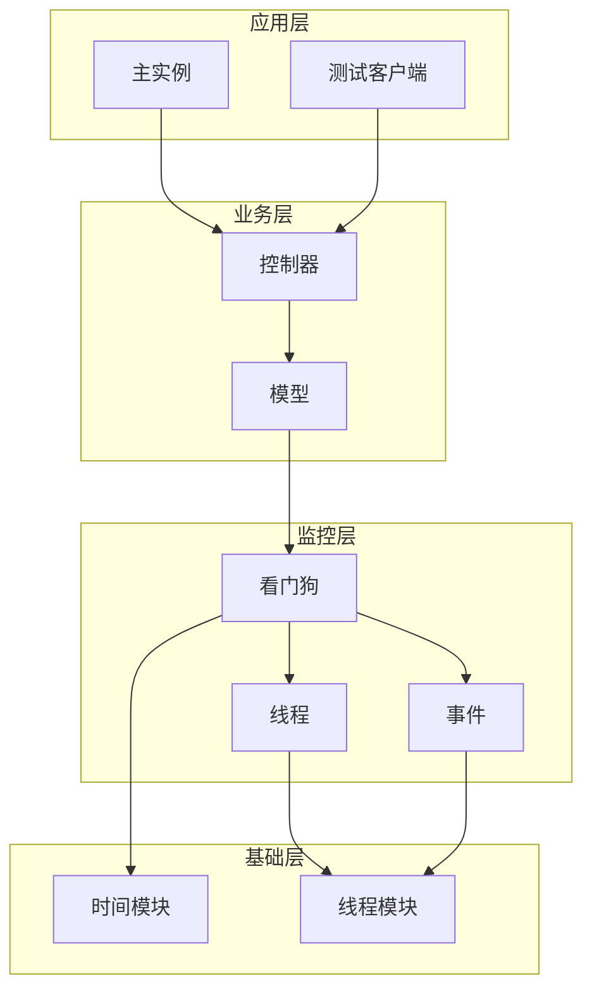

# 看门狗监控机制

<cite>
**本文档中引用的文件**
- [watchdog.py](file://src-python/models/watchdog/watchdog.py)
- [controller.py](file://src-python/controller.py)
- [model.py](file://src-python/model.py)
- [mainloop.py](file://src-python/mainloop.py)
- [test_client.py](file://src-python/test_client.py)
- [watchdog.md](file://src-python/docs/details/watchdog.md)
</cite>

## 目录
1. [简介](#简介)
2. [项目结构](#项目结构)
3. [核心组件](#核心组件)
4. [架构概览](#架构概览)
5. [详细组件分析](#详细组件分析)
6. [依赖关系分析](#依赖关系分析)
7. [性能考虑](#性能考虑)
8. [故障排除指南](#故障排除指南)
9. [结论](#结论)

## 简介

VRCT项目中的看门狗监控机制是一个轻量级的进程监控系统，专门用于检测后端Python进程的响应状态。该系统通过定时检查后端进程的心跳信号来判断进程是否处于无响应或崩溃状态，并在检测到超时时触发回调函数重启后端进程，从而确保系统的稳定性。

Watchdog类的设计理念是简单而有效：调用者需要定期调用`feed()`方法来刷新监控计时器，或者将其扩展以在后台线程中运行监控循环。当超过设定的超时时间未收到心跳信号时，系统会自动执行预设的回调函数来处理异常情况。

## 项目结构

VRCT项目的看门狗监控机制分布在多个模块中，形成了一个层次化的监控架构：



**图表来源**
- [controller.py](file://src-python/controller.py#L2760-L2768)
- [model.py](file://src-python/model.py#L1102-L1108)
- [mainloop.py](file://src-python/mainloop.py#L580-L582)

**章节来源**
- [watchdog.py](file://src-python/models/watchdog/watchdog.py#L1-L104)
- [controller.py](file://src-python/controller.py#L1-L200)

## 核心组件

### Watchdog类

Watchdog类是整个监控系统的核心，提供了轻量级的监控功能：

| 属性 | 类型 | 描述 |
|------|------|------|
| timeout | int | 超时前允许的最大无响应时间（秒） |
| interval | int | 监控检查的建议间隔时间（秒） |
| last_feed_time | float | 上次心跳信号的时间戳 |
| callback | Optional[Callable] | 超时时调用的回调函数 |
| _thread | Optional[Thread] | 后台监控线程 |
| _stop_event | Optional[Event] | 线程停止事件 |

### 关键方法

| 方法名 | 参数 | 返回值 | 描述 |
|--------|------|--------|------|
| feed() | 无 | None | 刷新监控计时器，重置超时时间 |
| setCallback(callback) | callback: Callable | None | 设置超时时的回调函数 |
| start() | 无 | None | 执行单次监控检查并睡眠指定时间 |
| start_in_thread() | daemon: bool = True | None | 在后台线程中启动持续监控 |
| stop() | timeout: Optional[float] | None | 停止后台监控线程 |

**章节来源**
- [watchdog.py](file://src-python/models/watchdog/watchdog.py#L20-L104)

## 架构概览

VRCT的看门狗监控机制采用分层架构设计，从底层的Watchdog类到顶层的主循环，形成了完整的监控体系：



**图表来源**
- [mainloop.py](file://src-python/mainloop.py#L578-L588)
- [controller.py](file://src-python/controller.py#L2760-L2768)
- [model.py](file://src-python/model.py#L1102-L1108)

## 详细组件分析

### Watchdog类实现分析

Watchdog类采用了简洁的设计模式，专注于核心的监控功能：

#### 初始化过程



**图表来源**
- [watchdog.py](file://src-python/models/watchdog/watchdog.py#L20-L28)

#### feed方法的调用时机

feed方法是监控系统的心跳机制，必须在以下情况下被调用：

1. **正常操作期间**：每次后端进程成功处理请求后
2. **定期维护**：按照预定的时间间隔主动喂食
3. **关键操作后**：完成重要任务后的确认信号

#### 超时处理逻辑



**图表来源**
- [watchdog.py](file://src-python/models/watchdog/watchdog.py#L47-L56)

#### start_in_thread方法详解

start_in_thread方法实现了Watchdog的后台监控功能：



**图表来源**
- [watchdog.py](file://src-python/models/watchdog/watchdog.py#L70-L104)

**章节来源**
- [watchdog.py](file://src-python/models/watchdog/watchdog.py#L29-L104)

### 控制器层集成

控制器层负责协调整个监控系统的工作：

#### setWatchdogCallback方法

该方法建立了监控系统与主循环之间的联系：



**图表来源**
- [controller.py](file://src-python/controller.py#L2766-L2767)
- [model.py](file://src-python/model.py#L1107-L1108)

**章节来源**
- [controller.py](file://src-python/controller.py#L2766-L2768)

### 测试客户端集成

测试客户端通过定期发送心跳信号来维持监控系统的正常运行：

#### 自动心跳机制



**图表来源**
- [test_client.py](file://src-python/test_client.py#L283-L301)

**章节来源**
- [test_client.py](file://src-python/test_client.py#L283-L301)

## 依赖关系分析

看门狗监控机制的依赖关系体现了清晰的分层架构：



**图表来源**
- [watchdog.py](file://src-python/models/watchdog/watchdog.py#L1-L4)
- [mainloop.py](file://src-python/mainloop.py#L1-L10)

**章节来源**
- [watchdog.py](file://src-python/models/watchdog/watchdog.py#L1-L104)
- [controller.py](file://src-python/controller.py#L1-L200)

## 性能考虑

Watchdog监控机制在设计时充分考虑了性能优化：

### 轻量级设计特点

1. **最小内存占用**：只维护必要的状态变量
2. **高效线程利用**：使用守护线程避免阻塞程序退出
3. **CPU使用优化**：通过sleep减少CPU占用

### 监控策略优化

- **间隔检查**：通过interval参数控制检查频率
- **异步处理**：后台线程执行监控避免阻塞主线程
- **异常隔离**：回调函数异常不影响监控系统本身

## 故障排除指南

### 常见问题及解决方案

#### 问题1：监控线程无法启动

**症状**：调用`start_in_thread()`后监控没有生效

**原因分析**：
- 线程已经存在且正在运行
- 线程对象被意外修改

**解决方案**：
```python
# 检查线程状态
if watchdog._thread is not None and watchdog._thread.is_alive():
    print("监控线程已经在运行")
else:
    watchdog.start_in_thread(daemon=True)
```

#### 问题2：频繁超时误报

**症状**：系统经常报告超时但进程仍在正常运行

**原因分析**：
- 心跳信号发送频率不足
- 监控间隔设置过短
- 系统负载过高导致延迟

**解决方案**：
```python
# 调整超时和间隔参数
watchdog = Watchdog(timeout=120, interval=30)  # 增加超时时间
```

#### 问题3：回调函数异常

**症状**：监控系统正常工作但回调函数抛出异常

**原因分析**：
- 回调函数内部逻辑错误
- 外部资源访问失败

**解决方案**：
监控系统已经内置了异常捕获机制，但建议在回调函数中添加适当的错误处理：

```python
def robust_callback():
    try:
        # 可能失败的操作
        restart_backend()
    except Exception as e:
        logger.error(f"重启失败: {e}")
        # 实施备用方案
        emergency_shutdown()
```

**章节来源**
- [watchdog.py](file://src-python/models/watchdog/watchdog.py#L50-L56)

## 结论

VRCT项目的看门狗监控机制通过精心设计的分层架构，实现了可靠而高效的进程监控功能。该系统具有以下优势：

1. **简单易用**：Watchdog类设计简洁，易于集成和使用
2. **高可靠性**：通过多层防护机制确保监控系统的稳定性
3. **高性能**：轻量级设计和异步处理保证低资源消耗
4. **灵活配置**：支持自定义超时时间和监控间隔

该监控机制为VRCT项目的稳定运行提供了重要保障，特别是在处理长时间运行的后端服务时，能够及时发现并处理异常情况，确保用户体验的连续性和系统的可靠性。

通过合理配置和使用，这个看门狗监控机制可以广泛应用于其他需要进程监控的Python应用程序中，为构建健壮的系统提供有力支持。