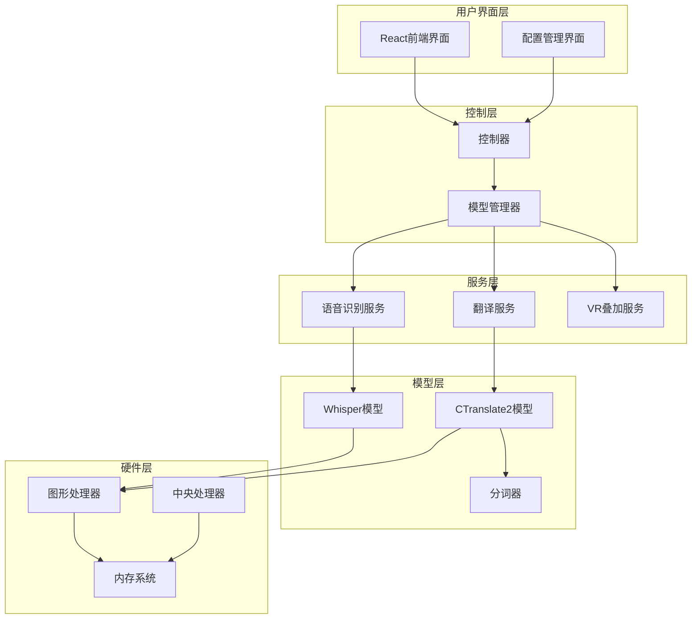
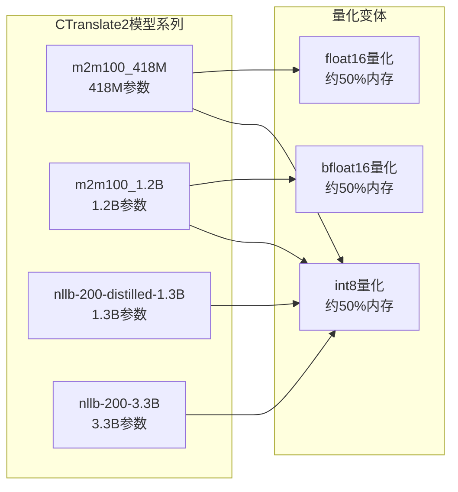
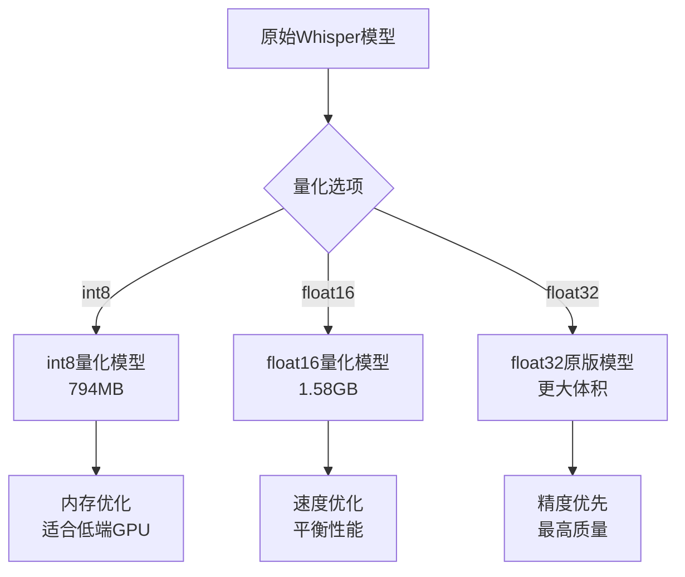
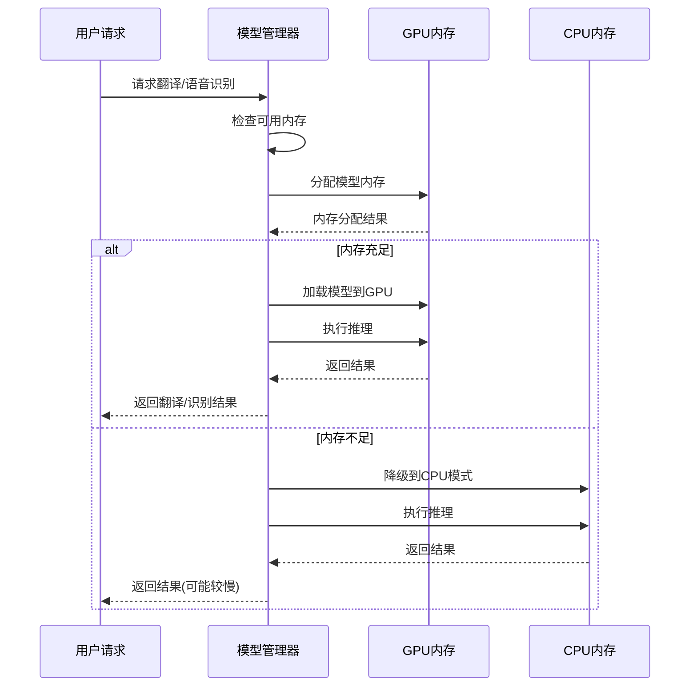
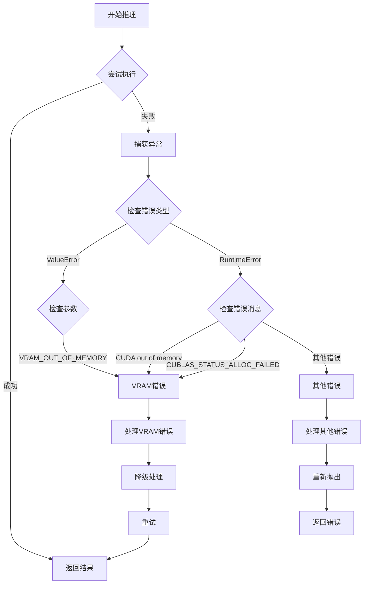
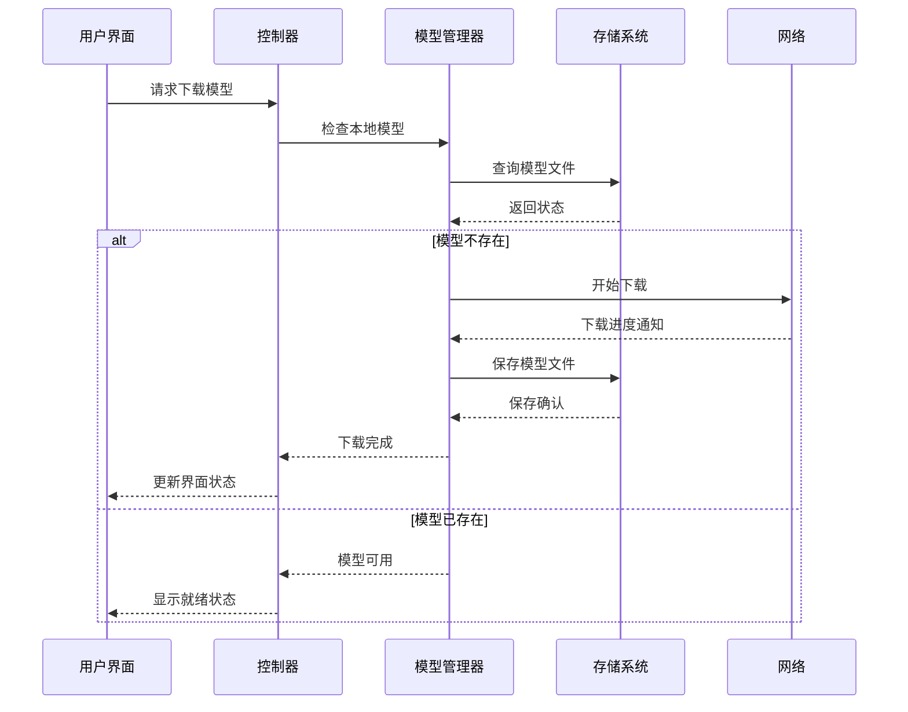
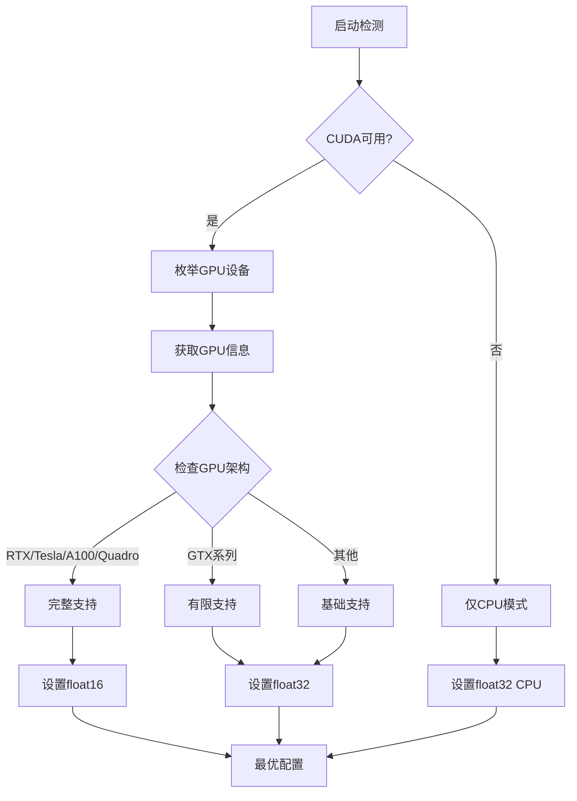
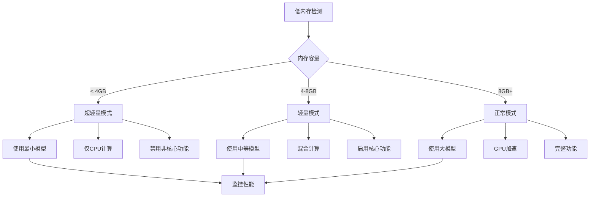
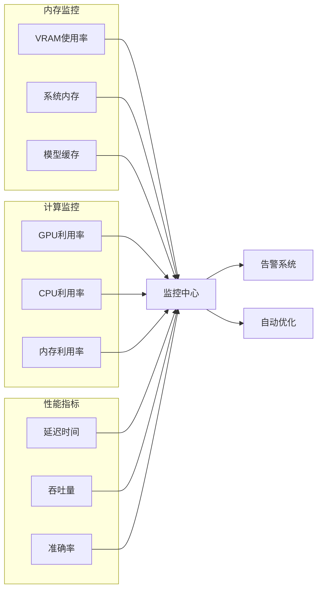
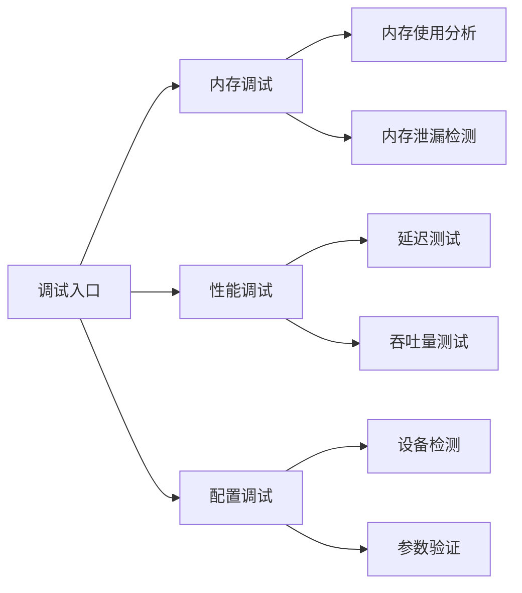

# 内存与模型优化

<cite>
**本文档中引用的文件**
- [model.md](file://src-python/docs/details/model.md)
- [transcription_whisper.py](file://src-python/models/transcription/transcription_whisper.py)
- [translation_translator.py](file://src-python/models/translation/translation_translator.py)
- [translation_utils.py](file://src-python/models/translation/translation_utils.py)
- [controller.py](file://src-python/controller.py)
- [model.py](file://src-python/model.py)
- [config.py](file://src-python/config.py)
- [utils.py](file://src-python/utils.py)
- [Translation.jsx](file://src-ui/views/app/config_page/setting_section/setting_box/translation/Translation.jsx)
</cite>

## 目录
1. [简介](#简介)
2. [项目架构概览](#项目架构概览)
3. [模型量化技术详解](#模型量化技术详解)
4. [内存占用特性分析](#内存占用特性分析)
5. [VRAM错误检测与处理](#vram错误检测与处理)
6. [模型下载与配置](#模型下载与配置)
7. [设备选择与计算类型优化](#设备选择与计算类型优化)
8. [低资源环境优化策略](#低资源环境优化策略)
9. [性能监控与调优](#性能监控与调优)
10. [故障排除指南](#故障排除指南)
11. [总结](#总结)

## 简介

VRCT项目是一个集成了多种AI模型的实时翻译和语音识别应用，支持Whisper语音识别模型和CTranslate2翻译模型。该项目通过先进的内存管理和模型优化技术，在保证高质量翻译和语音识别的同时，最大化地减少了系统资源消耗。

本文档深入分析了项目中的内存占用特性、模型量化技术的应用，以及如何在不同硬件环境下实现最佳性能平衡。

## 项目架构概览

VRCT采用模块化的架构设计，核心功能分为以下几个主要模块：

**图表来源**
- [controller.py](file://src-python/controller.py#L1-L50)
- [model.py](file://src-python/model.py#L1-L100)

**章节来源**
- [model.md](file://src-python/docs/details/model.md#L56-L92)

## 模型量化技术详解

### 量化技术概述

VRCT项目广泛采用了模型量化技术来减少内存占用和提升推理速度。主要使用的量化格式包括：

| 量化类型 | 内存占用 | 推理速度 | 精度损失 | 适用场景 |
|---------|---------|---------|---------|---------|
| int8 | 50% | 1.5-2x | 轻微 | 低内存环境 |
| float16 | 50% | 2-3x | 较小 | 中等性能需求 |
| bfloat16 | 50% | 2-3x | 极小 | 高精度要求 |
| float32 | 100% | 1x | 无 | 最高精度 |

### CTranslate2量化模型

项目支持多种CTranslate2量化模型：

**图表来源**
- [translation_utils.py](file://src-python/models/translation/translation_utils.py#L27-L47)

### Whisper模型量化

Whisper模型同样支持量化版本：

**图表来源**
- [transcription_whisper.py](file://src-python/models/transcription/transcription_whisper.py#L23-L32)

**章节来源**
- [translation_utils.py](file://src-python/models/translation/translation_utils.py#L27-L47)
- [transcription_whisper.py](file://src-python/models/transcription/transcription_whisper.py#L23-L32)

## 内存占用特性分析

### 模型内存分布

不同模型的内存占用情况如下：

| 模型类型 | tiny | base | small | medium | large-v1 | large-v2 | large-v3 |
|---------|------|------|-------|--------|----------|----------|----------|
| Whisper内存 | ~75MB | ~142MB | ~466MB | ~1.5GB | ~3.2GB | ~3.2GB | ~4.2GB |
| CTranslate2 | 固定 | 固定 | 固定 | 固定 | 固定 | 固定 | 固定 |
| 总计(含缓存) | ~100MB | ~200MB | ~600MB | ~2GB | ~4GB | ~4GB | ~5GB |

### 内存使用模式

**图表来源**
- [model.py](file://src-python/model.py#L731-L738)
- [controller.py](file://src-python/controller.py#L823-L855)

**章节来源**
- [transcription_whisper.py](file://src-python/models/transcription/transcription_whisper.py#L23-L32)
- [translation_utils.py](file://src-python/models/translation/translation_utils.py#L27-L47)

## VRAM错误检测与处理

### 错误检测机制

VRCT实现了完善的VRAM错误检测系统：

**图表来源**
- [model.py](file://src-python/model.py#L731-L738)
- [controller.py](file://src-python/controller.py#L823-L855)

### 自动降级策略

当检测到VRAM不足时，系统会自动执行以下降级流程：

1. **设备切换**: 从GPU切换到CPU
2. **计算类型调整**: 从高精度向低精度过渡
3. **模型大小选择**: 从大模型切换到小模型
4. **功能禁用**: 在极端情况下禁用相关功能

**章节来源**
- [model.py](file://src-python/model.py#L731-L738)
- [controller.py](file://src-python/controller.py#L823-L855)

## 模型下载与配置

### 下载流程管理

**图表来源**
- [translation_translator.py](file://src-python/models/translation/translation_translator.py#L240-L268)
- [translation_utils.py](file://src-python/models/translation/translation_utils.py#L61-L90)

### 配置参数说明

| 参数名称 | 类型 | 默认值 | 说明 |
|---------|------|--------|------|
| CTRANSLATE2_WEIGHT_TYPE | string | "m2m100_418M-ct2-int8" | CTranslate2模型类型 |
| SELECTED_TRANSLATION_COMPUTE_DEVICE | dict | {"device": "auto", "device_index": 0} | 翻译计算设备 |
| SELECTED_TRANSLATION_COMPUTE_TYPE | string | "auto" | 计算精度类型 |
| WHISPER_WEIGHT_TYPE | string | "base" | Whisper模型类型 |

**章节来源**
- [translation_translator.py](file://src-python/models/translation/translation_translator.py#L240-L268)
- [translation_utils.py](file://src-python/models/translation/translation_utils.py#L61-L90)

## 设备选择与计算类型优化

### 自动设备检测

系统能够自动检测可用的计算设备：

**图表来源**
- [utils.py](file://src-python/utils.py#L108-L167)

### 计算类型优先级

不同GPU架构的计算类型支持情况：

| GPU系列 | 支持的计算类型 | 推荐配置 | 性能特点 |
|---------|---------------|----------|----------|
| RTX系列 | int8_bfloat16, int8_float16, int8, bfloat16, float16, float32 | int8_float16 | 最高性能 |
| Tesla/A100 | int8_bfloat16, int8_float16, int8, bfloat16, float16, float32 | int8_bfloat16 | 高精度高性能 |
| GTX系列 | float32 | float32 | 兼容性最佳 |
| 其他 | float32 | float32 | 基础兼容 |

**章节来源**
- [utils.py](file://src-python/utils.py#L108-L167)

## 低资源环境优化策略

### 资源受限模式

针对低内存环境，系统提供了多层次的优化策略：

### 模型选择建议

| 系统配置 | 推荐模型 | 计算类型 | 内存需求 | 性能等级 |
|---------|---------|---------|---------|---------|
| < 4GB RAM | m2m100_418M-int8 | float32 | ~200MB | 低 |
| 4-8GB RAM | nllb-200-distilled-1.3B-int8 | float16 | ~800MB | 中 |
| 8-16GB RAM | nllb-200-3.3B-int8 | bfloat16 | ~1.5GB | 高 |
| > 16GB RAM | large-v3-turbo-int8 | int8_float16 | ~2GB | 最高 |

**章节来源**
- [utils.py](file://src-python/utils.py#L134-L170)

## 性能监控与调优

### 实时性能监控

系统提供多维度的性能监控：

### 自动优化机制

系统根据实时性能数据自动调整配置：

1. **动态模型切换**: 根据负载自动切换模型大小
2. **计算类型调整**: 根据精度需求调整计算精度
3. **设备分配优化**: 动态分配计算资源
4. **缓存策略优化**: 智能管理模型缓存

**章节来源**
- [controller.py](file://src-python/controller.py#L823-L855)

## 故障排除指南

### 常见问题诊断

| 问题症状 | 可能原因 | 解决方案 |
|---------|---------|---------|
| VRAM不足错误 | 模型过大+显存不足 | 降低模型精度或切换到CPU |
| 推理速度慢 | 计算类型不匹配 | 调整计算类型为更高精度 |
| 模型加载失败 | 文件损坏或网络问题 | 重新下载模型文件 |
| 设备检测失败 | 驱动程序问题 | 更新GPU驱动程序 |

### 调试工具

系统提供了丰富的调试工具：

**章节来源**
- [controller.py](file://src-python/controller.py#L823-L855)

## 总结

VRCT项目通过精心设计的内存管理和模型优化策略，实现了在各种硬件环境下的高效运行。主要优势包括：

1. **灵活的量化支持**: 支持多种量化格式，适应不同性能需求
2. **智能的资源管理**: 自动检测和适配硬件资源
3. **完善的错误处理**: 提供多层次的降级和恢复机制
4. **用户友好的配置**: 简化的配置界面和自动优化

通过合理配置和使用这些优化技术，用户可以在保证翻译质量和语音识别准确性的前提下，最大化系统性能，实现最佳的用户体验。