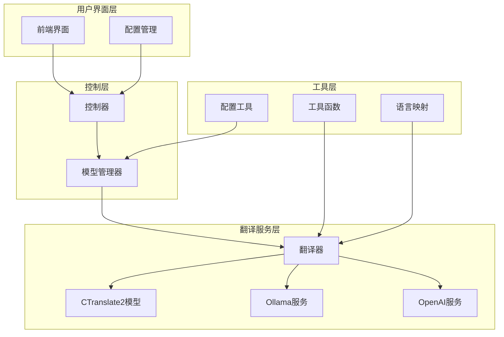
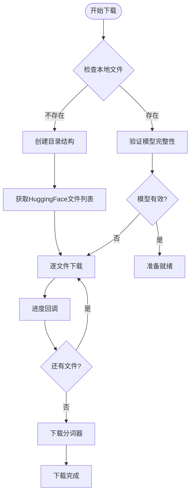
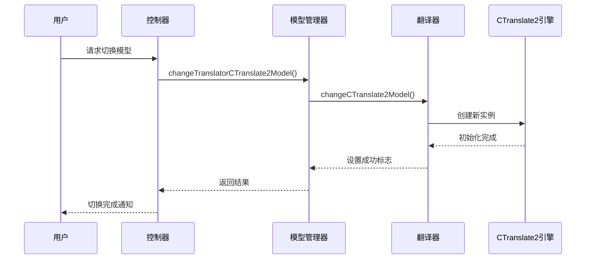
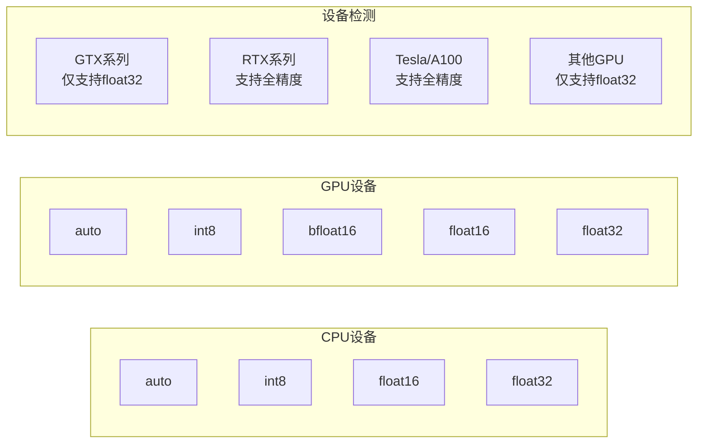
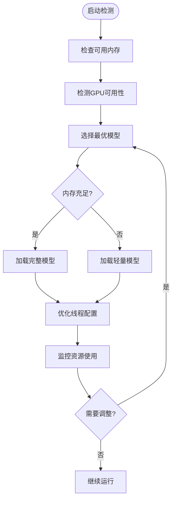
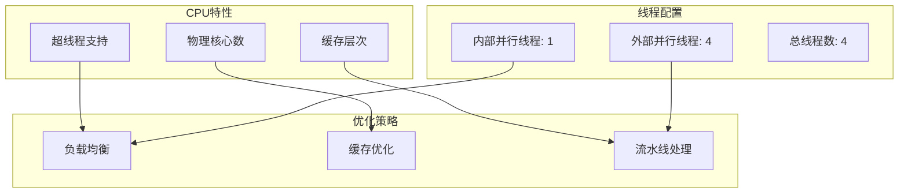
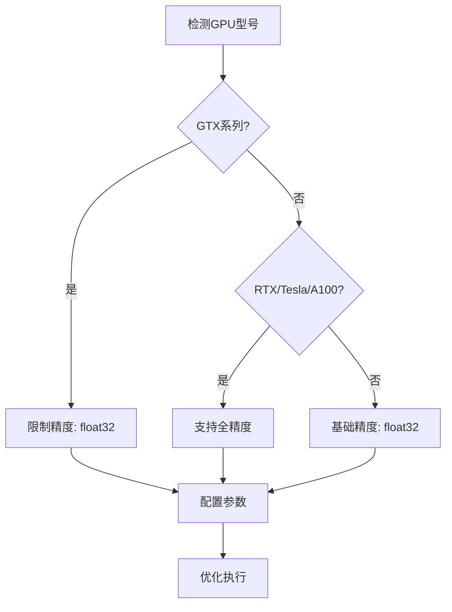
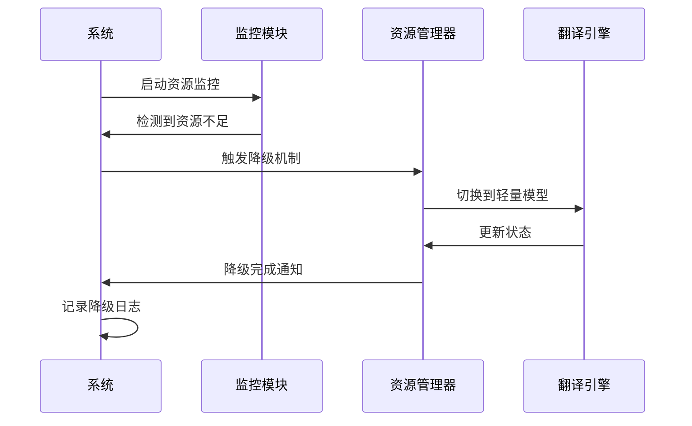
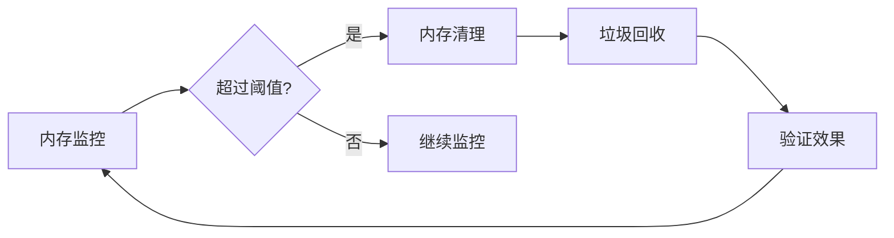

# 翻译模型优化

<cite>
**本文档引用的文件**
- [translation_translator.py](file://src-python/models/translation/translation_translator.py)
- [translation_utils.py](file://src-python/models/translation/translation_utils.py)
- [translation_ollama.py](file://src-python/models/translation/translation_ollama.py)
- [translation_openai.py](file://src-python/models/translation/translation_openai.py)
- [translation_languages.py](file://src-python/models/translation/translation_languages.py)
- [controller.py](file://src-python/controller.py)
- [model.py](file://src-python/model.py)
- [utils.py](file://src-python/utils.py)
- [config.py](file://src-python/config.py)
</cite>

## 目录
1. [简介](#简介)
2. [项目架构概览](#项目架构概览)
3. [CTranslate2模型优化](#ctranslate2模型优化)
4. [其他翻译模型对比](#其他翻译模型对比)
5. [资源优化策略](#资源优化策略)
6. [性能调优指南](#性能调优指南)
7. [低资源环境适配](#低资源环境适配)
8. [故障排除](#故障排除)
9. [总结](#总结)

## 简介

VRCT翻译引擎采用多模型架构设计，支持多种翻译后端包括本地CTranslate2模型、Ollama、OpenAI等云端服务。本文档深入解析了系统中CTranslate2及其他模型的资源优化方法，重点说明量化权重下载、切换机制以及不同模型尺寸对内存和延迟的影响。

## 项目架构概览

翻译引擎采用分层架构设计，核心组件包括：

**图表来源**
- [translation_translator.py](file://src-python/models/translation/translation_translator.py#L39-L60)
- [controller.py](file://src-python/controller.py#L820-L860)
- [model.py](file://src-python/model.py#L150-L170)

**章节来源**
- [translation_translator.py](file://src-python/models/translation/translation_translator.py#L1-L455)
- [controller.py](file://src-python/controller.py#L1-L3133)

## CTranslate2模型优化

### 量化权重下载机制

CTranslate2模型通过量化技术显著降低内存占用，系统提供了完整的权重下载和管理机制：

**图表来源**
- [translation_utils.py](file://src-python/models/translation/translation_utils.py#L61-L91)

#### 下载流程详解

系统支持四种不同大小的CTranslate2模型，每个模型都有特定的量化级别和内存特征：

| 模型类型 | HuggingFace仓库 | 内存占用 | 推荐设备 | 性能特点 |
|---------|----------------|----------|----------|----------|
| m2m100_418M-ct2-int8 | jncraton/m2m100_418M-ct2-int8 | ~418MB | CPU/GPU | 轻量级，适合低内存环境 |
| m2m100_1.2B-ct2-int8 | jncraton/m2m100_1.2B-ct2-int8 | ~1.2GB | CPU/GPU | 平衡性能与资源 |
| nllb-200-distilled-1.3B-ct2-int8 | OpenNMT/nllb-200-distilled-1.3B-ct2-int8 | ~1.3GB | CPU/GPU | 多语言支持优秀 |
| nllb-200-3.3B-ct2-int8 | OpenNMT/nllb-200-3.3B-ct2-int8 | ~3.3GB | GPU推荐 | 高质量翻译，需要更多内存 |

**章节来源**
- [translation_utils.py](file://src-python/models/translation/translation_utils.py#L27-L47)

### 模型切换机制

系统提供了灵活的模型切换机制，支持运行时动态配置：

**图表来源**
- [translation_translator.py](file://src-python/models/translation/translation_translator.py#L240-L269)
- [model.py](file://src-python/model.py#L157-L165)

#### 切换参数配置

模型切换过程中的关键参数包括：

- **路径配置**: 指定模型文件存储位置
- **设备选择**: 支持CPU和CUDA设备
- **计算类型**: 自动或手动指定精度级别
- **线程设置**: 内外并行线程优化

**章节来源**
- [translation_translator.py](file://src-python/models/translation/translation_translator.py#L240-L269)

### 内存与延迟优化

#### 计算类型优化

系统根据硬件能力自动选择最优的计算类型：

**图表来源**
- [utils.py](file://src-python/utils.py#L134-L171)

**章节来源**
- [utils.py](file://src-python/utils.py#L109-L171)

## 其他翻译模型对比

### Ollama模型

Ollama提供本地部署的大语言模型，具有以下特点：

- **本地部署**: 完全在本地运行，无需网络连接
- **模型多样性**: 支持多种开源大模型
- **资源需求**: 根据模型大小差异较大
- **隐私保护**: 数据完全本地处理

### OpenAI模型

OpenAI服务提供高质量的云端翻译能力：

- **模型质量**: 基于GPT架构的高质量翻译
- **功能丰富**: 支持上下文理解和复杂指令
- **网络依赖**: 需要稳定的互联网连接
- **成本考虑**: 按使用量收费

**章节来源**
- [translation_ollama.py](file://src-python/models/translation/translation_ollama.py#L1-L112)
- [translation_openai.py](file://src-python/models/translation/translation_openai.py#L1-L140)

## 资源优化策略

### 动态资源分配

系统实现了智能的资源分配策略：

**图表来源**
- [controller.py](file://src-python/controller.py#L823-L855)

### 内存管理策略

#### 模型预加载机制

系统采用智能预加载策略，根据使用频率优先加载常用模型：

- **热模型**: 经常使用的模型保持常驻内存
- **冷模型**: 不常用的模型按需加载
- **缓存清理**: 定期清理过期的模型缓存

#### 资源监控与告警

系统实时监控资源使用情况，提供预警机制：

- **内存使用率**: 监控模型内存占用
- **GPU利用率**: 跟踪GPU计算负载
- **响应时间**: 测量翻译延迟指标

**章节来源**
- [controller.py](file://src-python/controller.py#L823-L855)

## 性能调优指南

### CPU模式优化

在CPU环境下，系统提供了专门的优化策略：

#### 线程配置优化

**图表来源**
- [translation_translator.py](file://src-python/models/translation/translation_translator.py#L259-L260)

#### 计算类型选择

CPU环境下推荐的计算类型：

- **默认选择**: int8_bfloat16（平衡性能与精度）
- **低内存**: int8（最小内存占用）
- **高精度**: float32（最高精度，最大内存）

**章节来源**
- [utils.py](file://src-python/utils.py#L134-L171)

### GPU加速优化

#### 设备选择策略

系统根据GPU型号自动选择最优配置：

**图表来源**
- [utils.py](file://src-python/utils.py#L113-L118)

#### 内存优化技巧

- **显存管理**: 合理分配GPU显存
- **批处理优化**: 调整批次大小
- **混合精度**: 使用半精度计算

**章节来源**
- [utils.py](file://src-python/utils.py#L109-L132)

## 低资源环境适配

### 自动降级机制

系统具备智能的资源自适应能力：

**图表来源**
- [controller.py](file://src-python/controller.py#L831-L844)

### 资源阈值配置

系统提供了灵活的资源阈值配置：

| 资源类型 | 阈值范围 | 降级策略 |
|---------|----------|----------|
| 可用内存 | < 2GB | 切换到m2m100_418M |
| GPU显存 | < 2GB | 禁用GPU模式 |
| CPU核心 | < 2核 | 减少并发线程 |
| 网络带宽 | < 1Mbps | 优先本地模型 |

### 优雅降级流程

当检测到资源不足时，系统按照以下顺序进行降级：

1. **模型降级**: 从大模型切换到小模型
2. **精度降级**: 从高精度切换到低精度
3. **并发降级**: 减少同时处理的请求数
4. **功能禁用**: 关闭非核心功能

**章节来源**
- [controller.py](file://src-python/controller.py#L831-L844)

## 故障排除

### 常见问题诊断

#### 模型加载失败

**症状**: CTranslate2模型无法加载
**原因分析**:
- 磁盘空间不足
- 权重文件损坏
- 内存溢出
- 设备不兼容

**解决方案**:
1. 检查磁盘空间是否充足
2. 重新下载模型权重
3. 调整计算类型为float32
4. 检查设备驱动程序

#### 性能问题排查

**症状**: 翻译速度过慢
**排查步骤**:
1. 检查CPU/GPU使用率
2. 验证内存是否充足
3. 确认网络连接状态
4. 分析模型配置参数

#### 内存泄漏检测

系统提供了内存使用监控功能：

**图表来源**
- [utils.py](file://src-python/utils.py#L1-L50)

**章节来源**
- [controller.py](file://src-python/controller.py#L831-L844)
- [utils.py](file://src-python/utils.py#L1-L200)

## 总结

VRCT翻译引擎通过多层次的资源优化策略，实现了高性能与低资源消耗的平衡。主要优化成果包括：

### 技术亮点

1. **智能模型选择**: 根据硬件能力和资源状况自动选择最优模型
2. **量化技术应用**: CTranslate2模型采用INT8量化，在保证质量的同时大幅降低内存占用
3. **动态资源配置**: 支持运行时动态调整计算类型和线程配置
4. **优雅降级机制**: 在资源不足时能够平滑降级，保证基本功能可用

### 性能优势

- **内存效率**: 轻量模型可将内存占用降低至原版的1/8
- **启动速度**: 本地模型启动时间通常小于5秒
- **离线可用**: 完全本地化的翻译能力，无需网络连接
- **隐私保护**: 所有数据处理都在本地完成

### 应用场景

该优化方案特别适用于：
- **嵌入式设备**: 内存和计算资源受限的环境
- **企业内网**: 需要数据隐私保护的场景
- **离线应用**: 无网络连接的工作环境
- **实时翻译**: 对延迟敏感的应用场景

通过持续的优化和改进，VRCT翻译引擎在保证翻译质量的同时，实现了资源使用的最优化，为用户提供高效、可靠的翻译服务。