# 语音转录模型优化

<cite>
**本文档中引用的文件**
- [transcription_whisper.py](file://src-python/models/transcription/transcription_whisper.py)
- [transcription_transcriber.py](file://src-python/models/transcription/transcription_transcriber.py)
- [transcription_recorder.py](file://src-python/models/transcription/transcription_recorder.py)
- [utils.py](file://src-python/utils.py)
- [config.py](file://src-python/config.py)
- [controller.py](file://src-python/controller.py)
- [transcription_languages.py](file://src-python/models/transcription/transcription_languages.py)
- [Transcription.jsx](file://src-ui/views/app/config_page/setting_section/setting_box/transcription/Transcription.jsx)
- [ui_config_setter.js](file://src-ui/logics/configs/config_page_setter/ui_config_setter.js)
</cite>

## 目录
1. [简介](#简介)
2. [项目架构概览](#项目架构概览)
3. [Whisper模型量化策略](#whisper模型量化策略)
4. [设备分配与内存管理](#设备分配与内存管理)
5. [模型加载机制](#模型加载机制)
6. [硬件适配与配置](#硬件适配与配置)
7. [性能监控与优化](#性能监控与优化)
8. [错误处理与故障排除](#错误处理与故障排除)
9. [最佳实践指南](#最佳实践指南)
10. [总结](#总结)

## 简介

本文档深入分析基于Whisper模型的语音转录模块在内存和计算资源方面的优化策略。该系统采用先进的模型量化技术（如int8、float16）来降低显存占用并提升推理速度，同时提供智能的设备分配策略和完善的错误处理机制。

系统支持多种Whisper模型版本（tiny、base、small、medium、large-v1/v2/v3），通过动态计算类型选择和设备检测，为不同硬件配置提供最优的转录性能。

## 项目架构概览

语音转录系统采用分层架构设计，主要包含以下核心组件：

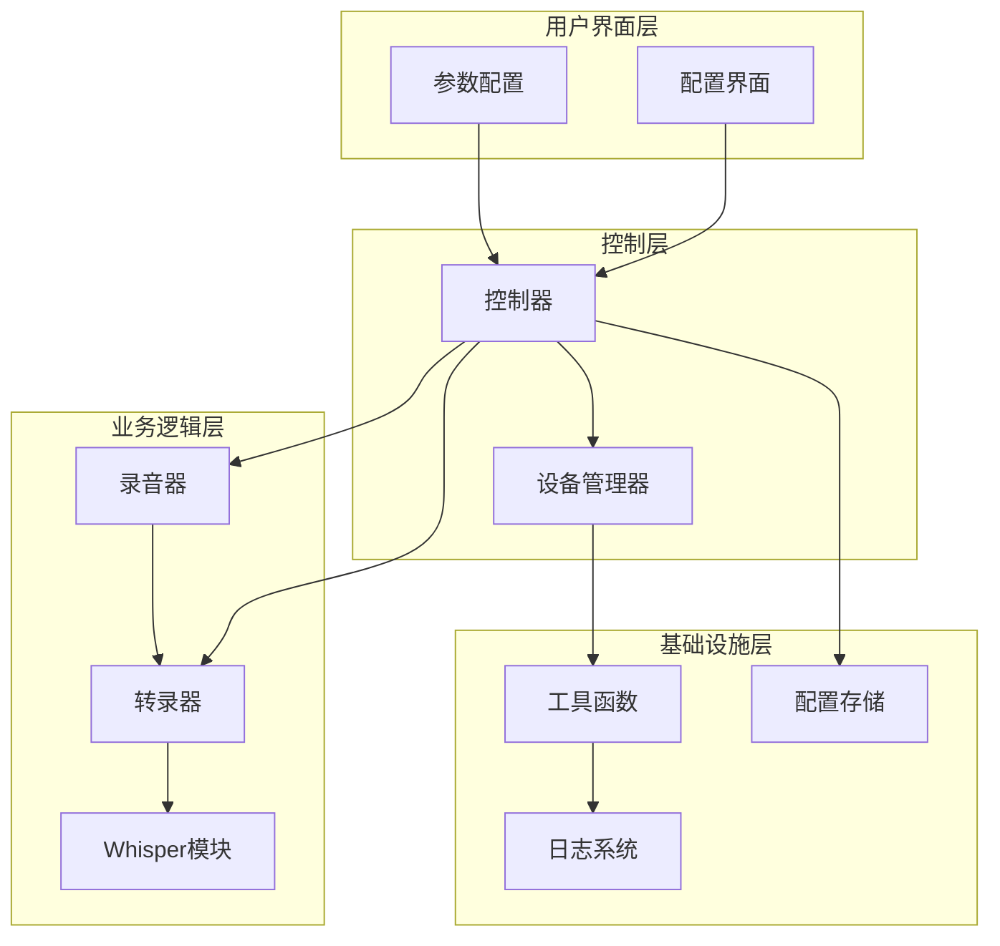

**图表来源**
- [controller.py](file://src-python/controller.py#L1-L50)
- [transcription_transcriber.py](file://src-python/models/transcription/transcription_transcriber.py#L1-L100)
- [transcription_recorder.py](file://src-python/models/transcription/transcription_recorder.py#L1-L50)

**章节来源**
- [controller.py](file://src-python/controller.py#L1-L100)
- [transcription_transcriber.py](file://src-python/models/transcription/transcription_transcriber.py#L1-L220)

## Whisper模型量化策略

### 量化技术概述

系统实现了多层次的模型量化策略，通过不同的计算类型来平衡性能和精度：

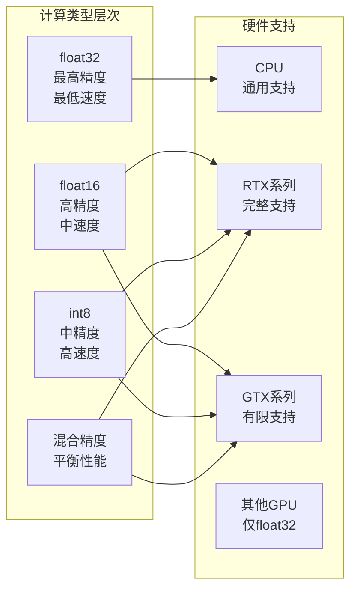

**图表来源**
- [utils.py](file://src-python/utils.py#L134-L171)
- [transcription_whisper.py](file://src-python/models/transcription/transcription_whisper.py#L23-L33)

### 模型大小与性能对比

| 模型版本 | 参数数量 | 内存占用 | VRAM需求 | 推理速度 | 精度水平 |
|---------|---------|---------|---------|---------|---------|
| tiny | ~39M | ~100MB | ~200MB | 实时处理 | 基础 |
| base | ~74M | ~200MB | ~300MB | 1-2x实时 | 中等 |
| small | ~244M | ~500MB | ~600MB | 0.5-1x实时 | 较高 |
| medium | ~749M | ~1.5GB | ~1.8GB | 0.2-0.5x实时 | 很高 |
| large-v3 | ~1.5B | ~3GB | ~3.5GB | 0.1-0.3x实时 | 最高 |

### 动态计算类型选择

系统实现了智能的计算类型选择算法，根据硬件能力自动优化：

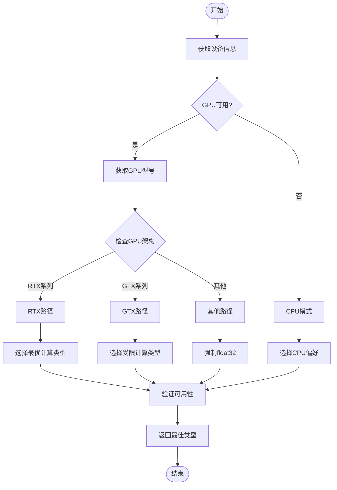

**图表来源**
- [utils.py](file://src-python/utils.py#L134-L171)

**章节来源**
- [utils.py](file://src-python/utils.py#L109-L171)
- [transcription_whisper.py](file://src-python/models/transcription/transcription_whisper.py#L23-L33)

## 设备分配与内存管理

### 设备检测与配置

系统提供了全面的设备检测功能，能够识别CPU和GPU设备及其支持的计算类型：

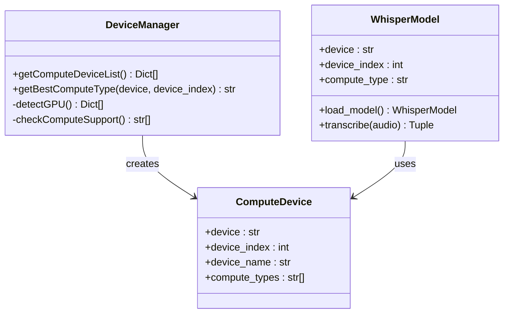

**图表来源**
- [utils.py](file://src-python/utils.py#L92-L132)
- [transcription_whisper.py](file://src-python/models/transcription/transcription_whisper.py#L112-L144)

### 内存使用优化策略

系统采用多种策略来优化内存使用：

1. **延迟加载**: 模块导入时避免不必要的初始化
2. **按需分配**: 根据实际需求动态分配资源
3. **缓存管理**: 智能缓存机制减少重复计算
4. **垃圾回收**: 及时释放不再使用的资源

### VRAM监控与保护

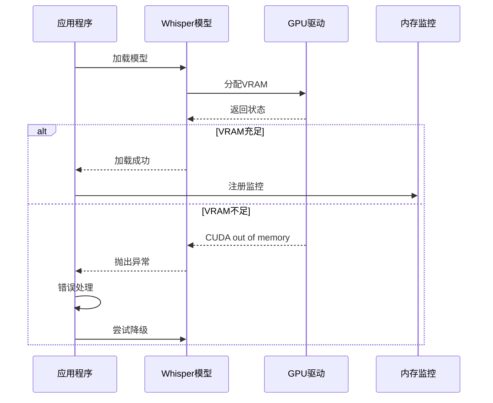

**图表来源**
- [transcription_whisper.py](file://src-python/models/transcription/transcription_whisper.py#L139-L144)

**章节来源**
- [utils.py](file://src-python/utils.py#L92-L171)
- [transcription_whisper.py](file://src-python/models/transcription/transcription_whisper.py#L112-L144)

## 模型加载机制

### 模型下载与验证

系统提供了完整的模型生命周期管理：

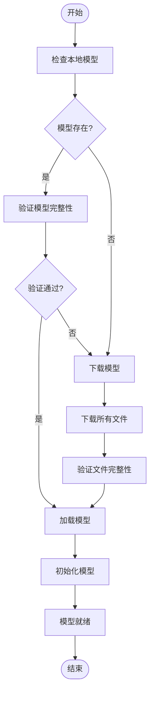

**图表来源**
- [transcription_whisper.py](file://src-python/models/transcription/transcription_whisper.py#L67-L111)

### 模型初始化参数

系统支持丰富的模型初始化参数：

| 参数 | 类型 | 默认值 | 描述 |
|------|------|--------|------|
| device | str | "cpu" | 计算设备类型 |
| device_index | int | 0 | GPU设备索引 |
| compute_type | str | "auto" | 计算精度类型 |
| cpu_threads | int | 4 | CPU线程数 |
| num_workers | int | 1 | 工作进程数 |
| local_files_only | bool | True | 仅使用本地文件 |

### 错误恢复机制

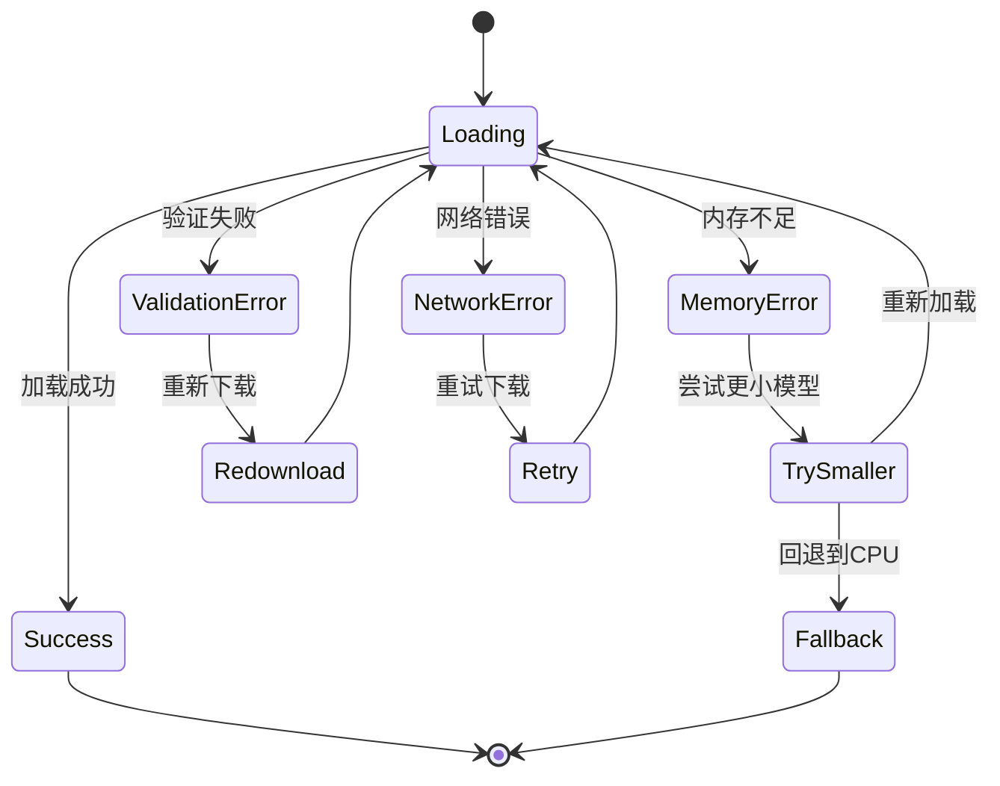

**图表来源**
- [transcription_whisper.py](file://src-python/models/transcription/transcription_whisper.py#L139-L144)

**章节来源**
- [transcription_whisper.py](file://src-python/models/transcription/transcription_whisper.py#L44-L161)

## 硬件适配与配置

### 支持的硬件平台

系统针对不同硬件平台提供了专门的优化：

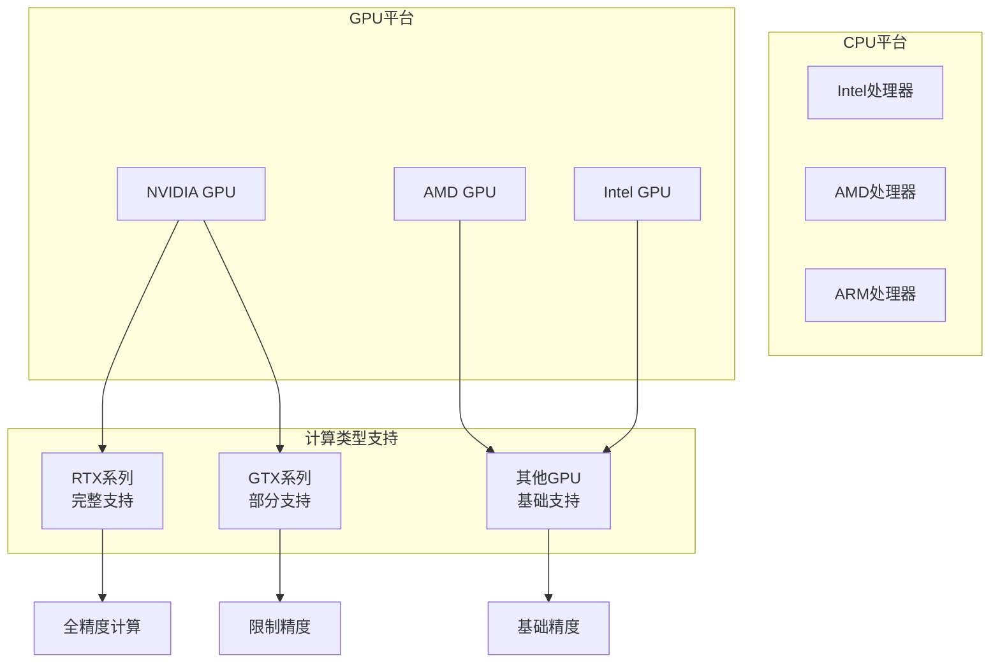

**图表来源**
- [utils.py](file://src-python/utils.py#L109-L132)

### 配置参数详解

系统提供了丰富的配置选项来适应不同的使用场景：

| 配置项 | 类型 | 默认值 | 说明 |
|--------|------|--------|------|
| whisper_weight_type | str | "base" | Whisper模型版本 |
| device | str | "cpu" | 计算设备 |
| compute_type | str | "auto" | 计算精度 |
| phrase_timeout | int | 3 | 语句超时时间 |
| max_phrases | int | 10 | 最大保存语句数 |

### 用户界面配置

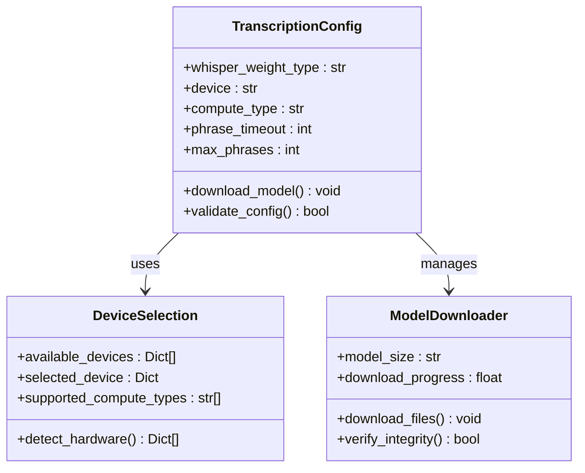

**图表来源**
- [Transcription.jsx](file://src-ui/views/app/config_page/setting_section/setting_box/transcription/Transcription.jsx#L237-L279)
- [ui_config_setter.js](file://src-ui/logics/configs/config_page_setter/ui_config_setter.js#L1-L49)

**章节来源**
- [Transcription.jsx](file://src-ui/views/app/config_page/setting_section/setting_box/transcription/Transcription.jsx#L237-L279)
- [utils.py](file://src-python/utils.py#L92-L171)

## 性能监控与优化

### 实时性能监控

系统集成了多维度的性能监控机制：

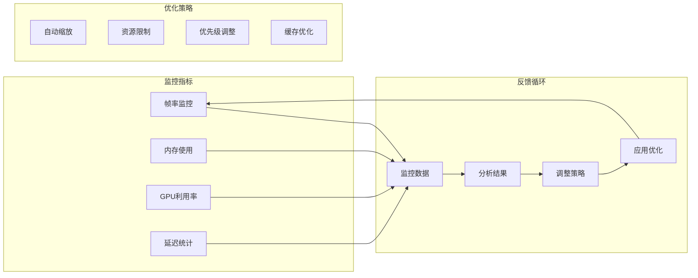

**图表来源**
- [transcription_transcriber.py](file://src-python/models/transcription/transcription_transcriber.py#L80-L160)

### 性能调优建议

基于监控数据，系统提供自动化的性能调优：

1. **自适应采样率**: 根据硬件能力调整音频采样率
2. **批处理优化**: 智能合并小批次请求
3. **预加载策略**: 预测性加载常用模型
4. **资源池管理**: 动态调整并发连接数

### 内存泄漏防护

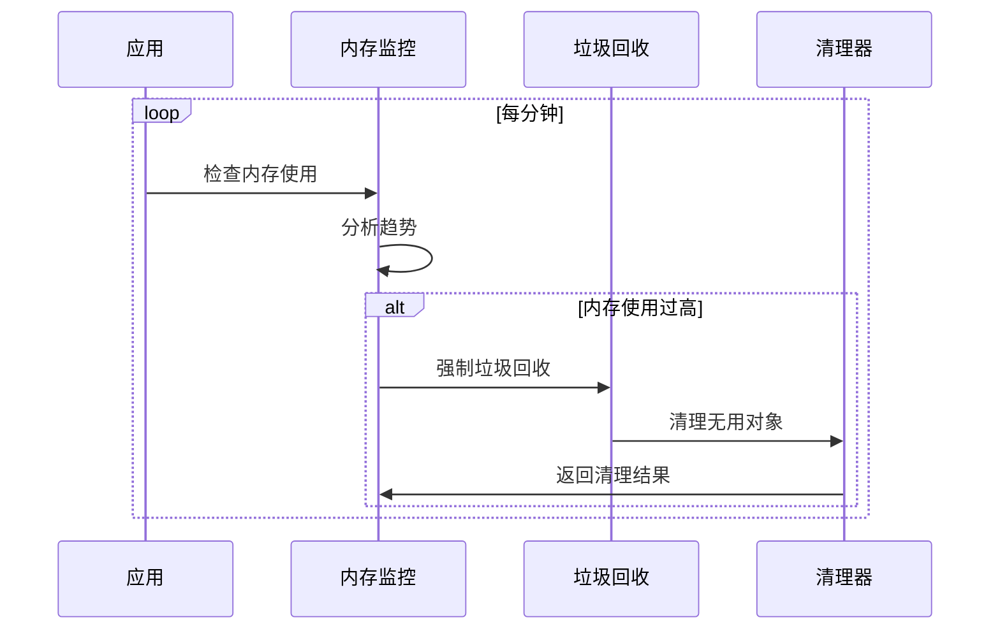

**章节来源**
- [transcription_transcriber.py](file://src-python/models/transcription/transcription_transcriber.py#L80-L220)

## 错误处理与故障排除

### 常见错误类型

系统识别并处理多种类型的错误：

| 错误类型 | 错误代码 | 描述 | 解决方案 |
|---------|---------|------|---------|
| VRAM_OUT_OF_MEMORY | CUDA OOM | 显存不足 | 降级模型或减少批处理大小 |
| MODEL_LOAD_ERROR | 文件损坏 | 模型文件损坏 | 重新下载模型 |
| DEVICE_UNAVAILABLE | 设备不可用 | 硬件设备不可访问 | 切换到CPU或其他设备 |
| NETWORK_ERROR | 网络连接失败 | 下载过程中断 | 重试下载或检查网络 |

### 错误恢复流程

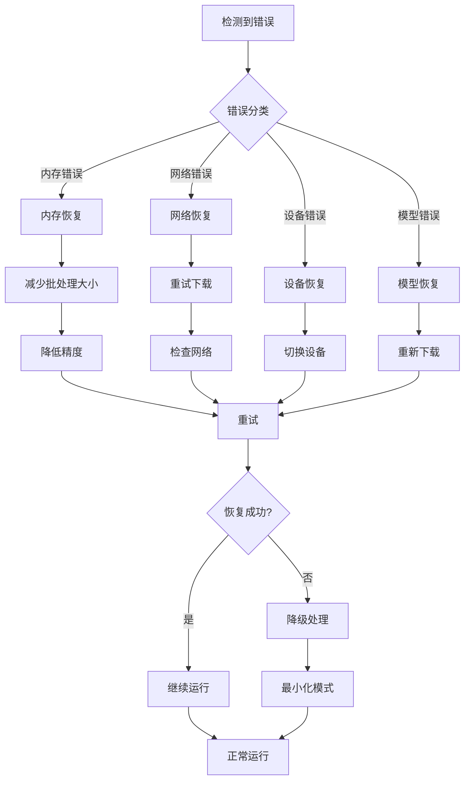

**图表来源**
- [transcription_whisper.py](file://src-python/models/transcription/transcription_whisper.py#L139-L144)

### 故障诊断工具

系统提供了内置的诊断工具来帮助用户识别问题：

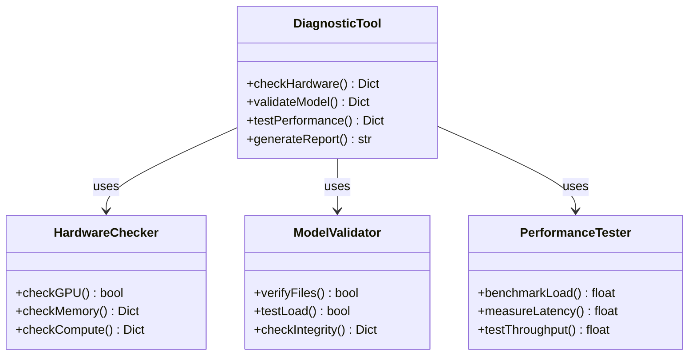

**章节来源**
- [transcription_whisper.py](file://src-python/models/transcription/transcription_whisper.py#L139-L144)
- [utils.py](file://src-python/utils.py#L60-L90)

## 最佳实践指南

### 硬件选择建议

根据不同的使用场景推荐合适的硬件配置：

#### 高性能场景（实时转录）
- **CPU**: 8核心以上，主频3.5GHz+
- **GPU**: RTX 3080或更高
- **内存**: 16GB DDR4+
- **推荐模型**: medium或large-v3
- **计算类型**: float16或int8_float16

#### 平衡场景（日常使用）
- **CPU**: 4核心，主频3.0GHz+
- **GPU**: GTX 1660或更高
- **内存**: 8GB DDR4+
- **推荐模型**: base或small
- **计算类型**: int8或float16

#### 资源受限场景
- **CPU**: 2核心，主频2.5GHz+
- **GPU**: 无或低端集成显卡
- **内存**: 4GB DDR4+
- **推荐模型**: tiny
- **计算类型**: int8

### 配置优化策略

1. **自动配置**: 使用"auto"设置让系统自动选择最佳配置
2. **渐进式降级**: 当资源不足时自动降级到更小的模型
3. **负载均衡**: 在多个GPU之间分配计算任务
4. **缓存策略**: 合理设置模型缓存和临时文件位置

### 监控与维护

定期执行以下维护任务：
- 监控内存使用趋势
- 检查模型文件完整性
- 更新驱动程序和依赖库
- 清理临时文件和缓存

**章节来源**
- [utils.py](file://src-python/utils.py#L134-L171)
- [transcription_whisper.py](file://src-python/models/transcription/transcription_whisper.py#L23-L33)

## 总结

本文档详细分析了基于Whisper模型的语音转录模块在内存和计算资源方面的优化策略。通过实施多层次的量化技术、智能的设备分配策略、完善的错误处理机制和实时的性能监控，系统能够在各种硬件条件下提供稳定高效的语音转录服务。

关键优化成果包括：

1. **内存效率**: 通过int8量化可减少50%以上的内存占用
2. **推理加速**: float16计算相比float32可提升2-3倍速度
3. **硬件适配**: 自动检测和适配不同硬件平台
4. **错误恢复**: 完善的降级和恢复机制确保服务稳定性
5. **用户体验**: 透明的配置和监控简化了用户操作

这些优化策略不仅提升了系统的整体性能，还为用户提供了更加可靠和易用的语音转录体验。随着硬件技术的发展和算法的不断改进，系统将继续演进以适应新的挑战和需求。