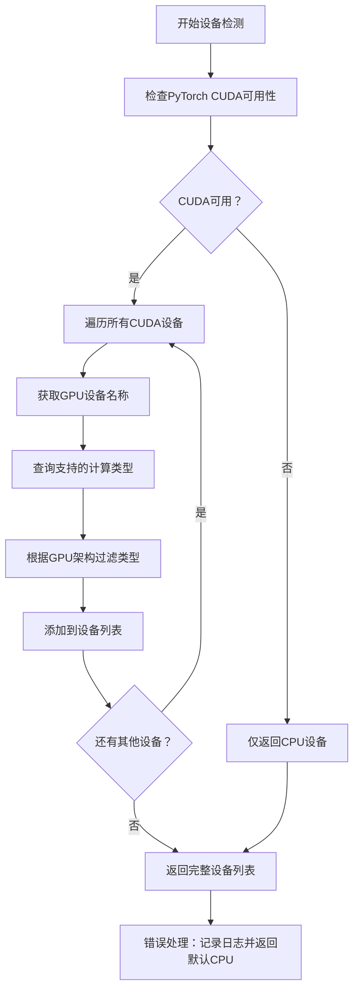
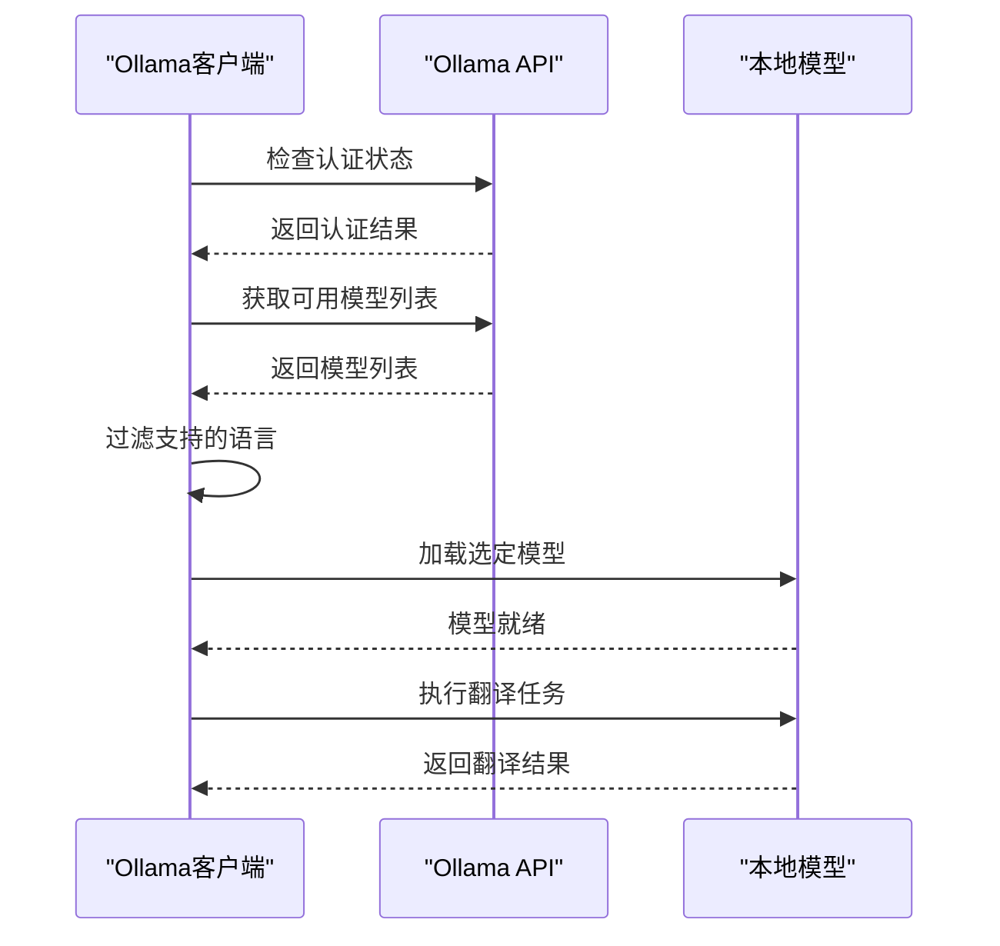
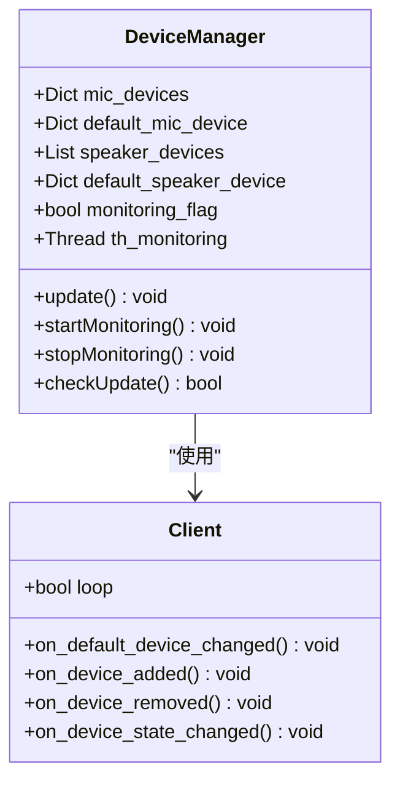
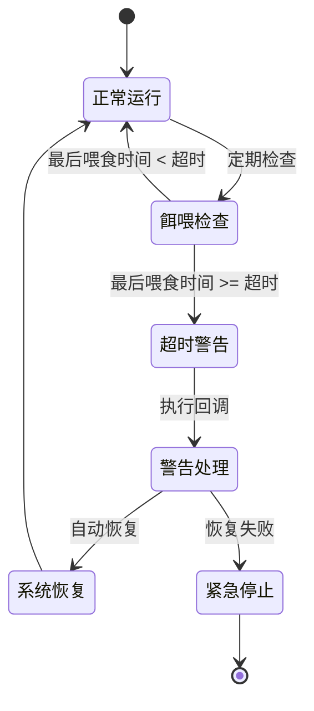

# 性能与资源问题

<cite>
**本文档中引用的文件**
- [utils.py](file://src-python/utils.py)
- [device_manager.py](file://src-python/device_manager.py)
- [transcription_whisper.py](file://src-python/models/transcription/transcription_whisper.py)
- [translation_ollama.py](file://src-python/models/translation/translation_ollama.py)
- [model.py](file://src-python/model.py)
- [config.py](file://src-python/config.py)
- [watchdog.py](file://src-python/models/watchdog/watchdog.py)
- [watchdog.md](file://src-python/docs/details/watchdog.md)
- [utils.md](file://src-python/docs/utils.md)
</cite>

## 目录
1. [概述](#概述)
2. [GPU设备识别与计算类型优化](#gpu设备识别与计算类型优化)
3. [大语言模型资源需求分析](#大语言模型资源需求分析)
4. [音频处理性能优化](#音频处理性能优化)
5. [系统监控与性能管理](#系统监控与性能管理)
6. [故障排除指南](#故障排除指南)
7. [最佳实践建议](#最佳实践建议)

## 概述

VRCT项目是一个复杂的语音转录和翻译系统，涉及多个高性能计算模块。当遇到应用运行卡顿、高CPU/GPU占用、内存泄漏等问题时，需要从设备识别、模型配置、音频处理等多个维度进行综合分析和优化。

### 核心性能瓶颈点

1. **GPU设备识别失败**：导致无法正确选择计算设备
2. **计算类型不匹配**：显卡能力与模型要求不兼容
3. **模型精度选择不当**：过高精度消耗过多资源
4. **音频缓冲区设置不合理**：影响实时处理性能
5. **内存管理不当**：导致内存泄漏和系统不稳定

## GPU设备识别与计算类型优化

### 设备检测机制

系统通过`utils.py`中的`getComputeDeviceList()`函数实现GPU设备的自动检测和计算类型支持查询。



**图表来源**
- [utils.py](file://src-python/utils.py#L92-L132)

### 计算类型智能选择

`getBestComputeType()`函数实现了基于GPU架构的最优计算类型选择算法：

| GPU系列 | 支持的计算类型 | 优先级排序 |
|---------|---------------|-----------|
| RTX系列 | int8_bfloat16, int8_float16, int8, bfloat16, float16, int8_float32, float32 | 最高 |
| Tesla/A100/Quadro | int8_bfloat16, int8_float16, int8, bfloat16, float16, int8_float32, float32 | 最高 |
| GTX系列 | float32 | 仅支持基础精度 |
| 其他 | float32 | 基础精度 |

**节来源**
- [utils.py](file://src-python/utils.py#L134-L171)
- [utils.md](file://src-python/docs/utils.md#L254-L324)

### 性能优化策略

1. **设备优先级管理**
   - 优先选择支持高精度计算的RTX系列GPU
   - GTX系列降级为float32精度
   - 其他设备限制为基础精度

2. **动态计算类型调整**
   - 根据GPU能力自动选择最适合的精度
   - 支持fallback机制确保稳定性

3. **错误恢复机制**
   - GPU检测失败时自动降级到CPU
   - 保持系统功能完整性

## 大语言模型资源需求分析

### Whisper模型配置

系统支持多种Whisper模型变体，每种都有不同的资源需求：

| 模型大小 | 文件大小 | 内存需求 | VRAM需求 | 处理速度 | 精度水平 |
|----------|----------|----------|----------|----------|----------|
| tiny | ~75MB | ~200MB | ~100MB | 极快 | 基础 |
| base | ~140MB | ~400MB | ~200MB | 快 | 良好 |
| small | ~460MB | ~1GB | ~500MB | 中等 | 高 |
| medium | ~1.5GB | ~3GB | ~1.5GB | 慢 | 很高 |
| large-v3 | ~4.8GB | ~6GB | ~3GB | 很慢 | 最高 |

**节来源**
- [transcription_whisper.py](file://src-python/models/transcription/transcription_whisper.py#L23-L32)

### Ollama模型集成

Ollama客户端提供了灵活的模型管理机制：



**图表来源**
- [translation_ollama.py](file://src-python/models/translation/translation_ollama.py#L14-L62)

### 精度与性能平衡

1. **CPU模式优化**
   - 使用int8量化减少内存占用
   - 适合低配置系统
   - 处理速度较慢但稳定

2. **GPU模式优化**
   - float16精度提供良好平衡
   - int8_float16优化内存使用
   - 高精度模型需要充足VRAM

3. **混合策略**
   - 关键任务使用高精度
   - 日常处理使用优化精度
   - 动态调整以适应系统负载

## 音频处理性能优化

### 音频设备管理

`device_manager.py`负责音频设备的发现、监控和性能优化：



**图表来源**
- [device_manager.py](file://src-python/device_manager.py#L56-L521)

### 音频采样率与缓冲区优化

音频处理的关键参数直接影响性能：

| 参数 | 推荐值 | 影响因素 | 性能影响 |
|------|--------|----------|----------|
| 采样率 | 44100Hz | 音质要求 | 高采样率增加CPU负担 |
| 缓冲区大小 | 1024-2048 | 延迟 vs 稳定性 | 小缓冲区延迟低但易出错 |
| 音频格式 | PCM16 | 兼容性 | 压缩格式增加解码开销 |
| 并发通道 | 1-2 | 系统资源 | 多通道增加内存和CPU需求 |

### 实时处理优化策略

1. **设备监控机制**
   - 实时检测音频设备变化
   - 自动重新配置音频流
   - 防止设备冲突和性能下降

2. **缓冲区管理**
   - 动态调整缓冲区大小
   - 防止音频丢帧和延迟累积
   - 优化内存使用效率

3. **性能监控**
   - 实时跟踪音频处理延迟
   - 检测设备性能瓶颈
   - 自动调整处理参数

**节来源**
- [device_manager.py](file://src-python/device_manager.py#L140-L238)

## 系统监控与性能管理

### Watchdog监控系统

系统内置了强大的监控机制来检测和处理性能问题：



**图表来源**
- [watchdog.py](file://src-python/models/watchdog/watchdog.py#L1-L69)
- [watchdog.md](file://src-python/docs/details/watchdog.md#L1-L670)

### 性能指标监控

系统监控以下关键性能指标：

| 监控项目 | 阈值设置 | 检测频率 | 响应措施 |
|----------|----------|----------|----------|
| CPU使用率 | < 80% | 5秒 | 降低处理优先级 |
| 内存使用率 | < 85% | 10秒 | 触发垃圾回收 |
| GPU使用率 | < 90% | 15秒 | 降级计算精度 |
| 音频延迟 | < 100ms | 实时 | 调整缓冲区大小 |
| 网络连接 | 可用 | 30秒 | 重试连接 |

### 自动恢复机制

1. **多级响应策略**
   - 警告级别：降低处理优先级
   - 危险级别：清理缓存和临时文件
   - 紧急级别：重启相关服务模块

2. **智能降级**
   - GPU计算降级到CPU
   - 高精度模型降级到低精度
   - 非关键功能暂停执行

3. **资源释放**
   - 定期清理无用对象
   - 释放未使用的GPU内存
   - 关闭空闲的网络连接

**节来源**
- [watchdog.md](file://src-python/docs/details/watchdog.md#L320-L406)

## 故障排除指南

### 常见性能问题诊断

#### GPU相关问题

**症状**：GPU利用率低，处理速度慢
**原因**：计算类型不匹配或设备选择错误
**解决方案**：
1. 检查GPU设备列表：`utils.getComputeDeviceList()`
2. 验证计算类型支持：`utils.getBestComputeType()`
3. 手动指定合适的计算类型

**症状**：GPU内存不足错误
**原因**：模型过大或精度要求过高
**解决方案**：
1. 选择更小的模型变体
2. 使用int8量化
3. 降低批处理大小

#### 内存泄漏问题

**症状**：内存使用持续增长
**原因**：对象未正确释放或循环引用
**解决方案**：
1. 启用垃圾回收：`gc.collect()`
2. 检查对象生命周期
3. 使用弱引用避免循环依赖

#### 音频处理问题

**症状**：音频延迟高或丢帧
**原因**：缓冲区设置不当或设备冲突
**解决方案**：
1. 调整音频缓冲区大小
2. 检查音频设备配置
3. 更新音频驱动程序

### 性能调优步骤

1. **系统健康检查**
   ```bash
   # 检查GPU状态
   nvidia-smi
   
   # 检查内存使用
   python -c "import psutil; print(psutil.virtual_memory())"
   
   # 检查CPU使用率
   python -c "import psutil; print(psutil.cpu_percent(interval=1))"
   ```

2. **配置优化验证**
   - 测试不同计算类型的性能
   - 调整音频缓冲区参数
   - 监控系统资源使用情况

3. **监控设置**
   - 启用详细的性能日志
   - 设置适当的监控阈值
   - 配置自动恢复机制

## 最佳实践建议

### 系统配置优化

1. **硬件选择建议**
   - 推荐使用RTX系列GPU进行推理
   - 至少16GB系统内存
   - SSD存储提升模型加载速度

2. **软件环境配置**
   - 使用最新的CUDA版本
   - 安装优化的深度学习库
   - 配置适当的环境变量

3. **模型选择策略**
   - 根据实际需求选择模型大小
   - 在精度和性能间找到平衡点
   - 定期评估模型性能

### 运维监控建议

1. **监控指标设置**
   - CPU、内存、GPU使用率
   - 音频处理延迟
   - 网络连接状态
   - 错误发生频率

2. **告警机制**
   - 设置合理的阈值
   - 配置多级告警
   - 建立自动恢复流程

3. **日志管理**
   - 分类存储不同级别的日志
   - 定期清理过期日志
   - 建立日志分析流程

### 开发调试技巧

1. **性能分析工具**
   - 使用PyTorch Profiler分析GPU使用
   - 使用Memory Profiler监控内存分配
   - 使用cProfile分析CPU热点

2. **测试策略**
   - 建立性能基准测试
   - 模拟各种负载场景
   - 验证恢复机制的有效性

3. **代码优化**
   - 避免不必要的对象创建
   - 使用内存映射文件处理大模型
   - 实现异步处理提高并发性

通过以上全面的性能管理和优化策略，可以有效解决VRCT项目中的各种性能问题，确保系统的稳定性和高效运行。