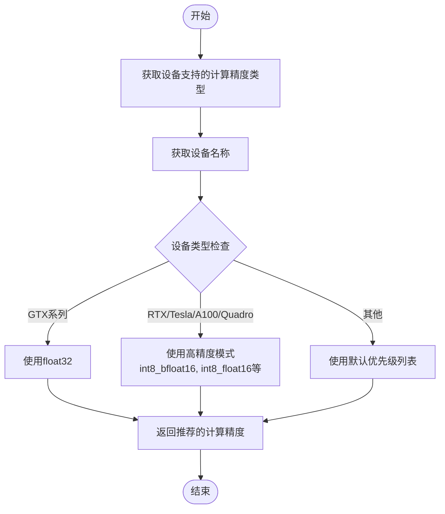
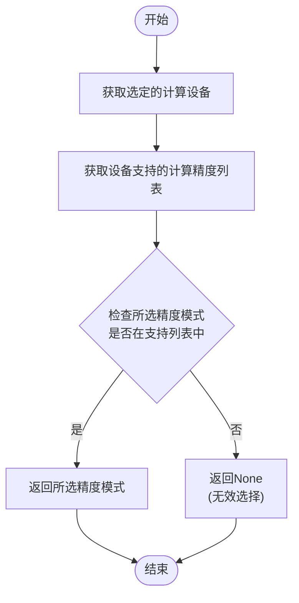
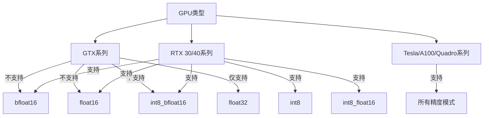
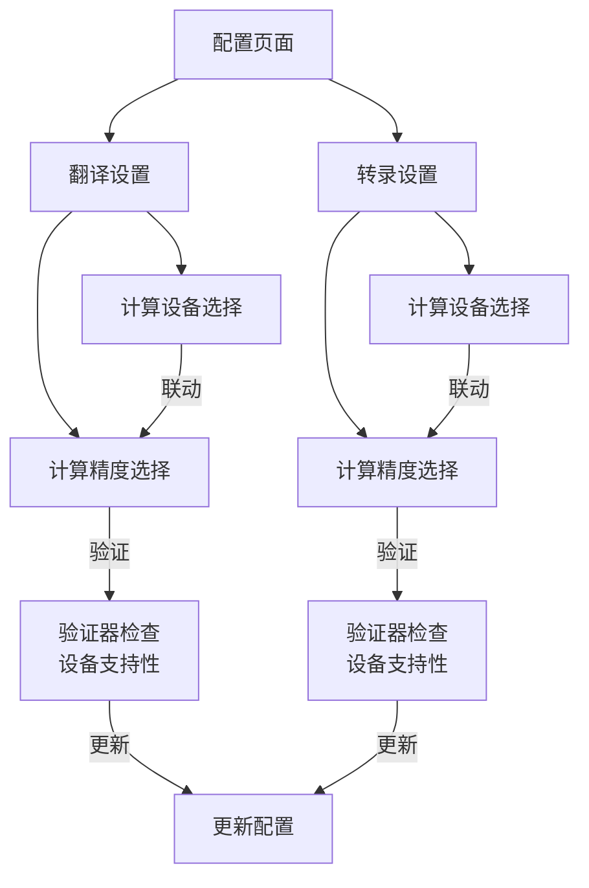
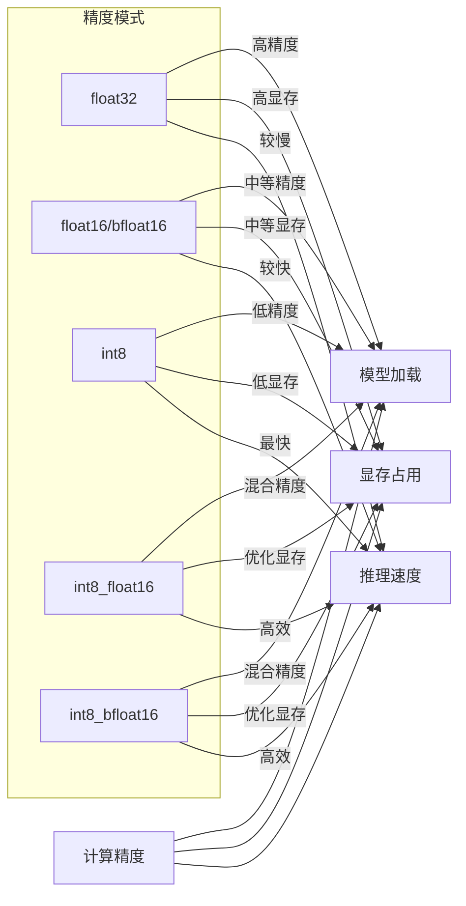

# 计算精度配置

<cite>
**本文档引用的文件**   
- [utils.py](file://src-python/utils.py)
- [config.py](file://src-python/config.py)
- [Translation.jsx](file://src-ui/views/app/config_page/setting_section/setting_box/translation/Translation.jsx)
- [Transcription.jsx](file://src-ui/views/app/config_page/setting_section/setting_box/transcription/Transcription.jsx)
- [device_manager.py](file://src-python/device_manager.py)
</cite>

## 目录
1. [计算精度模式概述](#计算精度模式概述)
2. [自动推荐最佳计算精度](#自动推荐最佳计算精度)
3. [计算精度验证机制](#计算精度验证机制)
4. [不同GPU架构的支持差异](#不同gpu架构的支持差异)
5. [前端配置界面分析](#前端配置界面分析)
6. [模型量化加载与运行效率](#模型量化加载与运行效率)

## 计算精度模式概述

VRCT系统支持多种计算精度模式，包括int8、float16、float32、bfloat16等。这些精度模式在性能和精度之间提供了不同的权衡。较低的精度模式（如int8）可以显著提高计算速度和降低显存占用，但可能会牺牲一定的计算精度；而较高的精度模式（如float32）则能提供更高的计算精度，但计算速度较慢且显存占用较高。

系统通过`utils.py`中的`getBestComputeType()`函数和`getComputeDeviceList()`函数来确定设备支持的计算精度类型，并根据设备特性自动推荐最佳的计算精度模式。这些配置最终通过`config.py`中的验证器确保所选精度模式在当前设备支持范围内。

**Section sources**
- [utils.py](file://src-python/utils.py#L92-L132)
- [config.py](file://src-python/config.py#L39)

## 自动推荐最佳计算精度

系统通过`getBestComputeType()`函数实现计算精度的自动推荐。该函数根据设备类型和设备名称来选择最优的计算精度模式。函数首先获取设备支持的所有计算精度类型，然后根据设备名称中的关键词选择相应的优先级列表。

**Diagram sources**
- [utils.py](file://src-python/utils.py#L134-L171)

**Section sources**
- [utils.py](file://src-python/utils.py#L134-L171)

## 计算精度验证机制

`config.py`文件中的`_selected_translation_compute_type_validator`和`_selected_transcription_compute_type_validator`验证器确保用户选择的计算精度模式在当前设备支持范围内。这些验证器检查所选精度模式是否存在于当前选定计算设备的`compute_types`列表中。

**Diagram sources**
- [config.py](file://src-python/config.py#L483-L489)
- [config.py](file://src-python/config.py#L353-L359)

**Section sources**
- [config.py](file://src-python/config.py#L483-L489)
- [config.py](file://src-python/config.py#L353-L359)

## 不同GPU架构的支持差异

不同GPU架构对计算精度模式的支持存在显著差异。系统通过`getComputeDeviceList()`函数识别设备类型并相应地限制支持的计算精度模式。

- **GTX系列显卡**：不支持bfloat16和float16精度模式，仅支持float32
- **RTX 30/40系列显卡**：支持int8、float16、bfloat16等多种精度模式
- **Tesla/A100/Quadro系列**：支持完整的精度模式集合

**Diagram sources**
- [utils.py](file://src-python/utils.py#L114-L118)
- [utils.py](file://src-python/utils.py#L149-L157)

**Section sources**
- [utils.py](file://src-python/utils.py#L114-L118)
- [utils.py](file://src-python/utils.py#L149-L157)

## 前端配置界面分析

用户可以在配置页面中为翻译和转录引擎独立设置计算精度。前端UI组件通过`Translation.jsx`和`Transcription.jsx`中的`MultiDropdownMenuContainer`实现这一功能。

**Diagram sources**
- [Translation.jsx](file://src-ui/views/app/config_page/setting_section/setting_box/translation/Translation.jsx#L107-L226)
- [Transcription.jsx](file://src-ui/views/app/config_page/setting_section/setting_box/transcription/Transcription.jsx#L277-L396)

**Section sources**
- [Translation.jsx](file://src-ui/views/app/config_page/setting_section/setting_box/translation/Translation.jsx#L107-L226)
- [Transcription.jsx](file://src-ui/views/app/config_page/setting_section/setting_box/transcription/Transcription.jsx#L277-L396)

## 模型量化加载与运行效率

计算精度设置直接影响CTranslate2和Whisper模型的量化加载方式与运行效率。不同的精度模式在模型加载、显存占用和推理速度方面表现出不同的特性。

**Diagram sources**
- [utils.py](file://src-python/utils.py#L150-L157)
- [config.py](file://src-python/config.py#L681-L682)
- [config.py](file://src-python/config.py#L726-L727)

**Section sources**
- [utils.py](file://src-python/utils.py#L150-L157)
- [config.py](file://src-python/config.py#L681-L682)
- [config.py](file://src-python/config.py#L726-L727)