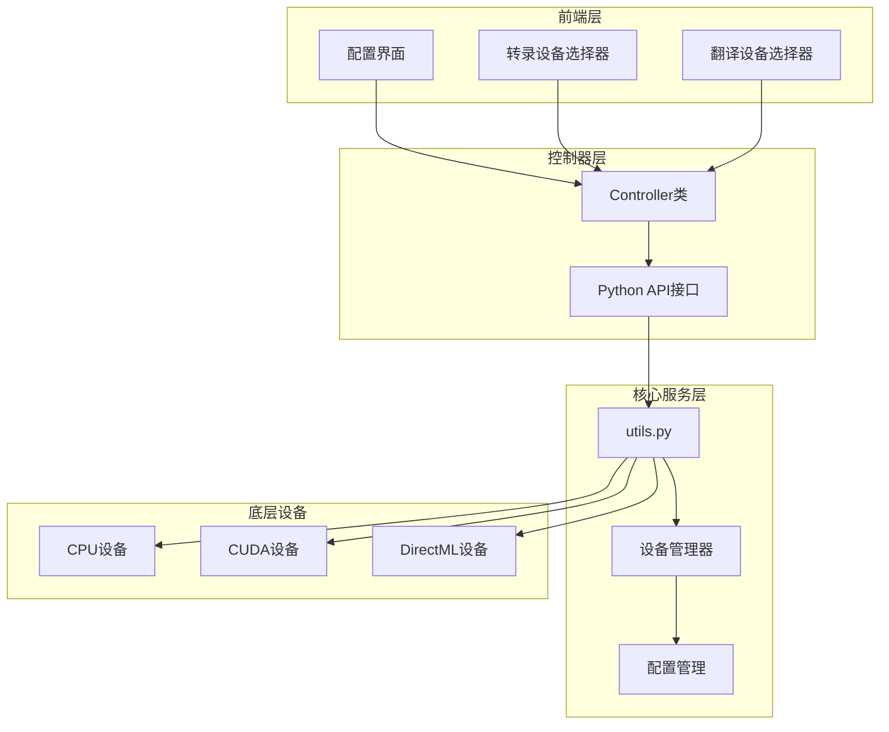
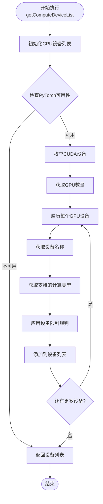
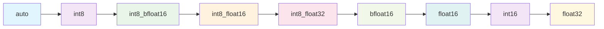
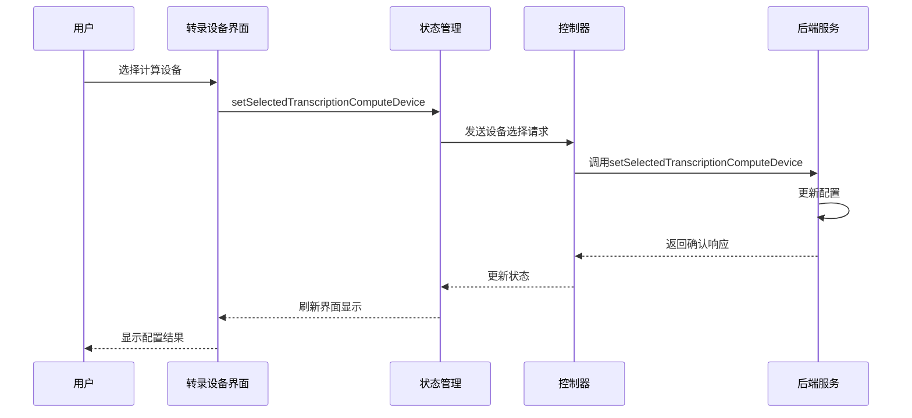
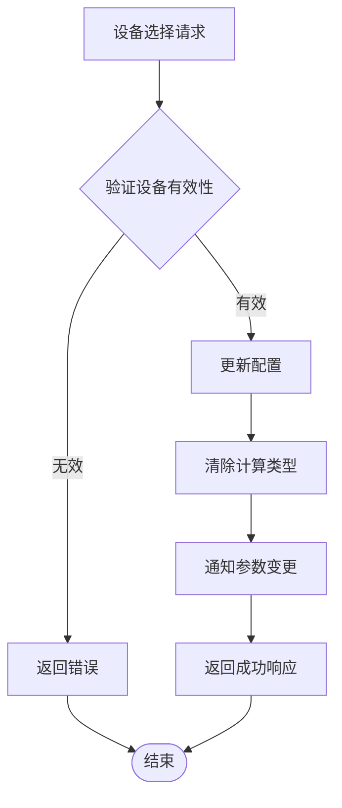
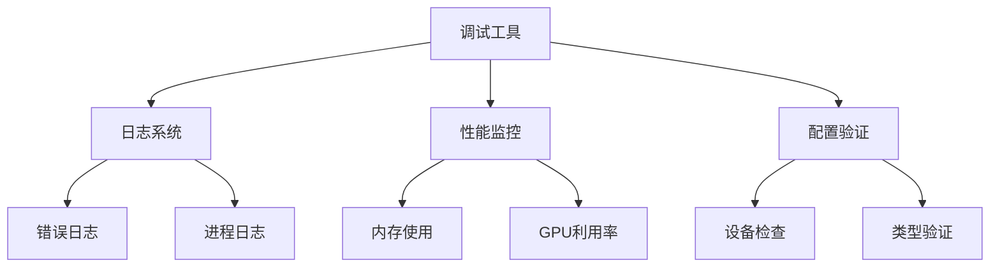

# 计算设备选择

<cite>
**本文档中引用的文件**
- [utils.py](file://src-python/utils.py)
- [controller.py](file://src-python/controller.py)
- [device_manager.py](file://src-python/device_manager.py)
- [config.py](file://src-python/config.py)
- [Transcription.jsx](file://src-ui/views/app/config_page/setting_section/setting_box/transcription/Transcription.jsx)
- [Translation.jsx](file://src-ui/views/app/config_page/setting_section/setting_box/translation/Translation.jsx)
- [ComputeDevice.jsx](file://src-ui/views/app/config_page/setting_section/setting_box/_components/compute_device/ComputeDevice.jsx)
- [mainloop.py](file://src-python/mainloop.py)
</cite>

## 目录
1. [简介](#简介)
2. [系统架构概览](#系统架构概览)
3. [设备枚举机制](#设备枚举机制)
4. [前端配置界面](#前端配置界面)
5. [后端处理流程](#后端处理流程)
6. [设备性能特征](#设备性能特征)
7. [最佳实践指南](#最佳实践指南)
8. [故障排除](#故障排除)
9. [总结](#总结)

## 简介

VRCT（Voice Recognition and Communication Tool）是一个集成了语音转录和翻译功能的应用程序。为了优化性能，系统提供了灵活的计算设备选择机制，支持CPU、NVIDIA GPU、AMD GPU和Intel集成显卡等多种计算设备。本文档详细介绍了如何在VRCT中选择合适的计算设备，以及如何通过前端配置页面进行设备设置。

## 系统架构概览

VRCT的计算设备管理系统采用分层架构设计，包含以下核心组件：



**图表来源**
- [controller.py](file://src-python/controller.py#L11-L50)
- [utils.py](file://src-python/utils.py#L92-L132)
- [device_manager.py](file://src-python/device_manager.py#L57-L122)

## 设备枚举机制

### getComputeDeviceList()函数详解

系统的核心设备枚举功能由`utils.py`中的`getComputeDeviceList()`函数实现。该函数负责检测和枚举所有可用的计算设备。



**图表来源**
- [utils.py](file://src-python/utils.py#L92-L132)

### 设备类型识别与分类

系统能够识别多种类型的计算设备：

| 设备类型 | 识别方式 | 支持的计算类型 | 性能特征 |
|---------|---------|---------------|----------|
| CPU | 固定标识符 | auto, float32, int8 | 通用性强，功耗低 |
| NVIDIA GPU | torch.cuda.get_device_name() | 根据架构动态确定 | 性能最强，支持混合精度 |
| AMD GPU | 通过DirectML或ROCm | 有限支持 | 部分支持，兼容性较好 |
| Intel集成显卡 | 通过DirectML | float32为主 | 功耗低，适合轻量级任务 |

### 计算类型优先级排序

系统为不同设备类型定义了计算类型的优先级顺序：



**图表来源**
- [utils.py](file://src-python/utils.py#L134-L171)

**节来源**
- [utils.py](file://src-python/utils.py#L92-L132)
- [utils.py](file://src-python/utils.py#L134-L171)

## 前端配置界面

### 转录设备配置

转录功能的设备配置通过`Transcription.jsx`组件实现，提供直观的下拉菜单选择界面。



**图表来源**
- [Transcription.jsx](file://src-ui/views/app/config_page/setting_section/setting_box/transcription/Transcription.jsx#L358-L361)
- [controller.py](file://src-python/controller.py#L804-L809)

### 翻译设备配置

翻译功能的设备配置同样通过专门的组件实现，具有类似的交互模式但针对不同的计算需求。

### 设备选择界面特性

1. **智能设备命名**：对于同名设备，系统会自动添加索引以区分多个相同型号的设备
2. **计算类型过滤**：根据设备能力动态调整可用的计算类型选项
3. **实时验证**：确保所选设备和计算类型的有效性
4. **状态反馈**：提供配置过程中的状态指示

**节来源**
- [Transcription.jsx](file://src-ui/views/app/config_page/setting_section/setting_box/transcription/Transcription.jsx#L277-L424)
- [Translation.jsx](file://src-ui/views/app/config_page/setting_section/setting_box/translation/Translation.jsx#L107-L200)

## 后端处理流程

### 设备选择处理机制

后端通过`controller.py`中的相应方法处理设备选择请求：



**图表来源**
- [controller.py](file://src-python/controller.py#L789-L794)
- [controller.py](file://src-python/controller.py#L804-L809)

### 配置持久化

系统使用`config.py`中的配置管理机制确保设备选择的持久化：

| 配置项 | 类型 | 描述 |
|-------|------|------|
| SELECTED_TRANSCRIPTION_COMPUTE_DEVICE | dict | 当前选择的转录设备配置 |
| SELECTED_TRANSCRIPTION_COMPUTE_TYPE | str | 转录设备的计算类型 |
| SELECTED_TRANSLATION_COMPUTE_DEVICE | dict | 当前选择的翻译设备配置 |
| SELECTED_TRANSLATION_COMPUTE_TYPE | str | 翻译设备的计算类型 |

**节来源**
- [controller.py](file://src-python/controller.py#L789-L809)
- [config.py](file://src-python/config.py#L681-L726)

## 设备性能特征

### 不同设备类型的性能对比

| 设备类型 | 推荐用途 | 内存占用 | 推理延迟 | 模型加载时间 | 功耗 |
|---------|---------|---------|---------|-------------|------|
| CPU | 轻量级任务，低功耗场景 | 中等 | 较高 | 快速 | 低 |
| NVIDIA RTX系列 | 高性能推理，大型模型 | 高 | 极低 | 中等 | 中等 |
| NVIDIA GTX系列 | 中等性能，成本敏感 | 中等 | 中等 | 中等 | 低 |
| AMD GPU | 替代方案，兼容性需求 | 中等 | 较高 | 快速 | 低 |
| Intel集成显卡 | 基础功能，节能考虑 | 低 | 很高 | 快速 | 很低 |

### 设备选择建议

#### 高性能需求场景
- **推荐设备**：NVIDIA RTX 30系及以上
- **计算类型**：int8_bfloat16 或 float16
- **适用场景**：实时转录、多语言翻译、大型模型推理

#### 平衡性能与成本
- **推荐设备**：NVIDIA GTX 16系或AMD RX 6000系列
- **计算类型**：int8 或 float32
- **适用场景**：日常使用、中等负载任务

#### 能源效率优先
- **推荐设备**：Intel集成显卡或较旧的NVIDIA GPU
- **计算类型**：float32
- **适用场景**：长时间运行、低功耗环境

**节来源**
- [utils.py](file://src-python/utils.py#L114-L119)
- [utils.py](file://src-python/utils.py#L150-L166)

## 最佳实践指南

### 硬件配置建议

#### 推荐的最低配置
- **CPU**：4核心以上，支持AVX指令集
- **内存**：8GB RAM（推荐16GB）
- **存储**：SSD至少20GB可用空间
- **GPU**：NVIDIA GTX 1060 6GB或同等性能的设备

#### 推荐的高性能配置
- **CPU**：8核心以上，高主频
- **内存**：32GB RAM或更高
- **存储**：NVMe SSD至少100GB
- **GPU**：NVIDIA RTX 3080 10GB或更高

### 设备选择策略

1. **评估任务需求**
   - 实时转录：优先选择高性能GPU
   - 批量处理：可考虑CPU或中等性能GPU
   - 多语言翻译：需要较大内存的GPU

2. **考虑资源竞争**
   - 如果同时运行其他GPU密集型应用，选择较低性能的设备
   - 对于工作站环境，可选择高端设备

3. **测试性能表现**
   - 使用系统提供的基准测试功能
   - 监控内存使用情况和温度
   - 测试不同计算类型的效果

### 配置优化技巧

1. **自动选择策略**
   ```javascript
   // 自动选择最佳设备的逻辑示例
   const bestDevice = devices.reduce((best, device) => {
       if (device.device === 'cuda' && device.compute_types.includes('int8_bfloat16')) {
           return device;
       }
       return best;
   }, devices[0]);
   ```

2. **监控设备状态**
   - 定期检查设备可用性
   - 监控内存使用情况
   - 处理设备热插拔事件

**节来源**
- [utils.py](file://src-python/utils.py#L134-L171)

## 故障排除

### 常见问题及解决方案

#### 设备无法识别
**症状**：设备列表中不显示预期的GPU
**可能原因**：
- CUDA驱动未正确安装
- PyTorch版本不兼容
- 设备被其他应用程序占用

**解决步骤**：
1. 检查CUDA驱动版本是否匹配
2. 验证PyTorch安装状态
3. 关闭占用GPU的其他程序
4. 重启VRCT应用程序

#### 计算类型不匹配
**症状**：选择的计算类型在设备上不可用
**解决方法**：
- 系统会自动降级到兼容的计算类型
- 手动选择更基础的计算类型（如float32）

#### 性能问题
**症状**：设备选择后性能没有提升
**排查步骤**：
1. 检查设备温度和风扇状态
2. 验证内存使用情况
3. 确认模型文件已正确下载
4. 尝试不同的计算类型

### 调试工具

系统提供了多种调试和诊断工具：



**图表来源**
- [utils.py](file://src-python/utils.py#L224-L291)

**节来源**
- [utils.py](file://src-python/utils.py#L128-L131)
- [utils.py](file://src-python/utils.py#L280-L291)

## 总结

VRCT的计算设备选择系统提供了全面而灵活的设备管理功能。通过`getComputeDeviceList()`函数的智能设备枚举，前端配置界面的直观操作，以及后端的可靠处理机制，用户可以轻松地为转录和翻译功能选择最适合的计算设备。

关键要点：
1. **自动化设备检测**：系统自动识别所有可用的计算设备
2. **智能计算类型选择**：根据设备能力自动选择最优的计算类型
3. **直观的用户界面**：提供易于使用的配置界面
4. **可靠的配置持久化**：确保设备选择设置的长期保存
5. **灵活的性能调优**：支持从CPU到高端GPU的各种配置

通过遵循本文档提供的最佳实践和故障排除指南，用户可以充分发挥VRCT的性能潜力，获得最佳的语音转录和翻译体验。