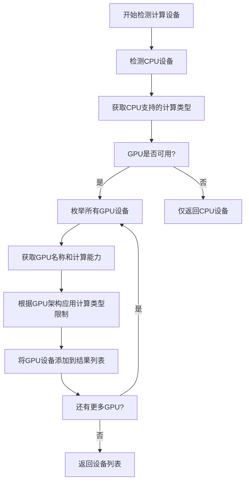
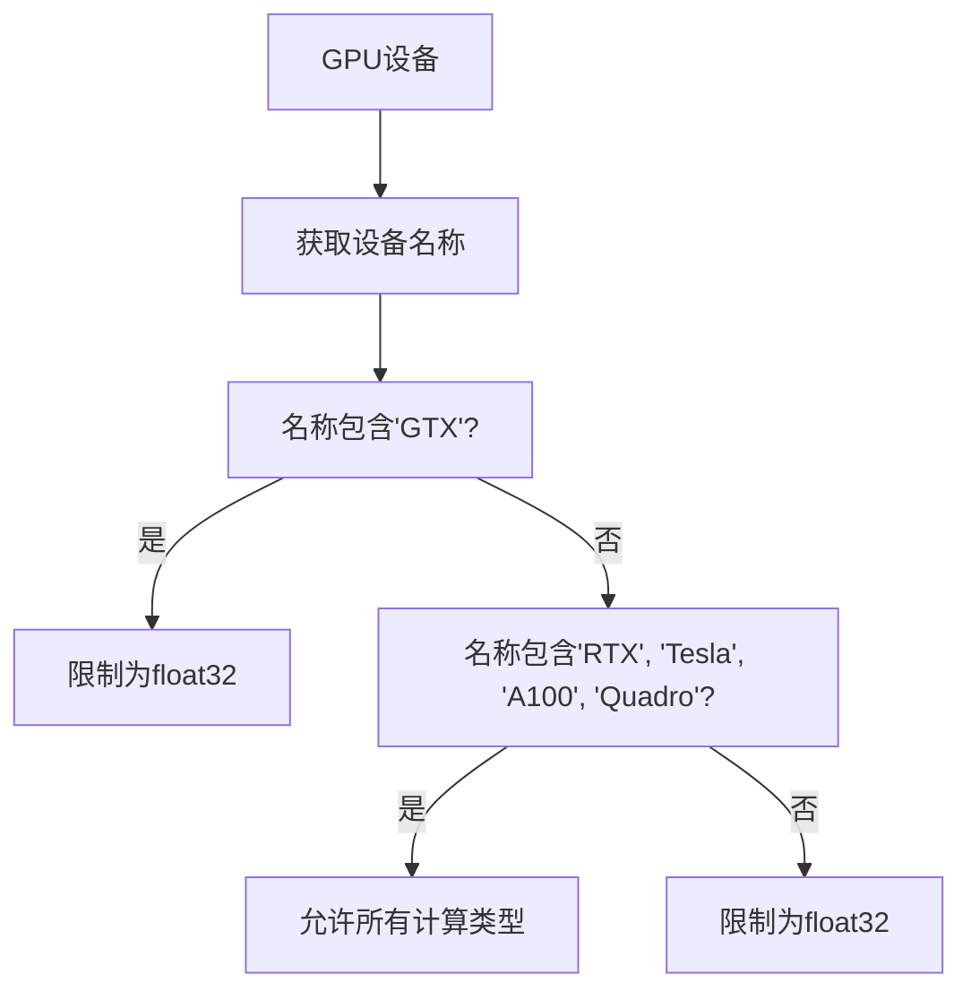
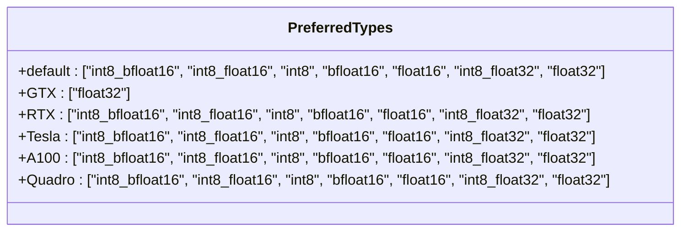
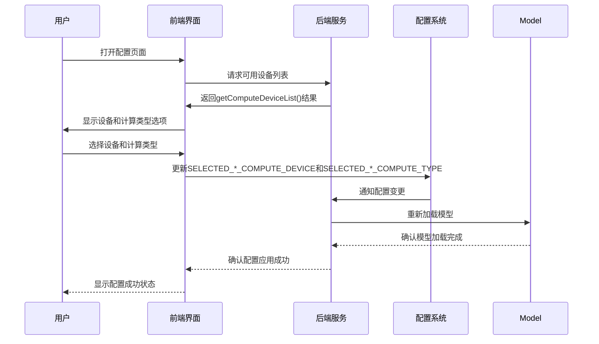
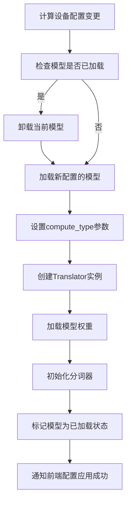

# 计算资源优化

<cite>
**本文档中引用的文件**  
- [utils.py](file://src-python/utils.py#L92-L170)
- [config.py](file://src-python/config.py#L680-L734)
- [model.py](file://src-python/model.py#L158-L164)
- [translation_translator.py](file://src-python/models/translation/translation_translator.py#L241-L258)
- [Transcription.jsx](file://src-ui/views/app/config_page/setting_section/setting_box/transcription/Transcription.jsx#L277-L358)
- [Translation.jsx](file://src-ui/views/app/config_page/setting_section/setting_box/translation/Translation.jsx#L107-L206)
- [ComputeDevice.jsx](file://src-ui/views/app/config_page/setting_section/setting_box/_components/compute_device/ComputeDevice.jsx#L1-L27)
</cite>

## 目录
1. [计算设备与计算类型概述](#计算设备与计算类型概述)
2. [自动检测可用设备](#自动检测可用设备)
3. [GPU架构对计算类型的支持差异](#gpu架构对计算类型的支持差异)
4. [最优计算类型选择策略](#最优计算类型选择策略)
5. [前端配置页面操作指南](#前端配置页面操作指南)
6. [计算设备设置对模型加载和推理的影响](#计算设备设置对模型加载和推理的影响)

## 计算设备与计算类型概述

在VRCT系统中，计算资源的合理选择对于优化性能至关重要。系统支持多种计算设备（CPU/GPU）和计算类型（compute type），用户可以根据硬件配置选择最优组合以提升翻译与转录任务的效率。

计算设备主要包括：
- **CPU**: 通用处理器，适用于所有场景，但性能相对较低
- **CUDA GPU**: NVIDIA显卡，支持多种计算精度模式，性能显著优于CPU

计算类型定义了模型运行时的数值精度和计算方式，常见的计算类型包括：
- `float32`: 32位浮点数，精度最高，兼容性最好
- `float16`: 16位浮点数，半精度，速度较快，内存占用较少
- `int8`: 8位整数，低精度，速度最快，内存占用最少
- `bfloat16`: bfloat16格式，平衡精度和性能
- `int8_float16`, `int8_bfloat16`: 混合精度模式，结合整数和浮点数的优势

**Section sources**
- [utils.py](file://src-python/utils.py#L92-L170)

## 自动检测可用设备

系统通过`utils.py`中的`getComputeDeviceList()`函数自动检测可用的计算设备及其支持的计算类型。该函数返回一个包含所有可用设备信息的列表，每个设备对象包含设备类型、索引、名称和支持的计算类型。

**Diagram sources**
- [utils.py](file://src-python/utils.py#L92-L132)

**Section sources**
- [utils.py](file://src-python/utils.py#L92-L132)

## GPU架构对计算类型的支持差异

不同GPU架构对计算类型的支持存在显著差异，系统根据显卡型号自动应用相应的限制规则：

### GTX系列显卡
GTX系列显卡（如GTX 10xx, GTX 16xx）由于架构限制，不支持某些高效的计算类型。系统会自动排除以下计算类型：
- `int8_bfloat16`
- `bfloat16`
- `float16`
- `int8`

因此，GTX系列显卡只能使用`float32`计算类型，虽然保证了兼容性，但性能提升有限。

### RTX、Tesla、A100、Quadro系列显卡
这些高端显卡支持完整的计算类型集合，包括所有高效的混合精度和低精度模式：
- `int8_bfloat16`
- `int8_float16`
- `int8`
- `bfloat16`
- `float16`
- `int8_float32`
- `float32`

这使得它们能够充分利用现代深度学习框架的优化特性，实现最佳性能。

### 其他显卡
对于无法识别或不属于上述类别的显卡，系统出于安全考虑，仅允许使用`float32`计算类型，确保基本功能的正常运行。

**Diagram sources**
- [utils.py](file://src-python/utils.py#L114-L118)

**Section sources**
- [utils.py](file://src-python/utils.py#L114-L118)
- [docs/utils.md](file://src-python/docs/utils.md#L254-L267)

## 最优计算类型选择策略

系统通过`getBestComputeType()`函数实现智能的计算类型选择策略。该函数根据设备类型和架构，从支持的计算类型中选择最优的配置。

### 选择优先级
系统定义了不同设备的计算类型优先级列表，按照性能和效率从高到低排序：

**Diagram sources**
- [utils.py](file://src-python/utils.py#L150-L157)

### 选择算法
选择算法遵循以下步骤：
1. 获取设备支持的所有计算类型
2. 根据设备名称确定对应的优先级列表
3. 按照优先级顺序检查每个计算类型是否可用
4. 返回第一个可用的计算类型
5. 如果没有可用类型，则返回`float32`作为安全的备选方案

这种策略确保了在保证兼容性的前提下，尽可能选择性能最优的计算类型。

**Section sources**
- [utils.py](file://src-python/utils.py#L134-L170)

## 前端配置页面操作指南

用户可以通过前端配置页面直观地设置翻译与转录任务的计算设备，操作步骤如下：

### 访问配置页面
1. 启动VRCT应用程序
2. 点击主界面右上角的"设置"按钮（齿轮图标）
3. 进入配置页面的"翻译"或"转录"选项卡

### 设置翻译计算设备
1. 在"翻译"选项卡中找到"计算设备"设置区域
2. 在第一个下拉菜单中选择目标GPU设备或CPU
3. 在第二个下拉菜单中选择计算类型，系统会根据所选设备自动过滤不支持的选项
4. 更改设置后，系统会自动保存并应用新配置

### 设置转录计算设备
1. 在"转录"选项卡中找到"计算设备"设置区域
2. 操作方式与翻译设置完全相同
3. 可以为翻译和转录任务分别选择不同的设备和计算类型

### 界面组件说明
前端使用`ComputeDevice.jsx`组件实现设备选择功能，该组件包含两个联动的下拉菜单：
- 第一个菜单显示所有可用的计算设备
- 第二个菜单动态显示所选设备支持的计算类型
- 菜单项按照性能优先级排序，便于用户选择最优配置

**Diagram sources**
- [Translation.jsx](file://src-ui/views/app/config_page/setting_section/setting_box/translation/Translation.jsx#L107-L206)
- [Transcription.jsx](file://src-ui/views/app/config_page/setting_section/setting_box/transcription/Transcription.jsx#L277-L358)
- [ComputeDevice.jsx](file://src-ui/views/app/config_page/setting_section/setting_box/_components/compute_device/ComputeDevice.jsx#L1-L27)

**Section sources**
- [Translation.jsx](file://src-ui/views/app/config_page/setting_section/setting_box/translation/Translation.jsx#L107-L206)
- [Transcription.jsx](file://src-ui/views/app/config_page/setting_section/setting_box/transcription/Transcription.jsx#L277-L358)

## 计算设备设置对模型加载和推理的影响

计算设备和计算类型的设置直接影响模型的加载过程和推理性能，具体影响如下：

### 模型加载过程
当用户更改计算设备设置时，系统会触发模型重新加载流程：

**Diagram sources**
- [model.py](file://src-python/model.py#L158-L164)
- [translation_translator.py](file://src-python/models/translation/translation_translator.py#L241-L258)

### 性能影响分析
不同的计算类型对性能的影响显著不同：

| 计算类型 | 内存占用 | 推理速度 | 精度 | 适用场景 |
|---------|--------|--------|-----|--------|
| float32 | 高 | 慢 | 最高 | 兼容性要求高的环境 |
| float16 | 中 | 快 | 高 | 大多数GPU环境 |
| int8 | 低 | 很快 | 中 | 对速度要求极高的场景 |
| bfloat16 | 中 | 快 | 高 | 平衡精度和性能 |
| int8_bfloat16 | 低 | 很快 | 中高 | 高端GPU的最佳选择 |

### 实际性能表现
- **RTX 30/40系列显卡**: 使用`int8_bfloat16`计算类型可实现3-5倍的速度提升，同时保持良好的翻译质量
- **GTX 10/16系列显卡**: 由于只能使用`float32`，性能提升有限，建议升级硬件以获得更好的体验
- **CPU模式**: 适用于没有独立显卡的环境，但推理速度较慢，适合轻量级使用

通过合理选择计算设备和计算类型，用户可以在保证翻译和转录质量的前提下，显著提升系统性能，实现更流畅的实时翻译体验。

**Section sources**
- [model.py](file://src-python/model.py#L158-L164)
- [translation_translator.py](file://src-python/models/translation/translation_translator.py#L241-L258)
- [config.py](file://src-python/config.py#L680-L734)