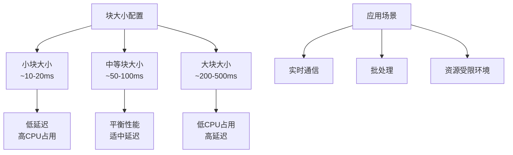
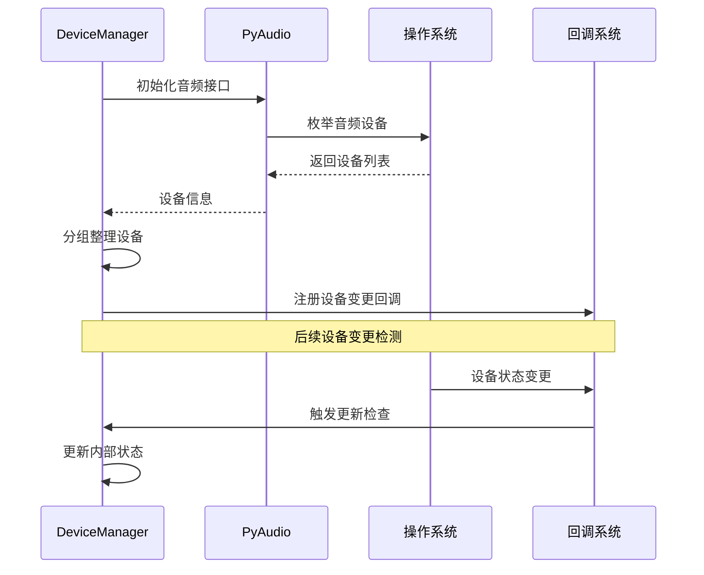
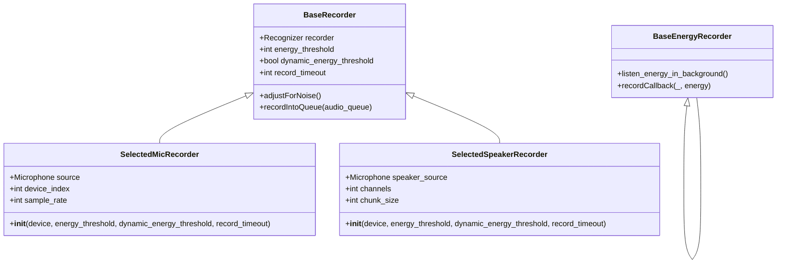
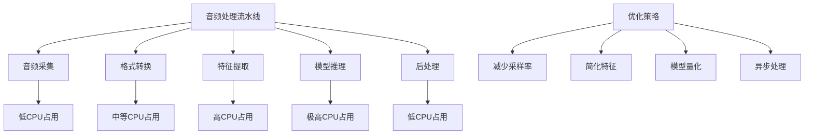
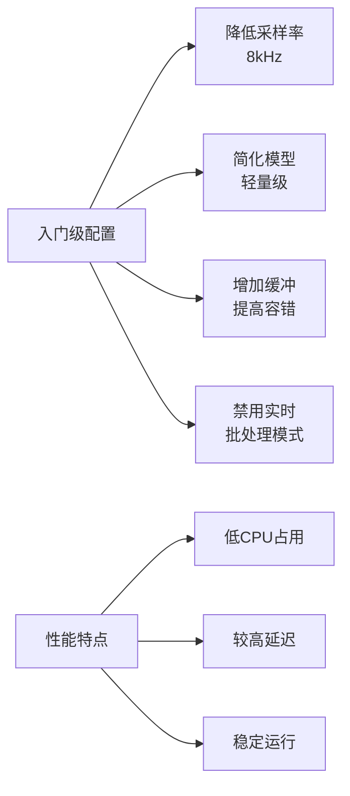

# 音频处理性能调优

<cite>
**本文档引用的文件**
- [device_manager.py](file://src-python/device_manager.py)
- [transcription_recorder.py](file://src-python/models/transcription/transcription_recorder.py)
- [transcription_transcriber.py](file://src-python/models/transcription/transcription_transcriber.py)
- [config.py](file://src-python/config.py)
- [controller.py](file://src-python/controller.py)
- [model.py](file://src-python/model.py)
- [mainloop.py](file://src-python/mainloop.py)
- [transcription_recorder.md](file://src-python/docs/details/transcription_recorder.md)
</cite>

## 目录
1. [概述](#概述)
2. [音频采样率与缓冲区配置](#音频采样率与缓冲区配置)
3. [device_manager.py中的音频设备管理](#device_managerpy中的音频设备管理)
4. [transcription_recorder.py中的音频流处理](#transcription_recorderpy中的音频流处理)
5. [性能瓶颈分析与优化策略](#性能瓶颈分析与优化策略)
6. [硬件配置最佳实践](#硬件配置最佳实践)
7. [故障排除指南](#故障排除指南)
8. [总结](#总结)

## 概述

VRCT项目是一个实时语音翻译应用程序，其核心功能依赖于高质量的音频处理能力。音频处理性能直接影响系统的响应速度、稳定性和用户体验。本文档深入分析了影响音频处理性能的关键因素，并提供了针对性的优化建议。

## 音频采样率与缓冲区配置

### 核心参数配置

音频处理系统的核心参数包括采样率、块大小（chunk size）、缓冲区大小等，这些参数直接影响CPU占用率和延迟表现。

#### 默认采样率设置

系统默认采用16kHz采样率作为标准配置：
- **默认采样率**: 16000 Hz
- **音频格式**: 16-bit PCM
- **通道数**: 支持单声道和立体声

#### 块大小优化策略

**图表来源**
- [transcription_recorder.py](file://src-python/models/transcription/transcription_recorder.py#L43-L51)
- [transcription_transcriber.py](file://src-python/models/transcription/transcription_transcriber.py#L64-L66)

### 缓冲区管理机制

系统采用多层缓冲策略来平衡性能和稳定性：

| 缓冲区类型 | 大小配置 | 用途 | 性能影响 |
|------------|----------|------|----------|
| 音频输入缓冲 | 可变 | 实时音频捕获 | 影响延迟 |
| 处理队列缓冲 | 动态 | 异步处理协调 | 影响吞吐量 |
| 输出缓冲 | 固定 | 结果缓存 | 影响响应性 |

**节来源**
- [transcription_recorder.py](file://src-python/models/transcription/transcription_recorder.py#L17-L35)
- [config.py](file://src-python/config.py#L640-L670)

## device_manager.py中的音频设备管理

### 设备发现与监控机制

device_manager模块负责音频设备的动态发现和状态监控，是确保录音稳定性的重要组件。

#### 设备发现流程

**图表来源**
- [device_manager.py](file://src-python/device_manager.py#L154-L237)

#### 设备状态监控

系统实现了多层次的设备监控机制：

1. **COM事件监控**（Windows专用）
   - 使用pycaw库监听设备变更事件
   - 实现低延迟的设备状态检测

2. **轮询机制**（通用fallback）
   - 定期检查设备状态变化
   - 确保跨平台兼容性

3. **状态同步机制**
   - 检查更新标志位
   - 执行回调函数链

**节来源**
- [device_manager.py](file://src-python/device_manager.py#L266-L305)

### 设备选择策略

系统支持多种设备类型的自动识别和选择：

| 设备类型 | 识别方式 | 性能特点 | 推荐场景 |
|----------|----------|----------|----------|
| 内置麦克风 | 系统默认设备 | 低延迟，质量稳定 | 日常使用 |
| USB麦克风 | 设备名称匹配 | 高质量，可定制 | 专业录音 |
| 蓝牙设备 | 协议识别 | 无线便利，可能延迟 | 移动场景 |
| 虚拟设备 | 特殊标记 | 灵活配置，软件依赖 | 开发测试 |

**节来源**
- [device_manager.py](file://src-python/device_manager.py#L156-L201)

## transcription_recorder.py中的音频流处理

### 音频录制器架构

系统提供了多种音频录制器以适应不同的使用场景：

**图表来源**
- [transcription_recorder.py](file://src-python/models/transcription/transcription_recorder.py#L14-L35)
- [transcription_recorder.py](file://src-python/models/transcription/transcription_recorder.py#L38-L82)

### 音频流处理流程

#### 微调参数对性能的影响

| 参数名称 | 默认值 | 性能影响 | 调整建议 |
|----------|--------|----------|----------|
| energy_threshold | 300 | 影响噪声过滤效果 | 根据环境噪声调整 |
| dynamic_energy_threshold | True | 影响自适应灵敏度 | 高噪声环境关闭 |
| record_timeout | 5秒 | 影响录音持续时间 | 根据需求调整 |
| phrase_timeout | 3秒 | 影响停顿检测 | 平衡准确性和流畅性 |

**节来源**
- [transcription_recorder.py](file://src-python/models/transcription/transcription_recorder.py#L17-L25)
- [config.py](file://src-python/config.py#L640-L670)

### 能量检测机制

系统实现了双模式的能量检测：

1. **基础能量检测**
   - 实时监测音频能量水平
   - 提供简单的音量反馈

2. **音频+能量混合检测**
   - 同时进行音频录制和能量检测
   - 适用于需要精确控制的场景

**节来源**
- [transcription_recorder.py](file://src-python/models/transcription/transcription_recorder.py#L84-L105)
- [transcription_recorder.py](file://src-python/models/transcription/transcription_recorder.py#L150-L191)

## 性能瓶颈分析与优化策略

### 主要性能瓶颈点

#### 1. CPU密集型操作

**图表来源**
- [transcription_transcriber.py](file://src-python/models/transcription/transcription_transcriber.py#L31-L41)

#### 2. 内存使用优化

系统采用了多种内存优化技术：

- **缓冲区池化**: 重用音频缓冲区，减少内存分配开销
- **数据压缩**: 对长时间音频片段进行压缩存储
- **垃圾回收**: 定期清理无用对象，防止内存泄漏

#### 3. 网络传输优化

对于在线翻译服务，系统实现了智能缓存和批量传输：

- **请求合并**: 将多个小请求合并为批量请求
- **压缩传输**: 使用gzip压缩减少网络带宽
- **断线重连**: 实现自动重连机制

**节来源**
- [transcription_transcriber.py](file://src-python/models/transcription/transcription_transcriber.py#L190-L220)

### 性能监控指标

| 指标类别 | 关键指标 | 正常范围 | 优化目标 |
|----------|----------|----------|----------|
| 延迟指标 | 音频到文本延迟 | < 500ms | < 200ms |
| 吞吐量 | 处理音频段数/秒 | > 10段/秒 | > 20段/秒 |
| CPU使用率 | 整体CPU占用 | < 50% | < 30% |
| 内存使用 | 峰值内存占用 | < 2GB | < 1GB |

## 硬件配置最佳实践

### 不同硬件配置的推荐设置

#### 入门级配置（CPU < 2GHz）

#### 中端配置（CPU 2-4GHz）

- **推荐采样率**: 16kHz
- **模型选择**: 标准模型
- **缓冲区大小**: 中等
- **并发处理**: 适度

#### 高端配置（CPU > 4GHz）

- **推荐采样率**: 48kHz（如果设备支持）
- **模型选择**: 最大精度模型
- **缓冲区大小**: 较小
- **并发处理**: 高度优化

### GPU加速配置

对于支持CUDA的GPU，系统提供了显著的性能提升：

| GPU型号 | 推荐配置 | 性能提升 | 功耗 |
|---------|----------|----------|------|
| GTX 1060 | 中等模型 | 3-4x | 中等 |
| RTX 3070 | 大模型 | 6-8x | 高 |
| RTX 4080 | 最大模型 | 10-12x | 很高 |

**节来源**
- [config.py](file://src-python/config.py#L770-L772)

## 故障排除指南

### 常见音频问题及解决方案

#### 1. 音频丢包问题

**症状**: 录音中断或音频丢失
**原因分析**:
- CPU负载过高
- 缓冲区太小
- 设备驱动问题

**解决方案**:
- 降低采样率至8kHz
- 增加缓冲区大小
- 更新音频驱动程序

#### 2. 延迟过高问题

**症状**: 音频到文本转换延迟超过预期
**诊断步骤**:
1. 检查CPU使用率
2. 分析网络延迟
3. 评估模型复杂度

**优化措施**:
- 使用本地模型替代在线服务
- 减少音频预处理步骤
- 优化网络连接

#### 3. 设备兼容性问题

**症状**: 特定设备无法正常工作
**解决策略**:
- 检查设备驱动版本
- 尝试不同的音频API（WASAPI/MME）
- 使用虚拟音频设备作为中间层

**节来源**
- [device_manager.py](file://src-python/device_manager.py#L266-L305)

### 性能调优检查清单

- [ ] CPU使用率 < 50%
- [ ] 音频延迟 < 500ms
- [ ] 内存使用稳定
- [ ] 设备识别准确
- [ ] 错误率 < 1%

## 总结

VRCT项目的音频处理系统通过精心设计的架构和优化策略，实现了高性能的实时语音翻译功能。关键优化要点包括：

1. **合理的采样率配置**: 16kHz为大多数场景的最佳选择
2. **智能的设备管理**: 自动化的设备发现和状态监控
3. **高效的缓冲策略**: 多层次的缓冲机制平衡性能和稳定性
4. **灵活的硬件适配**: 支持从入门级到高端的各种硬件配置

通过遵循本文档提供的配置建议和优化策略，用户可以在不同硬件环境下获得最佳的音频处理性能，确保系统的稳定运行和优秀的用户体验。