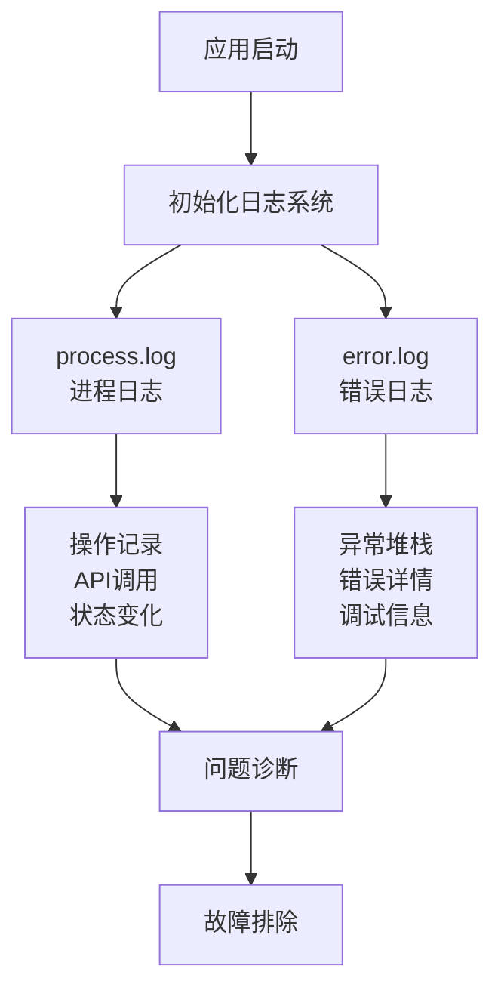
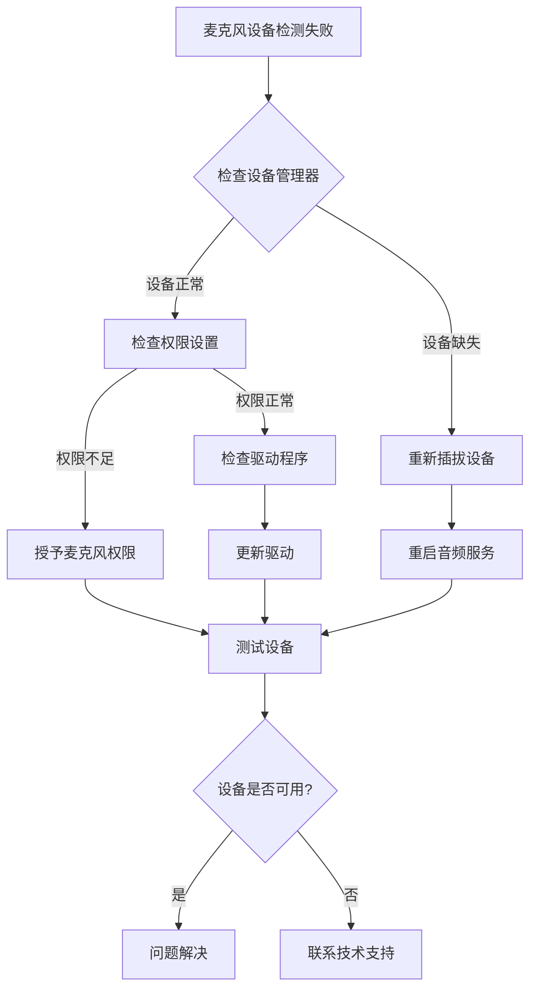
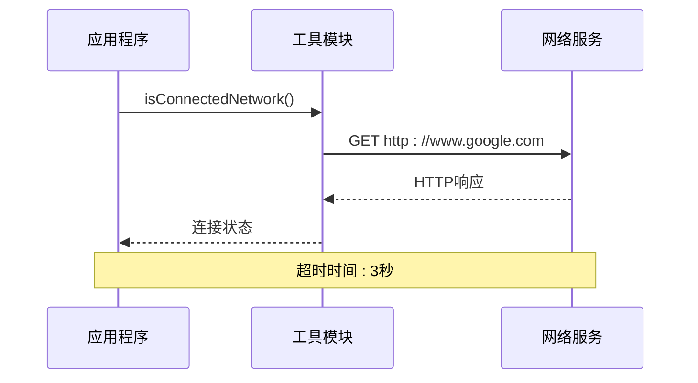
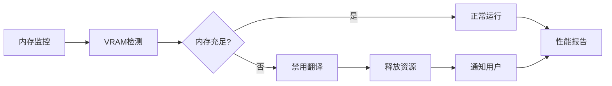
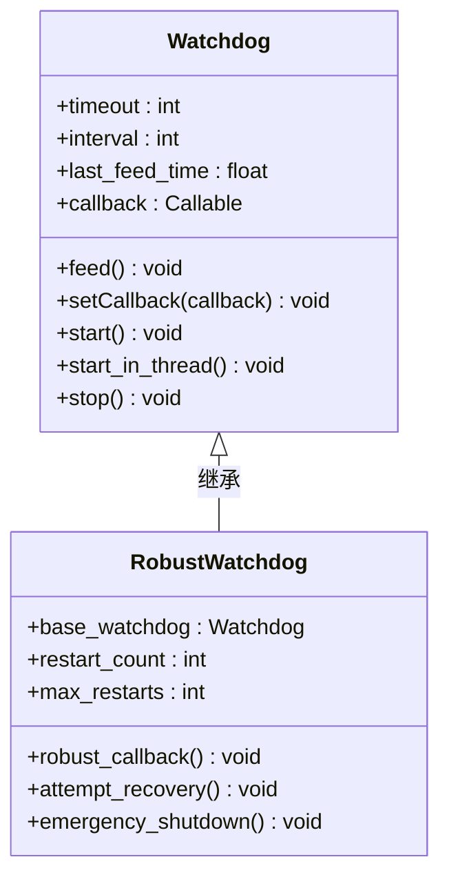
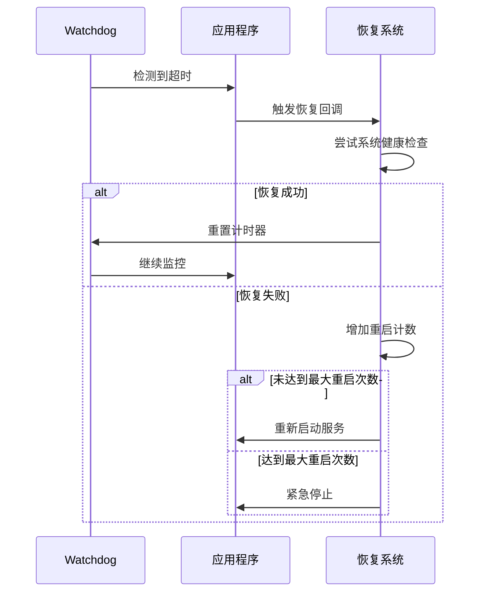
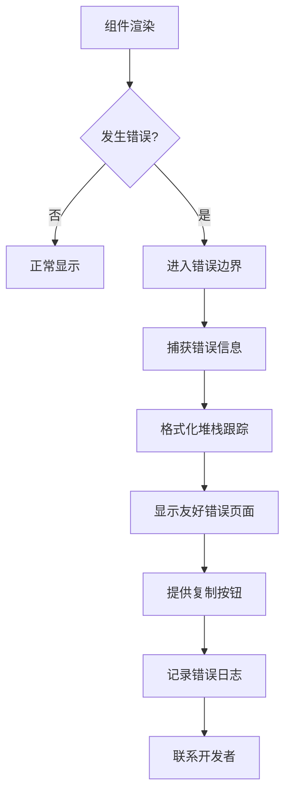

# 故障排除

<cite>
**本文档中引用的文件**
- [utils.py](file://src-python/utils.py)
- [device_manager.py](file://src-python/device_manager.py)
- [watchdog.py](file://src-python/models/watchdog/watchdog.py)
- [AppErrorBoundary.jsx](file://src-ui/views/app/others/error_boundary/AppErrorBoundary.jsx)
- [controller.py](file://src-python/controller.py)
- [config.py](file://src-python/config.py)
- [test_client.py](file://src-python/test_client.py)
- [useIsBackendReady.js](file://src-ui/logics/common/useIsBackendReady.js)
</cite>

## 目录
1. [简介](#简介)
2. [日志系统与问题诊断](#日志系统与问题诊断)
3. [安装失败问题](#安装失败问题)
4. [音频设备问题](#音频设备问题)
5. [翻译引擎连接问题](#翻译引擎连接问题)
6. [性能问题](#性能问题)
7. [后端进程监控与恢复](#后端进程监控与恢复)
8. [前端错误处理机制](#前端错误处理机制)
9. [常见问题解决方案](#常见问题解决方案)
10. [预防措施与最佳实践](#预防措施与最佳实践)

## 简介

VRCT是一个复杂的多语言语音转录和翻译系统，涉及Python后端、React前端、音频设备管理和AI翻译引擎等多个组件。本故障排除指南旨在帮助用户快速识别和解决系统运行过程中遇到的各种问题。

## 日志系统与问题诊断

### 日志记录架构

VRCT采用分层的日志记录系统，包含两个主要的日志文件：



**图表来源**
- [utils.py](file://src-python/utils.py#L192-L293)

### 日志文件位置

- **进程日志**: `process.log` - 记录系统运行过程中的所有重要操作
- **错误日志**: `error.log` - 记录所有异常和错误信息

### 收集日志信息

#### 1. 查看最近的错误信息
```bash
# 查看错误日志的最后10行
tail -n 10 error.log

# 查看进程日志的关键信息
grep "ERROR\|Exception\|failed\|timeout" process.log
```

#### 2. 分析日志模式
常见的日志模式包括：
- `ERROR: Traceback:` - Python异常堆栈
- `WARNING:` - 警告信息
- `INFO:` - 一般信息记录
- `DEBUG:` - 调试信息

**章节来源**
- [utils.py](file://src-python/utils.py#L227-L293)

## 安装失败问题

### 常见安装问题

#### 1. 依赖包安装失败

**症状**: 启动时出现ImportError或ModuleNotFoundError

**诊断步骤**:
1. 检查Python版本是否符合要求
2. 验证依赖包是否正确安装
3. 查看pip安装日志

**解决方案**:
```bash
# 清理pip缓存
pip cache purge

# 重新安装依赖
pip install -r requirements.txt

# 如果需要CUDA支持
pip install -r requirements_cuda.txt
```

#### 2. 权限问题

**症状**: 无法访问某些文件或目录

**解决方案**:
```bash
# Linux/macOS: 修改文件权限
chmod +x install.sh
chmod +x build.sh

# Windows: 以管理员身份运行
# 右键点击安装脚本 -> "以管理员身份运行"
```

#### 3. 环境变量配置

**检查项目**:
- PYTHONPATH设置
- PATH环境变量
- CUDA_HOME（如果使用GPU）

**章节来源**
- [config.py](file://src-python/config.py#L38-L556)

## 音频设备问题

### 设备识别失败

#### 1. 麦克风设备无法识别

**诊断流程**:



**图表来源**
- [device_manager.py](file://src-python/device_manager.py#L140-L238)

#### 2. 扬声器设备问题

**常见原因**:
- WASAPI驱动未启用
- 音频服务未运行
- 设备被其他程序占用

**解决方案**:
1. 检查Windows音频服务状态
2. 关闭可能占用音频的其他程序
3. 重启音频服务

#### 3. 设备冲突

**症状**: 设备频繁切换或无法稳定工作

**解决步骤**:
1. 检查设备属性设置
2. 禁用不必要的音频设备
3. 重置音频驱动

### 设备管理器功能

VRCT的设备管理器提供了以下核心功能：

#### 设备枚举机制
- 支持多种音频API（WASAPI、DirectSound、MME）
- 自动检测输入和输出设备
- 实时设备状态监控

#### 设备选择策略
- 默认设备自动选择
- 手动设备切换
- 设备优先级管理

**章节来源**
- [device_manager.py](file://src-python/device_manager.py#L57-L529)

## 翻译引擎连接问题

### 网络连接检查

#### 1. 基础网络连通性

VRCT提供了网络连接检测功能：



**图表来源**
- [utils.py](file://src-python/utils.py#L59-L68)

#### 2. 翻译引擎状态检测

不同翻译引擎的连接状态检查：

| 引擎类型 | 检测方式 | 超时设置 | 备注 |
|---------|---------|---------|------|
| OpenAI | API密钥验证 | 10秒 | 需要有效API密钥 |
| Gemini | 认证令牌 | 15秒 | Google账户认证 |
| Ollama | 本地服务检查 | 5秒 | 本地模型服务 |
| LMStudio | WebSocket连接 | 8秒 | 本地推理服务器 |

### 连接超时问题

#### 常见超时场景
1. 网络延迟过高
2. 代理服务器配置错误
3. 防火墙阻止连接
4. 服务器负载过高

#### 解决策略
1. **调整超时设置**: 在配置文件中增加超时时间
2. **检查网络**: 使用ping命令测试连接
3. **配置代理**: 正确设置HTTP代理
4. **降级服务**: 使用本地翻译引擎

**章节来源**
- [controller.py](file://src-python/controller.py#L3021-L3041)

## 性能问题

### 系统性能监控

#### 1. 内存使用优化

VRCT通过多种机制监控和优化内存使用：



**图表来源**
- [controller.py](file://src-python/controller.py#L836-L858)

#### 2. CPU使用率控制

**优化策略**:
- 多线程处理音频数据
- 异步网络请求
- 智能任务调度

#### 3. 响应时间优化

**关键指标**:
- 音频延迟: < 100ms
- 翻译响应: < 2秒
- 设备切换: < 500ms

### 性能问题诊断

#### 1. 性能瓶颈识别
```bash
# 监控系统资源使用
htop  # Linux/macOS
taskmgr  # Windows

# 检查Python进程
ps aux | grep python
```

#### 2. 性能优化建议
1. **硬件升级**: 增加RAM，使用SSD
2. **软件优化**: 关闭不必要的后台程序
3. **配置调整**: 降低音频质量设置

**章节来源**
- [controller.py](file://src-python/controller.py#L836-L860)

## 后端进程监控与恢复

### Watchdog监控机制

VRCT实现了强大的进程监控系统，确保后端服务的稳定性：



**图表来源**
- [watchdog.py](file://src-python/models/watchdog/watchdog.py#L6-L104)

### 监控配置参数

| 参数 | 默认值 | 说明 | 调整建议 |
|------|--------|------|----------|
| timeout | 60秒 | 超时检测时间 | 根据网络状况调整 |
| interval | 20秒 | 检查间隔 | 平衡响应性和CPU使用 |
| max_restarts | 3次 | 最大自动重启次数 | 防止无限重启 |

### 崩溃恢复机制

#### 1. 自动重启流程



**图表来源**
- [watchdog.py](file://src-python/models/watchdog/watchdog.py#L58-L104)

#### 2. 恢复策略

**第一阶段**: 快速重试（1-2次）
- 重新初始化服务
- 清理临时文件
- 重置连接状态

**第二阶段**: 彻底修复（3次以上）
- 重启整个应用程序
- 清理所有缓存
- 恢复默认配置

**章节来源**
- [watchdog.py](file://src-python/models/watchdog/watchdog.py#L6-L104)

## 前端错误处理机制

### 错误边界系统

VRCT使用React的错误边界机制来捕获和处理前端运行时错误：



**图表来源**
- [AppErrorBoundary.jsx](file://src-ui/views/app/others/error_boundary/AppErrorBoundary.jsx#L13-L88)

### 错误处理特性

#### 1. 用户友好的错误提示
- 清晰的错误消息
- 复制堆栈信息功能
- 联系支持选项

#### 2. 错误信息保护
- 移除敏感路径信息
- 保留关键调试信息
- 格式化显示内容

#### 3. 开发者工具集成
- 自动复制功能
- 错误分类标记
- 上报渠道链接

**章节来源**
- [AppErrorBoundary.jsx](file://src-ui/views/app/others/error_boundary/AppErrorBoundary.jsx#L13-L88)

## 常见问题解决方案

### 问题分类与解决

#### 1. 启动类问题

| 问题描述 | 可能原因 | 解决方案 |
|---------|---------|----------|
| 应用无法启动 | 依赖缺失 | 重新安装requirements.txt |
| 黑屏无响应 | 显卡驱动问题 | 更新显卡驱动或使用CPU模式 |
| 启动缓慢 | 系统资源不足 | 关闭其他程序，增加虚拟内存 |

#### 2. 音频类问题

| 问题描述 | 可能原因 | 解决方案 |
|---------|---------|----------|
| 无音频输入 | 麦克风未授权 | 检查系统权限设置 |
| 音频断断续续 | 驱动程序问题 | 更新音频驱动程序 |
| 设备频繁切换 | 设备冲突 | 重启音频服务 |

#### 3. 翻译类问题

| 问题描述 | 可能原因 | 解决方案 |
|---------|---------|----------|
| 翻译超时 | 网络连接慢 | 检查网络连接，使用本地引擎 |
| 翻译质量差 | 模型参数不当 | 调整翻译参数，更换模型 |
| 引擎不可用 | API限制 | 检查配额，使用备用引擎 |

#### 4. 性能类问题

| 问题描述 | 可能原因 | 解决方案 |
|---------|---------|----------|
| 界面卡顿 | 系统资源不足 | 关闭不必要的程序 |
| 响应延迟高 | 网络或计算资源问题 | 优化网络设置，升级硬件 |
| 内存占用过高 | 内存泄漏 | 重启应用程序，清理缓存 |

### 诊断工具使用

#### 1. 内置诊断功能
```javascript
// 检查后端连接状态
const backendStatus = useIsBackendReady();

// 获取当前系统状态
console.log('系统状态:', {
    backendReady: backendStatus.currentIsBackendReady,
    micAvailable: deviceManager.hasMicDevice(),
    speakerAvailable: deviceManager.hasSpeakerDevice()
});
```

#### 2. 系统信息收集
```bash
# 收集系统信息
python -c "import platform; print(platform.platform())"
python -c "import sys; print(sys.version)"
python -c "import psutil; print(psutil.virtual_memory().percent)"
```

## 预防措施与最佳实践

### 系统维护

#### 1. 定期维护任务
- **每日**: 检查日志文件大小，清理过期日志
- **每周**: 更新驱动程序，检查系统更新
- **每月**: 清理临时文件，备份配置

#### 2. 性能监控
- 监控CPU使用率 < 80%
- 监控内存使用率 < 90%
- 监控磁盘空间 > 1GB剩余

#### 3. 安全措施
- 定期更新软件版本
- 备份重要配置
- 监控异常网络活动

### 故障预防策略

#### 1. 硬件准备
- 推荐配置：8GB RAM，独立显卡
- USB 3.0接口用于音频设备
- 稳定的电源供应

#### 2. 软件环境
- 使用最新稳定版本
- 避免同时运行多个音频密集型应用
- 定期清理系统垃圾文件

#### 3. 网络配置
- 确保稳定的互联网连接
- 配置防火墙允许必要的端口
- 设置合理的DNS服务器

### 用户支持资源

#### 1. 社区支持
- GitHub Issues: 报告bug和功能请求
- Discord社区: 实时交流和技术支持
- 官方论坛: 获取最新资讯和教程

#### 2. 文档资源
- 官方文档: 详细的配置说明
- 常见问题解答: 快速解决问题
- 视频教程: 操作演示和故障排除

#### 3. 商业支持
- 付费技术支持: 快速响应和专业服务
- 定制开发: 根据需求定制功能
- 培训服务: 系统使用培训

通过遵循这些预防措施和最佳实践，可以显著减少VRCT系统遇到的问题，提高使用体验和系统稳定性。