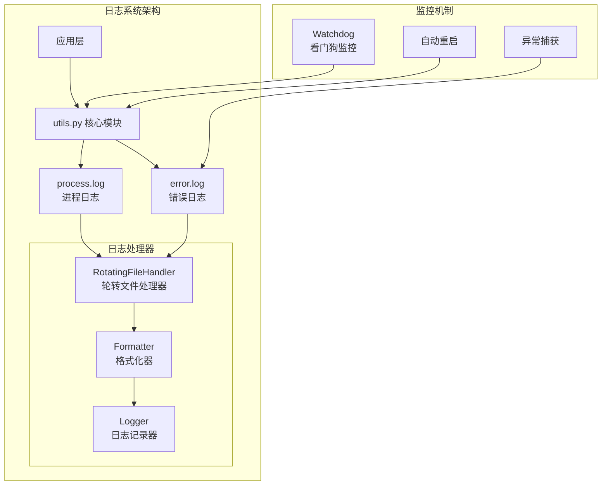
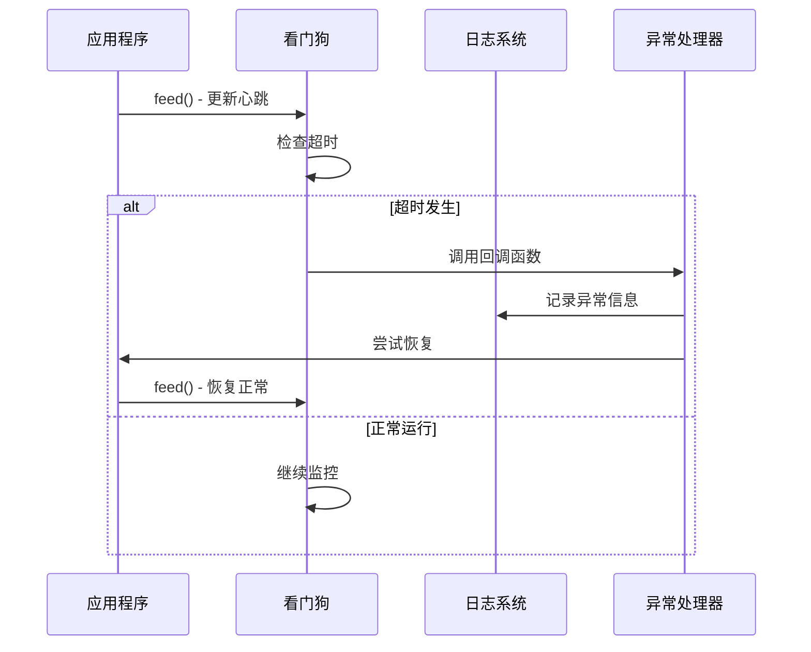

# 日志分析与诊断

<cite>
**本文档中引用的文件**
- [utils.py](file://src-python/utils.py)
- [watchdog.py](file://src-python/models/watchdog/watchdog.py)
- [mainloop.py](file://src-python/mainloop.py)
- [controller.py](file://src-python/controller.py)
- [config.py](file://src-python/config.py)
- [test_client.py](file://src-python/test_client.py)
- [utils.md](file://src-python/docs/utils.md)
- [watchdog.md](file://src-python/docs/details/watchdog.md)
- [mainloop.md](file://src-python/docs/mainloop.md)
</cite>

## 目录
1. [简介](#简介)
2. [日志系统架构](#日志系统架构)
3. [核心日志文件详解](#核心日志文件详解)
4. [日志格式与结构](#日志格式与结构)
5. [关键字段解析](#关键字段解析)
6. [问题诊断方法](#问题诊断方法)
7. [看门狗异常处理机制](#看门狗异常处理机制)
8. [实际案例分析](#实际案例分析)
9. [故障排除指南](#故障排除指南)
10. [最佳实践建议](#最佳实践建议)

## 简介

VRCT项目采用了一套完善的双层日志系统，通过`process.log`和`error.log`两个专用日志文件，为开发者和用户提供全面的问题诊断能力。本指南将深入解析这套日志系统的结构、功能和使用方法，帮助用户有效利用日志进行问题定位和系统维护。

## 日志系统架构

VRCT的日志系统基于Python标准库的`logging`模块构建，采用了分层设计和专业化分工：



**图表来源**
- [utils.py](file://src-python/utils.py#L192-L222)
- [watchdog.py](file://src-python/models/watchdog/watchdog.py#L6-L14)

**章节来源**
- [utils.py](file://src-python/utils.py#L192-L293)
- [watchdog.py](file://src-python/models/watchdog/watchdog.py#L1-L104)

## 核心日志文件详解

### process.log - 进程状态日志

`process.log`是系统的主要日志文件，专门记录应用程序的正常运行状态和关键操作流程。

#### 主要功能特性：
- **结构化消息格式**：所有消息都遵循统一的JSON结构
- **实时输出**：同时写入文件和标准输出
- **状态码标识**：使用专用状态码348标记进程日志
- **轮转管理**：单个文件最大10MB，最多保留1个备份

#### 典型应用场景：
- 应用启动和初始化过程
- 用户操作和界面交互
- 系统状态变更和配置更新
- API请求响应和结果记录

### error.log - 错误追踪日志

`error.log`专门用于捕获和记录系统异常、错误堆栈和调试信息。

#### 核心特性：
- **错误级别记录**：仅记录ERROR及以上级别的异常
- **完整堆栈跟踪**：包含详细的调用栈信息
- **异常上下文**：记录异常发生时的环境状态
- **故障恢复支持**：为系统恢复提供诊断依据

**章节来源**
- [utils.py](file://src-python/utils.py#L230-L241)
- [utils.py](file://src-python/utils.py#L283-L291)

## 日志格式与结构

### process.log 格式规范

process.log中的每条消息都遵循以下结构：

```json
{
    "status": 348,
    "log": "操作描述",
    "data": "附加数据"
}
```

或者：

```json
{
    "status": 200,
    "endpoint": "/api/endpoint",
    "result": "操作结果"
}
```

### error.log 格式规范

error.log采用标准的Python日志格式：

```
时间戳 - 日志器名称 - 日志级别 - 错误信息
```

示例：
```
2025-10-13 14:35:12,789 - error - ERROR - Traceback (most recent call last):
  File "model.py", line 123, in loadModel
    model.load()
  File "ctranslate2/model.py", line 456, in load
    raise RuntimeError("CUDA out of memory")
RuntimeError: CUDA out of memory
```

**章节来源**
- [utils.py](file://src-python/utils.py#L215-L216)
- [utils.py](file://src-python/utils.py#L233-L237)

## 关键字段解析

### 时间戳字段 (asctime)
- **格式**：`YYYY-MM-DD HH:MM:SS,sss`
- **用途**：精确定位事件发生时间
- **精度**：毫秒级时间戳

### 日志级别字段 (levelname)
- **INFO**：一般信息记录
- **ERROR**：错误和异常信息
- **DEBUG**：调试信息（开发模式）

### 状态码字段 (status)
- **348**：专用进程日志标识
- **200**：成功响应
- **400**：客户端错误
- **500**：服务器内部错误

### 数据字段 (data/result)
- **process.log**：操作相关的上下文数据
- **error.log**：异常堆栈和错误详情

**章节来源**
- [utils.py](file://src-python/utils.py#L215-L216)
- [mainloop.py](file://src-python/mainloop.py#L240-L247)

## 问题诊断方法

### 基于状态码的搜索

#### 搜索特定状态码（如348）
```bash
# Windows PowerShell
Select-String -Path "process.log" -Pattern '"status": 348'

# Linux/macOS
grep '"status": 348' process.log

# Python脚本
import re
with open('process.log', 'r', encoding='utf-8') as f:
    for line in f:
        if re.search(r'"status": 348', line):
            print(line.strip())
```

#### 分析状态码分布
```python
# 统计不同状态码的出现频率
import json
from collections import Counter

status_counts = Counter()
with open('process.log', 'r', encoding='utf-8') as f:
    for line in f:
        try:
            log_entry = json.loads(line.strip())
            status_counts[log_entry.get('status', 'unknown')] += 1
        except:
            pass

print(dict(status_counts))
```

### 基于错误关键词的定位

#### 常见错误模式识别
```python
# 搜索内存相关错误
import re
with open('error.log', 'r', encoding='utf-8') as f:
    for line in f:
        if re.search(r'(memory|RAM|out of memory|OOM)', line, re.IGNORECASE):
            print(line.strip())

# 搜索网络连接错误
with open('error.log', 'r', encoding='utf-8') as f:
    for line in f:
        if re.search(r'(network|connection|timeout|failed)', line, re.IGNORECASE):
            print(line.strip())
```

### 时间序列分析

#### 故障时间窗口分析
```python
import json
from datetime import datetime

def analyze_error_patterns(log_file, time_window_minutes=5):
    errors_by_time = {}
    last_error_time = None
    
    with open(log_file, 'r', encoding='utf-8') as f:
        for line in f:
            if 'ERROR' in line:
                # 提取时间戳
                timestamp_str = line.split(' - ')[0]
                try:
                    error_time = datetime.strptime(timestamp_str, '%Y-%m-%d %H:%M:%S,%f')
                    
                    # 检查是否在时间窗口内
                    if last_error_time and (error_time - last_error_time).total_seconds() <= time_window_minutes * 60:
                        # 在同一时间窗口内
                        pass
                    else:
                        # 新的时间窗口
                        last_error_time = error_time
                    
                    # 记录错误
                    errors_by_time[last_error_time] = errors_by_time.get(last_error_time, 0) + 1
                except:
                    continue
    
    return errors_by_time
```

**章节来源**
- [test_client.py](file://src-python/test_client.py#L215-L229)
- [utils.py](file://src-python/utils.py#L261-L267)

## 看门狗异常处理机制

### 看门狗工作原理

VRCT的看门狗系统提供了多层次的异常防护和自动恢复机制：



**图表来源**
- [watchdog.py](file://src-python/models/watchdog/watchdog.py#L37-L56)
- [utils.py](file://src-python/utils.py#L280-L291)

### 看门狗触发重启时的痕迹

当看门狗检测到系统无响应并触发重启时，会在日志中留下以下痕迹：

#### 1. 看门狗超时检测
```
# error.log 中的超时记录
2025-10-13 14:40:00,123 - watchdog - ERROR - Watchdog timeout detected
```

#### 2. 自动重启尝试
```
# process.log 中的重启记录
{
    "status": 348,
    "log": "Automatic restart triggered by watchdog",
    "data": "System unresponsive for 60 seconds"
}
```

#### 3. 恢复状态确认
```
# process.log 中的成功恢复
{
    "status": 348,
    "log": "System recovery successful",
    "data": "Restart completed, system operational"
}
```

### 看门狗配置参数

| 参数 | 默认值 | 说明 |
|------|--------|------|
| timeout | 60秒 | 超时阈值，超过此时间未收到心跳则触发 |
| interval | 20秒 | 检查间隔，定期检查心跳状态 |
| callback | None | 超时时执行的回调函数 |

**章节来源**
- [watchdog.py](file://src-python/models/watchdog/watchdog.py#L20-L22)
- [watchdog.md](file://src-python/docs/details/watchdog.md#L485-L520)

## 实际案例分析

### 案例1：模型加载失败诊断

#### 现象描述
用户报告VRCT无法加载翻译模型，界面显示"模型加载失败"错误。

#### 日志分析步骤

1. **检查process.log中的加载记录**
```
{
    "status": 348,
    "log": "Starting model loading",
    "data": "Model: ctranslate2, Type: medium"
}

{
    "status": 348,
    "log": "Model loading progress",
    "data": "Downloading weights: 75%"
}

{
    "status": 348,
    "log": "Model loading failed",
    "data": "CUDA out of memory"
}
```

2. **查看error.log中的详细堆栈**
```
2025-10-13 15:20:30,456 - error - ERROR - Traceback (most recent call last):
  File "models/translation/translation_translator.py", line 156, in load_model
    model = ctranslate2.TransformerSpec.from_pretrained(model_path)
  File "ctranslate2/model.py", line 456, in from_pretrained
    raise RuntimeError("CUDA out of memory")
RuntimeError: CUDA out of memory
```

3. **关联看门狗行为**
```
{
    "status": 348,
    "log": "Watchdog timeout detected",
    "data": "Model loading exceeded 60-second timeout"
}
```

#### 解决方案
- 检查GPU内存使用情况
- 调整模型大小设置
- 增加系统可用内存

### 案例2：网络连接中断分析

#### 现象描述
翻译服务偶尔出现"网络连接失败"提示。

#### 日志模式识别
```
# process.log 中的网络活动
{
    "status": 348,
    "log": "Attempting API connection",
    "data": "Endpoint: https://api.translator.com/v1"
}

{
    "status": 348,
    "log": "Network timeout occurred",
    "data": "Connection timed out after 30 seconds"
}

# error.log 中的异常记录
2025-10-13 16:15:22,789 - error - ERROR - Network connection failed
Traceback (most recent call last):
  File "utils.py", line 179, in send_request
    response = requests.post(url, json=data, timeout=30)
requests.exceptions.Timeout: HTTPSConnectionPool(host='api.translator.com', port=443): 
Max retries exceeded with url: /v1/translate (Caused by ConnectTimeoutError())
```

#### 诊断要点
- 检查网络稳定性
- 验证API服务可用性
- 调整超时参数

**章节来源**
- [controller.py](file://src-python/controller.py#L194-L227)
- [utils.py](file://src-python/utils.py#L8-L18)

## 故障排除指南

### 常见问题及解决方案

#### 1. 日志文件过大
**症状**：process.log或error.log文件超过10MB
**解决**：系统会自动轮转，但可手动清理旧文件

```python
# 清理旧日志文件
import os
import shutil

# 删除backup文件
for filename in ['process.log.1', 'error.log.1']:
    if os.path.exists(filename):
        os.remove(filename)
```

#### 2. 日志丢失或损坏
**症状**：日志文件为空或格式异常
**排查**：
- 检查磁盘空间
- 验证文件权限
- 查看系统资源使用情况

#### 3. 异常处理失效
**症状**：错误没有正确记录到error.log
**检查点**：
- 确认`errorLogging()`函数被正确调用
- 检查日志文件写入权限
- 验证Python异常捕获逻辑

### 性能优化建议

#### 日志级别调整
```python
# 开发环境启用DEBUG级别
import logging
logging.getLogger().setLevel(logging.DEBUG)

# 生产环境保持INFO级别
logging.getLogger().setLevel(logging.INFO)
```

#### 异步日志写入
```python
# 使用异步处理器提高性能
from logging.handlers import QueueHandler, QueueListener
import queue

log_queue = queue.Queue(-1)
queue_handler = QueueHandler(log_queue)
queue_listener = QueueListener(log_queue, file_handler)

# 添加到根logger
logging.getLogger().addHandler(queue_handler)
queue_listener.start()
```

**章节来源**
- [utils.py](file://src-python/utils.py#L201-L211)
- [utils.py](file://src-python/utils.py#L280-L291)

## 最佳实践建议

### 日志记录规范

#### 1. 结构化日志格式
```python
# 推荐：使用统一的结构
printLog("用户登录成功", {
    "user_id": user.id,
    "timestamp": datetime.now(),
    "ip_address": client_ip
})

# 避免：非结构化日志
printLog(f"用户 {username} 登录成功，IP地址：{client_ip}")
```

#### 2. 错误信息完整性
```python
# 推荐：包含上下文信息
try:
    risky_operation()
except Exception as e:
    error_context = {
        "operation": "database_query",
        "params": query_params,
        "user_id": current_user.id
    }
    printLog("数据库查询失败", error_context)
    errorLogging()
```

#### 3. 敏感信息保护
```python
# 推荐：敏感信息脱敏
sensitive_data = {"password": "secret", "api_key": "12345"}
safe_data = {k: v if k not in ["password", "api_key"] else "***REDACTED***" 
             for k, v in sensitive_data.items()}
printLog("配置更新", safe_data)
```

### 监控和告警策略

#### 1. 关键指标监控
- **错误率**：error.log中ERROR级别消息的比例
- **响应时间**：process.log中操作完成的时间间隔
- **资源使用**：系统资源消耗趋势

#### 2. 自动化告警
```python
def monitor_logs(error_threshold=5, time_window=300):
    """监控日志中的异常模式"""
    recent_errors = count_recent_errors(error_threshold, time_window)
    
    if recent_errors > error_threshold:
        send_alert(f"高错误率检测：{recent_errors}个错误在过去{time_window}秒内发生")
    
    return recent_errors
```

#### 3. 日志轮转策略
```python
# 自定义轮转策略
import logging
from logging.handlers import TimedRotatingFileHandler

class CustomRotatingHandler(TimedRotatingFileHandler):
    def doRollover(self):
        super().doRollover()
        # 清理过期日志
        cleanup_old_logs(days_to_keep=7)
```

### 调试技巧

#### 1. 条件日志记录
```python
# 只在调试模式下记录详细信息
if DEBUG_MODE:
    printLog("详细调试信息", debug_data)
```

#### 2. 性能分析
```python
import time

def timed_operation(operation_name):
    start_time = time.time()
    try:
        result = operation()
        elapsed = time.time() - start_time
        printLog(f"{operation_name} completed", {
            "duration_ms": elapsed * 1000,
            "success": True
        })
        return result
    except Exception as e:
        elapsed = time.time() - start_time
        printLog(f"{operation_name} failed", {
            "duration_ms": elapsed * 1000,
            "error": str(e)
        })
        raise
```

通过掌握这些日志分析和诊断技巧，用户可以更有效地监控VRCT系统的运行状态，快速定位和解决问题，确保系统的稳定性和可靠性。