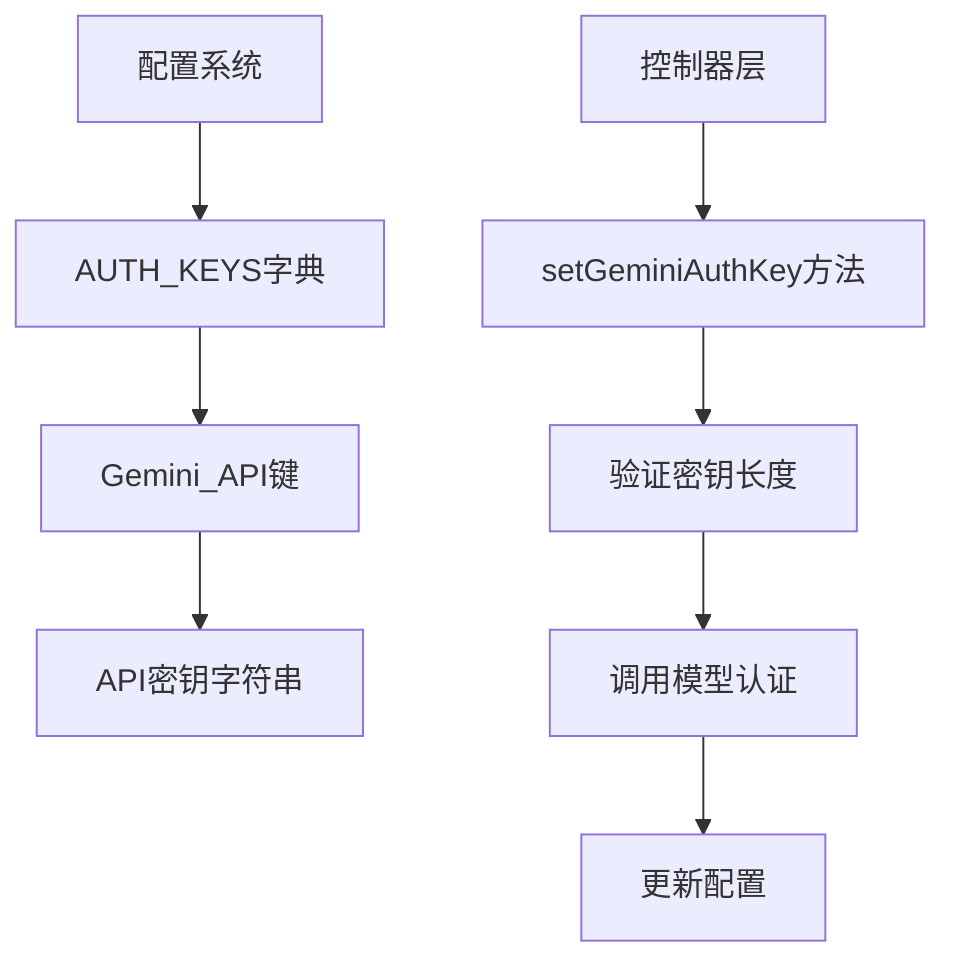
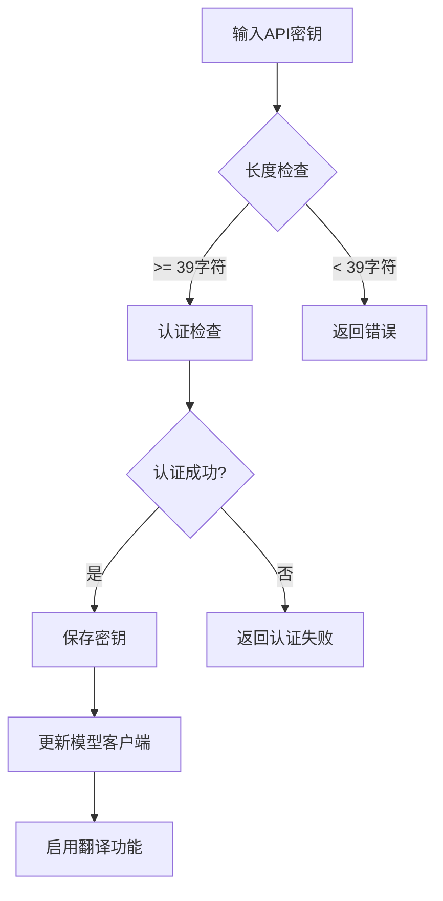
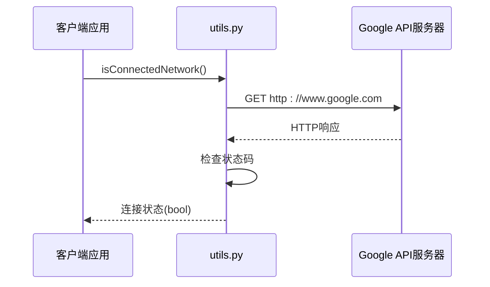
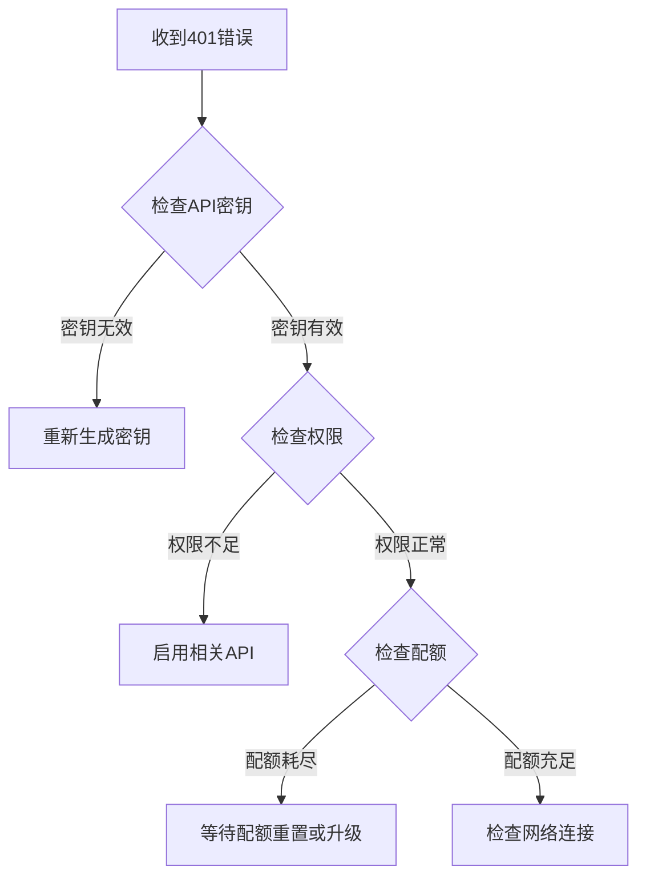
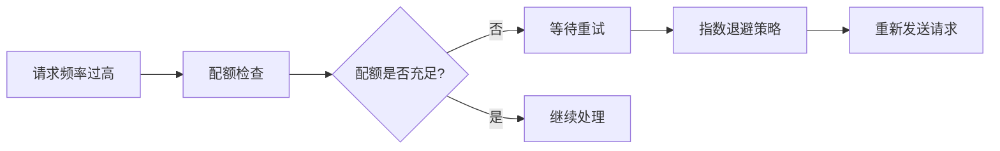
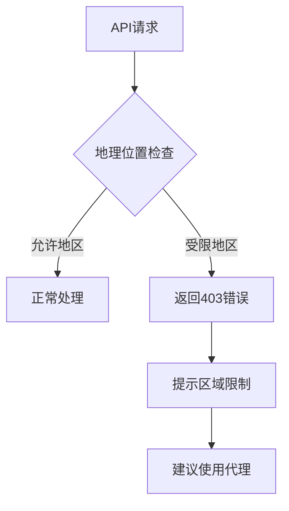
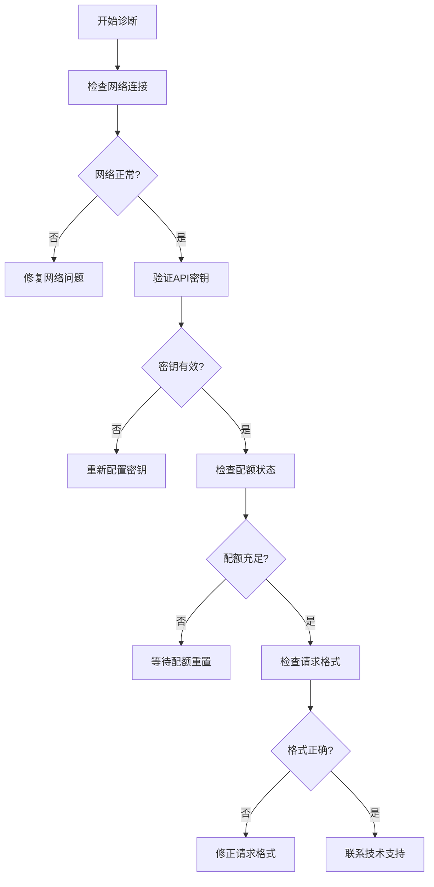
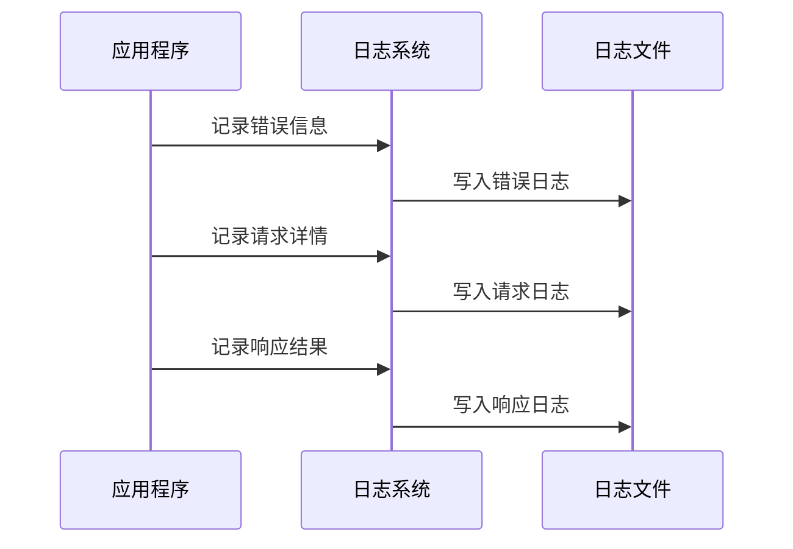
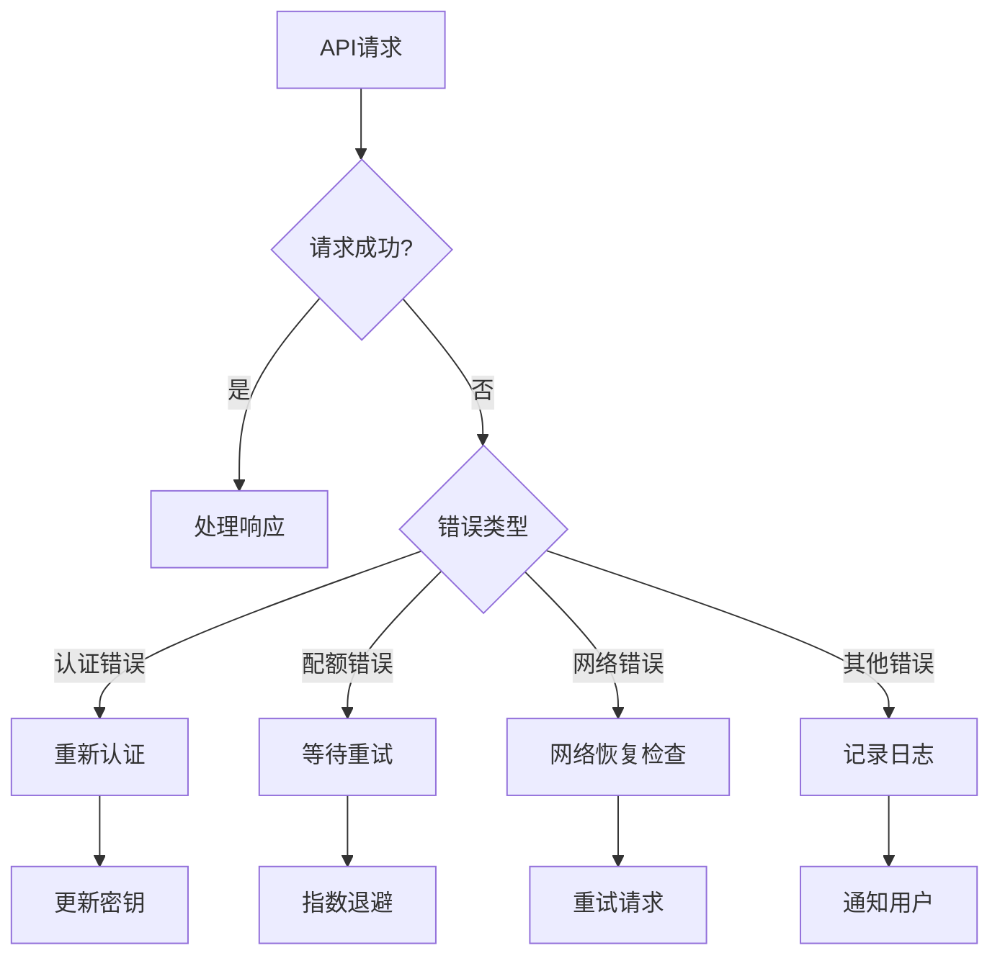
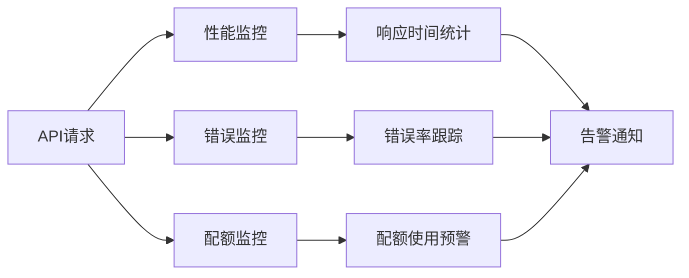

# Google Gemini API 问题解决指南

<cite>
**本文档中引用的文件**
- [translation_gemini.py](file://src-python/models/translation/translation_gemini.py)
- [utils.py](file://src-python/utils.py)
- [config.py](file://src-python/config.py)
- [controller.py](file://src-python/controller.py)
- [model.py](file://src-python/model.py)
- [translation_gemini.yml](file://src-python/models/translation/prompt/translation_gemini.yml)
- [test_client.py](file://src-python/test_client.py)
- [test_endpoints.py](file://src-python/test_endpoints.py)
</cite>

## 目录
1. [简介](#简介)
2. [API密钥配置](#api密钥配置)
3. [网络连接问题](#网络连接问题)
4. [常见HTTP错误](#常见http错误)
5. [区域访问限制](#区域访问限制)
6. [故障排除指南](#故障排除指南)
7. [curl测试示例](#curl测试示例)
8. [最佳实践](#最佳实践)

## 简介

Google Gemini API是VRCT项目中重要的翻译服务提供商之一。本指南详细说明了在使用Gemini API过程中可能遇到的常见问题及其解决方案，包括API密钥配置、网络连接、错误处理等方面。

## API密钥配置

### 配置文件中的位置

Gemini API密钥存储在全局配置对象中，通过`AUTH_KEYS`字典进行管理：



**图表来源**
- [controller.py](file://src-python/controller.py#L1713-L1760)
- [config.py](file://src-python/config.py#L672-L677)

### 环境变量设置

虽然当前实现主要依赖配置文件，但可以通过以下方式设置环境变量：

```bash
# 设置Gemini API密钥环境变量
export GOOGLE_API_KEY="your_api_key_here"
```

### 密钥验证流程

系统对API密钥进行严格验证，确保其有效性和完整性：



**图表来源**
- [translation_gemini.py](file://src-python/models/translation/translation_gemini.py#L19-L27)
- [controller.py](file://src-python/controller.py#L1718-L1740)

**章节来源**
- [translation_gemini.py](file://src-python/models/translation/translation_gemini.py#L19-L27)
- [controller.py](file://src-python/controller.py#L1713-L1760)

## 网络连接问题

### 网络连通性检测

系统提供了专门的网络连通性检测函数，用于验证与Google API服务器的连接：



**图表来源**
- [utils.py](file://src-python/utils.py#L59-L68)

### 代理服务器配置

对于需要通过代理服务器访问的情况，建议：

1. **系统级代理设置**：在操作系统级别配置代理
2. **环境变量**：设置HTTP_PROXY和HTTPS_PROXY环境变量
3. **代码级代理**：在请求库中配置代理参数

### HTTPS证书验证

如果遇到SSL证书错误，可以尝试以下解决方案：

1. 更新系统证书库
2. 在代码中禁用证书验证（仅用于调试）
3. 添加自定义CA证书

**章节来源**
- [utils.py](file://src-python/utils.py#L59-L68)

## 常见HTTP错误

### 认证失败 (401)

这是最常见的Gemini API错误，通常由以下原因引起：

| 错误原因 | 解决方案 | 验证方法 |
|---------|---------|---------|
| 无效的API密钥 | 检查密钥格式和有效性 | 尝试在Google Cloud Console验证 |
| 密钥权限不足 | 确保启用了正确的API | 检查Google Cloud项目中的API启用状态 |
| 密钥已过期 | 重新生成新的API密钥 | 在Google Cloud Console查看密钥状态 |
| 请求头格式错误 | 确保Authorization头正确设置 | 检查请求头格式 |



### 配额耗尽 (429)

当API请求超过配额限制时会返回此错误：



### 请求超时

网络延迟或服务器负载过高可能导致请求超时：

| 超时类型 | 默认超时时间 | 可配置参数 | 解决策略 |
|---------|-------------|-----------|---------|
| 连接超时 | 3秒 | timeout参数 | 增加超时时间或重试机制 |
| 读取超时 | 30秒 | read_timeout | 优化请求内容大小 |
| 整体超时 | 60秒 | total_timeout | 分批处理大量数据 |

**章节来源**
- [controller.py](file://src-python/controller.py#L1736-L1742)
- [translation_gemini.py](file://src-python/models/translation/translation_gemini.py#L19-L27)

## 区域访问限制

### 地理位置限制

某些地区可能受到地理访问限制：



### 解决方案

1. **使用VPN**：连接到允许的地区
2. **代理服务器**：配置HTTP代理
3. **CDN服务**：使用支持多地区的CDN
4. **备用API**：准备其他翻译服务作为备选

## 故障排除指南

### 诊断步骤

按照以下顺序进行故障排除：



### 日志分析

系统提供了详细的日志记录功能：



**图表来源**
- [utils.py](file://src-python/utils.py#L227-L240)

### 常见问题快速解决

| 问题症状 | 可能原因 | 快速解决方案 |
|---------|---------|-------------|
| 无法连接API | 网络防火墙阻止 | 检查防火墙设置，添加例外规则 |
| 偶发超时 | 网络不稳定 | 实现重试机制，增加超时时间 |
| 频繁配额错误 | 请求过于频繁 | 实现请求队列，控制请求频率 |
| 认证失败 | 密钥配置错误 | 重新生成并配置API密钥 |

**章节来源**
- [utils.py](file://src-python/utils.py#L227-L240)
- [test_client.py](file://src-python/test_client.py#L212-L219)

## curl测试示例

### 基本API测试

使用curl命令测试Gemini API的可用性：

```bash
# 测试基本连接
curl -I https://generativelanguage.googleapis.com/

# 测试API密钥认证
curl -H "Authorization: Bearer YOUR_API_KEY" \
     "https://generativelanguage.googleapis.com/v1beta/models"

# 测试文本生成
curl -X POST \
     -H "Content-Type: application/json" \
     -H "Authorization: Bearer YOUR_API_KEY" \
     -d '{
       "contents": [{
         "parts":[{
           "text": "Hello, world!"
         }]
       }],
       "generationConfig": {
         "temperature": 0.9,
         "topK": 40,
         "topP": 0.95,
         "maxOutputTokens": 100
       }
     }' \
     "https://generativelanguage.googleapis.com/v1beta/models/gemini-pro:generateContent"
```

### 响应码解读

| HTTP状态码 | 含义 | 处理建议 |
|-----------|------|---------|
| 200 | 请求成功 | 正常处理响应数据 |
| 400 | 请求参数错误 | 检查请求格式和参数 |
| 401 | 认证失败 | 验证API密钥有效性 |
| 403 | 权限不足 | 检查API权限设置 |
| 429 | 请求过于频繁 | 实现重试机制 |
| 500 | 服务器内部错误 | 稍后重试或联系支持 |

### 错误信息分析

典型的错误响应格式：
```json
{
  "error": {
    "code": 401,
    "message": "Request had invalid authentication credentials.",
    "status": "UNAUTHENTICATED"
  }
}
```

**章节来源**
- [test_client.py](file://src-python/test_client.py#L212-L219)

## 最佳实践

### 错误处理策略



### 性能优化

1. **请求缓存**：缓存常用翻译结果
2. **批量处理**：合并多个小请求
3. **异步处理**：使用异步请求避免阻塞
4. **连接池**：复用HTTP连接

### 安全考虑

1. **密钥保护**：不在代码中硬编码API密钥
2. **传输加密**：确保所有通信都使用HTTPS
3. **访问控制**：限制API密钥的使用范围
4. **监控审计**：定期检查API使用情况

### 监控和告警

建立完善的监控体系：



通过遵循这些最佳实践，可以显著提高Google Gemini API的稳定性和可靠性，减少生产环境中出现问题的风险。