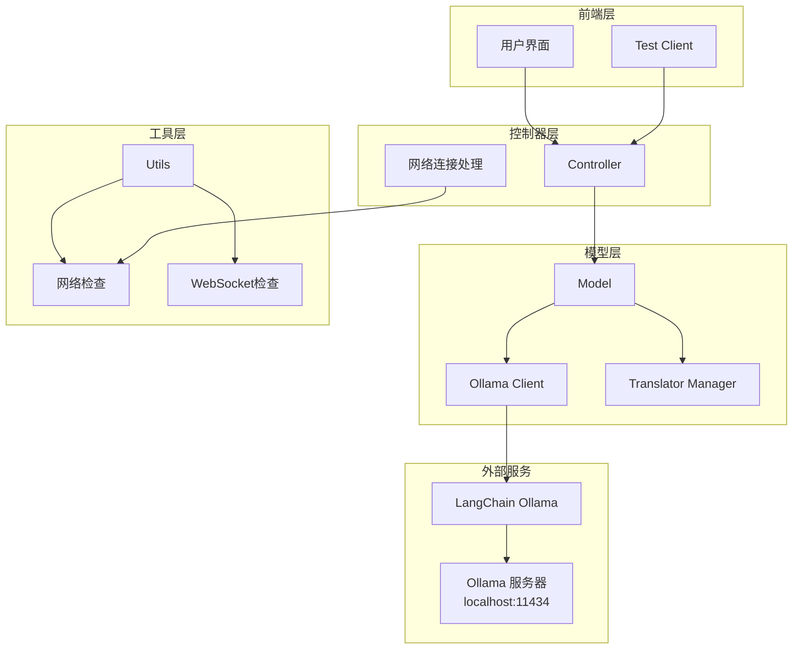
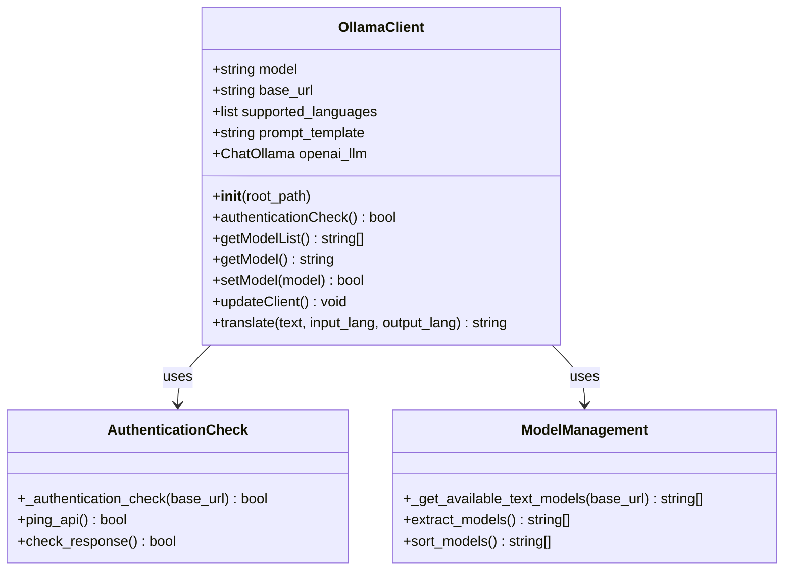
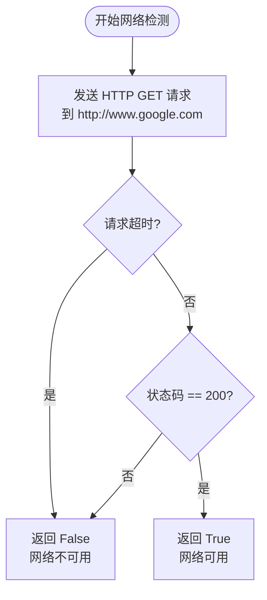
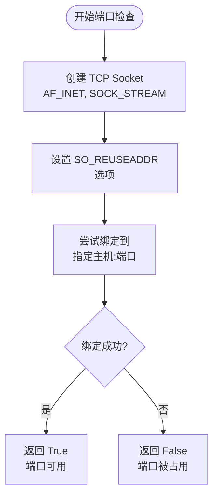
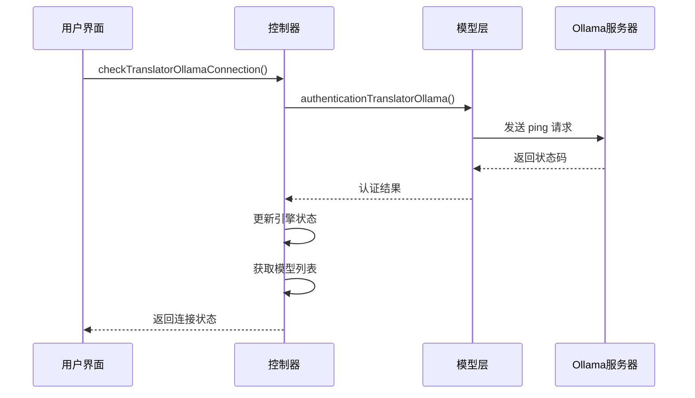
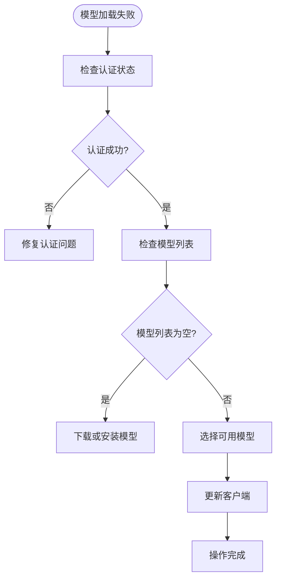
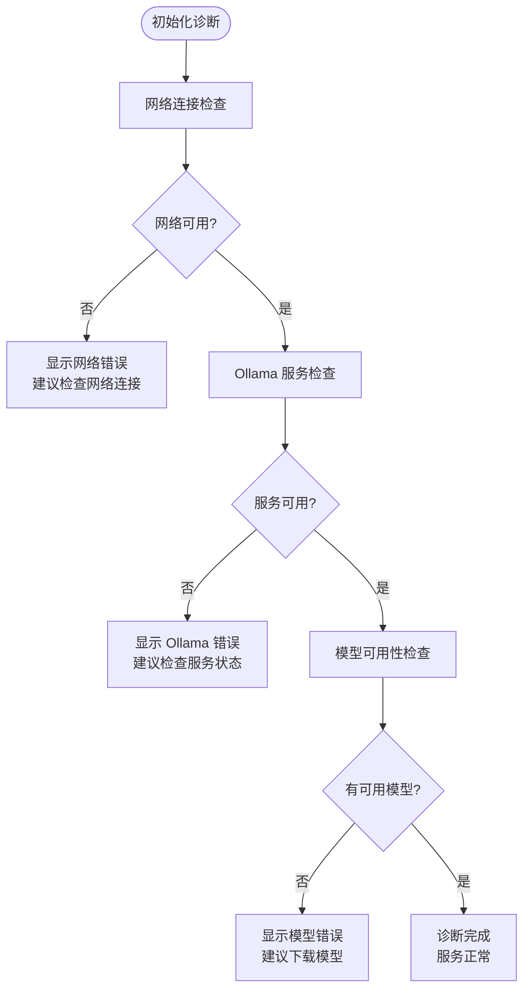
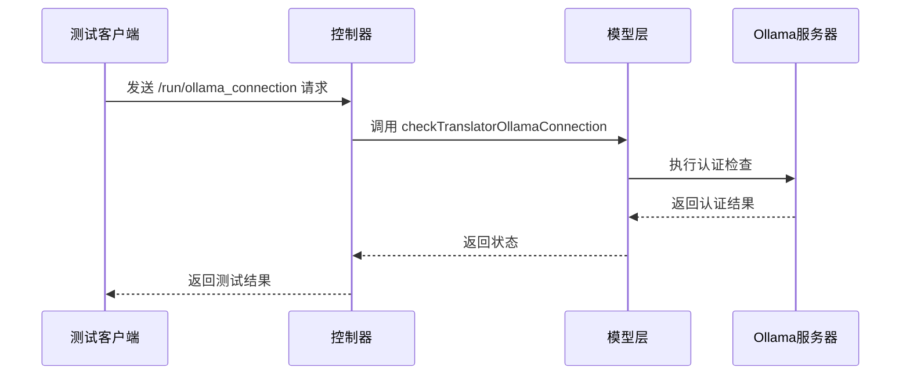

# Ollama API 问题诊断与解决方案

<cite>
**本文档引用的文件**
- [translation_ollama.py](file://src-python/models/translation/translation_ollama.py)
- [translation_ollama.md](file://src-python/docs/details/translation_ollama.md)
- [test_client.py](file://src-python/test_client.py)
- [utils.py](file://src-python/utils.py)
- [controller.py](file://src-python/controller.py)
- [model.py](file://src-python/model.py)
- [translation_translator.py](file://src-python/models/translation/translation_translator.py)
- [translation_ollama.yml](file://src-python/models/translation/prompt/translation_ollama.yml)
- [test_endpoints.py](file://src-python/test_endpoints.py)
- [useHandleNetworkConnection.js](file://src-ui/logics/common/useHandleNetworkConnection.js)
- [_useBackendErrorHandling.js](file://src-ui/logics/_useBackendErrorHandling.js)
</cite>

## 目录
1. [概述](#概述)
2. [系统架构](#系统架构)
3. [核心组件分析](#核心组件分析)
4. [连接诊断机制](#连接诊断机制)
5. [常见问题诊断](#常见问题诊断)
6. [故障排除指南](#故障排除指南)
7. [测试方法](#测试方法)
8. [性能优化建议](#性能优化建议)
9. [总结](#总结)

## 概述

Ollama API 是一个基于本地大语言模型的翻译服务，通过 REST API 与 Ollama 服务器通信。该系统提供了完整的连接检测、模型管理和服务可用性监控功能，支持多种诊断方法来确保服务的稳定运行。

本文档系统性地分析了 Ollama 本地 API 服务的连接与通信问题，重点说明了服务状态检测、网络配置验证以及故障诊断方法。

## 系统架构



**图表来源**
- [controller.py](file://src-python/controller.py#L2013-L2046)
- [model.py](file://src-python/model.py#L267-L281)
- [translation_ollama.py](file://src-python/models/translation/translation_ollama.py#L42-L102)

## 核心组件分析

### OllamaClient 类

OllamaClient 是系统的核心组件，负责与 Ollama 服务器的交互。



**图表来源**
- [translation_ollama.py](file://src-python/models/translation/translation_ollama.py#L42-L102)

### 连接检查机制

系统提供了多层次的连接检查机制：

1. **基础连接检查**：通过 `/api/ping` 端点验证服务器可达性
2. **模型列表获取**：通过 `/api/tags` 获取可用模型列表
3. **认证验证**：确认服务器响应状态码为 200

**章节来源**
- [translation_ollama.py](file://src-python/models/translation/translation_ollama.py#L14-L33)
- [translation_ollama.md](file://src-python/docs/details/translation_ollama.md#L44-L46)

## 连接诊断机制

### 网络连接检测

系统提供了 `isConnectedNetwork()` 函数来检测网络连通性：



**图表来源**
- [utils.py](file://src-python/utils.py#L59-L68)

### WebSocket 服务器检查

系统使用 `isAvailableWebSocketServer()` 函数检查端口可用性：



**图表来源**
- [utils.py](file://src-python/utils.py#L70-L82)

### Ollama 连接状态检查

控制器提供了专门的连接检查方法：



**图表来源**
- [controller.py](file://src-python/controller.py#L2013-L2046)

**章节来源**
- [controller.py](file://src-python/controller.py#L2013-L2046)
- [utils.py](file://src-python/utils.py#L59-L82)

## 常见问题诊断

### 1. 服务未启动问题

**症状表现：**
- 连接超时错误
- 无法获取模型列表
- 认证检查失败

**诊断步骤：**
1. 检查 Ollama 服务是否正在运行
2. 验证默认端口 11434 是否可用
3. 确认防火墙设置

**解决方案：**
```bash
# 检查 Ollama 服务状态
ollama serve --version

# 启动 Ollama 服务
ollama serve

# 检查端口占用情况
netstat -an | find "11434"
```

### 2. 主机地址配置问题

**症状表现：**
- 连接拒绝错误
- 无法建立 HTTP 连接

**诊断方法：**
- 验证 `base_url` 配置
- 检查 localhost 绑定
- 确认网络接口配置

### 3. 防火墙阻断问题

**症状表现：**
- 偶发连接失败
- 特定网络环境下无法访问

**诊断工具：**
```bash
# 测试本地连接
curl -I http://localhost:11434

# 测试远程连接
curl -I http://<server-ip>:11434
```

### 4. 模型加载失败

**症状表现：**
- 模型列表为空
- 设置模型时返回失败

**诊断流程：**



**图表来源**
- [translation_ollama.py](file://src-python/models/translation/translation_ollama.py#L60-L72)

**章节来源**
- [translation_ollama.py](file://src-python/models/translation/translation_ollama.py#L14-L33)
- [translation_ollama.md](file://src-python/docs/details/translation_ollama.md#L72-L76)

## 故障排除指南

### 自动诊断流程

系统提供了自动化的诊断流程来识别和报告常见问题：



### 手动诊断步骤

1. **基础连接测试**
   ```bash
   # 测试基本连接
   curl -I http://localhost:11434
   
   # 测试模型列表获取
   curl http://localhost:11434/api/tags
   ```

2. **认证测试**
   ```bash
   # 检查认证状态
   curl http://localhost:11434
   ```

3. **模型测试**
   ```bash
   # 获取可用模型
   curl http://localhost:11434/api/tags | jq '.models[].name'
   ```

### 日志分析

系统提供了详细的日志记录功能，可以通过以下方式查看诊断信息：

- 检查 `process.log` 文件
- 监控控制台输出
- 分析错误堆栈信息

**章节来源**
- [test_client.py](file://src-python/test_client.py#L129-L281)
- [controller.py](file://src-python/controller.py#L2013-L2046)

## 测试方法

### 命令行测试

使用 curl 工具直接测试 Ollama REST API：

```bash
# 基础连接测试
curl -I http://localhost:11434

# 成功响应示例：
HTTP/1.1 200 OK
Content-Type: text/plain; charset=utf-8
Date: Mon, 01 Jan 2025 00:00:00 GMT
Content-Length: 2

ok

# 失败响应示例：
curl: (7) Failed to connect to localhost port 11434: Connection refused
```

### 模型列表测试

```bash
# 获取可用模型列表
curl http://localhost:11434/api/tags

# 成功响应示例：
{
  "models": [
    {
      "name": "llama2",
      "size": 4000000000,
      "digest": "sha256:abc123..."
    },
    {
      "name": "mistral",
      "size": 3000000000,
      "digest": "sha256:def456..."
    }
  ]
}

# 失败响应示例：
{
  "error": "no such file or directory"
}
```

### 翻译测试

```bash
# 简单翻译测试
curl -X POST http://localhost:11434/api/chat \
  -H "Content-Type: application/json" \
  -d '{
    "model": "llama2",
    "messages": [
      {
        "role": "system",
        "content": "You are a helpful translation assistant.\nSupported languages: Japanese, English\n\nTranslate the user provided text from Japanese to English.\nReturn ONLY the translated text. Do not add quotes or extra commentary."
      },
      {
        "role": "user",
        "content": "こんにちは世界"
      }
    ],
    "stream": false
  }'

# 成功响应示例：
{
  "model": "llama2",
  "choices": [
    {
      "index": 0,
      "message": {
        "role": "assistant",
        "content": "Hello world"
      }
    }
  ]
}
```

### 自动化测试

系统提供了自动化测试客户端来验证 Ollama 连接：



**图表来源**
- [test_client.py](file://src-python/test_client.py#L451-L452)
- [test_endpoints.py](file://src-python/test_endpoints.py#L566-L569)

**章节来源**
- [test_client.py](file://src-python/test_client.py#L129-L281)
- [test_endpoints.py](file://src-python/test_endpoints.py#L566-L569)

## 性能优化建议

### 连接优化

1. **连接池管理**
   - 实现连接复用机制
   - 设置合理的超时时间
   - 添加重试机制

2. **缓存策略**
   - 缓存模型列表
   - 缓存认证状态
   - 实现智能刷新机制

### 资源管理

1. **内存优化**
   - 及时释放不用的模型实例
   - 监控内存使用情况
   - 实现垃圾回收机制

2. **并发控制**
   - 限制同时请求数量
   - 实现队列机制
   - 提供优先级调度

### 监控指标

建议监控以下关键指标：
- 连接成功率
- 平均响应时间
- 错误率统计
- 资源使用情况

## 总结

Ollama API 问题的诊断和解决需要从多个层面进行系统性的分析。通过本文档提供的诊断方法、测试工具和故障排除指南，可以有效地识别和解决常见的连接与通信问题。

关键要点：
1. **多层诊断机制**：从网络连接到服务可用性的完整检查链
2. **自动化测试**：提供可靠的自动化测试工具
3. **详细的日志记录**：便于问题追踪和分析
4. **灵活的配置选项**：支持不同环境下的部署需求

通过持续的监控和维护，可以确保 Ollama API 服务的稳定性和可靠性，为用户提供高质量的翻译体验。