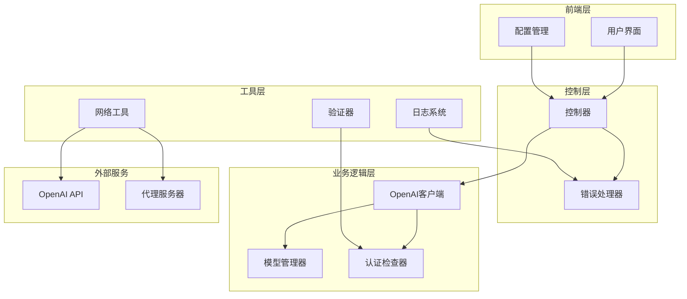
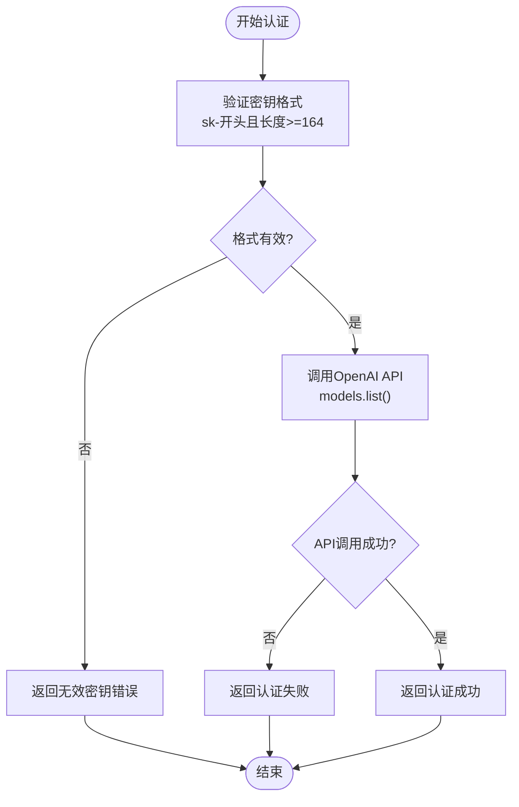
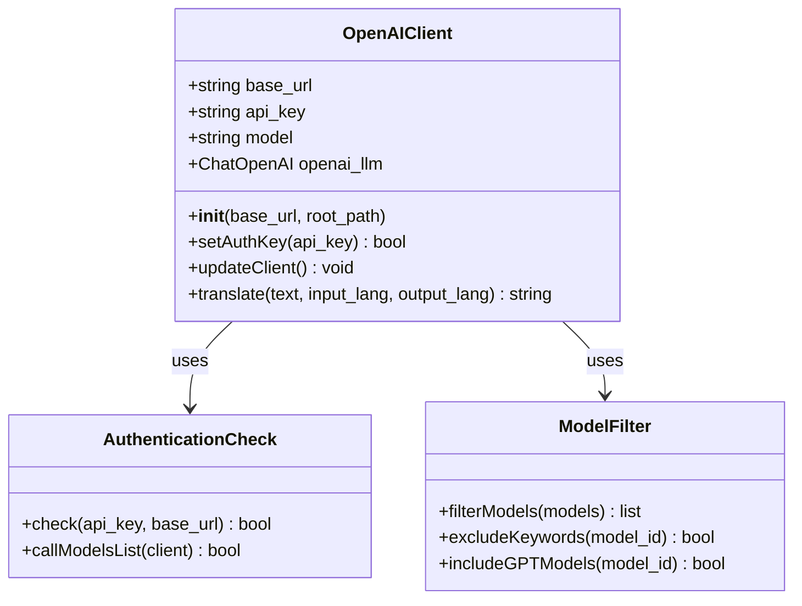
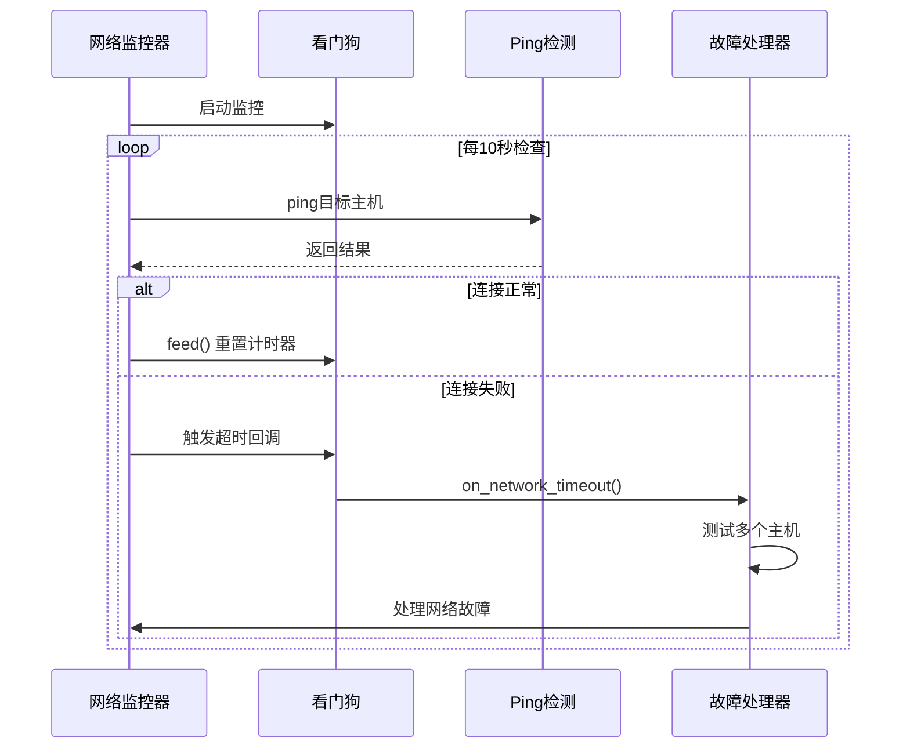
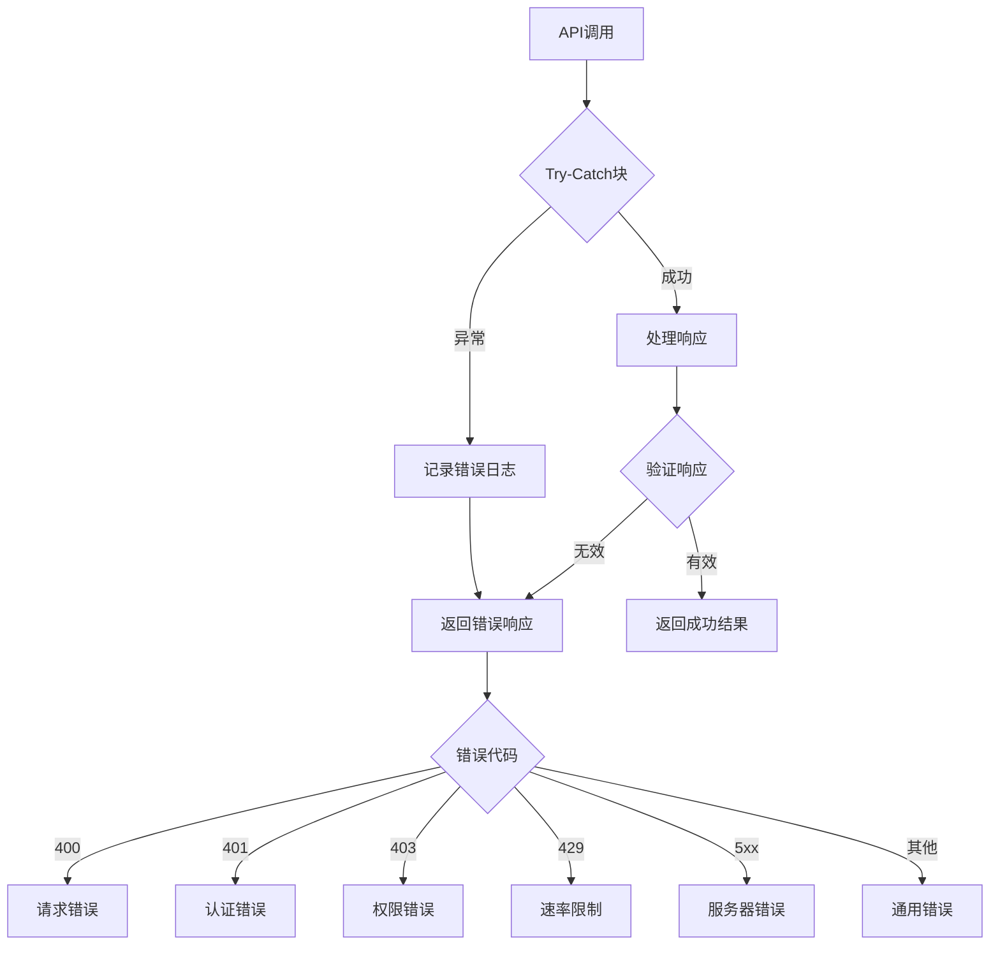
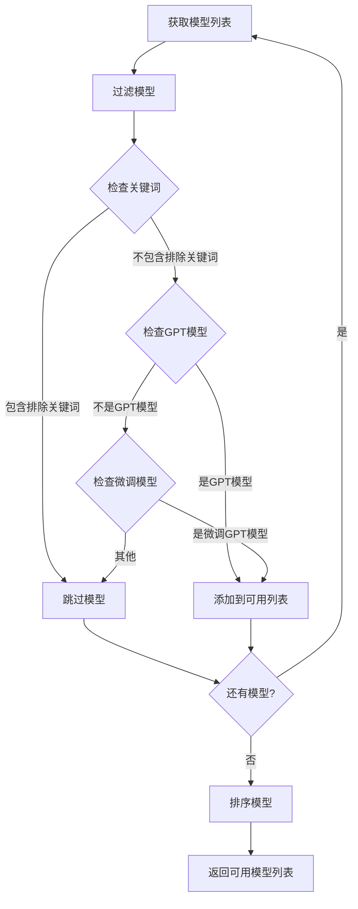
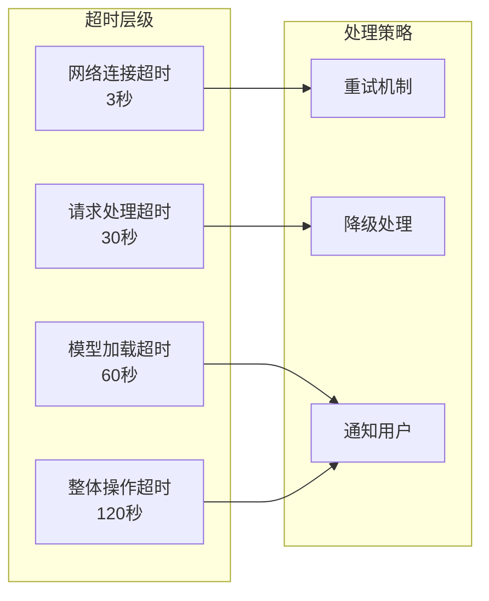
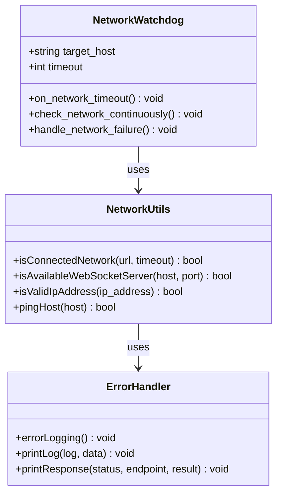
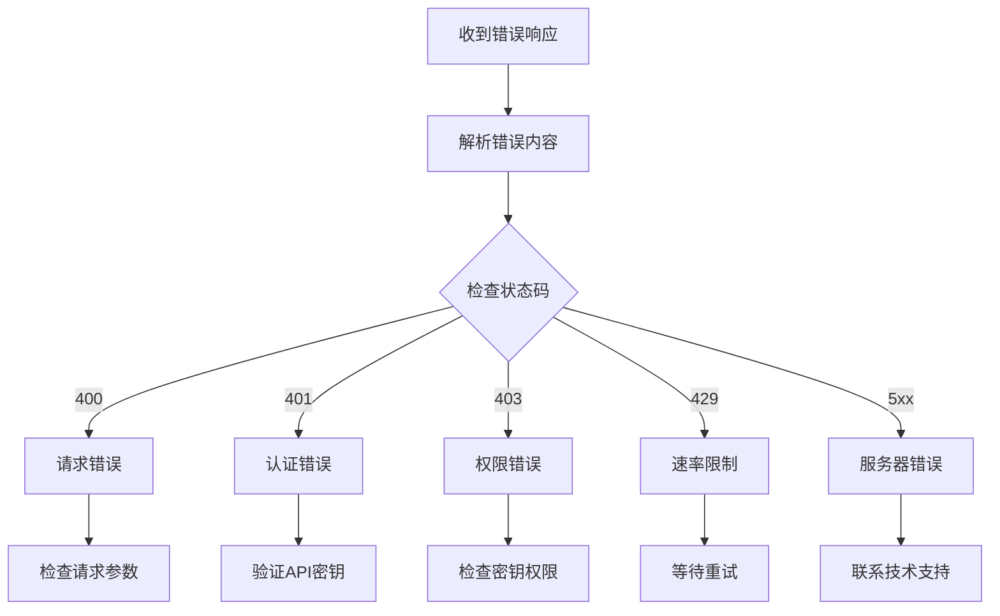

# OpenAI API 问题诊断与解决方案指南

<cite>
**本文档中引用的文件**
- [translation_openai.py](file://src-python/models/translation/translation_openai.py)
- [utils.py](file://src-python/utils.py)
- [test_endpoints.py](file://src-python/test_endpoints.py)
- [controller.py](file://src-python/controller.py)
- [config.py](file://src-python/config.py)
- [watchdog.md](file://src-python/docs/details/watchdog.md)
- [utils.md](file://src-python/docs/utils.md)
- [useHandleNetworkConnection.js](file://src-ui/logics/common/useHandleNetworkConnection.js)
- [translation_openai.yml](file://src-python/models/translation/prompt/translation_openai.yml)
</cite>

## 目录
1. [简介](#简介)
2. [项目架构概览](#项目架构概览)
3. [API密钥配置问题](#api密钥配置问题)
4. [端点URL设置与代理配置](#端点url设置与代理配置)
5. [网络连接与防火墙问题](#网络连接与防火墙问题)
6. [认证失败处理机制](#认证失败处理机制)
7. [模型可用性检测](#模型可用性检测)
8. [请求超时与异常处理](#请求超时与异常处理)
9. [网络检测工具使用指南](#网络检测工具使用指南)
10. [Postman与curl测试配置](#postman与curl测试配置)
11. [JSON错误对象故障定位](#json错误对象故障定位)
12. [故障排除最佳实践](#故障排除最佳实践)

## 简介

本文档基于VRCT项目的translation_openai.py实现机制，全面解析OpenAI API连接与调用过程中可能遇到的各种问题。该系统提供了完整的API密钥管理、端点配置、网络检测和错误处理功能，帮助开发者快速诊断和解决OpenAI API集成中的常见问题。

## 项目架构概览

VRCT项目采用模块化架构设计，OpenAI API相关功能主要分布在以下组件中：



**图表来源**
- [controller.py](file://src-python/controller.py#L1810-L1857)
- [translation_openai.py](file://src-python/models/translation/translation_openai.py#L62-L105)

**章节来源**
- [controller.py](file://src-python/controller.py#L1-L50)
- [translation_openai.py](file://src-python/models/translation/translation_openai.py#L1-L30)

## API密钥配置问题

### 认证检查机制

系统实现了多层次的API密钥验证机制：



**图表来源**
- [translation_openai.py](file://src-python/models/translation/translation_openai.py#L15-L23)
- [controller.py](file://src-python/controller.py#L1814-L1857)

### 常见密钥问题类型

| 问题类型 | 错误表现 | 解决方案 |
|---------|---------|---------|
| 格式错误 | 密钥不以"sk-"开头或长度不足 | 检查密钥格式，确保符合OpenAI要求 |
| 权限不足 | API调用返回401 Unauthorized | 验证密钥权限，确保具有模型访问权限 |
| 已过期 | 认证检查返回False | 更新API密钥，重新配置 |
| 格式正确但无效 | sk-开头但无法通过认证 | 检查密钥是否被撤销或修改 |

**章节来源**
- [translation_openai.py](file://src-python/models/translation/translation_openai.py#L15-L23)
- [controller.py](file://src-python/controller.py#L1814-L1857)

## 端点URL设置与代理配置

### 基础URL配置机制

OpenAI客户端支持自定义基础URL，用于连接代理服务器或Azure OpenAI服务：



**图表来源**
- [translation_openai.py](file://src-python/models/translation/translation_openai.py#L62-L105)

### 代理配置场景

| 场景 | 配置示例 | 注意事项 |
|------|---------|---------|
| 本地代理 | `http://localhost:8080/v1` | 确保代理服务运行正常 |
| 远程代理 | `https://proxy.example.com/v1` | 验证SSL证书有效性 |
| Azure OpenAI | `https://your-resource.openai.azure.com/v1` | 包含正确的API版本 |
| 自定义端点 | `http://custom-endpoint.com/v1` | 确认端点兼容性 |

**章节来源**
- [translation_openai.py](file://src-python/models/translation/translation_openai.py#L69-L70)
- [controller.py](file://src-python/controller.py#L1945-L1975)

## 网络连接与防火墙问题

### 网络监控系统

系统内置了完善的网络监控机制，能够实时检测网络连接状态：



**图表来源**
- [watchdog.md](file://src-python/docs/details/watchdog.md#L238-L318)

### 防火墙限制检测

常见的防火墙问题包括：

| 问题类型 | 检测方法 | 解决方案 |
|---------|---------|---------|
| 出站连接阻止 | 尝试连接到8.8.8.8 | 配置防火墙规则允许出站HTTP/HTTPS |
| 端口封锁 | 检查443端口连通性 | 联系网络管理员开放必要端口 |
| SSL/TLS阻断 | HTTPS连接失败 | 配置SSL代理或更新证书 |
| IP地址过滤 | 特定IP被阻止 | 添加OpenAI API IP段到白名单 |

**章节来源**
- [watchdog.md](file://src-python/docs/details/watchdog.md#L242-L280)
- [utils.md](file://src-python/docs/utils.md#L622-L627)

## 认证失败处理机制

### 分层错误处理

系统实现了多层错误处理机制，确保各种异常情况都能得到妥善处理：



**图表来源**
- [controller.py](file://src-python/controller.py#L1848-L1857)

### 错误响应结构

系统返回的标准错误响应格式：

| 字段 | 类型 | 描述 |
|------|------|------|
| status | int | HTTP状态码 |
| result.message | string | 错误描述信息 |
| result.data | any | 相关数据信息 |

**章节来源**
- [controller.py](file://src-python/controller.py#L1833-L1857)

## 模型可用性检测

### 模型过滤机制

系统实现了智能的模型过滤机制，自动排除不适合翻译任务的模型：



**图表来源**
- [translation_openai.py](file://src-python/models/translation/translation_openai.py#L25-L60)

### 排除的模型类型

系统自动排除以下类型的模型：

| 模型类别 | 排除关键词 | 原因 |
|---------|-----------|------|
| 音频模型 | whisper, audio | 不适用于文本翻译 |
| 图像模型 | image, vision | 不支持文本输入 |
| 嵌入模型 | embedding | 不支持对话生成 |
| TTS模型 | tts | 不支持文本输出 |
| 搜索模型 | search | 不适合翻译任务 |

**章节来源**
- [translation_openai.py](file://src-python/models/translation/translation_openai.py#L37-L46)

## 请求超时与异常处理

### 超时配置策略

系统采用了多层次的超时配置策略：



### 异常分类处理

| 异常类型 | 处理策略 | 用户反馈 |
|---------|---------|---------|
| 网络超时 | 重试3次 | 显示"网络连接超时，请重试" |
| 认证失败 | 直接返回 | 显示"API密钥无效" |
| 模型不可用 | 切换备用模型 | 显示"当前模型不可用" |
| 服务器错误 | 降级处理 | 显示"服务器暂时不可用" |
| 速率限制 | 指数退避 | 显示"请求过于频繁，请稍后重试" |

**章节来源**
- [utils.md](file://src-python/docs/utils.md#L622-L627)
- [watchdog.md](file://src-python/docs/details/watchdog.md#L242-L247)

## 网络检测工具使用指南

### 内置网络检测函数

系统提供了多种网络检测工具：



**图表来源**
- [utils.py](file://src-python/utils.py#L59-L90)
- [watchdog.md](file://src-python/docs/details/watchdog.md#L238-L318)

### 网络状态验证步骤

1. **基本连接测试**
   ```bash
   # 测试互联网连接
   curl -I http://www.google.com
   
   # 测试DNS解析
   nslookup api.openai.com
   ```

2. **端口连通性检查**
   ```bash
   # 检查443端口（HTTPS）
   telnet api.openai.com 443
   
   # 检查代理端口
   telnet localhost 8080
   ```

3. **SSL证书验证**
   ```bash
   # 验证SSL证书
   openssl s_client -connect api.openai.com:443 -servername api.openai.com
   ```

**章节来源**
- [utils.py](file://src-python/utils.py#L59-L90)
- [watchdog.md](file://src-python/docs/details/watchdog.md#L264-L279)

## Postman与curl测试配置

### Postman配置示例

#### 基本GET请求测试
```json
{
  "method": "GET",
  "url": "https://api.openai.com/v1/models",
  "headers": {
    "Authorization": "Bearer YOUR_API_KEY",
    "Content-Type": "application/json"
  }
}
```

#### POST请求测试（翻译）
```json
{
  "method": "POST",
  "url": "https://api.openai.com/v1/chat/completions",
  "headers": {
    "Authorization": "Bearer YOUR_API_KEY",
    "Content-Type": "application/json"
  },
  "body": {
    "model": "gpt-3.5-turbo",
    "messages": [
      {
        "role": "system",
        "content": "You are a helpful assistant."
      },
      {
        "role": "user",
        "content": "Hello, world!"
      }
    ],
    "max_tokens": 100
  }
}
```

### curl命令示例

#### 基本认证测试
```bash
# 测试API密钥有效性
curl -H "Authorization: Bearer YOUR_API_KEY" \
     https://api.openai.com/v1/models

# 测试模型列表
curl -H "Authorization: Bearer YOUR_API_KEY" \
     https://api.openai.com/v1/models
```

#### 翻译请求测试
```bash
# 简单翻译请求
curl -X POST https://api.openai.com/v1/chat/completions \
  -H "Authorization: Bearer YOUR_API_KEY" \
  -H "Content-Type: application/json" \
  -d '{
    "model": "gpt-3.5-turbo",
    "messages": [
      {"role": "system", "content": "You are a helpful assistant."},
      {"role": "user", "content": "Hello, world!"}
    ],
    "max_tokens": 50
  }'
```

#### 代理服务器测试
```bash
# 通过代理测试
curl -x http://proxy.example.com:8080 \
     -H "Authorization: Bearer YOUR_API_KEY" \
     https://api.openai.com/v1/models

# HTTPS代理测试
curl -x https://proxy.example.com:8080 \
     -H "Authorization: Bearer YOUR_API_KEY" \
     https://api.openai.com/v1/models
```

## JSON错误对象故障定位

### 标准错误响应格式

系统返回的标准化错误响应结构：

```json
{
  "status": 400,
  "result": {
    "message": "Authentication failure of OpenAI auth key",
    "data": "sk-..."
  }
}
```

### 错误代码映射表

| HTTP状态码 | 错误类型 | 可能原因 | 解决方案 |
|-----------|---------|---------|---------|
| 400 | 请求错误 | 参数格式错误 | 检查请求参数格式 |
| 401 | 认证失败 | API密钥无效 | 验证并更新密钥 |
| 403 | 权限不足 | 密钥权限不够 | 检查密钥权限设置 |
| 429 | 速率限制 | 请求过于频繁 | 实施指数退避策略 |
| 500 | 服务器错误 | OpenAI服务异常 | 稍后重试或联系支持 |
| 503 | 服务不可用 | 临时维护 | 等待服务恢复 |

### 错误诊断流程



**章节来源**
- [controller.py](file://src-python/controller.py#L1833-L1857)

## 故障排除最佳实践

### 诊断检查清单

#### 第一阶段：基础连接检查
- [ ] 确认网络连接正常
- [ ] 验证DNS解析功能
- [ ] 检查防火墙设置
- [ ] 确认代理配置（如需要）

#### 第二阶段：API密钥验证
- [ ] 验证密钥格式正确性
- [ ] 检查密钥权限范围
- [ ] 确认密钥未过期
- [ ] 测试密钥有效性

#### 第三阶段：模型可用性检查
- [ ] 获取可用模型列表
- [ ] 验证目标模型存在
- [ ] 检查模型负载状态
- [ ] 确认模型支持功能

#### 第四阶段：请求测试
- [ ] 发送简单GET请求
- [ ] 执行基本POST请求
- [ ] 测试完整翻译流程
- [ ] 验证响应格式正确性

### 性能优化建议

1. **连接池管理**
   - 维护持久连接
   - 合理设置超时时间
   - 实施连接复用策略

2. **缓存策略**
   - 缓存模型列表
   - 缓存认证状态
   - 实施适当的缓存过期机制

3. **重试机制**
   - 实施指数退避算法
   - 设置最大重试次数
   - 区分可重试和不可重试错误

### 监控与告警

建议实施以下监控指标：
- API响应时间
- 错误率统计
- 认证成功率
- 模型可用性
- 网络连接状态

**章节来源**
- [utils.py](file://src-python/utils.py#L224-L292)
- [watchdog.md](file://src-python/docs/details/watchdog.md#L286-L318)

## 结论

本文档全面覆盖了OpenAI API集成过程中的各种问题及其解决方案。通过系统性的故障排除方法和实用的工具配置，开发者可以快速定位和解决API连接问题。建议在实际部署中结合本文档提供的最佳实践，建立完善的监控和告警机制，确保系统的稳定性和可靠性。

对于复杂的企业环境，建议考虑以下扩展措施：
- 实施详细的日志记录和分析
- 建立多级备份和容错机制
- 配置自动化故障恢复流程
- 定期进行压力测试和性能评估