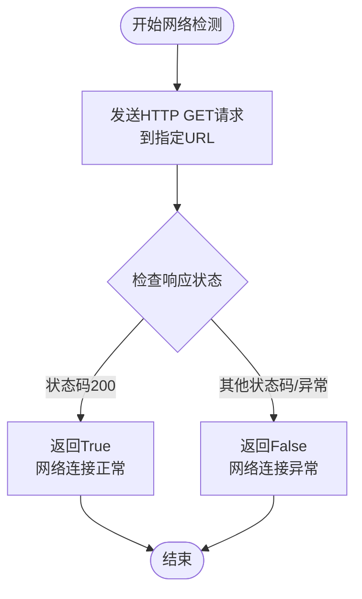
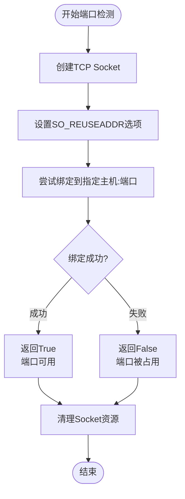
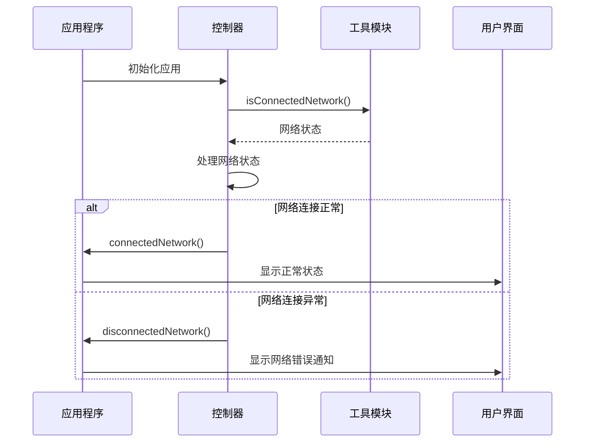
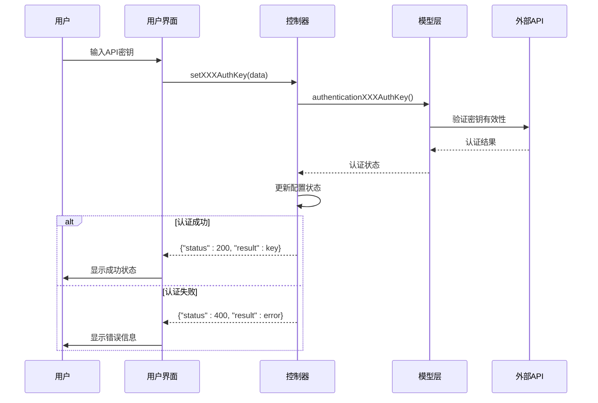
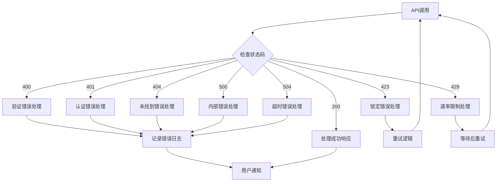
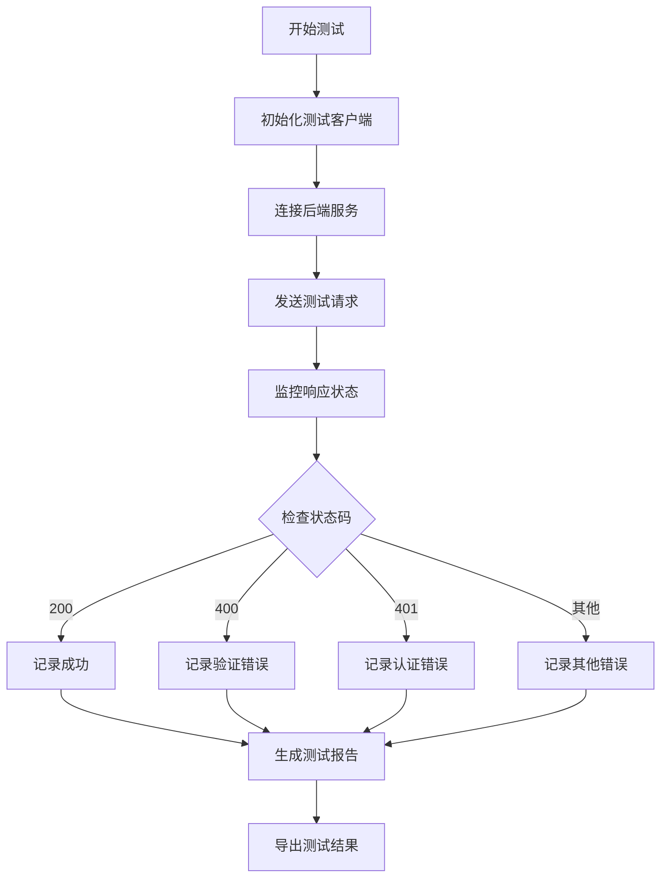
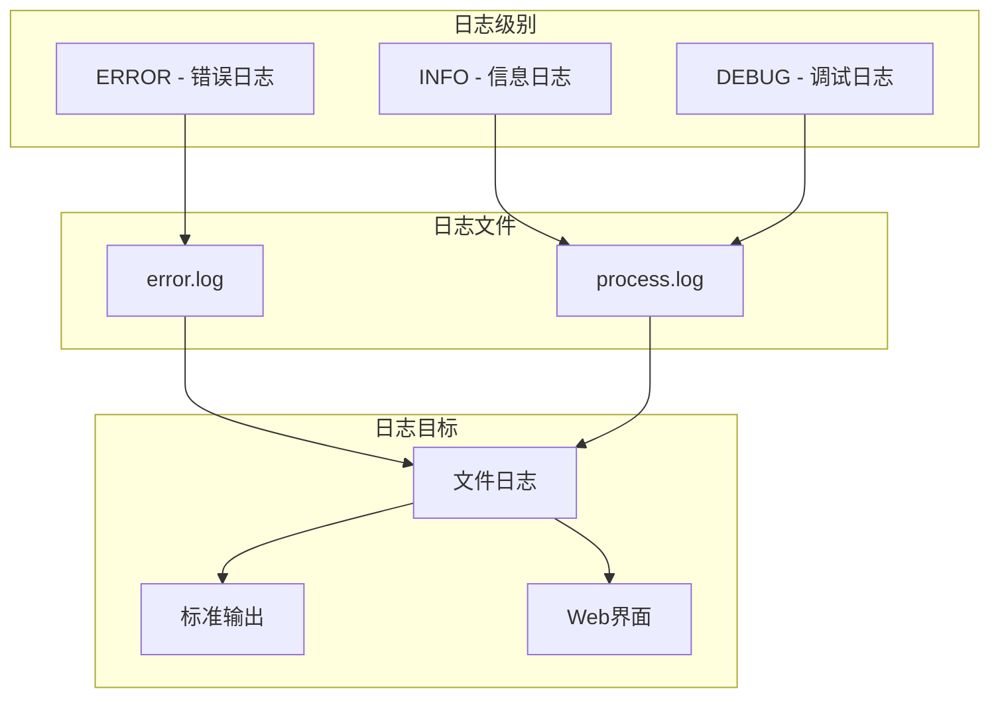
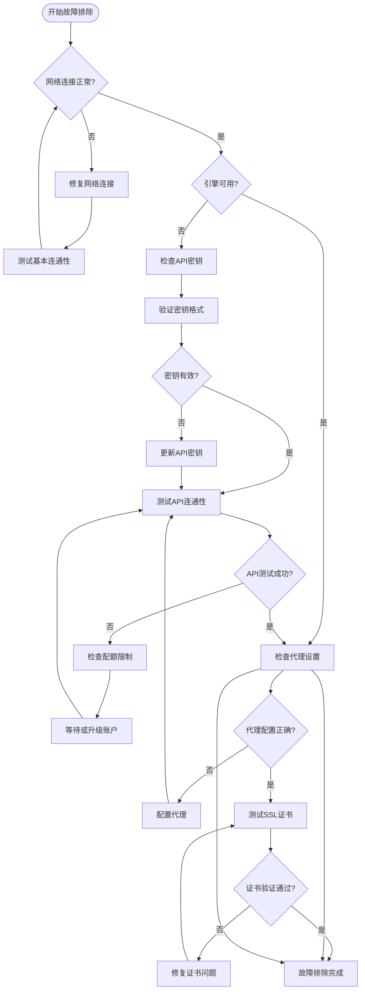

# 网络与API连接问题

<cite>
**本文档中引用的文件**
- [utils.py](file://src-python/utils.py)
- [test_endpoints.py](file://src-python/test_endpoints.py)
- [controller.py](file://src-python/controller.py)
- [model.py](file://src-python/model.py)
- [translation_gemini.py](file://src-python/models/translation/translation_gemini.py)
- [translation_openai.py](file://src-python/models/translation/translation_openai.py)
- [translation_ollama.py](file://src-python/models/translation/translation_ollama.py)
- [translation_utils.py](file://src-python/models/translation/translation_utils.py)
- [test_client.py](file://src-python/test_client.py)
- [useHandleNetworkConnection.js](file://src-ui/logics/common/useHandleNetworkConnection.js)
</cite>

## 目录
1. [简介](#简介)
2. [网络连接检测工具](#网络连接检测工具)
3. [翻译引擎配置与故障排除](#翻译引擎配置与故障排除)
4. [常见HTTP错误处理](#常见http错误处理)
5. [API连通性测试方法](#api连通性测试方法)
6. [日志分析与调试](#日志分析与调试)
7. [网络代理与证书问题](#网络代理与证书问题)
8. [故障排除流程图](#故障排除流程图)

## 简介

VRCT是一个多语言翻译应用程序，支持多种翻译引擎包括Gemini、OpenAI、Ollama等。本文档提供了全面的网络连接和API故障排除指南，帮助用户诊断和解决连接问题。

## 网络连接检测工具

### 核心检测函数

VRCT提供了两个核心的网络连接检测函数：

#### isConnectedNetwork() 函数
用于检测本地网络连通性，通过访问指定URL进行网络可用性检查。



**图表来源**
- [utils.py](file://src-python/utils.py#L59-L68)

#### isAvailableWebSocketServer() 函数  
用于检测WebSocket服务器端口是否可用，检查端口绑定能力。



**图表来源**
- [utils.py](file://src-python/utils.py#L70-L82)

### 网络连接状态监控

系统会自动监控网络连接状态，并在连接断开时提供相应的通知：



**图表来源**
- [controller.py](file://src-python/controller.py#L2895-L2899)
- [useHandleNetworkConnection.js](file://src-ui/logics/common/useHandleNetworkConnection.js#L7-L12)

**章节来源**
- [utils.py](file://src-python/utils.py#L59-L82)
- [controller.py](file://src-python/controller.py#L2895-L2899)
- [useHandleNetworkConnection.js](file://src-ui/logics/common/useHandleNetworkConnection.js#L1-L18)

## 翻译引擎配置与故障排除

### 支持的翻译引擎

VRCT支持以下翻译引擎：

| 引擎名称 | API类型 | 认证方式 | 端点要求 |
|---------|---------|----------|----------|
| DeepL_API | 在线API | API密钥 | 有效密钥长度 |
| Gemini_API | Google AI | API密钥 | 39字符以上 |
| OpenAI_API | OpenAI兼容 | API密钥 | sk-开头，164字符以上 |
| Plamo_API | 自托管 | API密钥 | 72字符以上 |
| LMStudio | 本地服务 | 无 | 可访问URL |
| Ollama | 本地服务 | 无 | 本地运行 |

### API密钥配置位置

#### DeepL API密钥
- **配置位置**: 设置页面 → 翻译引擎 → DeepL_API
- **验证规则**: API密钥长度必须正确
- **错误处理**: 长度不足时返回400错误

#### Gemini API密钥
- **配置位置**: 设置页面 → 翻译引擎 → Gemini_API
- **验证规则**: 密钥长度≥39字符
- **错误处理**: 长度不足时返回400错误

#### OpenAI API密钥
- **配置位置**: 设置页面 → 翻译引擎 → OpenAI_API
- **验证规则**: 
  - 必须以"sk-"开头
  - 长度≥164字符
- **错误处理**: 格式或长度错误时返回400错误

#### Plamo API密钥
- **配置位置**: 设置页面 → 翻译引擎 → Plamo_API
- **验证规则**: 密钥长度≥72字符
- **错误处理**: 长度不足时返回400错误

### 引擎认证流程



**图表来源**
- [controller.py](file://src-python/controller.py#L1568-L1585)
- [controller.py](file://src-python/controller.py#L1718-L1742)
- [controller.py](file://src-python/controller.py#L1815-L1847)

**章节来源**
- [controller.py](file://src-python/controller.py#L1568-L1853)
- [model.py](file://src-python/model.py#L195-L252)

## 常见HTTP错误处理

### 错误状态码分类

| 状态码 | 含义 | 常见原因 | 解决方案 |
|--------|------|----------|----------|
| 200 | 成功 | 请求正常处理 | 无需操作 |
| 400 | 请求错误 | 参数格式错误、认证失败 | 检查参数和密钥 |
| 401 | 认证失败 | API密钥无效或过期 | 重新配置密钥 |
| 404 | 未找到 | 端点不存在 | 检查API版本 |
| 423 | 锁定中 | 资源正在被使用 | 等待重试 |
| 429 | 请求过多 | 配额耗尽或速率限制 | 等待或升级账户 |
| 500 | 内部错误 | 服务器内部错误 | 检查服务状态 |
| 504 | 网关超时 | 请求处理超时 | 检查网络连接 |

### 错误处理机制



**图表来源**
- [test_client.py](file://src-python/test_client.py#L212-L233)

### 具体错误场景处理

#### 认证失败 (401)
- **原因**: API密钥无效、过期或权限不足
- **解决方案**: 
  1. 检查API密钥格式和长度
  2. 验证密钥是否已过期
  3. 确认密钥具有相应权限
  4. 重新生成并配置密钥

#### 配额耗尽 (429)
- **原因**: API调用次数超过限制
- **解决方案**:
  1. 检查当前使用量
  2. 等待配额重置
  3. 考虑升级账户
  4. 实现重试机制

#### 请求超时 (504)
- **原因**: 网络延迟或服务器处理时间过长
- **解决方案**:
  1. 检查网络连接质量
  2. 增加超时时间设置
  3. 优化请求参数
  4. 使用本地模型替代

**章节来源**
- [test_client.py](file://src-python/test_client.py#L212-L233)
- [controller.py](file://src-python/controller.py#L1568-L1853)

## API连通性测试方法

### 手动测试工具

#### curl命令测试

**Gemini API测试**:
```bash
curl -H "Authorization: Bearer YOUR_API_KEY" \
     -H "Content-Type: application/json" \
     -d '{"contents":[{"parts":[{"text":"Hello, world!"}]}]}' \
     https://generativelanguage.googleapis.com/v1beta/models/gemini-pro:generateContent
```

**OpenAI API测试**:
```bash
curl -H "Authorization: Bearer YOUR_API_KEY" \
     -H "Content-Type: application/json" \
     -d '{"messages":[{"role":"user","content":"Hello, world!"}]}' \
     https://api.openai.com/v1/chat/completions
```

**Ollama API测试**:
```bash
curl http://localhost:11434/api/tags
```

#### Postman测试配置

**Gemini API配置**:
- 方法: POST
- URL: `https://generativelanguage.googleapis.com/v1beta/models/gemini-pro:generateContent`
- Headers: `Authorization: Bearer YOUR_API_KEY`, `Content-Type: application/json`
- Body: JSON格式的消息内容

**OpenAI API配置**:
- 方法: POST
- URL: `https://api.openai.com/v1/chat/completions`
- Headers: `Authorization: Bearer YOUR_API_KEY`, `Content-Type: application/json`
- Body: 包含messages数组的JSON对象

### 自动化测试工具

VRCT提供了专门的测试客户端来自动化API连通性测试：



**图表来源**
- [test_client.py](file://src-python/test_client.py#L65-L233)

### 测试结果分析

测试客户端会生成详细的测试报告，包含以下信息：
- 端点状态：成功/失败/跳过
- 响应时间：各请求的处理时间
- 错误详情：具体的错误信息和堆栈跟踪
- 性能指标：成功率、平均响应时间等

**章节来源**
- [test_client.py](file://src-python/test_client.py#L65-L233)
- [test_endpoints.py](file://src-python/test_endpoints.py#L1-L800)

## 日志分析与调试

### 日志系统架构

VRCT采用分层的日志系统，支持多种级别的日志记录：



**图表来源**
- [utils.py](file://src-python/utils.py#L192-L221)

### 关键日志字段

#### 进程日志格式
```json
{
  "status": 348,
  "log": "setSelectedTabNo",
  "data": "1"
}
```

#### 响应日志格式
```json
{
  "status": 200,
  "endpoint": "/set/data/transparency",
  "result": 75
}
```

#### 错误日志格式
```json
{
  "status": 400,
  "endpoint": "/set/data/openai_auth_key",
  "result": {
    "message": "OpenAI auth key is not valid",
    "data": null
  }
}
```

### 常见日志模式

#### 网络连接日志
```
2024-01-15 10:30:15 - process - INFO - {"status": 348, "log": "Connected Network", "data": "True"}
```

#### API认证日志
```
2024-01-15 10:30:20 - process - INFO - {"status": 200, "endpoint": "setOpenAIAuthKey", "result": "sk-***"}
```

#### 错误处理日志
```
2024-01-15 10:30:25 - error - ERROR - Traceback (most recent call last):
  File "controller.py", line 1815, in setOpenAIAuthKey
    result = model.authenticationTranslatorOpenAIAuthKey(auth_key=data)
  ...
requests.exceptions.ConnectionError: HTTPSConnectionPool(host='api.openai.com', port=443): Max retries exceeded
```

### 日志分析技巧

#### 1. 网络问题诊断
- 查找"Network is not connected"相关日志
- 检查连接状态变化的时间点
- 分析网络超时相关的错误

#### 2. 认证问题诊断
- 寻找401状态码的请求
- 检查API密钥配置是否正确
- 验证密钥格式和有效期

#### 3. 性能问题诊断
- 分析响应时间较长的请求
- 检查重试机制的频率
- 监控资源使用情况

**章节来源**
- [utils.py](file://src-python/utils.py#L192-L291)
- [test_client.py](file://src-python/test_client.py#L212-L233)

## 网络代理与证书问题

### 代理服务器配置

#### HTTP代理设置
对于需要通过代理服务器访问外部API的情况：

```python
import requests

proxies = {
    "http": "http://proxy.example.com:8080",
    "https": "http://proxy.example.com:8080"
}

response = requests.get("https://api.openai.com/v1/models", proxies=proxies)
```

#### SOCKS代理设置
```python
proxies = {
    "http": "socks5://proxy.example.com:1080",
    "https": "socks5://proxy.example.com:1080"
}
```

### HTTPS证书问题

#### 证书验证失败
当遇到SSL证书验证错误时：

```python
# 禁用SSL验证（不推荐用于生产环境）
response = requests.get("https://api.openai.com/v1/models", verify=False)

# 或者提供自定义CA证书
response = requests.get("https://api.openai.com/v1/models", cert='/path/to/cert')
```

#### 证书链问题
```python
import ssl
import certifi

context = ssl.create_default_context(cafile=certifi.where())
response = requests.get("https://api.openai.com/v1/models", verify=context)
```

### 网络防火墙配置

#### 防火墙规则检查
确保以下端口和域名开放：
- **端口**: 443 (HTTPS)
- **域名**: api.openai.com, generativelanguage.googleapis.com, localhost:11434
- **协议**: TCP

#### 企业网络配置
在企业环境中，可能需要额外配置：
- 代理认证凭据
- SSL/TLS版本要求
- 证书信任链配置

### 本地服务连接

#### LMStudio连接测试
```bash
# 检查本地服务是否运行
curl http://localhost:1234/v1/models

# 检查端口占用情况
netstat -an | find "1234"
```

#### Ollama连接测试
```bash
# 检查Ollama服务状态
ollama list

# 测试API连通性
curl http://localhost:11434/api/tags
```

## 故障排除流程图

### 综合故障排除流程



### 快速诊断检查清单

#### 第一步：网络连接检查
- [ ] 使用`isConnectedNetwork()`函数测试基础网络
- [ ] 检查系统网络设置
- [ ] 验证DNS解析功能

#### 第二步：API密钥验证
- [ ] 检查API密钥格式和长度
- [ ] 验证密钥是否有效
- [ ] 确认密钥权限设置

#### 第三步：服务可用性检查
- [ ] 测试各翻译引擎的连通性
- [ ] 检查本地服务（LMStudio、Ollama）状态
- [ ] 验证端口绑定情况

#### 第四步：高级诊断
- [ ] 检查代理服务器配置
- [ ] 验证SSL/TLS证书
- [ ] 分析详细日志信息

### 故障排除最佳实践

#### 1. 渐进式诊断
按照从简单到复杂的顺序进行诊断：
1. 基础网络连接
2. API密钥配置
3. 服务可用性
4. 高级网络设置

#### 2. 记录诊断过程
- 保存所有测试命令和结果
- 记录修改的配置项
- 截取相关错误信息

#### 3. 逐步恢复
- 每次只修改一个配置项
- 测试修改后的效果
- 如果问题复现，回滚到上一个稳定状态

#### 4. 获取帮助
- 提供完整的诊断信息
- 包含相关日志文件
- 描述问题发生的上下文

**章节来源**
- [utils.py](file://src-python/utils.py#L59-L82)
- [controller.py](file://src-python/controller.py#L2895-L2899)
- [test_endpoints.py](file://src-python/test_endpoints.py#L1-L800)