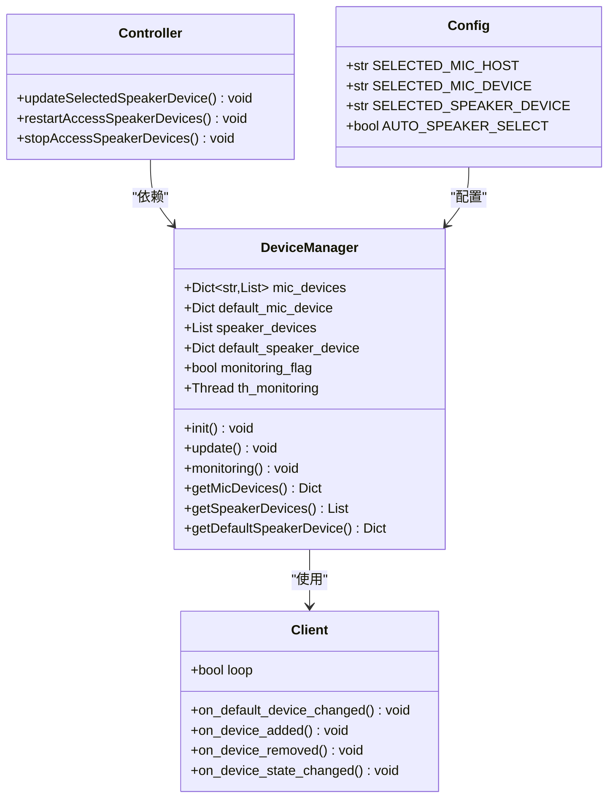
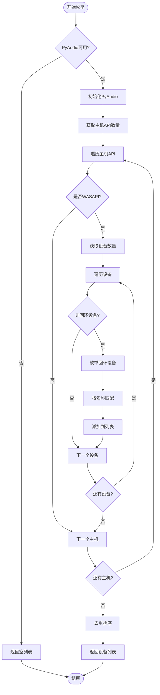
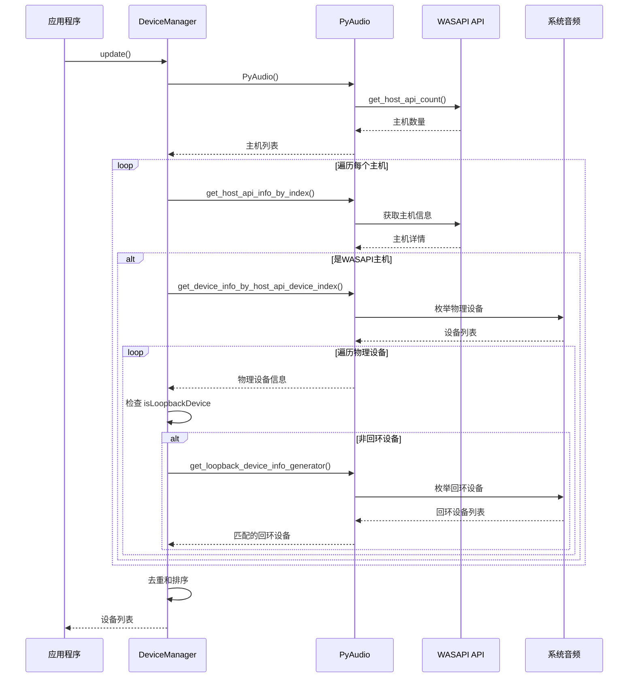
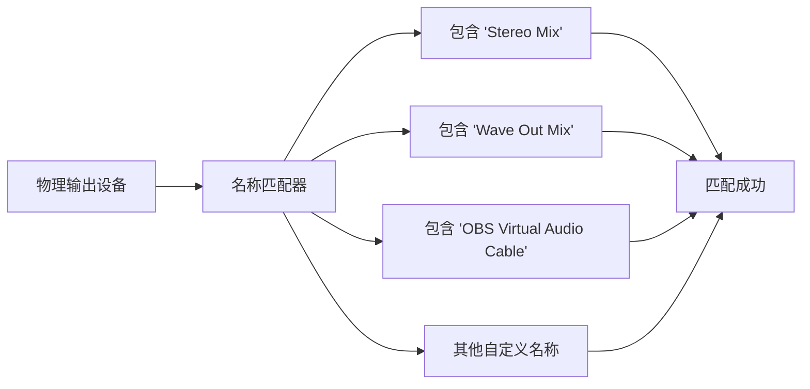
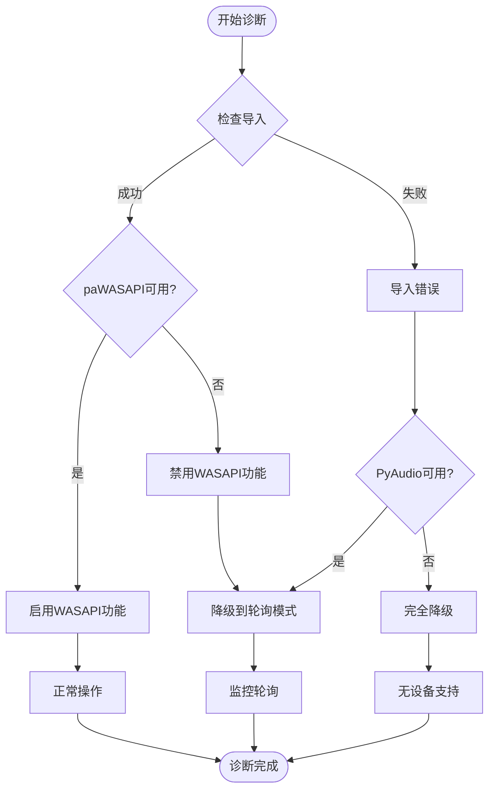
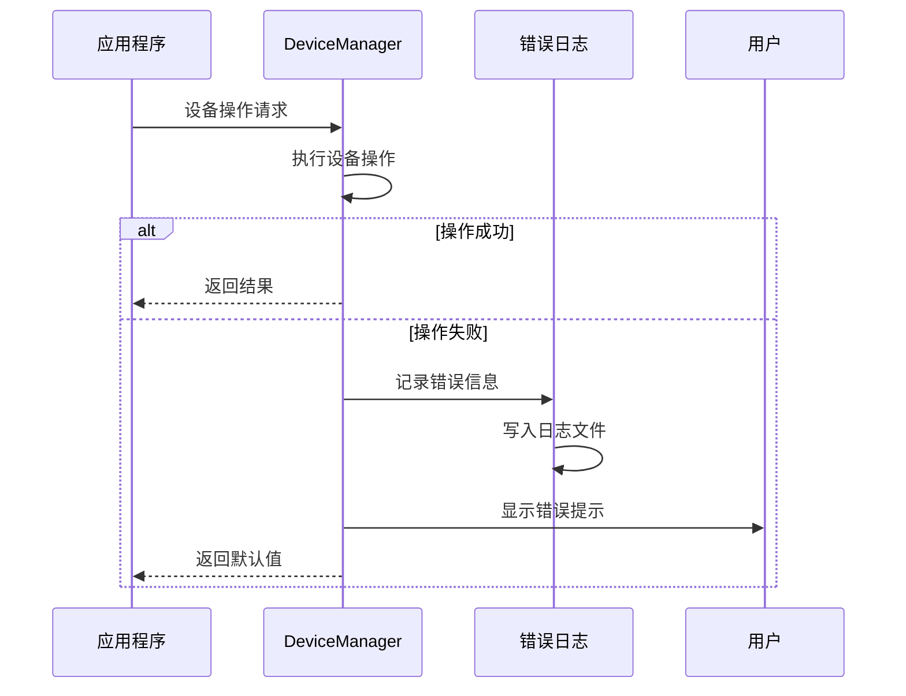

# 回环设备配置与驱动支持

<cite>
**本文档引用的文件**
- [device_manager.py](file://src-python/device_manager.py)
- [device_manager_zh.md](file://src-python/docs/device_manager_zh.md)
- [controller.py](file://src-python/controller.py)
- [config.py](file://src-python/config.py)
- [model.py](file://src-python/model.py)
</cite>

## 目录
1. [概述](#概述)
2. [核心架构](#核心架构)
3. [get_loopback_device_info_generator() 实现详解](#get_loopback_device_info_generator-实现详解)
4. [WASAPI 主机 API 枚举机制](#wasapi-主机-api-枚举机制)
5. [虚拟回环设备配置](#虚拟回环设备配置)
6. [诊断与故障排除](#诊断与故障排除)
7. [设备名称模糊匹配策略](#设备名称模糊匹配策略)
8. [最佳实践指南](#最佳实践指南)
9. [常见问题解答](#常见问题解答)

## 概述

VRCT 项目中的回环设备配置是实现语音识别和翻译功能的关键组件。回环设备允许应用程序捕获系统音频输出，这对于识别 VRChat 等应用中的对方语音至关重要。本文档深入解析 `device_manager.py` 中的核心实现逻辑，并提供完整的配置指南。

## 核心架构

VRCT 的设备管理系统采用单例模式设计，通过 `DeviceManager` 类提供统一的音频设备管理接口。



**图表来源**
- [device_manager.py](file://src-python/device_manager.py#L56-L529)
- [controller.py](file://src-python/controller.py#L11-L3133)
- [config.py](file://src-python/config.py#L728-L732)

**章节来源**
- [device_manager.py](file://src-python/device_manager.py#L56-L122)
- [device_manager_zh.md](file://src-python/docs/device_manager_zh.md#L1-L100)

## get_loopback_device_info_generator() 实现详解

### 核心实现逻辑

`get_loopback_device_info_generator()` 方法位于 `device_manager.py` 的 `update()` 方法中，负责枚举和匹配回环设备。该方法的核心逻辑如下：



**图表来源**
- [device_manager.py](file://src-python/device_manager.py#L182-L227)

### 关键实现细节

1. **WASAPI 主机检测**: 通过 `p.get_host_api_info_by_type(paWASAPI)` 确定 WASAPI 主机
2. **设备过滤**: 只处理 `not device.get("isLoopbackDevice", True)` 的物理输出设备
3. **名称匹配**: 使用 `device.get("name") in loopback.get("name", "")` 进行模糊匹配
4. **错误处理**: 完善的异常捕获确保系统稳定性

**章节来源**
- [device_manager.py](file://src-python/device_manager.py#L182-L227)
- [device_manager_zh.md](file://src-python/docs/device_manager_zh.md#L283-L308)

## WASAPI 主机 API 枚举机制

### 枚举流程

WASAPI（Windows Audio Session API）是 Windows 系统中专门用于音频回环设备的 API。VRCT 通过以下步骤实现设备枚举：



**图表来源**
- [device_manager.py](file://src-python/device_manager.py#L155-L227)

### 依赖库分析

VRCT 使用以下关键库实现 WASAPI 功能：

| 库 | 用途 | 必需性 |
|---|---|---|
| `pyaudiowpatch` | WASAPI 回环设备支持 | 可选（Windows 专用） |
| `pyaudio` | 音频设备抽象层 | 必需 |
| `pycaw` | Windows 音频会话 API | 可选（Windows 专用） |
| `comtypes` | COM 接口支持 | 可选（Windows 专用） |

**章节来源**
- [device_manager.py](file://src-python/device_manager.py#L5-L23)

## 虚拟回环设备配置

### 支持的虚拟音频设备

VRCT 支持多种虚拟音频设备作为回环源：

| 设备名称 | 描述 | 适用场景 |
|---|---|---|
| Stereo Mix | Windows 系统默认混音设备 | 基础语音识别 |
| Wave Out Mix | 音频输出混音设备 | 游戏和多媒体应用 |
| OBS Virtual Audio Cable | OBS Studio 虚拟音频电缆 | 高级音频路由 |
| VoiceMeeter | 虚拟音频混音器 | 专业音频制作 |
| VB-Cable | 虚拟音频电缆 | 通用音频路由 |

### Windows 声音设置配置

#### 启用 Stereo Mix

1. **打开声音设置**
   - 右键点击任务栏音量图标
   - 选择"声音设置"
   - 点击"声音控制面板"

2. **启用立体声混音**
   - 在"录制"选项卡中右键点击空白区域
   - 选择"显示禁用的设备"
   - 找到"立体声混音"并启用

3. **设置默认设备**
   - 右键点击"立体声混音"
   - 选择"设置为默认设备"

#### 配置 OBS Virtual Audio Cable

1. **安装 OBS Studio**
   - 下载并安装最新版本的 OBS Studio
   - 启动 OBS Studio

2. **配置虚拟音频电缆**
   - 在"设置" > "音频"中配置主音频设备
   - 添加虚拟音频电缆作为辅助设备
   - 在目标应用中使用虚拟电缆作为音频输出

### 设备名称识别

VRCT 使用设备名称模糊匹配策略来识别回环设备。常见的设备名称模式：



**图表来源**
- [device_manager.py](file://src-python/device_manager.py#L196-L198)

**章节来源**
- [device_manager_zh.md](file://src-python/docs/device_manager_zh.md#L303-L307)

## 诊断与故障排除

### paWASAPI 不可用诊断

当 `paWASAPI` 不可用时，系统会自动降级到轮询模式。以下是诊断步骤：



**图表来源**
- [device_manager.py](file://src-python/device_manager.py#L12-L15)

### pyaudiowpatch 库完整性验证

#### 安装验证

1. **检查库安装**
   ```bash
   pip show pyaudiowpatch
   ```

2. **测试基本功能**
   ```python
   from pyaudiowpatch import PyAudio, paWASAPI
   p = PyAudio()
   print(p.get_host_api_info_by_type(paWASAPI))
   ```

3. **检查系统兼容性**
   - 确认 Windows 版本支持 WASAPI
   - 验证音频驱动程序完整性

#### 常见问题及解决方案

| 问题 | 原因 | 解决方案 |
|---|---|---|
| 导入失败 | 库未安装或版本不兼容 | 重新安装：`pip install pyaudiowpatch` |
| WASAPI 不可用 | 系统不支持或驱动问题 | 更新音频驱动程序 |
| 权限不足 | 音频设备访问受限 | 以管理员身份运行 |
| 设备枚举失败 | 系统音频服务异常 | 重启 Windows Audio 服务 |

### 错误日志分析

VRCT 提供完善的错误日志记录机制：



**图表来源**
- [device_manager.py](file://src-python/device_manager.py#L232-L234)

**章节来源**
- [device_manager_zh.md](file://src-python/docs/device_manager_zh.md#L978-L1046)

## 设备名称模糊匹配策略

### 匹配算法实现

VRCT 使用简单而有效的模糊匹配策略来识别回环设备：

```python
# 匹配逻辑示例
if device.get("name") in loopback.get("name", ""):
    speaker_devices.append(loopback)
```

### 匹配规则详解

1. **字符串包含匹配**
   - 检查物理设备名称是否包含在回环设备名称中
   - 支持部分匹配，提高兼容性

2. **大小写不敏感**
   - 自动处理不同语言的设备名称格式
   - 支持包含特殊字符的设备名称

3. **多语言支持**
   - 支持日文、韩文、中文等语言的设备名称
   - 自动适应不同语言环境

### 匹配效果对比

| 物理设备名称 | 回环设备名称 | 匹配结果 | 说明 |
|---|---|---|---|
| Realtek High Definition Audio | Stereo Mix (Realtek High Definition Audio) | ✅ 成功 | 完全匹配 |
| USB Audio Device | Wave Out Mix (USB Audio Device) | ✅ 成功 | 部分匹配 |
| Headphones (Bluetooth) | What U Hear (Bluetooth Headphones) | ✅ 成功 | 蓝牙设备匹配 |
| HDMI Audio Output | OBS Virtual Audio Cable | ❌ 失败 | 不相关设备 |

**章节来源**
- [device_manager.py](file://src-python/device_manager.py#L196-L198)
- [device_manager_zh.md](file://src-python/docs/device_manager_zh.md#L296-L298)

## 最佳实践指南

### 系统配置建议

1. **音频驱动更新**
   - 定期更新声卡驱动程序
   - 确保支持 WASAPI 功能
   - 验证音频设备的完整性和稳定性

2. **虚拟音频设备选择**
   - 对于基础用户：推荐使用 Windows 自带的 Stereo Mix
   - 对于高级用户：推荐使用 OBS Virtual Audio Cable
   - 对于专业用户：推荐使用 VoiceMeeter 或其他专业音频软件

3. **系统资源优化**
   - 关闭不必要的音频设备
   - 确保足够的系统内存
   - 避免音频冲突和竞争

### 配置文件管理

VRCT 使用 JSON 格式的配置文件存储设备设置：

```json
{
    "SELECTED_MIC_HOST": "Windows WASAPI",
    "SELECTED_MIC_DEVICE": "Microphone (Realtek)",
    "SELECTED_SPEAKER_DEVICE": "Stereo Mix (Realtek)",
    "AUTO_SPEAKER_SELECT": true
}
```

### 监控和维护

1. **定期检查设备状态**
   - 监控设备变更事件
   - 验证设备可用性
   - 及时处理设备冲突

2. **性能优化**
   - 合理设置轮询间隔
   - 优化回调函数性能
   - 避免频繁的设备切换

**章节来源**
- [config.py](file://src-python/config.py#L728-L732)
- [controller.py](file://src-python/controller.py#L140-L148)

## 常见问题解答

### Q1: 为什么我的回环设备没有出现在列表中？

**A1**: 可能原因：
- 虚拟音频设备未正确安装或启用
- 设备名称不符合匹配规则
- WASAPI 功能被禁用
- 系统权限不足

**解决方案**：
1. 检查虚拟音频设备是否已启用
2. 验证设备名称是否包含在支持的模式中
3. 确认 WASAPI 功能可用性
4. 以管理员权限运行应用程序

### Q2: 如何手动选择回环设备？

**A2**: 通过配置界面手动选择：
1. 打开 VRCT 设置窗口
2. 导航到"设备"选项卡
3. 在"扬声器设备"下拉菜单中选择合适的回环设备
4. 点击"应用"保存设置

### Q3: 监听功能仍然失败怎么办？

**A3**: 诊断步骤：
1. 检查物理音频输出是否正常
2. 验证虚拟音频设备配置
3. 确认 WASAPI 库可用性
4. 查看错误日志获取详细信息
5. 重启音频服务和应用程序

### Q4: 如何启用自动设备选择？

**A4**: 自动设备选择功能：
- 在配置中启用 `AUTO_SPEAKER_SELECT`
- 系统会自动选择可用的最佳回环设备
- 支持设备变更时的自动切换

**章节来源**
- [device_manager_zh.md](file://src-python/docs/device_manager_zh.md#L1099-L1116)
- [controller.py](file://src-python/controller.py#L140-L148)

## 结论

VRCT 的回环设备配置系统通过精心设计的架构和完善的错误处理机制，为用户提供可靠的语音识别和翻译功能。通过理解 `get_loopback_device_info_generator()` 的实现逻辑、掌握 WASAPI 枚举机制、正确配置虚拟音频设备，以及遵循最佳实践指南，用户可以有效解决监听失败问题，获得流畅的使用体验。

系统的模块化设计和错误恢复机制确保了即使在复杂的音频环境中也能保持稳定运行。随着技术的不断发展，VRCT 将继续优化设备管理功能，为用户提供更好的语音交互体验。