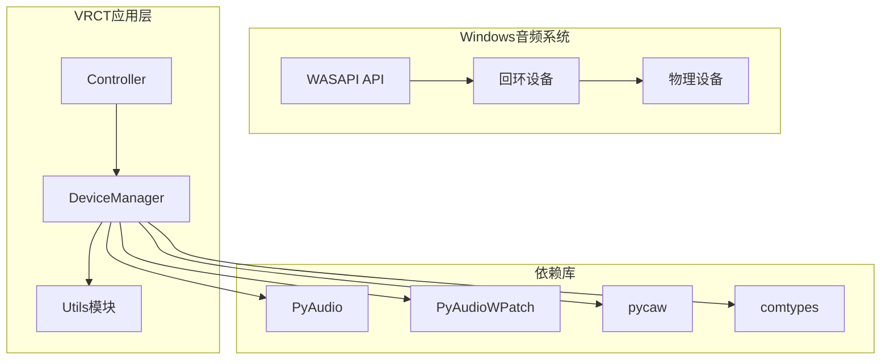
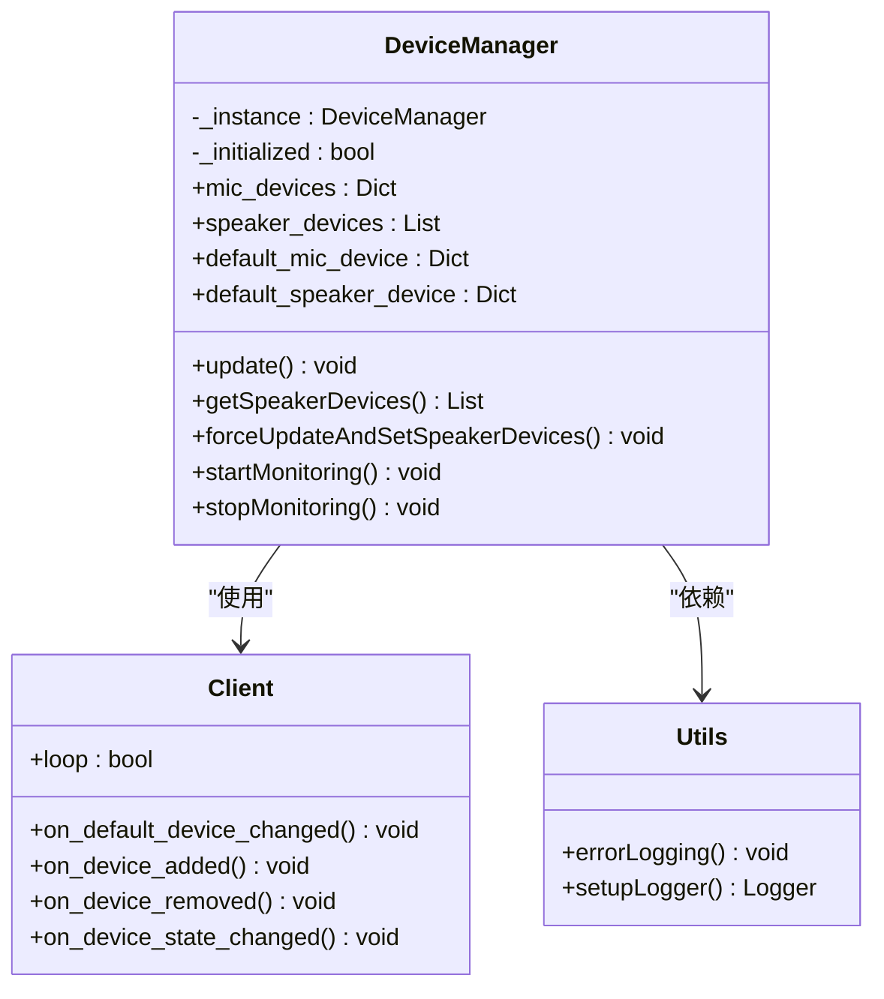
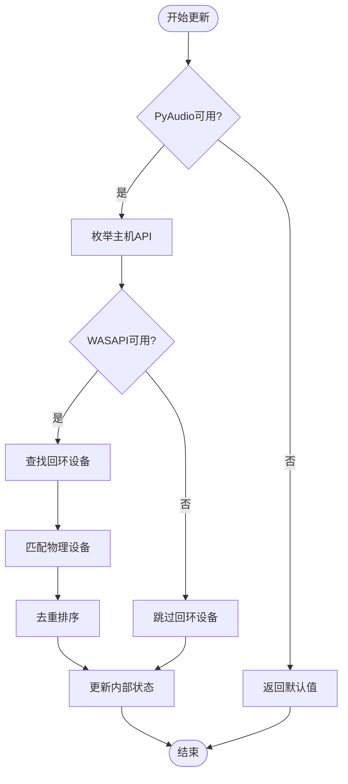
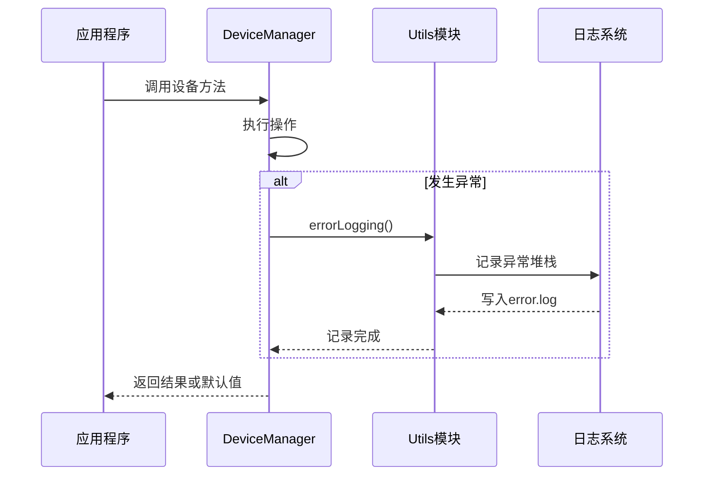

# 扬声器监听问题详细指南

<cite>
**本文档中引用的文件**
- [device_manager.py](file://src-python/device_manager.py)
- [utils.py](file://src-python/utils.py)
- [requirements.txt](file://requirements.txt)
- [controller.py](file://src-python/controller.py)
- [device_manager.md](file://src-python/docs/device_manager.md)
- [device_manager_zh.md](file://src-python/docs/device_manager_zh.md)
</cite>

## 目录
1. [简介](#简介)
2. [问题概述](#问题概述)
3. [WASAPI回环设备架构](#wasapi回环设备架构)
4. [核心组件分析](#核心组件分析)
5. [故障排查步骤](#故障排查步骤)
6. [Windows声音设置配置](#windows声音设置配置)
7. [依赖库安装验证](#依赖库安装验证)
8. [错误日志分析](#错误日志分析)
9. [解决方案实施](#解决方案实施)
10. [最佳实践建议](#最佳实践建议)

## 简介

本指南专门针对VRCT项目中无法监听扬声器输出（如VRChat语音）的问题。该问题主要涉及WASAPI回环设备的正确配置和使用，以及相关的音频设备枚举机制。

## 问题概述

在VRCT项目中，扬声器监听功能依赖于WASAPI回环设备来捕获系统音频输出。当遇到无法监听扬声器输出的问题时，通常表现为：
- `getSpeakerDevices()` 返回空列表
- 回环设备枚举失败
- 无法识别VRChat语音输入

这些问题的根本原因通常与以下因素有关：
- Windows声音设置中缺少回环设备
- 必需依赖库未正确安装
- WASAPI回环设备枚举逻辑异常
- 设备名称匹配失败

## WASAPI回环设备架构

### 架构概览



**图表来源**
- [device_manager.py](file://src-python/device_manager.py#L11-L23)
- [requirements.txt](file://requirements.txt#L6-L18)

### 回环设备工作原理

WASAPI回环设备是一种特殊的虚拟音频设备，能够录制系统音频输出。其工作机制包括：

1. **设备发现**: 通过`get_loopback_device_info_generator()`枚举回环设备
2. **物理设备匹配**: 将回环设备与对应的物理输出设备关联
3. **名称匹配**: 基于设备名称的包含关系进行匹配

**节来源**
- [device_manager.py](file://src-python/device_manager.py#L181-L227)

## 核心组件分析

### DeviceManager类结构



**图表来源**
- [device_manager.py](file://src-python/device_manager.py#L56-L521)
- [utils.py](file://src-python/utils.py#L278-L291)

### 关键方法分析

#### getSpeakerDevices() 方法

该方法是获取扬声器设备的核心入口点，负责：

1. **初始化检查**: 确保DeviceManager已初始化
2. **设备枚举**: 调用内部update()方法获取最新设备列表
3. **错误处理**: 在异常情况下返回安全的默认值

#### update() 方法

这是设备信息更新的核心逻辑，包含WASAPI回环设备处理的关键部分：



**图表来源**
- [device_manager.py](file://src-python/device_manager.py#L140-L238)

**节来源**
- [device_manager.py](file://src-python/device_manager.py#L483-L493)

## 故障排查步骤

### 第一步：检查getSpeakerDevices()返回值

当遇到无法监听扬声器输出的问题时，首先需要确认`getSpeakerDevices()`的返回情况：

```python
# 在调试环境中测试
from device_manager import device_manager

# 初始化设备管理器
device_manager.init()

# 获取扬声器设备列表
speaker_devices = device_manager.getSpeakerDevices()
print(f"扬声器设备数量: {len(speaker_devices)}")
print(f"设备列表: {speaker_devices}")
```

**预期结果**:
- 如果返回空列表`[]`，表明回环设备枚举失败
- 如果返回包含设备信息的列表，则问题可能在其他方面

### 第二步：验证依赖库安装

检查必需的Windows特定依赖库是否正确安装：

```bash
pip show pyaudiowpatch pycaw comtypes
```

**必要依赖**:
- `pyaudiowpatch`: 提供WASAPI回环设备支持
- `pycaw`: Windows音频控制API
- `comtypes`: COM接口支持

### 第三步：检查WASAPI可用性

验证WASAPI回环设备枚举功能：

```python
from pyaudiowpatch import PyAudio, paWASAPI

# 测试WASAPI可用性
if paWASAPI is not None:
    print("WASAPI可用")
    try:
        with PyAudio() as p:
            # 获取WASAPI主机信息
            wasapi_info = p.get_host_api_info_by_type(paWASAPI)
            print(f"WASAPI名称: {wasapi_info.get('name')}")
            
            # 枚举回环设备
            loopbacks = list(p.get_loopback_device_info_generator())
            print(f"回环设备数量: {len(loopbacks)}")
            for lb in loopbacks:
                print(f"回环设备: {lb.get('name')}")
    except Exception as e:
        print(f"WASAPI测试失败: {e}")
else:
    print("WASAPI不可用，请检查依赖库")
```

**节来源**
- [device_manager.py](file://src-python/device_manager.py#L183-L201)

## Windows声音设置配置

### 启用'Stereo Mix'或类似回环设备

在Windows声音设置中，需要确保启用了回环设备。以下是具体步骤：

#### 步骤1：打开声音设置
1. 右键点击任务栏音量图标
2. 选择"声音设置"
3. 在"声音控制面板"中点击"更改系统声音"

#### 步骤2：启用回环设备
1. 切换到"录制"选项卡
2. 查找"Stereo Mix"、"What U Hear"或其他类似名称的设备
3. 如果设备不存在，右键点击空白区域，勾选"显示禁用的设备"
4. 如果仍然没有找到，尝试以下方法：

#### 方法1：直接启用回环设备
```powershell
# PowerShell命令（管理员权限）
Set-ItemProperty -Path "HKLM:\SOFTWARE\Microsoft\DirectX\DXR" -Name "EnableWASAPI" -Value 1
```

#### 方法2：修改注册表
创建以下注册表项：
```
[HKEY_LOCAL_MACHINE\SOFTWARE\Microsoft\DirectX\DXR]
"EnableWASAPI"=dword:00000001
```

### 设备名称匹配规则

WASAPI回环设备枚举使用设备名称的包含关系进行匹配：

```python
# 匹配逻辑示例
for loopback in p.get_loopback_device_info_generator():
    if device.get("name") in loopback.get("name", ""):
        speaker_devices.append(loopback)
```

**常见设备名称模式**:
- "Stereo Mix (Realtek High Definition Audio)"
- "What U Hear (High Definition Audio Device)"
- "立体声混音 (Realtek High Definition Audio)"

**节来源**
- [device_manager.py](file://src-python/device_manager.py#L196-L198)

## 依赖库安装验证

### 必需依赖库

根据项目要求，以下依赖库必须正确安装：

| 库名称 | 版本要求 | 用途 | 安装命令 |
|--------|----------|------|----------|
| `pyaudiowpatch` | 0.2.12.6 | WASAPI回环设备支持 | `pip install pyaudiowpatch==0.2.12.6` |
| `pycaw` | 20240210 | Windows音频控制API | `pip install pycaw==20240210` |
| `comtypes` | - | COM接口支持 | `pip install comtypes` |

### 安装验证脚本

```python
# 依赖库验证脚本
def verify_dependencies():
    required_packages = {
        'pyaudiowpatch': '0.2.12.6',
        'pycaw': '20240210',
        'comtypes': None
    }
    
    import importlib
    missing_packages = []
    
    for pkg, version in required_packages.items():
        try:
            module = importlib.import_module(pkg.split('@')[0].split('==')[0])
            if version:
                installed_version = getattr(module, '__version__', '')
                if installed_version != version:
                    print(f"警告: {pkg}版本不匹配，期望{version}，实际{installed_version}")
            print(f"✓ {pkg} 已正确安装")
        except ImportError:
            missing_packages.append(pkg)
            print(f"✗ {pkg} 未安装")
    
    if missing_packages:
        print(f"\n缺少以下必需依赖: {', '.join(missing_packages)}")
        return False
    return True

verify_dependencies()
```

### 常见安装问题及解决方案

#### 问题1：pyaudiowpatch安装失败
**原因**: 缺少Visual C++构建工具
**解决方案**:
```bash
# 安装Microsoft Visual C++ Build Tools
pip install --upgrade pip
pip install --no-cache-dir pyaudiowpatch==0.2.12.6
```

#### 问题2：comtypes导入错误
**原因**: Python版本不兼容
**解决方案**:
```bash
# 升级pip和comtypes
pip install --upgrade pip
pip install --upgrade comtypes
```

**节来源**
- [requirements.txt](file://requirements.txt#L6-L18)

## 错误日志分析

### 错误日志系统

VRCT项目使用统一的错误日志系统来记录和追踪问题：



**图表来源**
- [utils.py](file://src-python/utils.py#L280-L291)
- [device_manager.py](file://src-python/device_manager.py#L232-L234)

### 常见错误类型

#### 1. WASAPI不可用错误
**错误特征**: `paWASAPI is None`
**原因**: pyaudiowpatch库未正确安装
**解决方案**: 重新安装依赖库

#### 2. 设备枚举失败
**错误特征**: `p.get_loopback_device_info_generator()`抛出异常
**原因**: Windows音频驱动问题或权限不足
**解决方案**: 
- 以管理员身份运行应用程序
- 检查音频驱动程序更新
- 验证Windows音频服务状态

#### 3. 设备名称匹配失败
**错误特征**: 回环设备列表为空但物理设备存在
**原因**: 设备名称格式不匹配
**解决方案**: 
- 检查设备名称的实际格式
- 修改匹配逻辑（如果需要）

### 日志文件位置

- **错误日志**: `error.log`
- **进程日志**: `process.log`

### 分析日志内容

```python
# 日志分析示例
import traceback

def analyze_error_log():
    try:
        with open('error.log', 'r', encoding='utf-8') as f:
            error_content = f.read()
        
        # 检查WASAPI相关错误
        if 'paWASAPI' in error_content or 'WASAPI' in error_content:
            print("检测到WASAPI相关错误")
            # 分析具体的错误堆栈
            lines = error_content.split('\n')
            for i, line in enumerate(lines):
                if 'Traceback' in line:
                    stack_trace = '\n'.join(lines[i:i+10])
                    print("堆栈跟踪:")
                    print(stack_trace)
                    break
    except FileNotFoundError:
        print("错误日志文件不存在")
```

**节来源**
- [utils.py](file://src-python/utils.py#L280-L291)

## 解决方案实施

### 完整的故障排查流程

```mermaid
flowchart TD
Start([开始排查]) --> CheckInit{DeviceManager已初始化?}
CheckInit --> |否| InitDM[调用device_manager.init()]
CheckInit --> |是| CheckPA{PyAudio可用?}
InitDM --> CheckPA
CheckPA --> |否| InstallPA[安装pyaudiowpatch]
CheckPA --> |是| CheckWASAPI{WASAPI可用?}
InstallPA --> Restart[重启应用]
CheckWASAPI --> |否| EnableWASAPI[启用WASAPI]
CheckWASAPI --> |是| CheckLoopback{回环设备存在?}
EnableWASAPI --> Restart
CheckLoopback --> |否| EnableLoopback[启用回环设备]
CheckLoopback --> |是| CheckMatch{设备匹配成功?}
EnableLoopback --> Restart
CheckMatch --> |否| FixMatch[修复匹配逻辑]
CheckMatch --> |是| Success[问题解决]
FixMatch --> Success
Restart --> CheckPA
```

### 代码级别解决方案

#### 1. 强制更新设备列表

```python
# 强制刷新设备信息
def force_refresh_speaker_devices():
    from device_manager import device_manager
    
    # 停止监控
    device_manager.stopMonitoring()
    
    # 强制更新
    device_manager.forceUpdateAndSetSpeakerDevices()
    
    # 重新启动监控
    device_manager.startMonitoring()
    
    # 获取更新后的设备列表
    speaker_devices = device_manager.getSpeakerDevices()
    return speaker_devices
```

#### 2. 自定义设备匹配逻辑

```python
# 自定义回环设备匹配
def custom_get_loopback_devices():
    from pyaudiowpatch import PyAudio, paWASAPI
    
    if paWASAPI is None:
        return []
    
    try:
        with PyAudio() as p:
            # 获取WASAPI主机信息
            wasapi_info = p.get_host_api_info_by_type(paWASAPI)
            wasapi_name = wasapi_info.get("name")
            
            # 存储候选回环设备
            candidate_loopbacks = []
            
            # 枚举所有设备
            for host_index in range(p.get_host_api_count()):
                host = p.get_host_api_info_by_index(host_index)
                
                # 只处理WASAPI主机
                if host.get("name") == wasapi_name:
                    device_count = host.get('deviceCount', 0)
                    
                    for device_index in range(device_count):
                        device = p.get_device_info_by_host_api_device_index(host_index, device_index)
                        
                        # 跳过回环设备，只处理物理输出设备
                        if not device.get("isLoopbackDevice", True):
                            # 查找匹配的回环设备
                            for loopback in p.get_loopback_device_info_generator():
                                # 使用更宽松的匹配条件
                                device_name = device.get("name", "").lower()
                                loopback_name = loopback.get("name", "").lower()
                                
                                # 包含关系匹配
                                if device_name in loopback_name or loopback_name in device_name:
                                    candidate_loopbacks.append({
                                        "physical_device": device,
                                        "loopback_device": loopback,
                                        "match_score": len(device_name) if device_name in loopback_name else len(loopback_name)
                                    })
            
            # 按匹配分数排序
            candidate_loopbacks.sort(key=lambda x: x["match_score"], reverse=True)
            
            # 返回最佳匹配
            return [item["loopback_device"] for item in candidate_loopbacks]
            
    except Exception as e:
        print(f"自定义回环设备枚举失败: {e}")
        return []
```

#### 3. 设备状态监控

```python
# 实时设备状态监控
def monitor_device_status():
    from device_manager import device_manager
    from time import sleep
    
    # 初始化
    device_manager.init()
    device_manager.startMonitoring()
    
    try:
        while True:
            # 获取当前状态
            mic_devices = device_manager.getMicDevices()
            speaker_devices = device_manager.getSpeakerDevices()
            
            print(f"麦克风设备数量: {len(mic_devices)}")
            print(f"扬声器设备数量: {len(speaker_devices)}")
            
            # 检查回环设备状态
            if not speaker_devices or speaker_devices == [{"index": -1, "name": "NoDevice"}]:
                print("警告: 未检测到可用的回环设备")
            else:
                for device in speaker_devices:
                    print(f"回环设备: {device.get('name')}")
            
            sleep(5)
            
    except KeyboardInterrupt:
        print("监控停止")
    finally:
        device_manager.stopMonitoring()
```

**节来源**
- [device_manager.py](file://src-python/device_manager.py#L507-L517)

## 最佳实践建议

### 1. 系统环境准备

#### Windows系统要求
- Windows 10或更高版本
- 管理员权限（某些情况下需要）
- 最新的音频驱动程序

#### 推荐的系统配置
```powershell
# 系统优化脚本
# 1. 确保音频服务正常
Get-Service audiosrv | Start-Service

# 2. 检查音频驱动
Get-WmiObject Win32_SoundDevice | Select-Object Name, Status

# 3. 清理音频缓存
Stop-Service audiosrv
Remove-Item "C:\Windows\System32\winevt\Logs\Microsoft-Windows-Audio*.etl" -Force
Start-Service audiosrv
```

### 2. 应用程序配置

#### 初始化顺序
```python
# 推荐的初始化顺序
def initialize_vrct_audio_system():
    # 1. 初始化设备管理器
    from device_manager import device_manager
    
    # 2. 设置回调函数
    def on_speaker_change(device_name):
        print(f"扬声器设备变更: {device_name}")
        # 处理设备变更逻辑
    
    device_manager.setCallbackDefaultSpeakerDevice(on_speaker_change)
    
    # 3. 初始化并启动监控
    device_manager.init()
    device_manager.startMonitoring()
    
    # 4. 强制更新设备列表
    device_manager.forceUpdateAndSetSpeakerDevices()
    
    return device_manager
```

#### 错误恢复机制
```python
# 带错误恢复的设备管理
class RobustDeviceManager:
    def __init__(self):
        self.device_manager = None
        self.recovery_attempts = 0
        self.max_recovery_attempts = 3
        
    def initialize(self):
        try:
            self.device_manager = device_manager
            self.device_manager.init()
            self.device_manager.startMonitoring()
            self.device_manager.forceUpdateAndSetSpeakerDevices()
            self.recovery_attempts = 0
            return True
        except Exception as e:
            print(f"初始化失败: {e}")
            return False
    
    def recover_from_error(self):
        if self.recovery_attempts >= self.max_recovery_attempts:
            print("达到最大恢复尝试次数，放弃恢复")
            return False
        
        try:
            # 停止现有监控
            if self.device_manager:
                self.device_manager.stopMonitoring()
            
            # 重新初始化
            self.initialize()
            self.recovery_attempts += 1
            print(f"恢复尝试 {self.recovery_attempts}/{self.max_recovery_attempts} 成功")
            return True
            
        except Exception as e:
            print(f"恢复尝试失败: {e}")
            return False
```

### 3. 性能优化建议

#### 1. 监控频率调整
```python
# 调整监控间隔
def optimize_monitoring():
    from device_manager import device_manager
    
    # 停止现有监控
    device_manager.stopMonitoring()
    
    # 自定义监控逻辑
    def custom_monitoring():
        import time
        while True:
            try:
                # 每30秒检查一次设备状态
                time.sleep(30)
                device_manager.update()
                
                # 检查是否有设备变更
                if device_manager.checkUpdate():
                    device_manager.noticeUpdateDevices()
                    
            except Exception as e:
                print(f"监控错误: {e}")
                # 等待3秒后重试
                time.sleep(3)
    
    # 启动自定义监控
    import threading
    monitor_thread = threading.Thread(target=custom_monitoring, daemon=True)
    monitor_thread.start()
```

#### 2. 内存使用优化
```python
# 内存使用监控
def monitor_memory_usage():
    import psutil
    import os
    
    process = psutil.Process(os.getpid())
    
    def log_memory_usage():
        memory_mb = process.memory_info().rss / 1024 / 1024
        print(f"内存使用: {memory_mb:.2f} MB")
    
    # 定期检查内存使用
    import schedule
    schedule.every(5).minutes.do(log_memory_usage)
    
    # 运行调度器
    while True:
        schedule.run_pending()
        time.sleep(1)
```

### 4. 用户界面集成

#### 设备选择界面
```python
# 设备选择UI示例
def create_device_selection_ui():
    from tkinter import Tk, Listbox, Button, Scrollbar, messagebox
    
    class DeviceSelectionDialog:
        def __init__(self, master):
            self.master = master
            self.master.title("音频设备选择")
            
            # 创建列表框
            self.listbox = Listbox(master, width=50, height=15)
            self.listbox.pack(side="left", fill="both", expand=True)
            
            # 添加滚动条
            scrollbar = Scrollbar(master, command=self.listbox.yview)
            scrollbar.pack(side="right", fill="y")
            self.listbox.config(yscrollcommand=scrollbar.set)
            
            # 添加按钮
            button_frame = Frame(master)
            button_frame.pack(fill="x", padx=5, pady=5)
            
            select_button = Button(button_frame, text="选择", command=self.select_device)
            select_button.pack(side="left", padx=5)
            
            refresh_button = Button(button_frame, text="刷新", command=self.refresh_devices)
            refresh_button.pack(side="left", padx=5)
            
            close_button = Button(button_frame, text="关闭", command=self.close_dialog)
            close_button.pack(side="left", padx=5)
            
            self.refresh_devices()
        
        def refresh_devices(self):
            self.listbox.delete(0, END)
            speaker_devices = device_manager.getSpeakerDevices()
            
            if not speaker_devices or speaker_devices == [{"index": -1, "name": "NoDevice"}]:
                self.listbox.insert(END, "未检测到可用的回环设备")
                return
                
            for device in speaker_devices:
                self.listbox.insert(END, device.get("name"))
        
        def select_device(self):
            selection = self.listbox.curselection()
            if selection:
                selected_index = selection[0]
                speaker_devices = device_manager.getSpeakerDevices()
                if selected_index < len(speaker_devices):
                    selected_device = speaker_devices[selected_index]
                    messagebox.showinfo("设备选择", f"已选择: {selected_device.get('name')}")
                    # 这里可以添加设备选择逻辑
                    
        def close_dialog(self):
            self.master.destroy()
    
    root = Tk()
    dialog = DeviceSelectionDialog(root)
    root.mainloop()
```

### 5. 文档和帮助系统

#### 常见问题FAQ
```markdown
# 常见问题解答

## Q1: 为什么找不到回环设备？
**A**: 请检查Windows声音设置中是否启用了"Stereo Mix"或类似回环设备。

## Q2: 如何启用回环设备？
**A**: 右键点击声音图标 → 声音设置 → 录制选项卡 → 显示禁用的设备 → 启用回环设备。

## Q3: 依赖库安装失败怎么办？
**A**: 确保安装了Visual C++构建工具，然后重新安装pyaudiowpatch。

## Q4: 如何验证WASAPI功能？
**A**: 运行设备管理器的测试脚本，检查WASAPI是否可用。
```

#### 用户指南
```python
# 自动生成用户指南
def generate_user_guide():
    guide = """
    # VRCT扬声器监听配置指南
    
    ## 系统要求
    - Windows 10/11
    - 管理员权限（某些情况下需要）
    - 最新音频驱动程序
    
    ## 依赖库安装
    1. 安装必需的Python包
    2. 确保pyaudiowpatch版本为0.2.12.6
    3. 验证comtypes和pycaw安装
    
    ## Windows声音设置
    1. 打开声音设置
    2. 切换到录制选项卡
    3. 启用回环设备（如Stereo Mix）
    
    ## 故障排查
    1. 检查设备管理器中的音频设备
    2. 验证依赖库安装
    3. 查看错误日志文件
    4. 重启应用程序
    """
    
    with open("SPEAKER_LISTENING_GUIDE.md", "w", encoding="utf-8") as f:
        f.write(guide)
    
    print("用户指南已生成: SPEAKER_LISTENING_GUIDE.md")
```

通过遵循这些最佳实践和解决方案，可以有效解决VRCT项目中扬声器监听相关的问题，并确保系统的稳定性和可靠性。