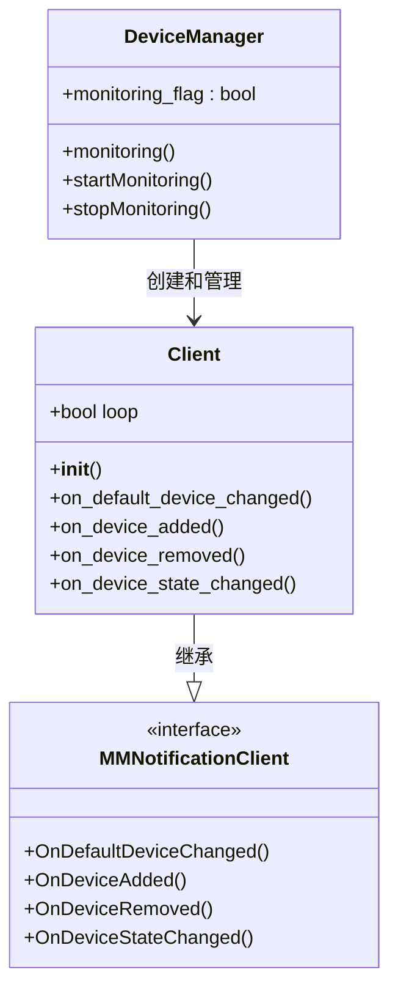
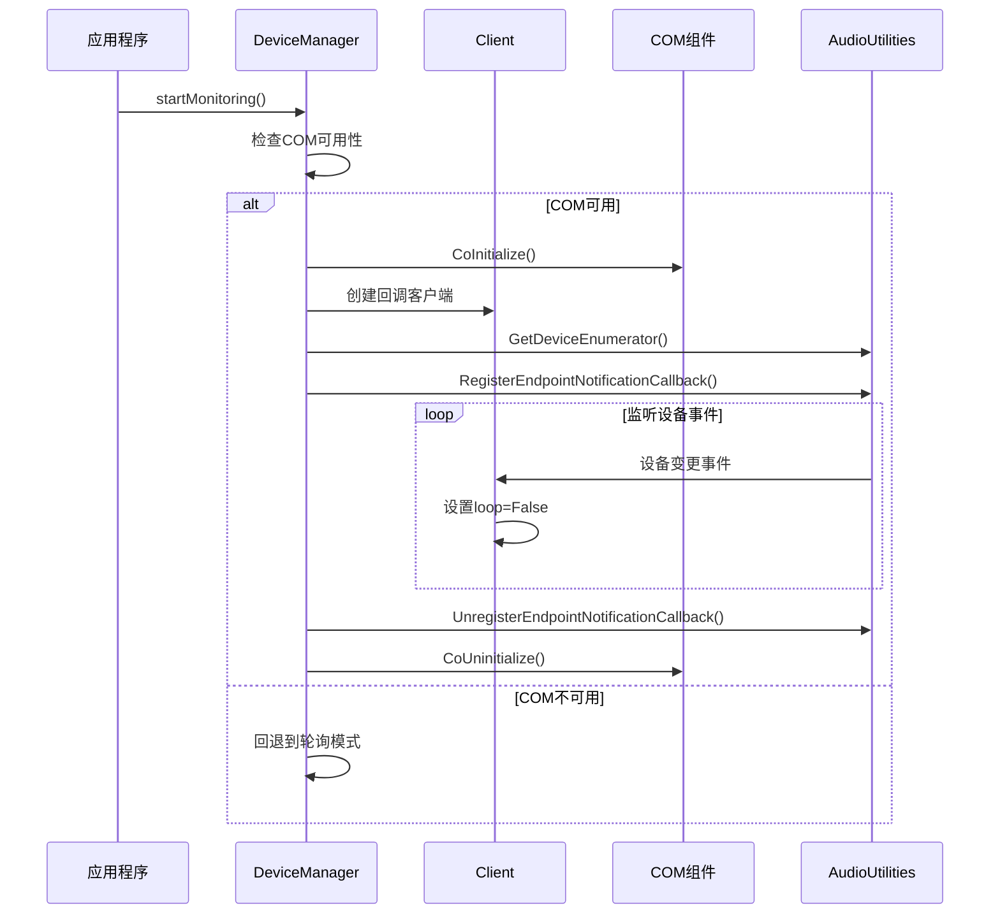
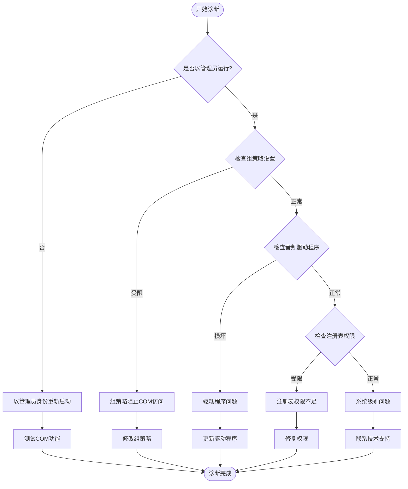
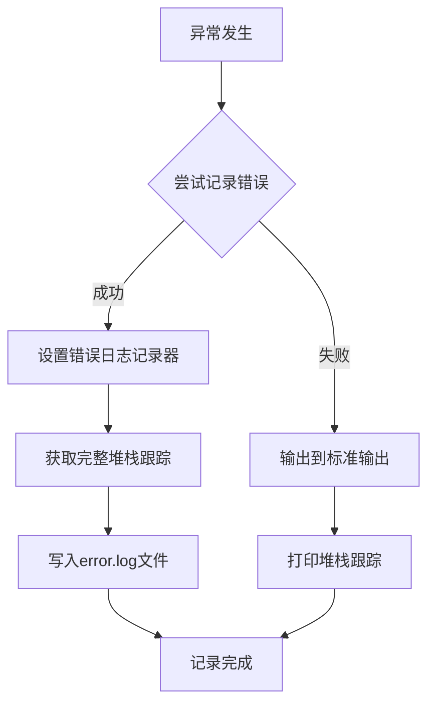
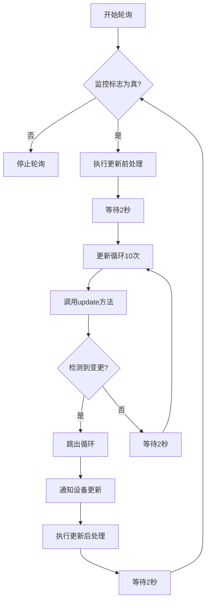

# 权限与COM初始化问题

<cite>
**本文档中引用的文件**
- [device_manager.py](file://src-python/device_manager.py)
- [utils.py](file://src-python/utils.py)
- [mainloop.py](file://src-python/mainloop.py)
- [controller.py](file://src-python/controller.py)
- [config.py](file://src-python/config.py)
- [device_manager_zh.md](file://src-python/docs/device_manager_zh.md)
- [device_manager.md](file://src-python/docs/device_manager.md)
</cite>

## 目录
1. [概述](#概述)
2. [问题背景](#问题背景)
3. [COM事件回调机制分析](#com事件回调机制分析)
4. [权限问题诊断](#权限问题诊断)
5. [错误处理与日志记录](#错误处理与日志记录)
6. [解决方案与配置建议](#解决方案与配置建议)
7. [故障排除指南](#故障排除指南)
8. [最佳实践](#最佳实践)

## 概述

VRCT项目中的设备管理器（device_manager.py）负责音频设备的检测和监控，特别是扬声器设备的监听功能。该模块依赖于Windows的COM组件和WASAPI技术来实现高效的设备变更检测。当遇到权限不足或COM初始化失败时，可能导致扬声器监听功能失效。

本文档深入分析了COM事件回调机制的工作原理，解释了权限限制的影响，并提供了完整的故障排除和解决方案。

## 问题背景

### 核心问题描述

在VRCT应用中，扬声器监听功能依赖于以下关键技术栈：
- **COM组件**：用于Windows音频设备的事件通知
- **WASAPI**：Windows音频处理API
- **pycaw库**：Python的Windows音频API封装
- **comtypes**：Python的COM互操作库

当这些组件无法正常初始化或运行时，会出现以下症状：
- 扬声器设备列表无法正确更新
- 设备变更事件无法及时响应
- 应用程序显示"NoDevice"或默认设备
- 日志中出现"CoInitialize failed"或"Access is denied"错误

### 影响范围

这些问题主要影响以下功能：
- 自动扬声器设备选择
- 实时设备变更检测
- 扬声器音量监控
- 跨进程音频共享

## COM事件回调机制分析

### Client类的事件处理架构



**图表来源**
- [device_manager.py](file://src-python/device_manager.py#L26-L55)

### COM初始化生命周期



**图表来源**
- [device_manager.py](file://src-python/device_manager.py#L266-L300)

### 关键代码分析

#### COM初始化时机

COM组件的初始化和清理必须严格配对：

```python
# COM初始化（第273行）
comtypes.CoInitialize()

# COM清理（第285行）
comtypes.CoUninitialize()
```

这种配对确保：
- **资源管理**：正确释放COM资源
- **线程安全**：避免多线程环境下的资源竞争
- **稳定性**：防止内存泄漏和句柄泄露

#### 错误处理机制

```python
# 第286-288行：COM监控失败时的回退机制
except Exception:
    errorLogging()  # 记录错误
    # 回退到轮询模式
```

**章节来源**
- [device_manager.py](file://src-python/device_manager.py#L266-L300)

## 权限问题诊断

### 可能的权限限制场景

#### 1. 管理员权限需求

某些Windows音频功能需要管理员权限：

| 场景 | 描述 | 解决方案 |
|------|------|----------|
| 设备枚举失败 | `AudioUtilities.GetDeviceEnumerator()` 返回None | 以管理员身份运行 |
| COM初始化失败 | `comtypes.CoInitialize()` 抛出Access Denied | 提升进程权限 |
| WASAPI访问被拒绝 | 音频驱动程序访问受限 | 检查组策略设置 |

#### 2. 系统策略限制

企业环境中的组策略可能限制COM组件访问：



#### 3. 防火墙和安全软件干扰

某些安全软件可能阻止COM组件的正常工作：

- **Windows Defender**：可能误报COM组件为恶意软件
- **第三方防火墙**：阻止音频服务的网络访问
- **杀毒软件**：扫描COM动态链接库时造成延迟

**章节来源**
- [device_manager_zh.md](file://src-python/docs/device_manager_zh.md#978-1076)

## 错误处理与日志记录

### errorLogging()函数分析

utils.py中的errorLogging()函数提供了统一的错误记录机制：



**图表来源**
- [utils.py](file://src-python/utils.py#L280-L290)

### 关键错误信息识别

#### 常见错误模式

| 错误类型 | 异常信息 | 可能原因 | 解决方向 |
|----------|----------|----------|----------|
| CoInitialize失败 | "CoInitialize failed" | COM未正确安装或权限不足 | 检查COM注册和权限 |
| 访问被拒绝 | "Access is denied" | 管理员权限不足 | 以管理员身份运行 |
| 设备枚举失败 | "NoneType"错误 | AudioUtilities不可用 | 检查pycaw安装 |
| COM未初始化 | "COM not initialized" | 调用顺序错误 | 检查初始化流程 |

#### 日志分析技巧

通过分析error.log文件可以识别问题模式：

```python
# 示例错误模式识别
def analyze_error_log(log_file='error.log'):
    with open(log_file, 'r') as f:
        log_content = f.read()
    
    # 检测COM相关错误
    if 'CoInitialize failed' in log_content:
        return 'COM初始化失败'
    elif 'Access is denied' in log_content:
        return '权限不足'
    elif 'AudioUtilities' in log_content:
        return '音频API问题'
    
    return '其他类型错误'
```

**章节来源**
- [utils.py](file://src-python/utils.py#L280-L290)

## 解决方案与配置建议

### 降级到轮询模式的配置

当COM初始化失败时，设备管理器会自动降级到轮询模式。这是最可靠的回退机制。

#### 轮询模式的工作原理



**图表来源**
- [device_manager.py](file://src-python/device_manager.py#L290-L300)

#### 配置参数调整

轮询模式的关键参数可以在源码中找到：

- **轮询间隔**：2秒（第293行）
- **最大轮询次数**：10次（第294-296行）
- **总等待时间**：最多20秒（第298行）

### 管理员权限提升方案

#### 方法一：以管理员身份运行

```python
# 检查当前权限并提示提升
import ctypes
import sys

def is_admin():
    try:
        return ctypes.windll.shell32.IsUserAnAdmin()
    except:
        return False

if not is_admin():
    # 以管理员身份重新启动
    ctypes.windll.shell32.ShellExecuteW(None, "runas", sys.executable, " ".join(sys.argv), None, 1)
```

#### 方法二：修改应用程序清单

在Tauri配置中添加管理员请求：

```json
{
  "tauri": {
    "bundle": {
      "windows": {
        "certificateThumbprint": null,
        "digestAlgorithm": "sha256",
        "timestampUrl": "",
        "wix": {
          "template": "src-tauri/bundle/windows/installer.wxl",
          "license": "LICENSE",
          "language": [
            1033
          ],
          "allowNonAdminUsers": false,
          "admin": true
        }
      }
    }
  }
}
```

### COM组件注册验证

#### 检查COM组件注册状态

```python
import winreg

def check_com_registration():
    """检查关键COM组件的注册状态"""
    com_classes = [
        r"HKCR\CLSID\{YOUR_COM_CLSID}",
        r"HKCR\CLSID\{ANOTHER_COM_CLSID}"
    ]
    
    results = {}
    for clsid_path in com_classes:
        try:
            with winreg.OpenKey(winreg.HKEY_CLASSES_ROOT, clsid_path) as key:
                results[clsid_path] = "已注册"
        except WindowsError:
            results[clsid_path] = "未注册"
    
    return results
```

#### 重新注册COM组件

```python
import subprocess

def register_com_component(dll_path):
    """重新注册COM组件"""
    try:
        subprocess.run(['regsvr32', '/s', dll_path], check=True)
        return True
    except subprocess.CalledProcessError:
        return False
```

**章节来源**
- [device_manager.py](file://src-python/device_manager.py#L266-L300)

## 故障排除指南

### 诊断步骤

#### 第一步：检查基本功能

```python
# 基础功能测试
def basic_functionality_test():
    """测试设备管理器的基本功能"""
    from device_manager import device_manager
    
    try:
        # 测试初始化
        device_manager.init()
        
        # 获取设备列表
        mic_devices = device_manager.getMicDevices()
        speaker_devices = device_manager.getSpeakerDevices()
        
        print(f"麦克风设备数量: {len(mic_devices)}")
        print(f"扬声器设备数量: {len(speaker_devices)}")
        
        return True
    except Exception as e:
        print(f"基础功能测试失败: {e}")
        return False
```

#### 第二步：COM组件诊断

```python
# COM组件诊断
def com_diagnostics():
    """诊断COM组件状态"""
    diagnostics = {}
    
    # 检查comtypes
    try:
        import comtypes
        diagnostics['comtypes'] = '可用'
    except ImportError:
        diagnostics['comtypes'] = '缺失'
    
    # 检查pycaw
    try:
        from pycaw.utils import AudioUtilities
        diagnostics['pycaw'] = '可用'
    except ImportError:
        diagnostics['pycaw'] = '缺失'
    
    # 测试COM初始化
    if 'comtypes' in diagnostics and diagnostics['comtypes'] == '可用':
        try:
            comtypes.CoInitialize()
            comtypes.CoUninitialize()
            diagnostics['com_init'] = '成功'
        except Exception as e:
            diagnostics['com_init'] = f'失败: {e}'
    
    return diagnostics
```

#### 第三步：权限检查

```python
# 权限检查
def permission_check():
    """检查关键权限"""
    permissions = {}
    
    # 检查音频设备访问
    try:
        import win32com.client
        shell = win32com.client.Dispatch("WScript.Shell")
        permissions['audio_access'] = '可用'
    except Exception as e:
        permissions['audio_access'] = f'受限: {e}'
    
    # 检查注册表访问
    try:
        import winreg
        with winreg.OpenKey(winreg.HKEY_LOCAL_MACHINE, r'SOFTWARE\Microsoft\Windows\CurrentVersion') as key:
            permissions['registry_access'] = '可用'
    except Exception as e:
        permissions['registry_access'] = f'受限: {e}'
    
    return permissions
```

### 常见问题快速解决

#### 问题1：COM初始化失败

**症状**：日志中出现"CoInitialize failed"错误

**解决方案**：
1. 以管理员身份重新启动应用程序
2. 检查Windows COM组件是否损坏
3. 运行`sfc /scannow`修复系统文件

#### 问题2：访问被拒绝

**症状**：出现"Access is denied"错误

**解决方案**：
1. 右键点击应用程序图标，选择"以管理员身份运行"
2. 检查Windows Defender设置，将应用程序添加到排除列表
3. 暂时禁用第三方安全软件进行测试

#### 问题3：设备列表为空

**症状**：应用程序显示"NoDevice"或空列表

**解决方案**：
1. 确认音频设备已正确连接
2. 检查设备管理器中的音频设备状态
3. 更新音频驱动程序
4. 启用隐藏设备查看

**章节来源**
- [device_manager_zh.md](file://src-python/docs/device_manager_zh.md#978-1076)

## 最佳实践

### 开发环境配置

#### 1. 虚拟环境隔离

```python
# 创建隔离的开发环境
import venv
import os

def create_isolated_env(env_path):
    """创建隔离的虚拟环境"""
    venv.create(env_path, with_pip=True)
    
    # 安装必要的依赖
    pip_path = os.path.join(env_path, 'Scripts', 'pip.exe')
    os.system(f'{pip_path} install comtypes pycaw pyaudiowpatch')
```

#### 2. 权限测试自动化

```python
# 自动化权限测试
def automated_permission_test():
    """自动化权限测试流程"""
    test_results = {
        'com_initialization': False,
        'device_enumeration': False,
        'audio_access': False
    }
    
    # 测试COM初始化
    try:
        import comtypes
        comtypes.CoInitialize()
        comtypes.CoUninitialize()
        test_results['com_initialization'] = True
    except Exception:
        pass
    
    # 测试设备枚举
    try:
        from pycaw.utils import AudioUtilities
        enumerator = AudioUtilities.GetDeviceEnumerator()
        test_results['device_enumeration'] = enumerator is not None
    except Exception:
        pass
    
    return test_results
```

### 生产环境部署

#### 1. 权限预检查

```python
# 部署前权限检查
def pre_deployment_check():
    """部署前的权限检查"""
    issues = []
    
    # 检查管理员权限
    if not is_admin():
        issues.append("缺少管理员权限")
    
    # 检查COM组件
    com_status = check_com_registration()
    if any("未注册" in status for status in com_status.values()):
        issues.append("COM组件未正确注册")
    
    # 检查关键DLL
    dll_files = ['ole32.dll', 'oleaut32.dll', 'comctl32.dll']
    for dll in dll_files:
        if not os.path.exists(os.path.join(os.environ['SYSTEMROOT'], 'System32', dll)):
            issues.append(f"系统DLL {dll} 缺失")
    
    return issues
```

#### 2. 优雅降级策略

```python
# 优雅降级实现
class GracefulFallback:
    """优雅降级策略实现"""
    
    def __init__(self):
        self.primary_enabled = True
        self.fallback_interval = 5  # 轮询间隔（秒）
    
    def primary_operation(self):
        """尝试主操作（COM事件驱动）"""
        try:
            # 尝试COM初始化
            import comtypes
            comtypes.CoInitialize()
            
            # 执行主操作...
            result = self.execute_primary_logic()
            
            comtypes.CoUninitialize()
            return result
            
        except Exception:
            self.primary_enabled = False
            return self.fallback_operation()
    
    def fallback_operation(self):
        """备用操作（轮询模式）"""
        # 实现轮询逻辑...
        pass
```

### 监控和维护

#### 1. 性能监控

```python
# 性能监控
import time
import psutil

class DeviceManagerMonitor:
    """设备管理器性能监控"""
    
    def __init__(self):
        self.metrics = {
            'com_init_time': [],
            'polling_latency': [],
            'memory_usage': []
        }
    
    def monitor_com_initialization(self):
        """监控COM初始化性能"""
        start_time = time.time()
        
        try:
            import comtypes
            comtypes.CoInitialize()
            comtypes.CoUninitialize()
            
            elapsed = time.time() - start_time
            self.metrics['com_init_time'].append(elapsed)
            
            return elapsed < 1.0  # 1秒内完成视为正常
        except Exception:
            return False
    
    def get_performance_summary(self):
        """获取性能摘要"""
        return {
            'avg_com_init_time': sum(self.metrics['com_init_time']) / len(self.metrics['com_init_time']),
            'memory_usage_mb': psutil.Process().memory_info().rss / 1024 / 1024
        }
```

#### 2. 自动修复机制

```python
# 自动修复
class AutoRepair:
    """自动修复机制"""
    
    def __init__(self):
        self.repair_attempts = 0
        self.max_repair_attempts = 3
    
    def attempt_repair(self):
        """尝试自动修复"""
        self.repair_attempts += 1
        
        if self.repair_attempts > self.max_repair_attempts:
            return False
        
        repair_actions = [
            self.restart_audio_service,
            self.rebuild_com_cache,
            self.reset_audio_drivers
        ]
        
        for action in repair_actions:
            if action():
                return True
        
        return False
    
    def restart_audio_service(self):
        """重启音频服务"""
        try:
            import subprocess
            subprocess.run(['net', 'stop', 'Audiosrv'], check=True)
            subprocess.run(['net', 'start', 'Audiosrv'], check=True)
            return True
        except:
            return False
```

通过遵循这些最佳实践，可以显著提高VRCT应用在各种环境下的稳定性和可靠性，特别是在面对权限限制和COM初始化问题时。